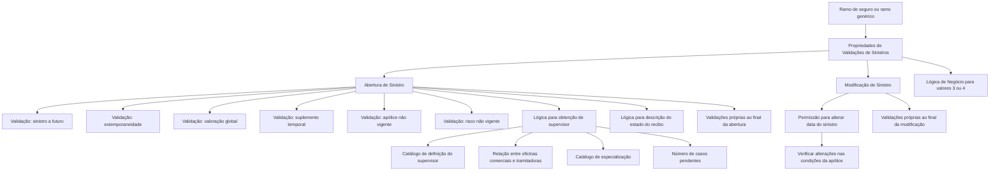

# Definição de Validações de Sinistros — Propriedades, Regras e Lógicas de Negócio

## 1. Metadados do Documento
- **Arquivo de Origem:** Não identificado no texto bruto extraído
- **Tipo de Documento:** Especificação Técnica / Manual Funcional
- **Domínio / Sistema:** Reef — operações de tramitação e abertura de sinistros
- **Público-Alvo:** Analistas funcionais, desenvolvedores, arquitetos, equipes de operação e parametrização
- **Data/Versão Identificada:** Não identificada

---

## 2. Resumo Executivo & Contexto de Negócio

O documento define propriedades de configuração para validações aplicáveis às operações de tramitação de sinistros. O objetivo declarado é identificar quais comportamentos funcionais dessas operações podem ser variados ou condicionados de acordo com o ramo de seguro.

As propriedades permitem estabelecer regras distintas por ramo e executar validações adicionais específicas. Quando vários ramos possuem as mesmas validações, o documento informa que é possível definir o comportamento para um ramo genérico, abrangendo todos os ramos.

As regras descritas concentram-se especialmente na abertura e modificação de sinistros: abertura de sinistro com data futura, validação de extemporaneidade, solicitação de valoração global, alteração da data de ocorrência, tratamento de suplementos temporais e possibilidade de sinistrar apólices ou riscos não vigentes fora do contexto de transportes.

O modelo de parametrização usa valores afirmativos e negativos, identificados como `1: Si` e `2: No`. Algumas propriedades também admitem os valores `3` ou `4`, que exigem uma lógica de negócio complementar baseada na avaliação de outros fatores. O documento não especifica a diferença semântica entre os valores `3` e `4`.

Além das validações diretas, o documento prevê lógicas customizáveis para atribuição de supervisor, descrição de estado de recibo e validações próprias de cada país ao final da abertura ou modificação de sinistros.

---

## 3. Arquitetura, Componentes & Tecnologias Envolvidas

O conteúdo descreve uma configuração funcional de validações de sinistros no contexto do sistema Reef. Não há detalhamento de arquitetura de software, APIs, métodos HTTP, contratos JSON, bancos de dados, servidores, portas, URLs técnicas ou tecnologias de implementação.

Os elementos funcionais identificados são:

- Propriedades de validação configuráveis por ramo.
- Operação de abertura de sinistros.
- Operação de modificação de sinistros.
- Lógicas de negócio condicionais.
- Catálogos de suporte à atribuição de supervisor.
- Catálogo de definição do supervisor.
- Catálogo de relação entre oficinas comerciais e tramitadoras.
- Catálogo de especialização de supervisores.
- Número de casos pendentes atribuídos ao supervisor.
- Lógica de descrição de estado de recibo.
- Validações próprias por país.



> **Nota de Análise:** O documento menciona o sistema Reef e a documentação Mapfre, mas não detalha a implementação técnica das propriedades, a persistência das configurações, interfaces de manutenção, serviços envolvidos ou contratos de integração.

---

## 4. Regras de Negócio, Especificações Funcionais & Processos

### 4.1 Configuração por ramo

A propriedade **Ramo** contém a chave do ramo para o qual estão sendo definidas validações extras ou o comportamento da tramitação de sinistros.

Quando vários ramos compartilham as mesmas validações, a definição pode ser criada para o ramo genérico, aplicável a todos os ramos.

### 4.2 Abertura de sinistros a futuro

A propriedade **Se podem abrir sinistros a Futuro** determina, durante a abertura de sinistro, se é permitido registrar um sinistro cuja data de ocorrência seja posterior ao dia atual.

Os valores diretamente documentados são:

- `1`: Sim.
- `2`: Não.
- `3` ou `4`: requerem lógica de negócio que avalie outros fatores.

Quando a configuração correspondente tiver valor `3` ou `4`, a decisão não é fixa como “Sim” ou “Não”; uma lógica de negócio deve determinar se a abertura de sinistro futuro será permitida.

### 4.3 Validação de extemporaneidade

A propriedade **Valida Extemporaneidad** informa se o sistema deve considerar a extemporaneidade no momento de abrir o sinistro.

A extemporaneidade corresponde à consideração do número máximo de dias que pode transcorrer entre:

1. a data de ocorrência do sinistro; e
2. a data de comunicação ou denúncia à companhia.

Os valores diretamente documentados são:

- `1`: Sim.
- `2`: Não.
- `3` ou `4`: requerem lógica de negócio dependente de outros fatores.

O documento não informa o valor do número máximo de dias, a fonte desse parâmetro ou a ação tomada caso a extemporaneidade seja identificada.

### 4.4 Solicitação de valoração do sinistro

A propriedade **Permite Valorar Siniestro** define se, na abertura do sinistro, será solicitada uma valoração global.

Quando a valoração não é permitida, a abertura de sinistros não solicita a valoração do sinistro.

Os valores diretamente documentados são:

- `1`: Sim.
- `2`: Não.
- `3` ou `4`: requerem lógica de negócio para determinar se a valoração global será solicitada.

### 4.5 Alteração da data do sinistro

A propriedade **Permite Modificar Fecha del Siniestro** define se a data de ocorrência pode ser alterada a partir da operação de modificação do sinistro.

Os valores diretamente documentados são:

- `1`: Sim.
- `2`: Não.
- `3` ou `4`: requerem lógica de negócio dependente da avaliação de outros fatores.

Se a modificação da data for permitida e a data de ocorrência do sinistro for alterada, a operação de modificação deve verificar se as condições da apólice foram modificadas em relação à data anteriormente informada.

O documento não detalha quais condições da apólice devem ser comparadas, como a comparação é realizada ou qual consequência ocorre quando houver alteração nas condições.

### 4.6 Sinistros envolvendo suplementos temporais

A propriedade **¿Permite Siniestrar Suplementos Temporales?** define se é permitido abrir sinistro para um suplemento temporário.

O documento afirma que, normalmente, essa propriedade deveria ser afirmativa. A justificativa é que muitos suplementos temporários são realizados para reforçar cobertura durante determinado período, por exemplo, férias ou períodos especiais com circunstâncias específicas, para que haja cobertura em caso de sinistro.

A propriedade é utilizada de forma restritiva apenas em algumas instalações e para determinados ramos específicos nos quais suplementos temporários são definidos para cálculos internos ou regularizações e não devem ser considerados na abertura de um sinistro.

Os valores diretamente documentados são:

- `1`: Sim.
- `2`: Não.
- `3` ou `4`: requerem lógica de negócio dependente de outros fatores.

### 4.7 Sinistro para apólice não vigente — não transportes

A propriedade **¿Permite Siniestrar Póliza No Vigente NO TRANSPORTE?** informa à abertura de sinistros se é permitido registrar um sinistro para uma apólice que não esteja vigente na data do sinistro.

O documento indica que essa configuração somente deveria ser afirmativa em ramos de Vida. O caso descrito é a anulação da apólice devido à morte do segurado, situação em que ainda é necessário abrir o sinistro e efetuar o pagamento aos beneficiários.

Nesse cenário, a data do sinistro corresponde à data de morte do segurado.

Os valores diretamente documentados são:

- `1`: Sim.
- `2`: Não.
- `3` ou `4`: requerem lógica de negócio dependente de outros fatores.

A regra é aplicável quando a apólice possui somente um risco. Caso a apólice possua vários riscos, a entidade anulada seria o risco, devendo ser usada ou programada a validação da propriedade **Permite Siniestrar Riesgo No Vigente NO TRANSPORTES**.

### 4.8 Sinistro para risco não vigente — não transportes

A propriedade **Permite Siniestrar Riesgo No Vigente NO TRANSPORTES** determina se a abertura de sinistros permite sinistrar um risco que, na data do sinistro, não esteja vigente.

O documento indica que esse parâmetro somente deveria ser afirmativo em ramos de Vida, pois o risco pode ser anulado pela morte do segurado, mas ainda assim deve ser possível abrir o sinistro e pagar os beneficiários.

Nesse caso, a data do sinistro corresponde à data de morte do segurado.

Os valores diretamente documentados são:

- `1`: Sim.
- `2`: Não.
- `3` ou `4`: requerem lógica de negócio dependente de outros fatores.

Essa regra é aplicável a apólices com vários riscos. Caso exista somente um risco, a entidade anulada seria a própria apólice.

### 4.9 Lógica para obtenção de supervisor

A propriedade **Lógica para obter supervisor** contém a lógica de negócio que determina a qual supervisor um sinistro deve ser atribuído no momento de sua abertura.

Inicialmente, o processo possui uma lógica de núcleo atribuída. A lógica de núcleo é baseada nos seguintes catálogos e critérios:

1. Catálogo de definição do supervisor.
2. Catálogo de relação entre oficinas comerciais e tramitadoras.
3. Catálogo de especialização dos supervisores.
4. Número de casos pendentes atribuídos ao supervisor.

O documento não descreve a ordem de avaliação desses critérios, fórmula de priorização, critérios de desempate ou mecanismo de substituição da lógica de núcleo.

### 4.10 Lógica para descrição do estado do recibo

A propriedade **Lógica para obter descrição do Estado do Recibo** contém uma lógica para atribuir uma descrição quando a apólice puder ser emitida sem recibo.

O documento cita que, em alguns países, a apólice é emitida sem recibo. Nesses casos, a lógica pode retornar a descrição `SR- Sin Recibo`.

### 4.11 Validações próprias por país

A propriedade **Lógica para validaciones Propias al Final Apertura Siniestros** permite que uma instalação adicione validações próprias do país ao final da abertura de sinistros.

A propriedade **Lógica para validaciones Propias al Final de Modificación de Siniestros** permite que uma instalação adicione validações próprias do país ao final da modificação de sinistros.

> **Nota de Análise:** O documento não detalha quais validações nacionais podem ser incluídas, em que ordem são executadas, quais dados recebem ou quais respostas devem retornar.

---

## 5. Tabelas de Parâmetros, Ambientes e Estruturas de Dados

| Item / Parâmetro | Descrição / Função | Tipo / Valores / Formato | Ambiente / Observações |
| :--- | :--- | :--- | :--- |
| Ramo | Contém a chave do ramo para o qual são definidas validações extras ou comportamento da tramitação de sinistros. | Chave de ramo; ramo genérico para todos os ramos. | Quando vários ramos compartilham validações, pode-se usar ramo genérico. |
| Se podem abrir sinistros a Futuro | Determina se é permitido registrar sinistro com data de ocorrência posterior ao dia atual. | `1: Si`; `2: No`; `3,4: Lógica de Negocio`. | Aplicável durante a abertura de sinistros. |
| Lógica que determina se se podem abrir sinistros a Futuro | Define a decisão quando a propriedade anterior contém `3` ou `4`. | Lógica de negócio baseada em outros fatores. | O documento não detalha os fatores avaliados. |
| Valida Extemporaneidad | Determina se a extemporaneidade será considerada na abertura do sinistro. | `1: Si`; `2: No`; `3,4: Lógica de Negocio`. | Considera o máximo de dias entre a data de ocorrência e a data de denúncia à companhia. |
| Lógica que determina se se valida a Extemporaneidad | Define a decisão quando a propriedade de extemporaneidade contém `3` ou `4`. | Lógica de negócio baseada em outros fatores. | Não há detalhamento dos fatores nem do número máximo de dias. |
| Permite Valorar Siniestro | Determina se a abertura solicita uma valoração global do sinistro. | `1: Si`; `2: No`; `3,4: Lógica de Negocio`. | Se não permitido, a abertura não solicita valoração. |
| Lógica que determina se se permite Valorar Siniestro | Define se a valoração global será solicitada quando a propriedade anterior contém `3` ou `4`. | Lógica de negócio. | Não há critérios detalhados. |
| Permite Modificar Fecha del Siniestro | Determina se a data de ocorrência pode ser modificada na modificação do sinistro. | `1: Si`; `2: No`; `3,4: Lógica de Negocio`. | Após alteração permitida, devem ser verificadas mudanças nas condições da apólice. |
| Lógica que determina se se permite Modificar Fecha del Siniestro | Define a decisão para valores `3` ou `4`. | Lógica de negócio baseada em outros fatores. | Não há detalhamento dos fatores. |
| ¿Permite Siniestrar Suplementos Temporales? | Determina se é permitido sinistrar suplemento temporal. | `1: Si`; `2: No`; `3,4: Lógica de Negocio`. | Normalmente deveria ser afirmativo; algumas instalações usam suplementos para cálculos internos ou regularizações. |
| Lógica que determina se se permite siniestrar Suplementos Temporales | Define a decisão para valores `3` ou `4`. | Lógica de negócio baseada em outros fatores. | Não há detalhamento dos fatores. |
| ¿Permite Siniestrar Póliza No Vigente NO TRANSPORTE? | Determina se se pode abrir sinistro para apólice não vigente na data do sinistro. | `1: Si`; `2: No`; `3,4: Lógica de Negocio`. | Deveria ser afirmativo apenas em ramos de Vida; aplicável a apólice com um único risco. |
| Lógica que determina se se permite siniestrar Póliza No Vigente NO TRANSPORTES | Define a decisão para valores `3` ou `4`. | Lógica de negócio baseada em outros fatores. | Para apólice com vários riscos, deve-se aplicar validação de risco não vigente. |
| Permite Siniestrar Riesgo No Vigente NO TRANSPORTES | Determina se se pode sinistrar risco não vigente na data do sinistro. | `1: Si`; `2: No`; `3,4: Lógica de Negocio`. | Deveria ser afirmativo apenas em ramos de Vida; aplicável a apólices com vários riscos. |
| Lógica que determina se se permite siniestrar Riesgo No Vigente NO TRANSPORTES | Define a decisão para valores `3` ou `4`. | Lógica de negócio baseada em outros fatores. | Não há detalhamento dos fatores. |
| Lógica para obter supervisor | Determina o supervisor a ser atribuído na abertura do sinistro. | Lógica de negócio. | A lógica de núcleo usa catálogos e o número de casos pendentes. |
| Lógica para obter descrição do Estado do Recibo | Atribui descrição quando a apólice pode ser emitida sem recibo. | Lógica de negócio; exemplo: `SR- Sin Recibo`. | Aplicável em países nos quais a apólice sai sem recibo. |
| Lógica para validaciones Propias al Final Apertura Siniestros | Permite adicionar validações próprias do país ao fim da abertura. | Lógica de negócio. | Não há regras nacionais específicas documentadas. |
| Lógica para validaciones Propias al Final de Modificación de Siniestros | Permite adicionar validações próprias do país ao fim da modificação. | Lógica de negócio. | Não há regras nacionais específicas documentadas. |

### Catálogos usados pela lógica de núcleo de atribuição de supervisor

| Item / Parâmetro | Descrição / Função | Tipo / Valores / Formato | Ambiente / Observações |
| :--- | :--- | :--- | :--- |
| Catálogo de definição do supervisor | Apoia a lógica de núcleo para determinar o supervisor. | Catálogo. | Critérios internos não detalhados. |
| Relação entre oficinas comerciais e tramitadoras | Apoia a lógica de núcleo para atribuir supervisor. | Catálogo de relacionamento. | Não há estrutura de campos informada. |
| Catálogo de especialização dos supervisores | Apoia a lógica de núcleo para selecionar supervisor. | Catálogo. | Não há critérios de especialização informados. |
| Número de casos pendentes do supervisor | Apoia a lógica de núcleo para atribuir supervisor. | Quantidade de casos pendentes. | O documento não define a regra de balanceamento. |

---

## 6. Bateria de Perguntas & Respostas para RAG (FAQ Sintético)

### P1: Como o sistema determina quais validações de sinistro aplicar a um ramo de seguro?
**R:** O sistema usa a propriedade **Ramo**, que contém a chave do ramo para o qual são definidas validações extras ou o comportamento da tramitação de sinistros. Quando vários ramos possuem as mesmas validações, a definição pode ser criada para um ramo genérico aplicável a todos os ramos.

### P2: É possível abrir um sinistro com data de ocorrência futura?
**R:** Sim, desde que a propriedade **Se podem abrir sinistros a Futuro** permita essa operação. O valor `1` significa “Sim” e o valor `2` significa “Não”. Se a propriedade tiver valor `3` ou `4`, uma lógica de negócio deve decidir com base em outros fatores. O documento não detalha quais são esses fatores.

### P3: O que significa validar extemporaneidade na abertura de sinistro?
**R:** Validar extemporaneidade significa considerar o número máximo de dias transcorridos entre a data de ocorrência do sinistro e a data de denúncia à companhia. A propriedade **Valida Extemporaneidad** indica se essa validação será considerada durante a abertura do sinistro.

### P4: Quando a abertura de sinistro solicita uma valoração global?
**R:** A solicitação depende da propriedade **Permite Valorar Siniestro**. Se a propriedade permitir a valoração, a abertura solicita uma valoração global do sinistro. Se a propriedade não permitir, a abertura não solicita essa valoração. Para valores `3` ou `4`, uma lógica de negócio define a decisão.

### P5: O que deve ocorrer depois que a data de ocorrência de um sinistro é modificada?
**R:** Quando a alteração da data for permitida e a data de ocorrência for modificada, a operação de modificação de sinistro deve verificar se as condições da apólice mudaram em relação à data anteriormente informada. O documento não especifica quais condições devem ser comparadas nem qual ação deve ser tomada em caso de divergência.

### P6: Em quais situações deve ser permitido sinistrar suplementos temporais?
**R:** O documento indica que, normalmente, a propriedade **¿Permite Siniestrar Suplementos Temporales?** deveria ser afirmativa, pois suplementos temporários podem reforçar a cobertura em férias ou períodos especiais. A permissão pode ser negada em algumas instalações e ramos específicos quando os suplementos forem usados somente para cálculos internos ou regularizações que não devem ser considerados na abertura do sinistro.

### P7: Quando uma apólice não vigente pode ser sinistrada em operações não relacionadas a transportes?
**R:** A propriedade **¿Permite Siniestrar Póliza No Vigente NO TRANSPORTE?** deveria ser afirmativa somente em ramos de Vida. O cenário descrito é a anulação da apólice devido à morte do segurado, quando ainda é necessário abrir o sinistro e pagar os beneficiários. A data do sinistro corresponde à data de morte do segurado.

### P8: Qual é a diferença entre sinistrar apólice não vigente e risco não vigente?
**R:** A validação de apólice não vigente aplica-se ao caso de apólice com um único risco. Para apólices com vários riscos, o documento informa que o elemento anulado seria o risco, devendo ser usada a propriedade **Permite Siniestrar Riesgo No Vigente NO TRANSPORTES**. Se a apólice tiver apenas um risco, o elemento anulado é a própria apólice.

### P9: Quais informações são usadas pela lógica de núcleo para atribuir um supervisor a um sinistro?
**R:** A lógica de núcleo para obtenção de supervisor apoia-se em quatro elementos: catálogo de definição do supervisor, catálogo de relação entre oficinas comerciais e tramitadoras, catálogo de especialização dos supervisores e número de casos pendentes atribuídos ao supervisor.

### P10: O que representa a descrição `SR- Sin Recibo`?
**R:** `SR- Sin Recibo` é um exemplo de descrição que pode ser atribuída pela lógica para obter a descrição do estado do recibo quando uma apólice pode ser emitida sem recibo. O documento informa que essa situação ocorre em alguns países.

### P11: Como uma instalação pode incluir validações específicas de um país?
**R:** A instalação pode utilizar a propriedade **Lógica para validaciones Propias al Final Apertura Siniestros** para incluir validações próprias ao final da abertura de sinistros. Para a modificação de sinistros, a propriedade correspondente é **Lógica para validaciones Propias al Final de Modificación de Siniestros**.

### P12: Qual é o significado dos valores 3 e 4 nas propriedades de validação?
**R:** Quando uma propriedade possui valor `3` ou `4`, a decisão não é fixa como “Sim” ou “Não”. O documento determina que deve existir uma lógica de negócio baseada na avaliação de outros fatores. A diferença entre os valores `3` e `4` não é explicada no conteúdo fornecido.

---

## 7. Glossário de Termos, Siglas & Conceitos-Chave

- **Abertura de Sinistro:** Operação de registro inicial de um sinistro.
- **Apólice Não Vigente:** Apólice que não está vigente na data do sinistro.
- **Extemporaneidade:** Avaliação do tempo transcorrido entre a data de ocorrência do sinistro e a data de denúncia à companhia.
- **Lógica de Negócio:** Lógica usada para decidir o comportamento de uma propriedade quando os valores `3` ou `4` são utilizados ou quando uma regra customizada é requerida.
- **Lógica de Núcleo:** Lógica inicialmente atribuída para determinar o supervisor de um sinistro.
- **Modificação de Sinistro:** Operação que permite alterar informações de um sinistro já aberto, incluindo potencialmente a data de ocorrência.
- **Ramo:** Chave que identifica a linha ou ramo de seguro ao qual são aplicadas as validações.
- **Ramo Genérico:** Definição aplicável a todos os ramos quando compartilham as mesmas validações.
- **Risco Não Vigente:** Risco que não está vigente na data do sinistro.
- **SR:** Sigla apresentada na descrição `SR- Sin Recibo`; o texto associa a descrição a “Sin Recibo”, mas não expande formalmente a sigla.
- **Suplemento Temporal:** Suplemento realizado para reforçar a cobertura durante um período determinado; também pode ser utilizado para cálculos internos ou regularizações em algumas instalações.
- **Supervisor:** Entidade à qual um sinistro é atribuído na abertura, conforme lógica de negócio e catálogos de apoio.
- **Valoração Global:** Valoração solicitada na abertura do sinistro quando permitida pela respectiva propriedade.

---

## 8. Notas Críticas, Riscos & Limitações

- O documento não identifica nome de arquivo, data, versão, autor técnico, ambiente ou versão do sistema.
- A diferença entre os valores `3` e `4` não é documentada; ambos apenas indicam a necessidade de lógica de negócio.
- Não são detalhados os fatores avaliados pelas lógicas de negócio condicionais.
- Não há definição do número máximo de dias usado na validação de extemporaneidade.
- Não há especificação das condições de apólice que devem ser comparadas após alteração da data do sinistro.
- A ordem de execução, peso ou prioridade dos catálogos usados para atribuição de supervisor não é especificada.
- O documento não apresenta os campos, a origem, o modelo de dados ou a atualização dos catálogos de supervisores.
- Não há detalhamento das validações específicas de cada país que podem ser incluídas ao final da abertura ou modificação.
- Não há descrição de mensagens de erro, bloqueios operacionais, regras de auditoria ou comportamento transacional.
- Não são fornecidos exemplos técnicos, apesar de o texto conter marcações de “Ejemplo”.
- Há artefatos de extração no texto original, incluindo caracteres inválidos em palavras como “finalidad”, “definiciones”, “modificar” e “afirmativo”.
- **Nota de Análise:** O documento lista propriedades funcionais, mas não detalha métodos HTTP, contratos JSON, persistência, serviços, integrações, URLs, ambientes ou tecnologias de implementação.

---

## 9. Conteúdo Bruto Estruturado (Referência Fiel)

```text
--- [PÁGINA 1 DE 4] ---

DEFINICIÓN de VALIDACIONES SINIESTROS
Objetivo
La nalidad de este documento es conocer que Funcionales de las operaciones de tramitación de siniestros se pueden variar o condicionar.
Estas propiedades permiten deniciones diferentes por ramo y validaciones extras que se pueden realizar por ramo.
Imagen del Mantenimiento Validaciones de Siniestros:
Propiedades Validaciones de Siniestros
Ramo
Esta propiedad o atributo, contendrá la clave del ramo para el que estamos deniendo validaciones extras o el comportamiento de la
tramitación de siniestros. Si varios ramos tienen las mismas validaciones, se puede crear la denición para el ramo genérico (todos los
ramos).
Se pueden abrir siniestros a Futuro
Esta propiedad indicará, a la apertura de siniestros, si se va a permitir registrar un siniestro a futuro, es decir, si se puede registrar un siniestro
con una fecha de ocurrencia superior a la del día.
Los valores permitidos serán:
1: Si
2: No
Ejemplo:
Documentation / DOCUMENTACIÓN Reef
DOCUMENTACIÓN Reef
Mapfredocument
DOCUMENTACIÓN Reef
Owner
user:agonzalez_mapfre.com
Lifecycle
Approved Source
 /
 VL
Buscar Inicio Soluciones Arquitecturas APIs Componentes Cloud Documentación Zeus Reef Ayuda
ES


--- [PÁGINA 2 DE 4] ---

3,4: Lógica de Negocio
Lógica que determina si se pueden abrir siniestros a Futuro
Esta propiedad tendrá valor si la propiedad anterior contiene 3 ó 4. Si no es siempre Si o No, se tendrá que denir una lógica de Negocio, que
dependa de la evaluación de otros factores.
Valida Extemporaneidad
Esta propiedad indicará al sistema, si se tiene en cuenta la extemporaneidad en el momento de abrir el siniestro, es decir, si se tendrá en
cuenta el número máximo de días, que puede transcurrir entre la fecha de ocurrencia del siniestro y la fecha de denuncia a la compañía.
Los valores permitidos serán:
1: Si
2: No
3,4: Lógica de Negocio
Lógica que determina si se valida la Extemporaneidad
Esta propiedad tendrá valor si la propiedad anterior contiene un 3 ó 4. Si no es siempre "Si" o "No",se tendrá que denir una lógica de Negocio,
que dependa de la evaluación de otros factores.
Permite Valorar Siniestro
Esta propiedad indica si cuando se abra el siniestro, se va a pedir una valoración global del mismo. Si no se permite, la apertura de siniestros
no pedirá la valoración del siniestro.
Los valores permitidos serán:
1: Si
2: No
3,4: Lógica de Negocio
Lógica que determina si se permite Valorar Siniestro
Esta propiedad tendrá valor si la propiedad anterior contiene 3 ó 4. Si no es siempre "Si" o "No", contendrá una lógica que indica si cuando se
abra el siniestro, se va a pedir una valoración global del mismo. Si no se permite, la apertura de siniestros no pedirá la valoración del siniestro.
Permite Modicar Fecha del Siniestro
Esta propiedad indicará al sistema, si se puede modicar la fecha de ocurrencia desde la modicación del siniestro.
Los valores permitidos serán:
1: Si
2: No
3,4: Lógica de Negocio
Lógica que determina si se permite Modicar Fecha del Siniestro
Esta propiedad tendrá valor si la propiedad anterior contiene 3 ó 4. Si no es siempre "Si" o "No", se tendrá que denir una lógica de Negocio,
que dependa de la evaluación de otros factores.
Ejemplo:
Ejemplo:
Ejemplo:
Ejemplo:


--- [PÁGINA 3 DE 4] ---

Si se permite modicar la fecha, una vez modicada la fecha de ocurrencia del siniestro, la operación de Modicación de Siniestro,
comprobará que no haya cambiado las condiciones de la póliza con respecto a la fecha que se introdujo anteriormente.
¿Permite Siniestrar Suplementos Temporales?
Esta propiedad indica al sistema si se permite siniestrar un suplemento temporal. Normalmente esta propiedad debería de ser armativa, ya
que muchos suplementos temporales se hacen precisamente para reforzar la cobertura durante un tiempo determinado, por si hay un
siniestro.
Esto sólo es utilizado en algunas instalaciones, que para algunos ramos especícos, se han denido suplementos Temporales que son
para cálculos internos o regularizaciones que no se quiere tener en cuenta a la hora de abrir un siniestro. Pero lo normal es que los
asegurados realicen suplementos temporales si se van de vacaciones o para periodos especiales con circunstancias especiales, para que
les cubra en caso de siniestro.
Los valores permitidos serán:
1: Si
2: No
3,4: Lógica de Negocio
Lógica que determina si se permite siniestrar Suplementos Temporales
Esta propiedad tendrá valor si la propiedad anterior contiene 3 ó 4. Si no es siempre "Si" o "No",se tendrá que denir una lógica de Negocio
que dependa de la evaluación de otros factores.
¿Permite Siniestrar Póliza No Vigente NO TRANSPORTE?
Esta propiedad le indica a la apertura de siniestros, si se permite siniestrar una póliza que, a la fecha del siniestro, no está vigente.
Esta propiedad sólo debería ser armativo en Ramos de Vida, ya que se puede anular la póliza por la muerte del asegurado, pero hay que
abrir el siniestro y pagar a los beneciarios.
La fecha del siniestro se corresponde con la fecha de la muerte del asegurado.
Los valores permitidos serán:
1: Si
2: No
3,4: Lógica de Negocio
Lógica que determina si se Permite Siniestrar Póliza No Vigente NO TRANSPORTES
Esta propiedad tendrá valor si la propiedad anterior contiene 3 ó 4. Si no es siempre "Si" o "No",se tendrá que denir una lógica de Negocio
que dependa de la evaluación de otros factores.
!!! "Nota" Este caso, se da en las pólizas que sólo tienen un riesgo. Si tuviera varios riesgos, lo que estaría anulado sería el riesgo, por lo que
habría que programar la validación de la propiedad "permite siniestrar riesgo no vigente no transportes"
Permite Siniestrar Riesgo No Vigente NO TRANSPORTES
Esta propiedad le indica a la apertura de siniestros, si se permite siniestrar una póliza que, a la fecha del siniestro, no está vigente.
Ejemplo:
Nota
Ejemplo:
Nota


--- [PÁGINA 4 DE 4] ---

Este parámetro sólo debería ser armativo en Ramos de Vida, ya que se puede anular el riesgo por la muerte del asegurado, pero hay que
abrir el siniestro y pagar a los beneciarios.
La fecha del siniestro se corresponde con la fecha de la __muerte del asegurado.__de otros factores.
Los valores permitidos serán:
1: Si
2: No
3,4: Lógica de Negocio
Lógica que determina si se Permite Siniestrar Riesgo No Vigente NO TRANSPORTES
Esta propiedad tendrá valor si la propiedad anterior contiene 3 ó 4. Si no es siempre "Si" o "No",se tendrá que denir una lógica de Negocio
que dependa de la evaluación de otros factores.
Este caso, se da en las pólizas que tienen varios riesgos. Si tuviera un riesgo, lo que se anularía sería la póliza.
Lógica para obtener supervisor
Esta propiedad contendrá la lógica de Negocio que determinará cuando se abra un siniestro, a que supervisor se le debe asignar. Al iniciar
siempre tenemos asignado la lógica de núcleo.
La lógica de núcleo se apoya en varios catálogos:
1. Catálogo de denición del supervisor.
2. Catálogo de Relación entre las ocinas comerciales y tramitadoras.
3. Catálogo de Especialización de los supervisores.
4. Número de casos pendientes que tiene asignado el supervisor.
Lógica para obtener descripción del Estado del Recibo
Esta propiedad contendrá una lógica que en el caso de permitir que la póliza salga sin Recibo, la lógica le asigne una descripción.
Hay países que la póliza sale sin recibo y esta lógica devuelve SR- Sin Recibo.
Lógica para validaciones Propias al Final Apertura Siniestros
Esta propiedad contiene una lógica que permite a la instalación, añadir validaciones propias del País.
Lógica para validaciones Propias al Final de Modicación de Siniestros
Esta propiedad contiene una lógica que permite a la instalación, añadir validaciones propias del País.
Nota
Nota
```
