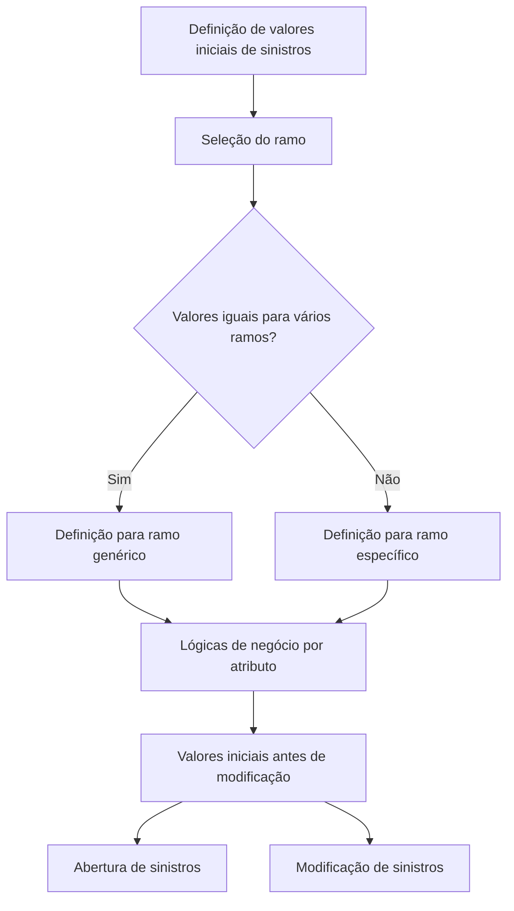

# Definição de Valores Iniciais de Sinistros

## 1. Metadados do Documento
- **Arquivo de Origem:** `Não identificado no conteúdo fornecido`
- **Tipo de Documento:** Especificação Funcional
- **Domínio / Sistema:** Reef / Mapfre — gestão de sinistros
- **Público-Alvo:** Analistas funcionais, desenvolvedores e equipes de operação de sinistros
- **Data/Versão Identificada:** Não identificada

---

## 2. Resumo Executivo & Contexto de Negócio

O documento descreve a definição de valores iniciais para atributos utilizados nas operações de sinistros. A finalidade é carregar valores padrão durante atividades como abertura e modificação de sinistros, antes que os valores possam ser alterados pelo processo ou pelo usuário.

A configuração de valores iniciais é associada a um ramo. Quando diversos ramos compartilham a mesma configuração, é possível definir os valores para o ramo genérico, aplicável a todos os ramos.

Cada atributo é determinado por uma lógica de negócio. O documento informa que determinadas colunas são instaladas inicialmente com uma lógica de núcleo, mas essas lógicas podem ser modificadas conforme as necessidades de cada instalação.

Os atributos contemplados incluem data e hora de ocorrência, data e hora de notificação, número de apólice, número de risco e número de aplicação. Valores padrão não são obrigatórios, porém podem reduzir tempo operacional em alguns atributos e são descritos como fáceis de programar.

---

## 3. Arquitetura, Componentes & Tecnologias Envolvidas

O conteúdo não descreve arquitetura técnica, microsserviços, APIs, tecnologias, URLs, bancos de dados ou ambientes de execução. O documento apresenta um mecanismo funcional de manutenção de valores iniciais de sinistros, baseado em regras de negócio configuráveis.

Componentes e conceitos identificados:

| Componente / Conceito | Papel identificado |
| :--- | :--- |
| Valores Iniciais de Sinistros | Configuração de valores padrão para atributos de sinistros. |
| Ramo | Chave que identifica o ramo para o qual os valores iniciais são definidos. |
| Ramo genérico | Definição aplicável a todos os ramos quando os valores iniciais são iguais. |
| Lógica de Negócio | Regra responsável por retornar o valor inicial de cada atributo. |
| Lógica de núcleo | Lógica instalada inicialmente em determinadas colunas e que pode ser alterada. |
| Operações de sinistro | Operações citadas: abertura de sinistros e modificação de sinistros. |
| Reef | Contexto de documentação apresentado no conteúdo. |
| Mapfre | Organização ou contexto documental mencionado no cabeçalho extraído. |



> **Nota de Análise:** O documento não detalha interfaces de manutenção, métodos HTTP, contratos JSON, persistência de configuração, regras de prioridade entre ramo específico e ramo genérico, nem o comportamento técnico da lógica de núcleo.

---

## 4. Regras de Negócio, Especificações Funcionais & Processos

### 4.1 Finalidade da definição de valores iniciais

A definição de valores iniciais permite carregar valores em operações realizadas no nível de sinistros. As operações explicitamente citadas são:

1. Abertura de sinistros.
2. Modificação de sinistros.
3. Outras operações de sinistros indicadas pelo termo “etc.”, sem detalhamento adicional.

Os valores retornados pelas lógicas de negócio representam o estado inicial dos atributos antes de qualquer modificação.

### 4.2 Regra de associação por ramo

- A propriedade **Ramo** contém a chave do ramo para o qual os valores iniciais estão sendo definidos.
- Quando vários ramos possuem os mesmos valores iniciais, é possível criar a definição para o **ramo genérico**, isto é, para todos os ramos.
- O documento não informa critérios de precedência entre uma configuração de ramo específico e uma configuração de ramo genérico.

### 4.3 Regras para data e hora de ocorrência

- A lógica de negócio da **Data de Ocorrência** retorna o valor inicial da data de ocorrência do sinistro antes de sua modificação.
- Na maioria das instalações, a lógica de Data de Ocorrência retorna a data do dia.
- A coluna de Data de Ocorrência é instalada com lógica de núcleo, que pode ser modificada.

- A lógica de negócio da **Hora de Ocorrência** retorna o valor inicial da hora de ocorrência do sinistro antes de sua modificação.
- Na maioria das instalações, a lógica de Hora de Ocorrência não retorna nenhum valor.
- A coluna de Hora de Ocorrência é instalada com lógica de núcleo, que pode ser modificada.

### 4.4 Regras para data e hora de notificação

- A lógica de negócio da **Data de Notificação** retorna o valor inicial da data de notificação do sinistro para a companhia antes de sua modificação.
- Normalmente, as instalações retornam a data do dia para a Data de Notificação.
- A coluna de Data de Notificação é instalada com lógica de núcleo, que pode ser modificada.

- A lógica de negócio da **Hora de Notificação** retorna o valor inicial da hora de notificação do sinistro antes de sua modificação.
- Normalmente, as instalações retornam a hora do dia correspondente ao momento em que o sinistro está sendo aberto.
- A coluna de Hora de Notificação é instalada com lógica de núcleo, que pode ser modificada.

### 4.5 Regras para apólice, risco e aplicação

- A lógica de negócio do **Número de Apólice** retorna o valor inicial do número da apólice.
- A lógica de negócio do **Número de Risco** retorna o valor inicial do número de risco da apólice afetada pelo sinistro.
- Quando a apólice não é multirrisco, o sistema se encarrega de recuperar o risco.
- A lógica de negócio do **Número de Aplicação** retorna o valor inicial do número de aplicação quando a apólice não é fixa.

### 4.6 Obrigatoriedade dos valores padrão

- Não é obrigatório possuir valores padrão.
- Em alguns atributos, valores padrão economizam tempo.
- O documento afirma que tais valores são fáceis de programar.
- Não foram identificados atributos obrigatórios, valores mandatórios ou consequências funcionais da ausência de valores padrão.

---

## 5. Tabelas de Parâmetros, Ambientes e Estruturas de Dados

| Item / Parâmetro | Descrição / Função | Tipo / Valores / Formato | Ambiente / Observações |
| :--- | :--- | :--- | :--- |
| Ramo | Contém a chave do ramo para o qual os valores iniciais são definidos. | Chave de ramo; formato não detalhado. | Pode ser definido como ramo genérico para todos os ramos. |
| Ramo genérico | Configuração para cenários em que diversos ramos possuem os mesmos valores iniciais. | Aplicável a todos os ramos. | O documento não especifica regras de precedência. |
| Lógica da Data de Ocorrência | Retorna o valor inicial da data de ocorrência do sinistro antes de modificação. | Data; formato não detalhado. | Na maioria das instalações retorna a data do dia. Instalada com lógica de núcleo modificável. |
| Lógica da Hora de Ocorrência | Retorna o valor inicial da hora de ocorrência do sinistro antes de modificação. | Hora; formato não detalhado. | Na maioria das instalações não retorna valor. Instalada com lógica de núcleo modificável. |
| Lógica da Data de Notificação | Retorna o valor inicial da data de notificação do sinistro para a companhia antes de modificação. | Data; formato não detalhado. | Normalmente retorna a data do dia. Instalada com lógica de núcleo modificável. |
| Lógica da Hora de Notificação | Retorna o valor inicial da hora de notificação do sinistro antes de modificação. | Hora; formato não detalhado. | Normalmente retorna a hora da abertura do sinistro. Instalada com lógica de núcleo modificável. |
| Lógica do Número de Apólice | Retorna o valor inicial do número da apólice. | Número de apólice; formato não detalhado. | Sem comportamento padrão informado. |
| Lógica do Número de Risco | Retorna o valor inicial do número de risco da apólice afetada pelo sinistro. | Número de risco; formato não detalhado. | Para apólice não multirrisco, o sistema recupera o risco. |
| Lógica do Número de Aplicação | Retorna o valor inicial do número de aplicação. | Número de aplicação; formato não detalhado. | Aplicável quando a apólice não é fixa. |
| Lógica de núcleo | Lógica entregue inicialmente para determinadas colunas. | Lógica modificável; implementação não detalhada. | Citada para data/hora de ocorrência e data/hora de notificação. |
| Valores por defeito | Valores iniciais configurados para atributos de sinistros. | Não obrigatórios. | Podem economizar tempo e são considerados fáceis de programar. |

---

## 6. Bateria de Perguntas & Respostas para RAG (FAQ Sintético)

### P1: Qual é o objetivo da definição de valores iniciais de sinistros?
**R:** O objetivo é definir valores iniciais para determinados atributos e carregá-los em operações no nível de sinistros, incluindo abertura e modificação de sinistros.

### P2: Os valores iniciais de sinistros são obrigatórios?
**R:** Não. O documento informa que valores por defeito não são obrigatórios, mas podem economizar tempo em alguns atributos e são fáceis de programar.

### P3: Como os valores iniciais são associados a um ramo?
**R:** A propriedade Ramo contém a chave do ramo para o qual os valores iniciais são definidos. Quando vários ramos têm os mesmos valores iniciais, a definição pode ser criada para o ramo genérico, abrangendo todos os ramos.

### P4: Qual valor normalmente é retornado para a Data de Ocorrência?
**R:** Na maioria das instalações, a lógica de negócio da Data de Ocorrência retorna a data do dia como valor inicial da data de ocorrência do sinistro.

### P5: A Hora de Ocorrência recebe um valor padrão em todas as instalações?
**R:** Não. O documento afirma que, na maioria das instalações, a lógica de negócio da Hora de Ocorrência não retorna nenhum valor.

### P6: Qual é o comportamento padrão da Data de Notificação?
**R:** A lógica de negócio da Data de Notificação retorna o valor inicial da data de notificação do sinistro à companhia. Normalmente, as instalações retornam a data do dia.

### P7: Qual valor é normalmente utilizado para a Hora de Notificação?
**R:** Normalmente é retornada a hora do dia correspondente ao momento em que o sinistro está sendo aberto.

### P8: O que acontece com o Número de Risco quando a apólice não é multirrisco?
**R:** Quando a apólice não é multirrisco, o sistema se encarrega de recuperar o risco.

### P9: Quando a lógica do Número de Aplicação deve retornar um valor inicial?
**R:** A lógica deve retornar o valor inicial do número de aplicação quando a apólice não é fixa.

### P10: As lógicas instaladas inicialmente podem ser alteradas?
**R:** Sim. O documento informa que as colunas de Data de Ocorrência, Hora de Ocorrência, Data de Notificação e Hora de Notificação são instaladas com uma lógica de núcleo que pode ser modificada.

---

## 7. Glossário de Termos, Siglas & Conceitos-Chave

- **Apólice:** Entidade cujo número pode receber valor inicial por lógica de negócio no contexto de sinistros.
- **Data de Notificação:** Data em que o sinistro é notificado à companhia.
- **Hora de Notificação:** Hora em que o sinistro é notificado; normalmente corresponde ao momento de abertura do sinistro.
- **Lógica de Negócio:** Lógica responsável por devolver o valor inicial de determinado atributo antes de modificação.
- **Lógica de núcleo:** Lógica instalada inicialmente em determinadas colunas e que pode ser modificada.
- **Número de Aplicação:** Atributo cujo valor inicial é determinado quando a apólice não é fixa.
- **Número de Risco:** Atributo associado ao risco da apólice afetada pelo sinistro.
- **Ramo:** Chave utilizada para definir a quais ramos se aplicam os valores iniciais.
- **Ramo genérico:** Definição destinada a todos os ramos quando compartilham os mesmos valores iniciais.
- **Sinistro:** Entidade central das operações de abertura, modificação e definição de valores iniciais.
- **Valores por defeito:** Valores padrão utilizados como valores iniciais de atributos de sinistros.

---

## 8. Notas Críticas, Riscos & Limitações

- O documento não identifica o nome do arquivo, data, versão ou autoria funcional do conteúdo, embora o extrato apresente `user:agonzalez_mapfre.com` como Owner.
- Não há detalhamento técnico sobre a implementação das lógicas de negócio, linguagem, banco de dados, APIs, telas, serviços ou mecanismos de execução.
- Não são informadas regras de prioridade entre configurações de ramo específico e ramo genérico.
- Não há definição de formatos para datas, horas, números de apólice, números de risco ou números de aplicação.
- Não são especificadas validações, mensagens de erro, permissões de manutenção ou trilhas de auditoria.
- O trecho termina após “Ejemplo:” e não contém o exemplo anunciado.
- O conteúdo apresenta caracteres de extração corrompidos, como `nalidad`, `denir` e `Noticación`; a interpretação semântica foi limitada ao texto legível.

---

## 9. Conteúdo Bruto Estruturado (Referência Fiel)

```text
--- [PÁGINA 1 DE 2] ---

DEFINICIÓN de VALORES INICIALES SINIESTROS
Objetivo
La nalidad es denir los valores iniciales de ciertos atributos, para cargarlos en las operaciones a Nivel de Siniestros, Apertura de Siniestros,
Modicación, etc.
Propiedades de Valores Iniciales de Siniestros
Imagen del Mantenimiento Valores Iniciales SIniestros:
Ramo
Esta propiedad o atributo, contendrá la clave del ramo para el que estamos deniendo valores iniciales. Si varios ramos tienen los mismos
valores iniciales, se puede crear la denición para el ramo genérico (todos los ramos).
Lógica que determina el valor inicial de la Fecha Ocurrencia
Esta propiedad contendrá una lógica de Negocio, que devolverá el valor inicial de la fecha de ocurrencia del siniestro, antes de que esta sea
modicada.
En la mayoría de las instalaciones, devuelven la fecha del día.
Esta columna se instala cargada con una lógica de núcleo, que puede ser cambiada.
Lógica que determina el valor inicial de la Hora Ocurrencia
Esta propiedad contendrá una lógica de Negocio, que devolverá el valor inicial de la hora de ocurrencia del siniestro, antes de que esta sea
modicada. En la mayoría de las instalaciones, no devuelven nada.
Esta columna se instala cargada con una lógica de núcleo, que puede ser cambiada.
Lógica que determina el valor inicial de la Fecha Noticación
Esta propiedad contendrá una lógica de Negocio, que devolverá el valor inicial de la fecha de noticación del siniestro a la compañía, antes de
que esta sea modicada.
Documentation / DOCUMENTACIÓN Reef
DOCUMENTACIÓN Reef
Mapfredocument
DOCUMENTACIÓN Reef
Owner
user:agonzalez_mapfre.com
Lifecycle
Approved Source
 /
VL
Buscar Inicio Soluciones Arquitecturas APIs Componentes Cloud Documentación Zeus Reef Ayuda
ES

--- [PÁGINA 2 DE 2] ---

Normalmente en las instalaciones, devuelven la fecha del día.
Esta columna se instala cargada con una lógica de núcleo, que puede ser cambiada.
Lógica que determina el valor inicial de la Hora Noticación
Esta propiedad contendrá una lógica de Negocio, que devolverá el valor inicial de la hora de noticación del siniestro, antes de que esta sea
modicada.
Normalmente en las instalaciones devuelven la hora del día, el momento en el que se está abriendo el siniestro.
Esta columna se instala cargada con una lógica de núcleo, que puede ser cambiada.
Lógica que determina el valor inicial del Número de Póliza
Esta propiedad contendrá una lógica de Negocio, que devolverá el valor inicial del número de Póliza.
Lógica que determina el valor inicial del Número de Riesgo
Esta propiedad contendrá una lógica de Negocio, que devolverá el valor inicial del número de riesgo de la póliza a la que afecta el siniestro. Si
la póliza no es multiriesgo el sistema se encarga de recoger el riesgo.
Lógica que determina el valor inicial de la Aplicación
Esta propiedad contendrá una lógica de Negocio, que devolverá el valor inicial del número de aplicación, en el caso en que la póliza no sea
Fija.
.
Preguntas frecuentes
¿Es obligatorio tener valores por defecto? No, pero en algunos atributos ahorra tiempo y son fáciles de programar.
Ejemplo:
Ejemplo:
```
