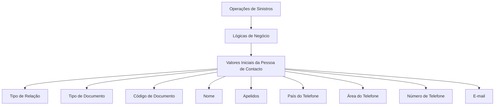
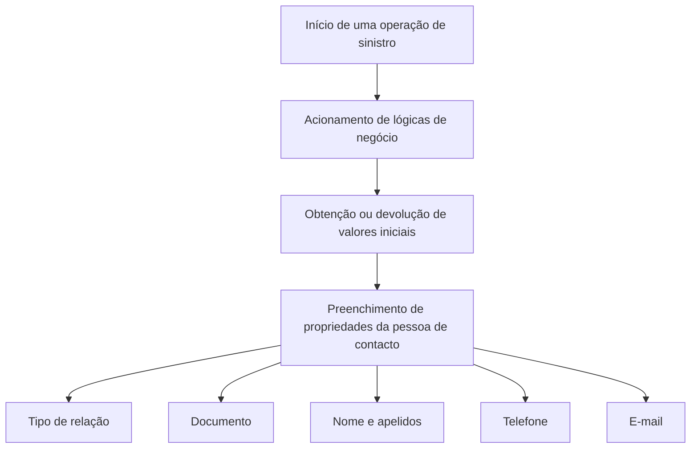

# Definição de Valores Iniciais da Pessoa de Contacto do Sinistro

## 1. Metadados do Documento
- **Arquivo de Origem:** Não identificado no conteúdo fornecido
- **Tipo de Documento:** Especificação Funcional / Documentação Reef
- **Domínio / Sistema:** Reef / Operações de Sinistros / Mapfre
- **Público-Alvo:** Desenvolvedores, Analistas Funcionais e Operação de Sinistros
- **Data/Versão Identificada:** Não identificada

---

## 2. Resumo Executivo & Contexto de Negócio

O documento descreve a definição de valores iniciais para a **Pessoa de Contacto do Sinistro** no contexto das operações de sinistros do sistema Reef. A finalidade declarada é devolver valores iniciais da pessoa de contacto por meio de lógicas de negócio acionadas a partir dessas operações.

A configuração contempla propriedades para preencher ou determinar dados de identificação, relacionamento, nome, telefone e e-mail da pessoa de contacto. Cada propriedade está associada a uma lógica de negócio responsável por devolver ou obter o valor inicial correspondente.

O uso de valores por defeito não é obrigatório. Contudo, o documento informa que determinadas propriedades podem economizar tempo e são fáceis de programar quando possuem valores iniciais configurados.

A documentação não especifica os nomes técnicos das lógicas de negócio, contratos de entrada e saída, métodos HTTP, persistência, regras de prioridade, nem a interface exata de manutenção apresentada na imagem referida.

---

## 3. Arquitetura, Componentes & Tecnologias Envolvidas

Os elementos identificados são:

| Componente / Elemento | Papel identificado |
| :--- | :--- |
| Reef | Ambiente ou sistema onde a documentação está publicada e onde são mantidas propriedades de valores iniciais. |
| Operações de sinistros | Origem do acionamento das lógicas de negócio para valores iniciais da pessoa de contacto. |
| Pessoa de contacto do sinistro | Entidade cujos dados iniciais são devolvidos ou obtidos pelas lógicas de negócio. |
| Lógicas de negócio | Mecanismos que devolvem ou obtêm valores iniciais para propriedades da pessoa de contacto. |
| Manutenção de Valores Iniciais de Pessoa de Contacto | Interface ou funcionalidade mencionada por meio de imagem, sem detalhamento visual disponível no conteúdo extraído. |
| Mapfredocument | Termo exibido na navegação/documentação. O papel técnico não é detalhado. |
| Zeus | Termo exibido na navegação/documentação. O papel técnico não é detalhado. |
| Cloud | Item de navegação exibido na documentação; não há detalhes de infraestrutura ou serviços cloud. |



**Nota de Análise:** o documento descreve o acionamento das lógicas de negócio pelas operações de sinistros, mas não detalha componentes técnicos intermediários, APIs, bases de dados, protocolos de integração, ambientes ou contratos JSON.

---

## 4. Regras de Negócio, Especificações Funcionais & Processos

### 4.1 Objetivo funcional

A finalidade é devolver valores iniciais da pessoa de contacto por meio de lógicas de negócio. Essas lógicas de negócio são lançadas a partir das operações de sinistros.

### 4.2 Propriedades de valores iniciais

A pessoa de contacto possui propriedades para as quais podem ser configuradas ou associadas lógicas de negócio de valor inicial:

1. **Lógica de negócio valor inicial tipo de relação**
   - Devolve o tipo de relação inicial da pessoa de contacto com o segurado.

2. **Lógica de negócio valor inicial tipo documento**
   - Devolve um valor inicial para o tipo de documento da pessoa de contacto.

3. **Lógica de negócio valor inicial código de documento**
   - Pode obter o código de documento da pessoa de contacto.

4. **Lógica de negócio valor inicial nome**
   - Pode obter o nome do contacto.

5. **Lógica de negócio valor inicial apelidos**
   - Pode obter o apelido da pessoa de contacto.

6. **Lógica de negócio valor inicial país do telefone**
   - Pode obter o código de país do número de telefone do contacto.

7. **Lógica de negócio valor inicial área do telefone**
   - Devolve a área do número de telefone.

8. **Lógica de negócio valor inicial número de telefone**
   - Devolve o número de telefone do contacto.

9. **Lógica de negócio valor inicial e-mail**
   - Pode obter o e-mail do contacto.

### 4.3 Regra sobre valores por defeito

Os valores por defeito não são obrigatórios. O documento indica, porém, que algumas propriedades com valores por defeito podem economizar tempo e são fáceis de programar.

### 4.4 Fluxo funcional identificado



**Nota de Análise:** não há no conteúdo fornecido uma ordem explícita de execução das lógicas, condições de erro, obrigatoriedade por campo, comportamento para valores nulos ou regras de precedência entre valores introduzidos manualmente e valores devolvidos pelas lógicas de negócio.

---

## 5. Tabelas de Parâmetros, Ambientes e Estruturas de Dados

| Item / Parâmetro | Descrição / Função | Tipo / Valores / Formato | Ambiente / Observações |
| :--- | :--- | :--- | :--- |
| Lógica de negócio valor inicial tipo de relação | Devolve o tipo de relação inicial da pessoa de contacto com o segurado. | Lógica de negócio; formato não detalhado. | Acionada desde operações de sinistros. |
| Lógica de negócio valor inicial tipo documento | Devolve um valor inicial para o tipo de documento da pessoa de contacto. | Lógica de negócio; tipos de documento não detalhados. | Acionada desde operações de sinistros. |
| Lógica de negócio valor inicial código de documento | Obtém o código de documento da pessoa de contacto. | Lógica de negócio; formato do código não detalhado. | Acionada desde operações de sinistros. |
| Lógica de negócio valor inicial nome | Obtém o nome do contacto. | Lógica de negócio; formato textual não detalhado. | Acionada desde operações de sinistros. |
| Lógica de negócio valor inicial apelidos | Obtém o apelido da pessoa de contacto. | Lógica de negócio; formato textual não detalhado. | Acionada desde operações de sinistros. |
| Lógica de negócio valor inicial país do telefone | Obtém o código de país do telefone do contacto. | Lógica de negócio; formato do código de país não detalhado. | Acionada desde operações de sinistros. |
| Lógica de negócio valor inicial área do telefone | Devolve a área do número de telefone. | Lógica de negócio; formato não detalhado. | Acionada desde operações de sinistros. |
| Lógica de negócio valor inicial número de telefone | Devolve o número de telefone do contacto. | Lógica de negócio; formato não detalhado. | Acionada desde operações de sinistros. |
| Lógica de negócio valor inicial e-mail | Obtém o e-mail do contacto. | Lógica de negócio; formato de e-mail não detalhado. | Acionada desde operações de sinistros. |
| Valores por defeito | Valores iniciais configuráveis para determinadas propriedades. | Não obrigatório. | Podem poupar tempo e ser fáceis de programar em algumas propriedades. |
| Owner | Proprietário indicado na página de documentação. | `user:agonzalez_mapfre.com` | Informação exibida no conteúdo bruto. |
| Lifecycle | Estado de ciclo de vida indicado na documentação. | `Approved` | Não há explicação adicional sobre o significado operacional. |
| Source | Origem indicada na documentação. | `VL` | Não há explicação adicional sobre o significado de `VL`. |

---

## 6. Bateria de Perguntas & Respostas para RAG (FAQ Sintético)

### P1: Qual é a finalidade da funcionalidade de valores iniciais da pessoa de contacto do sinistro?
**R:** A finalidade é devolver valores iniciais da pessoa de contacto mediante lógicas de negócio lançadas a partir das operações de sinistros.

### P2: Os valores por defeito da pessoa de contacto são obrigatórios?
**R:** Não. O documento afirma que valores por defeito não são obrigatórios, embora algumas propriedades possam economizar tempo e ser fáceis de programar quando utilizam esses valores.

### P3: Qual lógica de negócio determina a relação inicial da pessoa de contacto com o segurado?
**R:** A propriedade denominada **lógica de negócio valor inicial tipo de relação** contém a lógica de negócio que devolve o tipo de relação inicial da pessoa de contacto com o segurado.

### P4: Como é determinado o tipo de documento inicial da pessoa de contacto?
**R:** A propriedade **lógica de negócio valor inicial tipo documento** contém uma lógica de negócio que devolve um valor inicial para o tipo de documento da pessoa de contacto.

### P5: Existe suporte para obter o código de documento da pessoa de contacto?
**R:** Sim. A propriedade **lógica de negócio valor inicial código de documento** contém uma lógica de negócio que pode obter o código de documento da pessoa de contacto.

### P6: Quais dados de identificação pessoal podem ser obtidos por lógicas de negócio?
**R:** O documento cita lógicas de negócio para obter o nome, os apelidos, o tipo de documento e o código de documento da pessoa de contacto.

### P7: Quais partes do telefone da pessoa de contacto possuem valores iniciais configuráveis?
**R:** O documento lista propriedades para o código de país do telefone, a área do telefone e o número de telefone da pessoa de contacto.

### P8: Como o código de país do telefone é obtido?
**R:** A propriedade **lógica de negócio valor inicial país do telefone** contém uma lógica de negócio para obter o código de país do número de telefone do contacto.

### P9: Há uma lógica de negócio para preencher o e-mail do contacto?
**R:** Sim. A propriedade **lógica de negócio valor inicial email** contém uma lógica de negócio para obter o e-mail do contacto.

### P10: As operações de sinistros chamam diretamente as lógicas de negócio?
**R:** O documento declara que as lógicas de negócio são lançadas desde as operações de sinistros. Não são fornecidos detalhes técnicos adicionais sobre o mecanismo de chamada.

### P11: O documento define o formato do número de telefone, código de país ou área?
**R:** Não. O documento informa apenas que existem lógicas de negócio para devolver ou obter esses valores; os formatos, validações e padrões não são detalhados.

### P12: O documento descreve APIs, métodos HTTP ou contratos de integração para as lógicas de negócio?
**R:** Não. O conteúdo não apresenta APIs, métodos HTTP, contratos JSON, tecnologias de implementação ou detalhes de persistência das lógicas de negócio.

---

## 7. Glossário de Termos, Siglas & Conceitos-Chave

- **Pessoa de Contacto:** entidade cujos valores iniciais de identificação, relação, telefone e e-mail podem ser devolvidos ou obtidos por lógicas de negócio.
- **Segurado:** pessoa com a qual é determinado o tipo de relação inicial da pessoa de contacto.
- **Sinistro:** contexto operacional a partir do qual as lógicas de negócio são lançadas.
- **Operações de Sinistros:** operações que acionam as lógicas de negócio para devolução de valores iniciais.
- **Lógica de Negócio:** mecanismo mencionado para devolver ou obter valores iniciais das propriedades da pessoa de contacto.
- **Valores Iniciais:** valores devolvidos ou obtidos para preencher propriedades da pessoa de contacto.
- **Valores por Defeito:** valores iniciais não obrigatórios que podem poupar tempo em algumas propriedades.
- **Reef:** sistema ou contexto documental no qual a especificação é apresentada.
- **Mapfredocument:** termo exibido na navegação da documentação; não definido no conteúdo.
- **Zeus:** termo exibido na navegação da documentação; não definido no conteúdo.
- **VL:** valor exibido no campo `Source`; significado não definido no conteúdo.

---

## 8. Notas Críticas, Riscos & Limitações

- O documento não detalha o contrato técnico das lógicas de negócio, incluindo entradas, saídas, tipos de dados, mensagens de erro ou mecanismo de execução.
- Não são identificados métodos HTTP, endpoints, URLs, portas, credenciais, tecnologias de implementação ou dependências de infraestrutura.
- Não há descrição de regras de validação para nome, apelidos, tipo de documento, código de documento, telefone ou e-mail.
- Não são especificadas regras de obrigatoriedade por campo, exceções, valores nulos, valores vazios ou comportamento de fallback.
- Não há detalhe sobre priorização entre valores por defeito, valores retornados por lógicas de negócio e valores informados manualmente por utilizadores.
- A imagem intitulada “Mantenimiento Valores Iniciales de Persona de Contacto” é mencionada, mas não está disponível como conteúdo textual estruturado na extração.
- Os termos `Mapfredocument`, `Zeus`, `Cloud` e `VL` aparecem na página, mas o documento não explica seus papéis no processo de valores iniciais.

---

## 9. Conteúdo Bruto Estruturado (Referência Fiel)

```text
--- [PÁGINA 1 DE 2] ---

DEFINICIÓN de VALORES INICIALES PERSONA DE CONTACTO DEL
SINIESTRO
Objetivo
La nalidad es poder devolver valores iniciales de la persona de contacto mediante lógicas de negocio. Estas lógicas de negocio se lanza
desde las operaciones de siniestros
Propiedades de Valores Iniciales de Persona de Contacto
Imagen del Mantenimiento Valores Iniciales de Persona de Contacto:
lógica de negocio valor inicial tipo de relación
Esta propiedad contiene una Lógica de Negocio que devuelve el tipo relación inicial de la persona de contacto con el asegurado.
lógica de negocio valor inicial tipo documento
Lógica de Negocio que devuelve un valor inicial, del tipo de documento de la persona de contacto .
lógica de negocio valor inicial código de documento
Esta propiedad contiene una lógica de negocio que puede obtener el código de documento de la persona de contacto.
lógica de negocio valor inicial nombre
Esta propiedad contiene una lógica de negocio se puede obtener el nombre del contacto.
lógica de negocio valor inicial apellidos
Esta propiedad contiene una lógica de negocio para obtener el apellido de la persona de contacto
Documentation / DOCUMENTACIÓN Reef
DOCUMENTACIÓN Reef
Mapfredocument
DOCUMENTACIÓN Reef
Owner
user:agonzalez_mapfre.com
Lifecycle
Approved Source
 / 
 VL
Buscar Inicio Soluciones Arquitecturas APIs Componentes Cloud Documentación Zeus Reef Ayuda
ES


--- [PÁGINA 2 DE 2] ---

Lógica de negocio valor inicial país del teléfono
Esta propiedad contiene una lógica de negocio para poder obtener el código de país del número de teléfono del contacto.
Lógica de negocio valor inicial área del teléfono
Esta propiedad contiene una lógica de negocio que devuelve el área del número de teléfono.
Lógica de negocio valor inicial número de teléfono
Esta propiedad contiene una lógica de negocio que devuelve el número de teléfono del contacto.
Lógica de negocio valor inicial email
Esta propiedad contiene una lógica de negocio para obtener el email del contacto
Preguntas frecuentes
¿Es obligatorio tener valores por defecto? No, pero en algunas propiedades ahorra tiempo y son fáciles de programar.
```
