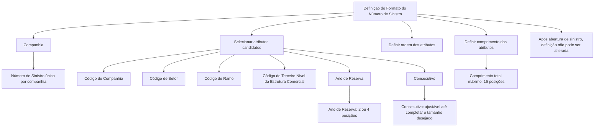

# Definição do Formato do Número de Sinistro — Documentação Reef

## 1. Metadados do Documento
- **Arquivo de Origem:** Não identificado no conteúdo fornecido
- **Tipo de Documento:** Especificação Técnica / Documentação Funcional
- **Domínio / Sistema:** Reef / Mapfre
- **Público-Alvo:** Negócio, analistas funcionais, desenvolvedores e operação
- **Data/Versão Identificada:** Não identificada

---

## 2. Resumo Executivo & Contexto de Negócio

O documento define o formato e o comprimento do Número de Sinistro utilizado para identificar sinistros. O Número de Sinistro é único por companhia, portanto a configuração é aplicada no âmbito da companhia e não por ramo.

A definição do formato do Número de Sinistro não pode ser alterada após a abertura de um sinistro. Essa restrição torna a configuração inicial uma decisão relevante, pois mudanças posteriores não são permitidas segundo o conteúdo fornecido.

O Número de Sinistro pode conter atributos candidatos específicos: Código de Companhia, Código de Setor, Código de Ramo, Código do Terceiro Nível da Estrutura Comercial, Ano de Reserva e Consecutivo. A configuração determina quais desses atributos participam da numeração, a ordem em que aparecem e o comprimento atribuído a cada um.

O limite máximo para o comprimento total do Número de Sinistro é de 15 posições. Apenas os atributos Ano de Reserva e Consecutivo possuem regras explícitas de alteração de comprimento: Ano de Reserva pode ter 2 ou 4 posições; Consecutivo pode ser dimensionado até completar o tamanho desejado, desde que o total não ultrapasse 15 posições.

---

## 3. Arquitetura, Componentes & Tecnologias Envolvidas

O texto não descreve arquitetura de software, tecnologias, APIs, microsserviços, servidores, URLs de ambiente ou integrações técnicas. O conteúdo apresenta uma configuração funcional de composição do Número de Sinistro no contexto da documentação Reef.

Componentes e conceitos identificados:

| Componente / Conceito | Papel identificado |
| :--- | :--- |
| Número de Sinistro | Identificador de sinistros, único por companhia |
| Companhia | Escopo de unicidade e de definição do formato do Número de Sinistro |
| Propriedades Gerais | Área citada como relacionada à manutenção da definição do formato |
| Atributos candidatos | Dados que podem compor a numeração do sinistro |
| Ordem dos atributos | Sequência dos atributos dentro do Número de Sinistro |
| Comprimento | Quantidade de posições atribuídas aos atributos componentes |
| Reef | Contexto documental mencionado no conteúdo |
| Mapfre | Organização ou domínio documental mencionado no conteúdo |



> **Nota de Análise:** O documento não detalha a interface de manutenção, os métodos de persistência, regras de preenchimento dos atributos, geração do sequencial ou contratos técnicos relacionados ao Número de Sinistro.

---

## 4. Regras de Negócio, Especificações Funcionais & Processos

1. O Número de Sinistro identifica os sinistros.
2. O Número de Sinistro é único por companhia.
3. O formato do Número de Sinistro também é único por companhia.
4. Não existe variação do formato do Número de Sinistro por ramo.
5. A definição do formato não pode ser alterada depois que um sinistro for aberto.
6. O Número de Sinistro pode ter, no máximo, 15 posições.
7. Os únicos atributos candidatos indicados para a composição da numeração são:
   - Código de Companhia;
   - Código de Setor;
   - Código de Ramo;
   - Código do Terceiro Nível da Estrutura Comercial;
   - Ano de Reserva;
   - Consecutivo.
8. A propriedade relativa à sequência da informação define:
   - se um atributo candidato participará da numeração;
   - a posição ou ordem do atributo dentro do Número de Sinistro.
9. O comprimento total do Número de Sinistro é obtido pela soma dos comprimentos dos atributos selecionados.
10. A soma dos comprimentos de todos os atributos selecionados não pode exceder 15 posições.
11. Somente o comprimento dos seguintes atributos pode ser modificado:
   - **Ano de Reserva:** 2 ou 4 posições;
   - **Consecutivo:** ajustável até completar o comprimento desejado do Número de Sinistro.
12. Atualmente, não podem ser utilizados atributos adicionais além dos explicitamente descritos no documento.
13. A inclusão de um novo atributo exige solicitação, embora o documento não especifique o processo, responsável, canal ou critério de aprovação dessa solicitação.

---

## 5. Tabelas de Parâmetros, Ambientes e Estruturas de Dados

| Item / Parâmetro | Descrição / Função | Tipo / Valores / Formato | Ambiente / Observações |
| :--- | :--- | :--- | :--- |
| Número de Sinistro | Número destinado a identificar sinistros | Máximo de 15 posições | Único por companhia |
| Formato do Número de Sinistro | Definição da composição, ordem e comprimento do Número de Sinistro | Formado por atributos candidatos documentados | Não pode ser alterado após a abertura de um sinistro |
| Código de Companhia | Atributo candidato para composição da numeração | Não detalhado | Pode fazer parte do Número de Sinistro |
| Código de Setor | Atributo candidato para composição da numeração | Não detalhado | Pode fazer parte do Número de Sinistro |
| Código de Ramo | Atributo candidato para composição da numeração | Não detalhado | O formato não varia por ramo |
| Código do Terceiro Nível da Estrutura Comercial | Atributo candidato para composição da numeração | Não detalhado | Pode fazer parte do Número de Sinistro |
| Ano de Reserva | Atributo candidato para composição da numeração | 2 ou 4 posições | Seu comprimento é modificável |
| Consecutivo | Atributo candidato para composição da numeração | Comprimento ajustável até completar o tamanho desejado | Seu comprimento é modificável |
| Sequência da informação | Define participação e ordem dos atributos na numeração | Ordem dentro do Número de Sinistro | Não detalha formato de configuração |
| Comprimento | Define a quantidade de posições de cada atributo | Soma total máxima de 15 posições | Aplicável aos atributos participantes |

> **Nota de Análise:** O documento não apresenta ambientes técnicos, nomes de servidores, rotas de logs, URLs, portas, variáveis de configuração ou estruturas de dados com campos técnicos.

---

## 6. Bateria de Perguntas & Respostas para RAG (FAQ Sintético)

### P1: Qual é o tamanho máximo permitido para o Número de Sinistro?
**R:** O Número de Sinistro pode ter no máximo 15 posições. Esse limite é calculado pela soma dos comprimentos dos atributos selecionados para compor a numeração.

### P2: O Número de Sinistro é único por ramo?
**R:** Não. O documento informa que o formato do Número de Sinistro é único por companhia, assim como o próprio Número de Sinistro gerado. Portanto, a formação não pode variar por ramo.

### P3: É possível alterar o formato do Número de Sinistro após abrir um sinistro?
**R:** Não. A definição do formato do Número de Sinistro não pode ser alterada depois que um sinistro tiver sido aberto.

### P4: Quais atributos podem formar o Número de Sinistro?
**R:** Os atributos candidatos são Código de Companhia, Código de Setor, Código de Ramo, Código do Terceiro Nível da Estrutura Comercial, Ano de Reserva e Consecutivo.

### P5: Posso incluir um atributo diferente dos atributos documentados no Número de Sinistro?
**R:** Não diretamente. O documento informa que, atualmente, somente os atributos descritos podem fazer parte da numeração. Para incluir outro atributo, é necessário solicitá-lo; o documento não detalha o fluxo dessa solicitação.

### P6: Como é definida a ordem dos atributos dentro do Número de Sinistro?
**R:** A propriedade denominada sequência da informação dentro do Número de Sinistro determina se cada atributo candidato fará parte da numeração e em qual ordem ele será posicionado no número.

### P7: Quais atributos têm comprimento configurável?
**R:** Somente Ano de Reserva e Consecutivo possuem alteração de comprimento explicitamente permitida. Ano de Reserva pode possuir 2 ou 4 posições, e Consecutivo pode ser ajustado para completar o comprimento desejado, respeitando o máximo de 15 posições.

### P8: O campo Ano de Reserva pode ter qualquer comprimento?
**R:** Não. O Ano de Reserva pode ter apenas 2 ou 4 posições, conforme a regra descrita no documento.

### P9: Como atingir um comprimento desejado para o Número de Sinistro?
**R:** O comprimento total é definido pela soma dos tamanhos dos atributos selecionados. O campo Consecutivo pode ser ajustado até completar o comprimento desejado, desde que o total não ultrapasse 15 posições.

### P10: O documento define como o Consecutivo é gerado ou reiniciado?
**R:** Não. O documento cita o Consecutivo como atributo candidato e informa que seu comprimento pode ser ajustado, mas não descreve algoritmo de geração, reinicialização, faixa numérica ou tratamento de concorrência.

---

## 7. Glossário de Termos, Siglas & Conceitos-Chave

- **Número de Sinistro:** Número utilizado para identificar sinistros; é único por companhia.
- **Formato do Número de Sinistro:** Configuração que determina os atributos participantes, a ordem e os comprimentos usados para construir o Número de Sinistro.
- **Companhia:** Entidade para a qual o Número de Sinistro e seu formato são únicos.
- **Ramo:** Atributo candidato à composição do Número de Sinistro; não define um formato próprio de numeração.
- **Código de Setor:** Atributo candidato à composição do Número de Sinistro.
- **Código do Terceiro Nível da Estrutura Comercial:** Atributo candidato à composição do Número de Sinistro.
- **Ano de Reserva:** Atributo candidato cujo comprimento pode ser de 2 ou 4 posições.
- **Consecutivo:** Atributo candidato cujo comprimento pode ser ajustado para completar o tamanho desejado do Número de Sinistro.
- **Reef:** Nome citado no contexto da documentação fornecida.
- **Mapfre:** Nome citado no contexto da documentação fornecida.

---

## 8. Notas Críticas, Riscos & Limitações

- A configuração do formato é imutável depois da abertura de um sinistro; uma definição inadequada antes do primeiro sinistro pode ter impacto permanente.
- O limite máximo de 15 posições restringe a combinação e o comprimento dos atributos selecionados.
- A documentação não descreve regras de validação detalhadas para cada atributo candidato.
- A documentação não define como o Consecutivo é gerado, incrementado, reservado, reiniciado ou protegido contra duplicidade.
- A documentação não explica como a unicidade do Número de Sinistro é assegurada tecnicamente.
- A documentação não apresenta exemplos completos de números gerados.
- A inclusão de atributos adicionais depende de solicitação, mas o processo de solicitação não é detalhado.
- Não há detalhamento técnico sobre APIs, banco de dados, integrações, logs, permissões, ambientes ou mecanismos de auditoria.

---

## 9. Conteúdo Bruto Estruturado (Referência Fiel)

```text
--- [PÁGINA 1 DE 2] ---

DEFINICIÓN de Formato del Número de Siniestro
Objetivo
La finalidad es definir el formato y la longitud que va a tener el Número que va a identificar los Siniestros.
El Número de siniestro es único por compañía.
La definición no se puede cambiar una vez que se ha abierto un siniestro.
La longitud del número de siniestro puede llegar a tener como máximo, 15 posiciones.
Imagen del Mantenimiento Definición Formato Número de Siniestro:
Propiedades Generales
Información que puede formar parte del Número de Siniestro
Esta propiedad contiene el Nombre de los atributos que pueden formar parte de la numeración de siniestros. Los candidatos son:
Código de Compañía
Documentation / DOCUMENTACIÓN Reef
DOCUMENTACIÓN Reef
Mapfredocument
DOCUMENTACIÓN Reef
Owner
user:agonzalez_mapfre.com
Lifecycle
Approved Source
/
VL
Buscar Inicio Soluciones Arquitecturas APIs Componentes Cloud Documentación Zeus Reef Ayuda
ES


--- [PÁGINA 2 DE 2] ---

Código de Sector
Código de Ramo
Código del Tercer Nivel de la Estructura Comercial
Año Reserva
Consecutivo
Secuencia de la información dentro del Número de Siniestro
Esta propiedad lo que contiene es, si se quiere que cualquiera de los candidatos forme parte de la numeración, en que orden se va a situar
dentro del número de Siniestro.
Longitud
Esta propiedad indica la longitud del atributo candidato a formar parte de la numeración del siniestro. La longitud total, la suma de todas las
longitudes de los candidatos, no puede superar las 15 posiciones. Sólo se podrá modificar la Longitud de: - Año de Reserva (de 2 o de 4
posiciones) - Secuencial (hasta completar la longitud que se quiera)
Preguntas frecuentes
1. ¿La formación del número de siniestro puede cambiar por Ramo? No, el formato de número de siniestro es único por compañía, así como
el propio número de siniestro que se genera.
2. ¿Además de los atributos especificados en este documento el número de siniestro podría estar formado por otros atributos? Hoy en día,
sólo pueden formar parte de la documentación los atributos descritos en este documento, si se quisiera incluir otro, habría que
solicitarlo.
3. ¿La longitud del número de siniestro es variable? Si, puede llegar como máximo a 15 posiciones, esto se logra con la longitud que se de
al campo Consecutivo.
Ejemplo:
```
