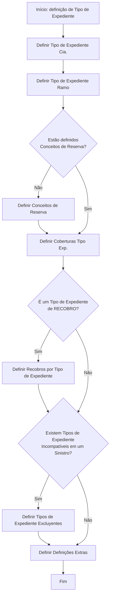

# Definição de Tipo de Expediente para Abertura de Sinistros no Reef

## 1. Metadados do Documento
- **Arquivo de Origem:** Não identificado no conteúdo extraído
- **Tipo de Documento:** Procedimento
- **Domínio / Sistema:** Reef / documentação Mapfre
- **Público-Alvo:** Operação, negócio e equipes responsáveis pela configuração de ramos, coberturas e expedientes
- **Data/Versão Identificada:** Não identificada

---

## 2. Resumo Executivo & Contexto de Negócio

O documento descreve o processo de definição de um **Tipo de Expediente**. Um Tipo de Expediente definido poderá posteriormente ser utilizado na abertura de expedientes.

A definição parte das coberturas previamente definidas em um **ramo**. O documento estabelece que todas as coberturas siniestráveis, classificadas como tipo de coberturas, devem estar contidas em algum Tipo de Expediente.

O fluxo abrange definições por companhia e ramo, conceitos de reserva, coberturas, recobros, incompatibilidades entre tipos de expediente em um sinistro e definições extras. O processo encerra após a execução das definições previstas.

O conteúdo também registra referências de navegação para a documentação Reef no Mapfredocument, com estado de ciclo de vida indicado como **Approved**.

---

## 3. Arquitetura, Componentes & Tecnologias Envolvidas

Os elementos identificados são:

- **Reef:** Sistema ou domínio documental mencionado no cabeçalho e na navegação.
- **Mapfredocument:** Repositório ou portal documental citado no conteúdo bruto.
- **Tipo de Expediente:** Entidade central do procedimento.
- **Cia.:** Elemento de configuração para definição do Tipo de Expediente.
- **Ramo:** Contexto a partir do qual são consideradas as coberturas.
- **Coberturas:** Coberturas siniestráveis devem pertencer a um Tipo de Expediente.
- **Conceitos de Reserva:** Definições condicionais no fluxo.
- **Recobros:** Definições aplicáveis quando o Tipo de Expediente é de recobro.
- **Tipos de Expediente Excluyentes:** Configuração aplicável quando existem tipos incompatíveis em um sinistro.
- **Definições Extras / Validações de Expedientes:** Etapa final listada pelo fluxo.



> **Nota de Análise:** O documento não detalha interfaces, métodos HTTP, contratos JSON, banco de dados, integrações técnicas, tecnologias de implementação ou ambientes de execução do Reef.

---

## 4. Regras de Negócio, Especificações Funcionais & Processos

1. O objetivo declarado é explicar os passos para a definição de um Tipo de Expediente.
2. Um Tipo de Expediente definido poderá ser utilizado posteriormente na abertura de expedientes.
3. A definição dos tipos de expediente deve partir das coberturas definidas no ramo.
4. Todas as coberturas siniestráveis, classificadas como tipo de coberturas, devem estar contidas em algum Tipo de Expediente.
5. O processo inicia com a definição do Tipo de Expediente para a companhia, identificada como **Cia.**
6. Em seguida, deve ser definido o Tipo de Expediente para o ramo.
7. O fluxo verifica se os Conceitos de Reserva estão definidos:
   - Se não estiverem definidos, devem ser definidos antes da continuidade do fluxo.
   - Se estiverem definidos, o fluxo segue para a definição das coberturas do Tipo de Expediente.
8. As coberturas do Tipo de Expediente devem ser definidas.
9. O fluxo verifica se o Tipo de Expediente é de **RECOBRO**:
   - Se for de recobro, devem ser definidos os recobros por Tipo de Expediente.
   - Se não for de recobro, o fluxo segue para a verificação de incompatibilidades.
10. O fluxo verifica se existem Tipos de Expediente incompatíveis em um sinistro:
    - Se existirem, devem ser definidos Tipos de Expediente Excluyentes.
    - Se não existirem, o fluxo segue para Definições Extras.
11. O processo contém uma etapa denominada **Definir Definições Extras**.
12. A lista textual final do documento menciona **Definir Validações Expedientes** como etapa 7, enquanto o diagrama mostra **Definir Definições Extras**. O documento não esclarece se os dois termos representam a mesma configuração ou etapas distintas.

---

## 5. Tabelas de Parâmetros, Ambientes e Estruturas de Dados

| Item / Parâmetro | Descrição / Função | Tipo / Valores / Formato | Ambiente / Observações |
| :--- | :--- | :--- | :--- |
| Tipo de Expediente | Entidade definida pelo procedimento e posteriormente utilizável na abertura de expedientes. | Configuração funcional. | O documento não detalha atributos, identificadores ou formatos. |
| Tipo de Expediente Cia. | Primeira definição listada no processo. | Configuração por “Cia.” | O significado expandido de “Cia.” não é informado. |
| Tipo de Expediente Ramo | Definição do Tipo de Expediente no contexto de um ramo. | Configuração por ramo. | As coberturas definidas no ramo são a base do processo. |
| Coberturas | Coberturas vinculadas a um Tipo de Expediente. | Coberturas siniestráveis / tipo de coberturas. | Todas as coberturas siniestráveis devem estar contidas em algum Tipo de Expediente. |
| Conceitos de Reserva | Elemento cuja definição é verificada pelo fluxo. | Configuração funcional. | Deve ser definido quando ainda não estiver definido. |
| Coberturas Tipo Exp. | Etapa para definir as coberturas de um Tipo de Expediente. | Configuração de associação. | Executada após a validação dos Conceitos de Reserva. |
| Recobros por Tipo de Expediente | Definição de recobros associada a um Tipo de Expediente. | Configuração condicional. | Aplicável se o Tipo de Expediente for de RECOBRO. |
| Tipos de Expediente Excluyentes | Definição de tipos incompatíveis em um sinistro. | Configuração de exclusão / incompatibilidade. | Aplicável se existirem Tipos de Expediente incompatíveis em um sinistro. |
| Definições Extras | Etapa exibida no diagrama antes do fim. | Configuração funcional. | Sem detalhamento adicional. |
| Validações Expedientes | Etapa 7 da lista textual do documento. | Configuração de validação. | A relação com “Definições Extras” não é explicitada. |
| Reef | Domínio ou sistema mencionado na documentação. | Sistema / domínio documental. | Não há detalhes técnicos adicionais. |
| Mapfredocument | Referência documental apresentada no conteúdo. | Portal ou repositório documental. | Associado à “DOCUMENTACIÓN Reef”. |
| Lifecycle | Estado do ciclo de vida exibido na navegação. | Approved. | O documento exibe “Lifecycle Approved”. |
| Owner | Proprietário exibido no conteúdo. | `user:agonzalez_mapfre.com` | Preservado conforme a extração bruta. |

---

## 6. Bateria de Perguntas & Respostas para RAG (FAQ Sintético)

### P1: Qual é o objetivo do procedimento de definição de Tipo de Expediente?
**R:** O procedimento tem como objetivo explicar os passos para a definição de um Tipo de Expediente. Após a definição, o Tipo de Expediente poderá ser utilizado na abertura de expedientes.

### P2: Qual é o ponto de partida para definir tipos de expediente?
**R:** A definição dos tipos de expediente parte das coberturas definidas no ramo. O documento estabelece essa relação como base do processo.

### P3: Qual regra deve ser aplicada às coberturas siniestráveis?
**R:** Todas as coberturas siniestráveis, classificadas no documento como tipo de coberturas, devem estar contidas em algum Tipo de Expediente.

### P4: Quais são as duas primeiras definições do processo?
**R:** As duas primeiras definições são: 1) Definir Tipo de Expediente Cia.; e 2) Definir Tipo de Expediente Ramo.

### P5: O que ocorre quando os Conceitos de Reserva ainda não estão definidos?
**R:** Quando os Conceitos de Reserva não estão definidos, o fluxo determina a execução da etapa “Definir Conceitos de Reserva” antes de continuar para a definição das coberturas do Tipo de Expediente.

### P6: Em que momento devem ser definidas as coberturas do Tipo de Expediente?
**R:** As coberturas do Tipo de Expediente devem ser definidas após a verificação dos Conceitos de Reserva. Caso os Conceitos de Reserva não estejam definidos, eles devem ser definidos primeiro.

### P7: Quando devem ser definidos recobros por Tipo de Expediente?
**R:** Recobros por Tipo de Expediente devem ser definidos quando o fluxo identificar que o Tipo de Expediente é um Tipo de Expediente de RECOBRO.

### P8: Como o processo trata Tipos de Expediente incompatíveis em um sinistro?
**R:** Quando existem Tipos de Expediente incompatíveis em um sinistro, o processo determina a definição de Tipos de Expediente Excluyentes.

### P9: O documento especifica métodos HTTP ou contratos de integração para o Tipo de Expediente?
**R:** Não. O documento não detalha métodos HTTP, contratos JSON, APIs, banco de dados, tecnologias de implementação ou integrações técnicas.

### P10: Qual é a última etapa do diagrama antes do fim?
**R:** A última etapa exibida no diagrama é “Definir Definições Extras”, seguida de “FIN”.

### P11: Há divergência entre o diagrama e a lista textual de etapas?
**R:** Sim. O diagrama apresenta “Definir Definições Extras” antes do fim, enquanto a lista textual apresenta “Definir Validações Expedientes” como etapa 7. O documento não explica a relação entre esses dois termos.

### P12: Qual sistema ou domínio é citado na documentação?
**R:** O conteúdo cita “DOCUMENTACIÓN Reef” e apresenta referências de navegação para Reef e Mapfredocument. Não há detalhamento técnico adicional sobre o sistema Reef.

---

## 7. Glossário de Termos, Siglas & Conceitos-Chave

- **Cia.:** Abreviação apresentada no item “Definir Tipo Expediente Cia.”; o documento não fornece sua expansão.
- **Coberturas siniestráveis:** Coberturas que, segundo o documento, devem estar contidas em algum Tipo de Expediente.
- **Conceitos de Reserva:** Elementos cuja definição é validada durante o fluxo de configuração.
- **Expediente:** Entidade cuja abertura poderá utilizar um Tipo de Expediente previamente definido.
- **Mapfredocument:** Referência documental exibida no conteúdo bruto.
- **Ramo:** Contexto a partir do qual são consideradas as coberturas para definir tipos de expediente.
- **RECOBRO:** Classificação de Tipo de Expediente que aciona a definição de recobros por Tipo de Expediente.
- **Recobros:** Configuração definida quando o Tipo de Expediente é de RECOBRO.
- **Reef:** Sistema ou domínio mencionado no cabeçalho e nas referências documentais.
- **Siniestro:** Termo usado pelo documento na regra sobre incompatibilidade entre Tipos de Expediente; não há definição adicional.
- **Tipo de Expediente Excluyentes:** Tipos definidos quando existem Tipos de Expediente incompatíveis em um sinistro.

---

## 8. Notas Críticas, Riscos & Limitações

- O conteúdo extraído não identifica nome do arquivo, data, versão, autor documental completo ou escopo de aprovação além do estado **Approved**.
- O documento não define os campos, atributos, chaves, telas, permissões ou critérios de persistência do Tipo de Expediente.
- Não são detalhados os critérios usados para determinar se uma cobertura é siniestrável.
- Não são especificadas as regras que determinam quando um Tipo de Expediente deve ser classificado como RECOBRO.
- Não são descritas as regras concretas de incompatibilidade entre Tipos de Expediente em um sinistro.
- Existe uma divergência terminológica entre **Definições Extras**, apresentada no diagrama, e **Validações Expedientes**, apresentada na lista textual.
- Não há URLs, ambientes, servidores, rotas de log, APIs, métodos HTTP, contratos de dados ou tecnologias de implementação no conteúdo fornecido.

---

## 9. Conteúdo Bruto Estruturado (Referência Fiel)

```text
--- [PÁGINA 1 DE 1] ---

DEFINICIÓN Tipo de expediente
Objetivo
Explicar los pasos a seguir para denición de un tipo de daño. Posteriormente este podrá para ser utilizado en la apertura de expedientes.
Para poder denir los tipos de expediente, partiremos de las coberturas denidas en el ramo.
Todas las coberturas siniestrables,tipo de coberturas tienen que estar contenidas en algún Tipo de Expediente.
Proceso para la denición de un Tipo de Expediente para un Ramo
SI
NO SI
NO
SI
NO
DEFINIR
Tipo Expediente
Cia.
DEFINIR
Tipo Expediente
Ramo
¿Están Definidos
Conceptos
Reserva? DEFINIR
Conceptos
Reserva
DEFINIR
Coberturas
Tipo Exp.
¿Es un Tipo
expediente de
RECOBRO? DEFINIR
Recobros por
Tipo de Expediente
¿Existen Tipos
Exp.
Incompatibles en un
Siniestro? DEFINIR
Tipo de Expedientes
Excluyentes
DEFINIR
Definiciones
Extras
FIN
1. DEFINIR Tipo Expediente Cía
2. DEFINIR Tipo Expediente Ramo
3. DEFINIR Concepto de Reserva
4. DEFINIR Coberturas Tipo Expediente
5. DEFINIR Recobros por Tipo de Expediente
6. DEFINIR Tipo de Expedientes Excluyentes
7. DEFINIR Validaciones Expedientes
Checking links...
Documentation / DOCUMENTACIÓN Reef
DOCUMENTACIÓN Reef
Mapfredocument
DOCUMENTACIÓN Reef
Owner
user:agonzalez_mapfre.com
Lifecycle
Approved Source
 / 
 VL
Buscar Inicio Soluciones Arquitecturas APIs Componentes Cloud Documentación Zeus Reef Ayuda
ES
```
