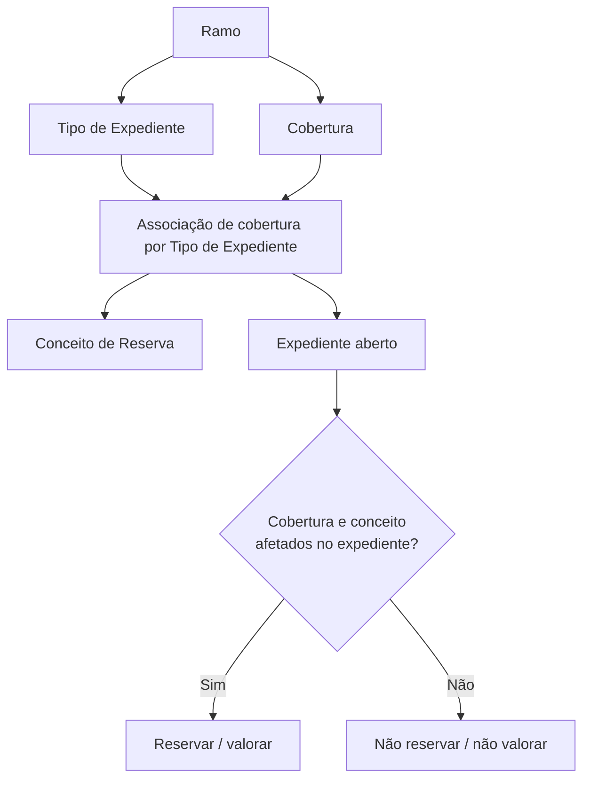

# Definição de Coberturas e Conceitos de Reserva por Tipo de Expediente

## 1. Metadados do Documento
- **Arquivo de Origem:** Não identificado no conteúdo fornecido
- **Tipo de Documento:** Manual Operacional
- **Domínio / Sistema:** Reef / Mapfre
- **Público-Alvo:** Analistas funcionais, operação e equipes de negócio de sinistros
- **Data/Versão Identificada:** Não identificada

---

## 2. Resumo Executivo & Contexto de Negócio

O documento descreve a manutenção da associação entre Tipos de Expediente, Ramos, Coberturas e Conceitos de Reserva no contexto da documentação Reef. O objetivo funcional é permitir que cada Tipo de Expediente, entendido no documento como um tipo de dano, determine quais coberturas de um ramo e quais conceitos de reserva podem ser afetados durante um sinistro.

A configuração depende de associações prévias. O Tipo de Expediente deve estar previamente associado ao Ramo, e cada Cobertura também deve estar previamente associada ao mesmo Ramo. Após essas dependências serem atendidas, é possível associar uma ou várias coberturas ao Tipo de Expediente e definir os conceitos de reserva aplicáveis.

A definição não obriga o provisionamento ou a valoração de todos os itens configurados. Ao abrir um expediente, o sistema deve reservar somente para as combinações de Cobertura e Conceito de Reserva efetivamente afetadas naquele expediente específico.

O documento apresenta como exemplo a inexistência de profissionais externos: nesse cenário, não é necessário valorar os conceitos de reserva Honorários (`H`) nem Gastos (`G`). Também esclarece que um único Tipo de Expediente pode estar vinculado a múltiplas coberturas, como em um caso de Responsabilidade Civil associado simultaneamente às coberturas Responsabilidade Civil e Responsabilidade Civil Complementaria.

---

## 3. Arquitetura, Componentes & Tecnologias Envolvidas

Os elementos funcionais identificados são:

- **Ramo:** chave do ramo ao qual são associados Tipos de Expediente, Coberturas e Conceitos de Reserva.
- **Tipo de Expediente:** chave do tipo de expediente ou tipo de dano; deve estar associado previamente ao Ramo.
- **Cobertura:** chave da cobertura que pode ser afetada pelo Tipo de Expediente; deve estar associada previamente ao Ramo.
- **Conceito de Reserva:** chave que identifica os conceitos pelos quais pode ser feita uma reserva para a combinação de Tipo de Expediente e Cobertura.
- **Sistema Reef:** repositório/documentação em que o conteúdo está publicado.
- **Mapfre:** referência organizacional presente no conteúdo de origem.



> **Nota de Análise:** O conteúdo descreve relações funcionais entre Ramo, Tipo de Expediente, Cobertura e Conceito de Reserva, mas não detalha tecnologias de implementação, interfaces, métodos HTTP, contratos JSON, bancos de dados ou integrações técnicas.

---

## 4. Regras de Negócio, Especificações Funcionais & Processos

### 4.1 Objetivo da configuração

Após associar os Tipos de Expediente ao Ramo e definir suas características, o próximo passo é associar ao Tipo de Dano:

1. As Coberturas do Ramo.
2. Os Conceitos de Reserva aplicáveis.

A finalidade é definir, para cada Tipo de Expediente ou Tipo de Dano:

- Quais Coberturas do Ramo podem ser afetadas em caso de sinistro.
- Quais Conceitos de Reserva podem ser aplicáveis às Coberturas afetadas.

### 4.2 Regras para o Ramo

- A propriedade **Ramo** indica a chave do Ramo ao qual serão associados:
  - Tipos de Expediente;
  - Coberturas;
  - Conceitos de Reserva.
- O Ramo é o contexto organizador das associações funcionais descritas.

### 4.3 Regras para o Tipo de Expediente

- A propriedade **Tipo de Expediente** corresponde à chave do Tipo de Expediente ao qual serão associadas uma ou várias Coberturas e Conceitos de Reserva.
- Os Tipos de Expediente devem estar associados previamente ao Ramo.
- Um Tipo de Expediente pode afetar uma ou várias Coberturas pertencentes ao Ramo.

### 4.4 Regras para a Cobertura

- A propriedade **Cobertura** contém a chave da Cobertura que pode ser afetada pelo Tipo de Expediente em definição.
- A Cobertura deve estar associada previamente ao Ramo.
- O sistema permite associar uma ou `n` Coberturas a um Tipo de Expediente.
- A associação de múltiplas Coberturas é permitida quando o Tipo de Expediente puder afetar mais de uma Cobertura do produto.

### 4.5 Regras para o Conceito de Reserva

- A propriedade **Conceito de Reserva** é a chave utilizada para identificar os diferentes conceitos pelos quais pode ser feita uma reserva.
- O Conceito de Reserva é aplicado no contexto da combinação entre Tipo de Expediente e Cobertura em definição.
- O documento não lista todos os possíveis Conceitos de Reserva; cita explicitamente Honorários (`H`) e Gastos (`G`) como exemplos.

### 4.6 Regra de reserva e valoração no expediente

- Não é obrigatório provisionar ou valorar todas as Coberturas e todos os Conceitos de Reserva definidos para um Tipo de Expediente.
- Quando um expediente é aberto, a reserva deve ocorrer somente para as combinações de Cobertura e Conceito de Reserva afetadas naquele expediente.
- Se não houver profissionais externos, não devem ser valorados:
  - Conceitos de Reserva do tipo **Honorários (`H`)**;
  - Conceitos de Reserva do tipo **Gastos (`G`)**.

### 4.7 Exemplo de associação múltipla

Para um expediente de **Responsabilidade Civil**, quando o produto possuir:

- Cobertura de **Responsabilidade Civil**; e
- Cobertura de **Responsabilidade Civil Complementaria**;

o Tipo de Expediente deve ser associado às duas Coberturas.

---

## 5. Tabelas de Parâmetros, Ambientes e Estruturas de Dados

| Item / Parâmetro | Descrição / Função | Tipo / Valores / Formato | Ambiente / Observações |
| :--- | :--- | :--- | :--- |
| Ramo | Indica a chave do Ramo ao qual serão associados Tipos de Expediente, Coberturas e Conceitos de Reserva. | Chave do Ramo | O documento não informa formato técnico da chave. |
| Tipo de Expediente | Identifica o Tipo de Expediente ao qual serão associadas uma ou várias Coberturas e Conceitos de Reserva. | Chave do Tipo de Expediente | Deve estar previamente associado ao Ramo. |
| Tipo de Dano | Termo usado como referência ao Tipo de Expediente para definição das Coberturas e Conceitos de Reserva. | Conceito funcional | O documento apresenta Tipo de Expediente e Tipo de Dano no mesmo contexto. |
| Cobertura | Identifica a Cobertura que pode ser afetada pelo Tipo de Expediente em definição. | Chave da Cobertura | Deve estar previamente associada ao Ramo. |
| Conceito de Reserva | Identifica o conceito pelo qual pode ser realizada uma reserva na combinação de Tipo de Expediente e Cobertura. | Chave do Conceito de Reserva | O documento não informa formato técnico da chave. |
| Honorários | Conceito de Reserva citado como exemplo para profissionais externos. | `H` | Não deve ser valorado se não houver profissionais externos. |
| Gastos | Conceito de Reserva citado como exemplo para profissionais externos. | `G` | Não deve ser valorado se não houver profissionais externos. |
| Responsabilidade Civil | Cobertura citada no exemplo de associação múltipla. | Nome de Cobertura | Pode ser associada a um Tipo de Expediente. |
| Responsabilidade Civil Complementaria | Cobertura adicional citada no exemplo de associação múltipla. | Nome de Cobertura | Pode ser associada ao mesmo Tipo de Expediente de Responsabilidade Civil. |
| Reef | Contexto documental identificado na origem. | Sistema / repositório documental | Não há detalhes técnicos adicionais. |
| Mapfre | Referência organizacional identificada na origem. | Organização / domínio | Não há detalhamento de papel técnico. |

---

## 6. Bateria de Perguntas & Respostas para RAG (FAQ Sintético)

### P1: Qual é a finalidade de associar Coberturas e Conceitos de Reserva a um Tipo de Expediente?
**R:** A finalidade é definir, para cada Tipo de Expediente ou Tipo de Dano, quais Coberturas pertencentes ao Ramo podem ser afetadas em caso de sinistro e quais Conceitos de Reserva podem ser utilizados nessas Coberturas.

### P2: O que a propriedade Ramo representa nessa configuração?
**R:** A propriedade Ramo representa a chave do Ramo ao qual são associados os Tipos de Expediente, as Coberturas e os Conceitos de Reserva. O Ramo estabelece o contexto para as associações funcionais.

### P3: Um Tipo de Expediente precisa estar associado ao Ramo antes da configuração de Coberturas?
**R:** Sim. O documento determina que os Tipos de Expediente devem estar previamente associados ao Ramo antes de receberem associações de Coberturas e Conceitos de Reserva.

### P4: Uma Cobertura precisa estar associada previamente ao Ramo?
**R:** Sim. A Cobertura que poderá ser afetada pelo Tipo de Expediente deve estar previamente associada ao Ramo.

### P5: É possível associar mais de uma Cobertura a um único Tipo de Expediente?
**R:** Sim. O sistema permite associar uma ou `n` Coberturas por Tipo de Expediente. Essa possibilidade é aplicável quando um Tipo de Expediente pode afetar várias Coberturas do mesmo Ramo.

### P6: Todas as Coberturas e Conceitos de Reserva configurados devem ser provisionados quando um expediente é aberto?
**R:** Não. Ao abrir um expediente, devem ser reservadas apenas as combinações de Cobertura e Conceito de Reserva efetivamente afetadas naquele expediente.

### P7: Quando os conceitos de Honorários (`H`) e Gastos (`G`) não devem ser valorados?
**R:** Os conceitos de reserva Honorários (`H`) e Gastos (`G`) não devem ser valorados quando não houver profissionais externos no expediente.

### P8: Qual é o papel do Conceito de Reserva?
**R:** O Conceito de Reserva é a chave usada para identificar os diferentes conceitos pelos quais pode ser realizada uma reserva no contexto do Tipo de Expediente e da Cobertura em definição.

### P9: Como deve ser configurado um Tipo de Expediente de Responsabilidade Civil quando o produto possui Responsabilidade Civil e Responsabilidade Civil Complementaria?
**R:** O Tipo de Expediente deve ser associado às duas Coberturas: Responsabilidade Civil e Responsabilidade Civil Complementaria.

### P10: O documento especifica como tecnicamente as chaves de Ramo, Cobertura ou Conceito de Reserva são armazenadas?
**R:** Não. O documento informa que essas propriedades representam chaves funcionais, mas não detalha formatos, estruturas de dados, banco de dados, APIs ou contratos técnicos.

---

## 7. Glossário de Termos, Siglas & Conceitos-Chave

- **Ramo:** chave e contexto funcional ao qual Tipos de Expediente, Coberturas e Conceitos de Reserva são associados.
- **Tipo de Expediente:** chave do tipo de expediente que recebe associações de Coberturas e Conceitos de Reserva.
- **Tipo de Dano:** termo utilizado no documento como referência ao Tipo de Expediente para a definição de Coberturas e Conceitos de Reserva.
- **Cobertura:** elemento do Ramo que pode ser afetado por um Tipo de Expediente em caso de sinistro.
- **Conceito de Reserva:** chave que identifica um conceito pelo qual pode ser feita uma reserva.
- **Expediente:** ocorrência aberta na qual somente Coberturas e Conceitos de Reserva efetivamente afetados devem ser reservados.
- **Sinistro:** evento no qual as Coberturas do Ramo e os Conceitos de Reserva associados ao Tipo de Expediente podem ser afetados.
- **H:** código citado para o Conceito de Reserva Honorários.
- **G:** código citado para o Conceito de Reserva Gastos.
- **Reef:** referência ao sistema ou repositório documental presente no conteúdo de origem.

---

## 8. Notas Críticas, Riscos & Limitações

- O documento exige dependências de configuração prévia: tanto o Tipo de Expediente quanto a Cobertura devem estar associados ao Ramo antes de serem relacionados entre si.
- A configuração de Coberturas e Conceitos de Reserva define possibilidades de afetação, mas não implica reserva ou valoração automática para todos os itens configurados.
- A decisão de reservar depende de as Coberturas e os Conceitos de Reserva estarem efetivamente afetados no expediente aberto.
- O documento não detalha os critérios operacionais ou técnicos usados para determinar se uma Cobertura ou Conceito de Reserva está “afetado”.
- O documento não apresenta contratos de integração, telas completas, regras de validação de chaves, formatos de dados, permissões, ambientes, logs, URLs ou procedimentos de erro.
- **Nota de Análise:** O documento lista o sistema Reef e referências a Mapfre, porém não detalha interfaces técnicas, métodos HTTP, contratos JSON ou arquitetura de software.

---

## 9. Conteúdo Bruto Estruturado (Referência Fiel)

```text
--- [PÁGINA 1 DE 2] ---

Denición Coberturas y Concepto de Reserva por Tipo de Expediente
Objetivo
Una vez que se han asociado los Tipos de Expediente al Ramo y se le ha denido sus características, lo siguiente es asociarle al Tipo de Daño
las Coberturas y Conceptos de Reserva.
La nalidad es denir para cada tipo de Expediente (tipo de daño), las coberturas del ramo y los conceptos de reserva a los que puede afectar
en caso de siniestro.
Imagen del Mantenimiento Tipos de Expedientes por Ramo:
Ramo
Esta propiedad indica la clave del Ramo al que se le va asociar a los Tipos de Expedientes, las Coberturas y Conceptos de Reserva.
Ejemplo:
Documentation / DOCUMENTACIÓN Reef
DOCUMENTACIÓN Reef
Mapfredocument
DOCUMENTACIÓN Reef
Owner
user:agonzalez_mapfre.com
Lifecycle
Approved Source
 /
VL
Buscar Inicio Soluciones Arquitecturas APIs Componentes Cloud Documentación Zeus Reef Ayuda
ES


--- [PÁGINA 2 DE 2] ---

Tipo de Expediente
Esta propiedad será la clave del Tipo de Expediente al que se le va asociar una o varias Coberturas y Conceptos de Reserva.
Los tipo de Expedientes tienen que estar asociados al Ramo previamente.
Cobertura
Esta propiedad contendrá la clave de la Cobertura al que puede afectar el Tipo de Expediente que estamos deniendo.
Un tipo de Expediente podrá afectar a una o varias coberturas del Ramo.
Esta cobertura tiene que estar asociada previamente al Ramo.
Concepto de reserva
Esta propiedad será la clave por la que se va a identicar los distintos conceptos por los que se puede a reservar en el Tipo Expediente
Cobertura que estamos deniendo.
Preguntas frecuentes
¿Hay que provisionar, dar valoración, a todas las coberturas y conceptos de reservas denidas al tipo de Expediente?
No, cuando se abra el expediente se reservará únicamente a las coberturas concepto de reserva que se vean afectadas en ese
expediente.
Por ejemplo si no hay profesionales externos, no habría que valorar los conceptos de reserva de tipo Honorarios (H), ni Gastos (G)
¿Se puede asociar más de una cobertura a un Tipo de Expediente?
Si, el sistema permite asociar una o n coberturas por tipo de Expediente.
Por Ejemplo un expediente de Responsabilidad Civil, si el producto tuviera Responsabilidad Civil y Responsabilidad Civil Complementaria,
el tipo de expediente se asociaría a las dos coberturas.
```
