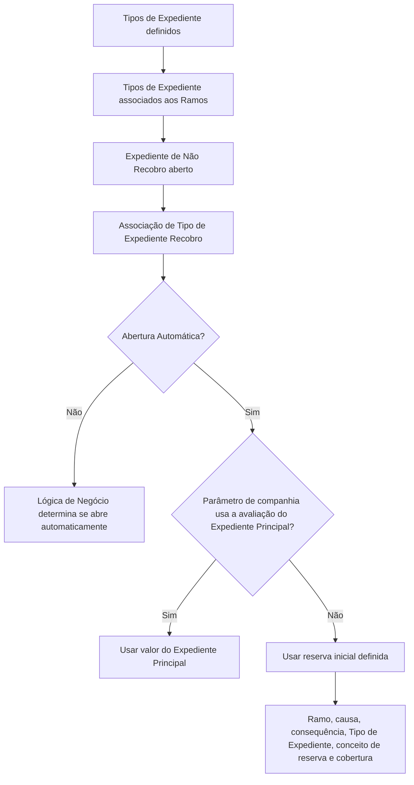

# Definição de Recobros por Tipo de Expediente — Documentação Reef

## 1. Metadados do Documento
- **Arquivo de Origem:** `Não identificado no conteúdo fornecido`
- **Tipo de Documento:** `Especificação Técnica`
- **Domínio / Sistema:** `Reef / Mapfre — Recobros e Tipos de Expediente`
- **Público-Alvo:** `Não identificado explicitamente`
- **Data/Versão Identificada:** `Não identificada`

---

## 2. Resumo Executivo & Contexto de Negócio

O documento define o cadastro de possíveis **Recobros** que podem ser associados a diferentes **Tipos de Expediente** classificados como **Não Recobro**. A abertura de um expediente de Recobro depende da existência prévia de um expediente de Não Recobro aberto, ao qual o Recobro será associado.

Antes de configurar os Recobros por Tipo de Expediente, os Tipos de Expediente devem estar definidos e associados aos respetivos **Ramos**. O Ramo é utilizado como chave para definir os tipos de Recobro possíveis para os diferentes Tipos de Expediente.

A especificação descreve propriedades do cadastro: Ramo, Tipo de Expediente, Tipo de Expediente Recobro, Apertura Automática e Lógica que determina Apertura Automática. As propriedades estabelecem a elegibilidade da associação, o comportamento de abertura automática e a origem do valor inicial do expediente de Recobro.

Quando a abertura automática estiver habilitada, o valor do expediente de Recobro poderá ser o valor do expediente principal, conforme um parâmetro de companhia, ou a reserva inicial definida por Ramo, causa, consequência, Tipo de Expediente, conceito de reserva e cobertura.

---

## 3. Arquitetura, Componentes & Tecnologias Envolvidas

Os elementos funcionais identificados são:

- **Reef:** sistema ou domínio documental citado no conteúdo.
- **Ramo:** chave para configuração dos tipos de Recobro aplicáveis.
- **Tipo de Expediente Não Recobro:** tipo de dano previamente definido e associado ao qual um Recobro pode ser relacionado.
- **Tipo de Expediente Recobro:** tipo de dano definido como Recobro.
- **Expediente Principal:** expediente que pode fornecer o valor da avaliação do Recobro.
- **Parâmetro de companhia:** parâmetro que determina se a avaliação do expediente de Recobro corresponde à avaliação do expediente principal.
- **Reserva inicial:** valor alternativo de abertura, definido segundo Ramo, causa, consequência, Tipo de Expediente, conceito de reserva e cobertura.
- **Lógica de Negócio de abertura automática:** lógica adicional para determinar se um Recobro será aberto automaticamente.



> **Nota de Análise:** o documento não detalha tecnologias de implementação, métodos HTTP, contratos JSON, bases de dados, URLs, ambientes ou integrações técnicas.

---

## 4. Regras de Negócio, Especificações Funcionais & Processos

1. Devem ser definidos todos os possíveis Recobros que podem ser associados aos diferentes Tipos de Expediente classificados como Não Recobro.
2. Para abrir um expediente de Recobro, deve existir um expediente de Não Recobro aberto para que a associação seja possível.
3. Os Tipos de Expediente devem ser definidos previamente.
4. Os Tipos de Expediente devem estar associados aos Ramos antes da configuração de Recobros por Tipo de Expediente.
5. A propriedade **Ramo** identifica a chave do Ramo para o qual serão definidos os possíveis Tipos de Recobros.
6. A propriedade **Tipo de Expediente** identifica o tipo de dano ao qual poderão ser associados os Tipos de Expediente de Recobro.
7. O Tipo de Expediente usado como base de associação deve ter sido definido como **Não Recobro**.
8. A propriedade **Tipo de Expediente Recobro** identifica um tipo de dano que deve estar definido como **Recobro**.
9. A propriedade **Apertura Automática** informa se o Tipo de Expediente de Recobro será aberto automaticamente quando associado ao Tipo de Expediente em configuração.
10. Quando um Recobro é aberto automaticamente:
    - Se o parâmetro de companhia indicar que a avaliação do expediente de Recobro é a avaliação do expediente principal, deve ser utilizado esse valor.
    - Caso o parâmetro de companhia não indique essa condição, o expediente de Recobro deve ser aberto pela reserva inicial definida para Ramo, causa, consequência, Tipo de Expediente, conceito de reserva e cobertura.
11. A propriedade **Lógica que determina Apertura Automática** deve conter lógica de negócio quando a abertura do Recobro não ocorrer sempre ou não depender exclusivamente do Tipo de Expediente configurado.
12. A lógica de negócio de abertura automática deve determinar se o Recobro será aberto automaticamente considerando fatores adicionais não detalhados no documento.
13. Um Tipo de Recobro pode estar associado a múltiplos expedientes de Não Recobro.
14. O documento apresenta como exemplo o Recobro ao Asegurado associado a Danos Próprios para recuperação de franquia ou a um expediente do tipo Roubo.

---

## 5. Tabelas de Parâmetros, Ambientes e Estruturas de Dados

| Item / Parâmetro | Descrição / Função | Tipo / Valores / Formato | Ambiente / Observações |
| :--- | :--- | :--- | :--- |
| Ramo | Chave do Ramo para o qual serão definidos os possíveis Tipos de Recobros. | Chave de Ramo; formato não detalhado. | Os Tipos de Expediente devem estar associados aos Ramos. |
| Tipo de Expediente | Chave que identifica o tipo de dano ao qual serão associados os Tipos de Expediente de Recobro. | Deve ser definido como Não Recobro. | Deve existir previamente. |
| Tipo de Expediente Recobro | Chave de um tipo de dano configurado como Recobro. | Deve ser definido como Recobro. | Associado ao Tipo de Expediente de Não Recobro. |
| Apertura Automática | Define se o Tipo de Expediente de Recobro será aberto automaticamente ao ser associado. | Condição booleana implícita; valores não especificados. | Pode usar valor do expediente principal ou reserva inicial. |
| Lógica que determina Apertura Automática | Lógica de negócio usada quando a abertura não ocorre sempre ou depende de fatores adicionais. | Lógica de negócio; formato não detalhado. | Os fatores adicionais não são especificados. |
| Parâmetro de companhia | Indica se a avaliação do expediente de Recobro deve corresponder à avaliação do expediente principal. | Condição não detalhada. | Aplicável na abertura automática. |
| Avaliação do Expediente Principal | Valor utilizado quando o parâmetro de companhia assim determinar. | Valor monetário ou formato não detalhado. | Origem: expediente principal. |
| Reserva inicial | Valor utilizado se a avaliação do Recobro não for a do expediente principal. | Valor não detalhado. | Definida por Ramo, causa, consequência, Tipo de Expediente, conceito de reserva e cobertura. |
| Causa | Critério de definição da reserva inicial. | Não detalhado. | Aplicável à abertura automática sem valor do expediente principal. |
| Consequência | Critério de definição da reserva inicial. | Não detalhado. | Aplicável à abertura automática sem valor do expediente principal. |
| Conceito de reserva | Critério de definição da reserva inicial. | Não detalhado. | Aplicável à abertura automática sem valor do expediente principal. |
| Cobertura | Critério de definição da reserva inicial. | Não detalhado. | Aplicável à abertura automática sem valor do expediente principal. |

---

## 6. Bateria de Perguntas & Respostas para RAG (FAQ Sintético)

### P1: Qual condição deve existir para abrir um expediente de Recobro?
**R:** Deve existir um expediente de Não Recobro aberto. O expediente de Recobro é aberto para ser associado a esse expediente de Não Recobro.

### P2: O que precisa ser configurado antes de definir Recobros por Tipo de Expediente?
**R:** Os Tipos de Expediente devem estar definidos previamente e associados aos respetivos Ramos.

### P3: Qual é a função da propriedade Ramo na definição de Recobros?
**R:** A propriedade Ramo identifica a chave do Ramo para o qual serão definidos todos os possíveis Tipos de Recobros que podem ser aplicados aos diferentes Tipos de Expediente.

### P4: Que requisito deve atender o Tipo de Expediente usado como base da associação?
**R:** O Tipo de Expediente deve identificar um tipo de dano definido como Não Recobro.

### P5: Que requisito deve atender o Tipo de Expediente Recobro?
**R:** O Tipo de Expediente Recobro deve identificar um tipo de dano previamente definido como Recobro.

### P6: O que acontece quando a propriedade Apertura Automática está habilitada?
**R:** O Tipo de Expediente de Recobro é aberto automaticamente quando é associado ao Tipo de Expediente que está sendo definido.

### P7: Como é determinado o valor de um Recobro aberto automaticamente?
**R:** Se o parâmetro de companhia indicar que a avaliação do expediente de Recobro corresponde à avaliação do expediente principal, é utilizado o valor do expediente principal. Caso contrário, utiliza-se a reserva inicial definida por Ramo, causa, consequência, Tipo de Expediente, conceito de reserva e cobertura.

### P8: Para que serve a Lógica que determina Apertura Automática?
**R:** A propriedade contém a lógica de negócio para os cenários em que o Recobro não deve ser sempre aberto automaticamente ou quando a decisão de abertura depende de fatores além do Tipo de Expediente configurado.

### P9: Um Recobro pode ser associado a mais de um expediente de Não Recobro?
**R:** Sim. O documento afirma que um Recobro pode estar associado a N expedientes de Não Recobro.

### P10: Qual exemplo de associação múltipla de Recobro é apresentado?
**R:** O documento informa que o Recobro ao Asegurado pode estar associado a Danos Próprios para recuperar franquia ou a um expediente do tipo Roubo.

---

## 7. Glossário de Termos, Siglas & Conceitos-Chave

- **Recobro:** tipo de expediente que pode ser associado a um expediente de Não Recobro.
- **Não Recobro:** classificação exigida para o Tipo de Expediente base ao qual um Recobro será associado.
- **Ramo:** chave utilizada para definir os possíveis Tipos de Recobro aplicáveis aos Tipos de Expediente.
- **Tipo de Expediente:** chave que identifica o tipo de dano base para associação de Tipos de Expediente de Recobro.
- **Tipo de Expediente Recobro:** tipo de dano definido como Recobro.
- **Apertura Automática:** propriedade que indica a abertura automática de um expediente de Recobro associado.
- **Expediente Principal:** expediente cuja avaliação pode ser usada como valor do expediente de Recobro.
- **Reserva inicial:** valor de abertura utilizado quando não se aplica a avaliação do expediente principal.
- **Franquia:** valor citado no exemplo de Recobro ao Asegurado.
- **Reef:** nome citado na documentação de origem.

---

## 8. Notas Críticas, Riscos & Limitações

- O documento não identifica arquivo de origem, data, versão ou público-alvo.
- O documento não detalha como a lógica de negócio da abertura automática é implementada.
- O documento não especifica os fatores adicionais que podem determinar a abertura automática de um Recobro.
- O documento não informa o formato, o tipo de dado ou os valores permitidos para as propriedades configuradas.
- O documento não detalha os valores, responsáveis ou critérios concretos para o parâmetro de companhia.
- O documento não apresenta detalhes técnicos de APIs, integrações, persistência, interfaces, URLs, ambientes ou mecanismos de auditoria.
- O conteúdo menciona imagens e exemplos, mas os elementos visuais ou exemplos completos não estão presentes no texto fornecido.

---

## 9. Conteúdo Bruto Estruturado (Referência Fiel)

```text
--- [PÁGINA 1 DE 2] ---

DEFINICIÓN de Recobros por Tipo de Expediente
Objetivo
La finalidad es definir todos los posibles Recobros que se le puede asociar a los distintos Tipos de Expedientes (No Recobros). Para poder
abrir un Expediente de Recobro tiene que haber un expediente de No Recobro abierto, para poder asociarlo. Antes han de estar definidos los
Tipos de Expedientes y estos deben estar asociados a los Ramos.
Imagen del Mantenimiento de Recobros por Tipos de Expediente:
Propiedades por Ramo
En este apartado se detallarán todas los propiedades específicas para cada ramo.
Ramo
Documentation / DOCUMENTACIÓN Reef
DOCUMENTACIÓN Reef
Mapfredocument
DOCUMENTACIÓN Reef
Owner
user:agonzalez_mapfre.com
Lifecycle
Approved Source
/
VL
Buscar Inicio Soluciones Arquitecturas APIs Componentes Cloud Documentación Zeus Reef Ayuda
ES

--- [PÁGINA 2 DE 2] ---

Esta propiedad indica la clave del Ramo para el que se va a definir todos los posibles Tipos de Recobros que pueden tener los diferentes
Tipos de Expedientes.
Tipo de Expediente
Esta propiedad será la clave por la que se identifica al tipo daño, al cual se le van a asociar los distintos tipos de Expediente de Recobro que
se le van a poder asociar. Este Tipo de Expediente tienen que haber sido definido como NO Recobro.
Tipo de Expediente Recobro
Esta propiedad será la clave de un tipo daño, que sea un Recobro, es decir que el Tipo de Expediente tiene que haber sido definido como de
RECOBRO.
Apertura Automática
Esta propiedad indica si el Tipo de Expediente de Recobro, cuando se asocie al Tipo de Expediente que se está definiendo, se abrirá
automáticamente. Cuando se apertura automáticamente, si el parámetro a nivel de compañía indica que la valoración del Expediente de
Recobro es la del Expediente Principal, se tomará ese importe, si no es así, se abrirá por la reserva inicial definida para el Ramo, causa,
consecuencia, Tipo de Expediente, concepto de reserva, cobertura.
Lógica que determina Apertura Automática
Esta propiedad contendrá una lógica de Negocio, cuando no siempre se abre el Recobro o no se abre automáticamente, sino que va a
depender de otros factores que no son el tipo de expediente que se está definiendo. Se tendrá que definir la lógica de Negocio que determine
si se abre o no automáticamente el Recobro.
Preguntas frecuentes
1. ¿Un recobro puede estar asociado a N expedientes de NO Recobro?
Si, por ejemplo el Recobro al Asegurado puede estar unido a Daños Propios para recuperar franquicia, o a un expediente de Tipo Robo,
etc.
Ejemplo:
Ejemplo:
```
