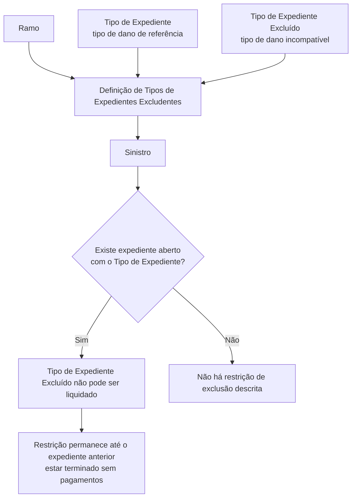

# Definição de Tipos de Expedientes Excludentes no Reef

## 1. Metadados do Documento
- **Arquivo de Origem:** `Não identificado no conteúdo fornecido`
- **Tipo de Documento:** `Procedimento`
- **Domínio / Sistema:** `Reef / Mapfre`
- **Público-Alvo:** `Negócio, Analistas Funcionais e Operação`
- **Data/Versão Identificada:** `Não identificada`

---

## 2. Resumo Executivo & Contexto de Negócio

O documento define a configuração de **Tipos de Expedientes Excludentes** no contexto do Reef. A finalidade declarada é determinar quais tipos de expediente e tipos de dano não podem coexistir em um mesmo sinistro.

A configuração exige que os Tipos de Expedientes sejam previamente definidos e associados aos respetivos Ramos. A exclusão é configurada por Ramo, estabelecendo combinações de tipos de expediente que não podem ser abertas simultaneamente em um sinistro.

O mecanismo utiliza um Tipo de Expediente como referência e um Tipo de Expediente Excluído como tipo incompatível. Caso já exista um expediente aberto com o tipo de referência, o tipo excluído não poderá ser liquidado enquanto o expediente anterior não estiver terminado sem pagamentos.

O documento também informa que a configuração de Tipos de Expedientes Excludentes é opcional: o controle pode ser realizado por meio de **Control Técnico**. Não há detalhamento adicional sobre esse controle alternativo, sobre métodos de integração ou sobre contratos técnicos.

---

## 3. Arquitetura, Componentes & Tecnologias Envolvidas

Componentes e conceitos explicitamente citados:

- **Reef:** contexto de documentação e manutenção da configuração.
- **Mapfre:** referência corporativa exibida na documentação.
- **Siniestro:** entidade de sinistro na qual a coexistência de expedientes é controlada.
- **Ramo:** chave de contexto para definição das propriedades específicas de exclusão.
- **Tipo de Expediente:** chave que identifica o tipo de dano de referência.
- **Tipo de Expediente Excluído:** chave do tipo de dano incompatível.
- **Control Técnico:** alternativa citada para controlar a regra sem definir Tipos de Expedientes Excludentes.



> *Nota de Análise: O documento não detalha interfaces, serviços, APIs, persistência, métodos HTTP, contratos JSON, tecnologias de implementação ou ambientes do Reef.*

---

## 4. Regras de Negócio, Especificações Funcionais & Processos

1. Devem ser definidos os Tipos de Expedientes antes da definição das exclusões.
2. Os Tipos de Expedientes devem ser associados aos Ramos antes da utilização da configuração de exclusão.
3. A definição de exclusões é realizada para a chave de um Ramo específico.
4. Um mesmo sinistro não pode ter determinados Tipos de Expedientes ou tipos de dano coexistindo quando houver uma relação de exclusão configurada.
5. O **Tipo de Expediente** identifica o tipo de dano de referência para o qual serão indicados outros Tipos de Expedientes que não poderão ser abertos no mesmo sinistro.
6. O **Tipo de Expediente Excluído** identifica o tipo de dano que será excluído.
7. O Tipo de Expediente Excluído não poderá ser liquidado se tiver sido previamente aberto um expediente com o Tipo de Expediente de referência.
8. A restrição de liquidação descrita permanece aplicável quando o expediente com o Tipo de Expediente de referência não estiver terminado sem pagamentos.
9. A definição de Tipos de Expedientes Excludentes não é obrigatória, pois o controle também pode ser realizado por **Control Técnico**.

> *Nota de Análise: O documento não define o significado operacional de “terminado sin pagos”, nem descreve o comportamento caso ambos os expedientes já existam ou como o Control Técnico implementa o controle alternativo.*

---

## 5. Tabelas de Parâmetros, Ambientes e Estruturas de Dados

| Item / Parâmetro | Descrição / Função | Tipo / Valores / Formato | Ambiente / Observações |
| :--- | :--- | :--- | :--- |
| Ramo | Indica a chave do Ramo para o qual serão definidos Tipos de Expedientes Excludentes. | Chave de Ramo | Propriedades específicas são detalhadas por chave de Ramo. |
| Tipo de Expediente | Identifica o tipo de dano de referência; determina quais outros Tipos de Expedientes não poderão ser abertos no mesmo sinistro se já existir expediente aberto desse tipo. | Chave do tipo de dano | Utilizado como origem da relação de exclusão. |
| Tipo de Expediente Excluído | Identifica o tipo de dano excluído, que não poderá ser liquidado se houver expediente previamente aberto com o Tipo de Expediente anterior e este não estiver terminado sem pagamentos. | Chave do tipo de dano | Utilizado como destino da relação de exclusão. |
| Tipos de Expedientes Excludentes | Configuração que define tipos de expediente e tipos de dano que não podem coexistir em um mesmo sinistro. | Definição por Ramo | A configuração é opcional quando o controle for realizado por Control Técnico. |
| Control Técnico | Mecanismo alternativo citado para controlar a exclusão sem definir Tipos de Expedientes Excludentes. | Não detalhado | O documento confirma a possibilidade de uso, mas não descreve funcionamento ou parâmetros. |
| Owner | Proprietário exibido na documentação. | `user:agonzalez_mapfre.com` | Metadado extraído literalmente. |
| Lifecycle | Estado de ciclo de vida exibido na documentação. | `Approved` | Metadado extraído literalmente. |

---

## 6. Bateria de Perguntas & Respostas para RAG (FAQ Sintético)

### P1: Qual é a finalidade da definição de Tipos de Expedientes Excludentes?
**R:** A finalidade é definir quais Tipos de Expedientes e tipos de dano não podem coexistir em um mesmo sinistro.

### P2: O que deve ser feito antes de configurar Tipos de Expedientes Excludentes?
**R:** Os Tipos de Expedientes devem ser previamente definidos e associados aos Ramos.

### P3: Qual é a função do campo Ramo na definição de exclusões?
**R:** O campo Ramo indica a chave do Ramo para o qual serão definidos os Tipos de Expedientes Excludentes que um mesmo sinistro não pode ter.

### P4: O que representa o Tipo de Expediente na configuração?
**R:** O Tipo de Expediente é a chave que identifica o tipo de dano de referência. Para esse tipo de dano são indicados outros Tipos de Expedientes que não poderão ser abertos no mesmo sinistro se já houver um expediente aberto com o tipo de referência.

### P5: O que representa o Tipo de Expediente Excluído?
**R:** O Tipo de Expediente Excluído é a chave do tipo de dano que será excluído. Esse tipo não poderá ser liquidado se já tiver sido aberto previamente um expediente com o Tipo de Expediente de referência e esse expediente anterior não estiver terminado sem pagamentos.

### P6: Em que condição um Tipo de Expediente Excluído não pode ser liquidado?
**R:** O Tipo de Expediente Excluído não pode ser liquidado quando já existe expediente aberto com o Tipo de Expediente anterior e esse expediente não está terminado sem pagamentos.

### P7: É obrigatório definir Tipos de Expedientes Excludentes para controlar incompatibilidades?
**R:** Não. O documento informa que é possível não definir Tipos de Expedientes Excludentes e controlar a regra por Control Técnico.

### P8: O documento descreve como o Control Técnico realiza o controle?
**R:** Não. O documento apenas confirma que Control Técnico pode ser usado como alternativa; não apresenta regras, parâmetros, fluxo técnico ou implementação desse controle.

### P9: O documento informa APIs ou contratos JSON para a manutenção de exclusões?
**R:** Não. O conteúdo fornecido não descreve APIs, métodos HTTP, contratos JSON, serviços ou integrações para a manutenção de Tipos de Expedientes Excludentes.

### P10: O documento define o que significa um expediente terminado sem pagamentos?
**R:** Não. A expressão “terminado sin pagos” é usada como condição para a restrição, mas o documento não fornece definição funcional ou critérios adicionais.

---

## 7. Glossário de Termos, Siglas & Conceitos-Chave

- **Reef:** Nome do contexto/sistema de documentação em que a definição é apresentada.
- **Mapfre:** Referência corporativa exibida na documentação.
- **Ramo:** Chave de contexto para a definição de propriedades específicas e Tipos de Expedientes Excludentes.
- **Sinistro / Siniestro:** Entidade na qual a coexistência de determinados Tipos de Expedientes é controlada.
- **Tipo de Expediente:** Chave que identifica o tipo de dano de referência em uma relação de exclusão.
- **Tipo de Expediente Excluído:** Chave do tipo de dano incompatível ou excluído em uma relação de exclusão.
- **Control Técnico:** Alternativa citada para aplicar o controle sem definir Tipos de Expedientes Excludentes.
- **Lifecycle:** Metadado de ciclo de vida da documentação; o valor exibido é `Approved`.

---

## 8. Notas Críticas, Riscos & Limitações

- O documento não identifica nome de arquivo, data, versão ou autor técnico.
- Não há detalhamento do exemplo anunciado após o texto `Ejemplo:`.
- O documento não define a semântica de “terminado sin pagos”.
- Não são apresentados comportamentos para exceções, conflitos de configuração, alteração de regras ou expedientes já existentes.
- Não há descrição de APIs, interfaces de manutenção, integrações, banco de dados, logs, permissões ou ambientes.
- O Control Técnico é citado como alternativa, mas não é detalhado; sua aplicação prática não pode ser inferida além da informação textual apresentada.

---

## 9. Conteúdo Bruto Estruturado (Referência Fiel)

```text
--- [PÁGINA 1 DE 2] ---

DEFINICIÓN Tipo de Expedientes Excluyente
Objetivo
La finalidad es definir que Tipos de Expedientes, tipos de daños, no pueden convivir en un mismo siniestro. Previamente se han de definir los
Tipos de Expedientes y asociarlos a los Ramos.
Imagen del Mantenimiento de Tipos de Expedientes Excluyentes:
Propiedades por Ramo
En este apartado se detallarán todos las propiedades específicas para la clave del ramo que estamos definiendo.
Ramo
Esta propiedad indica la clave del Ramo para el que se va a definir los Tipos de Expedientes que son Excluyentes, que no puede tener un
mismo Siniestro.
Documentation / DOCUMENTACIÓN Reef
DOCUMENTACIÓN Reef
Mapfredocument
DOCUMENTACIÓN Reef
Owner
user:agonzalez_mapfre.com
Lifecycle
Approved Source
 /
VL
Buscar Inicio Soluciones Arquitecturas APIs Componentes Cloud Documentación Zeus Reef Ayuda
ES


--- [PÁGINA 2 DE 2] ---

Tipo Expediente
Esta propiedad será la clave por la que se identifica al tipo daño, al cual se le va a indicar que otros Tipos de Expedientes no se podrán abrir
dentro de un mismo siniestro, si ya hay un expediente con este el Tipo abierto.
Tipo Expediente Excluido
Esta propiedad será la clave del tipo daño, que será excluido, no podrá liquidarse, si ya se ha abierto previamente un expediente con el Tipo
anterior y no está terminado sin pagos.
Vínculos
Definición Tipo Expediente
Preguntas frecuentes
¿Puede no definirse Tipos de Expedientes Excluyentes y controlarlo por Control Técnico?
Si, es posible.
Ejemplo:
```
