# Definição de Tipo de Expediente por Ramo — Documentação Reef

## 1. Metadados do Documento
- **Arquivo de Origem:** Não identificado no conteúdo fornecido
- **Tipo de Documento:** Especificação Funcional
- **Domínio / Sistema:** Reef / Mapfre — gestão de expedientes por ramo
- **Público-Alvo:** Analistas funcionais, configuradores, tramitadores, operação e desenvolvedores
- **Data/Versão Identificada:** Não identificada

---

## 2. Resumo Executivo & Contexto de Negócio

O documento descreve a configuração do comportamento de cada **Tipo de Expediente** dentro de um **Ramo** no sistema Reef. Um mesmo tipo de expediente pode existir em diversos ramos, mas as suas características operacionais, coberturas, limites, valores e comportamentos são definidos especificamente para cada ramo.

A configuração determina quais dados devem ser solicitados na abertura de um expediente, qual plano de tramitação deve conduzir o processo até o encerramento, se o expediente participa do cálculo de reservas de fim de mês, se permite abertura automática e como avisos operacionais devem ser emitidos.

O documento também estabelece regras para o uso de módulos funcionais, incluindo associação a juízos, peritação, faturação e plano de renda mensal. Algumas configurações podem ser fixas por tipo de expediente; quando dependerem de fatores adicionais, devem ser definidas por meio de uma lógica de negócio.

A finalidade operacional é padronizar o tratamento de danos e expedientes em diferentes ramos, mantendo flexibilidade para que cada ramo determine regras próprias de abertura, valorização, tramitação, encerramento e utilização de módulos.

---

## 3. Arquitetura, Componentes & Tecnologias Envolvidas

Os componentes funcionais citados são:

- **Reef:** sistema/documentação em que se configura o comportamento de tipos de expediente por ramo.
- **Ramo:** contexto de negócio no qual as características do tipo de expediente são definidas.
- **Tipo de Expediente / Tipo de Dano:** classificação do expediente cujo comportamento é configurado.
- **Siniestro:** evento ao qual o expediente está associado.
- **Estrutura de Informação:** conjunto de propriedades e atributos solicitados na abertura do expediente.
- **Lógica de Negócio:** mecanismo utilizado quando uma propriedade depende de fatores além do tipo de expediente.
- **Plano de Tramitação:** conjunto de gestões necessárias desde a abertura até o encerramento do expediente.
- **Catálogo de Moedas:** catálogo utilizado para definição da moeda de valorização.
- **Módulo de Juízo:** módulo para associação de expedientes a processos judiciais.
- **Módulo de Peritação:** módulo para solicitação e realização de peritações.
- **Módulo de Faturação:** módulo para tramitação de importes económicos, citado especialmente para expedientes de Saúde.
- **Plano de Renda Mensal:** modalidade de gestão indicada principalmente para Acidentes Pessoais ou Acidentes Laborais.
- **Avisos:** notificações apresentadas aos tramitadores na abertura, reassociação ou modificação de expedientes.

```mermaid
graph TD
  R[Ramo] --> C[Configuração do Tipo de Expediente por Ramo]
  T[Tipo de Expediente / Tipo de Dano] --> C

  C --> B[Propriedades básicas]
  C --> I[Informação para o Tipo de Expediente]
  C --> P[Plano de Tramitação]
  C --> M[Uso de Módulos]
  C --> A[Processos Automáticos]
  C --> V[Valorização e Reserva]
  C --> N[Avisos e Encerramento]

  B --> U[Único por Siniestro]
  B --> MO[Moeda e Moeda Única]

  I --> E[Estrutura de Informação]
  I --> LI[Lógica que determina a Informação]

  P --> PT[Plano de Tramitação]
  P --> LP[Lógica que determina o Plano]

  M --> J[Juízo e Vários Juízos]
  M --> PE[Peritação e Peritação Obrigatória]
  M --> F[Faturação]
  M --> RM[Plano de Renda Mensal]

  A --> AA[Abertura Automática]
  A --> LA[Lógica de Abertura Automática]
  A --> NE[Lógica do Número de Expedientes]

  V --> CR[Calcula Reserva]
  V --> LR[Lógica que determina se Calcula Reserva]
  V --> VA[Valorização Ajustada]

  N --> AO[Avisos de Abertura]
  N --> AR[Aviso de Reassociação]
  N --> AM[Aviso de Modificação]
  N --> TT[Tipo de Termina Trâmites]

  LI --> LN[Lógica de Negócio]
  LP --> LN
  LA --> LN
  NE --> LN
  LR --> LN
  PE --> LN
  AO --> LN
  AM --> LN
```



> **Nota de Análise:** O documento descreve propriedades funcionais e lógicas de negócio, mas não detalha implementação técnica, métodos HTTP, contratos JSON, bases de dados, versões de tecnologias ou endpoints.

---

## 4. Regras de Negócio, Especificações Funcionais & Processos

### 4.1 Definição por Ramo

Cada configuração identifica um ramo para o qual serão definidas as características de um tipo de expediente. O mesmo tipo de expediente pode ser utilizado em múltiplos ramos, pois comportamento, valores, coberturas e limites podem variar por ramo.

### 4.2 Unicidade por Siniestro

A propriedade **Único por Siniestro** determina se um tipo de expediente pode ser aberto apenas uma vez para cada siniestro.

Quando o tipo de expediente for único por siniestro, como nos exemplos citados de **Robo Total** e **Pérdida Total**, a abertura automática pode criar somente um expediente desse tipo.

### 4.3 Moeda e Moeda Única

A propriedade **Moneda** determina a moeda utilizada para valorar o tipo de expediente. A definição utiliza o catálogo de moedas.

O valor `99` possui uma regra específica: indica ao sistema que, no momento da abertura do expediente, a moeda do expediente deve ser a mesma moeda da apólice.

A moeda de valorização do expediente é independente da moeda utilizada posteriormente para pagamentos do expediente.

A propriedade **Moneda Única** determina se o tramitador poderá alterar a moeda no momento da abertura:

- Se a moeda for única, o tramitador não pode alterar o valor da moeda.
- Se a moeda não for única, o tramitador pode alterar o valor da moeda quando abrir o expediente.

### 4.4 Informação Solicitada na Abertura

A propriedade **Información para el Tipo de Expediente** define os dados que serão solicitados quando um expediente do tipo configurado for aberto.

Para cada propriedade da informação, devem ser definidos, entre outros elementos:

- Comprimento, representado pelo número de posições.
- Tipo de dado, como numérico, alfanumérico ou data.
- Obrigatoriedade, incluindo eventual condição para que o dado seja obrigatório.
- Validação, por exemplo, validação da existência de um código em catálogo.
- Valor inicial, quando o sistema deve apresentar um valor previamente preenchido.

O conjunto de propriedades e atributos recebe uma chave e um nome, sendo cadastrado como uma **estrutura**. A estrutura é associada à agrupação de informação do expediente e, posteriormente, a chave da estrutura é associada ao tipo de expediente.

Quando não for necessário solicitar informação, deve ser utilizado o valor genérico da estrutura.

### 4.5 Lógica para Determinar Informação

Quando as informações solicitadas não forem fixas para um tipo de expediente e dependerem de outros fatores, deve ser definida uma lógica de negócio que determine as informações necessárias para tramitar aquele tipo de dano.

### 4.6 Plano de Tramitação

O **Plano de Tramitação** realiza as gestões necessárias desde a abertura até o encerramento do expediente.

Um tipo de expediente pode:

- Possuir um plano de tramitação definido.
- Não necessitar de plano de tramitação, conforme a sua natureza.
- Necessitar de um plano variável, determinado por outros fatores por meio de lógica de negócio.

A lógica que determina o plano de tramitação deve retornar o código do plano que será utilizado para tramitar o tipo de dano.

### 4.7 Cálculo de Reserva

A propriedade **Calcula Reserva** determina se os importes de expedientes de um determinado tipo de dano devem ser considerados no cálculo de reservas de fim de mês.

Quando a participação no cálculo de reservas depender de fatores além do tipo de expediente, deve ser definida uma lógica de negócio para decidir se o expediente será considerado.

### 4.8 Causas de Abertura

A propriedade **Causas de Apertura** determina se as causas de abertura devem ser solicitadas durante a abertura do expediente.

Quando esta propriedade indicar que as causas devem ser solicitadas, devem ser definidas as causas de abertura de expedientes para o tipo de expediente do ramo configurado.

### 4.9 Valorização Ajustada

A propriedade **Valoración Ajustada** determina o comportamento da reserva inicial em aberturas manuais:

- Pode permitir que o tramitador indique manualmente uma reserva inicial.
- Pode obrigar que o expediente seja aberto pela reserva média previamente definida, sem possibilidade de alteração pelo tramitador.

### 4.10 Juízo

A propriedade **Juicio** determina se um expediente de determinado tipo de dano pode ser associado a um juízo.

Durante o registo de um juízo e a associação de expedientes, devem ser apresentados apenas os expedientes cujo tipo possua a marca de juízo.

A propriedade **Varios Juicios** determina se um expediente do tipo configurado pode ser associado a vários juízos.

### 4.11 Peritação

A propriedade **Peritación** determina se um expediente do tipo de dano configurado pode receber uma peritação. Apenas expedientes com marca de peritação podem receber solicitação de peritação.

A propriedade **Peritación Obligatoria** determina se a peritação é obrigatória. Esta propriedade somente é solicitada quando a propriedade Peritación estiver afirmativa.

Quando a peritação for obrigatória, não é permitido realizar liquidações até que a peritação tenha sido realizada.

Quando a obrigatoriedade da peritação depender de outros fatores além do tipo de dano, deve ser definida uma lógica de negócio para determinar essa obrigatoriedade.

### 4.12 Faturação e Plano de Renda Mensal

A propriedade **Facturación** determina se os importes económicos de um expediente serão tramitados pelo módulo de Faturação. O documento indica que esse uso é comum sobretudo para tipos de expedientes de Saúde.

A propriedade **Plan de Renta Mensual** determina se o expediente será gerido por um Plano de Renda Mensal. O documento indica que esse uso é comum sobretudo para tipos de Acidentes Pessoais ou Acidentes Laborais.

### 4.13 Abertura Automática

A propriedade **Apertura Automática** determina se o tipo de expediente pode ser aberto automaticamente, desde que seja selecionada a causa-consequência que permita essa abertura.

Na abertura automática, o expediente é aberto pela reserva inicial definida para a seguinte combinação:

1. Ramo.
2. Causa.
3. Consequência.
4. Tipo de Expediente.
5. Conceito de reserva.
6. Cobertura.

Quando a abertura automática não for sempre aplicável e depender de outros fatores, deve ser definida uma lógica de negócio para decidir se o expediente será aberto automaticamente.

### 4.14 Número de Expedientes em Abertura Automática

A propriedade **Lógica que determina Número de Expedientes a abrir automáticamente** somente é solicitada quando:

- A abertura automática do tipo de expediente estiver ativa; ou
- Houver uma lógica para determinar se o expediente é aberto automaticamente.

A lógica deve devolver o número de expedientes daquele tipo que serão abertos automaticamente.

Se o tipo de expediente for único por siniestro, somente um expediente poderá ser aberto.

### 4.15 Avisos Operacionais

A lógica que determina o aviso de abertura devolve o aviso que deve ser mostrado ao tramitador quando for atribuído um novo expediente, aberto manual ou automaticamente.

O **Tipo de Aviso de Reasignación de Expediente** contém o subtipo de aviso que será mostrado ao tramitador quando um expediente, que anteriormente era tratado por outro tramitador, for reassociado manual ou automaticamente.

A propriedade **Aviso en la Modificación de Expediente** controla a geração de aviso na modificação de um expediente:

- Valor `1`: não gera aviso na modificação do expediente.
- Valor `2`: gera aviso na modificação do expediente.

Quando o valor for `2`, a **Lógica que determina Aviso Modificación de Expediente** é obrigatória e deve devolver o aviso mostrado ao tramitador quando um expediente for modificado manual ou automaticamente.

### 4.16 Encerramento de Trâmites

A propriedade **Tipo de Termina Tramites** determina a ação executada sobre pendências do plano de tramitação quando um expediente é encerrado manual ou automaticamente.

As pendências abrangem, entre outros itens, trâmites pendentes e avisos pendentes.

---

## 5. Tabelas de Parâmetros, Ambientes e Estruturas de Dados

| Item / Parâmetro | Descrição / Função | Tipo / Valores / Formato | Ambiente / Observações |
| :--- | :--- | :--- | :--- |
| Ramo | Chave do ramo para o qual são definidas as características do tipo de expediente. | Chave de ramo. | Configuração por ramo. |
| Tipo de Expediente | Tipo de expediente ou tipo de dano cujo comportamento será configurado. | Identificador funcional. | Pode existir em vários ramos. |
| Único por Siniestro | Determina se o tipo de expediente pode ser aberto apenas uma vez por siniestro. | Indicador sim/não. | Limita a abertura automática a um expediente quando aplicável. |
| Moneda | Moeda utilizada para valorar o expediente. | Código do catálogo de moedas; `99`. | O valor `99` usa a moeda da apólice na abertura. |
| Moneda Única | Define se a moeda configurada é a única permitida para o tipo de expediente. | Indicador sim/não. | Se afirmativo, o tramitador não pode alterá-la na abertura. |
| Informação para o Tipo de Expediente | Define os dados solicitados na abertura do tipo de expediente. | Estrutura de informação. | Pode utilizar valor genérico da estrutura quando não houver dados a solicitar. |
| Comprimento | Define o número de posições de uma propriedade da estrutura de informação. | Número de posições. | Aplicável a cada propriedade da informação. |
| Tipo | Define o tipo de dado da propriedade. | Numérico, alfanumérico, data, entre outros. | Aplicável a cada propriedade da informação. |
| Obrigatoriedade | Define se um dado é obrigatório e em quais condições. | Regra de obrigatoriedade. | Aplicável a cada propriedade da informação. |
| Validação | Define validações de dados, incluindo validação contra catálogo. | Regra de validação. | Exemplo citado: existência de código em catálogo. |
| Valor Inicial | Valor apresentado inicialmente pelo sistema ao solicitar uma informação. | Valor configurado. | Aplicável a cada propriedade da informação. |
| Lógica que determina a Informação | Determina os dados a solicitar quando a informação não for fixa por tipo de expediente. | Lógica de negócio. | Depende de outros fatores. |
| Plano de Tramitação | Plano responsável pelas gestões desde a abertura até o encerramento. | Código de plano. | Pode não ser necessário ou pode ser variável. |
| Lógica que determina o Plano de Tramitação | Determina o código do plano aplicável. | Lógica de negócio. | Usada quando o plano depende de outros fatores. |
| Calcula Reserva | Define se os importes do expediente entram no cálculo de reservas de fim de mês. | Indicador de inclusão/exclusão. | Pode depender de lógica de negócio. |
| Lógica que determina se Calcula Reserva | Decide a participação no cálculo de reservas quando existem fatores adicionais. | Lógica de negócio. | Aplicável quando o tipo de dano não for o único fator. |
| Causas de Apertura | Define se as causas de abertura devem ser solicitadas. | Indicador sim/não. | Requer definição das causas para o tipo de expediente do ramo quando aplicável. |
| Valoración Ajustada | Define se o tramitador pode informar a reserva inicial manualmente. | Regra de abertura manual. | Alternativamente, usa reserva média sem possibilidade de alteração. |
| Juicio | Define se o expediente pode ser associado a um juízo. | Indicador sim/não. | Apenas tipos com marca de juízo são exibidos na associação. |
| Varios Juicios | Define se o expediente pode ser associado a vários juízos. | Indicador sim/não. | Uso de módulos. |
| Peritación | Define se o expediente pode receber peritação. | Indicador sim/não. | Só expedientes com marca de peritação podem solicitar peritação. |
| Peritación Obligatoria | Define se a peritação é obrigatória. | Indicador sim/não. | Solicitada apenas se Peritación for afirmativa. |
| Lógica que determina se Peritación Obligatoria | Decide se a peritação é obrigatória quando há fatores adicionais. | Lógica de negócio. | Sem peritação obrigatória concluída, liquidações não são permitidas. |
| Facturación | Define se os importes económicos serão tramitados pelo módulo de Faturação. | Indicador sim/não. | Citado sobretudo para tipos de expedientes de Saúde. |
| Plan de Renta Mensual | Define se o expediente será gerido por Plano de Renda Mensal. | Indicador sim/não. | Citado sobretudo para Acidentes Pessoais ou Acidentes Laborais. |
| Apertura Automática | Define se o tipo de expediente pode ser aberto automaticamente. | Indicador sim/não. | Depende de causa-consequência que permita abertura. |
| Reserva inicial na abertura automática | Reserva usada na abertura automática. | Configuração de reserva. | Definida por ramo, causa, consequência, tipo, conceito de reserva e cobertura. |
| Lógica que determina Apertura Automática | Decide se a abertura automática deve ocorrer. | Lógica de negócio. | Aplicável quando a abertura depende de fatores adicionais. |
| Lógica que determina Número de Expedientes | Devolve quantos expedientes devem ser abertos automaticamente. | Lógica de negócio. | Solicitada se abertura automática estiver ativa ou possuir lógica de abertura. |
| Lógica que determina Aviso Apertura de Expediente | Devolve o aviso apresentado na atribuição de novo expediente. | Lógica de negócio. | Aplicável a abertura manual ou automática. |
| Tipo de Aviso de Reasignación de Expediente | Define o subtipo de aviso para reassociação de expediente. | Subtipo de aviso. | Quando o expediente era tratado por outro tramitador. |
| Aviso en la Modificación de Expediente | Define se a modificação gera aviso. | `1` ou `2`. | `1`: não gera aviso; `2`: gera aviso. |
| Lógica que determina Aviso Modificación de Expediente | Devolve o aviso da modificação de expediente. | Lógica de negócio. | Obrigatória quando Aviso en la Modificación de Expediente for `2`. |
| Tipo de Termina Tramites | Define a ação sobre pendências no encerramento de expediente. | `N`, `D`, `A` ou `T`. | Aplicável a encerramento manual ou automático. |

| Valor | Significado | Observações |
| :--- | :--- | :--- |
| `99` | Utilizar a moeda da apólice ao abrir o expediente. | Aplicável à propriedade Moneda. |
| `1` | Não gera aviso na modificação de expediente. | Aplicável a Aviso en la Modificación de Expediente. |
| `2` | Gera aviso na modificação de expediente. | Exige lógica para determinar o aviso de modificação. |
| `N` | Não finaliza nada. | Tipo de Termina Tramites. |
| `D` | Finaliza trâmites definidos pendentes. | Tipo de Termina Tramites. |
| `A` | Finaliza avisos pendentes. | Tipo de Termina Tramites. |
| `T` | Finaliza tudo. | Tipo de Termina Tramites. |

---

## 6. Bateria de Perguntas & Respostas para RAG (FAQ Sintético)

### P1: Um mesmo tipo de expediente pode ser configurado em vários ramos?
**R:** Sim. O documento informa que um mesmo tipo de expediente pode existir em vários ramos, pois as características de comportamento, valores, coberturas e limites são definidas por ramo. O exemplo apresentado é o tipo `ROB - Robo`, que pode ser definido para todos os ramos e posteriormente explorado para identificar quantos roubos existem na companhia.

### P2: O que acontece quando a propriedade Moneda recebe o valor 99?
**R:** O valor `99` indica ao sistema que, no momento da abertura do expediente, a moeda do expediente deve ser obtida da moeda da apólice. A moeda do expediente usada para valorização permanece independente da moeda que poderá ser utilizada posteriormente nos pagamentos.

### P3: Qual é o efeito de configurar Moneda Única como afirmativa?
**R:** Quando Moneda Única é afirmativa, a moeda definida para o tipo de expediente é a única permitida e o tramitador não poderá alterar esse valor ao abrir o expediente. Quando não for única, o tramitador poderá mudar a moeda no momento da abertura.

### P4: Como são definidos os dados solicitados na abertura de um tipo de expediente?
**R:** Os dados são definidos por uma estrutura de informação associada ao tipo de expediente. Para cada propriedade, devem ser configurados elementos como comprimento, tipo de dado, obrigatoriedade, condições de obrigatoriedade, validação e valor inicial. Se nenhuma informação precisar ser solicitada, deve ser utilizado o valor genérico da estrutura.

### P5: Quando deve ser utilizada uma lógica para determinar a informação do tipo de expediente?
**R:** A lógica deve ser utilizada quando os dados solicitados não são fixos para o tipo de expediente e dependem de outros fatores. A lógica de negócio deve determinar quais informações serão solicitadas para permitir a tramitação daquele tipo de dano.

### P6: Quando um tipo de expediente pode não ter um plano de tramitação fixo?
**R:** Um tipo de expediente pode não necessitar de plano de tramitação devido à sua natureza. Também pode ter um plano variável quando o plano aplicável depender de outros fatores. Nesse segundo caso, deve existir uma lógica de negócio que devolva o código do plano de tramitação a ser utilizado.

### P7: O que impede a realização de liquidações em um expediente com peritação obrigatória?
**R:** Quando Peritación Obligatoria estiver definida como obrigatória, não será permitido realizar liquidações até que a peritação seja efetivamente realizada. Essa configuração somente é solicitada quando a propriedade Peritación estiver afirmativa.

### P8: Como funciona a abertura automática de expedientes?
**R:** A abertura automática é permitida quando a propriedade Apertura Automática estiver habilitada e for escolhida uma causa-consequência que permita a abertura. O expediente é aberto usando a reserva inicial definida para a combinação de ramo, causa, consequência, tipo de expediente, conceito de reserva e cobertura.

### P9: Quantos expedientes podem ser abertos automaticamente para um tipo único por siniestro?
**R:** Quando o tipo de expediente for único por siniestro, somente um expediente poderá ser aberto automaticamente. O documento cita Robo Total e Pérdida Total como exemplos de tipos únicos por siniestro.

### P10: Quando a lógica de número de expedientes automáticos deve ser configurada?
**R:** A lógica que determina o número de expedientes a abrir automaticamente é solicitada quando a abertura automática estiver ativada para o tipo de expediente ou quando existir uma lógica que determine se o expediente deve ser aberto automaticamente. A lógica deve devolver a quantidade de expedientes a criar.

### P11: Quais valores controlam o aviso na modificação de expediente?
**R:** A propriedade Aviso en la Modificación de Expediente aceita o valor `1`, que não gera aviso na modificação, e o valor `2`, que gera aviso na modificação. Se o valor for `2`, a lógica que determina o aviso de modificação é obrigatória.

### P12: Quais são os valores possíveis para Tipo de Termina Tramites?
**R:** Os valores possíveis são `N` para não finalizar nada, `D` para finalizar trâmites definidos pendentes, `A` para finalizar avisos pendentes e `T` para finalizar tudo. A propriedade define o que ocorre com pendências do plano de tramitação quando um expediente é encerrado manual ou automaticamente.

---

## 7. Glossário de Termos, Siglas & Conceitos-Chave

- **Reef:** sistema ou domínio documental no qual é configurado o comportamento de tipos de expediente por ramo.
- **Ramo:** classificação de negócio utilizada para definir características específicas de um tipo de expediente.
- **Expediente:** entidade de gestão associada a um siniestro e a um tipo de dano.
- **Tipo de Expediente:** classificação do expediente cujo comportamento é configurado por ramo.
- **Tipo de Daño:** termo utilizado no documento como referência ao tipo de expediente/dano tratado.
- **Siniestro:** evento associado a um expediente.
- **Tramitador:** utilizador responsável pela tramitação de um expediente.
- **Plano de Tramitação:** conjunto de gestões necessárias da abertura ao encerramento de um expediente.
- **Lógica de Negócio:** regra configurável que determina comportamento quando o tipo de expediente não é o único fator decisório.
- **Reserva:** importe considerado na valorização do expediente e, quando aplicável, no cálculo de reservas de fim de mês.
- **Peritación:** avaliação/perícia realizada em expedientes habilitados para esse processo.
- **Juicio:** processo judicial ao qual um expediente pode ser associado.
- **Facturación:** módulo utilizado para tramitação de importes económicos.
- **Plan de Renta Mensual:** plano de gestão mensal de renda aplicável a determinados tipos de expedientes.
- **Apertura Automática:** criação automática de expediente quando as condições configuradas são atendidas.
- **Aviso:** notificação apresentada ao tramitador durante abertura, reassociação ou modificação de expediente.
- **Cobertura:** elemento utilizado na composição da reserva inicial para abertura automática.

---

## 8. Notas Críticas, Riscos & Limitações

- O documento não identifica versão, data, autor técnico, ambiente, URLs, integrações externas ou contratos técnicos.
- Não são detalhadas as estruturas de dados, códigos de catálogo, exemplos concretos de lógicas de negócio ou linguagem utilizada para implementar essas lógicas.
- O documento menciona imagens e exemplos em múltiplas seções, mas o conteúdo textual fornecido não apresenta os detalhes dessas imagens ou exemplos.
- O documento não descreve o comportamento em caso de erro, inconsistência de catálogo, falha de abertura automática ou falha na execução de lógicas de negócio.
- A regra de peritação obrigatória cria uma dependência operacional direta: liquidações ficam bloqueadas até que a peritação seja realizada.
- A abertura automática depende de configuração consistente de ramo, causa, consequência, tipo de expediente, conceito de reserva e cobertura.
- **Nota de Análise:** O documento menciona o sistema Reef e a documentação Mapfre, mas não detalha APIs, microsserviços, métodos HTTP, contratos JSON, persistência de dados ou mecanismos técnicos de integração.

---

## 9. Conteúdo Bruto Estruturado (Referência Fiel)

```text
--- [PÁGINA 1 DE 6] ---

DEFINICIÓN Tipo de Expediente Por Ramo

Objetivo

La finalidad es definir comportamiento de cada tipo de expedientes en los diferentes ramos donde se pueda dar este tipo de daño, es decir, la información que se va a solicitar para ese tipo de expediente, si se puede peritar, si se puede asociar a un juicio, si es un recobro, etc.

Propiedades Por Ramo
Propiedades Por Ramo para Procesos Automáticos
Propiedades Por Ramo para Uso de Módulos
Propiedades por Ramo

Como se ha indicado anteriormente, los tipos de expedientes pueden tener diferente comportamiento por ramo.

En este apartado se detallará todos las propiedades necesarias para definir el comportamiento del tipo de expediente dentro de un Ramo.

Se definirá que captura de datos va a tener asociado el tipo de expediente, que plan de tramitación (Procesos necesarios para tramitar correctamente el expediente), si se apertura automáticamente, etc.

Imagen del Mantenimiento Tipos de Expedientes por Ramo:

Documentation / DOCUMENTACIÓN Reef
DOCUMENTACIÓN Reef
Mapfredocument
DOCUMENTACIÓN Reef

Owner
user:agonzalez_mapfre.com

Lifecycle
Approved Source / VL

Buscar Inicio Soluciones Arquitecturas APIs Componentes Cloud Documentación Zeus Reef Ayuda
ES


--- [PÁGINA 2 DE 6] ---

Ramo

Esta propiedad indica la clave del Ramo para el que se va a definir las características del tipo de expediente.

Único por Siniestro

Esta propiedad indica si ese tipo de expediente sólo puede abrirse una vez por siniestro.

Moneda

Esta propiedad indica la moneda con la que se va a valorar ese tipo de expediente.

Para dar valor a esta propiedad se contará con la ayuda del catálogo de monedas.

Si se necesita que la moneda del expediente sea siempre la misma que la moneda de la póliza, se tendrá que introducir 99. Este valor indica al sistema que cuando se abra el expediente, tome la moneda de la póliza.

La moneda del expediente, es independiente de la moneda con la que posteriormente se realicen los pagos de dicho expediente.

Moneda Única

Esta propiedad indica si la moneda que se ha definido en la propiedad anterior, es la única moneda permitida para el Tipo de Expediente.

Si se indica que, SI es única, el tramitador no podrá cambiar el valor de la moneda cuando abra un expediente.

Si se indica que No es única, el tramitador podrá cambiar el valor de la moneda cuando se abra un expediente.

Ejemplo:


--- [PÁGINA 3 DE 6] ---

Información para el Tipo de Expediente

Esta propiedad indica los datos que se van a pedir cuando se abra un expediente del Tipo que se está definiendo.

Para cada tipo de expediente habrá que determinar toda la información que se va a requerir, para cada propiedad habrá que indicar:

Longitud: número de posiciones.
Tipo: Numérico, alfanumérico, fecha…
Obligatoriedad: si es o no obligatorio, o las condiciones para que este dato sea obligatorio.
Validación: si está codificado en un catálogo, ver si existe el código en dicho catálogo…
Valor Inicial: Si se quiere que el sistema cuando pida la información ya tenga un valor inicial,
Etc.

A toda esa información (conjunto de propiedades, atributos) se le dará una clave y un nombre es decir se le dará de alta como estructura y se le asociará a la agrupación de información de expediente, posteriormente dicha clave de estructura, se asociará al Tipo de Expediente.

Si no se quiere pedir información, se utilizará el valor genérico de la estructura.

Lógica que determina la información del Tipo de Expediente

Esta propiedad contendrá una lógica de Negocio, cuando la información que recoge los datos no es fija por tipo de expediente, sino que depende de otros factores.

Se tendrá que definir la lógica de Negocio que determine la información que se va a solicitar, para tramitar ese tipo de daño.

Plan de Tramitación

Esta propiedad indicará el plan de tramitación que se encargará de realizar todas las gestiones necesarias desde la apertura del expediente, hasta su cierre. Se facilitará la ayuda de los planes de tramitación definidos.

Puede haber tipos de Expedientes que por su naturaleza no necesiten un plan de tramitación o que el plan no sea siempre el mismo y dependa de otros factores. En este último caso se ha de utilizar una lógica.

Lógica que determina el Plan de Tramitación

Esta propiedad contendrá una lógica de Negocio, cuando el plan de tramitación no es fijo por tipo de expediente, sino que depende de otros factores. Se tendrá que definir la lógica de Negocio que determine el código del plan que se va a utilizar, para tramitar este tipo de daño.

Calcula Reserva

Esta propiedad indicará si un expediente con el Tipo de Daño que se está definiendo, se tiene en cuenta o no sus importes, en el cálculo de reservas de fin de mes. Cuando haya otros factores además del Tipo de Expediente que determine si entra o no entra, se tendrá que definir una lógica de Negocio.

Lógica que determina si Calcula Reserva

Esta propiedad contendrá una lógica de Negocio, que determinará si los expedientes con este tipo de daño se tienen en cuenta o no, para el cálculo de reservas de fin de mes. Se tendrá que definir esta lógica cuando no dependa únicamente del tipo de daño, sino de otros factores.

Causas de Apertura

Esta propiedad indicará si se quiere pedir las causas de apertura cuando estamos aperturando un expediente del tipo que estamos definiendo. Si se indica que sí, habrá que definir las causas de Apertura de Expedientes para el Tipo de Expediente del Ramo que se está definiendo.

Ejemplo:
Ejemplo:
Ejemplo:
Ejemplo:


--- [PÁGINA 4 DE 6] ---

Valoración Ajustada

Esta propiedad indicará si al abrir un expediente de este tipo manualmente, se le va a permitir al tramitador indicar una reserva inicial manualmente, o si por el contrario siempre se va a abrir por la reserva promedio definida previamente, sin poder ser modificada el tramitador.

Propiedades por Ramo Uso de Módulos

Juicio

Esta propiedad indicará si un expediente con el Tipo de Daño que se está definiendo, puede ser asociado a un juicio. Cuando se registre un juicio, y se le vaya a asociar expedientes, sólo se mostrarán los expedientes cuyo Tipo, tenga la Marca de Juicio.

Varios Juicios

Esta propiedad indicará si un expediente con el Tipo de Daño que se está definiendo, puede ser asociado a varios juicios.

Peritación

Esta propiedad indicará si un expediente con el Tipo de Daño que se está definiendo, se le puede realizar una peritación. Sólo se podrá solicitar una peritación, a los expedientes cuyo Tipo tenga la Marca de Peritación.

Peritación Obligatoria

Esta propiedad indicará si un expediente con el Tipo de Daño que se está definiendo, es obligatorio que se le realice una peritación. Esta información se solicitará, si la propiedad anterior es afirmativo. Si se indica que es obligatorio tener una peritación, no se dejará realizar liquidaciones, hasta que no se realice dicha peritación.

Lógica que determina si Peritación Obligatoria

Esta propiedad contendrá una lógica de Negocio, que determinará si los expedientes con este tipo de daño, es obligatorio o no, realizar la peritación. Se tendrá que definir esta lógica cuando no dependa únicamente del tipo de daño, sino de otros factores.

Facturación

Esta propiedad indicará si un expediente con el Tipo de Daño que se está definiendo, se va a tramitar sus importes económicos a través del módulo de Facturación. Esto se suele utilizar sobre todo para los tipos de Expedientes de Salud.

Plan de Renta Mensual

Esta propiedad indicará si un expediente con el Tipo de Daño que se está definiendo, se va a gestionar por un Plan de Renta Mensual. Esto se suele utilizar sobre todo para los tipos de Accidentes Personales o Accidentes Laborales.

Propiedades por Ramo para Procesos Automáticos

Apertura Automática

Esta propiedad indica si el tipo de expediente que se está definiendo, se va a permitir aperturar automáticamente, siempre que se elija la causa consecuencia que permita abrirlo.

Cuando se apertura automáticamente, se abre por la reserva inicial definida para el Ramo, causa, consecuencia, Tipo de Expediente, concepto de reserva, cobertura.

Lógica que determina Apertura Automática

Esta propiedad contendrá una lógica de Negocio, cuando no siempre se abre o no se abre automáticamente, sino que va a depender de otros factores que no son el tipo de expediente que se está definiendo. Se tendrá que definir la lógica de Negocio que determine si se abre o no automáticamente.

Ejemplo:
Ejemplo:
Ejemplo:


--- [PÁGINA 5 DE 6] ---

Lógica que determina Número de Expedientes a abrir automáticamente

Esta propiedad sólo se pedirá si está activada la apertura automática del tipo de expediente que se está definiendo o si se ha definido una lógica para determinar si se abre o no automáticamente. Esta propiedad contendrá una lógica de Negocio, que devolverá el número de expedientes que se va a abrir automáticamente de ese tipo.

Si el tipo de Expediente es único por siniestro (Robo Total, Pérdida Total), sólo se podrá abrir uno.

Lógica que determina Aviso Apertura de Expediente

Esta propiedad contendrá una lógica de Negocio, que devolverá el Aviso que se quiere mostrar al tramitador, cuando se le asigne un expediente nuevo abierto manual o automáticamente.

Tipo de Aviso de Reasignación de Expediente

Esta propiedad contendrá el subtipo de Aviso que se quiere mostrar al tramitador, cuando se le Re-asigne un expediente manual o automáticamente, que estaba tramitando otro tramitador.

Aviso en la Modificación de Expediente

Esta propiedad contendrá si se genera o no se genera aviso en la modificación de Expediente. Los valores posibles son:

1 No genera aviso en la modificación de Expediente
2 Si genera aviso en la modificación de Expediente

Lógica que determina Aviso Modificación de Expediente

En el caso en el que la propiedad anterior sea un 2 (genera aviso en la modificación del expediente), esta propiedad contendrá una lógica de Negocio, que devolverá el Aviso que se quiere mostrar al tramitador, cuando se modifique un expediente manual o automáticamente. Esta propiedad será obligatorio, siempre y cuando el tipo de aviso de modificación de expediente sea ‘2’.

Tipo de Termina Tramites

Esta propiedad contendrá que acción se debe realizar con todo lo que hay pendiente en el Plan de tramitación de un expediente, cuando este se termina. Es decir, cuando se termina un expediente manual o automáticamente, qué hacer con los trámites pendientes, con los avisos pendientes, etc.

Los valores posibles son:

N No se finaliza Nada
D Finaliza trámites Definidos Pendientes
A Finaliza Avisos Pendientes
T Finaliza Todo

Preguntas frecuentes

1. ¿Puede haber un mismo tipo de expediente en varios Ramos? Si, ya que las características de comportamiento, de valores, de coberturas, de límites, etc., se definen por ramo. Se podría definir un tipo de expediente ROB- Robo, para todos los ramos, de tal manera que se pudiera explotar cuantos Robos hay en la compañía.

Ejemplo:
Ejemplo:
Ejemplo:
Ejemplo:
Ejemplo:


--- [PÁGINA 6 DE 6] ---

[Página em branco ou apenas elementos visuais/imagem]
```
