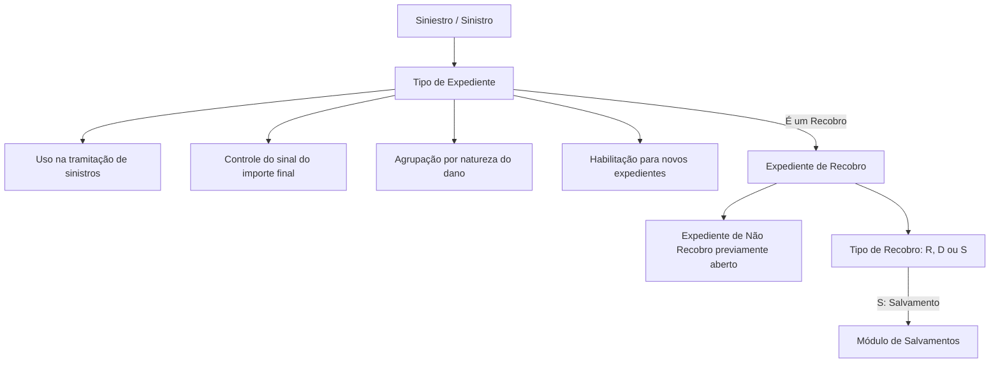
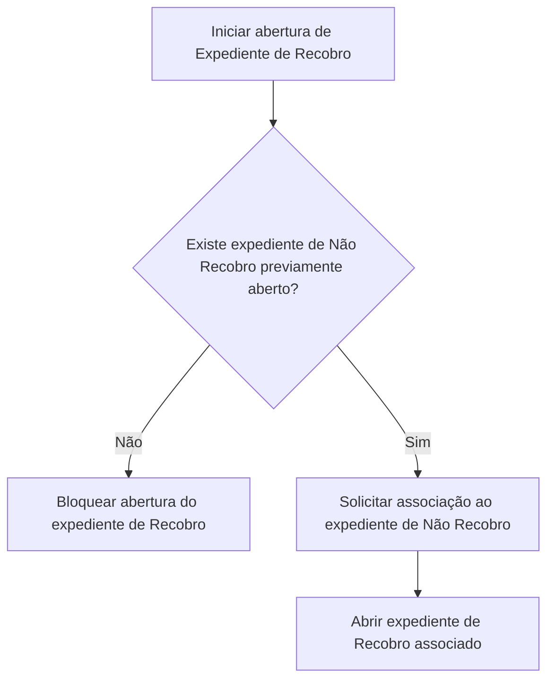

# Definição de Tipos de Expediente — Propriedades Gerais e Recobros

## 1. Metadados do Documento
- **Arquivo de Origem:** Não identificado; conteúdo extraído de documentação Reef/Mapfredocument.
- **Tipo de Documento:** Especificação Funcional.
- **Domínio / Sistema:** Reef — manutenção de Tipos de Expediente para gestão de sinistros.
- **Público-Alvo:** Negócio, analistas funcionais, desenvolvedores e operação de sinistros.
- **Data/Versão Identificada:** Não identificada.

---

## 2. Resumo Executivo & Contexto de Negócio

O documento define as tipologias de danos que podem resultar de um sinistro, denominadas **Tipos de Expediente**. Essas tipologias abrangem tanto danos sofridos pelo segurado quanto danos causados pelo segurado a terceiros.

Cada Tipo de Expediente possui propriedades gerais aplicáveis aos diversos ramos. O documento indica que uma mesma chave de Tipo de Expediente pode ser utilizada por um ou mais ramos, enquanto determinadas propriedades permanecem comuns, sem variação por ramo.

A especificação também descreve a utilização dos Tipos de Expediente na tramitação de sinistros, incluindo controles de habilitação, sinal financeiro do importe final e agrupamento dos tipos conforme sua natureza, como danos materiais, danos pessoais ou roubos.

Uma seção específica é dedicada aos **Tipos de Expediente de Recobro por Companhia**. O recobro permite recuperar parte do valor de um sinistro de uma companhia, terceiro ou segurado. O documento estabelece que um expediente de recobro deve estar obrigatoriamente associado a um expediente previamente aberto que não seja de recobro.

---

## 3. Arquitetura, Componentes & Tecnologias Envolvidas

O conteúdo não descreve uma arquitetura técnica detalhada, APIs, métodos HTTP, contratos JSON, bancos de dados, ambientes ou integrações entre microsserviços. A referência identificada é a documentação do sistema **Reef**, disponível em contexto de documentação corporativa Mapfre.

Os componentes funcionais identificados são:

- **Reef:** sistema/documentação no qual são mantidas as definições de Tipos de Expediente.
- **Tipos de Expediente:** classificação dos danos derivados de um sinistro.
- **Tramitação de Sinistros:** processo que utiliza os Tipos de Expediente habilitados para processamento de danos.
- **Expediente de Não Recobro:** expediente previamente aberto ao qual um recobro deve ser associado.
- **Expediente de Recobro:** expediente usado para recuperar parte do importe de um sinistro.
- **Módulo de Salvamentos:** módulo que pode tramitar recobros classificados como salvamentos.



> **Nota de Análise:** o documento não detalha a implementação técnica do Reef, nem interfaces, serviços, tabelas físicas, regras de persistência, permissões ou contratos de integração.

---

## 4. Regras de Negócio, Especificações Funcionais & Processos

### 4.1 Finalidade dos Tipos de Expediente

- Os Tipos de Expediente definem todas as tipologias possíveis de danos produzidos como consequência de um sinistro.
- A definição cobre:
  - danos ocasionados ao segurado;
  - danos que o segurado tenha ocasionado a terceiros.
- Para cada tipo de dano, o sistema pode determinar seu comportamento nos ramos em que esse dano possa ocorrer.
- O comportamento mencionado inclui:
  - informações solicitadas para o Tipo de Expediente;
  - possibilidade de perícia;
  - possibilidade de associação a um juízo/processo judicial;
  - identificação de recobro.

> **Nota de Análise:** o documento cita perícia, associação a juízo e informações solicitadas, mas não fornece as regras, campos, critérios ou valores específicos para cada situação.

### 4.2 Identificação do Tipo de Expediente

- O **Tipo de Expediente** é a chave utilizada para identificar os diferentes danos provocados por um sinistro.
- Uma chave de Tipo de Expediente pode ser utilizada em um ou vários ramos.

### 4.3 Nome do Tipo de Expediente

- O **Nome do Tipo de Expediente** é a descrição da chave definida para o tipo.
- O nome pode conter números e/ou letras.

### 4.4 Uso em Sinistros

- A propriedade **Uso em Sinistros** indica se o Tipo de Expediente, entendido como tipo de dano, será utilizado na tramitação de sinistros.
- Normalmente, o tipo definido será utilizado na tramitação.
- A propriedade é empregada para casos extraordinários.
- Um Tipo de Expediente genérico pode não ser utilizado em nenhum processo de sinistros.

### 4.5 Sinal Positivo ou Negativo

- A propriedade **É Positivo** define se o Tipo de Expediente possui natureza positiva ou negativa.
- A definição determina se o importe final do expediente deve ser positivo ou negativo.
- O sistema controla se o sinal do importe do expediente corresponde ao sinal definido para o Tipo de Expediente.

### 4.6 Agrupação de Tipos de Expediente

- A propriedade **Agrupação Tipos de Expedientes** permite agrupar Tipos de Expediente de acordo com sua natureza.
- A agrupação é independente do nome atribuído ao tipo de dano.
- Exemplos de agrupação citados:
  - danos materiais;
  - danos pessoais;
  - roubos.

### 4.7 Habilitação

- A propriedade **Inhabilitado** indica se um Tipo de Expediente está habilitado para abrir novos expedientes.
- Quando um Tipo de Expediente não está habilitado, não podem ser abertos novos expedientes com esse tipo de dano.

### 4.8 Recobros

- As propriedades de recobro descritas aplicam-se a Tipos de Expediente de Recobro por Companhia e não variam por ramo.
- A propriedade **É um Recobro** indica se o Tipo de Expediente é ou não um recobro.
- Recobros são usados para recuperar parte do importe de um sinistro.
- O recobro pode ser efetuado:
  - contra uma companhia, quando o terceiro culpado possui seguro;
  - contra um terceiro, quando o terceiro culpado não possui seguro;
  - contra um segurado, quando existe franquia contratada e a companhia adiantou o dinheiro.

### 4.9 Tipos de Recobro

- A propriedade **Tipo de Recobro** só deve ser informada quando o Tipo de Expediente for um recobro.
- Existem três tipos de recobro:
  - **R:** Recuperações Económicas.
  - **D:** recuperação do Deducível/Franquia de um segurado.
  - **S:** Salvamentos ou Recuperações Materiais.
- Quando o recobro for do tipo **S — Salvamento**, sua tramitação poderá ocorrer pelo módulo de Salvamentos.

### 4.10 Associação Obrigatória entre Recobro e Não Recobro

1. Um expediente de recobro é aberto.
2. O sistema pergunta a qual expediente previamente aberto o recobro será associado.
3. O expediente de destino deve ser um expediente de **Não Recobro**.
4. Se não existir expediente de Não Recobro, não será possível abrir o expediente de Recobro.



---

## 5. Tabelas de Parâmetros, Ambientes e Estruturas de Dados

| Item / Parâmetro | Descrição / Função | Tipo / Valores / Formato | Ambiente / Observações |
| :--- | :--- | :--- | :--- |
| Tipo de Expediente | Chave de identificação dos distintos danos provocados por um sinistro. | Chave; formato não detalhado. | Pode ser usada em um ou vários ramos. |
| Nome do Tipo de Expediente | Descrição da chave definida para o Tipo de Expediente. | Pode conter números e/ou letras. | Não há limite de tamanho ou padrão adicional informado. |
| Uso em Sinistros | Indica se o Tipo de Expediente será utilizado na tramitação de sinistros. | Valores não explicitados. | Normalmente utilizado; destinado também a casos extraordinários. |
| Tipo de Expediente genérico | Tipo definido para não ser utilizado em processos de sinistros. | Não detalhado. | Não será usado em nenhum processo de sinistros. |
| É Positivo | Define se o importe final do expediente possui sinal positivo ou negativo. | Positivo ou negativo. | O sistema controla a correspondência entre o sinal do importe e a definição. |
| Agrupação Tipos de Expedientes | Agrupa Tipos de Expediente conforme a natureza do dano. | Exemplos: danos materiais, danos pessoais, roubos. | A agrupação independe da denominação do tipo de dano. |
| Inhabilitado | Indica se novos expedientes podem ser abertos para o Tipo de Expediente. | Habilitado ou não habilitado; valores técnicos não detalhados. | Quando não habilitado, novos expedientes não podem ser abertos. |
| É um Recobro | Indica se o Tipo de Expediente é um recobro. | Sim ou não; codificação não detalhada. | Aplicável às propriedades de Tipos de Expediente de Recobro por Companhia. |
| Tipo de Recobro | Classifica o recobro. | R, D ou S. | Só deve ser informado quando o Tipo de Expediente for recobro. |
| R | Recuperações Económicas. | Código de Tipo de Recobro. | Recuperação parcial do importe de um sinistro. |
| D | Recuperação do Deducível/Franquia de um segurado. | Código de Tipo de Recobro. | Aplica-se quando existe franquia contratada e a companhia adiantou o dinheiro. |
| S | Salvamentos / Recuperações Materiais. | Código de Tipo de Recobro. | Pode ser tramitado pelo módulo de Salvamentos. |
| Expediente de Não Recobro | Expediente anteriormente aberto ao qual o recobro deve ser associado. | Relação obrigatória; modelo de dados não detalhado. | Sem esse expediente, um recobro não pode ser aberto. |

---

## 6. Bateria de Perguntas & Respostas para RAG (FAQ Sintético)

### P1: Qual é a finalidade de um Tipo de Expediente no processo de sinistros?
**R:** Um Tipo de Expediente identifica as tipologias de danos que podem ocorrer como consequência de um sinistro. A classificação abrange danos sofridos pelo segurado e danos causados pelo segurado a terceiros, permitindo definir o comportamento do tipo de dano nos ramos em que ele possa ocorrer.

### P2: Uma mesma chave de Tipo de Expediente pode ser usada em mais de um ramo?
**R:** Sim. A chave do Tipo de Expediente identifica os danos provocados pelo sinistro e pode ser utilizada em um ou vários ramos.

### P3: O que representa o Nome do Tipo de Expediente?
**R:** O Nome do Tipo de Expediente é a descrição da chave definida para o tipo. Segundo o documento, o nome pode conter números e/ou letras.

### P4: Para que serve a propriedade Uso em Sinistros?
**R:** A propriedade Uso em Sinistros indica se o Tipo de Expediente será utilizado na tramitação de sinistros. Embora normalmente o tipo seja utilizado, a propriedade atende a casos extraordinários, como tipos genéricos que não serão usados em nenhum processo de sinistros.

### P5: Como o sistema trata o sinal financeiro de um expediente?
**R:** A propriedade É Positivo define se o importe final de um expediente deve ser positivo ou negativo. O sistema controla se o sinal do importe informado corresponde à definição configurada para o Tipo de Expediente.

### P6: Qual é o objetivo da Agrupação de Tipos de Expedientes?
**R:** A Agrupação de Tipos de Expedientes organiza os tipos conforme a natureza do dano, independentemente do nome do tipo. O documento cita como exemplos os grupos de danos materiais, danos pessoais e roubos.

### P7: O que acontece quando um Tipo de Expediente está inabilitado?
**R:** Quando um Tipo de Expediente está inabilitado, ele deixa de estar disponível para abertura de novos expedientes com aquele tipo de dano.

### P8: O que é um recobro no contexto dos Tipos de Expediente?
**R:** Um recobro é um Tipo de Expediente utilizado para recuperar parte do importe de um sinistro. A recuperação pode ser dirigida a uma companhia, a um terceiro sem seguro ou a um segurado com franquia contratada para a qual a companhia tenha adiantado o dinheiro.

### P9: Quando o campo Tipo de Recobro deve ser informado?
**R:** O campo Tipo de Recobro só deve ser informado quando o Tipo de Expediente for classificado como recobro.

### P10: Quais são os códigos de Tipo de Recobro?
**R:** Os códigos são R para Recuperações Económicas, D para recuperação do Deducível ou Franquia de um segurado e S para Salvamentos ou Recuperações Materiais.

### P11: Como são tratados os recobros de tipo S?
**R:** Um recobro do tipo S corresponde a Salvamentos ou Recuperações Materiais. O documento estabelece que esse tipo de recobro pode ser tramitado pelo módulo de Salvamentos.

### P12: É possível abrir um expediente de recobro sem um expediente anterior?
**R:** Não. Sempre que um expediente de recobro é aberto, o sistema pergunta a qual expediente anteriormente aberto ele será associado. O expediente associado deve ser de Não Recobro; se não houver um expediente de Não Recobro, o recobro não poderá ser aberto.

---

## 7. Glossário de Termos, Siglas & Conceitos-Chave

- **Reef:** sistema ou contexto documental citado como fonte da documentação sobre Tipos de Expediente.
- **Tipo de Expediente:** chave e classificação usada para identificar um tipo de dano decorrente de sinistro.
- **Sinistro:** evento que produz danos ao segurado ou danos causados pelo segurado a terceiros.
- **Ramo:** contexto de negócio no qual um Tipo de Expediente pode ser utilizado.
- **Importe:** valor financeiro final associado a um expediente.
- **Recobro:** expediente utilizado para recuperar parte do importe de um sinistro.
- **Não Recobro:** expediente que não é classificado como recobro e que deve existir previamente para associação de um recobro.
- **Deducível / Franquia:** valor relacionado ao segurado que pode ser recuperado em um recobro de tipo D.
- **Salvamento:** recuperação material classificada como recobro de tipo S.
- **R:** código para Recuperações Económicas.
- **D:** código para recuperação do Deducível/Franquia.
- **S:** código para Salvamentos ou Recuperações Materiais.

---

## 8. Notas Críticas, Riscos & Limitações

- O documento não identifica arquivo de origem, autor, versão, data de publicação ou responsável técnico, embora a extração apresente referência a “Owner user:agonzalez_mapfre.com”.
- A extração contém caracteres corrompidos em termos como “definir” e “finalidade”; o significado foi preservado somente onde o contexto original permitiu interpretação inequívoca.
- Os exemplos anunciados nas seções de agrupação e recobros não possuem conteúdo efetivamente extraído.
- Não há detalhamento sobre valores técnicos permitidos para campos booleanos, formato de chaves, tamanho de atributos, validações de obrigatoriedade além das explicitamente mencionadas ou mensagens de erro.
- O documento menciona possíveis comportamentos de perícia, associação a juízo e dados requeridos por tipo de expediente, mas não especifica regras funcionais para esses comportamentos.
- Não são apresentados métodos de integração, URLs, APIs, modelos de dados, estruturas de banco, logs, servidores ou ambientes.
- A abertura de um expediente de recobro depende da existência prévia de expediente de Não Recobro; essa dependência é uma restrição operacional explícita.

---

## 9. Conteúdo Bruto Estruturado (Referência Fiel)

```text
--- [PÁGINA 1 DE 3] ---

DEFINICIÓN Tipo de Expediente
Objetivo
La finalidad es definir todas las tipologías de daños posibles, que se pueden producir a raíz de un siniestro. Se definirán los posibles daños
ocasionados a nuestro asegurado, así como los daños que él haya podido causar a terceros.
También se va a definir el comportamiento de cada tipo de expedientes en los diferentes ramos donde se pueda dar este tipo de daño, es
decir, la información que se va a solicitar para ese tipo de expediente, si se puede peritar, si se puede asociar a un juicio, si es un recobro, etc.
Propiedades Generales
Propiedades Generales Tipos de Expedientes Recobros
Propiedades Generales
En este apartado se detallarán todos los atributos, propiedades comunes a todos los ramos, es decir los que no cambian por ramo.
Imagen del Mantenimiento Tipos de Expedientes:
Documentation / DOCUMENTACIÓN Reef
DOCUMENTACIÓN Reef
Mapfredocument
DOCUMENTACIÓN Reef
Owner
user:agonzalez_mapfre.com
Lifecycle
Approved Source
/
VL
Buscar Inicio Soluciones Arquitecturas APIs Componentes Cloud Documentación Zeus Reef Ayuda
ES

--- [PÁGINA 2 DE 3] ---

Tipo de Expediente
Esta propiedad será la clave por la que se va a identificar los distintos daños provocados por el siniestro. Una clave podrá ser utilizada para
uno o varios ramos.
Nombre del Tipo de Expediente
Esta propiedad será la descripción de la clave definida para el tipo de expediente. Puede contener números y/o letras.
Uso en Siniestros
Esta propiedad indicará si el tipo de expediente (tipo de daño) que se está definiendo, se va a utilizar en la tramitación de siniestros.
Normalmente el tipo de expediente que se está definiendo será usado en la tramitación, esto se utiliza para casos extraordinarios.
Este tipo de expediente se utiliza como genérico, no se va a utilizar en ningún proceso de siniestros.
Es Positivo
Esta propiedad indica si el tipo de expediente es positivo o es negativo, es decir si el importe final del expediente va a ser positivo o negativo.
Con esta definición el sistema controlará que el signo del importe del expediente se corresponda con lo definido.
Agrupación Tipos de Expedientes
Esta propiedad permite agrupar a los tipos de expediente por su naturaleza. Es decir, se pueden agrupar todos los tipos de expedientes que
tramiten daños materiales, o todos los tipos de expedientes que tramiten daños personales, o todos los tipos de expedientes que tramiten
Robos, etc, independientemente de como se haya nombrado al tipo de daño.
Ejemplo:
Ejemplo:
Ejemplo:
Info
Ejemplo:

--- [PÁGINA 3 DE 3] ---

Inhabilitado
Esta propiedad indica si el Tipo de Expediente que está definido, está habilitado para poder abrir nuevos expedientes o si, por el contrario, ya
no está habilitado para poder abrir nuevos expedientes con ese tipo de daño.
Propiedades Generales Tipos de Expedientes Recobros
Son propiedades de los Tipos de Expedientes de Recobro por Compañía, que no varían por Ramo.
Es un Recobro
Esta propiedad indica si el tipo de expediente es o no un recobro.
Los Recobros son tipos de expediente que se utilizan para recuperar parte del importe de un siniestro. Se puede recobrar a una compañía
(cuando el tercero es culpable y tiene un seguro), se puede recobrar a un tercero (cuando este es culpable y no tiene seguro), se puede
recobrar a un asegurado (cuando este tiene una franquicia contratada y la compañía ha adelantado el dinero) etc.
Tipo de Recobro
Esta propiedad sólo se informará en el caso de que el tipo de expediente sea un recobro. Lo que se va a definir es qué tipo de recobro es.
Los Recobros pueden ser de tres tipos:
R- Cuando son Recuperaciones Económicas
D- Cuando se va a recuperar el Deducible (Franquicia) de un asegurado
S- Cuando son Salvamentos (Recuperaciones Materiales)
Si el recobro es de tipo Salvamento, este podrá tramitarse por el módulo de Salvamentos.
Preguntas frecuentes
1. ¿Es obligatorio definir Recobros? Es recomendable, ya que siempre puede existir la posibilidad de recobrar de un contrario, de una
compañía contraria, de vender un salvamento (Recobro material), etc.
2. ¿ El Recobro siempre va asociado a un expediente de NO Recobro? Si, siempre que se apertura un expediente de Recobro el sistema va a
preguntar a que expediente de los que se ha apertura anteriormente, se le va a asociar el recobro. Si no hay un expediente de NO
Recobro, no se podrá abrir.
Ejemplo:
```
