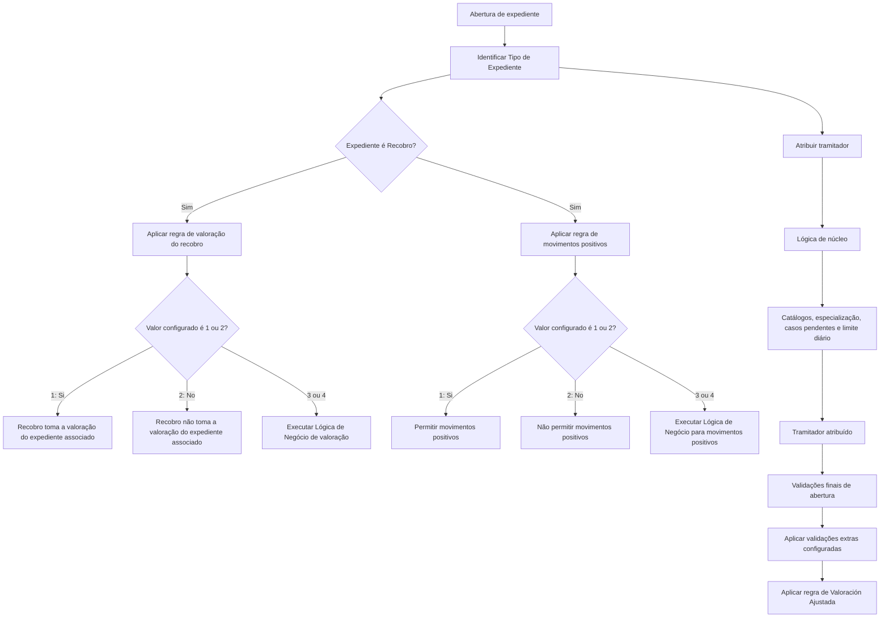

# Validações por Tipo de Expediente, Recobros e Atribuição de Tramitador

## 1. Metadados do Documento
- **Arquivo de Origem:** `Não identificado`
- **Tipo de Documento:** `Especificação Técnica / Documentação Funcional`
- **Domínio / Sistema:** `Reef / Mapfre — gestão de expedientes, recobros e tramitação`
- **Público-Alvo:** `Desenvolvedores, Arquitetos, Analistas Funcionais e Operação`
- **Data/Versão Identificada:** `Não identificada`
- **Owner identificado no conteúdo:** `user:agonzalez_mapfre.com`
- **Lifecycle identificado no conteúdo:** `Approved`

---

## 2. Resumo Executivo & Contexto de Negócio

O documento descreve propriedades gerais associadas aos tipos de expediente no contexto Reef/Mapfre. O foco funcional está em validações adicionais aplicáveis a expedientes, no comportamento de recobros, na atribuição de tramitadores e nas validações executadas ao final da abertura de um expediente.

A propriedade **Tipo de Expediente** identifica os danos provocados por um sinistro por meio de uma chave previamente definida em uma tabela de tipos de expediente. O conteúdo informa que também pode existir um tipo de expediente genérico, aplicável a todos os tipos de expediente.

Para expedientes classificados como **Recobro**, o documento define propriedades que controlam se o recobro deve utilizar a valoração do expediente principal associado e se são permitidos movimentos positivos. Ambas as propriedades usam valores configuráveis `1`, `2`, `3` e `4`, em que `1` corresponde a “Si”, `2` corresponde a “No” e `3` ou `4` exigem uma lógica de negócio complementar.

A atribuição de um tramitador na abertura de um expediente é suportada por uma lógica de núcleo baseada em catálogos de definição, relação entre escritórios comerciais e tramitadores, especialização, carga pendente e limite diário de expedientes. A especialização pode ser configurada segundo estruturas comerciais, pólizas, setores, ramos, agentes, tipos de expediente e características específicas do sinistro.

O documento também aborda a reapertura de expedientes e a possibilidade de validações extras ao final da abertura. Por fim, descreve a propriedade **Valoración Ajustada**, que define se o tramitador pode informar manualmente uma reserva inicial ao abrir um expediente ou se deve ser aplicada obrigatoriamente uma reserva média previamente definida.

---

## 3. Arquitetura, Componentes & Tecnologias Envolvidas

Os componentes, conceitos e catálogos explicitamente citados são:

| Componente / Conceito | Papel descrito no documento |
| :--- | :--- |
| Reef | Contexto documental e sistema referido no cabeçalho da documentação. |
| Mapfre | Contexto corporativo identificado no conteúdo, incluindo expedientes Mapfre-Mapfre. |
| Tipo de Expediente | Propriedade que contém a chave identificadora dos danos causados por um sinistro. |
| Tabela de tipos de expediente | Tabela na qual a chave de tipo de expediente deve estar definida. |
| Recobro | Tipo de expediente ao qual se aplicam propriedades de valoração e de movimentos positivos. |
| Expediente principal associado | Expediente associado a um recobro, cuja valoração pode ou não ser utilizada pelo recobro. |
| Lógica de Negócio | Regra configurável exigida quando determinadas propriedades possuem valor `3` ou `4`. |
| Lógica de núcleo | Lógica inicial de atribuição de tramitador na abertura de expedientes. |
| Catálogo de Definición del tramitador | Catálogo utilizado pela lógica de núcleo para atribuição de tramitador. |
| Catálogo de Relación entre las oficinas comerciales y tramitadoras | Catálogo utilizado pela lógica de núcleo para relacionar escritórios comerciais e tramitadores. |
| Catálogo de Especialización de los tramitadores | Catálogo que registra os critérios de especialização dos tramitadores. |
| Reserva média previamente definida | Reserva utilizada na abertura quando a reserva inicial manual não é permitida. |
| Valoración Ajustada | Propriedade que controla o uso de reserva inicial manual ou reserva média. |



> **Nota de Análise:** O conteúdo não detalha tecnologias de implementação, métodos HTTP, contratos JSON, bases de dados, interfaces, URLs de ambiente, mecanismos de persistência ou integrações entre sistemas.

---

## 4. Regras de Negócio, Especificações Funcionais & Processos

### 4.1. Identificação do Tipo de Expediente

1. A propriedade **Tipo de Expediente** contém a chave utilizada para identificar os diferentes danos provocados pelo sinistro.
2. A chave deve estar definida na tabela de tipos de expediente.
3. Pode ser configurado um tipo de expediente genérico para indicar aplicabilidade a todos os tipos de expediente.

### 4.2. Valoração de Recobro com a Valoração do Expediente Principal

1. A propriedade somente se aplica quando o expediente é um **Recobro**.
2. A propriedade define se, ao abrir um recobro e associá-lo a um expediente, o recobro assume ou não a valoração do expediente associado.
3. Os valores permitidos são:
   - `1`: Si.
   - `2`: No.
   - `3` ou `4`: Lógica de Negocio.
4. Quando a propriedade possui valor `3` ou `4`, deve existir uma lógica de negócio que determine se o recobro utiliza a valoração do expediente associado.
5. A lógica de negócio é necessária quando a valoração do recobro não é sempre igual à valoração do expediente associado e depende de outros fatores.

### 4.3. Permissão de Movimentos Positivos em Recobros

1. A propriedade somente se aplica quando o tipo de expediente definido é um **Recobro**.
2. A propriedade determina se o tipo de expediente permite, em conceitos de reserva que não são **Indemnización**, valorar e pagar valores positivos.
3. Os valores permitidos são:
   - `1`: Si.
   - `2`: No.
   - `3` ou `4`: Lógica de Negocio.
4. Quando a propriedade possui valor `3` ou `4`, deve ser definida uma lógica de negócio para determinar se são permitidos movimentos positivos.
5. A decisão pode resultar em “Si” ou “No”, conforme a lógica definida.

### 4.4. Atribuição de Tramitador na Abertura de Expedientes

1. A propriedade **Asignar Tramitador en la Apertura de Expedientes** contém a lógica de negócio que determina o tramitador a ser atribuído quando um expediente é aberto.
2. Inicialmente, a atribuição utiliza sempre a lógica de núcleo.
3. A lógica de núcleo é sustentada pelos seguintes elementos:
   1. Catálogo de definição do tramitador.
   2. Catálogo de relação entre escritórios comerciais e tramitadores.
   3. Catálogo de especialização dos tramitadores.
   4. Número de casos pendentes atribuídos ao tramitador.
   5. Número máximo de expedientes que podem ser atribuídos ao tramitador por dia.
4. O catálogo de especialização dos tramitadores pode indicar que um tramitador trabalha com:
   - Uma ou várias estruturas comerciais específicas.
   - Uma ou várias pólizas de grupo, contrato ou subcontrato.
   - Um ou vários setores, ramos, agentes ou pólizas.
   - Um ou vários tipos de expediente.
   - Expedientes em juízo.
   - Expedientes de perda total.
   - Expedientes ocorridos no estrangeiro.
   - Expedientes de clientes VIP.
   - Expedientes Mapfre-Mapfre.

### 4.5. Atribuição de Tramitador na Reapertura de Expedientes

1. A propriedade **Lógica de Negocio para Asignar Tramitador en Reapertura de Expedientes** determina qual tramitador será atribuído quando um expediente for reaberto.
2. A lógica de núcleo atribui o expediente ao tramitador original.
3. A atribuição ao tramitador original pode ser modificada.

### 4.6. Validações no Final da Abertura

1. A propriedade **Validaciones Final Apertura de Expedientes** contém uma lógica de negócio destinada à realização de validações extras.
2. O documento não especifica quais validações extras devem ser executadas, nem os critérios, mensagens de erro ou comportamentos de bloqueio associados.

### 4.7. Valoración Ajustada e Reserva Inicial

1. A propriedade **Valoración Ajustada** se aplica à abertura manual de um expediente desse tipo.
2. A propriedade indica se o tramitador poderá informar manualmente uma reserva inicial.
3. Alternativamente, a abertura deve usar sempre a reserva média previamente definida.
4. Quando a reserva média previamente definida for obrigatória, o tramitador não poderá modificá-la.

---

## 5. Tabelas de Parâmetros, Ambientes e Estruturas de Dados

| Item / Parâmetro | Descrição / Função | Tipo / Valores / Formato | Ambiente / Observações |
| :--- | :--- | :--- | :--- |
| Tipo de Expediente | Contém a chave para identificar os diferentes danos provocados pelo sinistro. | Chave definida na tabela de tipos de expediente. | Pode existir tipo genérico aplicável a todos os tipos de expediente. |
| Valorar Recobro con Valoración del Expediente principal | Define se um recobro associado utiliza a valoração do expediente associado. | `1: Si`; `2: No`; `3,4: Lógica de Negocio`. | Aplicável somente a expedientes de recobro. |
| Lógica que determina si el Recobro se valora con Valoración del Expediente principal | Determina se o recobro utiliza a valoração do expediente associado quando a decisão depende de outros fatores. | Lógica de Negócio. | Necessária quando a propriedade anterior possui valor `3` ou `4`. |
| Se permiten movimientos Positivos en Recobros | Define se movimentos positivos são permitidos em recobros. | `1: Si`; `2: No`; `3,4: Lógica de Negocio`. | Aplicável somente a tipos de expediente que são recobros. |
| Lógica de Negocio que determina si se permiten movimientos Positivos en Recobros | Determina se conceitos de reserva não relacionados a Indemnización podem valorar e pagar valores positivos. | Lógica de Negócio com resultado “Si” ou “No”. | Necessária quando a propriedade anterior possui valor `3` ou `4`. |
| Asignar Tramitador en la Apertura de Expedientes | Define a lógica de negócio para atribuir um tramitador na abertura de expediente. | Lógica de Negócio. | Inicialmente utiliza a lógica de núcleo. |
| Catálogo de Definición del tramitador | Fonte de suporte à lógica de núcleo de atribuição. | Catálogo. | Critérios internos não detalhados. |
| Catálogo de Relación entre las oficinas comerciales y tramitadoras | Fonte de suporte à lógica de núcleo de atribuição. | Catálogo. | Relaciona escritórios comerciais e tramitadores. |
| Catálogo de Especialización de los tramitadores | Define especializações consideradas na atribuição de tramitadores. | Catálogo. | Pode considerar estruturas comerciais, pólizas, setores, ramos, agentes, tipos de expediente e condições especiais. |
| Número de casos pendientes | Quantidade de casos pendentes atribuídos ao tramitador. | Número. | Utilizado pela lógica de núcleo. |
| Número máximo de expedientes por día | Limite diário de expedientes atribuíveis ao tramitador. | Número. | Utilizado pela lógica de núcleo. |
| Lógica de Negocio para Asignar Tramitador en Reapertura de Expedientes | Define o tramitador na reapertura de um expediente. | Lógica de Negócio. | A lógica de núcleo atribui inicialmente ao tramitador original; a atribuição pode mudar. |
| Validaciones Final Apertura de Expedientes | Executa validações extras na fase final da abertura. | Lógica de Negócio. | Regras de validação não detalhadas no documento. |
| Valoración Ajustada | Define se a reserva inicial pode ser informada manualmente pelo tramitador. | Propriedade de decisão. | Caso contrário, aplica reserva média previamente definida sem possibilidade de modificação pelo tramitador. |
| Owner | Proprietário indicado na documentação. | `user:agonzalez_mapfre.com` | Informação de cabeçalho. |
| Lifecycle | Estado de ciclo de vida indicado na documentação. | `Approved` | Informação de cabeçalho. |

### Critérios de Especialização do Tramitador

| Critério de Especialização | Descrição fornecida |
| :--- | :--- |
| Estruturas Comerciais | Uma ou várias estruturas comerciais específicas. |
| Pólizas | Uma ou várias pólizas de grupo, contrato ou subcontrato. |
| Classificações comerciais ou de seguro | Um ou vários setores, ramos, agentes ou pólizas. |
| Tipos de Expediente | Um ou vários tipos de expediente. |
| Situação judicial | Expedientes em juízo. |
| Severidade | Expedientes de perda total. |
| Localização | Expedientes ocorridos no estrangeiro. |
| Segmento de cliente | Expedientes de clientes VIP. |
| Relação corporativa | Expedientes Mapfre-Mapfre. |

---

## 6. Bateria de Perguntas & Respostas para RAG (FAQ Sintético)

### P1: O que identifica a propriedade Tipo de Expediente?
**R:** A propriedade Tipo de Expediente contém a chave usada para identificar os diferentes danos provocados por um sinistro. Essa chave deve estar definida na tabela de tipos de expediente. O documento também informa que pode existir um tipo de expediente genérico aplicável a todos os tipos de expediente.

### P2: Em quais situações a propriedade de valoração com o expediente principal se aplica?
**R:** A propriedade “Valorar Recobro con Valoración del Expediente principal” aplica-se somente quando o expediente é um recobro. Ela define se, ao abrir um recobro associado a um expediente, o recobro deve tomar a valoração do expediente associado.

### P3: Quais são os valores permitidos para determinar se um recobro usa a valoração do expediente associado?
**R:** Os valores permitidos são `1` para “Si”, `2` para “No” e `3` ou `4` para “Lógica de Negocio”. Quando o valor é `3` ou `4`, deve ser definida uma lógica de negócio para decidir se o recobro utilizará a valoração do expediente associado.

### P4: Quando é necessária uma lógica de negócio para a valoração de um recobro?
**R:** A lógica de negócio é necessária quando a propriedade de valoração do recobro possui valor `3` ou `4`. Ela deve determinar se o recobro toma a valoração do expediente associado quando essa decisão depende de outros fatores e não ocorre sempre da mesma forma.

### P5: O que significa permitir movimentos positivos em recobros?
**R:** Para um tipo de expediente que seja recobro, a propriedade determina se conceitos de reserva que não são Indemnización podem valorar e pagar valores positivos. A decisão pode ser configurada diretamente como “Si” ou “No” ou ser delegada a uma lógica de negócio.

### P6: Quais valores configuram a permissão de movimentos positivos em recobros?
**R:** A propriedade aceita `1` para “Si”, `2` para “No” e `3` ou `4` para “Lógica de Negocio”. Para os valores `3` ou `4`, deve ser definida uma lógica de negócio que decida se o tipo de expediente permite valores positivos nos conceitos de reserva não relacionados a Indemnización.

### P7: Como funciona a atribuição de tramitador na abertura de um expediente?
**R:** A propriedade “Asignar Tramitador en la Apertura de Expedientes” contém a lógica de negócio que determina o tramitador a ser atribuído quando um expediente é aberto. No início, a atribuição utiliza sempre a lógica de núcleo, apoiada por catálogos, especializações, quantidade de casos pendentes e limite diário de atribuições.

### P8: Quais fontes de informação são utilizadas pela lógica de núcleo para atribuir um tramitador?
**R:** A lógica de núcleo apoia-se no Catálogo de Definición del tramitador, no Catálogo de Relación entre las oficinas comerciales y tramitadoras, no Catálogo de Especialización de los tramitadores, no número de casos pendentes atribuídos ao tramitador e no número máximo de expedientes que podem ser atribuídos a ele por dia.

### P9: Quais características podem definir a especialização de um tramitador?
**R:** A especialização pode indicar atuação em uma ou várias estruturas comerciais específicas; pólizas de grupo, contrato ou subcontrato; setores, ramos, agentes ou pólizas; tipos de expediente; expedientes em juízo; perda total; ocorrências no estrangeiro; clientes VIP; e expedientes Mapfre-Mapfre.

### P10: O que acontece com o tramitador quando um expediente é reaberto?
**R:** A propriedade de lógica de negócio para reapertura determina o tramitador a atribuir quando um expediente é reaberto. A lógica de núcleo atribui inicialmente o expediente ao tramitador original, mas essa atribuição pode ser alterada.

### P11: O que são as Validaciones Final Apertura de Expedientes?
**R:** São validações extras executadas por meio de uma lógica de negócio na etapa final de abertura de um expediente. O documento confirma a existência dessa extensão de validação, mas não detalha quais regras específicas devem ser aplicadas.

### P12: Como a propriedade Valoración Ajustada controla a reserva inicial?
**R:** Para a abertura manual de um expediente, Valoración Ajustada define se o tramitador pode informar manualmente uma reserva inicial. Se a entrada manual não for permitida, o expediente deve ser aberto utilizando a reserva média previamente definida, sem que o tramitador possa modificá-la.

---

## 7. Glossário de Termos, Siglas & Conceitos-Chave

- **Expediente:** Entidade de negócio mencionada no documento, aberta, reaberta e atribuída a um tramitador.
- **Tipo de Expediente:** Propriedade que contém a chave de identificação dos danos provocados por um sinistro.
- **Recobro:** Tipo de expediente ao qual se aplicam regras específicas de valoração e de permissão de movimentos positivos.
- **Valoración:** Valoração de um expediente ou recobro; o documento trata da possibilidade de um recobro assumir a valoração de um expediente associado.
- **Valoración Ajustada:** Propriedade que determina se o tramitador pode informar manualmente uma reserva inicial ou se é aplicada uma reserva média previamente definida.
- **Reserva:** Conceito citado no contexto de reserva inicial, reserva média e conceitos de reserva.
- **Indemnización:** Conceito de reserva explicitamente citado; a regra de movimentos positivos refere-se a conceitos de reserva que não são Indemnización.
- **Tramitador:** Responsável a quem um expediente é atribuído na abertura ou reapertura.
- **Lógica de núcleo:** Lógica inicial de atribuição de tramitadores, suportada por catálogos, carga pendente e limite diário.
- **Lógica de Negocio:** Lógica configurável utilizada quando a decisão não é definida diretamente pelos valores `1` ou `2`.
- **Catálogo de Especialización de los tramitadores:** Catálogo que registra critérios de especialização usados para atribuir tramitadores.
- **Póliza:** Elemento usado como critério de especialização de tramitadores, incluindo grupo, contrato e subcontrato.
- **Expedientes en Juicio:** Expedientes em contexto judicial, utilizados como critério de especialização.
- **Pérdida Total:** Característica de expediente utilizada como critério de especialização.
- **Clientes VIP:** Segmento de cliente usado como critério de especialização.
- **Mapfre-Mapfre:** Classificação de expediente mencionada como critério de especialização.
- **Reef:** Nome exibido no cabeçalho da documentação.
- **Lifecycle Approved:** Estado de ciclo de vida apresentado no cabeçalho documental.

---

## 8. Notas Críticas, Riscos & Limitações

- O documento não identifica o nome do arquivo de origem, data, versão formal, autoria além do campo Owner, nem histórico de alterações.
- Não foram detalhados os critérios concretos das lógicas de negócio associadas aos valores `3` e `4`.
- Não foram especificadas as condições, fórmulas, dados de entrada ou prioridades usadas pelas lógicas de valoração de recobro e de movimentos positivos.
- Não foram definidos os métodos de desempate entre tramitadores elegíveis quando múltiplos tramitadores atendem aos mesmos critérios de especialização.
- Não foram informadas as regras para tratar tramitadores que excedam o número máximo de expedientes por dia.
- Não foram detalhados os critérios funcionais, técnicos ou mensagens de erro das validações extras de final de abertura.
- Não foram informados os valores, a origem ou o cálculo da reserva média previamente definida.
- Não foram apresentados métodos HTTP, contratos de API, estruturas JSON, integrações, mecanismos de persistência, rotas de logs, URLs, servidores ou ambientes técnicos.
- Os termos `3,4` e `3. ´0 4` aparecem no conteúdo extraído como referência a lógica de negócio; o documento não explica eventual diferença semântica entre os valores `3` e `4`.

---

## 9. Conteúdo Bruto Estruturado (Referência Fiel)

```text
--- [PÁGINA 1 DE 3] ---

DEFINICIÓN Validaciones Tipo de Expediente
Objetivo
Explicar las diferentes validaciones extras y el comportamiento de cada tipo de expediente en diferentes operaciones, la lógica para asignar
tramitadores, etc.
Propiedades Generales Tipos de Expedientes Recobros
Propiedades Generales Asignación Tramitador
Propiedades Generales Validaciones Final Apertura
Propiedades
Tipo de Expediente
Esta propiedad contendrá la clave por la que se va a identicar los distintos daños provocados por el siniestro. Esta clave tiene que estar
denida en la tabla de tipos de expediente. Se podría poner el tipo de expediente genérico para indicar que aplica a todos los tipos de
expediente.
Valorar Recobro con Valoración del Expediente principal
Esta propiedad sólo aplica cuando el expediente es un Recobro. Indica si cuando se abra un recobro y se asocie a un expediente, el recobro
toma la valoración del expediente asociado, o no.
Los valores permitidos serán:
1: Si
2: No
3,4: Lógica de Negocio
Lógica que determina si el Recobro se valora con Valoración del Expediente principal
Si la propiedad anterior tiene un 3. ´0 4, esta propiedad contendrá una lógica de Negocio, cuando la valoración del recobro no es siempre la
valoración del expediente al que está asociado, si no que depende de otros factores. Se tendrá que denir la lógica de Negocio que determine
si toma la valoración del asociado o no.
Se permiten movimientos Positivos en Recobros
Esta propiedad sólo aplica cuando el tipo de expediente que se está deniendo es un recobro.
Ejemplo:
Documentation / DOCUMENTACIÓN Reef
DOCUMENTACIÓN Reef
Mapfredocument
DOCUMENTACIÓN Reef
Owner
user:agonzalez_mapfre.com
Lifecycle
Approved Source
 / 
 VL
Buscar Inicio Soluciones Arquitecturas APIs Componentes Cloud Documentación Zeus Reef Ayuda
ES


--- [PÁGINA 2 DE 3] ---

Los valores permitidos serán:
1: Si
2: No
3,4: Lógica de Negocio
Lógica de Negocio que determina si se permiten movimientos Positivos en Recobros
Si la propiedad anterior tiene un 3. ´0 4, esta propiedad contendrá una lógica de Negocio. Se tendrá que denir una lógica de Negocio, si el
tipo de expediente permite en conceptos de reserva que no son Indemnización, valorar y pagar valores positivos. Puede ser Si o No,
dependiendo de lo que se dena.
Propiedades Generales Para Asignar Tramitador
Asignar Tramitador en la Apertura de Expedientes
Esta propiedad contendrá la lógica de Negocio que determinará cuando se abra un expediente, a que tramitador se le debe asignar. Existe
una lógica de núcleo
La lógica de núcleo se apoya en varios catálogos:
1. Catálogo de Denición del tramitador.
2. Catálogo de Relación entre las ocinas comerciales y tramitadoras.
3. Catálogo de Especialización de los tramitadores.
4. Número de casos pendientes que tiene asignado el tramitador.
5. Número máximo de expedientes que se le puede asignar por día.
En el catálogo de especialización de los tramitadores se le tiene que indicar si trabaja con los siniestros de:
Una o varias Estructuras Comerciales especícas
Una o varias Pólizas Grupo, Contrato, Subcontrato.
Uno o varios Sectores, Ramos, Agentes, Pólizas
Uno o varios Tipos de Expediente
Expedientes en Juicio
Expedientes de Pérdida Total
Expedientes ocurridos en el Extranjero
Expedientes de Clientes VIP
Expedientes Mapfre-Mapfre
Esta propiedad contendrá la lógica de Negocio que determinará cuando se abra un expediente, a que tramitador se le debe asignar.
Al iniciar siempre estará asignado la lógica de núcleo.
Tramitador
Lógica de Negocio para Asignar Tramitador en Reapertura de Expedientes
Esta propiedad contendrá la lógica de Negocio que determinará cuando se reapertura un expediente, a que tramitador se le debe asignar.
La lógica de núcleo se le asigna al tramitador original, que podrá ser cambiada.
Propiedades Generales Validaciones Final Apertura
Validaciones Final Apertura de Expedientes
Esta propiedad contendrá una lógica de Negocio, para poder realizar validaciones Extras.
Valoración Ajustada
Ejemplo:


--- [PÁGINA 3 DE 3] ---

Esta propiedad indicará si al abrir un expediente de este tipo manualmente, se le va a permitir al tramitador indicar una reserva inicial
manualmente, o si por el contrario siempre se va a abrir por la reserva promedio denida previamente, sin poder modicarla el tramitador.
```
