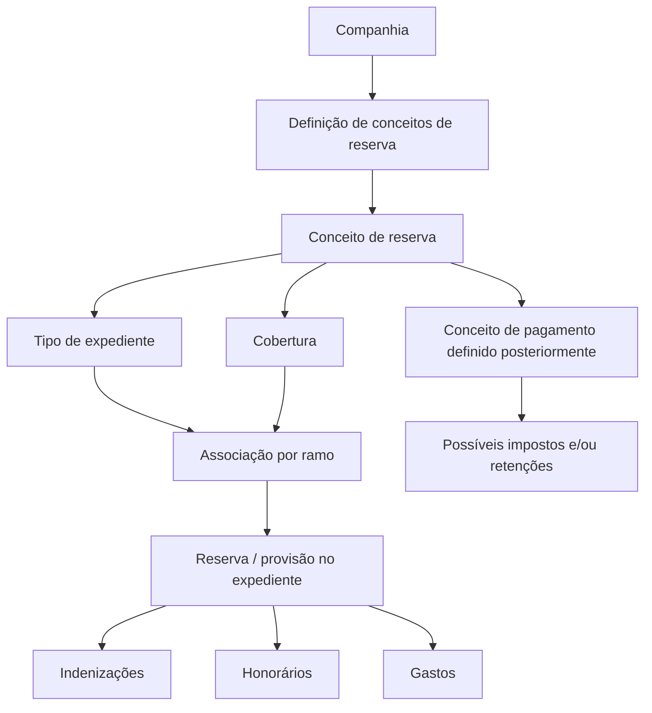

# Definição de Conceitos de Reserva no REEF

## 1. Metadados do Documento
- **Arquivo de Origem:** Não identificado no conteúdo fornecido
- **Tipo de Documento:** Especificação Técnica
- **Domínio / Sistema:** REEF / Mapfre
- **Público-Alvo:** Negócio, Desenvolvedores, Arquitetos e Operação
- **Data/Versão Identificada:** Não identificada

---

## 2. Resumo Executivo & Contexto de Negócio

O documento define o conceito de **reserva** para expedientes no sistema REEF. A finalidade da reserva é definir o desdobramento econômico necessário para provisionar valores destinados a possíveis pagamentos relacionados a um expediente.

Quando uma reserva ou provisão é realizada para cobrir potenciais pagamentos de um expediente, o sistema deve apresentar o desdobramento econômico previamente definido para cada cobertura afetada. Os conceitos de reserva classificam a natureza econômica da provisão antes que sejam definidos os conceitos de pagamento.

Os conceitos de reserva podem ser usados para provisionar três categorias: **indenizações**, **honorários** de profissionais que intervêm no expediente e **gastos** de profissionais envolvidos. Os exemplos de destinatários de indenizações incluem oficina, segurado, clínica, lesionado e prejudicado. Os exemplos de profissionais incluem advogados externos e peritos externos.

A definição dos conceitos de reserva ocorre no nível de companhia. Posteriormente, os conceitos de reserva devem ser associados, por ramo, a cada tipo de expediente e cobertura. O documento diferencia explicitamente conceitos de reserva de conceitos de pagamento: os pagamentos serão definidos posteriormente, associados aos conceitos de reserva e poderão possuir impostos e/ou retenções associados.

---

## 3. Arquitetura, Componentes & Tecnologias Envolvidas

O conteúdo descreve uma estrutura funcional de parametrização no REEF, sem detalhar tecnologias de implementação, interfaces, APIs, métodos HTTP, contratos JSON, bancos de dados, ambientes ou componentes de infraestrutura.

Componentes e entidades identificados:

- **REEF:** sistema ou domínio documental no qual a manutenção de conceitos de reserva é apresentada.
- **Companhia:** nível organizacional no qual os conceitos de reserva são definidos.
- **Ramo:** dimensão pela qual os conceitos de reserva são posteriormente associados.
- **Tipo de expediente:** entidade à qual um conceito de reserva pode ser associado.
- **Cobertura:** entidade afetada pela reserva e usada na associação posterior de conceitos.
- **Conceito de reserva:** chave que identifica o tipo de provisão econômica dentro de um expediente.
- **Conceito de pagamento:** conceito definido posteriormente e associado a um conceito de reserva.
- **Impostos e retenções:** elementos associados aos conceitos de pagamento, não aos conceitos de reserva.



> **Nota de Análise:** o documento não detalha a implementação técnica do REEF, os métodos de manutenção, os mecanismos de associação, os contratos de integração ou as regras de cálculo dos valores provisionados.

---

## 4. Regras de Negócio, Especificações Funcionais & Processos

### 4.1 Finalidade da reserva

1. A reserva representa uma provisão para fazer frente a possíveis pagamentos de um expediente.
2. O objetivo é definir o desdobramento econômico necessário para provisionar expedientes.
3. Ao realizar uma reserva, o sistema deve apresentar o desdobramento econômico definido para cada cobertura afetada.
4. A definição de conceitos de reserva ocorre previamente à definição dos conceitos de pagamento.

### 4.2 Classificação dos conceitos de reserva

Cada conceito de reserva deve indicar sua finalidade de utilização. As categorias permitidas são:

1. **Indenização:** reserva para possíveis indenizações.
2. **Honorários:** reserva para possíveis honorários de profissionais que intervêm no expediente.
3. **Gastos:** reserva para possíveis gastos de profissionais que intervêm no expediente.

Exemplos apresentados pelo documento:

- Indenizações podem ser reservadas para oficina, segurado, clínica, lesionado ou prejudicado.
- Honorários podem ser reservados para advogados externos ou peritos externos.
- Gastos podem ser reservados para advogados externos ou peritos externos.

### 4.3 Propriedades do conceito de reserva

1. **Conceito de reserva**
   - É a chave usada para identificar os diferentes conceitos pelos quais é possível realizar uma reserva dentro de um expediente.
   - Uma mesma chave pode ser utilizada para um ou mais tipos de expediente e cobertura.

2. **Nome do conceito de reserva**
   - Contém a descrição da chave definida para o conceito de reserva.
   - Pode conter números e/ou letras.

3. **Tipo do conceito de reserva**
   - Indica se o conceito será utilizado para possíveis indenizações, possíveis honorários ou possíveis gastos.
   - Os valores permitidos são `I`, `H` e `G`.

4. **Inabilitado**
   - Indica se o conceito de reserva definido está habilitado ou não para associação a um tipo de expediente e cobertura.

### 4.4 Associação organizacional e funcional

1. Os conceitos de reserva são definidos no nível de companhia.
2. Posteriormente, os conceitos devem ser associados por ramo.
3. A associação deve considerar cada tipo de expediente e cobertura.
4. Uma chave de conceito de reserva pode atender mais de um tipo de expediente e cobertura.

### 4.5 Distinção entre conceito de reserva e conceito de pagamento

1. Os conceitos definidos nesta funcionalidade são conceitos de reserva, não conceitos pelos quais os pagamentos serão realizados.
2. Os conceitos de pagamento serão definidos posteriormente.
3. Os conceitos de pagamento deverão ser associados aos conceitos de reserva.
4. Os conceitos de pagamento terão associados possíveis impostos e/ou retenções.

---

## 5. Tabelas de Parâmetros, Ambientes e Estruturas de Dados

| Item / Parâmetro | Descrição / Função | Tipo / Valores / Formato | Ambiente / Observações |
| :--- | :--- | :--- | :--- |
| Conceito de reserva | Chave para identificar os diferentes conceitos pelos quais é possível reservar dentro de um expediente | Chave; formato não detalhado | Uma chave pode ser usada para um ou mais tipos de expediente e cobertura |
| Nome do conceito de reserva | Descrição da chave definida para o conceito de reserva | Pode conter números e/ou letras | Não há limite de tamanho ou padrão adicional informado |
| Tipo do conceito de reserva | Define a finalidade econômica do conceito de reserva | `I`, `H` ou `G` | Utilizado para classificar indenizações, honorários ou gastos |
| Inabilitado | Indica se o conceito pode ser associado a tipo de expediente e cobertura | Habilitado ou não habilitado; valores técnicos não detalhados | Afeta a possibilidade de associação |
| Companhia | Nível em que os conceitos de reserva são definidos | Entidade organizacional | Não são informadas companhias específicas |
| Ramo | Critério de associação posterior dos conceitos de reserva | Não detalhado | Associação ocorre por ramo |
| Tipo de expediente | Entidade que pode utilizar um conceito de reserva | Não detalhado | Uma chave pode ser associada a um ou mais tipos |
| Cobertura | Entidade afetada pela reserva e pela associação do conceito | Não detalhado | O desdobramento econômico é apresentado para cada cobertura afetada |
| Conceito de pagamento | Conceito definido posteriormente para realização de pagamentos | Não detalhado | Deve ser associado a conceitos de reserva |
| Impostos e retenções | Possíveis elementos associados a conceitos de pagamento | Não detalhado | Não são atribuídos diretamente aos conceitos de reserva |

### 5.1 Valores permitidos para tipo de conceito de reserva

| Código | Tipo de Conceito de Reserva | Descrição |
| :--- | :--- | :--- |
| `I` | Conceito de Indenização | Utilizado para reservar possíveis indenizações |
| `H` | Conceito de Honorários | Utilizado para reservar possíveis honorários |
| `G` | Conceito de Gastos | Utilizado para reservar possíveis gastos |

### 5.2 Exemplos de relação entre conceito de reserva e conceito de cobrança/pagamento

| Conceito de Reserva | Categoria | Conceito de Cobrança e Pagamento | Descrição |
| :--- | :--- | :--- | :--- |
| `1` | Indenização | `S01` | Indenização Segurado |
| `1` | Indenização | `S02` | Indenização Clínicas |
| `1` | Indenização | `S03` | Indenização Oficinas |
| `2` | Honorários | `S04` | Honorários Advogados Externos |
| `2` | Honorários | `S05` | Honorários Peritos Externos |
| `3` | Gastos | `S06` | Gastos Advogados Externos |
| `3` | Gastos | `S07` | Gastos Peritos Externos |

---

## 6. Bateria de Perguntas & Respostas para RAG (FAQ Sintético)

### P1: Qual é a finalidade de um conceito de reserva no REEF?
**R:** Um conceito de reserva define o desdobramento econômico necessário para provisionar possíveis pagamentos de um expediente. Quando a reserva é realizada, o desdobramento econômico definido é apresentado para cada cobertura afetada.

### P2: Os conceitos de reserva são os mesmos conceitos usados para realizar pagamentos?
**R:** Não. O documento informa que a manutenção apresentada define conceitos de reserva. Os conceitos de pagamento serão definidos posteriormente e deverão ser associados aos conceitos de reserva.

### P3: Quais são os tipos permitidos para um conceito de reserva?
**R:** Os tipos permitidos são `I` para conceito de indenização, `H` para conceito de honorários e `G` para conceito de gastos.

### P4: Para quais situações um conceito de indenização pode ser utilizado?
**R:** Um conceito de indenização pode ser utilizado para reservar possíveis indenizações destinadas, por exemplo, a uma oficina, segurado, clínica, lesionado ou prejudicado.

### P5: Que profissionais são mencionados como exemplo de destinatários de reservas de honorários ou gastos?
**R:** O documento cita advogados externos e peritos externos como exemplos de profissionais que podem estar relacionados a reservas de honorários ou gastos.

### P6: Em que nível organizacional os conceitos de reserva são definidos?
**R:** Os conceitos de reserva são definidos no nível de companhia. Posteriormente, devem ser associados por ramo a cada tipo de expediente e cobertura.

### P7: Uma mesma chave de conceito de reserva pode atender vários tipos de expediente ou coberturas?
**R:** Sim. O documento estabelece que uma chave pode ser utilizada para um ou mais tipos de expediente e cobertura.

### P8: Qual é a função da propriedade “Inabilitado” em um conceito de reserva?
**R:** A propriedade “Inabilitado” indica se o conceito de reserva definido está habilitado ou não para ser associado a um tipo de expediente e cobertura.

### P9: O que pode ser informado no nome de um conceito de reserva?
**R:** O nome do conceito de reserva contém a descrição da chave definida para esse conceito e pode conter números e/ou letras.

### P10: Onde impostos e retenções são associados no modelo descrito?
**R:** Possíveis impostos e/ou retenções são associados aos conceitos de pagamento. O documento não afirma que impostos ou retenções sejam associados diretamente aos conceitos de reserva.

### P11: Como os conceitos de reserva se relacionam aos conceitos S01 a S07 do exemplo?
**R:** O exemplo relaciona o conceito de reserva `1`, Indenização, aos conceitos de pagamento `S01`, `S02` e `S03`; o conceito `2`, Honorários, aos conceitos `S04` e `S05`; e o conceito `3`, Gastos, aos conceitos `S06` e `S07`.

### P12: O documento define os métodos de API ou contratos técnicos para manutenção dos conceitos de reserva?
**R:** Não. O documento descreve a finalidade, as propriedades e as associações funcionais dos conceitos de reserva, mas não detalha métodos HTTP, APIs, contratos JSON, persistência ou integrações técnicas.

---

## 7. Glossário de Termos, Siglas & Conceitos-Chave

- **REEF:** sistema ou domínio citado na documentação para a manutenção de conceitos de reserva; o significado da sigla não é detalhado.
- **Reserva:** provisão realizada para fazer frente a possíveis pagamentos de um expediente.
- **Provisão:** valor ou desdobramento econômico necessário para cobrir possíveis pagamentos.
- **Expediente:** entidade de negócio para a qual reservas podem ser realizadas.
- **Cobertura:** entidade afetada pela reserva; o desdobramento econômico é apresentado para cada cobertura afetada.
- **Ramo:** critério pelo qual conceitos de reserva são posteriormente associados a tipos de expediente e coberturas.
- **Conceito de reserva:** chave e classificação usadas para identificar a natureza de uma provisão dentro de um expediente.
- **Conceito de pagamento:** conceito definido posteriormente, associado a conceitos de reserva e com possíveis impostos e/ou retenções.
- **Indenização:** categoria de reserva identificada pelo código `I`.
- **Honorários:** categoria de reserva identificada pelo código `H`.
- **Gastos:** categoria de reserva identificada pelo código `G`.
- **Inabilitado:** propriedade que indica se um conceito de reserva está habilitado para associação a um tipo de expediente e cobertura.

---

## 8. Notas Críticas, Riscos & Limitações

- O documento não identifica o nome do arquivo de origem, data, versão, autor técnico ou ciclo de aprovação além da referência visual a “Approved Source”.
- O documento não detalha os critérios de cálculo dos valores de reserva, valores monetários, moedas, limites, regras contábeis ou regras de arredondamento.
- O documento não especifica quais ramos, tipos de expediente ou coberturas existem nem como ocorre tecnicamente a associação entre essas entidades.
- O documento não apresenta APIs, métodos HTTP, contratos JSON, estruturas de banco de dados, eventos, filas ou mecanismos de integração.
- Os valores técnicos aceitos pela propriedade **Inabilitado** não são informados; apenas sua finalidade funcional é descrita.
- O exemplo apresenta relações entre conceitos de reserva e conceitos de cobrança/pagamento, mas não esclarece se os códigos `1`, `2`, `3` e `S01` a `S07` são valores fixos, dados ilustrativos ou parâmetros configuráveis.
- A expressão “conceito cobro y pago” aparece no exemplo, enquanto o texto funcional usa “conceitos de pago”; o documento não explica formalmente a diferença terminológica.

---

## 9. Conteúdo Bruto Estruturado (Referência Fiel)

```text
--- [PÁGINA 1 DE 2] ---

DEFINICIÓN Concepto de Reserva

Objetivo

La finalidad es definir el desglose económico que se va a necesitar,
para aprovisionar a los expedientes, de posibles pagos.

Cuando se va a realizar la reserva (provisión), para hacer frente a los
posibles pagos de un expediente, para cada cobertura afectada, nos
aparecerá el desglose económico que se haya definido.

Para cada concepto de reserva, se tendrá que indicar si este será
utilizado para reservar Indemnizaciones (a un taller, a un asegurado,
a una clínica, a un lesionado, a un perjudicado…), para reservar
posibles Honorarios de profesionales que intervengan en el expediente
(abogados externos, peritos externos…) o para realizar reservas de
posibles Gastos de Profesionales que intervengan en el expediente.

Estos conceptos se están definiendo a nivel de compañía. Posteriormente,
se tendrán que asociar por ramo a cada tipo de expediente, cobertura.

Imagen del Mantenimiento Conceptos de reserva:

Documentation / DOCUMENTACIÓN Reef
DOCUMENTACIÓN Reef
Mapfredocument

DOCUMENTACIÓN Reef

Owner
user:agonzalez_mapfre.com

Lifecycle
Approved Source

/

VL

Buscar Inicio Soluciones Arquitecturas APIs Componentes Cloud Documentación Zeus Reef Ayuda
ES


--- [PÁGINA 2 DE 2] ---

Propiedades

Concepto de reserva

Esta propiedad será la clave por la que se va a identificar los distintos
conceptos por los que se puede a reservar dentro de un expediente.

Una clave podrá ser utilizada para uno o varios tipos de expediente,
cobertura.

Nombre del Concepto de Reserva

Esta propiedad contendrá la descripción de la clave definida para el
concepto de Reserva. Puede contener números y/o letras.

Tipo Concepto de Reserva

Esta propiedad indicará para que se está utilizando el concepto si el
concepto de reserva que se está definiendo, será utilizado para reservar
posibles indemnizaciones, para reservar posibles honorarios o para
reservar posibles gastos.

Los valores que puede contener son:

I Concepto de Indemnización
H Concepto de Honorarios
G Concepto de Gastos

Inhabilitado

Esta propiedad indica si el Concepto de Reserva que está definido, está
habilitado o no para asociarlo a un tipo de expediente cobertura.

Preguntas frecuentes

¿Estos son los conceptos por los que luego se realizarán los pagos?

No, en este apartado se están definiendo los conceptos de reserva.

Los conceptos de pago se definirán posteriormente y se tendrán que
asociar a los conceptos de Reserva.

Los conceptos de Pago llevarán asociados los posibles impuestos y/o
retenciones.

CONCEPTO RESERVA CONCEPTO COBRO Y PAGO
1 Indemnización S01 Indemnización Asegurado
1 Indemnización S02 Indemnización Clínicas
1 Indemnización S03 Indemnización Talleres
2 Honorarios S04 Honorarios Abogados Externos
2 Honorarios S05 Honorarios Peritos Externos
3 Gastos S06 Gastos Abogados Externos
3 Gastos S07 Gastos Peritos Externos

Ejemplo:

Ejemplo:
```
