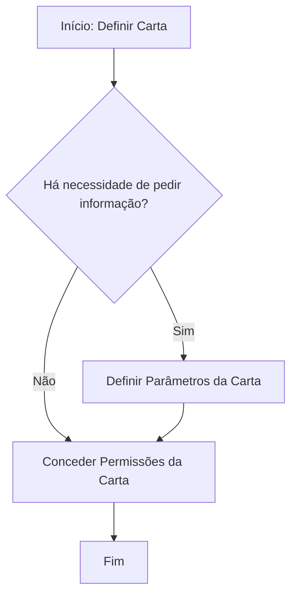

# Documentação Reef — Definição e Associação de Carta a um Trâmite

## 1. Metadados do Documento
- **Arquivo de Origem:** `Não identificado`
- **Tipo de Documento:** `Procedimento`
- **Domínio / Sistema:** `Reef / Mapfredocument`
- **Público-Alvo:** `Usuários responsáveis pela definição, parametrização e permissão de cartas`
- **Data/Versão Identificada:** `Não identificada`

---

## 2. Resumo Executivo & Contexto de Negócio

O documento descreve o procedimento para definir uma **Carta** para que ela possa ser associada posteriormente a um **trâmite**. O objetivo declarado é explicar como realizar essa definição dentro do contexto de documentação Reef.

O processo apresentado possui três atividades principais: definir a Carta, definir os parâmetros da Carta — quando houver necessidade de solicitar informações — e conceder permissões para a Carta. O fluxo termina após a definição de permissões.

O material está identificado visualmente como parte de “DOCUMENTACIÓN Reef” e também cita “Mapfredocument”. O documento apresenta o proprietário como `user:agonzalez_mapfre.com` e o ciclo de vida como `Approved`.

Não há detalhamento sobre campos da Carta, critérios para a decisão de pedir informações, tipos de parâmetros, perfis de permissão, APIs, métodos HTTP, contratos JSON, URLs operacionais ou mecanismos técnicos de persistência.

---

## 3. Arquitetura, Componentes & Tecnologias Envolvidas

O conteúdo menciona os seguintes elementos:

| Componente / Termo | Relação descrita no documento |
| :--- | :--- |
| Reef | Contexto de documentação no qual o procedimento é apresentado. |
| Mapfredocument | Termo exibido na navegação/documentação. Não há detalhamento funcional ou técnico. |
| Carta | Artefato que deve ser definido para posterior associação a um trâmite. |
| Trâmite | Destino ou processo ao qual a Carta poderá ser associada posteriormente. |
| Parâmetros da Carta | Devem ser definidos quando houver necessidade de pedir informações. |
| Permissões da Carta | Devem ser concedidas como etapa do processo. |
| Owner | `user:agonzalez_mapfre.com`. |
| Lifecycle | `Approved`. |



> **Nota de Análise:** O documento representa um fluxo funcional de definição de Carta. Não há arquitetura de software, integração entre sistemas, microsserviços, bancos de dados ou tecnologias de implementação detalhadas.

---

## 4. Regras de Negócio, Especificações Funcionais & Processos

### Processo para definição de uma Carta

1. **Definir Carta**
   - A Carta deve ser definida.
   - A finalidade declarada é permitir a associação posterior da Carta a um trâmite.

2. **Verificar necessidade de pedir informação**
   - O fluxo contém a decisão: “¿Hay que Pedir información?”.
   - Quando a resposta for **SIM**, devem ser definidos os parâmetros da Carta.
   - Quando a resposta for **NÃO**, o fluxo segue diretamente para a concessão de permissões da Carta.

3. **Definir parâmetros da Carta**
   - Esta etapa ocorre somente quando houver necessidade de pedir informações.
   - O documento não especifica quais parâmetros existem, seus formatos, obrigatoriedade, valores aceitos ou regras de validação.

4. **Dar permissões para a Carta**
   - A concessão de permissões é uma etapa obrigatória no fluxo apresentado, independentemente de haver ou não definição de parâmetros.
   - O documento não detalha quais perfis, usuários, grupos, níveis de acesso ou operações são contemplados pelas permissões.

5. **Finalizar**
   - O processo é encerrado após a definição das permissões da Carta.

---

## 5. Tabelas de Parâmetros, Ambientes e Estruturas de Dados

| Item / Parâmetro | Descrição / Função | Tipo / Valores / Formato | Ambiente / Observações |
| :--- | :--- | :--- | :--- |
| Carta | Entidade definida para posterior associação a um trâmite. | Não especificado. | Etapa inicial do processo. |
| Trâmite | Processo ou elemento ao qual a Carta poderá ser associada. | Não especificado. | Associação posterior à definição da Carta. |
| Necessidade de pedir informação | Decisão que determina se parâmetros da Carta devem ser definidos. | `SIM` ou `NÃO`. | `SIM` direciona para definição de parâmetros; `NÃO` direciona para permissões. |
| Parâmetros da Carta | Informações parametrizáveis da Carta quando for necessário pedir informações. | Não especificado. | O documento não apresenta nomes, tipos ou validações. |
| Permissões da Carta | Permissões que devem ser concedidas para a Carta. | Não especificado. | Etapa posterior à definição da Carta, com ou sem parâmetros. |
| Owner | Proprietário exibido no documento. | `user:agonzalez_mapfre.com` | Metadado apresentado na documentação. |
| Lifecycle | Estado de ciclo de vida exibido no documento. | `Approved` | Metadado apresentado na documentação. |
| Source | Campo de origem exibido na interface. | Não detalhado; texto exibido: `Source / VL`. | Sem explicação funcional adicional. |
| Idioma | Idioma exibido na interface. | `ES` | A maior parte do conteúdo bruto está em espanhol. |

---

## 6. Bateria de Perguntas & Respostas para RAG (FAQ Sintético)

### P1: Qual é o objetivo do procedimento de definição de Carta?
**R:** O objetivo é explicar como definir uma Carta para que ela possa ser associada posteriormente a um trâmite.

### P2: Quais são as etapas principais do processo de definição de uma Carta?
**R:** O processo apresenta três atividades: definir a Carta, definir os parâmetros da Carta quando houver necessidade de pedir informações e conceder permissões para a Carta.

### P3: Quando os parâmetros da Carta precisam ser definidos?
**R:** Os parâmetros da Carta devem ser definidos quando a decisão “¿Hay que Pedir información?” for respondida com “SIM”.

### P4: O que acontece quando não é necessário pedir informações durante a definição da Carta?
**R:** Quando a resposta for “NÃO”, o fluxo não passa pela definição de parâmetros e segue para a concessão de permissões da Carta.

### P5: A definição de permissões da Carta é necessária mesmo sem parâmetros?
**R:** Sim. No fluxo apresentado, tanto o caminho com definição de parâmetros quanto o caminho sem definição de parâmetros convergem para a etapa “Dar Permisos Carta”.

### P6: Quais campos ou tipos de parâmetros da Carta são documentados?
**R:** O documento apenas informa que existem “Parámetros Carta” quando for necessário pedir informações. Não são apresentados nomes de campos, formatos, tipos de dados, obrigatoriedade ou regras de validação.

### P7: Quais permissões podem ser concedidas para uma Carta?
**R:** O documento determina que permissões devem ser concedidas para a Carta, mas não especifica perfis, grupos, usuários, níveis de acesso ou ações permitidas.

### P8: Qual é o status de ciclo de vida identificado na documentação?
**R:** O campo “Lifecycle” está apresentado com o valor `Approved`.

### P9: Quem é identificado como proprietário do conteúdo?
**R:** O campo “Owner” apresenta o valor `user:agonzalez_mapfre.com`.

### P10: O documento descreve como associar a Carta ao trâmite?
**R:** Não. O documento informa que a Carta é definida para ser posteriormente associada a um trâmite, mas não detalha o procedimento de associação.

---

## 7. Glossário de Termos, Siglas & Conceitos-Chave

- **Carta:** Entidade que deve ser definida para posterior associação a um trâmite.
- **Trâmite:** Elemento ou processo ao qual a Carta poderá ser associada posteriormente.
- **Parâmetros da Carta:** Configurações ou informações da Carta definidas quando houver necessidade de pedir informações; os detalhes não são fornecidos.
- **Permissões da Carta:** Autorizações que devem ser concedidas para a Carta; os critérios e destinatários não são detalhados.
- **Reef:** Nome exibido no contexto da documentação.
- **Mapfredocument:** Termo exibido na documentação e navegação; não possui definição adicional no conteúdo.
- **Owner:** Campo que identifica o proprietário do documento.
- **Lifecycle:** Campo que identifica o estado de ciclo de vida do documento.
- **Approved:** Valor apresentado para o campo Lifecycle.

---

## 8. Notas Críticas, Riscos & Limitações

- O documento não apresenta o nome do arquivo original, data, versão, autoria formal ou histórico de alterações.
- O procedimento não detalha como criar, editar, excluir ou associar uma Carta a um trâmite.
- Não são especificados os campos, os tipos, os valores permitidos, as validações ou a obrigatoriedade dos parâmetros da Carta.
- Não são definidos usuários, papéis, grupos ou critérios para concessão de permissões da Carta.
- Não há informações sobre APIs, contratos de integração, métodos HTTP, bancos de dados, URLs, ambientes, logs ou tratamento de erros.
- **Nota de Análise:** “Mapfredocument”, “Source / VL” e a navegação exibida são citados literalmente, mas o documento não fornece explicação adicional sobre suas funções.

---

## 9. Conteúdo Bruto Estruturado (Referência Fiel)

```text
--- [PÁGINA 1 DE 1] ---

DEFINICIÓN Generar Carta
Objetivo
Explicar como denir una carta para posteriormente poder asociarla a un trámite.
Proceso para la denición de una Carta
SI
NO
DEFINIR
Carta(1)
¿Hay que
Pedir información? DEFINIR
Parámetros
Carta
(2)
Dar Permisos
Carta
(3)
FIN
1. DEFINIR Carta
2. DEFINIR Parámetros
3. DEFINIR Permiso Carta
Documentation / DOCUMENTACIÓN Reef
DOCUMENTACIÓN Reef
Mapfredocument
DOCUMENTACIÓN Reef
Owner
user:agonzalez_mapfre.com
Lifecycle
Approved Source
 / 
 VL
Buscar Inicio Soluciones Arquitecturas APIs Componentes Cloud Documentación Zeus Reef Ayuda
ES
```
