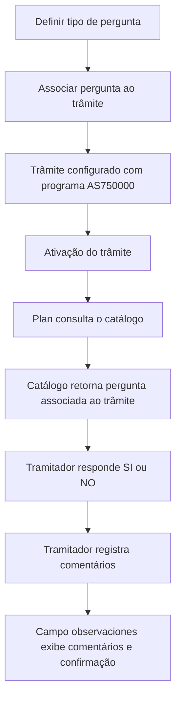

# Confirmação do Tramitador no REEF — Definição, Associação a Trâmites e Registro de Decisão

## 1. Metadados do Documento
- **Arquivo de Origem:** Não informado
- **Tipo de Documento:** Manual Operacional
- **Domínio / Sistema:** REEF / Mapfre — ferramenta de núcleo “Confirmación del Tramitador”
- **Público-Alvo:** Desenvolvedores, Operação e Negócio
- **Data/Versão Identificada:** Não identificada

---

## 2. Resumo Executivo & Contexto de Negócio

O documento descreve a ferramenta de núcleo **“Confirmación del Tramitador”**, utilizada em trâmites que exigem uma confirmação explícita de um tramitador sobre determinada situação operacional. A resposta possível do tramitador é **SI** ou **NO**, acompanhada de comentários registrados no campo de observações.

A ferramenta atende cenários em que a confirmação humana é necessária, como a verificação de coberturas, a confirmação de perda total, a confirmação de veículo de substituição e a validação de recibo e apólice. O objetivo declarado é explicar como a ferramenta é definida e como funciona no REEF.

A configuração exige dois passos: definir o tipo de pergunta e associar perguntas a um trâmite. Após a ativação de um trâmite configurado com o programa de Confirmação do Tramitador, o **Plan** consulta o catálogo para identificar qual pergunta deve ser apresentada ao tramitador.

O documento apresenta exemplos em que a mesma utilidade é reutilizada com perguntas diferentes, conforme o trâmite associado. Entre os exemplos estão a pergunta **“AC ANALISIS DE COBERTURAS Y RECIBOS O.K.”** e a pergunta **“RF RECIBIDO FACTURA”**, vinculada a um trâmite de liquidação.

---

## 3. Arquitetura, Componentes & Tecnologias Envolvidas

Os componentes e conceitos identificados são:

| Componente / Termo | Papel identificado no documento |
| :--- | :--- |
| REEF | Contexto de documentação e domínio da ferramenta descrita. |
| Confirmación del Tramitador | Ferramenta de núcleo para obter confirmação do tramitador e registrar comentários. |
| AS750000 | Programa de Confirmação do Tramitador associado ao trâmite. |
| Tramitador | Usuário responsável por responder **SI** ou **NO** e registrar comentários. |
| Trámite | Processo configurado para utilizar uma pergunta da ferramenta de confirmação. |
| Catálogo | Fonte consultada pelo Plan para identificar a pergunta associada ao trâmite. |
| Plan | Componente que, após a ativação do trâmite, consulta o catálogo para obter a pergunta aplicável. |
| Campo observaciones | Campo em que são visualizados os comentários do tramitador e a confirmação ou não confirmação. |



> **Nota de Análise:** O documento identifica o programa **AS750000**, o **Plan** e o **catálogo**, mas não detalha interfaces, protocolos, métodos HTTP, contratos JSON, bancos de dados, URLs, ambientes ou tecnologias de implementação.

---

## 4. Regras de Negócio, Especificações Funcionais & Processos

1. A ferramenta **Confirmación del Tramitador** é utilizada em trâmites cuja finalidade é confirmar uma situação que requer intervenção do tramitador.
2. O tramitador deve responder à pergunta apresentada com uma das opções:
   - **SI**: a situação é confirmada.
   - **NO**: a situação não é confirmada.
3. Os comentários realizados pelo tramitador devem permanecer registrados e podem ser consultados no campo **observaciones**.
4. Para utilizar a ferramenta, devem ser realizados dois passos de configuração:
   1. Definir o tipo de pergunta.
   2. Associar perguntas a um trâmite.
5. Um trâmite deve possuir associação com o programa de **Confirmación del Tramitador**, identificado como **AS750000**.
6. Quando o trâmite associado é ativado, o **Plan** consulta o catálogo para determinar qual pergunta deve ser realizada para aquele trâmite.
7. A pergunta não é fixa para todos os trâmites: uma mesma utilidade de confirmação pode apresentar perguntas distintas conforme a associação configurada.
8. Exemplos de situações cobertas:
   - Verificar coberturas.
   - Confirmar perda total.
   - Confirmar veículo de substituição.
   - Confirmar que recibo e apólice estão corretos.
   - Confirmar ou não a perda total após a chegada do resultado da perícia.
   - Confirmar o recebimento de fatura em um trâmite de liquidação.

### Fluxo operacional identificado

1. O responsável define uma pergunta para a ferramenta.
2. A pergunta é associada ao trâmite correspondente.
3. O trâmite configurado com o programa **AS750000** é ativado.
4. O **Plan** consulta o catálogo.
5. O catálogo determina a pergunta aplicável ao trâmite ativado.
6. O tramitador visualiza a pergunta.
7. O tramitador responde **SI** ou **NO**.
8. O tramitador registra comentários.
9. A decisão e os comentários ficam disponíveis no campo **observaciones**.

---

## 5. Tabelas de Parâmetros, Ambientes e Estruturas de Dados

| Item / Parâmetro | Descrição / Função | Tipo / Valores / Formato | Ambiente / Observações |
| :--- | :--- | :--- | :--- |
| Ferramenta | Utilidade de núcleo para confirmação de situações por tramitador. | Confirmación del Tramitador | Contexto REEF. |
| Programa associado | Programa utilizado pelo trâmite para a confirmação do tramitador. | `AS750000` | O documento não especifica versão ou ambiente. |
| Resposta do tramitador | Decisão apresentada pelo tramitador para a pergunta do trâmite. | `SI` ou `NO` | Registrada juntamente com comentários. |
| Pergunta | Questão apresentada ao tramitador após a consulta ao catálogo. | Texto configurável | Deve ser definida e associada a um trâmite. |
| Tipo de pergunta | Configuração inicial necessária para criar a pergunta. | Não detalhado | Primeiro passo do fluxo de definição. |
| Associação pergunta–trâmite | Vínculo entre uma pergunta e um trâmite. | Não detalhado | Segundo passo do fluxo de definição. |
| Catálogo | Fonte consultada para localizar a pergunta aplicável ao trâmite. | Não detalhado | Consultado pelo Plan após ativação do trâmite. |
| Plan | Componente que consulta o catálogo ao ativar o trâmite. | Não detalhado | O documento não detalha tecnologia ou integração. |
| Campo `observaciones` | Campo que permite visualizar comentários e a confirmação ou não confirmação. | Texto e indicador de confirmação | O documento não detalha tamanho, formato ou persistência. |
| Pergunta de exemplo 1 | Pergunta para confirmação de análise de coberturas e recibos. | `AC ANALISIS DE COBERTURAS Y RECIBOS O.K.` | Associada a um trâmite no exemplo apresentado. |
| Pergunta de exemplo 2 | Pergunta associada ao trâmite de liquidação. | `RF RECIBIDO FACTURA` | Exemplo de reutilização da mesma ferramenta com pergunta distinta. |
| Perda total | Cenário no qual o tramitador pode confirmar ou não o prosseguimento após resultado da perícia. | Confirmação `SI` ou `NO` | O documento não detalha regras posteriores à resposta. |

---

## 6. Bateria de Perguntas & Respostas para RAG (FAQ Sintético)

### P1: O que é a ferramenta Confirmación del Tramitador no REEF?
**R:** A ferramenta Confirmación del Tramitador é uma utilidade de núcleo utilizada em trâmites que exigem confirmação de uma situação por um tramitador. O tramitador responde **SI** ou **NO** e registra comentários, que ficam disponíveis no campo `observaciones`.

### P2: Quais são os passos necessários para configurar uma confirmação de tramitador?
**R:** O documento define dois passos: primeiro, definir o tipo de pergunta; segundo, associar a pergunta a um trâmite. O trâmite deve utilizar o programa de Confirmação do Tramitador, identificado como `AS750000`.

### P3: Qual programa está associado à ferramenta de Confirmação do Tramitador?
**R:** O programa associado à ferramenta de Confirmação do Tramitador é o `AS750000`. Quando um trâmite com esse programa é ativado, o Plan consulta o catálogo para saber qual pergunta deve apresentar.

### P4: Quais respostas o tramitador pode fornecer?
**R:** O tramitador pode responder **SI** quando confirma a situação consultada ou **NO** quando não a confirma. Além da resposta, o tramitador pode registrar comentários.

### P5: Onde ficam registrados os comentários e a decisão do tramitador?
**R:** Os comentários realizados pelo tramitador e a informação de confirmação ou não confirmação podem ser visualizados no campo `observaciones`.

### P6: Como o sistema identifica qual pergunta deve ser feita para um trâmite?
**R:** Após a ativação do trâmite associado ao programa `AS750000`, o Plan consulta o catálogo para identificar a pergunta associada àquele trâmite específico.

### P7: A mesma ferramenta pode apresentar perguntas diferentes?
**R:** Sim. O documento demonstra que a mesma utilidade, Confirmación del Tramitador, pode fazer perguntas diferentes conforme a pergunta associada ao trâmite. Um exemplo é `AC ANALISIS DE COBERTURAS Y RECIBOS O.K.`; outro é `RF RECIBIDO FACTURA`.

### P8: Quais cenários de negócio podem utilizar a Confirmação do Tramitador?
**R:** O documento cita verificação de coberturas, confirmação de perda total, confirmação de veículo de substituição, confirmação de que recibo e apólice estão corretos e confirmação de recebimento de fatura em um trâmite de liquidação.

### P9: Como a confirmação de perda total é tratada?
**R:** Pode ser definido um trâmite para que o tramitador confirme ou não a perda total após a chegada do resultado da perícia. O tramitador indica se deve seguir adiante com a perda total, utilizando a ferramenta de confirmação.

### P10: O documento especifica métodos HTTP, contratos JSON ou URLs para o programa AS750000?
**R:** Não. O documento identifica o programa `AS750000` e o fluxo de consulta do Plan ao catálogo, mas não detalha métodos HTTP, contratos JSON, URLs, portas, ambientes técnicos ou tecnologias de implementação.

---

## 7. Glossário de Termos, Siglas & Conceitos-Chave

- **REEF:** Contexto de documentação no qual a ferramenta Confirmación del Tramitador é apresentada.
- **Confirmación del Tramitador:** Ferramenta de núcleo para obtenção de uma confirmação do tramitador, com resposta `SI` ou `NO` e registro de comentários.
- **Tramitador:** Responsável por analisar a pergunta apresentada, confirmar ou não a situação e inserir comentários.
- **Trámite:** Processo configurável ao qual uma pergunta é associada para uso da ferramenta de confirmação.
- **AS750000:** Programa de Confirmação do Tramitador associado ao trâmite.
- **Plan:** Componente que consulta o catálogo após a ativação do trâmite para identificar a pergunta aplicável.
- **Catálogo:** Repositório ou fonte consultada pelo Plan para obter a pergunta vinculada ao trâmite.
- **Observaciones:** Campo em que são exibidos os comentários do tramitador e a confirmação ou não confirmação.
- **SI / NO:** Valores de resposta disponíveis para o tramitador.
- **AC ANALISIS DE COBERTURAS Y RECIBOS O.K.:** Exemplo de pergunta de confirmação relacionada à análise de coberturas e recibos.
- **RF RECIBIDO FACTURA:** Exemplo de pergunta associada a um trâmite de liquidação.

---

## 8. Notas Críticas, Riscos & Limitações

- O documento não informa o nome do arquivo de origem, data, versão, autor técnico ou histórico de alterações.
- Não há detalhamento de interfaces, contratos, APIs, métodos HTTP, estruturas JSON, mensagens de erro, persistência ou segurança.
- Não são definidos critérios para validar comentários, obrigatoriedade do campo `observaciones`, limites de texto ou comportamento em caso de ausência de resposta.
- O documento não especifica o que ocorre após uma resposta `SI` ou `NO`, incluindo possíveis transições de estado, bloqueios ou automatizações subsequentes.
- Não há informações sobre ambientes, servidores, URLs, credenciais, monitoramento, logs ou procedimentos de suporte.
- **Nota de Análise:** O documento lista o programa `AS750000`, o Plan e o catálogo, porém não detalha os contratos técnicos ou a implementação da integração entre esses elementos.
- **Nota de Análise:** As imagens referenciadas indicam que comentários e confirmação podem ser visualizados em `observaciones`, mas o conteúdo visual e a estrutura completa das telas não foram disponibilizados na extração textual.

---

## 9. Conteúdo Bruto Estruturado (Referência Fiel)

```text
--- [PÁGINA 1 DE 3] ---

DEFINICIÓN Conrmación del tramitador
¿En que consiste?
Existe una herramienta que cubre la necesidad de tener trámites cuya nalidad es la de conrmar una situación, en la que se necesita la
intervención del tramitador (Vericar las coberturas, Conrmar una pérdida Total, conrmar un vehículo de sustitución etc...), y además se
necesita que queden registrados los comentarios del tramitador. El tramitador podrá responderá SI se conrma o NO.
Objetivo
La nalidad de este documento es explicar cómo se dene y como funciona la herramienta de núcleo “Conrmación del Tramitador”.
Ejemplos:
Se puede denir un trámite para que el tramitador conrme que el recibo y la póliza estén correctos al cual se le asociará esta
herramienta (programa).
Se puede denir un trámite para que el tramitador conrme o no la pérdida total después de llegar el resultado de la peritación y este
indique o no, si se sigue adelante con la pérdida total. A este trámite se le asociará esta herramienta de conrmación.
Etc.
Para que esto funcione hay que seguir varios pasos
Denición de Conrmación Tramitador
SI
NO
SI
NO
¿DEFINIR Pregunta?
CREAR
Pregunta (1)
¿ASOCIAR
Pregunta
a Trámite ASOCIAR Pregunta
Trámite(2)
FIN
1. Denir Tipo de Pregunta
2. Asociar Preguntas a Trámite
Resultado
Una vez que se active el trámite que tendrá asociado el programa de Conrmación del Tramitador (AS750000), el Plan irá al catálogo para
saber qué pregunta tiene que hacer para ese trámite, en este caso la pregunta será: AC ANALISIS DE COBERTURAS Y RECIBOS O.K.
Documentation / DOCUMENTACIÓN Reef
DOCUMENTACIÓN Reef
Mapfredocument
DOCUMENTACIÓN Reef
Owner
user:agonzalez_mapfre.com
Lifecycle
Approved Source
 /
VL
Buscar Inicio Soluciones Arquitecturas APIs Componentes Cloud Documentación Zeus Reef Ayuda
ES

--- [PÁGINA 2 DE 3] ---

Aquí se puede ver en el campo observaciones los comentarios realizados por el tramitador y si conrmó o no.
Este es otro ejemplo de como con una misma utilidad, Conrmación del Tramitador, la pregunta que se realiza al tramitador es diferente a la
anterior. En este caso la pregunta que se le ha asociado al trámite de liquidación: RF RECIBIDO FACTURA

--- [PÁGINA 3 DE 3] ---

Aquí se puede ver en el campo observaciones los comentarios realizados por el tramitador y si conrmó o no.
Imagen CONFIRMACIÓN TRAMITADOR 2-2
```
