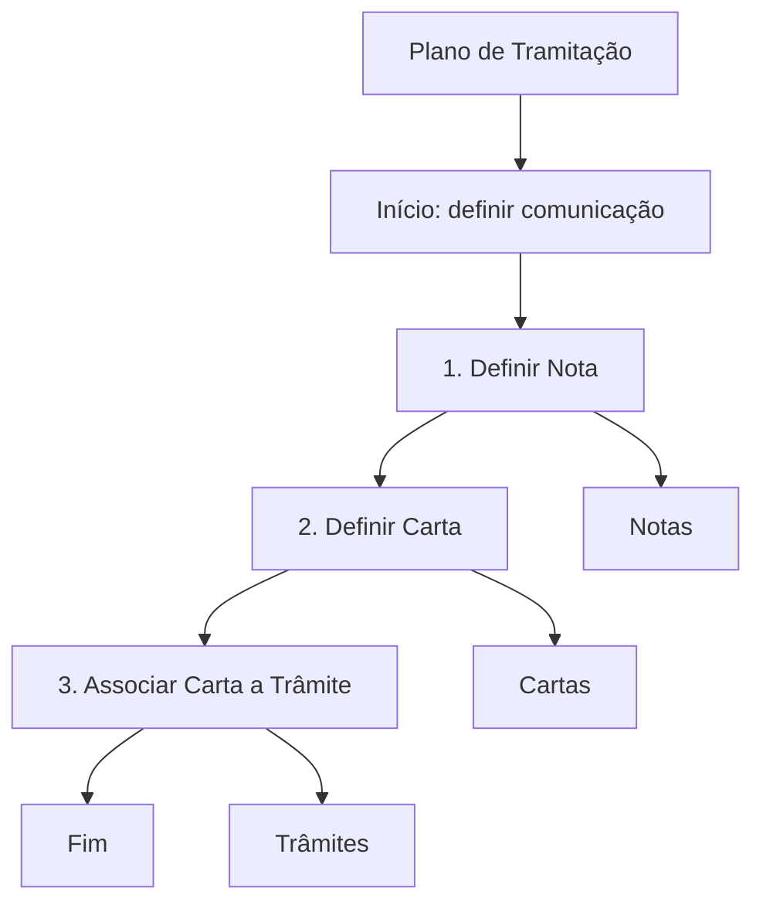

# Definição e Geração de Cartas-Email a partir do Plano de Tramitação

## 1. Metadados do Documento
- **Arquivo de Origem:** Não identificado
- **Tipo de Documento:** Procedimento
- **Domínio / Sistema:** Reef / Mapfredocument / Plano de Tramitação
- **Público-Alvo:** Usuários responsáveis por definir comunicações e associar cartas a trâmites
- **Data/Versão Identificada:** Não identificada
- **Owner identificado:** `user:agonzalez_mapfre.com`
- **Lifecycle identificado:** Approved

---

## 2. Resumo Executivo & Contexto de Negócio

O documento descreve como definir uma comunicação para lançamento a partir do Plano de Tramitação, utilizando notas. O objetivo declarado é permitir o entendimento do que pode ser definido e como realizar a definição dessa comunicação.

O processo documentado contém três etapas sequenciais: definir uma Nota, definir uma Carta e associar a Carta a um Trâmite. A conclusão do fluxo ocorre após a associação da carta ao trâmite.

O conteúdo está identificado como documentação do domínio Reef e também apresenta as referências textuais `Mapfredocument`, `DOCUMENTACIÓN Reef` e `Documentation / DOCUMENTACIÓN Reef`. O ciclo de vida do conteúdo está marcado como `Approved`.

O documento não apresenta detalhes adicionais sobre formatos de carta-email, conteúdo das notas, critérios para associação, métodos HTTP, interfaces, campos, regras de validação ou mecanismos técnicos de envio.

---

## 3. Arquitetura, Componentes & Tecnologias Envolvidas

Os elementos funcionais identificados são:

- **Plano de Tramitação:** contexto a partir do qual uma comunicação pode ser lançada.
- **Notas:** artefato que deve ser definido na primeira etapa do processo.
- **Carta:** artefato que deve ser definido na segunda etapa e associado a um trâmite na terceira etapa.
- **Trâmite:** elemento ao qual a carta deve ser associada.
- **Reef:** domínio ou área documental mencionada.
- **Mapfredocument:** referência textual presente no conteúdo.
- **Carta-Email:** comunicação tratada pelo procedimento.



**Nota de Análise:** o documento define a sequência funcional entre Nota, Carta e Trâmite, mas não detalha componentes de software, integrações, interfaces, persistência de dados, ambientes técnicos ou tecnologias de implementação.

---

## 4. Regras de Negócio, Especificações Funcionais & Processos

### Objetivo funcional

A finalidade informada é conhecer:

1. O que pode ser definido em uma comunicação.
2. Como definir uma comunicação.
3. Como lançar essa comunicação a partir do Plano de Tramitação.
4. O uso de notas no processo de definição da comunicação.

### Processo obrigatório identificado

1. **Definir Nota**
   - A Nota deve ser definida como primeira etapa do processo.
   - O documento não especifica atributos, conteúdo, obrigatoriedade de campos ou regras de validação para a Nota.

2. **Definir Carta**
   - A Carta deve ser definida após a definição da Nota.
   - O documento não especifica modelos, formatos, destinatários, assunto, corpo de email ou anexos da Carta.

3. **Associar Carta a Trâmite**
   - A Carta deve ser associada a um Trâmite.
   - A associação da Carta ao Trâmite encerra o processo apresentado.
   - O documento não descreve critérios de seleção do Trâmite, regras de múltiplas associações ou comportamento após a associação.

---

## 5. Tabelas de Parâmetros, Ambientes e Estruturas de Dados

| Item / Parâmetro | Descrição / Função | Tipo / Valores / Formato | Ambiente / Observações |
| :--- | :--- | :--- | :--- |
| Comunicação | Elemento a ser definido para lançamento a partir do Plano de Tramitação. | Não detalhado. | O documento relaciona a definição de comunicação ao uso de notas. |
| Plano de Tramitação | Origem funcional para lançamento da comunicação. | Não detalhado. | Não há URL, ambiente ou configuração apresentada. |
| Nota | Primeiro artefato a ser definido no processo. | Não detalhado. | Etapa 1 do fluxo. |
| Carta | Segundo artefato a ser definido e posteriormente associado a um Trâmite. | Não detalhado. | Etapa 2 do fluxo. |
| Trâmite | Entidade que recebe a associação da Carta. | Não detalhado. | Etapa 3 e fim do fluxo. |
| Reef | Referência de documentação e domínio identificado. | `DOCUMENTACIÓN Reef` / `Documentation`. | Não há detalhamento técnico adicional. |
| Mapfredocument | Referência textual apresentada no documento. | Texto livre. | Função não detalhada. |
| Owner | Proprietário identificado no conteúdo. | `user:agonzalez_mapfre.com` | Identificado como `Owner`. |
| Lifecycle | Estado do ciclo de vida documental. | `Approved` | Estado apresentado no conteúdo. |
| Idioma | Idioma exibido na navegação documental. | `ES` | O conteúdo principal está em espanhol. |

---

## 6. Bateria de Perguntas & Respostas para RAG (FAQ Sintético)

### P1: Qual é o objetivo do documento sobre definição e geração de cartas-email?
**R:** O objetivo é explicar o que pode ser definido em uma comunicação e como definir essa comunicação para lançá-la a partir do Plano de Tramitação mediante o uso de notas.

### P2: Qual é a primeira etapa para definir uma comunicação no Plano de Tramitação?
**R:** A primeira etapa é definir uma Nota. O documento não informa quais campos, regras ou conteúdos a Nota deve possuir.

### P3: Qual é a sequência de etapas para configurar uma comunicação?
**R:** A sequência apresentada é: definir uma Nota, definir uma Carta e associar a Carta a um Trâmite. Após a associação da Carta ao Trâmite, o fluxo é finalizado.

### P4: Em que momento uma Carta deve ser associada a um Trâmite?
**R:** A Carta deve ser associada a um Trâmite depois que a Nota e a Carta forem definidas. Essa associação corresponde à terceira e última etapa do processo documentado.

### P5: O documento informa como enviar uma carta-email?
**R:** Não. O documento menciona definição e geração de cartas-email a partir do Plano de Tramitação, mas não descreve mecanismo de envio, destinatários, protocolos, serviços de email ou condições de disparo.

### P6: Quais são os artefatos funcionais envolvidos no processo?
**R:** Os artefatos funcionais explicitamente apresentados são a Comunicação, o Plano de Tramitação, a Nota, a Carta e o Trâmite.

### P7: O documento especifica os campos obrigatórios de uma Carta?
**R:** Não. O documento somente determina que uma Carta deve ser definida na segunda etapa e associada a um Trâmite na terceira etapa.

### P8: Qual é o domínio ou referência documental identificada no conteúdo?
**R:** O conteúdo menciona `DOCUMENTACIÓN Reef`, `Documentation / DOCUMENTACIÓN Reef`, `Reef` e `Mapfredocument`. Não há explicação adicional sobre a função técnica de Reef ou Mapfredocument.

### P9: Qual é o estado de ciclo de vida do documento?
**R:** O conteúdo identifica o campo `Lifecycle` com o valor `Approved`.

### P10: Quem é o proprietário identificado no documento?
**R:** O campo `Owner` identifica `user:agonzalez_mapfre.com`.

---

## 7. Glossário de Termos, Siglas & Conceitos-Chave

- **Carta-Email:** termo presente no título do documento para a comunicação tratada pelo procedimento; o formato ou comportamento não é detalhado.
- **Carta:** artefato que deve ser definido e posteriormente associado a um Trâmite.
- **Comunicação:** item que pode ser definido para lançamento a partir do Plano de Tramitação.
- **Lifecycle:** campo que registra o estado do ciclo de vida documental; o valor apresentado é `Approved`.
- **Mapfredocument:** referência textual presente no documento; o significado ou função não é detalhado.
- **Nota:** artefato definido na primeira etapa do processo.
- **Plano de Tramitação:** contexto funcional utilizado para lançar uma comunicação.
- **Reef:** domínio ou área de documentação mencionada como `DOCUMENTACIÓN Reef`.
- **Trâmite:** entidade à qual uma Carta é associada na etapa final do processo.

---

## 8. Notas Críticas, Riscos & Limitações

- O documento apresenta apenas um fluxo funcional resumido de três etapas.
- Não há detalhamento de campos, contratos, telas, APIs, URLs, servidores, ambientes, credenciais, permissões ou logs.
- Não são especificados critérios de validação para Nota, Carta ou associação de Carta a Trâmite.
- Não há descrição das condições que efetivamente disparam a geração ou o envio da Carta-Email.
- **Nota de Análise:** o documento lista `Reef` e `Mapfredocument`, porém não detalha a responsabilidade, integração ou arquitetura desses elementos.
- **Nota de Análise:** o conteúdo não informa se uma Carta pode ser associada a mais de um Trâmite, nem se um Trâmite pode possuir múltiplas Cartas.

---

## 9. Conteúdo Bruto Estruturado (Referência Fiel)

```text
--- [PÁGINA 1 DE 1] ---

DEFINICIÓN y Generación Cartas-Email desde el Plan de tramitación
Objetivo
La nalidad de este documento es conocer qué y cómo se puede denir una comunicación para lanzarla desde el plan de Plan de
Tramitación mediante el uso de notas.
Proceso a seguir para denir una Comunicación
DEFINIR
Notas
(1)
DEFINIR
Carta(2)
Asociar Carta
a trámite
(3)
FIN
1. DEFINIR Nota
2. DEFINIR Carta
3. ASOCIAR Cartas a Trámites
Documentation / DOCUMENTACIÓN Reef
DOCUMENTACIÓN Reef
Mapfredocument
DOCUMENTACIÓN Reef
Owner
user:agonzalez_mapfre.com
Lifecycle
Approved Source
 / 
 VL
Buscar Inicio Soluciones Arquitecturas APIs Componentes Cloud Documentación Zeus Reef Ayuda
ES
```
