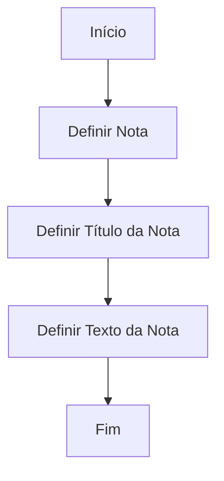

# Definição de Notas para Geração de Cartas no Reef

## 1. Metadados do Documento
- **Arquivo de Origem:** Não identificado no conteúdo fornecido
- **Tipo de Documento:** Procedimento
- **Domínio / Sistema:** Reef / Mapfre
- **Público-Alvo:** Usuários funcionais responsáveis pela definição de notas para cartas
- **Data/Versão Identificada:** Não identificada
- **Owner identificado:** `user:agonzalez_mapfre.com`
- **Lifecycle identificado:** `Approved`
- **Origem identificada:** `Source / VL`

---

## 2. Resumo Executivo & Contexto de Negócio

O documento descreve o processo de definição de uma nota destinada à elaboração de um texto simples para cartas. O objetivo explícito é explicar como configurar uma nota, seu título e seu conteúdo textual.

O fluxo apresentado é sequencial e composto por três ações: definir a nota, definir o título da nota e definir o texto da nota. O processo é encerrado após a conclusão dessas definições.

O conteúdo está inserido no contexto de documentação Reef e apresenta referências às áreas de documentação, soluções, arquiteturas, APIs, componentes, cloud e ajuda. Contudo, o documento não detalha como a nota definida é associada a uma carta específica, nem informa regras de publicação, aprovação ou consumo posterior do texto.

Não há detalhamento sobre integrações, contratos técnicos, campos obrigatórios, persistência de dados, permissões, validações ou tratamento de erros. O documento deve ser interpretado como uma orientação funcional resumida para criação de conteúdo textual simples.

---

## 3. Arquitetura, Componentes & Tecnologias Envolvidas

Os elementos explicitamente citados são:

- **Reef:** contexto de documentação em que o procedimento está publicado.
- **Mapfre:** referência corporativa presente no conteúdo.
- **Notas:** entidade funcional definida para realizar um texto simples.
- **Cartas:** artefato de negócio para o qual a nota é definida.
- **Documentación Reef / DOCUMENTACIÓN Reef:** área documental indicada no conteúdo.
- **Zeus:** item de navegação citado, sem relação técnica descrita com o processo de notas.
- **Cloud, APIs, Componentes, Arquiteturas e Soluções:** categorias de navegação apresentadas, sem detalhes de implementação ou relacionamento com a definição de notas.



**Nota de Análise:** O documento não descreve arquitetura de software, microsserviços, banco de dados, APIs, tecnologias de implementação, ambientes ou integrações relacionadas à definição de notas.

---

## 4. Regras de Negócio, Especificações Funcionais & Processos

### Objetivo funcional

O objetivo declarado é:

> Explicar o processo para definir uma nota para realizar um texto simples.

A finalidade explícita da nota é apoiar a geração de um texto simples relacionado a cartas.

### Processo de definição de notas

O procedimento contém as seguintes etapas, na ordem apresentada:

1. **Definir Nota**
   - A nota deve ser definida como primeira etapa do processo.
   - O documento não informa identificador, categoria, tipo, estado ou atributos adicionais para a nota.

2. **Definir Título da Nota**
   - Após definir a nota, deve ser definido o título da nota.
   - O documento não informa formato, tamanho máximo, obrigatoriedade, unicidade ou idioma do título.

3. **Definir Texto da Nota**
   - Após definir o título, deve ser definido o texto da nota.
   - O texto é caracterizado pelo documento como um texto simples.
   - O documento não informa formatação suportada, variáveis dinâmicas, placeholders, limite de caracteres, codificação ou regras de edição.

4. **Fim**
   - O processo é finalizado após a definição do texto da nota.

### Restrições e condições identificadas

- A ordem apresentada é: nota → título → texto → fim.
- O documento não apresenta condições de aprovação, rejeição, exclusão, atualização ou versionamento.
- O documento não especifica critérios para associar notas a modelos, destinatários, tipos de carta ou eventos de negócio.
- O documento não detalha métodos de persistência, validações de campos ou permissões de usuário.

---

## 5. Tabelas de Parâmetros, Ambientes e Estruturas de Dados

| Item / Parâmetro | Descrição / Função | Tipo / Valores / Formato | Ambiente / Observações |
| :--- | :--- | :--- | :--- |
| Nota | Entidade definida para realizar um texto simples. | Não especificado | Relacionada ao processo de geração de cartas. |
| Título da Nota | Título associado à nota. | Não especificado | Deve ser definido após a definição da nota. |
| Texto da Nota | Conteúdo textual simples da nota. | Texto simples; demais características não especificadas | Deve ser definido após o título da nota. |
| Carta | Artefato mencionado como contexto para a definição da nota. | Não especificado | O vínculo entre nota e carta não é detalhado. |
| Reef | Sistema ou contexto documental citado. | Não especificado | Referenciado como `Documentation / DOCUMENTACIÓN Reef`. |
| Mapfre | Referência corporativa indicada no conteúdo. | Não aplicável | Aparece como `Mapfredocument`. |
| Owner | Responsável identificado no cabeçalho documental. | `user:agonzalez_mapfre.com` | Valor apresentado literalmente no conteúdo. |
| Lifecycle | Estado de ciclo de vida do documento. | `Approved` | Valor apresentado literalmente no conteúdo. |
| Source | Origem ou classificação do conteúdo. | `VL` | Apresentado como `Source / VL`. |
| Idioma da interface | Idioma exibido na navegação. | `ES` | A interface apresentada está em espanhol. |

---

## 6. Bateria de Perguntas & Respostas para RAG (FAQ Sintético)

### P1: Qual é o objetivo do procedimento de definição de notas?
**R:** O objetivo do procedimento é explicar como definir uma nota para realizar um texto simples. O documento relaciona essa definição ao contexto de geração de cartas.

### P2: Quais são as etapas do processo para definir uma nota?
**R:** O processo apresentado possui três etapas sequenciais: definir a nota, definir o título da nota e definir o texto da nota. Após essas etapas, o fluxo é encerrado.

### P3: Em que ordem devem ser definidos os elementos de uma nota?
**R:** A ordem indicada é: primeiro definir a nota, depois definir o título da nota e, por último, definir o texto da nota.

### P4: Que tipo de conteúdo deve ser definido no texto da nota?
**R:** O documento informa que a nota é utilizada para realizar um texto simples. Não há especificação adicional sobre formatação, HTML, variáveis, placeholders ou limites de tamanho.

### P5: O documento define regras de validação para o título da nota?
**R:** Não. O documento apenas estabelece que o título da nota deve ser definido após a criação ou definição da nota. Não informa regras de obrigatoriedade, tamanho, unicidade ou formato.

### P6: O documento informa como associar uma nota a uma carta?
**R:** Não. O conteúdo afirma que a nota é definida para realizar um texto simples no contexto de cartas, mas não descreve mecanismos, telas, campos ou regras para associar uma nota a uma carta específica.

### P7: Quais tecnologias ou APIs são usadas para definir notas no Reef?
**R:** O documento não informa tecnologias, APIs, endpoints, métodos HTTP, contratos JSON, banco de dados ou serviços utilizados para definir notas. As referências a APIs, componentes e cloud aparecem apenas como itens de navegação.

### P8: Qual é o estado de ciclo de vida identificado para o documento?
**R:** O conteúdo apresenta o campo `Lifecycle` com o valor `Approved`.

### P9: Quem é o owner identificado no conteúdo?
**R:** O campo `Owner` apresenta o valor literal `user:agonzalez_mapfre.com`.

### P10: O procedimento especifica permissões de acesso ou perfis autorizados para criar notas?
**R:** Não. O documento não descreve perfis, matrizes de permissão, autenticação, autorização ou responsabilidades operacionais para definição de notas.

### P11: O documento informa o que ocorre depois da definição do texto da nota?
**R:** O fluxo indica `FIN` após a definição do texto da nota. Não há detalhamento sobre publicação, salvamento, aprovação, geração da carta ou utilização posterior da nota.

---

## 7. Glossário de Termos, Siglas & Conceitos-Chave

- **Reef:** contexto ou sistema de documentação identificado no conteúdo como `Documentation / DOCUMENTACIÓN Reef`.
- **Nota:** entidade funcional que deve ser definida para realizar um texto simples.
- **Título da Nota:** título associado à nota, definido após a própria nota.
- **Texto da Nota:** conteúdo textual simples definido para a nota.
- **Carta:** artefato de negócio citado como contexto de uso da nota.
- **Lifecycle:** campo de ciclo de vida documental; o valor identificado é `Approved`.
- **Owner:** campo que identifica o responsável pelo documento; o valor apresentado é `user:agonzalez_mapfre.com`.
- **Source:** campo de origem ou classificação do documento; o valor apresentado é `VL`.
- **Zeus:** item de navegação mencionado no conteúdo, sem definição ou relação funcional detalhada.
- **ES:** indicação de idioma espanhol na interface apresentada.

---

## 8. Notas Críticas, Riscos & Limitações

- O documento é resumido e não informa o nome do arquivo de origem, data, versão ou identificador documental.
- Não há detalhamento de arquitetura técnica, APIs, banco de dados, integrações, infraestrutura, ambientes ou rotas de logs.
- Não são apresentadas regras de validação para os campos Nota, Título da Nota e Texto da Nota.
- Não há indicação de como uma nota é salva, aprovada, publicada, alterada, excluída ou vinculada a uma carta.
- O conteúdo não informa perfis de acesso, responsabilidades operacionais ou matriz de permissões.
- **Nota de Análise:** O documento lista referências de navegação, como Soluções, Arquiteturas, APIs, Componentes, Cloud, Documentação e Zeus, porém não detalha qualquer relação dessas áreas com o procedimento de definição de notas.
- **Nota de Análise:** O documento apresenta o processo até o encerramento após a definição do texto, sem explicar a geração efetiva, o envio ou a consulta de cartas.

---

## 9. Conteúdo Bruto Estruturado (Referência Fiel)

```text
--- [PÁGINA 1 DE 1] ---

DEFINICIÓN Notas para Generar Cartas
Objetivo
Explicar el proceso para denir una nota para realizar un texto sencillo.
Proceso para la denición de Notas
DEFINIR
Nota (1)
Definir Título
de la Nota
(2)
Definir Texto
de la Nota
(2)
FIN
1. DEFINIR Nota
2. DEFINIR Título de la Nota
3. DEFINIR Texto de la Nota
Documentation / DOCUMENTACIÓN Reef
DOCUMENTACIÓN Reef
Mapfredocument
DOCUMENTACIÓN Reef
Owner
user:agonzalez_mapfre.com
Lifecycle
Approved Source
 / 
 VL
Buscar Inicio Soluciones Arquitecturas APIs Componentes Cloud Documentación Zeus Reef Ayuda
ES
```
