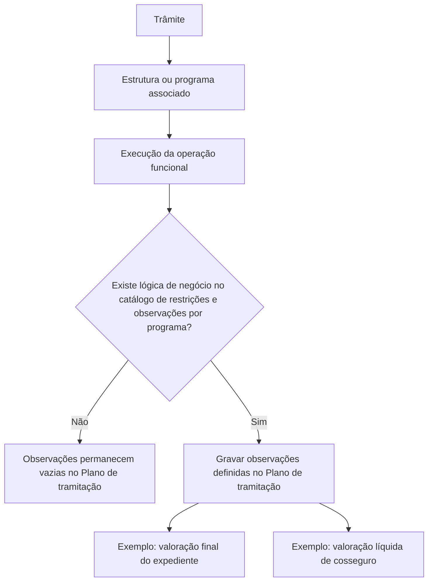

# Definição de Observações de Estruturas no Plano de Tramitação — Documentação Reef

## 1. Metadados do Documento
- **Arquivo de Origem:** Não identificado no conteúdo fornecido
- **Tipo de Documento:** Especificação Funcional / Documentação de Sistema
- **Domínio / Sistema:** Reef.core / Plano de tramitação
- **Público-Alvo:** Desenvolvedores, analistas funcionais e operação
- **Data/Versão Identificada:** Não identificada
- **Owner identificado:** `user:agonzalez_mapfre.com`
- **Lifecycle identificado:** Approved Source
- **Classificação identificada:** VL

---

## 2. Resumo Executivo & Contexto de Negócio

O documento descreve como definir as observações que devem ser gravadas no **Plano de tramitação** do sistema **Reef.core** quando uma estrutura ou programa associado a um trâmite é executado. Um trâmite pode possuir uma ou mais estruturas, entendidas como operações funcionais, incluindo alteração de valoração, modificação de sinistro, modificação de expediente e outras operações não detalhadas.

A finalidade declarada é explicar a definição das informações que serão registradas no Plano de tramitação após a execução de uma estrutura ou programa. Essa definição é configurada em Reef.core para determinar quais dados operacionais devem permanecer documentados no plano.

O comportamento depende da existência de uma lógica de negócio configurada para o programa no **catálogo de restrições e observações por programa**. Quando não existe definição para gravar observações, a operação é executada, mas as observações permanecem vazias.

Quando existe lógica de negócio definida para o programa executado, a operação grava as observações correspondentes no Plano de tramitação. O exemplo apresentado para a operação de mudança de valoração registra a valoração final do expediente e a valoração líquida de cosseguro.

O conteúdo também apresenta exemplos de informações que podem ser registradas conforme o programa associado ao trâmite: valor final avaliado para mudança de valoração, beneficiário e valor de liquidação para liquidação, e uma ou mais causas de encerramento para término de expediente.

---

## 3. Arquitetura, Componentes & Tecnologias Envolvidas

Os componentes e conceitos explicitamente citados são:

| Componente / Conceito | Papel descrito no documento |
| :--- | :--- |
| **Reef.core** | Sistema no qual é definida a informação que será deixada no Plano de tramitação após a execução de operações funcionais. |
| **Plano de tramitação** | Local em que as observações decorrentes da execução de estruturas ou programas são registradas. |
| **Trâmite** | Entidade que pode possuir uma ou várias estruturas associadas. |
| **Estrutura** | Operação funcional associada a um trâmite, como mudança de valoração, modificação de sinistro ou modificação de expediente. |
| **Programa** | Elemento que pode estar associado a um trâmite e cuja execução pode gravar observações no Plano de tramitação. |
| **Catálogo de restrições e observações por programa** | Catálogo no qual pode existir lógica de negócio definida para a gravação de observações por programa. |
| **Lógica de negócio** | Definição que, quando existente para o programa executado, determina a gravação de observações no Plano de tramitação. |



**Nota de Análise:** O documento menciona Reef.core, o Plano de tramitação e o catálogo de restrições e observações por programa, mas não detalha interfaces, URLs, serviços, métodos HTTP, contratos JSON, persistência de dados ou tecnologias de implementação.

---

## 4. Regras de Negócio, Especificações Funcionais & Processos

### 4.1 Associação entre trâmite e estruturas

1. Um **trâmite** no Plano de tramitação pode ter associada uma ou várias **estruturas**.
2. As estruturas podem representar operações funcionais.
3. Entre os exemplos de operações funcionais citados estão:
   - Alterar a valoração.
   - Modificar o sinistro.
   - Modificar o expediente.
   - Outras operações representadas pelo termo “etc.”, sem detalhamento adicional.

### 4.2 Definição de observações no Reef.core

1. O Reef.core possui um local em que se define qual informação será deixada no Plano de tramitação.
2. A informação definida será utilizada quando as operações funcionais associadas forem executadas.
3. O objetivo da definição é registrar dados relevantes da execução de uma estrutura ou programa no Plano de tramitação.

### 4.3 Regra para ausência de definição de observações

1. Quando uma operação não possui definição para gravar observações:
   - A operação é executada.
   - As observações no Plano de tramitação permanecem vazias.

### 4.4 Regra para lógica de negócio definida

1. Quando o programa a ser executado possui lógica de negócio definida no catálogo de restrições e observações por programa:
   - A operação é executada.
   - As observações definidas são gravadas no Plano de tramitação.

### 4.5 Exemplos de informações registráveis

| Programa ou operação associada ao trâmite | Informação que pode ser registrada no Plano de tramitação |
| :--- | :--- |
| Programa de mudança de valoração | Valor final avaliado. |
| Operação de mudança de valoração com lógica de negócio definida | Valoração final do expediente e valoração líquida de cosseguro. |
| Liquidação | Beneficiário da liquidação e valor da liquidação. |
| Término de expediente | Uma ou várias causas de término. |

**Nota de Análise:** O documento não informa os critérios de cálculo da valoração final, da valoração líquida de cosseguro ou do valor de liquidação. Também não especifica os campos, formatos, obrigatoriedade, regras de validação ou códigos das causas de término.

---

## 5. Tabelas de Parâmetros, Ambientes e Estruturas de Dados

| Item / Parâmetro | Descrição / Função | Tipo / Valores / Formato | Ambiente / Observações |
| :--- | :--- | :--- | :--- |
| Trâmite | Pode ter uma ou várias estruturas associadas. | Não especificado | Contexto do Plano de tramitação. |
| Estrutura | Representa uma operação funcional associada a um trâmite. | Exemplos: mudança de valoração, modificação de sinistro, modificação de expediente | O documento não detalha a estrutura técnica. |
| Programa | Pode estar associado a um trâmite e ser executado. | Não especificado | Pode possuir lógica de negócio no catálogo. |
| Observações | Informações registradas após a execução de uma operação ou programa. | Não especificado | Permanecem vazias quando não existe definição para gravá-las. |
| Catálogo de restrições e observações por programa | Fonte da lógica de negócio para gravação de observações. | Não especificado | Citado como condição para a gravação de observações. |
| Valoração final do expediente | Informação gravada no exemplo de mudança de valoração. | Não especificado | Gravada quando há lógica de negócio definida para o programa. |
| Valoração líquida de cosseguro | Informação gravada no exemplo de mudança de valoração. | Não especificado | Gravada juntamente com a valoração final do expediente. |
| Beneficiário da liquidação | Informação que pode ser registrada para liquidação. | Não especificado | Exemplo apresentado no documento. |
| Valor da liquidação | Informação que pode ser registrada para liquidação. | Não especificado | Exemplo apresentado no documento. |
| Causas de término | Uma ou várias causas que podem ser registradas no encerramento de expediente. | Uma ou várias causas | O documento não define catálogo, formato ou validação. |
| Owner | Responsável identificado na documentação. | `user:agonzalez_mapfre.com` | Metadado exibido no conteúdo. |
| Lifecycle | Estado identificado na documentação. | `Approved Source` | Metadado exibido no conteúdo. |
| Classificação | Valor identificado na documentação. | `VL` | Metadado exibido no conteúdo. |

---

## 6. Bateria de Perguntas & Respostas para RAG (FAQ Sintético)

### P1: Qual é o objetivo da definição de observações de estruturas no Plano de tramitação?
**R:** O objetivo é definir quais informações serão registradas no Plano de tramitação quando uma estrutura ou programa associado a um trâmite for executado em Reef.core.

### P2: O que pode estar associado a um trâmite no Plano de tramitação?
**R:** Um trâmite pode ter associada uma ou várias estruturas. Essas estruturas podem ser operações funcionais, como mudança de valoração, modificação de sinistro e modificação de expediente.

### P3: O que acontece quando uma operação não possui definição para gravar observações?
**R:** A operação é executada, porém as observações no Plano de tramitação permanecem vazias.

### P4: Em que condição Reef.core grava observações no Plano de tramitação?
**R:** Reef.core grava observações quando o programa que será executado possui uma lógica de negócio definida no catálogo de restrições e observações por programa.

### P5: Onde é definida a lógica que permite gravar observações por programa?
**R:** A lógica de negócio é definida no catálogo de restrições e observações por programa, conforme descrito no documento.

### P6: Quais observações são gravadas no exemplo de mudança de valoração?
**R:** No exemplo de mudança de valoração com lógica de negócio definida, são gravadas a valoração final do expediente e a valoração líquida de cosseguro.

### P7: Quais informações podem ser registradas quando o trâmite possui liquidação associada?
**R:** Quando o trâmite possui liquidação associada, podem ser registradas no Plano de tramitação o beneficiário da liquidação e o valor da liquidação.

### P8: O que pode ser registrado no Plano de tramitação para término de expediente?
**R:** Para o término de expediente, o documento informa que é possível registrar uma ou várias causas de término.

### P9: O documento define os contratos técnicos, métodos HTTP ou estruturas JSON de Reef.core?
**R:** Não. O documento descreve o comportamento funcional relacionado à gravação de observações, mas não detalha métodos HTTP, contratos JSON, APIs, interfaces ou tecnologias de persistência.

### P10: O documento informa como calcular a valoração final ou a valoração líquida de cosseguro?
**R:** Não. O documento apenas informa que esses valores são gravados no exemplo da operação de mudança de valoração quando há lógica de negócio definida, sem apresentar fórmulas, campos de origem ou regras de cálculo.

---

## 7. Glossário de Termos, Siglas & Conceitos-Chave

- **Reef.core:** Sistema citado como o local em que se define a informação a ser deixada no Plano de tramitação após a execução de operações.
- **Plano de tramitação:** Plano no qual são registradas observações relacionadas à execução de estruturas ou programas.
- **Trâmite:** Entidade que pode possuir uma ou várias estruturas associadas.
- **Estrutura:** Operação funcional associada a um trâmite.
- **Programa:** Elemento associado a um trâmite cuja execução pode gerar observações no Plano de tramitação.
- **Observações:** Informações que podem ser gravadas no Plano de tramitação após a execução de uma operação ou programa.
- **Catálogo de restrições e observações por programa:** Catálogo citado como local de definição da lógica de negócio para gravação de observações.
- **Lógica de negócio:** Definição que determina que observações devem ser gravadas após a execução de um programa.
- **Valoração:** Termo usado para a operação de mudança de valoração e para a valoração final do expediente.
- **Cosseguro:** Contexto no qual é citada a valoração líquida de cosseguro.
- **Liquidação:** Operação ou contexto no qual podem ser registrados beneficiário e valor da liquidação.
- **VL:** Classificação exibida no cabeçalho do conteúdo, sem expansão ou significado fornecido.

---

## 8. Notas Críticas, Riscos & Limitações

- O conteúdo não identifica o nome do arquivo de origem, data, versão, autores adicionais ou histórico de alterações.
- O documento não especifica os campos técnicos, formatos de dados, regras de obrigatoriedade, regras de validação ou mecanismos de persistência das observações.
- O documento não detalha a estrutura do catálogo de restrições e observações por programa, nem o processo para cadastrar ou alterar uma lógica de negócio.
- O documento não apresenta cálculo, origem de dados ou critérios de consistência para valoração final, valoração líquida de cosseguro, valor de liquidação ou causas de término.
- O documento cita exemplos de operações funcionais, mas não define exaustivamente todas as estruturas disponíveis.
- O conteúdo extraído apresenta caracteres corrompidos ou substituídos por `` em diversas palavras, incluindo “Modicar”, “denir” e “nalidad”. A interpretação foi limitada ao contexto textual disponível, sem alterar os fatos apresentados.
- As imagens “Observaciones del Cambio de valoración sin Lógica de Negocio” e “Observaciones del Cambio de valoración con Lógica de Negocio” são apenas referenciadas na extração; seu conteúdo visual não foi disponibilizado.

---

## 9. Conteúdo Bruto Estruturado (Referência Fiel)

```text
--- [PÁGINA 1 DE 2] ---

DEFINICIÓN Observaciones de Estructuras en el Plan
¿En que consiste?
En el plan de tramitación, un trámite puede tener asociado una o varias estructuras. Estas estructuras pueden ser operaciones funcionales
como Cambiar la valoración, Modicar el Siniestro, Modicar el expediente, etc. En Reef.core hay un lugar donde se puede denir qué
información se va a dejar en el Plan de tramitación, cuando se ejecuten estas operaciones.
Objetivo
La nalidad de este documento es conocer cómo se dene las observaciones que se quieren dejar en el plan cuando se ejecute una
estructura, un programa.
Ejemplo:
Si el trámite tiene asociado el programa del cambio de valoración se puede registrar en el Plan, el importe nal valorado.
Si el trámite tiene asociado la liquidación, se puede registrar en el plan, el beneciario de la liquidación, el importe de la liquidación.
Si el trámite tiene asociado la terminación de expediente podemos registrar la o las causas de terminación.
Etc.
Imagen Observaciones del Cambio de valoración sin Lógica de Negocio
Cuando en una operación NO hay denición para grabar observaciones, cuando se ejecute esta, las observaciones quedarán vacías.
Documentation / DOCUMENTACIÓN Reef
DOCUMENTACIÓN Reef
Mapfredocument
DOCUMENTACIÓN Reef
Owner
user:agonzalez_mapfre.com
Lifecycle
Approved Source
 / 
 VL
Buscar Inicio Soluciones Arquitecturas APIs Componentes Cloud Documentación Zeus Reef Ayuda
ES


--- [PÁGINA 2 DE 2] ---

Imagen Observaciones del Cambio de valoración con Lógica de Negocio
Si para el programa que se va a ejecutar existe una lógica de negocio denida en el catálogo de restricciones y observaciones por programa,
cuando se ejecute dicha operación, grabará las observaciones en el plan de tramitación.
En el ejemplo para la operación de cambio de valoración, se graba la valoración nal del expediente y la valoración neta de coaseguro.
```
