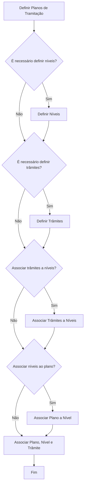
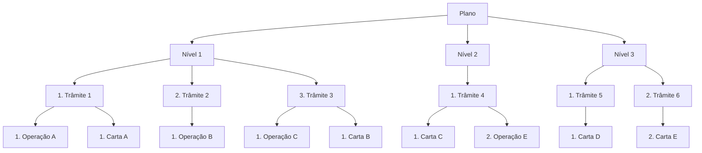

# Definição de Plano de Tramitação no Reef.core

## 1. Metadados do Documento
- **Arquivo de Origem:** Não identificado no conteúdo fornecido
- **Tipo de Documento:** Procedimento
- **Domínio / Sistema:** Reef.core / DOCUMENTACIÓN Reef / Mapfre
- **Público-Alvo:** Tramitadores, supervisores e equipes responsáveis pela configuração do Reef.core
- **Data/Versão Identificada:** Não identificada

---

## 2. Resumo Executivo & Contexto de Negócio

O documento descreve a definição e a configuração de um **Plano de Tramitação** no sistema **Reef.core**. O Reef.core requer uma configuração prévia, definida pelo usuário, para determinar o comportamento operacional do sistema.

O Plano de Tramitação funciona como uma guia para gestão de diferentes tipos de expedientes. O plano também apoia a supervisão do trabalho executado pelos tramitadores, permitindo que um expediente seja gerenciado desde a abertura até o encerramento.

A configuração do Plano de Tramitação envolve a definição de planos, níveis e trâmites, seguida pela associação entre esses elementos. O processo resulta em uma estrutura hierárquica composta por um plano, níveis, trâmites e elementos associados, como operações e cartas.

Além das configurações estruturais, o documento identifica definições complementares para ferramentas, observações de operações, confirmações do tramitador, geração de textos e e-mails por meio de notas, papéis do plano, tipos de avisos e tipos de anotações livres.

---

## 3. Arquitetura, Componentes & Tecnologias Envolvidas

### Componentes e conceitos identificados

- **Reef.core:** Sistema que requer configuração prévia para seu funcionamento.
- **Plano de Tramitação:** Estrutura de configuração e guia operacional para tratamento de expedientes.
- **Tipo de Expediente:** Entidade à qual um Plano de Tramitação completo pode ser atribuído.
- **Nível:** Agrupador hierárquico dentro de um Plano de Tramitação.
- **Trâmite:** Unidade de tratamento associada a níveis e ao plano.
- **Operação:** Elemento associado a um trâmite.
- **Carta:** Elemento que pode ser associado a um trâmite.
- **Tramitador:** Usuário que gerencia expedientes e pode registrar avisos ou anotações livres.
- **Supervisor:** Usuário que acompanha o trabalho dos tramitadores e pode visualizar anotações livres.
- **Avisos:** Podem ser definidos para trâmites ou incluídos manualmente pelo tramitador.
- **Anotações livres:** Registros produzidos pelo tramitador e visíveis ao supervisor.
- **Outros módulos:** O Plano de Tramitação permite acesso a funcionalidades de outros módulos, sem detalhamento adicional.





> **Nota de Análise:** O documento apresenta a estrutura conceitual do Plano de Tramitação, mas não detalha modelos de dados, métodos HTTP, contratos JSON, APIs, persistência, tecnologias de implementação ou integrações técnicas específicas.

---

## 4. Regras de Negócio, Especificações Funcionais & Processos

### Finalidade do Plano de Tramitação

1. O Reef.core necessita de configuração prévia para funcionar.
2. O usuário define como o sistema deve se comportar.
3. O Plano de Tramitação é configurado para o manejo de diferentes tipos de expedientes.
4. O Plano de Tramitação serve como guia para o supervisor acompanhar o trabalho dos tramitadores.
5. Um tramitador pode gerenciar um expediente desde a abertura até o fechamento usando o Plano de Tramitação.
6. O objetivo do procedimento é definir o que deve ser configurado para que o Plano de Tramitação esteja completo e possa ser candidato à atribuição a um Tipo de Expediente.

### Funcionalidades acessíveis pelo Plano de Tramitação

- Acesso a todas as funcionalidades de sinistros.
- Realização de operações necessárias a partir do Plano de Tramitação.
- Acesso a funcionalidades de outros módulos.
- Geração de textos e documentos.
- Associação de uma ou mais cartas e textos a um trâmite.
- Definição de avisos para trâmites.
- Inclusão manual de avisos pelo tramitador, quando considerado necessário.
- Registro de anotações livres pelo tramitador.
- Visualização de anotações livres pelo supervisor.

### Processo de definição do Plano de Tramitação

1. **Definir Planos de Tramitação.**
2. Avaliar se é necessário definir níveis.
3. Quando necessário, **definir Níveis**.
4. Avaliar se é necessário definir trâmites.
5. Quando necessário, **definir Trâmites**.
6. Associar trâmites aos níveis.
7. Associar níveis ao plano.
8. Associar a combinação de plano, nível e trâmite.
9. Finalizar a configuração.

### Definições complementares identificadas

- Definição de ferramentas.
- Definição de observações de operações.
- Estruturas de um trâmite.
- Definição de confirmações do tramitador.
- Geração de textos e e-mails mediante notas.
- Definição de papéis do Plano de Tramitação.
- Definição de tipos de avisos.
- Definição de tipos de anotações livres.

> **Nota de Análise:** O documento enumera as definições complementares, mas não fornece regras, campos, valores permitidos, critérios de validação ou passos operacionais para configurá-las.

---

## 5. Tabelas de Parâmetros, Ambientes e Estruturas de Dados

| Item / Parâmetro | Descrição / Função | Tipo / Valores / Formato | Ambiente / Observações |
| :--- | :--- | :--- | :--- |
| Reef.core | Sistema que necessita de configuração prévia para seu funcionamento | Sistema | Nenhum ambiente identificado |
| Plano de Tramitação | Guia para manejo de expedientes e acompanhamento do trabalho dos tramitadores | Estrutura de configuração | Pode ser candidato à atribuição a um Tipo de Expediente |
| Nível | Elemento hierárquico associado ao Plano de Tramitação | Estrutura hierárquica | A definição é condicional conforme necessidade |
| Trâmite | Unidade de tratamento associável a níveis | Estrutura funcional | A definição é condicional conforme necessidade |
| Associação Trâmite–Nível | Vincula trâmites aos níveis definidos | Associação | Etapa 4 do processo |
| Associação Plano–Nível | Vincula níveis ao Plano de Tramitação | Associação | Etapa 5 do processo |
| Associação Plano–Nível–Trâmite | Vincula plano, nível e trâmite | Associação | Etapa 6 do processo |
| Operação | Elemento apresentado como parte da estrutura de um trâmite | Operação | Exemplos: Operação A, B, C e E |
| Carta | Texto ou documento que pode ser associado a um trâmite | Carta / Texto | Exemplos: Carta A, B, C, D e E |
| Aviso | Aviso definido para um trâmite ou incluído manualmente | Aviso | Inclusão manual possível pelo tramitador |
| Anotação livre | Anotação realizada pelo tramitador | Anotação | Pode ser visualizada pelo supervisor |
| Tipo de Expediente | Entidade que pode receber um Plano de Tramitação completo | Tipo de expediente | Critério de candidatura mencionado, sem detalhamento |
| Papéis do Plano de Tramitação | Papéis relacionados ao Plano de Tramitação | Papel / Role | Sem detalhamento adicional |
| Confirmações do Tramitador | Configuração de confirmações relacionadas ao tramitador | Configuração | Sem detalhamento adicional |
| Geração de textos e e-mails mediante notas | Funcionalidade complementar mencionada | Funcionalidade | Sem detalhamento adicional |

---

## 6. Bateria de Perguntas & Respostas para RAG (FAQ Sintético)

### P1: O que é um Plano de Tramitação no Reef.core?
**R:** Um Plano de Tramitação é uma configuração do Reef.core utilizada como guia para o manejo de diferentes tipos de expedientes. O plano permite que um tramitador gerencie um expediente desde a abertura até o encerramento e também oferece ao supervisor uma referência para acompanhamento do trabalho dos tramitadores.

### P2: Por que o Reef.core necessita de um Plano de Tramitação?
**R:** O documento informa que o Reef.core necessita de uma configuração prévia para seu funcionamento. O usuário define como deseja que o sistema se comporte, e o Plano de Tramitação é uma das estruturas utilizadas para definir esse comportamento relacionado ao tratamento de expedientes.

### P3: Quais são as etapas para definir um Plano de Tramitação?
**R:** As etapas identificadas são: definir Planos de Tramitação, definir Níveis quando necessário, definir Trâmites quando necessário, associar Trâmites a Níveis, associar Níveis ao Plano e associar Plano, Nível e Trâmite.

### P4: Um Plano de Tramitação pode ser atribuído diretamente a um Tipo de Expediente?
**R:** O documento estabelece que a finalidade é obter um Plano de Tramitação completo que seja candidato a poder ser atribuído a um Tipo de Expediente. Não são apresentados critérios técnicos, validações ou o procedimento específico para realizar a atribuição.

### P5: Quais funcionalidades de sinistros podem ser acessadas a partir do Plano de Tramitação?
**R:** O documento afirma que, a partir do Plano de Tramitação, é possível acessar todas as funcionalidades de sinistros. Entretanto, não lista individualmente quais funcionalidades de sinistros estão disponíveis.

### P6: Como textos, documentos e cartas se relacionam com um trâmite?
**R:** Quando um trâmite é definido, podem ser associadas uma ou várias cartas e textos. O documento também menciona a geração de textos e documentos a partir do Plano de Tramitação, mas não detalha formatos, modelos ou regras de associação.

### P7: Como os avisos são utilizados no Plano de Tramitação?
**R:** Avisos podem ser definidos para os trâmites. Além disso, o tramitador pode incluir avisos manualmente quando considerar necessário. O documento não detalha tipos de avisos, destinatários, prioridades ou mecanismos de notificação.

### P8: O que são anotações livres e quem pode consultá-las?
**R:** Anotações livres são registros feitos pelo tramitador. O documento informa que essas anotações podem ser visualizadas pelo supervisor.

### P9: Qual é a estrutura exemplificada para o resultado de um Plano de Tramitação?
**R:** O exemplo mostra um Plano contendo Nível 1, Nível 2 e Nível 3. Os níveis contêm trâmites, e os trâmites contêm elementos como Operação A, Operação B, Operação C, Operação E e Cartas A, B, C, D e E.

### P10: Quais definições adicionais podem existir em um Plano de Tramitação?
**R:** O documento lista definição de ferramentas, observações de operações, estruturas de um trâmite, confirmações do tramitador, geração de textos e e-mails mediante notas, papéis do Plano de Tramitação, tipos de avisos e tipos de anotações livres.

### P11: O documento especifica APIs, URLs, bancos de dados ou ambientes do Reef.core?
**R:** Não. O conteúdo fornecido não apresenta APIs, métodos HTTP, URLs, portas, bancos de dados, servidores, variáveis de ambiente ou detalhes de implantação do Reef.core.

### P12: Quais são as responsabilidades do supervisor no contexto descrito?
**R:** O supervisor utiliza o Plano de Tramitação como guia para acompanhar o trabalho de cada tramitador e pode visualizar as anotações livres realizadas pelos tramitadores.

---

## 7. Glossário de Termos, Siglas & Conceitos-Chave

- **Reef.core:** Sistema mencionado como dependente de configuração prévia para seu funcionamento.
- **Plano de Tramitação:** Estrutura que orienta o tratamento de expedientes e o acompanhamento do trabalho dos tramitadores.
- **Tramitador:** Usuário responsável por gerenciar um expediente desde a abertura até o fechamento.
- **Supervisor:** Usuário que acompanha o trabalho dos tramitadores e pode visualizar anotações livres.
- **Expediente:** Unidade tratada pelo tramitador dentro do Plano de Tramitação.
- **Tipo de Expediente:** Tipo ao qual um Plano de Tramitação completo pode ser candidato a ser atribuído.
- **Nível:** Elemento hierárquico configurado dentro de um Plano de Tramitação.
- **Trâmite:** Unidade de tratamento que pode ser associada a um nível.
- **Operação:** Elemento vinculado à estrutura de um trâmite.
- **Carta:** Texto ou documento que pode ser associado a um trâmite.
- **Aviso:** Registro que pode ser definido para um trâmite ou inserido manualmente pelo tramitador.
- **Anotação livre:** Registro realizado pelo tramitador e visível ao supervisor.
- **Mapfredocument:** Termo exibido na navegação do documento, sem explicação adicional no conteúdo.
- **VL:** Sigla exibida junto ao ciclo de vida do documento, sem definição adicional.

---

## 8. Notas Críticas, Riscos & Limitações

- O conteúdo não identifica nome do arquivo, data, versão, autores técnicos ou histórico de alterações.
- O documento apresenta um fluxo de configuração, mas não define critérios objetivos para as decisões condicionais sobre definição de níveis e trâmites.
- Não há descrição de telas, campos obrigatórios, permissões, validações, mensagens de erro ou comportamento em caso de configuração incompleta.
- Não são especificados contratos técnicos, APIs, URLs, integrações, bancos de dados, logs, monitoramento, ambientes ou mecanismos de implantação.
- Os conceitos de ferramentas, observações de operações, confirmações do tramitador, papéis, tipos de avisos e tipos de anotações livres são apenas listados; não há detalhamento funcional adicional.
- A estrutura de resultado é ilustrativa; o documento não informa se os nomes, quantidades ou associações de níveis, trâmites, operações e cartas são obrigatórios.
- O texto extraído apresenta caracteres corrompidos em termos como “definición”, “configuración” e “finalidad”. A interpretação foi preservada pelo contexto, sem introdução de informações externas.

---

## 9. Conteúdo Bruto Estruturado (Referência Fiel)

```text
--- [PÁGINA 1 DE 2] ---

DEFINICIÓN Plan Tramitación
¿En que consiste?
Reef.core necesita para su funcionamiento una conguración previa del sistema. El Usuario será el que dena como quiere que se comporte.
En este caso se va a documentar cómo congurar un Plan de Tramitación.
El Plan de tramitación, puede considerarse como una guía para el manejo de los diferentes tipos de expedientes, así como una guía del
supervisor para realizar un seguimiento del trabajo de cada uno de sus tramitadores.
Con el Plan de tramitación, un tramitador puede gestionar un expediente desde su apertura hasta su cierre.
Desde el Plan de Tramitación, se podrá:
Acceder a todas las funcionalidades de siniestros
Todas las operaciones que se necesite realizar, se podrán realizar desde el Plan.
Acceder a funcionalidades de otros módulos.
Generar Textos, Documentos Cuando se dene un trámite se le puede asociar una o varias cartas, Textos.
Avisos
Se podrán denir avisos a los trámites así como incluirlos manualmente cuando el tramitador considere.
Anotaciones libres
Son anotaciones que realiza el tramitador y que puede ser vistas por el supervisor.
Objetivo
La nalidad de este documento es conocer qué y cómo se tiene que denir para obtener un Plan de Tramitación completo, y que este sea
candidato a poder ser asignado a un Tipo de Expediente.
Proceso a seguir para Denir un Plan de Tramitación
SI
NO
SI
NO
SI
NO
SI
NODEFINIR
Planes
de
Tramitación
(1)
¿Hay que
definir
Niveles? DEFINIR
Niveles (2)
¿Hay que definir
Trámites?
DEFINIR
Trámites
(3)
¿Asociar
Trámites a
Niveles? ASOCIAR
Trámites
Niveles (4)
¿Asociar
Niveles
a
Plan ? ASOCIAR
Plan
Nivel (5)
ASOCIAR
Plan
Nivel
Trámite (6)
FIN
1. DEFINIR Planes de Tramitación
2. DEFINIR Niveles
3. DEFINIR Trámites
4. ASOCIAR Trámites a Niveles
Documentation / DOCUMENTACIÓN Reef
DOCUMENTACIÓN Reef
Mapfredocument
DOCUMENTACIÓN Reef
Owner
user:agonzalez_mapfre.com
Lifecycle
Approved Source
 / 
 VL
Buscar Inicio Soluciones Arquitecturas APIs Componentes Cloud Documentación Zeus Reef Ayuda
ES

--- [PÁGINA 2 DE 2] ---

5. ASOCIAR Niveles a Plan
6. ASOCIAR Trámites Niveles al Plan
Esquema del Resultado Denición del Plan de Tramitación
INI INI
INI INI INI INI
Plan
Nivel 1 Nivel 2 Nivel 3
1.Trámite 1 2.Trámite 2 3.Trámite 3 1.Trámite 4 1.Trámite 5 2.Trámite 6
1.Operación A 1.Carta A 1.Operación B 1.Operación C1.Carta B 1.Carta C 2.Operación E 1.Carta D 2.Carta E
Otras Deniciones para el Plan de Tramitación
Denición de Herramientas
Denición de Observaciones de Operaciones-Estructuras de un Trámite
Denición de Conrmaciones del Tramitador
Generación de Texto-emails mediante Notas
Denición de Roles de Plan Tramitación
Funcionalidades Opcionales
Denición de Tipos de Avisos
Denición de Tipos de Anotaciones Libres
Checking links...
```
