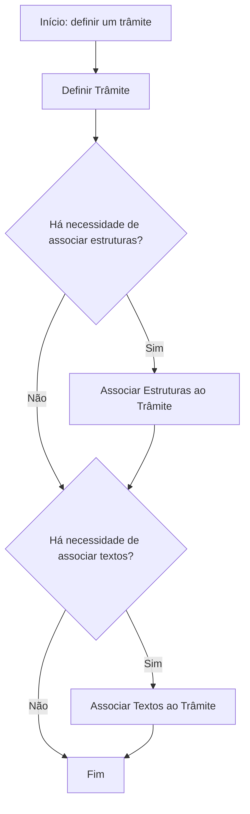

# Definição de Trâmites no Reef.core — Configuração de Planos de Tramitação

## 1. Metadados do Documento
- **Arquivo de Origem:** Não identificado no conteúdo fornecido
- **Tipo de Documento:** Procedimento / Manual funcional
- **Domínio / Sistema:** Reef.core / DOCUMENTACIÓN Reef / Mapfre
- **Público-Alvo:** Desenvolvedores, analistas funcionais, equipes de configuração e operação
- **Data/Versão Identificada:** Não identificada
- **Owner identificado:** `user:agonzalez_mapfre.com`
- **Lifecycle identificado:** `Approved Source / VL`

---

## 2. Resumo Executivo & Contexto de Negócio

O documento apresenta a definição de **trâmites** no sistema **Reef.core**. Segundo o conteúdo, o funcionamento do Reef.core requer a configuração do sistema, e parte dessa configuração consiste em definir o comportamento dos trâmites associados aos diferentes planos de tramitação.

Um trâmite é definido como cada passo necessário para executar um processo. O documento usa o processo de **Peritação** como exemplo e cita possíveis passos: solicitação da peritação, comunicação com o perito, resultado da peritação e comunicação com o assegurado.

A configuração de um trâmite pode determinar se o trâmite deve executar uma operação, gerar um documento ou gerar um aviso para o tramitador. O processo de definição apresentado contempla a criação do trâmite e, conforme a necessidade, a associação de estruturas e textos.

O conteúdo descreve o fluxo de configuração em nível conceitual, sem detalhar interfaces, métodos HTTP, contratos JSON, tabelas de banco de dados, regras de autorização ou mecanismos técnicos de persistência. A finalidade declarada é explicar como definir os trâmites existentes nos distintos planos de tramitação.

---

## 3. Arquitetura, Componentes & Tecnologias Envolvidas

### Componentes e conceitos identificados

| Componente / Conceito | Papel descrito no documento |
| :--- | :--- |
| Reef.core | Sistema que necessita de configuração para seu funcionamento. |
| Trâmite | Cada passo requerido para realizar um processo. |
| Plano de tramitação | Contexto no qual os diferentes trâmites são definidos. |
| Operação | Ação que um trâmite pode executar, conforme a necessidade de configuração. |
| Documento | Artefato que um trâmite pode gerar, conforme a necessidade de configuração. |
| Aviso para o tramitador | Notificação que um trâmite pode gerar para o tramitador. |
| Estruturas | Elementos que podem ser associados a um trâmite no fluxo apresentado. |
| Textos | Elementos que podem ser associados a um trâmite no fluxo apresentado. |
| Processo de Peritação | Exemplo de processo composto por múltiplos trâmites. |
| DOCUMENTACIÓN Reef | Área ou repositório documental mencionado no conteúdo. |
| Mapfredocument | Termo ou localização documental citado no conteúdo, sem detalhamento adicional. |

### Fluxo de definição de um trâmite



> **Nota de Análise:** O documento menciona que um trâmite pode executar uma operação, gerar um documento ou gerar um aviso para o tramitador. Entretanto, o fluxo visual fornecido detalha apenas a definição do trâmite, a associação de estruturas e a associação de textos.

---

## 4. Regras de Negócio, Especificações Funcionais & Processos

### 4.1 Definição funcional de trâmite

- Um **trâmite** é cada passo necessário para a realização de um processo.
- O Reef.core requer configuração do sistema para seu funcionamento.
- A configuração dos trâmites deve definir o comportamento que cada trâmite terá.
- Os trâmites pertencem ou são aplicáveis a diferentes **planos de tramitação**.

### 4.2 Comportamentos configuráveis mencionados

O documento indica que a configuração do comportamento de um trâmite pode abranger:

1. Necessidade de o trâmite executar uma operação.
2. Necessidade de o trâmite gerar um documento.
3. Necessidade de o trâmite gerar um aviso para o tramitador.
4. Outros comportamentos não especificados, indicados pelo termo “Etc.” no conteúdo original.

### 4.3 Processo de definição de um trâmite

O fluxo fornecido apresenta as seguintes etapas:

1. **Definir o trâmite.**
2. Avaliar se há necessidade de **associar estruturas** ao trâmite.
3. Caso seja necessário, **associar estruturas** ao trâmite.
4. Avaliar se há necessidade de **associar textos** ao trâmite.
5. Caso seja necessário, **associar textos** ao trâmite.
6. Encerrar o processo de definição.

### 4.4 Exemplo de processo: Peritação

O documento apresenta o processo de **Peritação** como exemplo de processo que pode ser composto pelos seguintes trâmites:

1. Solicitação da Peritação.
2. Comunicação com o perito.
3. Resultado da Peritação.
4. Comunicação com o Assegurado.

> **Nota de Análise:** O documento não descreve critérios de transição, ordem obrigatória, responsáveis, condições de entrada, condições de saída ou tratamento de exceções para os trâmites do processo de Peritação.

---

## 5. Tabelas de Parâmetros, Ambientes e Estruturas de Dados

| Item / Parâmetro | Descrição / Função | Tipo / Valores / Formato | Ambiente / Observações |
| :--- | :--- | :--- | :--- |
| Trâmite | Passo necessário para realizar um processo. | Conceito funcional | Aplicável aos planos de tramitação. |
| Definir Trâmite | Primeira etapa do processo de configuração apresentado. | Etapa de processo | Obrigatória no fluxo exibido. |
| Associar Estruturas | Associação de estruturas a um trâmite quando necessária. | Etapa condicional | O documento não define quais estruturas existem nem o formato delas. |
| Associar Textos | Associação de textos a um trâmite quando necessária. | Etapa condicional | O documento não define quais textos existem nem o formato deles. |
| Executar operação | Possível comportamento de um trâmite. | Comportamento configurável | Operação não detalhada. |
| Gerar documento | Possível comportamento de um trâmite. | Comportamento configurável | Tipo, formato e destino do documento não detalhados. |
| Gerar aviso ao tramitador | Possível comportamento de um trâmite. | Comportamento configurável | Canal, conteúdo e destinatário específico não detalhados. |
| Solicitação da Peritação | Exemplo de trâmite do processo de Peritação. | Passo de processo | Não há detalhamento adicional. |
| Comunicação com o perito | Exemplo de trâmite do processo de Peritação. | Passo de processo | Não há detalhamento adicional. |
| Resultado da Peritação | Exemplo de trâmite do processo de Peritação. | Passo de processo | Não há detalhamento adicional. |
| Comunicação com o Assegurado | Exemplo de trâmite do processo de Peritação. | Passo de processo | Não há detalhamento adicional. |
| Owner | Proprietário identificado no conteúdo documental. | `user:agonzalez_mapfre.com` | Exibido na área DOCUMENTACIÓN Reef. |
| Lifecycle | Estado documental identificado. | `Approved Source / VL` | O significado de `VL` não é detalhado. |
| Mapfredocument | Termo citado no rodapé ou navegação documental. | Não especificado | Sem detalhamento adicional no texto. |

---

## 6. Bateria de Perguntas & Respostas para RAG (FAQ Sintético)

### P1: O que é um trâmite no Reef.core?
**R:** Um trâmite é cada passo requerido para realizar um processo. O documento explica que os trâmites devem ser definidos para os diferentes planos de tramitação configurados no Reef.core.

### P2: Por que é necessário configurar trâmites no Reef.core?
**R:** O documento afirma que o Reef.core necessita da configuração do sistema para seu funcionamento. A definição dos trâmites determina o comportamento dos passos que compõem os processos dos planos de tramitação.

### P3: Quais comportamentos um trâmite pode ter?
**R:** Conforme o documento, um trâmite pode necessitar executar uma operação, gerar um documento ou gerar um aviso para o tramitador. O conteúdo também indica a possibilidade de outros comportamentos, mas não os especifica.

### P4: Quais são as etapas do processo de definição de um trâmite?
**R:** O processo exibido começa com a definição do trâmite. Depois, é avaliado se há necessidade de associar estruturas ao trâmite e, em seguida, se há necessidade de associar textos. Quando as associações necessárias são concluídas, o processo termina.

### P5: A associação de estruturas a um trâmite é obrigatória?
**R:** Não necessariamente. O fluxo apresentado inclui uma decisão sobre a necessidade de associar estruturas. Caso não seja necessário associar estruturas, o processo segue para a avaliação da associação de textos.

### P6: A associação de textos a um trâmite é obrigatória?
**R:** Não necessariamente. O fluxo apresenta uma decisão específica para verificar se há necessidade de associar textos ao trâmite. Se não houver necessidade, o fluxo é finalizado.

### P7: Quais trâmites são citados como exemplo no processo de Peritação?
**R:** O documento cita quatro possíveis trâmites no processo de Peritação: Solicitação da Peritação, Comunicação com o perito, Resultado da Peritação e Comunicação com o Assegurado.

### P8: O documento define como um trâmite executa uma operação?
**R:** Não. O documento informa que um trâmite pode precisar executar uma operação, mas não especifica quais operações existem, como são configuradas, quais são seus parâmetros ou como são executadas tecnicamente.

### P9: O documento detalha os documentos gerados por um trâmite?
**R:** Não. O documento menciona que um trâmite pode gerar um documento, mas não informa tipos documentais, formatos, modelos, repositórios de armazenamento ou regras de geração.

### P10: O documento especifica o conteúdo ou canal dos avisos ao tramitador?
**R:** Não. O conteúdo apenas afirma que um trâmite pode gerar um aviso para o tramitador. Não há descrição do canal de aviso, destinatário, estrutura da mensagem, evento de disparo ou regras de entrega.

### P11: O que são as estruturas associadas a um trâmite?
**R:** O documento mostra que estruturas podem ser associadas a um trâmite, quando necessário. Entretanto, não define o conceito técnico ou funcional dessas estruturas, seus tipos, campos ou forma de associação.

### P12: Quem é o owner identificado no conteúdo da documentação Reef?
**R:** O conteúdo identifica o owner como `user:agonzalez_mapfre.com`.

---

## 7. Glossário de Termos, Siglas & Conceitos-Chave

- **Reef.core:** Sistema que requer configuração para seu funcionamento e no qual são definidos os comportamentos dos trâmites.
- **Trâmite:** Cada passo necessário para realizar um processo.
- **Plano de tramitação:** Contexto que possui diferentes trâmites a serem definidos.
- **Operação:** Ação que um trâmite pode executar; não detalhada no documento.
- **Estruturas:** Elementos que podem ser associados a um trâmite; não detalhados no documento.
- **Textos:** Elementos que podem ser associados a um trâmite; não detalhados no documento.
- **Tramitador:** Papel que pode receber um aviso gerado por um trâmite.
- **Peritação:** Processo usado como exemplo de processo composto por vários trâmites.
- **Perito:** Participante mencionado no trâmite de comunicação com o perito.
- **Assegurado:** Participante mencionado no trâmite de comunicação com o assegurado.
- **DOCUMENTACIÓN Reef:** Área ou contexto documental mencionado no conteúdo.
- **Mapfredocument:** Termo citado no conteúdo, sem definição adicional.
- **Lifecycle:** Campo documental cujo valor identificado é `Approved Source / VL`.
- **VL:** Sigla exibida junto ao lifecycle; significado não identificado no texto fornecido.

---

## 8. Notas Críticas, Riscos & Limitações

- O documento possui natureza conceitual e não detalha a implementação técnica da configuração de trâmites no Reef.core.
- Não foram identificadas URLs de ambiente, nomes de servidores, portas, rotas de log, variáveis de configuração, APIs, métodos HTTP ou contratos JSON.
- Não foram identificados modelos de dados, campos de estruturas, regras de validação ou regras de persistência.
- Não foram identificadas regras de ordenação, dependência, transição ou tratamento de exceções entre os trâmites de um processo.
- O documento menciona operações, geração de documentos e geração de avisos, mas não define os mecanismos, os critérios de disparo ou os resultados esperados para esses comportamentos.
- O significado de `VL`, presente no campo de lifecycle, não é explicado.
- O termo `Mapfredocument` é citado, mas não recebe descrição funcional ou técnica adicional.
- A presença de caracteres inválidos ou substituídos na extração original, como `conguración`, `denir` e `nalidad`, sugere possível problema de codificação na extração. O sentido textual foi preservado sem introduzir conteúdo adicional.

---

## 9. Conteúdo Bruto Estruturado (Referência Fiel)

```text
--- [PÁGINA 1 DE 1] ---

DEFINICIÓN Trámites

¿En que consiste?

Reef.core necesita para su funcionamiento la conguración del sistema.
En este caso se va a denir el comportamiento de los trámites:

Si se necesita que el trámite ejecute una operación
Si se necesita que el trámite genere un documento
Si se necesita que el trámite genere un aviso para el tramitador
Etc.

Objetivo

La nalidad de este documento es explicar cómo denir los trámites que van a tener los distintos planes de tramitación.

El trámite es cada Paso que se requiere para realizar un proceso.

Por ejemplo en el proceso de Peritación se podrían tener los siguientes trámites o pasos:

Solicitud de la Peritación
Comunicación con el perito
Resultado de la Peritación
Comunicación con el Asegurado

Proceso para la denición de un Trámite

SI
NO
SI
NO

DEFINIR
Trámite (1)

¿Hay
que
ASOCIAR
Estructuras

ASOCIAR
Estructuras a
un Trámite (2)

¿Hay
que
ASOCIAR Textos

ASOCIAR Textos
Trámite
(3)

FIN

1. DEFINIR Trámites
2. ASOCIAR Operaciones a Trámite
3. ASOCIAR Textos a Trámite

Documentation / DOCUMENTACIÓN Reef
DOCUMENTACIÓN Reef
Mapfredocument
DOCUMENTACIÓN Reef

Owner
user:agonzalez_mapfre.com

Lifecycle
Approved Source / VL

Buscar Inicio Soluciones Arquitecturas APIs Componentes Cloud Documentación Zeus Reef Ayuda
ES
```
