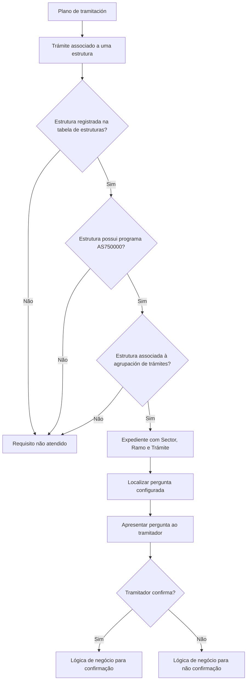

# Definição de Confirmação do Tramitador — Associação de Pergunta a Trâmite

## 1. Metadados do Documento
- **Arquivo de Origem:** `Não identificado`
- **Tipo de Documento:** `Especificação Técnica`
- **Domínio / Sistema:** `Reef / Reef.core / Gestão de trâmites e expedientes`
- **Público-Alvo:** `Analistas funcionais, desenvolvedores, arquitetos e operadores/tramitadores`
- **Data/Versão Identificada:** `Não identificada`

---

## 2. Resumo Executivo & Contexto de Negócio

O documento descreve a definição necessária para utilizar uma ferramenta acionada pelo plano de tramitação de **Confirmação de trâmites pelo tramitador**. A ferramenta associa uma pergunta a um trâmite, permitindo que o tramitador confirme ou negue uma condição antes que ações subsequentes sejam executadas no expediente.

O propósito funcional é introduzir uma etapa de validação humana em situações nas quais uma ação automática não deve ocorrer sem análise prévia. Entre os exemplos apresentados estão a revisão da situação da apólice, dos recibos, do tipo de cliente, da sinistralidade e das circunstâncias relacionadas ao expediente.

Um caso destacado é o de **Pérdida Total**: quando a perícia conclui perda total, o expediente de salvamento não deve ser aberto automaticamente e a perda não deve ser comunicada ao segurado até que o tramitador revise o tipo de cliente e as circunstâncias. Após a confirmação do tramitador, pode-se abrir automaticamente o expediente de salvamento e inserir no plano a comunicação ao segurado sobre a perda total.

A definição é parametrizada por **Sector**, **Ramo**, **Trámite**, **Panel** e **Pregunta**. Após a resposta à pergunta, a lógica de negócio pode executar qualquer ação previamente definida, dependendo de o tramitador confirmar ou não a condição consultada.

---

## 3. Arquitetura, Componentes & Tecnologias Envolvidas

Os componentes e conceitos explicitamente citados são:

- **Plano de tramitación:** origem da chamada à ferramenta de confirmação.
- **Ferramenta de Confirmação do Tramitador:** mecanismo que apresenta uma pergunta ao tramitador.
- **Expediente:** contexto no qual Sector, Ramo e Trámite determinam a pergunta aplicável.
- **Tramitador:** responsável por confirmar ou negar a pergunta.
- **Trámite:** item ao qual uma pergunta é associada.
- **Pergunta:** questão exibida ao tramitador para confirmação ou negação.
- **Lógica de negócio após confirmação:** ações definidas conforme a resposta do tramitador.
- **Tabela de estruturas:** contém a estrutura requerida para o funcionamento.
- **Programa `AS750000`:** deve estar associado à estrutura do trâmite.
- **Agrupación de trámites:** deve estar associada à estrutura.
- **Reef.core:** sistema no qual o atributo Panel era utilizado.



> **Nota de Análise:** O documento não detalha métodos HTTP, contratos JSON, persistência de respostas, nomes de tabelas além da “tabela de estruturas”, nem o mecanismo técnico de execução da lógica de negócio.

---

## 4. Regras de Negócio, Especificações Funcionais & Processos

### 4.1 Associação de pergunta a trâmite

A ferramenta deve ser configurada para associar uma pergunta a um trâmite. Quando um expediente possuir a combinação configurada de **Sector**, **Ramo** e **Trámite**, a pergunta correspondente será realizada ao tramitador.

A resposta do tramitador pode ser de confirmação ou não confirmação. A lógica posterior pode executar qualquer ação que tenha sido definida para cada resultado.

### 4.2 Uso de Sector genérico

O atributo **Sector** identifica a chave do sector dos expedientes aos quais será associado um trâmite que requer confirmação ou não confirmação pelo tramitador.

O uso do **sector genérico** indica que a ferramenta poderá ser executada independentemente do sector do expediente.

### 4.3 Uso de Ramo genérico

O atributo **Ramo** identifica a chave do ramo dos expedientes aos quais será associado um trâmite que requer confirmação ou não confirmação pelo tramitador.

O uso do **ramo genérico** indica que a ferramenta poderá ser utilizada independentemente do ramo do expediente.

### 4.4 Trâmite associado à pergunta

O atributo **Trámite** contém o código do trâmite ao qual será associada uma pergunta para que o tramitador confirme ou negue uma condição.

Exemplos apresentados:

1. Associar uma pergunta a um trâmite de **Pérdida Total** para o tramitador confirmar ou não a perda total.
2. Associar uma pergunta a um trâmite de revisão de recibos e da situação da apólice, para que o tramitador indique se tudo está correto.
3. Associar uma pergunta a um trâmite para confirmar o veículo de substituição.

### 4.5 Pergunta ao tramitador

O atributo **Pregunta** contém a pergunta apresentada ao tramitador quando um expediente possuir o Sector, o Ramo e o Trámite configurados.

Exemplos de perguntas:

- “¿Están todos los recibos en Orden?”
- “¿Se han recibido todos los documentos obligatorios?”
- “¿Se confirma la pérdida Total?”

### 4.6 Lógica após confirmação ou não confirmação

A lógica de negócio posterior pode realizar qualquer ação definida, dependendo da resposta do tramitador.

Exemplos apresentados:

| Resultado da pergunta | Ação de negócio exemplificada |
| :--- | :--- |
| O tramitador confirma a perda total | Inserir um trâmite para abrir um recobro de salvamento. |
| O tramitador não confirma que todos os documentos obrigatórios foram recebidos | Inserir um trâmite para gerar uma carta de solicitação dos documentos faltantes. |

### 4.7 Caso de negócio: confirmação de perda total

1. O resultado da perícia indica perda total.
2. O expediente de salvamento não deve ser aberto automaticamente.
3. A perda não deve ser comunicada ao segurado antes da revisão do tramitador.
4. O tramitador revisa tipo de cliente, circunstâncias e outros elementos pertinentes.
5. Caso o tramitador confirme a perda total:
   - o expediente de salvamento pode ser aberto automaticamente;
   - a comunicação ao segurado sobre Pérdida Total pode ser inserida no plano.

### 4.8 Requisitos obrigatórios de funcionamento

Para que a funcionalidade opere:

1. O trâmite deve possuir uma estrutura associada.
2. A estrutura deve estar registrada na tabela de estruturas.
3. A estrutura deve possuir o programa `AS750000` associado.
4. A estrutura deve estar associada à agrupación de trámites.

---

## 5. Tabelas de Parâmetros, Ambientes e Estruturas de Dados

| Item / Parâmetro | Descrição / Função | Tipo / Valores / Formato | Ambiente / Observações |
| :--- | :--- | :--- | :--- |
| Sector | Indica a chave do sector dos expedientes aos quais será associado um trâmite que requer confirmação ou não confirmação. | Chave de sector; exemplo apresentado: `9999`. | O sector genérico permite execução independentemente do sector do expediente. |
| Ramo | Indica a chave do ramo dos expedientes aos quais será associado um trâmite que requer confirmação ou não confirmação. | Chave de ramo; exemplo apresentado: `9999`. | O ramo genérico permite uso independentemente do ramo do expediente. |
| Trámite | Contém o código do trâmite ao qual será associada uma pergunta. | Códigos exemplificados: `T1`, `T4`, `T05`. | Pode representar comprovação de apólice, documentos ou confirmação de perda total. |
| Panel | Atributo utilizado somente em Reef.core. | Não detalhado. | O documento não especifica valores ou comportamento adicional. |
| Pregunta | Pergunta apresentada ao tramitador quando houver correspondência de Sector, Ramo e Trámite. | Texto de pergunta. | A resposta determina a lógica de negócio posterior. |
| Estrutura | Estrutura associada ao trâmite. | Registro na tabela de estruturas. | Requisito obrigatório para funcionamento. |
| Programa | Programa que deve estar associado à estrutura. | `AS750000`. | Requisito obrigatório para funcionamento. |
| Agrupación de trámites | Agrupamento ao qual a estrutura deve estar associada. | Não detalhado. | Requisito obrigatório para funcionamento. |
| Lógica de negócio após confirmação | Ações executadas após a resposta do tramitador. | Qualquer ação definida. | Pode diferir entre confirmação e não confirmação. |

### Configurações de perguntas exemplificadas

| Sector | Ramo | Trámite | Pergunta |
| :--- | :--- | :--- | :--- |
| `9999` / todos | `9999` / todos | `T1` — Comprobación de Póliza | ¿Están todos los recibos en Orden? |
| `9999` / todos | `9999` / todos | `T4` — Comprobación de Documentos | ¿Se han recibido todos los documentos obligatorios? |
| `9999` / todos | `9999` / todos | `T05` — Confirmación Pérdida Total | ¿Se confirma la pérdida Total? |

> **Nota de Análise:** A representação “9999 todos” e “9999 Todos” foi preservada conforme o conteúdo extraído. O documento não explica formalmente se `9999` é sempre o valor técnico do escopo genérico.

---

## 6. Bateria de Perguntas & Respostas para RAG (FAQ Sintético)

### P1: Qual é a finalidade da ferramenta de Confirmação do Tramitador?
**R:** A ferramenta permite associar uma pergunta a um trâmite para que o tramitador confirme ou negue uma condição antes da execução de ações de negócio subsequentes no expediente.

### P2: Quais atributos determinam qual pergunta será apresentada ao tramitador?
**R:** A pergunta é configurada para uma combinação de Sector, Ramo e Trámite. Quando um expediente possuir o Sector, o Ramo e o Trámite indicados na configuração, a pergunta associada deve ser realizada ao tramitador.

### P3: O que significa utilizar o sector genérico?
**R:** O sector genérico indica que a ferramenta poderá ser executada independentemente do sector do expediente.

### P4: O que significa utilizar o ramo genérico?
**R:** O ramo genérico indica que a ferramenta poderá ser utilizada independentemente do ramo do expediente.

### P5: O que acontece quando a perícia indica perda total?
**R:** O documento determina que o expediente de salvamento não deve ser aberto automaticamente e que a perda não deve ser comunicada ao segurado até que o tramitador revise o tipo de cliente, as circunstâncias e demais elementos pertinentes.

### P6: O que pode acontecer se o tramitador confirmar a perda total?
**R:** Caso o tramitador confirme a perda total, pode-se abrir automaticamente o expediente de salvamento e inserir no plano a comunicação ao segurado sobre Pérdida Total. Outro exemplo apresentado é inserir um trâmite para abrir um recobro de salvamento.

### P7: Qual ação pode ser executada quando o tramitador não confirma o recebimento de todos os documentos obrigatórios?
**R:** Pode ser inserido um trâmite para gerar uma carta destinada a reclamar ou solicitar os documentos faltantes.

### P8: Qual é o requisito de estrutura para que a funcionalidade opere?
**R:** O trâmite deve possuir uma estrutura associada, e essa estrutura deve estar registrada na tabela de estruturas.

### P9: Qual programa deve estar associado à estrutura do trâmite?
**R:** A estrutura associada ao trâmite deve possuir o programa `AS750000` associado.

### P10: Qual relação a estrutura deve possuir com a agrupación de trámites?
**R:** A estrutura deve estar associada à agrupación de trámites para que a funcionalidade opere.

### P11: Para que servia o atributo Panel?
**R:** O documento informa somente que o atributo Panel era utilizado em Reef.core. Não há detalhamento adicional sobre finalidade, valores ou regras de uso.

### P12: Quais exemplos de trâmites são apresentados para associação de perguntas?
**R:** São apresentados os trâmites `T1 Comprobación de Póliza`, `T4 Comprobación de Documentos` e `T05 Confirmación Pérdida Total`.

---

## 7. Glossário de Termos, Siglas & Conceitos-Chave

- **AS750000:** Programa que deve estar associado à estrutura do trâmite para que a funcionalidade opere.
- **Expediente:** Entidade de negócio à qual se aplicam Sector, Ramo e Trámite no fluxo de confirmação.
- **Lógica de negócio depois de confirmação:** Conjunto de ações definidas para execução após a confirmação ou não confirmação da pergunta pelo tramitador.
- **Panel:** Atributo que, segundo o documento, era utilizado somente em Reef.core.
- **Pérdida Total:** Situação em que o resultado da perícia indica perda total e requer confirmação do tramitador antes de determinadas ações.
- **Pregunta:** Pergunta apresentada ao tramitador para confirmação ou negação.
- **Ramo:** Chave que identifica o ramo dos expedientes aos quais se aplica a associação entre trâmite e pergunta.
- **Reef.core:** Sistema citado como o local em que o atributo Panel era utilizado.
- **Recobro de salvamento:** Ação exemplificada para ser inserida após a confirmação de perda total.
- **Sector:** Chave que identifica o sector dos expedientes aos quais se aplica a associação entre trâmite e pergunta.
- **Tramitador:** Responsável por avaliar e confirmar ou não a pergunta associada ao trâmite.
- **Trámite:** Código ou item do plano de tramitação ao qual uma pergunta pode ser associada.

---

## 8. Notas Críticas, Riscos & Limitações

- O documento não identifica o nome do arquivo de origem, data, versão, autor técnico ou histórico de alterações.
- O documento não detalha contratos técnicos, serviços, APIs, métodos HTTP, estruturas JSON, esquemas de banco de dados ou mecanismos de persistência das respostas.
- A lógica de negócio pós-confirmação é descrita como capaz de realizar “qualquer ação que se defina”, mas não há catálogo de ações, regras de configuração, tratamento de erros ou critérios de idempotência.
- O atributo **Panel** é citado apenas como usado em Reef.core; não há explicação funcional adicional.
- A semântica técnica dos valores genéricos `9999` e “todos” não é formalmente especificada, embora apareça na tabela de exemplos.
- A funcionalidade depende de requisitos de cadastro: estrutura associada ao trâmite, registro na tabela de estruturas, programa `AS750000` associado e associação à agrupación de trámites.
- Não há detalhamento sobre permissões, auditoria, trilha de decisão do tramitador, prazo de resposta, reprocessamento ou comportamento em caso de ausência de configuração.

---

## 9. Conteúdo Bruto Estruturado (Referência Fiel)

```text
--- [PÁGINA 1 DE 3] ---

DEFINICIÓN Confirmación del Tramitador - Asociar Pregunta a
Trámite

Objetivo

La finalidad de este documento es conocer qué se necesita definir, para que funcione la herramienta llamada desde el Plan de tramitación de
Confirmación de trámites por el tramitador.

Ejemplo:

En la compañía, se define que el tramitador antes de realizar cualquier trámite, revise el estado de la póliza, el tipo de cliente, la
siniestralidad del cliente, etc, para ello se puede definir un trámite donde el tramitador confirme que el recibo y la póliza estén correctas y
haga las observaciones pertinentes.

Se necesita que cuando el resultado de la peritación sea pérdida total, no se abra automáticamente el expediente de salvamento, ni se
comunique la pérdida al asegurado, hasta que el tramitador no revise el tipo de cliente, las circunstancias.... Para cubrir esta necesidad,
se puede definir un trámite para que el tramitador confirme o no la pérdida total después de llegar el resultado de la peritación. Si
confirma la pérdida total que se abra automáticamente el expediente de salvamento y se inserte en el plan la comunicación al asegurado
de Pérdida Total.

Etc.

Imagen del Mantenimiento Definición de la Confirmación del Tramitador:

Documentation / DOCUMENTACIÓN Reef
DOCUMENTACIÓN Reef
Mapfredocument
DOCUMENTACIÓN Reef
Owner
user:agonzalez_mapfre.com
Lifecycle
Approved Source
/
VL
Buscar Inicio Soluciones Arquitecturas APIs Componentes Cloud Documentación Zeus Reef Ayuda
ES

--- [PÁGINA 2 DE 3] ---

Propiedades

Sector

Este atributo indica la clave del Sector de los expedientes a los que se les va a asociar un trámite que va a requerir la confirmación o no del
tramitador.

Puede utilizarse el sector genérico que indicará que la herramienta podrá ejecutarse independientemente del sector del expediente.

Ramo

Este atributo indica la clave del Ramo de los expedientes a los que se les va asociar un trámite que va a requerir la confirmación o no del
tramitador.

Puede utilizarse el ramo genérico que indicará que se podrá utilizar independientemente del ramo del expediente.

Trámite

Este atributo contendrá el código del trámite al cual se le va a asociar una pregunta para que el tramitador confirme o no.

Por ejemplo:

Se puede asociar una pregunta a un trámite de Pérdida Total para que el tramitador confirme o no la pérdida total.

Se puede asociar una pregunta a un trámite para revisar los recibos y la situación de la póliza para que indique si todo está correcto.

Se puede asociar una pregunta a un trámite para confirmar el vehículo de sustitución.

Etc.

Panel

Este atributo sólo se usaba en Reef.core

Pregunta

Este atributo contendrá la pregunta que se le va a realizar al tramitador cuando un expediente tenga el sector, el ramo y el trámite arriba
indicado.

Ejemplo:

--- [PÁGINA 3 DE 3] ---

SECTOR RAMO TRAMITE PREGUNTA

9999 todos 9999 Todos T1 Comprobación de Póliza ¿Están todos los recibos en Orden?
T4 Comprobación de Documentos ¿Se han recibido todos los documentos obligatorios?
T05 Confirmación Pérdida Total ¿Se confirma la pérdida Total?

Lógica de negocio después de confirmación

Aquí se albergará una lógica de negocio que puede realizar cualquier acción que se defina, dependiendo de si el tramitador Confirma o No la
pregunta.

Ejemplo:
- Si se confirma la pérdida total puede insertar un trámite para aperturar un recobro de salvamento.
- Si NO confirma que están todos los documentos obligatorio puede insertar un trámite para generar una carta para reclamar los
documentos faltantes.

Preguntas frecuentes

¿ Hay algún requisito para que esto funcione?

Sí, el trámite tiene que tener asociado una estructura, que esté registrada en la tabla de estructuras. Esa estructura tiene que tener el
programa AS750000 asociado. Esta estructura tiene que estar asociada a la agrupación de trámites.
```
