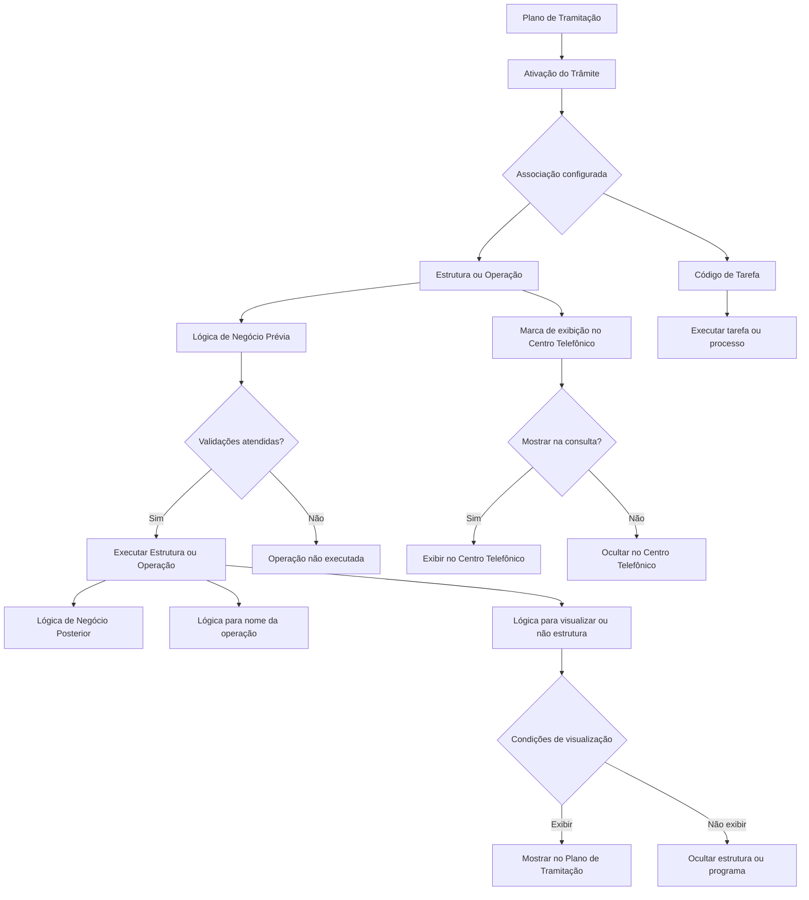

# Definição: Associar Estruturas e Operações a um Trâmite no Plano de Tramitação Reef

## 1. Metadados do Documento
- **Arquivo de Origem:** Não identificado no conteúdo extraído
- **Tipo de Documento:** Especificação Técnica / Documentação Funcional
- **Domínio / Sistema:** Reef / Plano de Tramitação / Mapfre
- **Público-Alvo:** Desenvolvedores, Arquitetos, Analistas Funcionais e Operação
- **Data/Versão Identificada:** Não identificada

---

## 2. Resumo Executivo & Contexto de Negócio

O documento descreve a configuração que associa estruturas de informação, operações e tarefas a um **trâmite** no Plano de Tramitação do sistema Reef. A associação define quais informações podem ser solicitadas, quais operações podem ser executadas e quais tarefas podem ser disparadas quando um trâmite é ativado ou quando o programa associado é executado.

A configuração permite controlar a ordem de apresentação e execução das operações, além de aplicar lógicas de negócio antes e depois de cada operação. Essas lógicas permitem validar pré-condições, realizar verificações posteriores e alterar dinamicamente o comportamento operacional conforme o contexto do trâmite.

O documento também estabelece controles de visibilidade. Uma estrutura ou operação pode ser exibida ou ocultada na consulta do Centro Telefônico, e pode ser visualizada ou não conforme condições definidas por lógica de negócio. Esses controles são relevantes para impedir a exposição indevida de informações, como dados relacionados a fraude.

A associação suporta reutilização: uma mesma estrutura ou código de programa pode ser associado a múltiplos trâmites. Também é possível alterar a descrição exibida da operação para aumentar a clareza para o tramitador, sem necessariamente alterar o nome original do programa ou da estrutura.

---

## 3. Arquitetura, Componentes & Tecnologias Envolvidas

Os elementos funcionais identificados são:

- **Reef:** Sistema no qual são configuradas estruturas, operações, tarefas e o Plano de Tramitação.
- **Plano de Tramitação:** Mecanismo que ativa trâmites e disponibiliza estruturas, operações, programas ou tarefas associadas.
- **Trâmite:** Entidade identificada por uma chave existente no nível de companhia.
- **Estrutura/Operação:** Estrutura de informação ou operação previamente cadastrada como Estrutura e associada a uma Agrupação de Estruturas permitida para o Plano de Tramitação.
- **Agrupação de Estruturas:** Agrupamento que contém as estruturas elegíveis para associação a um trâmite.
- **Lógica de Negócio Prévia:** Lógica executada antes da operação associada.
- **Lógica de Negócio Posterior:** Lógica executada após a operação associada.
- **Lógica para mostrar nome da operação:** Lógica que altera a descrição apresentada da operação no Plano de Tramitação.
- **Lógica para visualizar ou não a Estrutura:** Lógica condicional que determina se uma estrutura ou programa será mostrado.
- **Centro Telefônico:** Consulta específica que pode ou não exibir a estrutura ou operação vinculada ao trâmite.
- **Código de Tarefa:** Código de tarefa ou processo previamente definido no nível de companhia.
- **Consulta de Atributos:** Indicação de que a estrutura ou operação executável constitui uma consulta de atributos.
- **Inabilitado:** Propriedade que define se a operação vinculada ao trâmite pode ser executada.



> **Nota de Análise:** O documento menciona instalações que convivem com Reef.core e Reef.core, mas não detalha versões, diferenças técnicas, métodos de integração ou critérios concretos utilizados pela lógica de visualização.

---

## 4. Regras de Negócio, Especificações Funcionais & Processos

### 4.1 Finalidade da associação

Para cada trâmite que necessite, deve ser definida a informação a ser solicitada ou a operação — inclusive múltiplas operações — que poderá ser executada quando o trâmite for ativado a partir do Plano de Tramitação.

Os exemplos explicitamente apresentados incluem:

- Confirmação de perda total.
- Modificação de dados do expediente.
- Modificação da avaliação.
- Solicitação e registro da documentação do expediente.
- Geração de uma liquidação ou ordem de pagamento.

### 4.2 Requisitos para o Trâmite

A propriedade **Trâmite** deve conter a chave do trâmite ao qual será associada uma estrutura, operação ou tarefa.

A chave de trâmite deve existir no nível de companhia.

### 4.3 Requisitos para Estrutura/Operação

A propriedade **Estrutura/Operação** deve conter a chave da operação a ser executada quando:

1. O trâmite for ativado; ou
2. O programa associado for executado.

A estrutura de informação ou operação deve:

1. Estar cadastrada como uma Estrutura.
2. Estar associada à Agrupação de Estruturas que pode ser vinculada a um trâmite do Plano de Tramitação.

### 4.4 Ordem da Estrutura/Operação no Trâmite

A propriedade **Ordem da Estrutura/Operação dentro do Trâmite** determina a sequência em que as operações serão mostradas quando o trâmite for ativado.

A ordenação é aplicável quando:

- Há mais de uma operação definida para o mesmo trâmite.
- Os programas associados são executados.

No exemplo documentado, o trâmite `L002 Liquidaciones` possui duas operações:

1. `Cambio de Valoración`
2. `Liquidación de Expediente`

### 4.5 Lógica de Negócio Prévia à execução

A lógica de negócio prévia pode realizar controles ou verificações antes de executar a operação associada ao trâmite.

Regras de execução da lógica prévia:

1. A lógica deve ser executada sempre que a operação for executada.
2. Quando o trâmite estiver pendente e for escolhida a opção de executar novamente a estrutura ou programa, a lógica prévia deve ser executada novamente.
3. Cada operação vinculada a um mesmo trâmite pode ter validações distintas.

O exemplo fornecido estabelece a seguinte dependência:

- Uma liquidação não pode ser realizada antes de uma alteração de avaliação.
- Ao tentar realizar a liquidação, deve ser verificado se ocorreu uma alteração de avaliação.
- A validação é executada sempre que a operação de liquidação for executada.

### 4.6 Lógica de Negócio Posterior à execução

A lógica de negócio posterior pode realizar controles ou verificações após a execução da operação associada ao trâmite.

Regra de execução:

- A lógica posterior deve ser executada toda vez que a operação for executada.

Exemplo apresentado:

- Após uma liquidação, pode ser gerado automaticamente um aviso ao tramitador.
- O aviso deve ser gerado apenas quando a liquidação corresponder a um reembolso ao segurado.
- O objetivo do aviso é revisar se o segurado assinou o finiquito.

### 4.7 Exibição na Consulta do Centro Telefônico

A propriedade **Se mostra en la Consulta del Centro Telefónico** contém uma marca que indica à consulta específica do Centro Telefônico se a estrutura de informação ou operação associada ao trâmite deve ser apresentada.

Exemplo de regra de confidencialidade:

- Se um trâmite possuir uma estrutura de informação que coleta dados de fraude, a estrutura pode ser marcada para não aparecer na consulta.
- O objetivo é evitar informar indevidamente ao segurado que existe avaliação de possível fraude.

### 4.8 Lógica para apresentação do nome da operação

A lógica para mostrar o nome da operação permite modificar o nome exibido no Plano de Tramitação, oferecendo maior clareza ao tramitador.

Casos documentados:

1. Uma operação de confirmação do tramitador pode ser associada a múltiplos trâmites.
2. Cada trâmite pode exigir que o tramitador revise e confirme pontos distintos da tramitação.
3. Uma lógica de negócio de núcleo pode definir descrições diferentes para o mesmo programa conforme o trâmite ao qual a estrutura estiver associada.
4. A operação de liquidação de expedientes pode ser apresentada com uma descrição contextualizada, como:
   - `Liquidación al Asegurado`
   - `Liquidación al Taller`

### 4.9 Código de Tarefa

A propriedade **Código de Tarea** pode conter um código de tarefa ou processo.

Ao ativar um trâmite, pode ser executada:

- Uma operação localizada no atributo Estrutura/Operação; ou
- Uma tarefa identificada pelo Código de Tarefa.

As tarefas devem estar previamente definidas no nível de companhia.

Exemplos de tarefas mencionadas:

- Movimentos Batch.
- Movimentos automáticos.
- Abertura de expediente de recobro em caso de perda total.
- Tarefa que altera automaticamente a avaliação com o resultado da peritagem.

### 4.10 Lógica para visualizar ou não a Estrutura

A lógica para visualizar ou não a estrutura determina condicionalmente se uma estrutura será apresentada.

O documento informa que essa lógica foi utilizada em instalações nas quais convivem Reef.core e Reef.core, com estruturas diferentes para cada sistema. Dependendo do local onde o Plano de Tramitação estiver sendo executado, a estrutura ou o programa é mostrado ou ocultado.

### 4.11 Consulta de Atributos

O Plano de Tramitação precisa identificar se a estrutura ou operação que pode ser executada consiste em uma consulta de atributos.

### 4.12 Operação inabilitada

A propriedade **Inhabilitado** define se a operação associada ao trâmite está habilitada.

Regra:

- Se a operação estiver inabilitada, ela não poderá ser executada.

### 4.13 Reutilização de estruturas e programas

Uma Estrutura ou Código de Programa pode ser associado a vários trâmites.

### 4.14 Alteração de descrição da operação

A descrição gravada ou exibida ao ativar uma Estrutura ou executar programas associados pode ser modificada por meio da lógica de negócio de descrição da Estrutura.

---

## 5. Tabelas de Parâmetros, Ambientes e Estruturas de Dados

| Item / Parâmetro | Descrição / Função | Tipo / Valores / Formato | Ambiente / Observações |
| :--- | :--- | :--- | :--- |
| Trâmite | Contém a chave do trâmite ao qual a estrutura, operação ou tarefa será associada. | Chave de trâmite | Deve existir no nível de companhia. |
| Estrutura/Operação | Contém a chave da estrutura de informação ou operação a executar. | Chave de operação ou estrutura | A estrutura deve estar cadastrada como Estrutura e associada à Agrupação de Estruturas permitida. |
| Ordem da Estrutura/Operação dentro do Trâmite | Define a ordem de apresentação das operações no trâmite. | Ordem numérica | Aplicável quando há múltiplas operações ou programas associados. |
| Lógica de Negócio Prévia | Executa controles ou validações antes da operação. | Lógica de negócio | Executada em toda execução e reexecução de estrutura ou programa pendente. |
| Lógica de Negócio Posterior | Executa controles ou validações após a operação. | Lógica de negócio | Executada toda vez que a operação for executada. |
| Marca de exibição no Centro Telefônico | Define se estrutura ou operação será exibida na consulta do Centro Telefônico. | Marca de exibição | Pode ser usada para ocultar informações de fraude. |
| Lógica para mostrar nome da operação | Modifica a descrição exibida da operação no Plano de Tramitação. | Lógica de negócio | Permite contextualizar a descrição conforme o trâmite. |
| Código de Tarefa | Define uma tarefa ou processo a executar na ativação do trâmite. | Código de tarefa ou processo | A tarefa deve ser previamente definida no nível de companhia. |
| Lógica para visualizar ou não a Estrutura | Define, conforme condições, se a estrutura ou programa será mostrado. | Lógica de negócio | Utilizada para cenários com estruturas diferentes entre sistemas Reef.core citados. |
| Consulta de Atributos | Indica que a estrutura ou operação executável é uma consulta de atributos. | Indicador | Necessário para o Plano de Tramitação identificar a natureza da estrutura/operação. |
| Inhabilitado | Indica se a operação associada ao trâmite está habilitada para execução. | Indicador de habilitação | Operações inabilitadas não podem ser executadas. |
| L002 Liquidaciones | Trâmite usado como exemplo de associação de operações. | Código e descrição de trâmite | Possui operações ordenadas no exemplo. |
| Cambio de Valoración | Operação de alteração de avaliação. | Operação | Exibida como ordem 1 no exemplo. |
| Liquidación de Expediente | Operação de liquidação de expediente. | Operação | Exibida como ordem 2 no exemplo; requer validação prévia de alteração de avaliação. |

---

## 6. Bateria de Perguntas & Respostas para RAG (FAQ Sintético)

### P1: Qual é a finalidade de associar estruturas e operações a um trâmite no Plano de Tramitação?
**R:** A associação permite definir, para cada trâmite que necessite, quais informações serão solicitadas e quais operações poderão ser executadas quando o trâmite for ativado a partir do Plano de Tramitação ou quando o programa associado for executado.

### P2: Quais condições uma chave de trâmite deve atender para ser utilizada na associação?
**R:** A chave informada na propriedade Trâmite deve existir no nível de companhia. Essa chave identifica o trâmite ao qual a estrutura, operação ou tarefa será associada.

### P3: O que é necessário para associar uma estrutura ou operação a um trâmite?
**R:** A estrutura de informação ou operação deve estar cadastrada como uma Estrutura e deve estar associada à Agrupação de Estruturas que pode ser vinculada a um trâmite do Plano de Tramitação.

### P4: Como é definida a sequência de operações associadas a um mesmo trâmite?
**R:** A sequência é definida pela propriedade Ordem da Estrutura/Operação dentro do Trâmite. Essa propriedade estabelece a ordem em que as operações serão apresentadas quando houver mais de uma operação definida ou quando forem executados programas associados.

### P5: Quando a lógica de negócio prévia é executada?
**R:** A lógica de negócio prévia é executada antes de cada execução da operação associada ao trâmite. Se o trâmite estiver pendente e for escolhida a opção de executar novamente a estrutura ou programa, a lógica prévia também será executada novamente.

### P6: É possível impedir uma liquidação até que uma condição anterior seja atendida?
**R:** Sim. O documento apresenta o exemplo no qual uma liquidação não pode ser realizada se antes não houve alteração de avaliação. Ao tentar executar a liquidação, a lógica prévia deve verificar se ocorreu a alteração de avaliação.

### P7: Para que serve a lógica de negócio posterior à operação?
**R:** A lógica posterior permite realizar controles ou verificações depois que a operação é executada. Um exemplo é gerar automaticamente um aviso ao tramitador após uma liquidação que represente reembolso ao segurado, para verificar se o finiquito foi assinado.

### P8: Como impedir que dados sensíveis sejam exibidos ao Centro Telefônico?
**R:** A propriedade de exibição na Consulta do Centro Telefônico deve indicar que a estrutura ou operação não deve ser mostrada. O documento cita como exemplo a ocultação de estruturas que coletam dados de fraude, para evitar que o segurado seja informado indevidamente sobre uma possível avaliação de fraude.

### P9: Uma mesma estrutura ou código de programa pode ser associado a vários trâmites?
**R:** Sim. O documento afirma que Estruturas podem ser associadas a vários trâmites.

### P10: Como alterar o nome exibido de uma operação no Plano de Tramitação?
**R:** Deve-se utilizar a lógica para mostrar o nome da operação, também mencionada como lógica de negócio de descrição da Estrutura. Essa lógica permite apresentar descrições diferentes conforme o trâmite, como `Liquidación al Asegurado` ou `Liquidación al Taller`.

### P11: O que pode ser configurado no Código de Tarefa?
**R:** O Código de Tarefa pode identificar uma tarefa ou processo executado na ativação do trâmite. O documento cita movimentos Batch, movimentos automáticos, abertura de expediente de recobro por perda total e alteração automática da avaliação com o resultado da peritagem. A tarefa deve existir previamente no nível de companhia.

### P12: O que acontece quando uma operação está marcada como inabilitada?
**R:** Quando a propriedade Inhabilitado indica que a operação associada ao trâmite não está habilitada, essa operação não poderá ser executada.

---

## 7. Glossário de Termos, Siglas & Conceitos-Chave

- **Agrupação de Estruturas:** Agrupamento ao qual uma Estrutura deve estar associada para poder ser vinculada a um trâmite do Plano de Tramitação.
- **Centro Telefônico:** Consulta específica na qual uma estrutura ou operação associada a um trâmite pode ser mostrada ou ocultada.
- **Código de Tarefa:** Código de uma tarefa ou processo previamente definido no nível de companhia.
- **Consulta de Atributos:** Indicação de que a estrutura ou operação executável corresponde a uma consulta de atributos.
- **Estrutura:** Estrutura de informação previamente cadastrada que pode ser associada a um trâmite.
- **Estrutura/Operação:** Propriedade que identifica a estrutura de informação ou a operação a executar.
- **Expediente:** Termo utilizado no documento para o registro ou caso sujeito a alteração, documentação, avaliação, liquidação ou recobro.
- **Finiquito:** Documento cuja assinatura pode necessitar de revisão após uma liquidação de reembolso ao segurado.
- **Inhabilitado:** Indicador que determina que uma operação não pode ser executada.
- **Lógica de Negócio Prévia:** Lógica executada antes da operação para aplicar controles ou verificações.
- **Lógica de Negócio Posterior:** Lógica executada após a operação para aplicar controles ou verificações.
- **Plano de Tramitação:** Componente que ativa trâmites e executa estruturas, operações, programas ou tarefas associadas.
- **Reef:** Sistema citado no documento como contexto da configuração.
- **Reef.core:** Nome citado para instalações que possuem estruturas distintas entre sistemas; o documento não detalha tecnicamente esses sistemas.
- **Trâmite:** Entidade identificada por chave, à qual estruturas, operações ou tarefas podem ser associadas.

---

## 8. Notas Críticas, Riscos & Limitações

- A chave do trâmite e o Código de Tarefa dependem de prévia definição no nível de companhia.
- Uma estrutura ou operação não pode ser vinculada livremente: ela deve estar cadastrada como Estrutura e pertencer à Agrupação de Estruturas elegível para o Plano de Tramitação.
- A ordem de operações pode afetar regras de dependência funcional. No exemplo documentado, a liquidação depende de uma alteração prévia de avaliação.
- A lógica prévia é reexecutada em reexecuções de estruturas ou programas quando o trâmite estiver pendente; implementações devem considerar esse comportamento recorrente.
- A visibilidade no Centro Telefônico deve ser configurada com atenção para evitar exposição de dados sensíveis, como informações relacionadas a fraude.
- Operações marcadas como inabilitadas não podem ser executadas.
- O documento cita coexistência de Reef.core e Reef.core, mas não esclarece versões, arquitetura, critérios de identificação do sistema ou detalhes da lógica de visualização.
- O documento não especifica contratos técnicos, interfaces, métodos HTTP, esquemas de dados, URLs, tecnologias de persistência, permissões de usuário ou mecanismos de auditoria.

---

## 9. Conteúdo Bruto Estruturado (Referência Fiel)

```text
--- [PÁGINA 1 DE 4] ---

DEFINICIÓN ASOCIAR Estructuras - Operaciones a un Trámite
Objetivo
La finalidad es definir para cada trámite que así lo necesite, la información que va a solicitar o la operación u operaciones que se van poder ejecutar, cuando se active dicho trámite desde el Plan de Tramitación.
Ejemplos:
Confirmación de Pérdida Total
Modificar Datos del Expediente
Modificar la Valoración
Solicitar y Registrar la Documentación del Expediente
Generar una liquidación (orden de pago)
Etc.
Imagen de la Asociación de Estructuras/Operaciones a un Trámite:
Documentation / DOCUMENTACIÓN Reef
DOCUMENTACIÓN Reef
Mapfredocument
DOCUMENTACIÓN Reef
Owner
user:agonzalez_mapfre.com
Lifecycle
Approved Source
 /
VL
Buscar Inicio Soluciones Arquitecturas APIs Componentes Cloud Documentación Zeus Reef Ayuda
ES

--- [PÁGINA 2 DE 4] ---

Propiedades
Trámite
Esta propiedad contendrá la clave del trámite al cual se le va a asociar la estructura u operación que se va a poder ejecutar cuando se active el trámite o se ejecute el programa asociado.
Esta clave de trámite tiene que existir a nivel de compañía.

Estructura/Operación
Esta propiedad contendrá la clave de la operación que se quiere ejecutar cuando se active el trámite o se ejecute el programa asociado. Esta estructura de información/operación tiene que estar dada de alta como una Estructura y asociada a la Agrupación de estructuras que se puede asociar a un trámite del plan de tramitación.

Orden de la Estructura/Operación dentro del Trámite
Esta propiedad va a contener el orden en el que se va a mostrar las operaciones que se pueden ejecutar cuando se active el trámite, en el caso de que haya más de una operación definida o cuando se ejecuten los programas asociados.

TRÁMITE OPERACIÓN ORDEN
L002 Liquidaciones 1 Cambio de Valoración 1
2 Liquidación de Expediente 2

Lógica de Negocio Previa a ejecutar la operación
Esta Lógica de negocio tendrá posibilidad de hacer controles o verificaciones antes de ejecutar la operación asociada al trámite. Esta Lógica, se lanzará cada vez que se ejecute la operación. Cuando el trámite esté pendiente y se elija la opción de volver a ejecutar la estructura o programa, esta lógica de negocio se volverá a ejecutar.

Ejemplo:
En el ejemplo anterior en que se han definido dos operaciones asociadas al trámite, el cambio de valoración y la liquidación, en cada uno de ellos se va a poder ejecutar una validación o comprobación distinta. Cada vez que se ejecute esa operación se volverá a comprobar. No se puede realizar una liquidación, si primero no se ha cambiado la valoración. Cuando se vaya a intentar realizar una liquidación, se comprobará que haya un cambio de valoración.

--- [PÁGINA 3 DE 4] ---

Lógica de Negocio Posterior a ejecutar la operación
Esta Lógica de negocio tendrá posibilidad de hacer controles o verificaciones después de ejecutar la operación asociada al trámite. Esta Lógica, se lanzará cada vez que se ejecute la operación.

Ejemplo:
Si después de las liquidaciones se quiere generar automáticamente un aviso al tramitador sólo en el caso de que la liquidación sea un reembolso al asegurado, para revisar que firmó el finiquito.

Se muestra en la Consulta del Centro Telefónico
Esta propiedad contiene una marca que le indica a la consulta que hay específica para el centro telefónico, si se muestra o no la estructura de información u operación que se está asociando al trámite.

Ejemplo:
Si el trámite tiene una estructura de información que recoge datos de fraude, se le puede indicar que esta no se muestre en la consulta, para que no se informe al asegurado por error, que se está evaluando un posible fraude.

Lógica para mostrar el nombre de la operación
Esta lógica sirve para poder modificar el nombre de la operación que se ejecuta en el plan de tramitación, dando una mayor claridad.

Ejemplos
En el plan de tramitación se ha asociado una operación de confirmación del tramitador a varios trámites distintos. Se quiere que el tramitador revise y confirme diferentes puntos de la tramitación. Si el nombre del programa no se modificara cuando se ejecute dicho trámite esto es lo que se vería:

En este caso en esta propiedad se ha puesto una lógica de negocio de núcleo, a cada trámite que tiene asociado esta estructura. Según al trámite al que esté asociado, la descripción del programa será distinta.

--- [PÁGINA 4 DE 4] ---

Otro ejemplo sería si se asocia la operación de liquidación de expedientes a varios trámites, para mayor claridad se puede modificar el texto para que en vez de aparecer "Liquidación de Expedientes", aparezca a quien se le realiza la Liquidación, ejemplo "Liquidación al Asegurado" (cuando se liquide al Asegurado), "Liquidación al Taller" (cuando se liquide al Taller), etc.

Código de Tarea
Esta propiedad puede contener un código de tarea, proceso. Cuando se activa un trámite se puede ejecutar una operación (que se ubicará en el atributo estructura u operación) o se puede ejecutar una tarea. Estas tareas pueden ser movimientos Batch, movimientos automáticos como por ejemplo aperturar un expediente de recobro, en el caso de ser una pérdida total, una tarea que cambie la valoración automáticamente con el resultado de la peritación etc. La tarea tiene que estar definida previamente a nivel de compañía tarea.

Lógica para visualizar o No la Estructura
Esta lógica de negocio se utiliza para visualizar o no una estructura dependiendo de las condiciones que se necesiten.

Ejemplo:
Esto se ha utilizado en instalaciones que conviven Reef.core y Reef.core y tienen diferentes estructuras para un sistema u otro, según donde se esté ejecutando el plan muestra o no la estructura o programa.

Consulta de Atributos
El plan de tramitación necesita saber si la estructura u operación que se puede ejecutar, es una consulta de atributos.

Inhabilitado
Esta propiedad indica si la operación que está asociado al Trámite está habilitado o no. Si no está habilitada no se podrá ejecutar.

Preguntas frecuentes
¿Un Código de Programa, de Estructura pueden ser asociado a varios Trámites?
Si, las Estructuras pueden ser asociados a varios trámites.

¿Se puede cambiar la descripción de la operación que se grabe al activar la Estructura o cuando se ejecuten los programas asociados?
Si, para ello se tiene la Lógica Negocio descripción de la Estructura

¿Se puede ejecutar un listado, una tarea ya definida?
Si para ello se tiene el atributo Código de Tarea

¿Si tengo diferentes programas en Reef.core que en Reef.core qué puedo hacer para que en cada Sistema sólo me salgan las que tengo definidas para ese sistema?
Para poder solucionar esto, se tiene un atributo para indicarle al plan de tramitación si se muestra o no se muestra el programa, se muestra la estructura
```
