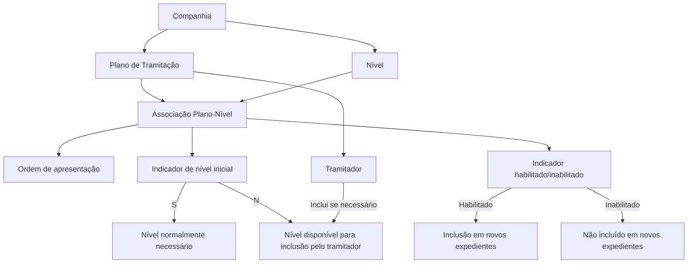

# Associação de Níveis a Planos de Tramitação — Definição Funcional

## 1. Metadados do Documento
- **Arquivo de Origem:** Não identificado no conteúdo fornecido
- **Tipo de Documento:** Especificação Técnica / Procedimento Funcional
- **Domínio / Sistema:** Reef — Planos de Tramitação de Expedientes
- **Público-Alvo:** Analistas funcionais, desenvolvedores, equipas de negócio e tramitadores
- **Data/Versão Identificada:** Não identificada

---

## 2. Resumo Executivo & Contexto de Negócio

O documento define o processo de associação de níveis a um Plano de Tramitação no contexto de gestão de expedientes. Um nível representa uma agrupação de trâmites da mesma natureza, como documentação, peritação ou juízos. A associação permite estruturar as etapas disponíveis para o tratamento de um expediente.

Associar um nível a um Plano de Tramitação não torna a execução desse nível obrigatória. A associação disponibiliza o nível para utilização quando necessário. Esta regra permite que planos de tramitação suportem tanto o fluxo habitual quanto situações excecionais sem exigir a execução de todos os níveis associados.

O exemplo principal refere-se ao plano `PL002 - Plan Cristales Autos`, destinado a expedientes de danos próprios relacionados com vidros de automóveis, incluindo lua, vidro dianteiro ou para-brisas. Nesse cenário, a peritação pode estar configurada no plano, embora não seja normalmente necessária, pois existem locais concertados para reparação e a companhia tende a pagar diretamente ao fornecedor.

O documento estabelece propriedades para a associação: código do Plano de Tramitação, código do nível, ordem de apresentação dentro do plano, indicação de nível inicial e estado de habilitação. Os códigos de plano e nível devem existir previamente ao nível de companhia.

A configuração influencia os novos expedientes: níveis habilitados podem ser incluídos em novos expedientes; níveis inabilitados não são incluídos. Níveis marcados como iniciais representam aqueles normalmente necessários para tramitar determinado tipo de expediente, enquanto níveis não iniciais podem ser adicionados pelo tramitador quando a situação exigir.

---

## 3. Arquitetura, Componentes & Tecnologias Envolvidas

### Componentes e conceitos identificados

| Componente / Conceito | Função no contexto documentado |
| :--- | :--- |
| Reef | Contexto documental e sistema referido pela interface de documentação. |
| Plano de Tramitação | Entidade que organiza os níveis disponíveis para o tratamento de um expediente. |
| Nível | Agrupação de trâmites de uma mesma natureza. |
| Tramitador | Utilizador que atua dentro do Plano de Tramitação e pode incluir níveis não iniciais quando necessário. |
| Expediente | Caso tratado através de um Plano de Tramitação. |
| Companhia | Escopo no qual os códigos de Plano de Tramitação e de Nível devem existir. |
| Nível de Documentação | Exemplo de agrupação de trâmites relacionados com documentação. |
| Nível de Peritação | Exemplo de agrupação de trâmites necessários para realizar uma peritação. |
| Nível de Pago a Proveedor | Nível associado ao pagamento direto ao fornecedor. |
| Nível de Reembolso Asegurado | Nível associado ao reembolso ao segurado. |



**Nota de Análise:** O documento não detalha arquitetura técnica de software, APIs, métodos HTTP, contratos JSON, persistência de dados, tecnologias de integração ou ambientes de execução.

---

## 4. Regras de Negócio, Especificações Funcionais & Processos

### 4.1 Definição de nível

1. Um nível corresponde à agrupação de trâmites da mesma natureza.
2. O documento apresenta como exemplos:
   - Nível de Documentação;
   - Nível de Peritação;
   - Nível de Juízos.
3. Um Plano de Tramitação pode possuir vários níveis associados.
4. A associação de um nível a um plano disponibiliza a possibilidade de executar os trâmites daquele nível quando necessário.
5. A associação de um nível a um plano não implica obrigatoriedade de realização do nível.

### 4.2 Pré-requisitos de associação

1. A chave do Plano de Tramitação deve existir ao nível de companhia.
2. O código ou chave do nível deve existir ao nível de companhia.
3. Apenas depois de ambos os elementos existirem ao nível de companhia o nível pode ser associado ao Plano de Tramitação.

### 4.3 Ordem de apresentação dos níveis

1. Cada associação entre Plano de Tramitação e Nível possui uma ordem.
2. A ordem determina a posição em que o nível aparece para o tramitador dentro do Plano de Tramitação.
3. O documento exemplifica o plano `PL002`, no qual os níveis são apresentados nas posições de 1 a 5.
4. A ordem é específica da associação do nível com o plano.

### 4.4 Regra de nível inicial

1. Níveis iniciais são os níveis normalmente necessários para tratar determinado tipo de expediente.
2. Quando um nível é necessário apenas em poucas ocasiões ou é excecional, o nível deve ser configurado para não aparecer inicialmente.
3. Um nível não inicial permanece disponível no plano.
4. O tramitador pode incluir um nível não inicial no plano do expediente quando necessário.
5. No cenário de cristais de automóveis:
   - a peritação não é normalmente necessária;
   - existem locais concertados para reparação de cristais, para-brisas ou luas;
   - o normal é a companhia pagar diretamente ao fornecedor;
   - o Nível de Peritação não é inicial;
   - o Nível de Reembolso ao Segurado também não é inicial.

### 4.5 Regra de habilitação

1. A propriedade **Inhabilitado** indica se o código do nível associado ao Plano de Tramitação está habilitado ou não.
2. Quando o nível está habilitado, o nível é incluído em novos expedientes abertos.
3. Quando o nível não está habilitado, o nível não é incluído nos novos expedientes.
4. O documento não especifica valores técnicos, formato de persistência ou convenção de codificação para a propriedade **Inhabilitado**.

### 4.6 Reutilização de níveis

1. Um nível pode ser associado a vários Planos de Tramitação.
2. O documento indica que o nível dentro de cada plano pode possuir características próprias.
3. O documento indica que o nível pode ter mais ou menos trâmites conforme o plano.
4. **Nota de Análise:** O documento não detalha como as características próprias de um nível por plano são configuradas, nem define o modelo de dados correspondente.

---

## 5. Tabelas de Parâmetros, Ambientes e Estruturas de Dados

### 5.1 Propriedades da associação entre Plano de Tramitação e Nível

| Item / Parâmetro | Descrição / Função | Tipo / Valores / Formato | Ambiente / Observações |
| :--- | :--- | :--- | :--- |
| Plan de Tramitación | Contém a chave do Plano de Tramitação ao qual serão associados os níveis. | Chave ou código de Plano de Tramitação. | Deve existir ao nível de companhia. Exemplo: `PL002 - Plan Cristales Autos`. |
| Nivel | Contém a chave ou o código do nível associado ao plano. | Chave ou código de nível. | Deve existir ao nível de companhia. Exemplos: `N01`, `N02`. |
| Orden del Nivel dentro del Plan | Define a ordem de apresentação do nível dentro do Plano de Tramitação para o tramitador. | Ordem numérica de apresentação. | Determina a posição visual ou sequencial do nível no plano. |
| ¿Es Un Nivel Inicial? | Indica se o nível é normalmente necessário para tramitar o tipo de expediente. | `S` ou `N`, conforme exemplos do documento. | Níveis com `N` podem ser incluídos pelo tramitador quando necessários. |
| Inhabilitado | Indica se o nível associado ao plano está habilitado. | Habilitado ou não habilitado; valores técnicos não especificados. | Níveis habilitados são incluídos em novos expedientes; níveis não habilitados não são incluídos. |

### 5.2 Códigos de nível exemplificados

| Item / Parâmetro | Descrição / Função | Tipo / Valores / Formato | Ambiente / Observações |
| :--- | :--- | :--- | :--- |
| `N01` | Nível de Verificação de Informação da Apólice. | Código de nível. | Exemplo apresentado como nível associado ao plano `PL002`. |
| `N02` | Nível de Revisão e Pedido de Documentação. | Código de nível. | Exemplo apresentado como nível associado ao plano `PL002`. |
| `N03` | Nível de Peritação. | Código de nível. | No exemplo de cristais de automóveis, é não inicial. |
| `N04` | Nível de Pagamento ao Fornecedor. | Código de nível. | No exemplo de cristais de automóveis, é inicial. |
| `N05` | Nível de Reembolso ao Segurado. | Código de nível. | No exemplo de cristais de automóveis, é não inicial. |

### 5.3 Ordem de níveis no plano `PL002`

| Plano | Nível | Descrição do Nível | Ordem de Aparição | Inicial |
| :--- | :--- | :--- | :--- | :--- |
| `PL002 - Plan Cristales Autos` | `N01` | Nivel de Verificación | 1 | S |
| `PL002` | `N02` | Nivel de Documentación | 2 | S |
| `PL002` | `N03` | Nivel de Peritación | 3 | N |
| `PL002` | `N04` | Nivel Pago a Proveedor | 4 | S |
| `PL002` | `N05` | Nivel Reembolso Asegurado | 5 | N |

### 5.4 Cenário funcional: cristais de automóveis

| Elemento | Descrição baseada no documento |
| :--- | :--- |
| Tipo de expediente | Danos próprios relacionados com cristais de automóveis. |
| Cobertura exemplificada | Rotura da lua, do cristal dianteiro do veículo ou do para-brisas. |
| Reparação habitual | Realizada em locais concertados para reparar cristais, para-brisas ou luas. |
| Pagamento habitual | A companhia paga diretamente ao fornecedor. |
| Peritação | Não é normalmente necessária; pode ser usada se um caso específico exigir. |
| Reembolso ao segurado | Não é inicial no exemplo apresentado. |

---

## 6. Bateria de Perguntas & Respostas para RAG (FAQ Sintético)

### P1: O que representa um nível em um Plano de Tramitação?
**R:** Um nível é uma agrupação de trâmites da mesma natureza dentro de um Plano de Tramitação. O documento apresenta como exemplos o Nível de Documentação, o Nível de Peritação e o Nível de Juízos.

### P2: Associar um nível a um Plano de Tramitação obriga a execução desse nível?
**R:** Não. A associação de um nível ao Plano de Tramitação apenas disponibiliza esse nível para utilização quando necessário. O documento declara expressamente que associar um nível a um plano não significa que seja obrigatório realizá-lo.

### P3: Quais são os pré-requisitos para associar um nível a um Plano de Tramitação?
**R:** A chave do Plano de Tramitação deve existir ao nível de companhia, e o código ou chave do nível também deve existir ao nível de companhia. O documento usa `PL002 - Plan Cristales Autos` como exemplo de plano e `N01` e `N02` como exemplos de códigos de nível.

### P4: Para que serve a propriedade “Orden del Nivel dentro del Plan”?
**R:** A propriedade define a posição que o nível ocupa no Plano de Tramitação. Esta ordem determina em que sequência o nível aparece ao tramitador quando este utiliza o plano.

### P5: O que significa um nível inicial?
**R:** Um nível inicial é um nível normalmente necessário para tramitar um determinado tipo de expediente. Quando um nível é raro ou excecional, deve ser configurado para não aparecer inicialmente, embora o tramitador possa incluí-lo se necessário.

### P6: Por que o Nível de Peritação não é inicial no exemplo de `PL002 - Plan Cristales Autos`?
**R:** No exemplo de expedientes de cristais de automóveis, a peritação não é habitualmente necessária porque existem locais concertados para reparar cristais, para-brisas ou luas. Mesmo assim, o Nível de Peritação permanece associado ao plano para poder ser ativado em casos específicos.

### P7: Quais níveis são iniciais no exemplo do plano `PL002`?
**R:** No exemplo apresentado, são iniciais o `N01 - Nivel de Verificación`, o `N02 - Nivel de Documentación` e o `N04 - Nivel Pago a Proveedor`. O `N03 - Nivel de Peritación` e o `N05 - Nivel Reembolso Asegurado` são marcados como não iniciais.

### P8: O que acontece se um nível associado ao Plano de Tramitação estiver inabilitado?
**R:** Se o código do nível associado ao Plano de Tramitação não estiver habilitado, esse nível não é incluído nos novos expedientes abertos. Quando está habilitado, o nível é incluído nos novos expedientes.

### P9: Um mesmo nível pode ser associado a mais de um Plano de Tramitação?
**R:** Sim. O documento afirma que um nível pode ser associado a vários Planos de Tramitação. Além disso, indica que o nível dentro de cada plano pode ter características próprias e possuir mais ou menos trâmites.

### P10: O Nível de Reembolso ao Segurado está excluído do plano `PL002`?
**R:** Não. O `N05 - Nivel Reembolso Asegurado` está associado ao plano `PL002`, mas está configurado como não inicial. Isso significa que não aparece como parte do fluxo habitual, embora possa ser incluído pelo tramitador se necessário.

---

## 7. Glossário de Termos, Siglas & Conceitos-Chave

- **Reef:** Nome presente na navegação e na documentação apresentada. O documento não expande a sigla nem descreve tecnicamente o sistema.
- **Plano de Tramitação:** Estrutura que reúne e organiza níveis aplicáveis ao tratamento de um expediente.
- **Nível:** Agrupação de trâmites da mesma natureza.
- **Trâmite:** Atividade ou conjunto de atividades de tratamento dentro de um nível. O documento não fornece definição adicional.
- **Expediente:** Caso processado através de um Plano de Tramitação.
- **Tramitador:** Utilizador que trabalha no Plano de Tramitação e pode incluir níveis não iniciais quando necessário.
- **Companhia:** Escopo organizacional no qual códigos de Planos de Tramitação e Níveis devem estar previamente definidos.
- **Peritação:** Nível ou processo relacionado com a realização de uma peritagem.
- **Fornecedor:** Entidade que recebe pagamento direto da companhia no cenário exemplificado.
- **Segurado:** Parte que pode receber reembolso através do Nível de Reembolso ao Segurado.
- **`PL002`:** Código exemplificado para o Plano de Tramitação `Plan Cristales Autos`.
- **`N01` a `N05`:** Códigos de níveis exemplificados no plano `PL002`.

---

## 8. Notas Críticas, Riscos & Limitações

- O documento não identifica o nome do arquivo de origem, data, versão, autor ou responsável pela aprovação.
- O documento não especifica arquitetura técnica, base de dados, serviços, APIs, integrações, tecnologias, URLs, ambientes ou mecanismos de autenticação.
- A propriedade **Inhabilitado** é descrita funcionalmente, mas o documento não define valores de armazenamento, formato, comportamento de alteração retroativa ou impacto em expedientes já existentes.
- O documento indica que um nível pode ter características próprias e mais ou menos trâmites em diferentes planos, mas não descreve o modelo de configuração dessas características.
- O comportamento de níveis habilitados é descrito apenas para novos expedientes. Não há detalhamento sobre o impacto de habilitar ou inabilitar um nível em expedientes já abertos.
- Não existem contratos de dados, validações de unicidade, regras para alteração da ordem dos níveis, regras de exclusão ou gestão de versões dos Planos de Tramitação.
- Não são detalhados os critérios que determinam quando um tramitador deve incluir um nível não inicial.

---

## 9. Conteúdo Bruto Estruturado (Referência Fiel)

```text
--- [PÁGINA 1 DE 3] ---

DEFINICIÓN Asociar Niveles a un Plan de Tramitación
Objetivo
La nalidad es denir todos los niveles que va a tener un plan de tramitación, entendiendo por nivel, la agrupación de trámites de la misma
naturaleza.
Ejemplo
Nivel de Documentación
Nivel de Peritación
Nivel de Juicios
Etc.
El asociar un nivel a un plan no signica que sea obligatorio realizarlo, sino que van a tener la posibilidad, si se necesita, de ejecutarlo.
Ejemplo:
Si se dene un plan de tramitación para tramitar los expedientes de tipo Daños Propios Cristales que va a cubrir la rotura de la luna, del cristal
delantero del vehículo o el parabrisas. Si a este plan se le asocia el Nivel de peritaciones y se establece que no es necesario que un perito
realice una peritación, para este tipo de Expediente, pero podría ser que en algún caso se necesitara. En este caso el nivel de Peritación (que
tendría todos los trámites para realizar una peritación), estaría denido en el plan, pero sólo se activaría si fuese necesario.
Imagen del Asociación de Niveles a Planes de Tramitación a nivel de Compañía:
Documentation / DOCUMENTACIÓN Reef
DOCUMENTACIÓN Reef
Mapfredocument
DOCUMENTACIÓN Reef
Owner
user:agonzalez_mapfre.com
Lifecycle
Approved Source
 / 
 VL
Buscar Inicio Soluciones Arquitecturas APIs Componentes Cloud Documentación Zeus Reef Ayuda
ES


--- [PÁGINA 2 DE 3] ---

Propiedades
Plan de Tramitación
Esta propiedad contendrá la clave del Plan de Tramitación al cual se le va a asociar los distintos niveles que va a tener. Esta clave tiene que
existir a nivel de compañía.
Ejemplo:
Código de Plan Tramitación: PL002 - Plan Cristales Autos
Nivel
Esta propiedad contendrá la clave o el código del nivel que se está asociando al plan. Este código de Nivel tiene que existir a nivel de
compañía.
Ejemplo:
Código de Nivel N01 Vericación Información Póliza
Código de Nivel N02 Revisión y Petición de Documentación
Orden del Nivel dentro del Plan
Esta propiedad va a tener el orden que va a ocupar el Nivel dentro del plan. Es decir cuando el tramitador esté dentro del Plan de Tramitación
en que orden le va a aparecer el Nivel.
PLAN NIVEL ORDEN DE APARICIÓN
PL002 Plan Cristales Autos N01 Nivel de Vericación 1
PL002 N02 Nivel de Documentación 2
PL002 N03 Nivel de Peritación 3


--- [PÁGINA 3 DE 3] ---

PLAN NIVEL ORDEN DE APARICIÓN
PL002 N04 Nivel Pago a Proveedor 4
PL002 N05 Nivel Reembolso Asegurado 5
¿Es Un Nivel Inicial ?
Se denirán como niveles iniciales aquellos que se van a necesitar normalmente para poder tramitar ese Tipo de de Expediente.
Si el nivel se va a necesitar en pocas ocasiones o es excepcional, se indicará que NO salga inicialmente, aunque si el tramitador lo necesita,
podrá incluirlo en el plan del expediente.
Ejemplo:
En el plan de tramitación para los expedientes que sean del tipo de "Cristales de automóviles", se establece que el proceso habitual sea que
NO haya peritación ya que se tiene lugares concertados para reparar los cristales, parabrisas o lunas y lo normal es que la compañía pague
directamente al proveedor. Dada esta casuística el Nivel de Peritación No será inicial y el Nivel de Reembolso al asegurado tampoco.
PLAN NIVEL ORDEN INICIAL
PL002 Plan Cristales Autos N01 Nivel de Vericación 1 S
PL002 N02 Nivel de Documentación 2 S
PL002 N03 Nivel de Peritación 3 N
PL002 N04 Nivel Pago a Proveedor 4 S
PL002 N05 Nivel Reembolso Asegurado 5 N
Inhabilitado
Esta propiedad indica si el Código del Nivel que está asociado al Plan Tramitación está habilitado o no. Si está habilitado se le va a incluir en
los nuevos expedientes que se abran, si no está habilitado no.
Preguntas frecuentes
¿Un Nivel puede ser asociado a varios Planes?
Si, el nivel dentro del plan puede tener sus propias características y puede tener más o menos trámites.
```
