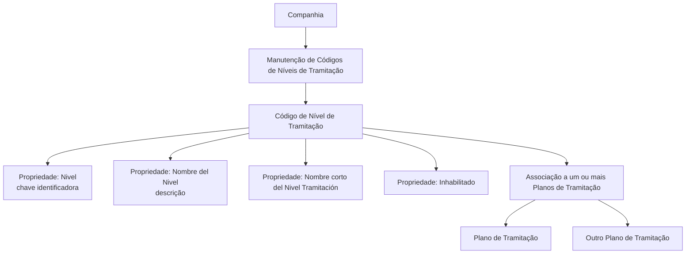

# Definição de Códigos de Níveis de Tramitação por Companhia — DOCUMENTACIÓN Reef

## 1. Metadados do Documento
- **Arquivo de Origem:** Não identificado no conteúdo fornecido
- **Tipo de Documento:** Procedimento
- **Domínio / Sistema:** DOCUMENTACIÓN Reef / Mapfre
- **Público-Alvo:** Negócio, Analistas Funcionais e Operação
- **Data/Versão Identificada:** Não identificada

---

## 2. Resumo Executivo & Contexto de Negócio

O documento descreve a definição de códigos de níveis de tramitação no nível de companhia. Níveis de tramitação agrupam trâmites de mesma natureza e são posteriormente associados a um ou mais Planos de Tramitação.

Os exemplos apresentados incluem níveis para Peritações, Juízos e Salvamentos. Um nível de Peritações reúne os trâmites necessários para gerir peritações; um nível de Juízos reúne os trâmites necessários para gerir juízos; e um nível de Salvamentos reúne os trâmites necessários para gerir salvamentos, incluindo recuperação e venda de restos.

A manutenção dos códigos de níveis de tramitação contém propriedades para identificação, descrição completa, descrição curta e controle de habilitação. O controle de habilitação determina se um código pode ser associado a um Plano de Tramitação.

O mesmo nível pode ser associado a vários Planos de Tramitação. Entretanto, suas características podem variar por plano: por exemplo, um nível de Juízos pode ser inicial em um plano — incluído quando o expediente é aberto — e não inicial em outro plano.

---

## 3. Arquitetura, Componentes & Tecnologias Envolvidas

Os elementos funcionais identificados são:

| Componente / Conceito | Papel descrito |
| :--- | :--- |
| Código de Nível de Tramitação | Chave que identifica um nível de tramitação. |
| Nível de Tramitação | Agrupamento de trâmites da mesma natureza. |
| Plano de Tramitação | Estrutura à qual um ou vários níveis de tramitação podem ser associados. |
| Propriedade `Nivel` | Contém a chave de identificação do nível. |
| `Nombre del Nivel` | Descrição da chave do nível de tramitação. |
| `Nombre corto del Nivel Tramitación` | Nome reduzido usado em telas, consultas e listados com espaço limitado. |
| `Inhabilitado` | Indica se o código está habilitado para associação a um Plano de Tramitação. |
| DOCUMENTACIÓN Reef | Área ou repositório documental indicado no conteúdo. |
| Mapfredocument | Termo exibido no cabeçalho do conteúdo. |



> **Nota de Análise:** O conteúdo não especifica tecnologias, APIs, métodos HTTP, estruturas JSON, bancos de dados, URLs de ambiente, servidores ou contratos de integração.

---

## 4. Regras de Negócio, Especificações Funcionais & Processos

1. Os níveis de tramitação agrupam trâmites que possuem a mesma natureza.
2. A definição abordada ocorre no nível de companhia.
3. Cada nível possui uma chave de identificação armazenada na propriedade `Nivel`.
4. A chave de nível será posteriormente associada a um ou vários Planos de Tramitação.
5. A propriedade `Nombre del Nivel` determina a descrição da chave do nível de tramitação.
6. A propriedade `Nombre corto del Nivel Tramitación` contém uma versão curta do nome do nível.
7. O nome curto deve ser utilizado em telas, consultas, listados e outros contextos em que a descrição completa não caiba.
8. A propriedade `Inhabilitado` informa se o código de nível definido está habilitado para ser associado a um Plano de Tramitação.
9. Um código de nível pode ser associado a vários Planos de Tramitação.
10. Um mesmo nível pode assumir características distintas conforme o Plano de Tramitação ao qual está associado.
11. Um nível pode ser definido como inicial em determinado plano; nesse caso, o nível é incluído quando o expediente é aberto.
12. O mesmo nível pode não ser inicial em outro Plano de Tramitação.

### Exemplos de agrupamentos de trâmites

| Nível exemplificado | Trâmites agrupados |
| :--- | :--- |
| Nível de Peritações | Todos os trâmites necessários para gerir peritações. |
| Nível de Juízos | Todos os trâmites necessários para gerir juízos. |
| Nível de Salvamentos | Todos os trâmites necessários para gerir salvamentos, incluindo recuperação e venda de restos. |

---

## 5. Tabelas de Parâmetros, Ambientes e Estruturas de Dados

| Item / Parâmetro | Descrição / Função | Tipo / Valores / Formato | Ambiente / Observações |
| :--- | :--- | :--- | :--- |
| `Nivel` | Chave para identificar os diferentes níveis de tramitação. | Código de nível. | Posteriormente associado a um ou vários Planos de Tramitação. |
| `Nombre del Nivel` | Descrição da chave do nível de tramitação. | Nome ou descrição textual. | Exemplos: `Nivel Comunicación con Asegurado`, `Nivel de Peritaciones`, `Nivel de Juicios`. |
| `Nombre corto del Nivel Tramitación` | Nome reduzido do nível. | Texto curto. | Usado em telas, consultas e listados quando não há espaço para a descrição completa. |
| `Inhabilitado` | Indica se o código de nível pode ser associado a um Plano de Tramitação. | Indicador de habilitação. | Nos exemplos apresentados, o valor é `N`. |
| Código `N1` | Código de nível de tramitação. | `N1` | Associado ao nome `Nivel Comunicación con Asegurado`. |
| Código `NPE` | Código de nível de tramitação. | `NPE` | Associado ao nome `Nivel de Peritaciones`. |
| Código `NJU` | Código de nível de tramitação. | `NJU` | Associado ao nome `Nivel de Juicios`. |
| Código `N001` | Código exibido no exemplo tabular. | `N001` | Nome: `Nivel Comunicación Asegurado`; nome curto: `COMUN-ASEG`; inabilitado: `N`. |
| Código `N002` | Código exibido no exemplo tabular. | `N002` | Nome: `Nivel Comprobación Datos Póliza`; nome curto: `INF-POL`; inabilitado: `N`. |
| Código `N007` | Código exibido no exemplo tabular. | `N007` | Nome: `Nivel Juicios`; nome curto: `INF-JUI`; inabilitado: `N`. |

---

## 6. Bateria de Perguntas & Respostas para RAG (FAQ Sintético)

### P1: Qual é o objetivo da definição de níveis de tramitação?
**R:** O objetivo é explicar como definir os níveis que terão os diferentes Planos de Tramitação. Os níveis agrupam trâmites de mesma natureza e a definição dos códigos ocorre no nível de companhia.

### P2: O que representa um nível de tramitação?
**R:** Um nível de tramitação representa um agrupamento de trâmites da mesma natureza. O documento exemplifica níveis de Peritações, Juízos e Salvamentos.

### P3: Para que serve a propriedade `Nivel`?
**R:** A propriedade `Nivel` contém a chave usada para identificar os diferentes níveis de tramitação. Essa chave será posteriormente associada a um ou vários Planos de Tramitação.

### P4: Qual é a finalidade da propriedade `Nombre del Nivel`?
**R:** A propriedade `Nombre del Nivel` determina a descrição da chave do nível de tramitação. Por exemplo, o código `NPE` é descrito como `Nivel de Peritaciones`.

### P5: Quando deve ser usado o nome curto de um nível de tramitação?
**R:** O `Nombre corto del Nivel Tramitación` deve ser utilizado em telas, consultas, listados e outros contextos nos quais não caiba a descrição completa do nível.

### P6: O que a propriedade `Inhabilitado` controla?
**R:** A propriedade `Inhabilitado` indica se o Código de Nível de Tramitação definido está habilitado ou não para ser associado a um Plano de Tramitação.

### P7: Um Código de Nível de Tramitação pode ser associado a mais de um Plano de Tramitação?
**R:** Sim. Os níveis de tramitação podem ser associados a vários planos, pois as características do mesmo nível podem variar conforme o Plano de Tramitação.

### P8: O que significa um nível ser inicial em um Plano de Tramitação?
**R:** Um nível inicial é incluído quando o expediente é aberto. O documento usa o nível de Juízos como exemplo: ele pode ser inicial em um plano e não inicial em outro.

### P9: Quais trâmites são agrupados pelo nível de Salvamentos?
**R:** O nível de Salvamentos agrupa os trâmites necessários para gerir salvamentos, incluindo recuperação e venda de restos.

### P10: Quais exemplos de códigos e nomes de nível são fornecidos?
**R:** O documento fornece os pares `N1` — `Nivel Comunicación con Asegurado`, `NPE` — `Nivel de Peritaciones` e `NJU` — `Nivel de Juicios`.

---

## 7. Glossário de Termos, Siglas & Conceitos-Chave

- **Plano de Tramitação:** Plano ao qual um ou mais níveis de tramitação podem ser associados.
- **Nível de Tramitação:** Agrupamento de trâmites de mesma natureza.
- **Código de Nível de Tramitação:** Chave que identifica um nível de tramitação.
- **Nível Inicial:** Nível incluído quando o expediente é aberto em determinado Plano de Tramitação.
- **Peritações:** Natureza de trâmites agrupada pelo Nível de Peritações.
- **Juízos:** Natureza de trâmites agrupada pelo Nível de Juízos.
- **Salvamentos:** Natureza de trâmites relacionada à recuperação e venda de restos.
- **Expediente:** Elemento que é aberto e pode receber um nível inicial, conforme o plano.
- **DOCUMENTACIÓN Reef:** Nome exibido como área documental no conteúdo fornecido.
- **Mapfredocument:** Termo exibido no cabeçalho do conteúdo fornecido.

---

## 8. Notas Críticas, Riscos & Limitações

- O documento descreve a definição funcional de códigos de níveis, mas não detalha o procedimento operacional de criação, alteração, exclusão ou persistência dos códigos.
- Não são descritos critérios de unicidade, formato, tamanho máximo ou validação dos códigos de nível.
- O documento não define os valores possíveis para `Inhabilitado`, embora os exemplos apresentem o valor `N`.
- Não há detalhamento sobre como as características de um nível são configuradas dentro de cada Plano de Tramitação.
- Não são informados métodos HTTP, APIs, contratos JSON, tecnologias de implementação, banco de dados, rotas de log, servidores ou URLs de ambiente.
- Não é fornecida data, versão, autor formal ou nome do arquivo de origem.

---

## 9. Conteúdo Bruto Estruturado (Referência Fiel)

```text
--- [PÁGINA 1 DE 2] ---

DEFINICIÓN Niveles de tramitación
Objetivo
La finalidad de este documento es explicar cómo definir los niveles que van a tener los distintos planes de tramitación.
Los niveles son los que agrupan trámites de la misma naturaleza.
Por Ejemplo:
Nivel de Peritaciones, agrupará a todos los trámites necesarios para gestionar las peritaciones
Nivel de Juicios, agrupará todos los trámites necesarios para gestionar los juicios
Nivel de Salvamentos, agrupará todos los trámites necesarios para gestionar los salvamentos (recuperación y venta de restos )
Etc.
En este documento, se está explicando la definición de códigos de niveles de tramitación, a nivel de compañía.
Imagen del Mantenimiento de Códigos de Niveles de Tramitación a nivel de Compañía:
Documentation / DOCUMENTACIÓN Reef
DOCUMENTACIÓN Reef
Mapfredocument
DOCUMENTACIÓN Reef
Owner
user:agonzalez_mapfre.com
Lifecycle
Approved Source
 /
VL
Buscar Inicio Soluciones Arquitecturas APIs Componentes Cloud Documentación Zeus Reef Ayuda
ES

--- [PÁGINA 2 DE 2] ---

Propiedades
Nivel
Esta propiedad contendrá la clave por la que se van a identificar los distintos Niveles de tramitación, que posteriormente serán asociados a
uno o varios Planes.
Nombre del Nivel
Esta propiedad determina la descripción de la clave para el Nivel de tramitación.
Ejemplo:
Código de Nivel Tramitación: N1
Nombre del Código de Nivel Tramitación: Nivel Comunicación con Asegurado
Código de Nivel Tramitación: NPE
Nombre del Código de Nivel Tramitación: Nivel de Peritaciones
Código de Nivel Tramitación: NJU
Nombre del Código de Nivel Tramitación: Nivel de Juicios
Nombre corto del Nivel Tramitación
Esta propiedad será un nombre corto del Nivel de tramitación para ser utilizado en aquellas pantallas, consultas, listados...etc, donde no
quepa la descripción del Nivel.
Ejemplo:
NIVEL NOMBRE NOMBRE CORTO INHABILITADO
N001 Nivel Comunicación Asegurado COMUN-ASEG N
N002 Nivel Comprobación Datos Póliza INF-POL N
N007 Nivel Juicios INF-JUI N
Inhabilitado
Esta propiedad indica si el Código de Nivel de Tramitación que está definido, está habilitado o no, para poder asociarlo a un Plan de
Tramitación.
Preguntas frecuentes
¿Un Código de Nivel pueden asociarse a varios Planes de Tramitación?
Si, los Niveles de tramitación pueden ser asociados a varios planes ya que dependiendo del plan, ese nivel puede tener distintas
características.
Por ejemplo:
Si se define un Nivel de Juicios, para un plan se puede definir como inicial (que el nivel se incluya cuando se abra el expediente), y para
otro plan, ese nivel no sea inicial.
```
