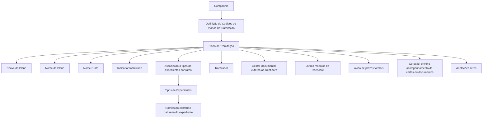

# Definição de Códigos de Planos de Tramitação em Nível de Companhia — Reef.core

## 1. Metadados do Documento
- **Arquivo de Origem:** `Não identificado`
- **Tipo de Documento:** Procedimento
- **Domínio / Sistema:** Reef.core — Planos de Tramitação
- **Público-Alvo:** Negócio, Operação, Analistas Funcionais e Configuradores
- **Data/Versão Identificada:** Não identificada

---

## 2. Resumo Executivo & Contexto de Negócio

O documento descreve a definição de códigos de planos de tramitação no nível de companhia no sistema Reef.core. A finalidade declarada é definir os códigos de planos que a companhia utilizará para tramitar diferentes tipos de expedientes.

Um plano de tramitação é apresentado como guia para o tramitador e ferramenta de organização do trabalho. O plano permite melhorar e especializar a tramitação dos expedientes segundo a sua natureza, incluindo danos materiais, danos pessoais e recobros.

A partir de um plano de tramitação, o documento informa que é possível realizar operações necessárias à tramitação de um expediente: conexão com ferramentas externas ao Reef.core, como Gestor Documental; conexão com outros módulos do Reef.core; aviso de prazos formais; geração, envio e acompanhamento de cartas ou documentos; e inclusão de anotações livres pelo tramitador.

A configuração do plano baseia-se em uma chave identificadora, uma descrição, um nome curto e um indicador de inabilitação. Posteriormente, a chave do plano pode ser associada a um ou mais tipos de expedientes por ramo.

O documento também estabelece que um mesmo código de plano pode ser associado a tipos de expedientes de setores e/ou ramos distintos, desde que a tramitação seja a mesma. Como exemplo, um plano destinado à gestão de expedientes de lesionados pode ser aplicado a qualquer tipo de expediente que trate lesões, independentemente do ramo.

---

## 3. Arquitetura, Componentes & Tecnologias Envolvidas

Os componentes e capacidades mencionados são:

- **Reef.core:** sistema no qual os códigos de planos de tramitação são definidos e utilizados.
- **Plano de Tramitação:** guia operacional e mecanismo de organização da tramitação de expedientes.
- **Tipos de Expedientes por Ramo:** entidades às quais um ou mais planos de tramitação podem ser associados.
- **Gestor Documental:** ferramenta externa ao Reef.core que pode ser conectada a partir do plano.
- **Outros módulos do Reef.core:** módulos internos que podem ser conectados a partir do plano.
- **Tramitador:** usuário que utiliza o plano para executar atividades de tramitação.
- **Cartas ou documentos:** artefatos que podem ser gerados, enviados e acompanhados pelo plano.
- **Prazos formais:** prazos sobre os quais o plano pode emitir avisos.



**Nota de Análise:** o documento cita conexão com o Gestor Documental e outros módulos do Reef.core, mas não detalha interfaces, métodos, contratos de integração, protocolos ou fluxos técnicos de dados.

---

## 4. Regras de Negócio, Especificações Funcionais & Processos

### 4.1 Finalidade dos códigos de planos de tramitação

1. A companhia deve definir códigos de planos de tramitação.
2. Os códigos definidos devem permitir a tramitação de diferentes tipos de expedientes.
3. A definição abordada no documento ocorre no nível de companhia.

### 4.2 Papel do plano de tramitação

1. O plano de tramitação atua como guia para o tramitador.
2. O plano de tramitação é uma ferramenta para organizar o trabalho.
3. O plano permite melhorar e especializar a tramitação de expedientes segundo sua natureza.
4. As naturezas de expediente explicitamente citadas são:
   - Danos materiais.
   - Danos pessoais.
   - Recobros.

### 4.3 Operações suportadas pelo plano

A partir de um plano de tramitação, podem ser realizadas as seguintes operações:

1. Conexão com ferramentas externas ao Reef.core, incluindo o Gestor Documental.
2. Conexão com outros módulos do Reef.core.
3. Aviso de prazos formais.
4. Geração de cartas ou documentos.
5. Envio de cartas ou documentos.
6. Acompanhamento de cartas ou documentos.
7. Registro de anotações livres, consistindo em apontamentos realizados pelo tramitador.

### 4.4 Propriedades do plano de tramitação

1. **Chave do Plano de Tramitação**
   - É a propriedade utilizada para identificar os diferentes planos de tramitação.
   - A chave será posteriormente associada a um ou mais tipos de expedientes por ramo.

2. **Nome do Plano de Tramitação**
   - Contém a descrição da chave definida para o plano de tramitação.

3. **Nome Curto do Plano de Tramitação**
   - É uma denominação abreviada do plano.
   - Deve ser utilizada em telas, consultas, listagens e outros contextos em que não houver espaço para a descrição completa do plano.

4. **Inabilitado**
   - Indica se o código de plano de tramitação definido está habilitado ou não para associação a um tipo de expediente.

### 4.5 Regra de associação entre planos, setores e ramos

1. Um código de plano pode ser associado a tipos de expedientes de setores e/ou ramos distintos.
2. A condição para reutilização entre setores ou ramos distintos é que a tramitação seja a mesma.
3. Um plano definido para gerir expedientes de lesionados pode ser associado a qualquer tipo de expediente que tramite lesões, independentemente do ramo.

---

## 5. Tabelas de Parâmetros, Ambientes e Estruturas de Dados

| Item / Parâmetro | Descrição / Função | Tipo / Valores / Formato | Ambiente / Observações |
| :--- | :--- | :--- | :--- |
| Chave do Plano de Tramitação | Identifica os distintos planos de tramitação. | Código de plano; exemplos: `PL001`, `PL002`, `PS001`. | Posteriormente associado a um ou mais tipos de expedientes por ramo. |
| Nome do Plano de Tramitação | Contém a descrição da chave definida para o plano. | Descrição textual. | Exemplos: `Plan Daños Materiales Autos`, `Plan Daños de Lesiones`, `Plan de Salvamentos`. |
| Nome Curto do Plano de Tramitação | Nome abreviado para uso em telas, consultas e listagens sem espaço para a descrição completa. | Texto curto; exemplos: `DANMATAU`, `DANPERS`. | Utilizado quando a descrição completa não couber. |
| Inabilitado | Informa se um código de plano está habilitado para associação a um tipo de expediente. | Indicador; exemplos fornecidos: `N`. | O documento não define todos os valores possíveis nem sua semântica completa. |
| Associação a tipo de expediente | Relaciona um plano a um ou mais tipos de expedientes. | Um plano para um ou mais tipos de expedientes por ramo. | Pode abranger setores e/ou ramos distintos quando a tramitação for a mesma. |
| Gestor Documental | Ferramenta externa que pode ser conectada a partir do plano. | Não detalhado. | Externa ao Reef.core. |
| Outros módulos Reef.core | Módulos internos que podem ser conectados a partir do plano. | Não detalhado. | O documento não identifica quais módulos. |
| Aviso de prazos formais | Capacidade operacional disponível a partir do plano. | Não detalhado. | O documento não informa regras de cálculo, canais ou configuração dos avisos. |
| Cartas ou documentos | Artefatos que podem ser gerados, enviados e acompanhados. | Não detalhado. | O documento não especifica modelos, formatos ou fluxos de aprovação. |
| Anotações livres | Apontamentos realizados pelo tramitador. | Texto livre. | O documento não define permissões, retenção ou estrutura das anotações. |

### Exemplos de planos de tramitação

| Código de Plano de Tramitação | Nome do Código de Plano de Tramitação | Nome Curto | Inabilitado |
| :--- | :--- | :--- | :--- |
| `PL001` | Plan Daños Materiales Autos | `DANMATAU` | `N` |
| `PL002` | Plan Daños de Lesiones | `DANPERS` | `N` |
| `PS001` | Plan de Salvamentos | Não informado | Não informado |

---

## 6. Bateria de Perguntas & Respostas para RAG (FAQ Sintético)

### P1: Qual é a finalidade da definição de códigos de planos de tramitação no Reef.core?
**R:** A finalidade é definir, em nível de companhia, os códigos dos planos de tramitação que serão utilizados para tramitar diferentes tipos de expedientes.

### P2: O que é um plano de tramitação no contexto do Reef.core?
**R:** Um plano de tramitação é uma guia para o tramitador e uma ferramenta para organizar o trabalho. O plano permite melhorar e especializar a tramitação dos expedientes segundo sua natureza, como danos materiais, danos pessoais e recobros.

### P3: Quais operações podem ser realizadas a partir de um plano de tramitação?
**R:** O plano permite conexão com ferramentas externas ao Reef.core, como o Gestor Documental; conexão com outros módulos do Reef.core; aviso de prazos formais; geração, envio e acompanhamento de cartas ou documentos; e registro de anotações livres realizadas pelo tramitador.

### P4: Para que serve a chave do plano de tramitação?
**R:** A chave do plano de tramitação identifica os diferentes planos de tramitação. Posteriormente, essa chave pode ser associada a um ou mais tipos de expedientes por ramo.

### P5: Qual é a diferença entre nome e nome curto do plano de tramitação?
**R:** O nome do plano contém a descrição da chave definida para o plano. O nome curto é uma versão abreviada utilizada em telas, consultas, listagens e outros locais em que não houver espaço para exibir a descrição completa.

### P6: O que indica a propriedade Inabilitado?
**R:** A propriedade Inabilitado indica se o código de plano de tramitação definido está habilitado ou não para poder ser associado a um tipo de expediente. Os exemplos apresentados utilizam o valor `N`, mas o documento não explica a codificação completa dos valores possíveis.

### P7: Um mesmo plano de tramitação pode ser associado a expedientes de diferentes ramos?
**R:** Sim. Os planos de tramitação podem ser atribuídos a tipos de expedientes de diferentes ramos, desde que a tramitação seja a mesma.

### P8: Um plano para expedientes de lesionados pode ser reutilizado em outros ramos?
**R:** Sim. Se um plano de tramitação for definido para gerir expedientes de lesionados, ele pode ser associado a qualquer tipo de expediente que tramite lesões, independentemente do ramo.

### P9: Quais exemplos de códigos de planos são apresentados no documento?
**R:** O documento apresenta `PL001` para `Plan Daños Materiales Autos`, `PL002` para `Plan Daños de Lesiones` e `PS001` para `Plan de Salvamentos`.

### P10: Quais nomes curtos são exemplificados para planos de tramitação?
**R:** O documento exemplifica o nome curto `DANMATAU` para o plano `PL001 — Plan Daños Materiales Autos` e `DANPERS` para o plano `PL002 — Plan Daños de Lesiones`.

### P11: O documento detalha os métodos ou contratos de integração com o Gestor Documental?
**R:** Não. O documento informa que existe possibilidade de conexão com o Gestor Documental, mas não descreve métodos HTTP, contratos JSON, protocolos, credenciais, endpoints ou regras de tratamento de erro.

---

## 7. Glossário de Termos, Siglas & Conceitos-Chave

- **Reef.core:** sistema mencionado como contexto para definição e uso de planos de tramitação.
- **Plano de Tramitação:** guia para o tramitador e ferramenta de organização do trabalho de tramitação de expedientes.
- **Código de Plano de Tramitação:** chave que identifica um plano de tramitação.
- **Expediente:** entidade que é tramitada e pode ser associada a um plano de tramitação.
- **Ramo:** classificação associada a tipos de expedientes; o documento permite reutilização de plano em diferentes ramos quando a tramitação for a mesma.
- **Tramitador:** usuário que utiliza o plano e realiza apontamentos por meio de anotações livres.
- **Gestor Documental:** ferramenta externa ao Reef.core mencionada como passível de conexão pelo plano.
- **Recobros:** natureza de expediente explicitamente citada no documento; não possui definição adicional.
- **Inabilitado:** propriedade que indica se um código de plano está habilitado ou não para associação a um tipo de expediente.
- **PL001 / PL002 / PS001:** exemplos de códigos de planos de tramitação apresentados no documento.
- **DANMATAU / DANPERS:** exemplos de nomes curtos de planos de tramitação.

---

## 8. Notas Críticas, Riscos & Limitações

- O documento não informa o nome do arquivo de origem, data, versão ou autoria formal.
- O documento não detalha o modelo de dados, a persistência ou o mecanismo técnico de associação entre planos e tipos de expedientes.
- O documento não especifica quais valores, além de `N`, podem ser utilizados na propriedade **Inabilitado**, nem define sua codificação completa.
- Não há detalhamento de permissões, perfis de acesso ou responsabilidades para criar, alterar, inabilitar ou associar planos.
- A conexão com Gestor Documental e outros módulos do Reef.core é mencionada sem especificação de contratos, integrações, endpoints, protocolos ou tratamento de falhas.
- O documento não define como funcionam os avisos de prazos formais, incluindo critérios, prazos, destinatários e canais de notificação.
- Não são apresentados formatos, modelos ou regras de acompanhamento para cartas ou documentos.
- Não há detalhamento adicional sobre os exemplos `PL001`, `PL002` e `PS001` além dos nomes e, para dois casos, nomes curtos e valor `N`.

---

## 9. Conteúdo Bruto Estruturado (Referência Fiel)

```text
--- [PÁGINA 1 DE 3] ---

DEFINICIÓN Planes de Tramitación
Objetivo
La finalidad es definir los códigos de los planes de tramitación que va a tener la compañía, para poder tramitar los diferentes tipos de
expedientes.
El plan de tramitación es una guía para el tramitador, una herramienta para organizar el trabajo. Esta herramienta permite mejorar y
especializar la tramitación de los expedientes según su naturaleza (daños materiales, daños personales, recobros…..).
Desde el plan se puede realizar todas las operaciones necesarias para tramitar un expediente:
Conexión con herramientas externas a Reef.core (Gestor Documental)
Conexión con otros módulos de Reef.core
Aviso de plazos formales
Posibilidad de generar, enviar y hacer seguimiento de cartas o documentos
Posibilidad de anotaciones Libres, apuntes que realiza el tramitador
En este documento, se está explicando la definición de códigos de plan de tramitación a nivel de compañía.
Imagen del Mantenimiento de Códigos de Plan de Tramitación a nivel de Compañía:
Documentation / DOCUMENTACIÓN Reef
DOCUMENTACIÓN Reef
Mapfredocument
DOCUMENTACIÓN Reef
Owner
user:agonzalez_mapfre.com
Lifecycle
Approved Source
 /
 VL
Buscar Inicio Soluciones Arquitecturas APIs Componentes Cloud Documentación Zeus Reef Ayuda
ES


--- [PÁGINA 2 DE 3] ---

Propiedades
Clave del Plan de Tramitación
Esta propiedad será la clave por la que se va a identificar los distintos planes de tramitación, que posteriormente será asociado a uno o varios
tipos de Expedientes por Ramo.
Nombre del Plan de tramitación
Esta propiedad contendrá la descripción de la clave definida para el plan de tramitación.
Ejemplos:
Código de Plan Tramitación: PL001 Nombre del Código de Plan Tramitación: Plan Daños Materiales Autos
Código de Plan Tramitación: PL002 Nombre del Código de Plan Tramitación: Plan Daños de Lesiones
Código de Plan Tramitación: PS001 Nombre del Código de Plan Tramitación: Plan de Salvamentos
Nombre corto del Plan Tramitación
Esta propiedad será un nombre corto del plan de tramitación para ser utilizado en aquellas pantallas, consultas, listados...etc, donde no
quepa la descripción del Plan.
Ejemplo:
PLAN NOMBRE NOMBRE CORTO INHABILITADO
PL001 Plan Daños Materiales Autos DANMATAU N
PL002 Plan Daños de Lesiones DANPERS N
Inhabilitado
Esta propiedad indica si el Código de Plan Tramitación que está definido, está habilitado o no, para poder asociarlo a un tipo de expediente.
Preguntas frecuentes
¿Un Código de Plan pueden ser asociado a tipos de expedientes de distinto sector y/o ramo?


--- [PÁGINA 3 DE 3] ---

Si, los planes de tramitación pueden ser asignado a tipos de expedientes de diferentes ramos, siempre y cuando la tramitación sea la
misma.
Por ejemplo, si se define un plan de tramitación para poder gestionar expedientes de lesionados, podría asignarse a cualquier tipo de
expediente que tramite lesiones, sea del Ramo que sea.
```
