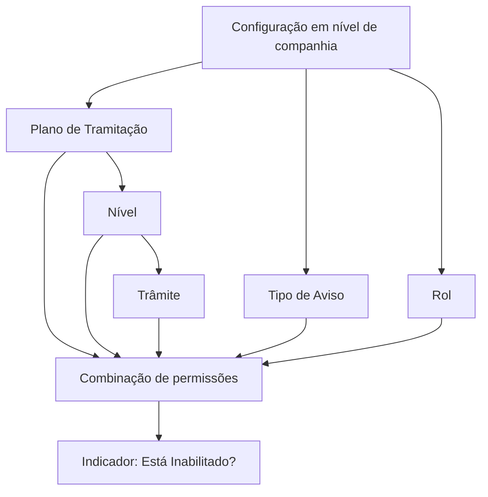

# Definição de Roles do Plano de Tramitação

## 1. Metadados do Documento
- **Arquivo de Origem:** Não identificado no conteúdo extraído
- **Tipo de Documento:** Especificação Funcional
- **Domínio / Sistema:** Reef / Gestão de Sinistros
- **Público-Alvo:** Negócio, operação, administradores de configuração e desenvolvedores
- **Data/Versão Identificada:** Não identificada

---

## 2. Resumo Executivo & Contexto de Negócio

O documento define a finalidade dos **Roles do Plano de Tramitação** no contexto de operações de sinistros. O objetivo é determinar quais operações cada perfil pode executar dentro de um plano, nível, trâmite e tipo de aviso.

A configuração permite restringir o escopo operacional de perfis especializados. Como exemplo, um perito pode receber permissões apenas para operações relacionadas a peritagens, como solicitar peritagem, comunicar-se com oficinas ou segurados por cartas e e-mails e registrar resultados de peritagem.

O documento também cita especialistas em fraude como perfis que devem executar exclusivamente operações relacionadas ao combate à fraude. A definição de roles, portanto, suporta a segregação de responsabilidades nas operações de sinistros.

A associação de um role depende de entidades previamente configuradas em nível de companhia, incluindo plano de tramitação, nível, trâmite, tipo de aviso e o próprio role. A combinação configurada também pode ser explicitamente marcada como inabilitada.

---

## 3. Arquitetura, Componentes & Tecnologias Envolvidas

Os componentes funcionais identificados são:

| Componente | Papel descrito |
| :--- | :--- |
| Reef | Contexto de documentação e domínio funcional citado no conteúdo. |
| Plano de Tramitação | Entidade que agrupa níveis, trâmites, tipos de aviso e roles para operações de sinistros. |
| Nível | Código associado previamente a um plano de tramitação. |
| Trâmite | Operação identificada por chave, previamente associada ao plano e nível configurados. |
| Tipo de Aviso | Tipo de aviso permitido no plano; deve estar definido em nível de companhia. |
| Rol | Perfil ao qual é atribuído um plano completo, nível de todos os planos, trâmite ou outra combinação configurada. |
| Companhia | Escopo no qual plano, tipo de aviso e role precisam estar previamente registrados. |
| Perito | Exemplo de perfil restrito a operações relativas a peritagens. |
| Especialista em Fraude | Exemplo de perfil restrito a operações relacionadas à luta contra fraude. |



**Nota de Análise:** o documento não detalha interfaces de usuário, métodos HTTP, contratos JSON, persistência de dados, integrações técnicas ou tecnologias de implementação do sistema Reef.

---

## 4. Regras de Negócio, Especificações Funcionais & Processos

1. A finalidade da definição de roles é determinar quem pode realizar as diferentes operações de sinistros.
2. Um perito pode receber, dentro dos planos, níveis relativos a peritagens.
3. Um perito pode ficar limitado a solicitar peritagem, enviar cartas ou e-mails a oficinas, registrar resultados de peritagens e contatar o segurado por e-mails ou cartas que estejam no nível de peritagem.
4. Especialistas em fraude devem executar somente operações relacionadas à luta contra fraude.
5. A propriedade **Plano de Tramitação** contém a chave do plano ao qual os roles serão associados.
6. A chave do plano de tramitação deve existir em nível de companhia.
7. Pode ser utilizado o plano genérico, que significa aplicação a todos os planos.
8. A propriedade **Nível** contém a chave ou o código do nível ao qual o role será associado.
9. O código de nível deve estar previamente associado ao plano de tramitação de níveis.
10. Pode ser utilizado o nível genérico, que significa aplicação a todos os níveis.
11. Quando o plano for genérico, pode-se escolher qualquer nível de qualquer plano.
12. A propriedade **Trâmite** contém a chave que identifica os distintos trâmites.
13. Para associar um role a um trâmite, o trâmite deve estar previamente associado ao plano e ao nível que estão sendo definidos.
14. A propriedade **Tipo de Aviso** contém o tipo de aviso que poderá ser incluído no plano.
15. O tipo de aviso deve estar definido nos tipos de aviso em nível de companhia.
16. A propriedade **Rol** contém a chave do role que receberá a atribuição.
17. O role pode receber a atribuição de um plano completo, de um nível de todos os planos, de um trâmite ou de outra combinação configurada.
18. O role deve estar previamente cadastrado em nível de companhia.
19. A propriedade **Está Inabilitado?** determina se a combinação de plano, nível, trâmite, tipo de aviso e role está inabilitada.

---

## 5. Tabelas de Parâmetros, Ambientes e Estruturas de Dados

| Item / Parâmetro | Descrição / Função | Tipo / Valores / Formato | Ambiente / Observações |
| :--- | :--- | :--- | :--- |
| Plano de Tramitação | Contém a chave do plano ao qual são associados os roles. | Chave de plano; pode usar valor genérico. | Deve existir em nível de companhia. O genérico significa todos os planos. |
| Exemplo de plano | Exemplo de plano de tramitação informado no documento. | `PL01 - Plan de Daños Materiales` | Exemplo documental. |
| Nível | Contém a chave ou código do nível associado ao role. | Chave ou código de nível; pode usar nível genérico. | Deve estar previamente associado ao plano de tramitação de níveis. |
| Plano genérico | Permite a seleção de níveis sem restringir a um plano específico. | Plano genérico | Quando o plano é genérico, pode-se escolher qualquer nível de qualquer plano. |
| Nível genérico | Representa aplicação a todos os níveis. | Nível genérico | O documento não informa a chave concreta do valor genérico. |
| Trâmite | Identifica os diferentes trâmites aos quais um role pode ser associado. | Chave de trâmite | Deve estar previamente associado ao plano e ao nível definidos. |
| Tipo de Aviso | Define o tipo de aviso que poderá ser adicionado ao plano. | Tipo de aviso | Deve estar definido em nível de companhia. |
| Rol | Identifica o perfil ao qual será atribuída uma combinação de permissões. | Chave de role | Deve estar previamente cadastrado em nível de companhia. |
| Está Inabilitado? | Indica se uma combinação de plano, nível, trâmite, tipo de aviso e role está inabilitada. | Indicador de habilitação/inabilitação | O documento não especifica valores técnicos, formato ou comportamento de uma combinação inabilitada. |
| Perito | Perfil exemplificado para operações de peritagem. | Perfil operacional | Pode solicitar peritagem, enviar cartas/e-mails, registrar resultados e contatar o segurado dentro do nível de peritagem. |
| Especialista em Fraude | Perfil exemplificado para atividades de combate à fraude. | Perfil operacional | Deve executar somente operações relacionadas à fraude. |

---

## 6. Bateria de Perguntas & Respostas para RAG (FAQ Sintético)

### P1: Qual é o objetivo dos Roles do Plano de Tramitação?
**R:** O objetivo é definir quem pode realizar as diferentes operações de sinistros, associando roles a planos de tramitação, níveis, trâmites e tipos de aviso.

### P2: Quais operações um perito pode executar segundo o exemplo do documento?
**R:** Um perito pode receber níveis relativos a peritagens e executar operações como solicitar peritagem, enviar cartas ou e-mails às oficinas, registrar resultados de peritagens e comunicar-se com o segurado por e-mails ou cartas situadas no nível de peritagem.

### P3: Qual é a restrição aplicada aos especialistas em fraude?
**R:** Especialistas em fraude são pessoas que trabalham no combate à fraude e devem executar somente operações relacionadas à fraude.

### P4: O que é necessário para associar um role a um plano de tramitação?
**R:** A chave do plano de tramitação deve existir em nível de companhia. Essa chave é usada para associar os diferentes roles ao plano.

### P5: O que significa usar um Plano de Tramitação genérico?
**R:** O plano genérico significa que a configuração é aplicável a todos os planos. Quando o plano é genérico, pode-se selecionar qualquer nível de qualquer plano.

### P6: Qual pré-requisito existe para associar um role a um nível?
**R:** O código ou chave do nível deve estar previamente associado ao plano de tramitação de níveis.

### P7: Qual pré-requisito existe para associar um role a um trâmite?
**R:** O trâmite deve estar previamente associado ao plano e ao nível que estão sendo definidos antes de o role ser associado a esse trâmite.

### P8: Onde o tipo de aviso deve estar definido?
**R:** O tipo de aviso que poderá ser adicionado ao plano deve estar definido nos tipos de avisos em nível de companhia.

### P9: Onde o role precisa estar cadastrado antes de receber uma atribuição?
**R:** O role deve estar previamente cadastrado em nível de companhia.

### P10: O que a propriedade “Está Inabilitado?” controla?
**R:** A propriedade indica se a combinação formada por plano, nível, trâmite, tipo de aviso e role está inabilitada ou não.

### P11: Quais tipos de escopo podem ser atribuídos a um role?
**R:** Um role pode receber a atribuição de um plano completo, de um nível de todos os planos, de um trâmite ou de outras combinações descritas pela configuração de plano, nível, trâmite e tipo de aviso.

---

## 7. Glossário de Termos, Siglas & Conceitos-Chave

- **Reef:** Nome citado no contexto da documentação disponível.
- **Plano de Tramitação:** Plano identificado por chave, ao qual podem ser associados roles.
- **Nível:** Código ou chave previamente associado a um plano de tramitação.
- **Trâmite:** Operação identificada por chave e previamente associada a um plano e nível.
- **Tipo de Aviso:** Tipo de aviso permitido no plano e definido em nível de companhia.
- **Rol:** Perfil identificado por chave ao qual são atribuídos plano, nível, trâmite ou combinações relacionadas.
- **Perito:** Perfil exemplificado para operações relativas a peritagens.
- **Peritagem:** Contexto operacional que inclui solicitar peritagem e registrar seus resultados.
- **Especialista em Fraude:** Perfil dedicado a operações relacionadas à luta contra fraude.
- **Plano genérico:** Opção cujo significado é aplicação a todos os planos.
- **Nível genérico:** Opção cujo significado é aplicação a todos os níveis.
- **Companhia:** Escopo organizacional em que planos, tipos de avisos e roles devem existir ou estar cadastrados.

---

## 8. Notas Críticas, Riscos & Limitações

- O documento não informa a chave concreta do plano genérico nem do nível genérico.
- O documento não especifica os valores técnicos aceitos pela propriedade **Está Inabilitado?**.
- Não são descritas regras de precedência para conflitos entre uma configuração genérica e uma configuração específica.
- Não há detalhamento de telas, APIs, serviços, integrações, dados persistidos, trilhas de auditoria ou mecanismos de autenticação.
- O documento menciona o sistema Reef, mas não fornece detalhamento adicional sobre sua arquitetura técnica.
- Não são apresentados fluxos de aprovação, responsáveis pela manutenção dos cadastros ou procedimentos de publicação das configurações.

---

## 9. Conteúdo Bruto Estruturado (Referência Fiel)

```text
--- [PÁGINA 1 DE 2] ---

DEFINICIÓN Roles del Plan de Tramitación
Objetivo
La nalidad es denir quien puede realizar las diferentes operaciones de siniestros.
Ejemplos:
Un perito se le puede asignar dentro de los planes los niveles relativos a las peritaciones y sólo pueda solicitar peritación, enviar cartas o
emails a los talleres, registrar resultado de peritaciones, ponerse en contacto con el asegurado con emails o cartas que estén en el nivel
de peritación.
Especialistas en Fraudes personas que trabajen en la lucha contra el Fraude, sólo pueda ejecutar operaciones relacionadas con el Fraude
Etc.
Imagen Mantenimiento Roles del Plan de Tramitación:
Documentation / DOCUMENTACIÓN Reef
DOCUMENTACIÓN Reef
Mapfredocument
DOCUMENTACIÓN Reef
Owner
user:agonzalez_mapfre.com
Lifecycle
Approved Source
 /
 VL
Buscar Inicio Soluciones Arquitecturas APIs Componentes Cloud Documentación Zeus Reef Ayuda
ES


--- [PÁGINA 2 DE 2] ---

Propiedades
Plan de Tramitación
Esta propiedad contendrá la clave del Plan de Tramitación al cual se le va a asociar los distintos Roles. Esta clave tiene que existir a nivel de
compañía. Se puede utilizar el Genérico que signica para todos los planes.
Ejemplo:
PL01- Plan de Daños Materiales
Nivel
Esta propiedad contendrá la clave o el código del nivel al que se le van a asociar el Rol. Este código de Nivel tiene que estar asociado
previamente al plan de tramitación Niveles. Se puede utilizar el Nivel genérico que signica para todos los niveles. Si el plan es genérico se
podrá elegir cualquier nivel de cualquier plan.
Trámite
Esta propiedad contendrá la clave por la que se van a identicar los distintos Trámites. Para poder asociar el rol al trámite, este tiene que
estar previamente asociado al plan y al nivel que se está deniendo. Trámites de un Nivel.
Tipo de Aviso
Esta propiedad contendrá el tipo de Aviso que podrá añadir en el plan. Este tipo de aviso tiene que estar denido en los tipos de avisos a nivel
de compañía.
Rol
Esta propiedad contiene la clave del rol al cual se le va a asignar un plan completo o un nivel de todos los planes, o un trámite etc. Ese rol
tiene que estar dado de alta a nivel de compañía.
Está Inhabilitado?
Esta propiedad indica si la combinación de plan, nivel, trámite, tipo aviso y rol está inhabilitado o no.
```
