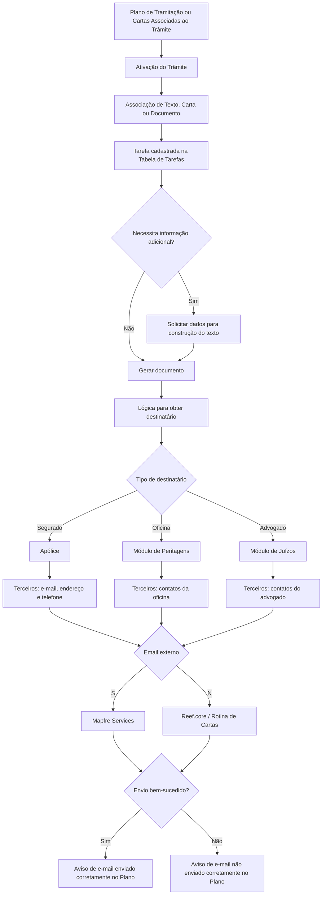

# Associação de Textos e Cartas a Trâmites no REEF

## 1. Metadados do Documento
- **Arquivo de Origem:** Não identificado no conteúdo fornecido
- **Tipo de Documento:** Especificação Técnica
- **Domínio / Sistema:** REEF / Reef.core / Gestão de Trâmites, Cartas e Textos
- **Público-Alvo:** Desenvolvedores, Analistas Funcionais, Operação e Negócio
- **Data/Versão Identificada:** Não identificada

---

## 2. Resumo Executivo & Contexto de Negócio

O documento define como associar textos, cartas e documentos a um **trâmite** no sistema REEF. A associação permite que documentos de comunicação sejam executados quando um trâmite é ativado pelo Plano de Tramitação ou pela operação de Cartas Associadas ao Trâmite.

A configuração de cada associação é orientada pelo trâmite, não somente pelo documento. Dessa forma, uma mesma carta ou texto pode ser reutilizada em trâmites diferentes, com regras específicas de destinatário, visibilidade, avisos de sucesso ou falha de e-mail e apresentação no Plano de Tramitação.

O processo exige que o código do trâmite exista no nível da companhia e que a tarefa responsável por gerar o texto esteja previamente cadastrada na tabela de Tarefas. A tarefa pode solicitar informações adicionais necessárias para construir o conteúdo da carta ou documento.

O documento também descreve mecanismos para controlar a ordem de exibição de múltiplos textos em um mesmo trâmite, calcular o destinatário conforme o contexto de negócio e evitar a exposição prematura de comunicações sensíveis no Centro Telefônico.

---

## 3. Arquitetura, Componentes & Tecnologias Envolvidas

| Componente / Módulo | Papel identificado no documento |
| :--- | :--- |
| **REEF / Reef.core** | Sistema no qual cartas podem ser enviadas quando o parâmetro de e-mail externo possui valor `N`. |
| **Plano de Tramitação** | Local onde um trâmite pode ser ativado e onde textos associados são apresentados em uma ordem configurada. |
| **Cartas Associadas ao Trâmite** | Operação utilizada para executar cartas, textos ou documentos associados a um trâmite. |
| **Tabela de Tarefas** | Cadastro obrigatório da tarefa ou processo que gera o documento associado ao trâmite. |
| **Terceiros** | Fonte de dados de contato, como e-mail, endereço habitual e telefone, para segurados, oficinas e advogados. |
| **Módulo de Peritagens** | Fonte para obter a oficina quando a comunicação é destinada a uma oficina. |
| **Módulo de Juízos** | Fonte para obter o advogado do processo judicial quando a comunicação é destinada a um advogado. |
| **Consulta do Centro Telefônico** | Consulta que pode mostrar ou ocultar uma carta associada ao trâmite. |
| **Rotina de Cartas** | Rotina na qual a opção de envio pelo Reef.core fica habilitada quando `Email externo = N`. |
| **Mapfre Services** | Sistema externo utilizado para envio de cartas quando `Email externo = S`. |
| **Plano** | Local onde pode ser gerado um subtipo de aviso após sucesso ou falha no envio de e-mail. |



> **Nota de Análise:** O documento cita REEF, Reef.core, Mapfre Services, Plano de Tramitação, Centro Telefônico, módulos de Peritagens e Juízos, mas não detalha interfaces, métodos HTTP, contratos JSON, tecnologias de implementação, URLs, ambientes ou versões.

---

## 4. Regras de Negócio, Especificações Funcionais & Processos

### 4.1 Associação de textos a trâmites

- Um ou mais textos, cartas ou documentos podem ser associados a cada trâmite que necessite dessas comunicações.
- A execução pode ocorrer:
  1. Quando o trâmite é ativado no **Plano de Tramitação**.
  2. Quando é utilizada a operação de **Cartas Associadas ao Trâmite**.
- Exemplos de textos ou cartas citados:
  - Comunicação de aceitação de sinistro ao segurado.
  - Solicitação de documentação ao segurado.
  - Solicitação de informação ao terceiro afetado.
  - Solicitação de peritagem.

### 4.2 Identificação do trâmite

- A propriedade **Trâmite** deve conter a chave do trâmite ao qual um ou mais textos serão associados.
- A chave do trâmite deve existir no nível da companhia.
- Exemplo apresentado: `T002 Comunicação com o Segurado`.

### 4.3 Tarefa geradora do documento

- A propriedade **Tarefa** deve conter a chave do processo responsável por gerar o documento, texto ou carta associado ao trâmite.
- A tarefa deve estar cadastrada na **Tabela de Tarefas**.
- A tarefa pode solicitar informações adicionais necessárias para a construção do texto da carta.

### 4.4 Ordem de apresentação dos textos

- A propriedade **Ordem do texto dentro do Trâmite** define a posição do texto associado quando o trâmite possuir mais de um texto.
- A ordem é utilizada no Plano de Tramitação.
- A configuração deve indicar explicitamente a sequência desejada de apresentação das cartas, textos ou documentos.

Exemplo de ordenação apresentado:

| Trâmite | Texto | Ordem de aparição |
| :--- | :--- | :--- |
| `T002 Comunicação Segurado` | `TXT1 Solicitação de Documentação` | `1` |
| `T002 Comunicação Segurado` | `TXT2 Comunicação de visita do Perito` | `2` |
| `T002 Comunicação Segurado` | `TXT2 Comunicação Veículo Ausente` | `3` |

### 4.5 Lógica para obtenção do destinatário

A propriedade **Lógica para obter o destinatário** contém a lógica de negócio que determina os dados do destinatário da comunicação, texto ou carta.

| Destinatário do documento | Origem inicial dos dados | Recuperação de contatos |
| :--- | :--- | :--- |
| Segurado | Apólice | Módulo de Terceiros |
| Oficina | Módulo de Peritagens | Módulo de Terceiros |
| Advogado | Módulo de Juízos | Módulo de Terceiros |

- Para o segurado, o fluxo habitual é obter o segurado da apólice e buscar em Terceiros os dados de contato: e-mail, endereço habitual e telefone.
- Para a oficina, o fluxo habitual é obter a oficina no módulo de Peritagens e buscar em Terceiros os dados de contato da oficina.
- Para o advogado, o fluxo habitual é obter o advogado do processo no módulo de Juízos e buscar em Terceiros os dados de contato do advogado.

### 4.6 Visibilidade na Consulta do Centro Telefônico

- A propriedade **Se mostra na Consulta do Centro Telefônico** contém uma marca que informa à consulta específica do Centro Telefônico se a carta associada ao trâmite deve ser exibida.
- A regra permite ocultar comunicações que não devem ser informadas ao segurado antes do momento adequado.
- Exemplo: uma carta de recusa de sinistro pode ser ocultada da consulta para impedir que o segurado seja informado por engano e antecipadamente sobre a recusa.

### 4.7 Lógica de apresentação do nome no Plano

- A propriedade **Lógica para mostrar o nome do texto no plano** permite alterar o nome do texto ou documento exibido a partir do Plano de Tramitação.
- O objetivo é tornar o nome da comunicação mais claro para o usuário.
- Exemplo: uma carta genérica chamada “Comunicação ao fornecedor” pode ter seu nome alterado conforme a atividade do terceiro:
  - `Comunicação oficina`
  - `Comunicação Perito`

### 4.8 Envio externo de e-mail

- A propriedade **Email externo** deve ser preenchida sempre que existir o parâmetro de companhia relativo à informação de envio de e-mail.
- A propriedade informa se a carta será enviada por um sistema externo.
- Valores identificados:
  - `Externo = 'S'`: envio por **Mapfre Services**.
  - `Externo = 'N'`: envio possível pelo **Reef.core**; a opção fica habilitada na **Rotina de Cartas**.

### 4.9 Avisos de resultado do envio de e-mail

- A propriedade **Aviso Email enviado corretamente** contém o subtipo de aviso gerado no Plano quando o envio de e-mail for bem-sucedido.
- A propriedade **Aviso Email NÃO se ha enviado corretamente** contém o subtipo de aviso gerado no Plano quando o envio de e-mail falhar.

### 4.10 Habilitação do documento

- A propriedade **Inabilitado** informa se o código do documento associado ao trâmite está habilitado ou não.

### 4.11 Reutilização de cartas e textos

- Uma carta ou texto pode ser associado a diferentes trâmites.
- As características são definidas por trâmite.
- Portanto, uma mesma carta pode ter destinatários, avisos de sucesso e avisos de falha diferentes conforme o trâmite ao qual estiver associada.

---

## 5. Tabelas de Parâmetros, Ambientes e Estruturas de Dados

| Item / Parâmetro | Descrição / Função | Tipo / Valores / Formato | Ambiente / Observações |
| :--- | :--- | :--- | :--- |
| Trâmite | Chave do trâmite ao qual são associados um ou mais textos. | Chave de trâmite; exemplo: `T002`. | Deve existir no nível da companhia. |
| Tarefa | Chave do processo que gera o documento, texto ou carta. | Chave de tarefa. | Deve estar cadastrada na Tabela de Tarefas. Pode solicitar dados adicionais. |
| Ordem do texto dentro do Trâmite | Define a sequência de apresentação de textos associados. | Ordem numérica; exemplos: `1`, `2`, `3`. | Aplicada no Plano de Tramitação. |
| Lógica para obter o destinatário | Determina como identificar o destinatário e recuperar seus contatos. | Lógica de negócio. | Pode consultar Apólice, Peritagens, Juízos e Terceiros. |
| Se mostra na Consulta do Centro Telefônico | Define se a carta é exibida na consulta do Centro Telefônico. | Marca de exibição ou ocultação; valores não detalhados. | Usada para evitar divulgação indevida ou antecipada. |
| Lógica para mostrar o nome do texto no plano | Altera o nome exibido para o texto ou documento no Plano de Tramitação. | Lógica de negócio. | Pode adaptar a apresentação conforme a atividade do terceiro. |
| Email externo | Determina se o envio ocorre por sistema externo. | `S` ou `N`. | `S`: Mapfre Services. `N`: Reef.core, com opção habilitada na Rotina de Cartas. |
| Aviso Email enviado corretamente | Subtipo de aviso gerado para envio bem-sucedido. | Subtipo de aviso. | Aviso gerado no Plano. |
| Aviso Email NÃO se ha enviado corretamente | Subtipo de aviso gerado para falha de envio. | Subtipo de aviso. | Aviso gerado no Plano. |
| Inabilitado | Indica se o código do documento associado está habilitado. | Estado de habilitação; valores não detalhados. | Aplicado ao documento associado ao trâmite. |

| Entidade / Contexto | Fonte de identificação | Dados recuperados em Terceiros |
| :--- | :--- | :--- |
| Segurado | Apólice | Correio eletrônico, endereço habitual e telefone. |
| Oficina | Módulo de Peritagens | Dados de contato da oficina. |
| Advogado | Módulo de Juízos | Dados de contato do advogado. |

| Código / Valor | Significado | Sistema de envio |
| :--- | :--- | :--- |
| `Externo = 'S'` | A carta é enviada por sistema externo. | Mapfre Services |
| `Externo = 'N'` | A carta pode ser enviada pelo sistema interno. | Reef.core, pela Rotina de Cartas |

---

## 6. Bateria de Perguntas & Respostas para RAG (FAQ Sintético)

### P1: Como um texto ou carta é associado a um trâmite no REEF?
**R:** Um ou mais textos, cartas ou documentos podem ser associados à chave de um trâmite. O trâmite deve existir no nível da companhia. A associação pode ser executada quando o trâmite é ativado no Plano de Tramitação ou quando é utilizada a operação de Cartas Associadas ao Trâmite.

### P2: Qual é a finalidade da propriedade Tarefa na associação entre texto e trâmite?
**R:** A propriedade Tarefa contém a chave do processo responsável por gerar o documento, texto ou carta associado ao trâmite. A tarefa deve estar cadastrada na Tabela de Tarefas e pode solicitar informações adicionais para construir o conteúdo da carta.

### P3: Como definir a ordem de exibição de várias cartas em um mesmo trâmite?
**R:** A propriedade Ordem do texto dentro do Trâmite determina a posição de cada texto associado. Quando um trâmite possui diversas cartas, textos ou documentos, a ordem configurada define a sequência em que cada item será exibido no Plano de Tramitação.

### P4: De onde são obtidos os contatos quando a comunicação é destinada ao segurado?
**R:** Para uma comunicação dirigida ao segurado, a lógica habitual é obter o segurado a partir da apólice e consultar o módulo de Terceiros para recuperar e-mail, endereço habitual e telefone.

### P5: Como é obtido o destinatário quando a carta é dirigida a uma oficina?
**R:** Para uma carta destinada a uma oficina, a lógica habitual é consultar o módulo de Peritagens para obter a oficina e, em seguida, consultar o módulo de Terceiros para recuperar os dados de contato da oficina.

### P6: Como é obtido o destinatário quando o documento é destinado a um advogado?
**R:** Para um documento dirigido a um advogado, a lógica habitual é consultar o módulo de Juízos para obter o advogado do processo e depois consultar o módulo de Terceiros para recuperar os dados de contato do advogado.

### P7: Como impedir que uma carta de recusa de sinistro apareça no Centro Telefônico?
**R:** A propriedade Se mostra na Consulta do Centro Telefônico controla se a carta associada ao trâmite é exibida na consulta específica do Centro Telefônico. Uma carta de recusa de sinistro pode ser configurada para não aparecer, evitando que o segurado seja informado por erro antes do momento apropriado.

### P8: Para que serve a lógica de apresentação do nome do texto no Plano de Tramitação?
**R:** A lógica permite modificar o nome de uma carta, texto ou documento exibido no Plano de Tramitação para torná-lo mais claro. Por exemplo, uma carta genérica chamada “Comunicação ao fornecedor” pode ser apresentada como “Comunicação oficina” ou “Comunicação Perito”, conforme a atividade do terceiro destinatário.

### P9: Qual é a diferença entre `Email externo = 'S'` e `Email externo = 'N'`?
**R:** Quando `Email externo = 'S'`, a carta é enviada por Mapfre Services. Quando `Email externo = 'N'`, a carta pode ser enviada pelo Reef.core, com a opção habilitada na Rotina de Cartas.

### P10: Quais avisos podem ser gerados após o envio de um e-mail?
**R:** A configuração prevê um subtipo de aviso para envio bem-sucedido, definido na propriedade Aviso Email enviado corretamente, e outro subtipo para falha de envio, definido na propriedade Aviso Email NÃO se ha enviado corretamente. Ambos os avisos são gerados no Plano.

### P11: Uma mesma carta pode ser utilizada em mais de um trâmite?
**R:** Sim. Uma carta ou texto pode ser associado a diferentes trâmites porque as características são definidas no contexto de cada trâmite. Assim, o destinatário, o aviso de envio correto e o aviso de falha podem variar entre associações da mesma carta.

### P12: O que a propriedade Inabilitado controla?
**R:** A propriedade Inabilitado informa se o código do documento associado ao trâmite está habilitado ou não. O documento não especifica os valores técnicos utilizados para representar cada estado.

---

## 7. Glossário de Termos, Siglas & Conceitos-Chave

- **REEF:** Sistema citado no documento para gestão de trâmites, textos, cartas e documentos.
- **Reef.core:** Componente citado como opção de envio de cartas quando `Email externo = 'N'`.
- **Trâmite:** Processo ou procedimento ao qual podem ser associados textos, cartas ou documentos.
- **Plano de Tramitação:** Local onde o trâmite é ativado e onde os textos associados podem ser exibidos em ordem configurada.
- **Tabela de Tarefas:** Cadastro que deve conter a tarefa responsável por gerar o documento associado ao trâmite.
- **Terceiros:** Módulo ou entidade utilizada para recuperar dados de contato de segurados, oficinas e advogados.
- **Peritagens:** Módulo utilizado para obter a oficina destinatária de uma comunicação.
- **Juízos:** Módulo utilizado para obter o advogado associado a um processo.
- **Centro Telefônico:** Consulta específica que pode exibir ou ocultar cartas associadas a um trâmite.
- **Mapfre Services:** Sistema externo utilizado para envio de cartas quando `Email externo = 'S'`.
- **Rotina de Cartas:** Rotina em que fica habilitada a opção de envio pelo Reef.core quando `Email externo = 'N'`.
- **Subtipo de Aviso:** Identificador do aviso a ser gerado no Plano após sucesso ou falha no envio de e-mail.
- **TXT1 / TXT2:** Códigos de textos exemplificados na ordenação de textos para o trâmite `T002`.

---

## 8. Notas Críticas, Riscos & Limitações

- O documento não identifica arquivo de origem, autoria, versão, data de publicação, ambiente, URLs, portas, APIs ou contratos de integração.
- Não há detalhamento de valores técnicos para a marca de visibilidade no Centro Telefônico nem para o estado da propriedade Inabilitado.
- A regra de preenchimento de **Email externo** menciona um parâmetro de companhia relativo à informação de envio de e-mail, mas não apresenta o nome técnico, estrutura ou localização desse parâmetro.
- O documento informa que tarefas podem solicitar informações adicionais para construir cartas, mas não detalha quais dados são solicitados, os critérios de obrigatoriedade ou os formatos aceitos.
- A associação de uma mesma carta a múltiplos trâmites aumenta a flexibilidade, mas exige configuração cuidadosa de destinatários, visibilidade e subtipo de avisos por trâmite.
- A visibilidade de cartas na Consulta do Centro Telefônico é uma regra operacional sensível: uma configuração inadequada pode expor prematuramente uma decisão, como a recusa de um sinistro.
- O documento não detalha o comportamento do sistema quando o destinatário não possui e-mail, endereço ou telefone recuperável em Terceiros.

---

## 9. Conteúdo Bruto Estruturado (Referência Fiel)

```text
--- [PÁGINA 1 DE 3] ---

DEFINICIÓN Asociar Textos a Trámite
Objetivo
La nalidad es denir para cada trámite que así lo necesite, los textos, cartas que se van poder ejecutar, cuando se active dicho trámite desde
el Plan de Tramitación o se utilice la operación de Cartas Asociadas al trámite.
Ejemplo de textos, cartas:
Comunicación de aceptación de Siniestro al Asegurado
Solicitud de documentación al Asegurado
Solicitud de información al tercero afectado
Solicitud de peritación
Etc.
Imagen de la Asociación de Cartas/Textos a un Trámite:
Documentation / DOCUMENTACIÓN Reef
DOCUMENTACIÓN Reef
Mapfredocument
DOCUMENTACIÓN Reef
Owner
user:agonzalez_mapfre.com
Lifecycle
Approved Source
 / 
 VL
Buscar Inicio Soluciones Arquitecturas APIs Componentes Cloud Documentación Zeus Reef Ayuda
ES


--- [PÁGINA 2 DE 3] ---

Propiedades
Trámite
Esta propiedad contendrá la clave del trámite al cual se le va a asociar uno o varios textos. Esta clave tiene que existir a nivel de compañía.
Ejemplo:
Código del Trámite: T002 Comunicación con el Asegurado
Tarea
Esta propiedad contendrá la clave del proceso (tarea) que se va a encargar de generar el documento, el texto que se está asociando al
trámite. Esta propiedad tiene que estar dado de alta en la tabla de Tareas. Este proceso es el que pedirá información adicional para la
construcción del texto de la carta, si se necesita.
Orden del texto dentro del Trámite
Esta propiedad va a tener el orden que va a ocupar el Texto que se está asociando al trámite. Es decir cuando el tramitador esté dentro del
Plan de Tramitación si el trámite tiene asociado varios textos, en que orden se va a mostrar el texto que estamos asociando.
Ejemplo:
Si se hubiese decidido tener un trámite con todas las comunicaciones con el asegurado y se le hubiese asignado tres textos, cartas,
documentos, se tiene que indicar al sistema en que orden se quiere que aparezcan.
TRÁMITE TEXTO ORDEN APARICIÓN
T002 Comunicación Asegurado TXT1 Solicitud de Documentación 1
TXT2 Comunicación de visita del Perito 2
TXT2 Comunicación Vehículo Ausente 3
Lógica para obtener el destinatario
Esta propiedad contendrá una lógica de negocio para obtener los datos del destinatario de la comunicación, texto, carta...


--- [PÁGINA 3 DE 3] ---

Ejemplo:
Si el texto, carta, documento, que estamos generando es para el asegurado, lo habitual es obtener el asegurado de la póliza e ir a
terceros para recuperar todos los datos de contacto: correo electrónico, dirección habitual, teléfono.
Si el texto que estamos generando es para el taller, lo habitual es ir al módulo de peritaciones, obtener el taller y posteriormente ir a
terceros a recuperar los datos de contacto del taller.
Si el texto, carta, documento es para el abogado, lo habitual es ir al módulo de juicios, obtener el abogado del juicio e ir posteriormente a
terceros a recuperar los datos de contacto del abogado.
Se muestra en la Consulta del Centro Telefónico
Esta propiedad contiene una marca que le indica a la consulta que hay especíca para el centro telefónico, si se muestra o no la carta que se
está asociando al trámite.
Ejemplo:
Si el trámite tiene una carta de rechazo del siniestro, se le puede indicar que esta no se muestre en la consulta, para que no se informe al
asegurado por error, antes de tiempo, que su siniestro va a ser rechazado.
Lógica para mostrar el nombre del texto en el plan
Esta lógica sirve para poder modicar el nombre del texto, del documento, que se lanza desde el plan de tramitación, para dar más claridad.
Ejemplo:
Si se tiene una carta para todos los proveedores, en vez de que en el plan salga como nombre de la carta "Comunicación al proveedor",
podemos hacer que modique ese nombre y se añada la actividad del tercero a la que va dirigida la carta, por ejemplo "Comunicación taller",
"Comunicación Perito"
Email externo
Esta propiedad se rellenará, siempre que el parámetro a nivel de compañía información de envío de email
Esta propiedad indica si la carta se envía por un sistema externo o no.
Externo = ‘S’, signica que se enviará por Mapfre Services.
Externo= ‘N’, signicará que se puede mandar desde Reef.core, la opción estará habilitada en la Rutina de Cartas.
Aviso Email enviado correctamente
Esta propiedad contiene el Subtipo de Aviso que se va a generar en el Plan, en caso de que el envío del email sea exitoso.
Aviso Email NO se ha enviado correctamente
Esta propiedad contiene el Subtipo de Aviso que se va a generar en el Plan, en caso de que el envío del email sea fallido.
Inhabilitado
Esta propiedad indica si el Código del documento que está asociado al trámite está habilitado o no.
Preguntas frecuentes
¿Se puede asociar una carta, o texto a diferentes trámites? Si, ya que las características se denen por trámite, por lo que el destinatario
puede ser distinto el aviso de enviado correctamente puede ser distinto, etc.
```
