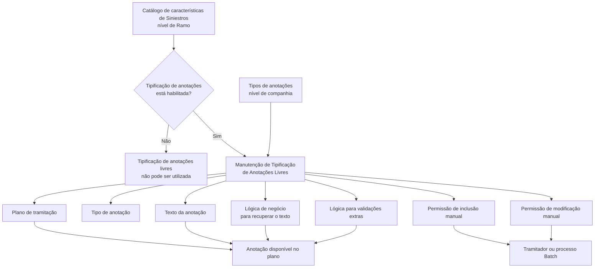

# Tipificação de Anotações Livres no Plano de Tramitação — Documentação Reef

## 1. Metadados do Documento
- **Arquivo de Origem:** `Não identificado no conteúdo fornecido`
- **Tipo de Documento:** `Procedimento`
- **Domínio / Sistema:** `DOCUMENTACIÓN Reef / Siniestros / Plano de tramitação`
- **Público-Alvo:** `Tramitadores e responsáveis pela configuração de catálogos de características de sinistros`
- **Data/Versão Identificada:** `Não identificada`

---

## 2. Resumo Executivo & Contexto de Negócio

O documento descreve como realizar a tipificação de anotações livres utilizadas em um plano de tramitação. A finalidade declarada é permitir que anotações livres sejam classificadas e disponibilizadas de maneira controlada durante a tramitação de expedientes.

A possibilidade de tipificar anotações depende de uma configuração prévia no catálogo de características de Siniestros no nível de Ramo. O catálogo deve indicar que a tipificação de anotações é permitida; sem esse parâmetro de Siniestros, o preenchimento do catálogo de tipificação não habilita o recurso.

A padronização busca reduzir a necessidade de digitação manual pelo tramitador e aumentar a homogeneidade dos planos de tramitação. O documento apresenta exemplos de textos que podem ser tipificados, como “No se ha podido contactar con el Asegurado”, “Vehículo Ausente” e “El perito no ha conseguido entrar en la propiedad”.

A manutenção da tipificação contém propriedades para associar a anotação a um plano, determinar o tipo de anotação, controlar inclusão e alteração manual pelo tramitador, definir o texto e associar lógica de negócio para obtenção dinâmica do texto ou para validações adicionais.

---

## 3. Arquitetura, Componentes & Tecnologias Envolvidas

Os componentes e conceitos identificados são:

- **DOCUMENTACIÓN Reef:** área de documentação na qual o conteúdo está publicado.
- **Mapfredocument:** elemento citado na área de documentação.
- **Siniestros:** domínio no qual existe um parâmetro de configuração que determina o uso da tipificação de anotações.
- **Catálogo de características de Siniestros a nível de Ramo:** configuração necessária para permitir a tipificação.
- **Tipos de anotações a nível de companhia:** origem obrigatória para o valor de “Tipo de anotação”.
- **Plano de tramitação:** contexto de utilização das anotações tipificadas.
- **Tramitador:** usuário que pode incluir ou modificar anotações manualmente, conforme os parâmetros configurados.
- **Processos Batch:** processos que podem utilizar anotações quando a inclusão manual não é permitida.
- **Lógica de negócio:** mecanismo configurável para recuperar texto dinâmico de uma anotação.
- **Lógica de validações extras:** mecanismo configurável para validar a inclusão de uma anotação livre no plano de tramitação.



> **Nota de Análise:** o documento não detalha interfaces, métodos HTTP, contratos JSON, tecnologias de persistência, execução dos processos Batch ou a implementação da lógica de negócio e das validações.

---

## 4. Regras de Negócio, Especificações Funcionais & Processos

1. A tipificação é aplicável às anotações livres utilizadas no plano de tramitação.
2. A tipificação somente é possível quando o catálogo de características de Siniestros, no nível de Ramo, indicar que as anotações podem ser tipificadas.
3. A anotação deve possuir um **Tipo de anotação** previamente definido nos tipos de anotações no nível de companhia.
4. A propriedade **Plan** determina a chave do plano no qual a anotação definida pode ser utilizada.
5. Pode ser utilizado um **plano genérico**, cujo significado é permitir a utilização da anotação em todos os planos.
6. A propriedade **Se puede incluir manualmente** determina se um tramitador pode incluir manualmente a anotação ou se a anotação será usada somente por processos Batch.
7. A propriedade **Texto de la Anotación** contém o texto da anotação.
8. Quando o texto não for fixo e depender de alguma condição, deve ser indicada uma **Lógica de Negócio para recuperar el texto**. Essa lógica retorna o texto da anotação ao plano de tramitação.
9. A propriedade **Se puede modificar el Texto de la Anotación** determina se o tramitador pode alterar manualmente o texto da anotação no plano.
10. A propriedade **Lógica para realizar validaciones extras** permite indicar lógica adicional para validar a inclusão da anotação livre no plano de tramitação.
11. O documento relaciona a tipificação a eficiência operacional, pois evita que o tramitador tenha de introduzir repetidamente textos livres.
12. O documento também relaciona a tipificação à homogeneidade dos planos de tramitação.

### Exemplos de anotações livres apresentados

- `No se ha podido contactar con el Asegurado`
- `Vehículo Ausente`
- `El perito no ha conseguido entrar en la propiedad`
- `Etc.`

---

## 5. Tabelas de Parâmetros, Ambientes e Estruturas de Dados

| Item / Parâmetro | Descrição / Função | Tipo / Valores / Formato | Ambiente / Observações |
| :--- | :--- | :--- | :--- |
| Catálogo de características de Siniestros a nível de Ramo | Indica se as anotações livres podem ser tipificadas. | Parâmetro de habilitação; valores não detalhados. | Pré-requisito para usar a tipificação. |
| Plan | Contém a chave do plano em que a anotação definida pode ser utilizada. | Chave de plano; formato não detalhado. | Pode receber um plano genérico. |
| Plano genérico | Permite que a anotação seja utilizada em todos os planos. | Plano genérico; identificador não detalhado. | Alternativa ao vínculo com um plano específico. |
| Tipo de anotação | Classifica a anotação livre. | Deve estar definido nos tipos de anotações a nível de companhia. | Valor específico não detalhado. |
| Se puede incluir manualmente | Controla se a anotação pode ser incluída manualmente por um tramitador. | Permissão; valores não detalhados. | Caso não seja permitida, a anotação é usada somente por processos Batch. |
| Texto de la Anotación | Armazena o texto da anotação. | Texto; formato e tamanho não detalhados. | Pode ser fixo ou obtido por lógica de negócio. |
| Lógica de Negócio para recuperar el texto | Retorna o texto da anotação quando o texto depende de uma condição. | Lógica de negócio; implementação não detalhada. | O texto retornado é usado pelo plano de tramitação. |
| Se puede modificar el Texto de la Anotación | Informa se o tramitador pode alterar manualmente o texto da anotação. | Permissão; valores não detalhados. | Aplicável no plano de tramitação. |
| Lógica para realizar validaciones extras | Executa validações ao incluir a anotação livre no plano de tramitação. | Lógica de validação; regras não detalhadas. | Critérios de validação não são apresentados. |
| Owner | Responsável listado na página de documentação. | `user:agonzalez_mapfre.com` | Informação apresentada na página 1. |
| Lifecycle | Estado de ciclo de vida do conteúdo. | `Approved` | Informação apresentada na página 1. |
| Source | Origem indicada na página de documentação. | `VL` | Informação apresentada na página 1. |

---

## 6. Bateria de Perguntas & Respostas para RAG (FAQ Sintético)

### P1: Qual é a finalidade da tipificação de anotações livres no plano de tramitação?
**R:** A finalidade é classificar anotações livres usadas no plano de tramitação. A tipificação reduz a necessidade de o tramitador inserir textos repetidamente e favorece a homogeneidade entre planos de tramitação.

### P2: Qual configuração é necessária para habilitar a tipificação de anotações livres?
**R:** O catálogo de características de Siniestros, no nível de Ramo, deve indicar que as anotações podem ser tipificadas. O documento informa que a tipificação só é possível sob essa condição.

### P3: Por que não é possível tipificar anotações livres mesmo após preencher o catálogo?
**R:** Porque existe um parâmetro no nível de Siniestros que determina se a tipificação de anotações é utilizada. O preenchimento do catálogo não é suficiente se esse parâmetro não estiver configurado para uso da tipificação.

### P4: O que representa a propriedade Plan na manutenção de tipificação?
**R:** A propriedade Plan contém a chave do plano no qual as anotações que estão sendo definidas podem ser utilizadas. Também pode ser usado um plano genérico para que a anotação seja utilizável em todos os planos.

### P5: De onde deve vir o Tipo de anotação configurado para uma anotação livre?
**R:** O Tipo de anotação deve estar previamente definido nos tipos de anotações no nível de companhia.

### P6: Quando um tramitador pode incluir uma anotação tipificada manualmente?
**R:** A inclusão manual depende do parâmetro “Se puede incluir manualmente”. Esse parâmetro indica se um tramitador pode inserir a anotação manualmente ou se a anotação será utilizada apenas por processos Batch.

### P7: Como deve ser tratado um texto de anotação que depende de uma condição?
**R:** Quando o texto não for fixo e depender de alguma condição, deve ser configurada a “Lógica de Negócio para recuperar el texto”. Essa lógica deve devolver o texto da anotação para o plano de tramitação.

### P8: O tramitador pode alterar o texto de uma anotação?
**R:** A possibilidade de alteração é definida pela propriedade “Se puede modificar el Texto de la Anotación”. Essa propriedade informa ao plano se o tramitador pode modificar manualmente o texto da anotação.

### P9: Para que serve a lógica de validações extras?
**R:** A “Lógica para realizar validaciones extras” serve para executar validações no momento de incluir uma anotação livre no plano de tramitação. O documento não especifica quais regras ou critérios de validação devem ser implementados.

### P10: Quais exemplos de anotações livres tipificáveis são fornecidos?
**R:** O documento apresenta como exemplos “No se ha podido contactar con el Asegurado”, “Vehículo Ausente” e “El perito no ha conseguido entrar en la propiedad”.

---

## 7. Glossário de Termos, Siglas & Conceitos-Chave

- **Anotaciones libres:** anotações livres que um tramitador pode realizar ao longo da tramitação de um expediente.
- **Tipificación de Anotaciones Libres:** classificação e definição controlada de anotações livres para uso em planos de tramitação.
- **Plan / Plano:** propriedade que contém a chave do plano no qual uma anotação pode ser utilizada.
- **Plano genérico:** plano que indica que uma anotação pode ser usada em todos os planos.
- **Plano de tramitação:** plano no qual as anotações livres tipificadas são utilizadas.
- **Tramitador:** usuário que realiza a tramitação de um expediente e, conforme os parâmetros, pode incluir ou modificar uma anotação.
- **Siniestros:** domínio citado para a configuração que habilita ou desabilita a tipificação de anotações.
- **Ramo:** nível no qual o catálogo de características de Siniestros deve indicar a possibilidade de tipificar anotações.
- **Batch:** processos utilizados para aplicar anotações quando a inclusão manual pelo tramitador não é permitida.
- **Lógica de Negócio:** lógica indicada para retornar o texto de uma anotação quando esse texto não é fixo.
- **Validações extras:** validações adicionais realizadas no momento da inclusão de uma anotação livre no plano de tramitação.
- **DOCUMENTACIÓN Reef:** área de documentação mencionada no conteúdo.
- **Lifecycle Approved:** estado de ciclo de vida exibido para o conteúdo na página de documentação.

---

## 8. Notas Críticas, Riscos & Limitações

- O uso da tipificação possui uma dependência explícita: o parâmetro de Siniestros no catálogo de características, no nível de Ramo, deve habilitar a tipificação.
- O documento não apresenta os valores possíveis, o nome técnico ou a localização de manutenção do parâmetro de Siniestros.
- O documento não detalha a estrutura, a linguagem, o mecanismo de execução ou os contratos da lógica de negócio usada para recuperar textos dinâmicos.
- O documento não define regras concretas para a lógica de validações extras.
- O documento não especifica os identificadores, os critérios de seleção ou a precedência entre plano específico e plano genérico.
- O documento cita processos Batch, mas não identifica os processos, seus gatilhos, sua frequência ou o comportamento de falha.
- Não são apresentados métodos de integração, APIs, estruturas de dados, campos técnicos, persistência, URLs de ambientes, servidores, portas ou rotas de logs.

---

## 9. Conteúdo Bruto Estruturado (Referência Fiel)

```text
--- [PÁGINA 1 DE 2] ---

DEFINICIÓN Tipos de Anotaciones
Objetivo
La nalidad de este documento es conocer cómo se puede tipicar la anotaciones libres, utilizadas en el Plan de tramitación. Esto sólo será
posible, si en el catálogo de características de Siniestros a nivel de Ramo, indica que se pueden tipicar las anotaciones.
Ejemplo: El tramitador puede realizar a lo largo de la tramitación de un expediente anotaciones libres. Pero por eciencia, se preere tenerlas
tipicadas para que el tramitador no tenga que introducirlas. También se tipican para tener más homogeneidad en los planes de tramitación.
No se ha podido contactar con el Asegurado
Vehículo Ausente
El perito no ha conseguido entrar en la propiedad
Etc.
Mantenimiento de Tipicación de Anotaciones Libres:
Documentation / DOCUMENTACIÓN Reef
DOCUMENTACIÓN Reef
Mapfredocument
DOCUMENTACIÓN Reef
Owner
user:agonzalez_mapfre.com
Lifecycle
Approved Source
 / 
 VL
Buscar Inicio Soluciones Arquitecturas APIs Componentes Cloud Documentación Zeus Reef Ayuda
ES


--- [PÁGINA 2 DE 2] ---

Propiedades
Plan
Esta propiedad contiene la clave del Plan en el que se puede utilizar las anotaciones que se están deniendo.
Puede utilizarse el plan genérico que indicará que se podrá utilizar en todos los planes.
Tipo de anotación
Tiene que estar denido en los tipos de anotaciones a nivel de compañía.
Se puede incluir manualmente
Este parámetro indica si la anotación puede ser incluida manualmente por un tramitador, o sólo se va a utilizar para procesos Batch.
Texto de la Anotación
Esta propiedad contiene el texto de la Anotación.
Lógica de Negocio para recuperar el texto
Si el texto de la anotación no es ja, sino que depende de alguna condición, este es el lugar para indicar la lógica de negocio que va a devolver
el texto de la anotación al plan de tramitación.
Se puede modicar el Texto de la Anotación
Esta propiedad indica al plan, si el texto de esta anotación la puede modicar manualmente el tramitador.
Lógica para realizar validaciones extras
Lógica para realizar validaciones a la hora de incluir la anotación libre en el plan de tramitación.
Preguntas frecuentes
¿Por qué no me deja tipicar las anotaciones libres, si he rellenado este catálago?
En este documento se explica que hay un parámetro a nivel de siniestros para indicar si se usa o no la tipicación de las anotaciones
```
