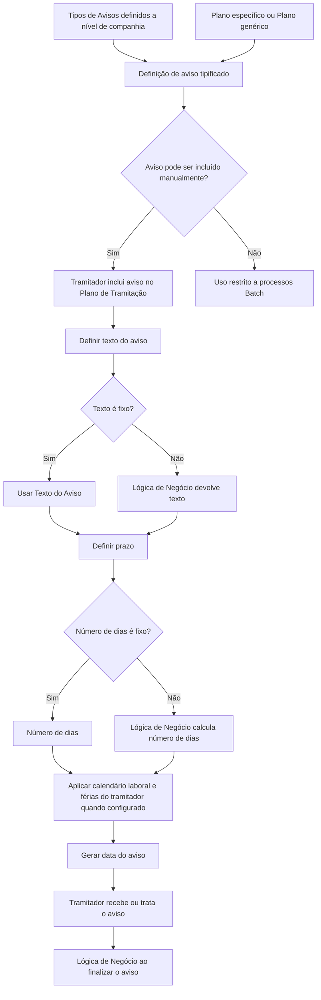

# Tipificação de Avisos no Plano de Tramitação REEF

## 1. Metadados do Documento
- **Arquivo de Origem:** Não identificado no conteúdo fornecido
- **Tipo de Documento:** Especificação Técnica / Procedimento Funcional
- **Domínio / Sistema:** REEF — Plano de Tramitação
- **Público-Alvo:** Desenvolvedores, analistas funcionais, tramitadores e operação
- **Data/Versão Identificada:** Não identificada

---

## 2. Resumo Executivo & Contexto de Negócio

O documento descreve a tipificação de avisos utilizados no Plano de Tramitação do sistema REEF. A finalidade declarada é permitir a definição prévia dos avisos mais recorrentes durante a tramitação de um expediente, evitando que o tramitador tenha de redigir manualmente os mesmos avisos repetidamente.

Os avisos podem ser usados para acompanhar prazos ou atividades pendentes que não puderam ser realizadas durante a tramitação. Entre os exemplos apresentados estão contactar o segurado, contactar o perito, verificar a chegada do resultado da perícia e verificar a chegada de uma fatura.

A tipificação promove eficiência operacional e homogeneidade entre os planos de tramitação. Um aviso tipificado pode estar associado a um plano específico ou ao plano genérico, permitindo reutilização em todos os planos.

A definição de um aviso inclui texto, possibilidade de inclusão manual, regras para alteração pelo tramitador, cálculo de prazo, validações de inclusão e validações ou lógicas executadas no encerramento. O cálculo da data do aviso pode considerar calendário laboral e férias do tramitador, conforme configuração de companhia.

---

## 3. Arquitetura, Componentes & Tecnologias Envolvidas

Os componentes e conceitos explicitamente citados são:

| Componente / Conceito | Papel identificado |
| :--- | :--- |
| REEF | Sistema ou domínio documental no qual está localizado o Plano de Tramitação. |
| Plano de Tramitação | Contexto no qual os avisos são definidos e utilizados. |
| Plano | Chave que determina em quais planos um aviso pode ser utilizado. |
| Plano genérico | Indica que o aviso pode ser utilizado em todos os planos. |
| Tramitador | Usuário que pode incluir, editar, finalizar ou receber avisos, conforme as propriedades configuradas. |
| Tipos de Avisos a nível de companhia | Cadastro corporativo no qual o tipo de aviso deve estar previamente definido. |
| Processos Batch | Processos que podem utilizar avisos não permitidos para inclusão manual. |
| Calendário laboral | Configuração corporativa que pode influenciar o cálculo da data do aviso. |
| Férias do tramitador | Fator que pode influenciar o cálculo da data do aviso. |
| Lógica de negócio | Mecanismo configurável para obter texto, calcular dias ou validar inclusão e finalização de avisos. |



> **Nota de Análise:** O documento não informa tecnologias de implementação, métodos HTTP, contratos de API, bancos de dados, URLs, servidores, portas ou detalhes de integração entre componentes.

---

## 4. Regras de Negócio, Especificações Funcionais & Processos

### 4.1 Finalidade da tipificação de avisos

1. O tramitador pode incluir avisos durante a tramitação de um expediente.
2. Os avisos permitem acompanhar prazos ou trâmites ainda não realizados.
3. Avisos frequentes podem ser tipificados previamente.
4. A tipificação evita a introdução manual repetitiva de avisos pelo tramitador.
5. A tipificação busca aumentar a homogeneidade entre os planos de tramitação.

### 4.2 Exemplos de avisos tipificados

- Contactar com o segurado.
- Contactar com o perito.
- Revisar se chegou o resultado da perícia.
- Revisar se chegou a fatura.

### 4.3 Associação do aviso a planos

1. A propriedade **Plan** contém a chave do plano em que os avisos definidos podem ser utilizados.
2. Pode ser utilizado o **plano genérico**.
3. O plano genérico indica que o aviso pode ser utilizado em todos os planos.

### 4.4 Tipo de aviso

1. O tipo de aviso deve estar definido nos tipos de avisos a nível de companhia.
2. O documento não detalha os valores possíveis para os tipos de avisos nem o processo de manutenção desse cadastro corporativo.

### 4.5 Inclusão manual e uso por processos Batch

1. A propriedade **Se puede incluir manualmente** determina se um aviso pode ser incluído manualmente por um tramitador.
2. Quando a inclusão manual não é permitida, o aviso é utilizado apenas por processos Batch.
3. O documento não detalha os processos Batch que criam ou utilizam avisos.

### 4.6 Texto do aviso

1. A propriedade **Texto del Aviso** contém o texto que será deixado no plano de tramitação.
2. O texto pode ser fixo ou depender de uma condição.
3. Quando o texto não é fixo, a propriedade **Lógica de Negocio para devolver el texto** deve indicar a lógica de negócio que devolverá o texto do aviso ao plano de tramitação.
4. A propriedade **Se puede modificar el Texto del Aviso** determina se o tramitador pode modificar manualmente o texto do aviso.

### 4.7 Cálculo da data do aviso

1. A propriedade **Número de días** contém a quantidade de dias a ser somada à data de ativação para gerar a data do aviso.
2. O exemplo textual estabelece que um aviso criado em 14 de fevereiro, com quatro dias configurados, deve avisar o tramitador em 18 de fevereiro.
3. O cálculo de dias é afetado pela definição corporativa que determina se devem ser considerados o calendário laboral e as férias do tramitador.
4. Quando calendário laboral e férias são considerados, o sistema pode somar mais do que a quantidade configurada de dias, em razão de dias festivos.
5. A propriedade **Lógica de Negocio que calcula el número de días** deve ser utilizada quando o número de dias não for fixo e depender de outras circunstâncias.
6. A lógica de cálculo de dias também considera o uso do calendário laboral, conforme a descrição do documento.
7. A propriedade **Se puede modificar el número de días?** determina se o tramitador pode modificar a quantidade de dias para o aviso.

### 4.8 Validação de inclusão do aviso

1. A propriedade **Lógica de Negocio para validar la inclusión del aviso en el plan** permite executar validações para delimitar a inclusão de determinados avisos no Plano de Tramitação.
2. O documento não especifica regras concretas de validação, condições, mensagens de erro ou comportamentos em caso de reprovação.

### 4.9 Finalização do aviso

1. A propriedade **Lógica de Negocio cuando se termina el aviso** permite executar uma validação quando o tramitador tenta finalizar um aviso.
2. Essa validação pode permitir ou impedir a finalização do aviso.
3. O documento não detalha os critérios de aprovação, rejeição ou efeitos posteriores da finalização.

---

## 5. Tabelas de Parâmetros, Ambientes e Estruturas de Dados

| Item / Parâmetro | Descrição / Função | Tipo / Valores / Formato | Ambiente / Observações |
| :--- | :--- | :--- | :--- |
| Plan | Contém a chave do plano no qual os avisos definidos podem ser utilizados. | Chave de plano; plano genérico também é permitido. | O plano genérico permite uso em todos os planos. |
| Tipo de Aviso | Identifica a categoria do aviso. | Deve estar definido nos tipos de avisos a nível de companhia. | Valores não detalhados. |
| Se puede incluir manualmente | Define se o aviso pode ser incluído manualmente pelo tramitador. | Sim / Não, conforme comportamento descrito. | Quando não permitido manualmente, o aviso é usado apenas por processos Batch. |
| Texto del Aviso | Texto deixado no Plano de Tramitação. | Texto fixo ou texto devolvido por lógica de negócio. | O conteúdo textual permitido não é especificado. |
| Lógica de Negocio para devolver el texto | Define a lógica que devolve o texto do aviso quando o texto não é fixo. | Lógica de negócio. | Condições e implementação não detalhadas. |
| Se puede modificar el Texto del Aviso | Define se o tramitador pode alterar manualmente o texto do aviso. | Permissão de alteração manual. | Valores concretos não detalhados. |
| Número de días | Quantidade de dias somada à data de ativação para gerar a data do aviso. | Número de dias ou valor calculado por lógica. | Pode ser afetado por calendário laboral e férias do tramitador. |
| Lógica de Negocio que calcula el número de días | Calcula a quantidade de dias quando ela não é fixa e depende de circunstâncias adicionais. | Lógica de negócio. | Também considera o uso do calendário laboral. |
| Se puede modificar el número de días? | Define se o tramitador pode modificar o número de dias do aviso. | Permissão de alteração manual. | Valores concretos não detalhados. |
| Lógica de Negocio para validar la inclusión del aviso en el plan | Executa validações para restringir a inclusão de certos avisos no plano. | Lógica de negócio. | Regras de validação não especificadas. |
| Lógica de Negocio cuando se termina el aviso | Executa validação quando o tramitador finaliza um aviso. | Lógica de negócio. | Pode permitir ou impedir o encerramento. |

| Data de ativação | Data do aviso | Observação |
| :--- | :--- | :--- |
| 14-02-2024 | 18-04-2024 | Valor apresentado literalmente na tabela do documento. |
| 20-02-2023 | 24-02-2024 | Valor apresentado literalmente na tabela do documento. |
| 14 de fevereiro | 18 de fevereiro | Exemplo narrativo: criação em 14 de fevereiro com quatro dias configurados. |

> **Nota de Análise:** A tabela de datas apresentada no documento parece inconsistente com a explicação de soma de quatro dias: `14-02-2024` para `18-04-2024` e `20-02-2023` para `24-02-2024` não representam uma soma simples de quatro dias. O conteúdo foi preservado sem correção, pois não há explicação adicional no material de origem.

---

## 6. Bateria de Perguntas & Respostas para RAG (FAQ Sintético)

### P1: Qual é o objetivo da tipificação de avisos no Plano de Tramitação?
**R:** A tipificação de avisos permite pré-definir os avisos mais utilizados durante a tramitação de um expediente. O objetivo é evitar que o tramitador tenha de introduzir manualmente avisos repetitivos e aumentar a homogeneidade entre os planos de tramitação.

### P2: Quais exemplos de avisos são citados no documento?
**R:** O documento cita os avisos: contactar com o segurado, contactar com o perito, revisar se chegou o resultado da perícia e revisar se chegou a fatura.

### P3: O que representa a propriedade Plan em um aviso tipificado?
**R:** A propriedade **Plan** contém a chave do plano em que o aviso pode ser utilizado. Também pode ser utilizado o plano genérico, que permite o uso do aviso em todos os planos.

### P4: Um aviso precisa estar previamente definido em algum cadastro corporativo?
**R:** Sim. O **Tipo de Aviso** deve estar definido nos tipos de avisos a nível de companhia. O documento não detalha o processo de criação ou manutenção desses tipos de avisos corporativos.

### P5: Quando um aviso pode ser incluído manualmente pelo tramitador?
**R:** A possibilidade de inclusão manual é determinada pela propriedade **Se puede incluir manualmente**. Quando essa propriedade permite a inclusão manual, o tramitador pode adicionar o aviso; quando não permite, o aviso é utilizado apenas para processos Batch.

### P6: Como o texto de um aviso pode ser definido?
**R:** O texto pode ser definido diretamente na propriedade **Texto del Aviso** quando for fixo. Quando o texto depender de uma condição, deve ser configurada uma **Lógica de Negocio para devolver el texto**, responsável por devolver o texto do aviso ao Plano de Tramitação.

### P7: O tramitador pode alterar o texto de um aviso?
**R:** Depende da propriedade **Se puede modificar el Texto del Aviso**. Essa propriedade informa ao plano se o texto do aviso pode ser modificado manualmente pelo tramitador.

### P8: Como é calculada a data de um aviso?
**R:** A data do aviso é gerada pela soma do valor de **Número de días** à data de ativação. O documento exemplifica que um aviso criado em 14 de fevereiro com quatro dias configurados deve gerar aviso em 18 de fevereiro.

### P9: O calendário laboral e as férias do tramitador influenciam o cálculo da data do aviso?
**R:** Sim. A definição a nível de companhia pode determinar que o cálculo considere o calendário laboral e as férias do tramitador. Nesse caso, podem ser somados mais dias do que o número configurado devido a dias festivos.

### P10: Como calcular o número de dias quando o prazo não é fixo?
**R:** Quando o número de dias depende de outras circunstâncias e não é fixo, deve ser utilizada a propriedade **Lógica de Negocio que calcula el número de días**. O documento informa que essa lógica também considera o uso do calendário laboral.

### P11: É possível validar se um aviso pode ser incluído no Plano de Tramitação?
**R:** Sim. A propriedade **Lógica de Negocio para validar la inclusión del aviso en el plan** permite executar validações para delimitar a inclusão de determinados avisos no Plano de Tramitação. O documento não apresenta critérios específicos dessas validações.

### P12: O que acontece quando o tramitador finaliza um aviso?
**R:** Pode ser executada a **Lógica de Negocio cuando se termina el aviso**. Essa lógica permite validar se o aviso pode ou não ser finalizado pelo tramitador.

---

## 7. Glossário de Termos, Siglas & Conceitos-Chave

- **REEF:** Sistema ou domínio mencionado na documentação e relacionado ao Plano de Tramitação.
- **Plano de Tramitação:** Estrutura utilizada para conduzir a tramitação de um expediente e onde avisos podem ser definidos ou utilizados.
- **Aviso:** Lembrete ou item de acompanhamento inserido durante a tramitação para controlar prazos ou atividades pendentes.
- **Aviso tipificado:** Aviso previamente definido para reutilização em planos de tramitação.
- **Tramitador:** Usuário que realiza atividades de tramitação e pode incluir, modificar ou finalizar avisos, conforme permissões configuradas.
- **Plano genérico:** Plano que indica que um aviso pode ser utilizado em todos os planos.
- **Batch:** Processo não manual mencionado como possível consumidor de avisos cuja inclusão manual não está habilitada.
- **Calendário laboral:** Calendário corporativo que pode ser considerado no cálculo dos dias até a data de aviso.
- **Lógica de Negócio:** Lógica configurável para devolver texto, calcular dias, validar inclusão ou validar finalização de avisos.
- **Perito:** Entidade citada como destinatário potencial de contacto em um aviso.
- **Peritação:** Processo cujo resultado é citado como objeto de acompanhamento por aviso.

---

## 8. Notas Críticas, Riscos & Limitações

- O documento não identifica nome de arquivo, versão, data de publicação ou responsável técnico completo.
- Não há definição técnica de tecnologias, APIs, integrações, persistência de dados, esquemas JSON, bancos de dados, URLs, servidores ou ambientes.
- Os processos Batch são citados, mas não são identificados nem detalhados.
- As lógicas de negócio são descritas somente como pontos de configuração; não são fornecidos critérios, regras executáveis, entradas, saídas ou mensagens de validação.
- Não são especificadas permissões, perfis de acesso ou regras de auditoria para criação, edição e finalização de avisos.
- A tabela de datas contém valores aparentemente incompatíveis com o exemplo de soma de quatro dias. Não há base documental para corrigir ou interpretar essa divergência.
- Não há detalhamento sobre o comportamento do sistema quando uma validação de inclusão ou de finalização reprova uma operação.

---

## 9. Conteúdo Bruto Estruturado (Referência Fiel)

```text
--- [PÁGINA 1 DE 3] ---

DEFINICIÓN Tipos de Avisos
Objetivo
La nalidad de este documento es conocer cómo se puede tipicar los avisos , utilizados en el Plan de tramitación.
Ejemplo:
El tramitador puede incluir a lo largo de la tramitación de un expediente, avisos para estar pendiente de plazos o de algún trámite que no se
ha podido realizar. Pero por eciencia, se puede decidir tener tipicados los más utilizados, para que el tramitador no tenga que introducirlos.
También se pueden tipicar para tener más homogeneidad en los planes de tramitación.
Contactar con el Asegurado.
Contactar con el Perito
Revisar que llegó el Resultado de la Peritación
Revisar que llegó la Factura
Etc.
Mantenimiento de Tipicación de Avisos:
Documentation / DOCUMENTACIÓN Reef
DOCUMENTACIÓN Reef
Mapfredocument
DOCUMENTACIÓN Reef
Owner
user:agonzalez_mapfre.com
Lifecycle
Approved Source
 / 
 VL
Buscar Inicio Soluciones Arquitecturas APIs Componentes Cloud Documentación Zeus Reef Ayuda
ES


--- [PÁGINA 2 DE 3] ---

Propiedades
Plan
Esta propiedad contiene la clave del Plan en el que se puedeN utilizar los avisos que se están deniendo.
Puede utilizarse el plan genérico que indicará que se podrá utilizar en todos los planes.
Tipo de Aviso
Tiene que estar denido en los tipos de avisos a nivel de compañía.
Se puede incluir manualmente
Este parámetro indica si el aviso puede ser incluido manualmente por un tramitador, o sólo se va a utilizar para procesos Batch.
Texto del Aviso
Esta propiedad contiene el texto del Aviso que se quiere dejar en el plan de tramitación.
Lógica de Negocio para devolver el texto
Si el texto del aviso no es jo, sino que depende de alguna condición, este es el lugar para indicar qué lógica de negocio va a devolver el texto
del aviso al plan de tramitación.
Se puede modicar el Texto del Aviso
Esta propiedad indica al plan, si el texto del aviso lo puede modicar manualmente el tramitador.
Número de días
Esta propiedad contendrá el número de días que tiene que sumar a la fecha de activación para generar la fecha de aviso.
Ejemplo
Si estoy creando un aviso el día 14 de Febrero y en esta propiedad contiene 4 días, eso le indicará al sistema que tiene que avisar al
tramitador el día 18 de febrero.


--- [PÁGINA 3 DE 3] ---

FECHA ACTIVACIÓN FECHA DEL AVISO
14-02-2024 18-04-2024
20-02-2023 24-02-2024
En el cálculo de los días va a afectar la denición a nivel de compañía que indica si se tiene en cuenta el calendario laboral y las vacaciones
del tramitador. En este caso puede ser que no se le sume 4 días, si no que se le pueden sumar más dependiendo de los días festivos.
Lógica de Negocio que calcula el número de días
Esta propiedad contendrá una lógica para calcular el número de días cuando no sea un número jo de días sino que dependa de otras
circunstancias. En este caso como en el del anterior atributo, también se tiene en cuenta el uso del calendario laboral.
Se puede modicar el número de días?
El tramitador puede modicar el número de días para dar el aviso?
Lógica de Negocio para validar la inclusión del aviso en el plan
Se puede realizar cualquier validación para delimitar la inclusión de ciertos avisos en el plan de tramitación.
Lógica de Negocio cuando se termina el aviso
Cuando el tramitador va a nalizar el aviso, se puede lanzar una validación para dejar o no que se termine el aviso.
```
