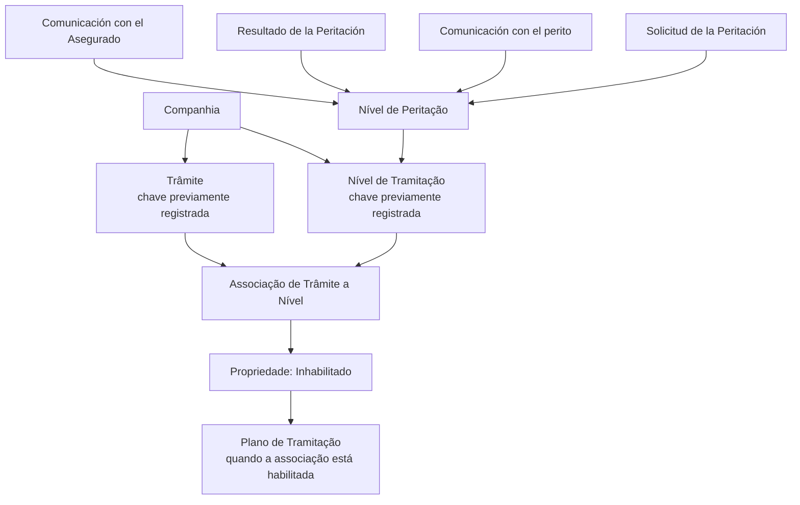
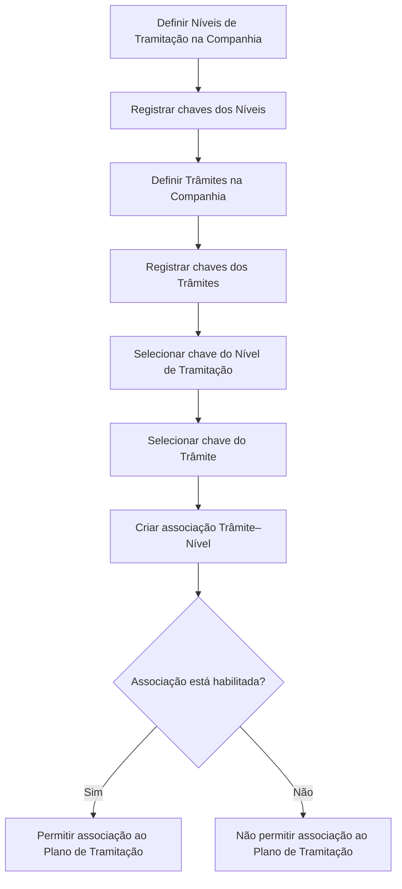

# Associação de Trâmites a Níveis de Tramitação — Documentação Reef

## 1. Metadados do Documento
- **Arquivo de Origem:** Não identificado no conteúdo fornecido
- **Tipo de Documento:** Procedimento
- **Domínio / Sistema:** Reef / Mapfre
- **Público-Alvo:** Negócio, Analistas Funcionais e Operação
- **Data/Versão Identificada:** Não identificada
- **Proprietário identificado:** `user:agonzalez_mapfre.com`
- **Ciclo de vida identificado:** Approved Source

---

## 2. Resumo Executivo & Contexto de Negócio

O documento explica o procedimento funcional para associar **trâmites** a diferentes **níveis de tramitação** no contexto da documentação Reef. Um nível de tramitação representa uma agrupação de trâmites da mesma natureza.

A associação deve ocorrer após duas definições prévias no nível de companhia: a definição dos níveis de tramitação e o registro dos trâmites. A associação conecta cada chave de trâmite à chave de um nível previamente registrado.

O exemplo apresentado é o **Nível de Peritação**, que agrupa todos os trâmites necessários para executar uma peritação do início ao fim. Entre os passos exemplificados estão solicitação, comunicação com o perito, resultado da peritação e comunicação com o segurado.

Cada associação possui uma propriedade de habilitação. A propriedade **Inhabilitado** determina se a associação entre trâmite e nível está habilitada para que possa ser associada a um **Plano de Tramitação**.

O documento afirma que um mesmo trâmite pode ser associado a diferentes níveis. Também menciona que, conforme documentos relacionados a cartas e estruturas associadas a trâmites, as descrições podem ser modificadas. Não há detalhamento adicional sobre métodos técnicos, contratos, interfaces, persistência de dados ou regras de validação.

---

## 3. Arquitetura, Componentes & Tecnologias Envolvidas

### Componentes e conceitos identificados

| Componente / Conceito | Papel descrito no documento |
| :--- | :--- |
| Reef | Contexto de documentação no qual o procedimento é apresentado. |
| Companhia | Escopo no qual as chaves de níveis e trâmites devem estar previamente registradas. |
| Nível de Tramitação | Agrupação de trâmites da mesma natureza. |
| Trâmite | Cada passo necessário para realizar um processo. |
| Associação Trâmite–Nível | Vínculo entre a chave de um trâmite e a chave de um nível de tramitação. |
| Plano de Tramitação | Artefato ao qual uma associação habilitada entre trâmite e nível pode ser associada. |
| Nível de Peritação | Exemplo de nível que reúne os trâmites necessários para realizar uma peritação de início a fim. |



> **Nota de Análise:** O documento descreve relações funcionais entre níveis, trâmites e planos de tramitação, mas não detalha arquitetura de software, APIs, tecnologias de implementação, banco de dados, métodos HTTP ou contratos JSON.

---

## 4. Regras de Negócio, Especificações Funcionais & Processos

### Definições funcionais

1. Um **Nível de Tramitação** é uma agrupação de trâmites da mesma natureza.
2. Um **Trâmite** é cada passo requerido para realizar um processo.
3. A propriedade **Nivel de Tramitación** contém a chave do nível ao qual os trâmites serão associados.
4. A chave do nível deve estar previamente registrada no nível de companhia.
5. A propriedade **Trámite** contém a chave do trâmite que está sendo associado ao nível.
6. A chave do trâmite deve estar previamente registrada no nível de companhia.
7. A propriedade **Inhabilitado** informa se a associação do trâmite ao nível está habilitada ou não.
8. Uma associação habilitada pode ser associada a um **Plano de Tramitação**.
9. Um mesmo trâmite pode ser associado a diferentes níveis.
10. As descrições podem ser modificadas, conforme a referência a documentos de cartas associadas a trâmites ou estruturas associadas a trâmites.

### Fluxo funcional de associação



### Exemplo funcional: Nível de Peritação

O **Nível de Peritação** agrupa os trâmites necessários para realizar uma peritação de início a fim. O documento lista como possíveis trâmites associados:

1. Solicitud de la Peritación.
2. Comunicación con el perito.
3. Resultado de la Peritación.
4. Comunicación con el Asegurado.

---

## 5. Tabelas de Parâmetros, Ambientes e Estruturas de Dados

| Item / Parâmetro | Descrição / Função | Tipo / Valores / Formato | Ambiente / Observações |
| :--- | :--- | :--- | :--- |
| Nivel de Tramitación | Contém a chave do nível ao qual os trâmites serão associados. | Chave de nível | Deve estar previamente registrada no nível de companhia. |
| Trámite | Contém a chave do trâmite que está sendo associado a um nível. | Chave de trâmite | Deve estar previamente registrada no nível de companhia. |
| Inhabilitado | Indica se a associação entre trâmite e nível está habilitada. | Habilitada ou não habilitada | Determina se a associação pode ser vinculada a um Plano de Tramitação. |
| Nível de Peritação | Agrupa os trâmites necessários para realizar uma peritação de início a fim. | Exemplo de nível de tramitação | Pode conter vários trâmites. |
| Solicitud de la Peritación | Passo exemplificado para o Nível de Peritação. | Trâmite | Não há detalhamento adicional. |
| Comunicación con el perito | Passo exemplificado para o Nível de Peritação. | Trâmite | Não há detalhamento adicional. |
| Resultado de la Peritación | Passo exemplificado para o Nível de Peritação. | Trâmite | Não há detalhamento adicional. |
| Comunicación con el Asegurado | Passo exemplificado para o Nível de Peritação. | Trâmite | Não há detalhamento adicional. |
| Owner | Proprietário identificado na página de documentação. | `user:agonzalez_mapfre.com` | Metadado exibido no conteúdo. |
| Lifecycle | Estado de ciclo de vida exibido na página. | `Approved Source` | Metadado exibido no conteúdo. |

---

## 6. Bateria de Perguntas & Respostas para RAG (FAQ Sintético)

### P1: O que é um Nível de Tramitação no contexto da documentação Reef?
**R:** Um Nível de Tramitação é uma agrupação de trâmites da mesma natureza. A propriedade de nível contém a chave do nível ao qual os trâmites serão associados, e essa chave deve estar previamente registrada no nível de companhia.

### P2: Qual é o pré-requisito para associar um trâmite a um nível?
**R:** Antes da associação, devem existir níveis de tramitação definidos no nível de companhia e trâmites definidos no nível de companhia. Tanto a chave do nível quanto a chave do trâmite precisam estar previamente registradas na companhia.

### P3: O que representa a propriedade Trámite na associação?
**R:** A propriedade Trámite contém a chave do trâmite que está sendo associado a um nível. O documento define o trâmite como cada passo requerido para realizar um processo.

### P4: Qual é a finalidade da propriedade Inhabilitado?
**R:** A propriedade Inhabilitado indica se a associação entre o trâmite e o nível está habilitada ou não. Essa condição determina se a associação pode ser vinculada a um Plano de Tramitação.

### P5: Uma associação de trâmite a nível inabilitada pode ser associada a um Plano de Tramitação?
**R:** Não. O documento informa que a propriedade Inhabilitado define se a associação está habilitada para poder ser associada a um Plano de Tramitação. Portanto, a associação precisa estar habilitada para esse vínculo.

### P6: Um mesmo trâmite pode ser associado a mais de um nível de tramitação?
**R:** Sim. A seção de perguntas frequentes afirma explicitamente que um trâmite pode ser associado a distintos níveis.

### P7: O que o Nível de Peritação representa?
**R:** O Nível de Peritação é um exemplo de nível de tramitação que agrupa todos os trâmites necessários para realizar uma peritação de início a fim.

### P8: Quais trâmites podem ser associados ao Nível de Peritação?
**R:** O documento cita como possíveis trâmites: Solicitud de la Peritación, Comunicación con el perito, Resultado de la Peritación e Comunicación con el Asegurado.

### P9: É possível alterar descrições relacionadas aos trâmites?
**R:** Sim. O documento afirma que, conforme documentos sobre cartas associadas a trâmites ou estruturas associadas a trâmites, as descrições podem ser modificadas. Não são fornecidos critérios, permissões ou procedimentos para essa modificação.

### P10: O documento especifica APIs, métodos HTTP ou contratos JSON para a associação de trâmites?
**R:** Não. O conteúdo fornecido descreve o comportamento funcional da associação de trâmites a níveis, mas não detalha APIs, métodos HTTP, contratos JSON, banco de dados, interfaces ou tecnologias de implementação.

---

## 7. Glossário de Termos, Siglas & Conceitos-Chave

- **Reef:** Contexto ou sistema identificado na documentação apresentada.
- **Nível de Tramitação / Nivel de Tramitación:** Agrupação de trâmites da mesma natureza.
- **Trâmite / Trámite:** Cada passo requerido para realizar um processo.
- **Associação de Trâmites a um Nível:** Vínculo entre a chave de um trâmite e a chave de um nível de tramitação.
- **Plano de Tramitação / Plan de Tramitación:** Artefato ao qual uma associação habilitada entre trâmite e nível pode ser associada.
- **Peritação / Peritación:** Processo exemplificado no documento, composto por trâmites desde a solicitação até a comunicação com o segurado.
- **Inhabilitado:** Propriedade que indica se uma associação entre trâmite e nível está habilitada ou não.
- **Asegurado:** Termo apresentado no trâmite “Comunicación con el Asegurado”; o documento não fornece definição adicional.
- **Perito:** Termo apresentado no trâmite “Comunicación con el perito”; o documento não fornece definição adicional.

---

## 8. Notas Críticas, Riscos & Limitações

- O documento não identifica o nome do arquivo de origem, data, versão ou autor documental, exceto pelo metadado de proprietário `user:agonzalez_mapfre.com`.
- Não há especificação de APIs, métodos HTTP, endpoints, contratos JSON, modelo de dados, tabelas físicas, integrações ou tecnologias de implementação.
- Não são descritas regras de unicidade para associações entre nível e trâmite.
- Não são descritas validações para chaves inexistentes, associações duplicadas ou alterações de associações já vinculadas a um Plano de Tramitação.
- O documento não detalha perfis de acesso, matriz de permissões, auditoria, rastreabilidade ou responsáveis por criar e alterar associações.
- A possibilidade de modificar descrições é mencionada, mas o procedimento, as condições e os limites dessa modificação não são detalhados.
- **Nota de Análise:** O conteúdo descreve o microsserviço ou componente Reef apenas como contexto documental; não há evidência suficiente para inferir arquitetura técnica adicional.

---

## 9. Conteúdo Bruto Estruturado (Referência Fiel)

```text
--- [PÁGINA 1 DE 2] ---

DEFINICIÓN Asociar Trámites a Nivel
Objetivo
La nalidad de este documento, es explicar como se le puede asociar trámites a los distintos niveles. Los niveles, son agrupaciones de
trámites de la misma naturaleza.
Una vez que se han denido los distintos Niveles de tramitación a nivel de compañía y se han denido los distintos Trámites, se tiene que
realizar la asociación de los trámites a cada nivel.
Imagen del Mantenimiento Asociación de Trámites a un Nivel:
Propiedades
Nivel de Tramitación
El Nivel es la agrupación de trámites de la misma naturaleza. Esta propiedad contendrá la clave del nivel al que se le va a asociar los
trámites.La clave del nivel tiene que estar registrada previamente a nivel de compañía.
Documentation / DOCUMENTACIÓN Reef
DOCUMENTACIÓN Reef
Mapfredocument
DOCUMENTACIÓN Reef
Owner
user:agonzalez_mapfre.com
Lifecycle
Approved Source
 / 
 VL
Buscar Inicio Soluciones Arquitecturas APIs Componentes Cloud Documentación Zeus Reef Ayuda
ES


--- [PÁGINA 2 DE 2] ---

Por ejemplo:
Nivel de Peritación
Agrupará todos los trámites necesarios para realizar una peritación de inicio a n.
Trámite
El trámite es cada Paso que se requiere para realizar un proceso. Esta propiedad contendrá la clave del trámite que se está asociando a un
nivel. La clave del trámite tiene que estar registrada a nivel de compañía.
Por ejemplo en el Nivel de Peritación se podrían asociar los siguientes trámites o pasos:
Solicitud de la Peritación
Comunicación con el perito
Resultado de la Peritación
Comunicación con el Asegurado
Inhabilitado
Esta propiedad indica si la asociación del trámite al nivel, está habilitada o no, para poder asociarlo a un Plan de Tramitación.
Preguntas frecuentes
¿Se puede asociar un trámite a distintos niveles?
Si, y como hemos visto en los documentos de cartas asociadas a trámites o estructuras asociadas a trámites, podemos modicar las
descripciones.
```
