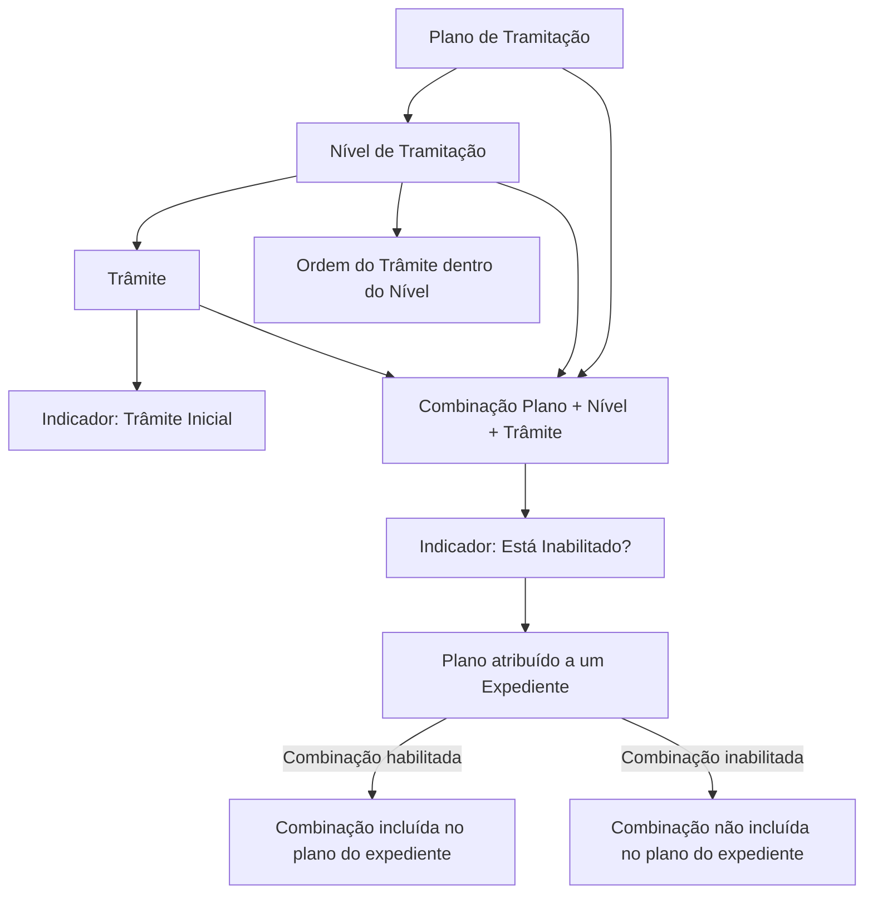
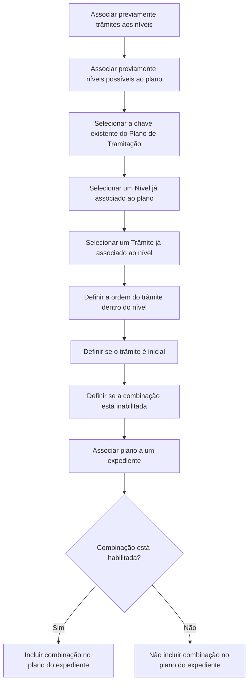

# Associação de Trâmites e Níveis a Planos de Tramitação — Documentação Reef

## 1. Metadados do Documento
- **Arquivo de Origem:** Não identificado no conteúdo fornecido
- **Tipo de Documento:** Especificação Técnica / Manual Funcional
- **Domínio / Sistema:** Reef / Mapfre — Planos de Tramitação
- **Público-Alvo:** Analistas funcionais, tramitadores, desenvolvedores e equipes de operação
- **Data/Versão Identificada:** Não identificada
- **Owner identificado:** `user:agonzalez_mapfre.com`
- **Lifecycle identificado:** `Approved Source`

---

## 2. Resumo Executivo & Contexto de Negócio

O documento descreve a definição de um plano de tramitação completo por meio da associação entre um Plano de Tramitação, os seus Níveis de Tramitação e os Trâmites que podem ser executados em cada nível. O objetivo funcional é permitir que um plano reúna os níveis possíveis e que cada nível contenha os trâmites aplicáveis, organizados em uma sequência operacional.

A configuração possui pré-requisitos explícitos: os trâmites devem ter sido associados previamente aos níveis de tramitação, e os níveis possíveis devem ter sido associados previamente ao plano que está sendo definido. Portanto, a associação de um trâmite a um plano e nível não cria automaticamente essas dependências anteriores.

A associação de um nível a um plano não torna a execução do nível obrigatória. Da mesma forma, associar um trâmite a um nível de um plano não implica que o trâmite será necessariamente executado. Essas associações indicam disponibilidade no contexto do plano de tramitação.

O documento também estabelece regras para ordenar os trâmites dentro de um nível, indicar quais trâmites devem aparecer inicialmente e controlar se uma combinação específica de plano, nível e trâmite está habilitada. Quando um plano é atribuído a um expediente, somente as combinações habilitadas fazem parte do plano de tramitação do expediente.

---

## 3. Arquitetura, Componentes & Tecnologias Envolvidas

Os componentes funcionais identificados são:

| Componente | Função identificada |
| :--- | :--- |
| Plano de Tramitação | Entidade que agrupa os níveis possíveis e os trâmites associados a cada nível. |
| Nível de Tramitação | Etapa associada previamente ao Plano de Tramitação. Pode conter um ou mais trâmites. |
| Trâmite | Item de trabalho associado previamente a um Nível de Tramitação. Pode ser associado ao plano e ao nível definidos. |
| Expediente | Contexto ao qual o Plano de Tramitação é atribuído. Recebe as combinações habilitadas de plano, nível e trâmite. |
| Propriedade de Ordem | Define a posição de um trâmite dentro de um nível. |
| Indicador Inicial | Define se o trâmite aparece inicialmente para a tramitação do nível. |
| Indicador de Inabilitação | Define se a combinação de plano, nível e trâmite participa ou não do plano quando este é atribuído a um expediente. |
| Reef | Sistema/documentação corporativa em que o conteúdo está publicado. |
| Mapfre | Contexto corporativo identificado no conteúdo e nos exemplos. |



**Nota de Análise:** o documento descreve entidades funcionais e suas regras de associação, mas não detalha interfaces de integração, métodos HTTP, contratos JSON, banco de dados, tecnologias de implementação, URLs de ambientes ou mecanismos de autenticação.

---

## 4. Regras de Negócio, Especificações Funcionais & Processos

### 4.1 Objetivo da associação entre planos, níveis e trâmites

A finalidade é definir um plano de tramitação completo. Para os níveis previamente associados a um plano, devem ser definidos os trâmites associados a cada nível.

A configuração depende das seguintes associações anteriores:

1. Os trâmites devem estar associados previamente aos níveis.
2. Os níveis possíveis devem estar associados previamente ao plano que está sendo definido.
3. O código do nível associado deve já estar associado ao Plano de Tramitação.
4. O trâmite associado ao plano e nível deve já estar associado ao respectivo Nível de Tramitação.

### 4.2 Regra de obrigatoriedade

A associação não determina obrigatoriedade de execução:

- Associar um nível a um plano não significa que o nível seja obrigatório.
- Associar um trâmite a um nível de um plano não significa que o trâmite seja obrigatório.
- A associação concede a possibilidade de executar o nível ou o trâmite quando necessário.

### 4.3 Propriedade: Plano de Tramitação

A propriedade **Plano de Tramitação** contém a chave do plano ao qual os níveis e trâmites serão associados.

Regras:

1. A chave do Plano de Tramitação deve existir no nível de companhia.
2. O documento apresenta como exemplo o plano `PL01 - Plan de Daños Materiales`.
3. Nas tabelas de exemplo, o plano aparece como `PL001 Plan Daños Materiales`.

### 4.4 Propriedade: Nível

A propriedade **Nível** contém a chave ou o código do nível associado ao plano.

Regras:

1. O código do nível deve estar associado previamente ao Plano de Tramitação.
2. O nível representa uma etapa de tramitação dentro do plano.
3. Um plano pode possuir vários níveis.

Níveis exemplificados:

- `N01 — Comprobación de Póliza`
- `N02 — Nivel de Documentación`
- `N03 — Nivel de Peritación`
- `N04 — Nivel Pago a Proveedor`

### 4.5 Propriedade: Trâmite

A propriedade **Trâmite** contém a chave utilizada para identificar os diferentes trâmites.

Regras:

1. Para associar um trâmite a um plano e nível, o trâmite deve estar associado previamente ao Nível de Tramitação.
2. Um trâmite pode estar em vários níveis de um mesmo plano.
3. Um mesmo trâmite pode ser inicial em um nível e não inicial em outro nível do mesmo plano.

### 4.6 Propriedade: Ordem do Trâmite dentro do Nível

A propriedade **Orden del Trámite dentro del Nivel** define a posição do trâmite dentro do nível.

Regras:

1. Quando um nível possui vários trâmites, a ordem determina como os trâmites aparecem no nível.
2. A ordem é definida por trâmite dentro do respectivo nível.
3. Os exemplos documentam sequências numeradas de `1` a `7` no nível `N03`.

### 4.7 Propriedade: Trâmite Inicial

Os **Trâmites iniciais** são aqueles normalmente necessários para tramitar o nível de tramitação.

Regras:

1. Um trâmite necessário normalmente para tramitar um nível deve ser definido como inicial.
2. Um trâmite necessário apenas em poucas ocasiões ou de forma excepcional deve ser indicado para não aparecer inicialmente.
3. Mesmo que não apareça inicialmente, o tramitador pode incluir o trâmite no plano do expediente quando necessário.
4. Se um nível possuir apenas um trâmite, esse trâmite deve ser inicial.
5. O indicador apresentado nos exemplos utiliza `S` e `N`.

### 4.8 Propriedade: Está Inabilitado?

A propriedade **Está Inhabilitado?** indica se uma combinação de plano, nível e trâmite está inabilitada.

Regras:

1. Se a combinação plano, nível e trâmite estiver habilitada, a combinação estará presente no Plano de Tramitação quando o plano for atribuído a um expediente.
2. Se a combinação plano, nível e trâmite estiver inabilitada, a combinação não estará presente no Plano de Tramitação do expediente.
3. O documento não especifica os valores técnicos usados para representar habilitado ou inabilitado.

### 4.9 Fluxo funcional de configuração



---

## 5. Tabelas de Parâmetros, Ambientes e Estruturas de Dados

### 5.1 Propriedades funcionais

| Item / Parâmetro | Descrição / Função | Tipo / Valores / Formato | Ambiente / Observações |
| :--- | :--- | :--- | :--- |
| Plano de Tramitação | Chave do plano ao qual níveis e trâmites serão associados. | Chave do plano; exemplo: `PL01` ou `PL001`. | A chave deve existir em nível de companhia. |
| Nível | Chave ou código do nível associado ao plano. | Código de nível; exemplos: `N01`, `N02`, `N03`, `N04`. | O nível deve estar associado previamente ao Plano de Tramitação. |
| Trâmite | Chave que identifica os diferentes trâmites. | Código e descrição; exemplos: `T1`, `T2`, `T14`. | O trâmite deve estar associado previamente ao Nível de Tramitação. |
| Ordem do Trâmite dentro do Nível | Determina a posição em que o trâmite aparece quando um nível possui vários trâmites. | Número sequencial; exemplos: `1` a `7`. | Aplicável aos trâmites de cada nível. |
| Inicial? | Indica se o trâmite aparece inicialmente no nível. | `S` ou `N`, conforme os exemplos. | Se o nível tiver um único trâmite, o trâmite deve ser inicial. |
| Está Inabilitado? | Indica se a combinação plano, nível e trâmite está inabilitada. | Valores não especificados no documento. | Combinações inabilitadas não são incluídas quando o plano é atribuído a um expediente. |

### 5.2 Planos e níveis exemplificados

| Plano | Descrição do Plano | Nível | Descrição do Nível | Observações |
| :--- | :--- | :--- | :--- | :--- |
| `PL01` | Plan de Daños Materiales | Não informado | Não informado | Exemplo da propriedade Plano de Tramitação. |
| `PL001` | Plan Daños Materiales | `N01` | Comprobación de Póliza | Exemplo de associação plano-nível. |
| `PL001` | Plan Daños Materiales | `N02` | Nivel de Documentación | Exemplo de associação plano-nível. |
| `PL001` | Plan Daños Materiales | `N03` | Nivel de Peritación | Exemplo de associação plano-nível. |
| Não informado | Não informado | `N04` | Nivel Pago a Proveedor | Exemplo apresentado em tabela posterior. |

### 5.3 Trâmites e ordem dentro dos níveis

| Plano | Nível | Trâmite | Ordem do Trâmite | Observações |
| :--- | :--- | :--- | :--- | :--- |
| `PL001` — Plan Daños Materiales | `N01` — Comprobación de Póliza | `T1` — Comprobar Recibos | `1` | O texto extraído apresenta o valor como `__1 __`. |
| `PL001` — Plan Daños Materiales | `N02` — Nivel de Documentación | `T2` — Registrar Documentos | `1` | — |
| `PL001` — Plan Daños Materiales | `N02` — Nivel de Documentación | `T3` — Carta de Solicitud Documentos | `2` | — |
| `PL001` — Plan Daños Materiales | `N03` — Nivel de Peritación | `T4` — Solicitud de Peritación | `1` | — |
| `PL001` — Plan Daños Materiales | `N03` — Nivel de Peritación | `T5` — Fijar Asegurado Nueva cita | `2` | — |
| `PL001` — Plan Daños Materiales | `N03` — Nivel de Peritación | `T6` — Nueva Solicitud de Peritación | `3` | — |
| `PL001` — Plan Daños Materiales | `N03` — Nivel de Peritación | `T7` — Resultado de la Peritación | `4` | — |
| `PL001` — Plan Daños Materiales | `N03` — Nivel de Peritación | `T8` — Comunicación Entrega Vehículo | `5` | — |
| `PL001` — Plan Daños Materiales | `N03` — Nivel de Peritación | `T9` — Confirmación Pérdida Total | `6` | — |
| `PL001` — Plan Daños Materiales | `N03` — Nivel de Peritación | `T10` — Comunicación Asegurado Pérdida Total | `7` | — |
| Não informado | `N04` — Nivel Pago a Proveedor | `T14` — Pago al Taller | `1` | — |

### 5.4 Configuração de trâmites iniciais

| Plano | Nível | Trâmite | Ordem | Inicial? | Observações |
| :--- | :--- | :--- | :--- | :--- | :--- |
| `PL001` — Plan Daños Materiales | `N01` — Comprobación de Póliza | `T1` — Comprobar Recibos | `1` | `S` | Nível com um único trâmite no exemplo. |
| `PL001` — Plan Daños Materiales | `N02` — Nivel de Documentación | `T2` — Registrar Documentos | `1` | `S` | — |
| `PL001` — Plan Daños Materiales | `N02` — Nivel de Documentación | `T3` — Carta de Solicitud Documentos | `2` | `N` | Pode ser incluído pelo tramitador quando necessário. |
| `PL001` — Plan Daños Materiales | `N03` — Nivel de Peritación | `T4` — Solicitud de Peritación | `1` | `S` | — |
| `PL001` — Plan Daños Materiales | `N03` — Nivel de Peritación | `T5` — Fijar Asegurado Nueva cita | `2` | `N` | — |
| `PL001` — Plan Daños Materiales | `N03` — Nivel de Peritación | `T6` — Nueva Solicitud de Peritación | `3` | `N` | — |
| `PL001` — Plan Daños Materiales | `N03` — Nivel de Peritación | `T7` — Resultado de la Peritación | `4` | `S` | — |
| `PL001` — Plan Daños Materiales | `N03` — Nivel de Peritación | `T8` — Comunicación Entrega Vehículo | `5` | `S` | — |
| `PL001` — Plan Daños Materiales | `N03` — Nivel de Peritación | `T9` — Confirmación Pérdida Total | `6` | `N` | — |
| `PL001` — Plan Daños Materiales | `N03` — Nivel de Peritación | `T10` — Comunicación Asegurado Pérdida Total | `7` | `N` | — |
| Não informado | `N04` — Nivel Pago a Proveedor | `T14` — Pago al Taller | `1` | `S` | Nível com um único trâmite no exemplo. |

---

## 6. Bateria de Perguntas & Respostas para RAG (FAQ Sintético)

### P1: Qual é o objetivo de associar trâmites e níveis a um Plano de Tramitação?
**R:** O objetivo é definir um Plano de Tramitação completo. Para cada nível previamente associado ao plano, são definidos os trâmites que podem ser associados a esse nível dentro do plano.

### P2: Associar um nível a um Plano de Tramitação torna a execução desse nível obrigatória?
**R:** Não. A associação de um nível a um Plano de Tramitação não significa que o nível seja obrigatório. A associação apenas permite que o nível seja executado quando necessário.

### P3: Associar um trâmite a um nível de um plano torna esse trâmite obrigatório?
**R:** Não. Associar um trâmite a um nível de um Plano de Tramitação indica que o trâmite pode ser utilizado nesse contexto, mas não estabelece que a execução do trâmite seja obrigatória.

### P4: Quais pré-requisitos existem para associar um trâmite a um plano e a um nível?
**R:** O trâmite deve ter sido associado previamente ao Nível de Tramitação. Além disso, o nível selecionado deve estar previamente associado ao Plano de Tramitação que está sendo definido.

### P5: O que a propriedade Plano de Tramitação deve conter?
**R:** A propriedade Plano de Tramitação deve conter a chave do plano ao qual os níveis e os trâmites serão associados. Essa chave deve existir em nível de companhia. O documento apresenta `PL01 - Plan de Daños Materiales` como exemplo.

### P6: Para que serve a Ordem do Trâmite dentro do Nível?
**R:** A Ordem do Trâmite dentro do Nível define a posição em que cada trâmite aparece quando um nível possui vários trâmites. Por exemplo, no nível `N03 — Nivel de Peritación`, os trâmites vão de `T4` na ordem `1` até `T10` na ordem `7`.

### P7: O que caracteriza um trâmite inicial?
**R:** Um trâmite inicial é aquele normalmente necessário para tramitar um determinado nível. Trâmites necessários apenas em poucas ocasiões ou de maneira excepcional podem ser configurados para não aparecer inicialmente, embora possam ser incluídos pelo tramitador no plano do expediente quando necessário.

### P8: Qual regra se aplica quando um nível possui apenas um trâmite?
**R:** Se o nível tiver apenas um trâmite, esse trâmite deve ser inicial. Nos exemplos, `T1 — Comprobar Recibos` no nível `N01` e `T14 — Pago al Taller` no nível `N04` estão marcados como iniciais.

### P9: Um mesmo trâmite pode estar associado a vários níveis dentro do mesmo plano?
**R:** Sim. O documento afirma que um Trâmite pode estar em vários Níveis de um mesmo plano sem problema. Além disso, o mesmo trâmite pode ser inicial em um nível e não inicial em outro nível do mesmo plano.

### P10: O que acontece se a combinação de plano, nível e trâmite estiver inabilitada?
**R:** Se a combinação de plano, nível e trâmite estiver inabilitada, ela não será incluída no Plano de Tramitação quando esse plano for atribuído a um expediente.

### P11: O que acontece se a combinação de plano, nível e trâmite estiver habilitada?
**R:** Se a combinação estiver habilitada, ela será incluída no Plano de Tramitação quando o plano for atribuído a um expediente.

### P12: Quais trâmites do nível N03 — Nivel de Peritación estão configurados como iniciais no exemplo?
**R:** No exemplo, os trâmites iniciais do nível `N03 — Nivel de Peritación` são `T4 — Solicitud de Peritación`, `T7 — Resultado de la Peritación` e `T8 — Comunicación Entrega Vehículo`.

---

## 7. Glossário de Termos, Siglas & Conceitos-Chave

- **Plano de Tramitação:** Entidade que contém os níveis possíveis e os trâmites associados a cada nível.
- **Nível de Tramitação:** Etapa de tramitação associada a um Plano de Tramitação.
- **Trâmite:** Item identificado por uma chave, associado previamente a um Nível de Tramitação e posteriormente associado ao plano e nível configurados.
- **Expediente:** Contexto que recebe um Plano de Tramitação atribuído; as combinações habilitadas integram o plano do expediente.
- **Trâmite Inicial:** Trâmite necessário normalmente para tramitar um nível e que deve aparecer inicialmente.
- **Inabilitado:** Estado de uma combinação de plano, nível e trâmite que impede a sua inclusão no plano quando este é atribuído a um expediente.
- **PL01 / PL001:** Códigos de Plano de Tramitação usados nos exemplos do documento.
- **N01 / N02 / N03 / N04:** Códigos de Nível de Tramitação usados nos exemplos.
- **T1 a T14:** Códigos de Trâmites usados nos exemplos.
- **Reef:** Nome identificado na documentação e na navegação apresentada no conteúdo bruto.
- **Mapfre:** Contexto corporativo identificado no conteúdo fornecido.
- **S / N:** Valores utilizados nos exemplos para indicar se um trâmite é inicial; o documento não expande formalmente as siglas, mas as emprega no campo `INICIAL?`.

---

## 8. Notas Críticas, Riscos & Limitações

- O documento exige associações prévias entre trâmites e níveis, bem como entre níveis e planos. A ausência dessas configurações anteriores impede a associação descrita.
- A chave do Plano de Tramitação deve existir no nível de companhia.
- A associação de níveis e trâmites não implica obrigatoriedade de execução; interpretar as associações como obrigatórias seria incorreto.
- A definição incorreta da ordem pode alterar a sequência de apresentação dos trâmites dentro de um nível.
- Um trâmite não inicial continua disponível para inclusão manual pelo tramitador quando necessário.
- Uma combinação inabilitada não integra o Plano de Tramitação atribuído ao expediente.
- O documento não informa valores técnicos, campos de persistência, serviços, APIs, URLs, permissões, mecanismos de auditoria ou interfaces para a propriedade **Está Inabilitado?**.
- O documento não detalha como ocorre a validação técnica de existência da chave do plano em nível de companhia.
- Há variação entre `PL01` e `PL001` nos exemplos apresentados; o texto não esclarece se representam códigos distintos ou apenas variação de exemplo.
- A extração contém caracteres corrompidos em palavras como `denir`, `nalidad` e `Conrmación`; o significado foi preservado conforme o contexto textual.

---

## 9. Conteúdo Bruto Estruturado (Referência Fiel)

```text
--- [PÁGINA 1 DE 3] ---

DEFINICIÓN Asociar Trámites y Niveles al Plan
Objetivo
La nalidad es denir un plan de tramitación completo, es decir a los niveles que le se le ha asociado anteriormente al plan, se le van a denir
que trámites se le van a asociar a cada uno de esos niveles.
Previa a esta denición se han asociado los trámites a los niveles, y se ha asociado al plan que se está deniendo, los niveles posibles.
El asociar un nivel a un plan no signica que sea obligatorio realizarlo, sino que van a tener la posibilidad, si se necesita,de ejecutarlo. Lo
mismo pasa al asociar un trámite a un nivel del plan que se está deniendo.
Imagen del Asociación de Trámites y Niveles a Planes de Tramitación:
Propiedades
Plan de Tramitación
Documentation / DOCUMENTACIÓN Reef
DOCUMENTACIÓN Reef
Mapfredocument
DOCUMENTACIÓN Reef
Owner
user:agonzalez_mapfre.com
Lifecycle
Approved Source
 / 
 VL
Buscar Inicio Soluciones Arquitecturas APIs Componentes Cloud Documentación Zeus Reef Ayuda
ES


--- [PÁGINA 2 DE 3] ---

Esta propiedad contendrá la clave del Plan de Tramitación al cual se le va a asociar los distintos niveles y trámites. Esta clave tiene que existir
a nivel de compañía.
Ejemplo:
PL01- Plan de Daños Materiales
Nivel
Esta propiedad contendrá la clave o el código del nivel que se está asociando al plan. Este código de Nivel tiene que estar asociado
previamente al plan de tramitación Niveles de un Plan
Ejemplo:
PLAN NIVEL
PL001 Plan Daños Materiales N01 Comprobación de Póliza
N02 Nivel de Documentación
N03 Nivel de Peritación
Trámite
Esta propiedad contendrá la clave por la que se van a identicar los distintos Trámites. Para poder asociar el trámite al plan y al nivel que se
está deniendo, tiene que estar previamente asociado al Nivel de tramitación. Trámites de un Nivel.
Orden del Trámite dentro del Nivel
Esta propiedad va a tener el orden que va a ocupar el Trámite dentro del Nivel. Es decir cuando en nivel tenga varios trámites en que orden va
a aparecer este que se está deniendo.
PLAN NIVEL TRÁMITE ORDEN DEL
TRÁMITE
PL001 Plan Daños
Materiales
N01 Comprobación de
Póliza
T1- Comprobar Recibos __1 __
N02 Nivel de
Documentación
T2- Registrar Documentos 1
T3- Carta de Solicitud Documentos 2
N03 Nivel de Peritación T4 Solicitud de Peritación 1
T5 Fijar Asegurado Nueva cita 2
T6 Nueva Solicitud de Peritación 3
T7 Resultado de la Peritación 4
T8 Comunicación Entrega Vehículo 5
T9 Conrmación Pérdida Total 6
T10 Comunicación Asegurado Pérdida
Total
7


--- [PÁGINA 3 DE 3] ---

PLAN NIVEL TRÁMITE ORDEN DEL
TRÁMITE
N04 Nivel Pago a
Proveedor
T14 - Pago al Taller 1
¿Es Un Trámite Inicial ?
Se denirán como Trámites iniciales aquellos que se van a necesitar normalmente para tramitar el nivel de tramitación.
Si el trámite se va a necesitar en pocas ocasiones o es excepcional, se indicará que NO salga inicialmente, aunque si el tramitador lo
necesita, podrá incluirlo en el plan del expediente. Si el nivel sólo tiene un trámite, este tiene que ser Inicial.
Ejemplo:
PLAN NIVEL TRÁMITE ORDEN INICIAL?
PL001 Plan Daños
Materiales
N01 Comprobación de
Póliza
T1- Comprobar Recibos 1 S
N02 Nivel de
Documentación
T2- Registrar Documentos 1 S
T3- Carta de Solicitud Documentos 2 N
N03 Nivel de Peritación T4 Solicitud de Peritación 1 S
T5 Fijar Asegurado Nueva cita 2 N
T6 Nueva Solicitud de Peritación 3 N
T7 Resultado de la Peritación 4 S
T8 Comunicación Entrega Vehículo 5 S
T9 Conrmación Pérdida Total 6 N
T10 Comunicación Asegurado Pérdida
Total
7 N
N04 Nivel Pago a
Proveedor
T14 - Pago al Taller 1 S
Está Inhabilitado?
Esta propiedad indica si la combinación de plan, nivel, trámite está inhabilitado o no. Si está habilitado cuando se asigne el plan a un
expediente el plan de tramitación tendrá esta combinación, si no está habilitado no.
Preguntas frecuentes
¿Un Trámite puede estar en varios Niveles de un mismo plan? Si, no hay problema. Incluso en un nivel puede ser inicial y otro nivel del
mismo plan no.
```
