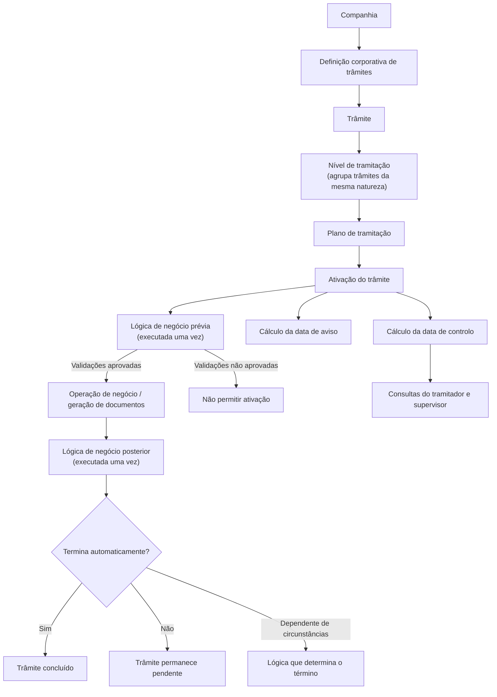

# Definição de Trâmites para Planos de Tramitação — Propriedades, Regras e Controles

## 1. Metadados do Documento
- **Arquivo de Origem:** `Não identificado no conteúdo fornecido`
- **Tipo de Documento:** `Especificação Técnica / Funcional`
- **Domínio / Sistema:** `Planos de tramitação; documentação Reef`
- **Público-Alvo:** `Analistas funcionais, desenvolvedores, tramitadores, supervisores e equipas de operação`
- **Data/Versão Identificada:** `Não identificada`

---

## 2. Resumo Executivo & Contexto de Negócio

O documento define o conceito de **trâmite** no contexto de planos de tramitação. Um trâmite corresponde a cada passo necessário para realizar um processo de negócio. Como exemplo, o processo de peritagem pode ser composto pelos trâmites de solicitação de peritagem, comunicação com o perito, registo do resultado da peritagem e comunicação com o segurado.

Os trâmites devem ser inicialmente definidos ao nível da companhia. Após a definição corporativa, os trâmites podem ser associados a níveis de tramitação, que agrupam trâmites da mesma natureza. Um mesmo código de trâmite pode ser reutilizado em vários níveis e em vários planos de tramitação, embora o seu comportamento possa variar conforme o nível ou plano associado.

A especificação apresenta propriedades de identificação, apresentação, alertas, lógicas de negócio, término automático, execução sobre expedientes terminados, inclusão manual, controlo de prazo e habilitação. Essas propriedades permitem configurar o comportamento de um trâmite durante a sua ativação, execução e conclusão.

O documento também estabelece mecanismos de controlo operacional. Um trâmite pode possuir uma data de aviso, uma data de controlo, regras para modificar essa data e restrições sobre quais tramitadores podem realizar a modificação. As consultas de tramitador e supervisor incluem trâmites com data de controlo, trâmites caducados e trâmites reprogramados.

A reutilização de códigos de trâmite é indicada como desejável para facilitar a manutenção. Contudo, o conteúdo não detalha modelos de dados, interfaces, métodos HTTP, contratos de integração, tecnologias de implementação nem regras formais de cálculo de calendários.

---

## 3. Arquitetura, Componentes & Tecnologias Envolvidas

Os componentes e conceitos funcionais identificados no documento são:

- **Companhia:** nível onde os trâmites devem ser definidos inicialmente.
- **Trâmite:** passo individual requerido para executar um processo.
- **Plano de tramitação:** estrutura que utiliza trâmites e determina parte do comportamento operacional.
- **Nível de tramitação:** agrupamento de trâmites da mesma natureza.
- **Expediente:** entidade de negócio cujo estado influencia a execução de determinados trâmites.
- **Tramitador:** utilizador que trabalha, inclui, ativa, termina ou eventualmente modifica datas de controlo de trâmites.
- **Tramitador principal:** tramitador que possui o expediente atribuído.
- **Supervisor:** utilizador com consultas específicas sobre trâmites e respetivas datas de controlo.
- **Processo batch / processo automático:** processo que pode incluir trâmites sem intervenção manual do tramitador.
- **Operação de negócio:** operação executada por um trâmite, quando definida.
- **Documentos:** documentos que podem ser gerados por um trâmite, quando definidos.
- **Agenda:** contexto em que os avisos de trâmites são apresentados.
- **Reef / DOCUMENTACIÓN Reef / Mapfredocument:** referências presentes no conteúdo bruto, sem detalhamento técnico adicional.



> **Nota de Análise:** O documento descreve relações funcionais entre companhia, níveis, planos, trâmites, expedientes e utilizadores, mas não detalha arquitetura de software, serviços, bases de dados, APIs, protocolos ou tecnologias de implementação.

---

## 4. Regras de Negócio, Especificações Funcionais & Processos

### 4.1 Definição e reutilização de trâmites

1. Um trâmite é cada passo necessário para realizar um processo.
2. Os trâmites devem ser definidos inicialmente ao nível da companhia.
3. Posteriormente, os trâmites devem ser associados aos níveis de tramitação.
4. Um nível de tramitação agrupa trâmites da mesma natureza.
5. Um código de trâmite pode ser associado a vários níveis de tramitação.
6. O mesmo trâmite pode apresentar comportamentos diferentes em níveis distintos, podendo ser inicial em alguns níveis e não inicial em outros.
7. Um código de trâmite pode ser associado a vários planos de tramitação.
8. O comportamento de um trâmite pode variar consoante o plano de tramitação onde estiver associado.
9. A reutilização de trâmites é recomendada para facilitar a manutenção.

### 4.2 Identificação e apresentação

1. A propriedade **Trâmite** contém a chave utilizada para identificar os diferentes trâmites.
2. O documento apresenta `T001` como exemplo de código de trâmite.
3. A propriedade **Nome do Trâmite** contém a descrição da chave do trâmite.
4. A propriedade **Nome curto do Trâmite** define uma descrição abreviada para utilização em ecrãs, consultas e listagens onde o nome completo não caiba.

### 4.3 Avisos de agenda

1. A propriedade **Número de Dias para o Aviso** define se será gerado um aviso quando o trâmite for ativado.
2. Quando a propriedade Número de Dias para o Aviso possui conteúdo, o sistema deve gerar um aviso.
3. O número informado corresponde à quantidade de dias a somar à data de ativação do trâmite.
4. A data do aviso resulta da soma entre a data de ativação e o número de dias configurado.
5. A propriedade **Texto do Aviso** somente permanece ativa se o Número de Dias para o Aviso tiver sido informado.
6. O texto do aviso é exibido ao tramitador quando a data corrente for maior ou igual à data do aviso.

### 4.4 Lógica de negócio antes da ativação

1. Um trâmite pode conter lógica de negócio prévia à ativação.
2. A lógica prévia pode realizar controlos ou verificações antes da ativação.
3. A lógica prévia é executada apenas uma vez por trâmite.
4. A execução ocorre no momento em que o trâmite é ativado, ou seja, quando se começa a trabalhar com o trâmite.
5. Caso a validação necessária não seja satisfeita, a lógica pode impedir a ativação do trâmite.
6. Exemplo documentado: antes de gerar uma liquidação ao segurado, deve-se verificar se todos os documentos obrigatórios foram recebidos; se não foram recebidos, não é permitido ativar o trâmite.

### 4.5 Lógica de negócio após a ativação

1. Um trâmite pode conter lógica de negócio posterior à ativação.
2. A lógica posterior pode realizar controlos ou verificações após a ativação.
3. A lógica posterior é executada apenas uma vez por trâmite.
4. A lógica posterior é executada depois da ativação e após uma operação de negócio, caso o trâmite possua uma operação definida.
5. A lógica posterior também é executada depois da geração de um ou vários documentos, caso o trâmite possua documentos definidos.
6. Exemplo documentado: depois de registar o resultado de uma peritagem, a lógica pode verificar se foi registada perda total.
7. Se existir perda total, a lógica posterior pode inserir automaticamente um trâmite para confirmar ou não a perda total.
8. Se existir perda total, a lógica posterior pode inserir automaticamente um trâmite para abrir um expediente de recobro do tipo salvamento.

### 4.6 Término automático do trâmite

1. A propriedade **¿Se termina automáticamente?** indica ao plano de tramitação se o trâmite deve terminar automaticamente após a ativação e execução da operação, carta ou outro elemento associado.
2. Caso o trâmite não termine automaticamente, deve permanecer pendente até que o tramitador o termine.
3. Exemplo documentado: no trâmite “Generación de liquidación a proveedores”, o plano de tramitação deve indicar que o trâmite não termina ao gerar uma liquidação para um fornecedor; o trâmite deve permanecer pendente.
4. Quando a decisão de término não puder ser definida apenas como sim ou não, pode ser configurada uma lógica de negócio que determine se o trâmite termina automaticamente conforme as circunstâncias do expediente.

### 4.7 Execução sobre expediente terminado

1. A propriedade **¿Se puede ejecutar cuando está Terminado el Expediente?** indica se o trâmite pode ser executado quando o expediente está terminado.
2. O documento indica que seria razoável manter a marca `S` para:
   - Trâmite de reabilitação.
   - Trâmite de realização de liquidação num expediente terminado.
   - Trâmite de envio de documentação.
3. O documento indica que não faria sentido manter a marca `S` para:
   - Trâmite que chama uma alteração de avaliação, porque não pode ser executado quando o expediente está terminado.
   - Trâmite de terminação do expediente, porque não é possível terminar novamente um expediente já terminado.
   - Trâmite para modificar dados do expediente.

### 4.8 Inclusão manual

1. A propriedade **Se puede incluir en el plan manualmente** indica se o tramitador pode incluir manualmente o trâmite no plano de tramitação.
2. Podem existir trâmites que só podem ser incluídos por um processo batch ou por um processo automático.

### 4.9 Data de controlo

1. A propriedade **Número de Días de Control** representa o número máximo de dias em que o trâmite deve ser resolvido desde a sua ativação.
2. O Número de Dias de Controlo somente pode ser informado se o parâmetro ao nível da companhia para data de controlo possuir valor `S`.
3. O cálculo da data de controlo deve considerar o parâmetro ao nível da companhia que indica se o calendário será considerado.
4. O documento não define a fórmula detalhada de cálculo quando o calendário é considerado.
5. A data de controlo possui consultas específicas no menu do tramitador e do supervisor.
6. As consultas citadas incluem:
   - Trâmites com data de controlo.
   - Trâmites caducados, cuja data de controlo seja menor que a data do dia.
   - Trâmites reprogramados.

### 4.10 Modificação da data de controlo

1. A propriedade **¿Se puede modificar la fecha de control?** somente pode ser informada se o plano de tramitação trabalhar com datas de controlo de trâmites.
2. Quando existe uma data de controlo definida, esta propriedade indica se a data pode ou não ser modificada.
3. Para trâmites que devem ser realizados em prazo determinado por lei, a modificação da data não deve ser possível.
4. A propriedade **¿Puede modificar la fecha de control cualquier tramitador?** determina quem pode modificar a data de controlo quando ela é utilizada ao nível da companhia e pode ser alterada.
5. A modificação pode ser permitida para qualquer tramitador ou apenas para o tramitador principal do expediente, ou seja, o tramitador ao qual o expediente está atribuído.

### 4.11 Habilitação

1. A propriedade **Inhabilitado** indica se o trâmite definido está habilitado ou não para ser associado a um nível.

---

## 5. Tabelas de Parâmetros, Ambientes e Estruturas de Dados

| Item / Parâmetro | Descrição / Função | Tipo / Valores / Formato | Ambiente / Observações |
| :--- | :--- | :--- | :--- |
| Trâmite | Chave para identificar os diferentes trâmites. | Código; exemplo: `T001`. | Definição ao nível da companhia. |
| Nome do Trâmite | Descrição da chave do trâmite. | Texto; exemplo: `Comunicación con Asegurado`. | Associado ao código do trâmite. |
| Nome curto do Trâmite | Nome abreviado para ecrãs, consultas e listagens onde o nome completo não caiba. | Texto curto; exemplos: `COMUN-ASEG`, `SOL-PERI`, `INF-DEM`. | Uso de apresentação. |
| Número de Dias para o Aviso | Número de dias a somar à data de ativação para gerar o aviso. | Número de dias; exemplo: `5`. | Quando possui conteúdo, gera aviso. |
| Data do Aviso | Data em que o aviso deve ser apresentado. | Data resultante de `Data de Ativação + Número de Dias para o Aviso`. | Exemplo: `15-07-2023 + 5 = 20-07-2023`. |
| Texto do Aviso | Mensagem apresentada ao tramitador a partir da data do aviso. | Texto. | Só fica ativo quando o Número de Dias para o Aviso foi informado. |
| Lógica de Negócio Prévia à Ativação | Efetua controlos ou verificações antes da ativação. | Lógica de negócio; não detalhada tecnicamente. | Executada uma única vez por trâmite, durante a ativação. |
| Lógica de Negócio Posterior à Ativação | Efetua controlos ou verificações depois da ativação. | Lógica de negócio; não detalhada tecnicamente. | Executada uma única vez, após operação de negócio ou geração de documentos, quando existirem. |
| ¿Se termina automáticamente? | Define se o trâmite é terminado automaticamente após execução. | Sim / Não; ou lógica de negócio condicional. | Quando não termina, permanece pendente até o tramitador concluir. |
| Lógica que determina término automático | Decide o término automático quando Sim ou Não não é suficiente. | Lógica de negócio; não detalhada tecnicamente. | Depende das circunstâncias do expediente. |
| ¿Se puede ejecutar cuando está Terminado el Expediente? | Define se o trâmite pode ser executado sobre expediente terminado. | Marca `S` é citada para casos permitidos. | A decisão depende da natureza do trâmite. |
| Se puede incluir en el plan manualmente | Define se o tramitador pode incluir manualmente o trâmite no plano. | Indicador não especificado. | Alguns trâmites só podem ser incluídos por processo batch ou automático. |
| Número de Días de Control | Prazo máximo para resolver o trâmite após ativação. | Número de dias. | Informável apenas se o parâmetro corporativo de data de controlo for `S`. |
| Data de Controlo | Data limite relacionada à resolução do trâmite. | Data; cálculo condicionado ao parâmetro corporativo de calendário. | Suporta consultas de tramitador e supervisor. |
| ¿Se puede modificar la fecha de control? | Define se uma data de controlo definida pode ser modificada. | Indicador não especificado. | Só aplicável se o plano trabalhar com datas de controlo. |
| ¿Puede modificar la fecha de control cualquier tramitador? | Define se qualquer tramitador ou apenas o principal pode modificar a data. | Indicador não especificado. | Depende de utilização corporativa da data de controlo e de permissão de alteração. |
| Inhabilitado | Indica se o trâmite está habilitado para associação a um nível. | Indicador não especificado. | Afeta a possibilidade de associação a níveis. |
| Nível de tramitação | Agrupa trâmites da mesma natureza. | Estrutura funcional. | Um código de trâmite pode pertencer a vários níveis. |
| Plano de tramitação | Utiliza trâmites e pode alterar o seu comportamento conforme o plano. | Estrutura funcional. | Um código de trâmite pode pertencer a vários planos. |

### Exemplos de nomes de trâmites

| Código de Trâmite | Nome do Trâmite | Nome Curto |
| :--- | :--- | :--- |
| `T001` | Comunicación Asegurado | `COMUN-ASEG` |
| `T004` | Solicitud de Peritación | `SOL-PERI` |
| `T007` | Información Demanda | `INF-DEM` |

### Exemplos de cálculo de data de aviso

| Data de Ativação | Número de Dias de Aviso | Data do Aviso |
| :--- | :--- | :--- |
| `15-07-2023` | `5` | `20-07-2023` |
| `20-07-2023` | `5` | `25-07-2023` |

---

## 6. Bateria de Perguntas & Respostas para RAG (FAQ Sintético)

### P1: O que é um trâmite no contexto dos planos de tramitação?
**R:** Um trâmite é cada passo necessário para realizar um processo. O documento exemplifica o processo de peritagem com trâmites como solicitação da peritagem, comunicação com o perito, resultado da peritagem e comunicação com o segurado.

### P2: Onde um trâmite deve ser definido antes de ser utilizado num plano de tramitação?
**R:** Um trâmite deve ser definido inicialmente ao nível da companhia. Depois da definição corporativa, o trâmite pode ser associado aos níveis de tramitação, que agrupam trâmites da mesma natureza.

### P3: Um código de trâmite pode ser associado a vários níveis de tramitação?
**R:** Sim. O documento afirma que um código de trâmite pode ser associado a vários níveis de tramitação. O mesmo trâmite pode ter comportamento diferente conforme o nível, podendo ser inicial em alguns níveis e não inicial em outros.

### P4: Um código de trâmite pode ser reutilizado em vários planos de tramitação?
**R:** Sim. Um código de trâmite pode ser associado a vários planos de tramitação. O comportamento do trâmite pode variar consoante o plano onde está associado, e a reutilização é recomendada para facilitar a manutenção.

### P5: Como é calculada a data de aviso de um trâmite?
**R:** A data de aviso é calculada somando o Número de Dias para o Aviso à data de ativação do trâmite. Por exemplo, se o trâmite for ativado em `15-07-2023` e possuir cinco dias de aviso, a data do aviso será `20-07-2023`.

### P6: Quando o texto de aviso é apresentado ao tramitador?
**R:** O texto do aviso somente fica ativo se o Número de Dias para o Aviso tiver sido informado. O texto é mostrado ao tramitador quando a data do dia for maior ou igual à data de aviso calculada.

### P7: Para que serve a lógica de negócio prévia à ativação?
**R:** A lógica de negócio prévia à ativação permite realizar controlos ou verificações antes de ativar o trâmite. Ela é executada uma única vez durante a ativação. Um exemplo é verificar se todos os documentos obrigatórios foram recebidos antes de permitir a ativação de um trâmite de liquidação ao segurado.

### P8: Em que momento é executada a lógica de negócio posterior à ativação?
**R:** A lógica de negócio posterior é executada uma única vez por trâmite depois da ativação. A execução ocorre após uma operação de negócio, se existir uma operação definida, ou após a geração de um ou vários documentos, se o trâmite possuir documentos definidos.

### P9: Como um trâmite pode tratar um resultado de peritagem com perda total?
**R:** O documento indica que, depois de registar o resultado da peritagem, uma lógica posterior pode verificar se foi registada perda total. Se houver perda total, essa lógica pode inserir automaticamente um trâmite para confirmar ou não a perda total e pode também inserir um trâmite para abrir automaticamente um expediente de recobro do tipo salvamento.

### P10: Quando um trâmite deve permanecer pendente em vez de terminar automaticamente?
**R:** Um trâmite deve permanecer pendente quando o plano de tramitação indicar que não deve terminar automaticamente após a execução. O exemplo fornecido é o trâmite “Generación de liquidación a proveedores”: após gerar uma liquidação para um fornecedor, o trâmite não deve terminar e deve permanecer pendente até que o tramitador o conclua.

### P11: Quais trâmites podem ser executados quando o expediente já está terminado?
**R:** O documento considera razoável manter a marca `S` para permitir a execução de um trâmite de reabilitação, de um trâmite de liquidação num expediente terminado e de um trâmite de envio de documentação. A decisão depende da natureza do trâmite.

### P12: Como funciona o Número de Dias de Controlo?
**R:** O Número de Dias de Controlo representa o número máximo de dias em que um trâmite deve ser resolvido desde a ativação. Esse valor somente pode ser informado quando o parâmetro corporativo de data de controlo estiver definido como `S`. O cálculo da data de controlo deve considerar também o parâmetro corporativo que informa se o calendário é utilizado.

### P13: Que consultas são disponibilizadas para a data de controlo?
**R:** O documento cita consultas específicas no menu do tramitador e do supervisor: trâmites com data de controlo, trâmites caducados — cuja data de controlo é menor que a data do dia — e trâmites reprogramados.

### P14: Quem pode modificar a data de controlo de um trâmite?
**R:** Quando a data de controlo é utilizada ao nível da companhia e está configurada para poder ser modificada, o parâmetro correspondente define se qualquer tramitador pode alterar a data ou se apenas o tramitador principal do expediente, isto é, o utilizador a quem o expediente está atribuído, pode realizar a modificação.

---

## 7. Glossário de Termos, Siglas & Conceitos-Chave

- **Trâmite:** cada passo necessário para realizar um processo.
- **Plano de tramitação:** estrutura que utiliza trâmites e pode determinar comportamentos específicos para eles.
- **Nível de tramitação:** agrupamento de trâmites da mesma natureza.
- **Companhia:** nível organizacional onde os trâmites devem ser definidos inicialmente.
- **Expediente:** entidade de negócio cujo estado pode condicionar a execução de um trâmite.
- **Tramitador:** utilizador responsável por trabalhar com os trâmites de um expediente.
- **Tramitador principal:** tramitador que possui o expediente atribuído.
- **Supervisor:** utilizador que possui consultas específicas sobre datas de controlo e estado dos trâmites.
- **Peritagem:** processo citado como exemplo de processo composto por vários trâmites.
- **Perito:** participante citado no trâmite de comunicação durante o processo de peritagem.
- **Liquidação:** operação de negócio citada em exemplos de trâmites para segurado ou fornecedores.
- **Recobro:** expediente que pode ser aberto automaticamente após a identificação de perda total.
- **Salvamento:** tipo de expediente de recobro mencionado no exemplo de perda total.
- **Batch:** processo que pode incluir trâmites sem inclusão manual pelo tramitador.
- **Data de aviso:** data calculada a partir da ativação do trâmite e do Número de Dias para o Aviso.
- **Data de controlo:** data relacionada ao prazo máximo de resolução do trâmite.
- **Trâmite caducado:** trâmite cuja data de controlo é menor que a data do dia.
- **Reef:** termo presente no cabeçalho e navegação do conteúdo original; o documento não fornece definição funcional ou técnica.
- **Mapfredocument:** termo presente no conteúdo original; o documento não fornece definição funcional ou técnica.

---

## 8. Notas Críticas, Riscos & Limitações

- O documento não identifica o nome do arquivo de origem, autor, versão, data de publicação ou estado de aprovação.
- O documento não detalha tecnologias, arquitetura de software, APIs, métodos HTTP, contratos JSON, mensagens, eventos, bases de dados, interfaces ou integrações.
- Os indicadores mencionados — incluindo a marca `S`, habilitação, inclusão manual e permissões de modificação — não possuem tipo de dado, domínio completo de valores ou comportamento técnico formalmente definido.
- A fórmula de cálculo da data de controlo não está detalhada. O documento apenas determina que o cálculo deve considerar um parâmetro corporativo que indica se o calendário deve ser considerado.
- Não há definição da origem, estrutura ou manutenção do calendário utilizado no cálculo de datas de controlo.
- Não são especificados critérios de precedência entre lógicas prévias, lógicas posteriores e lógica de término automático.
- Não são descritos mecanismos de tratamento de falhas, auditoria, notificações técnicas, segurança, permissões de acesso ou rastreabilidade de alterações.
- O documento menciona Reef, DOCUMENTACIÓN Reef e Mapfredocument, mas não apresenta detalhamento funcional ou técnico desses termos.
- A reutilização de trâmites entre níveis e planos facilita a manutenção, mas o documento confirma que o comportamento pode variar conforme o contexto; portanto, uma implementação deve preservar a associação contextual entre trâmite, nível e plano.

---

## 9. Conteúdo Bruto Estruturado (Referência Fiel)

```text
--- [PÁGINA 1 DE 5] ---

DEFINICIÓN de Trámites
Objetivo
La nalidad es denir a nivel de compañía, los trámites que se van a necesitar para los planes de tramitación.
Un trámite es cada Paso que se requiere para realizar un proceso
Por ejemplo:
En el proceso de Peritación se podrían denir los siguientes trámites o pasos:
Solicitud de la Peritación
Comunicación con el perito
Resultado de la Peritación
Comunicación con el Asegurado
Los trámites primero se deben denir a nivel de compañía. Posteriormente, se tendrán que asociar a los Niveles (agrupa trámites de la misma
naturaleza).
Trámites a nivel de Compañía:
Documentation / DOCUMENTACIÓN Reef
DOCUMENTACIÓN Reef
Mapfredocument
DOCUMENTACIÓN Reef
Owner
user:agonzalez_mapfre.com
Lifecycle
Approved Source
 / 
 VL
Buscar Inicio Soluciones Arquitecturas APIs Componentes Cloud Documentación Zeus Reef Ayuda
ES


--- [PÁGINA 2 DE 5] ---

Propiedades
Trámite
Esta propiedad contendrá la clave por la que se van a identicar los distintos Trámites.
Ejemplo:
Código de Trámite: T001
Nombre del Trámite
Esta propiedad contendrá la descripción de la clave del Trámite
Ejemplo:
Código de Trámite: T001 Nombre del Trámite: Comunicación con Asegurado
Código de Trámite: T002 Nombre del Trámite: Solicitud de Peritación
Nombre corto del Trámite
En esta propiedad se denirá un nombre corto del Trámite para ser utilizado en aquellas pantallas, consulta, listados ...etc, donde no quepa el
Nombre del Trámite.
Ejemplo:
TRÁMITE NOMBRE NOMBRE CORTO
T001 Comunicación Asegurado COMUN-ASEG
T004 Solicitud de Peritación SOL-PERI
T007 Información Demanda INF-DEM
Número Días para el Aviso


--- [PÁGINA 3 DE 5] ---

Cuando esta propiedad tiene contenido, signica que se va a generar un aviso siempre que se active el trámite.
Contiene el Número de días que tiene que pasar para que genere el aviso, después de activar el trámite, es decir el número de días que hay
que sumar a la fecha de activación del trámite.
Ejemplo:
Número de días de aviso en la agenda: 5
FECHA ACTIVACIÓN FECHA DEL AVISO
15-07-2023 20-07-2023
20-07-2023 25-07-2023
Texto del Aviso
Esta propiedad se sólo estará activo si se ha informado del anterior (número de días). Contiene el texto del aviso que se quiere mostrar a
partir de que la fecha del día sea mayor o igual a la fecha de aviso, es decir el texto que se quiere mostrar al tramitador cuando se cumpla el
número de días indicado en el atributo anterior.
Ejemplos de Textos de aviso:
Revisar si llegó el Resultado de la peritación
Revisar si llegó documentación obligatoria del asegurado
Revisar si llegó la factura
Lógica de Negocio Previa activación del trámite
Puede Contener una Lógica de negocio que tendrá la posibilidad de hacer controles o vericaciones antes de activar el trámite. Esta Lógica,
se lanzará sólo una vez por trámite, cuando se active, cuando se empiece a trabajar con él..
Ejemplo:
Se ha denido un trámite que se va a encargar de generar una liquidación al asegurado. Se quiere comprobar antes de liquidar que se hayan
recibido todos los documentos obligatorios. Si no se han recibido no se dejará activar el trámite.
Lógica de Negocio Posterior activación del trámite
Puede contener una Lógica de negocio que tendrá la posibilidad de hacer controles o vericaciones después de activar el trámite. Esta
Lógica, se lanzará sólo una vez por trámite, después de activarse, es decir después de que se ejecute una operación de negocio (si el trámite
lo tiene denido), después de que genere uno o varios documentos (si el trámite tiene denido documentos).
Ejemplo:
Se ha denido un trámite que se va a encargar de registrar el Resultado de la Peritación. Una vez se ha introducido el resultado de la
peritación, se quiere comprobar que si se ha registrado que es una pérdida total, y si es pérdida total se podría:
Insertar automáticamente el trámite para conrmar o no la Pérdida Total
Insertar automáticamente el trámite para aperturar automáticamente un expediente de Recobro de tipo Salvamento.
¿Se termina automáticamente?
Aquí se le va a indicar al plan de tramitación si cuando se active el trámite que se está deniendo y se ejecute la operación, la carta, etc, si se
termina automáticamente o se deja pendiente hasta que el tramitador lo termine.
Ejemplo:
Se ha denido un trámite "Generación de liquidación a proveedores", se quiere que con este trámite se generen liquidaciones a todos los
proveedores, en este caso se le indicará al plan de tramitación que NO se termine cuando genere una liquidación a un proveedor, que se
quede pendiente.
Lógica de Negocio que determina si el trámite se termina automáticamente
Cuando no se pueda determinar sólo con un Si o un No, se puede denir una lógica de Negocio que determine si se termina o no
automáticamente dependiendo de las circunstancias en las que se encuentre el expediente.


--- [PÁGINA 4 DE 5] ---

¿Se puede ejecutar cuando está Terminado el Expediente?
Esta propiedad lo que le está indicando al plan de tramitación, es si se puede ejecutar el trámite que se está deniendo, cuando el expediente
esté terminado.
Ejemplo:
Si el expediente está terminado sería razonable dejar con la marca a 'S'
Un trámite de rehabilitación
Un trámite de realizar una liquidación a expediente terminado
Un trámite de envío de documentación
No tendría sentido dejar con 'S'
Un trámite que llame al cambio de valoración (ya que si el expediente está terminado no se puede ejecutar)
Un trámite de terminación del expediente (si está terminado no te va a dejar volver a terminar)
Un trámite para modicar datos del expediente
Se puede incluir en el plan manualmente
Este parámetro indica al plan de tramitación, si el tramitador puede incluir este trámite manualmente. Se pueden denir trámites que sólo los
pueda incluir automáticamente un proceso batch, un proceso automático.
Número de Días de Control
Este es el número de días máximo en el que se debería resolver el trámite desde que se activa.
Este número de días se podrá informar si el parámetro a nivel de compañía fecha de control es una ‘S’.
Para el cálculo de la fecha de control será necesario tener en cuenta el parámetro a nivel de compañía que indica al sistema si se va a tener
en cuenta el calendario.
La fecha de Control, tendrá en el Menú del Tramitador y del supervisor consultas especícas:
Trámites con Fecha de control
Trámites caducados (cuya fecha de control se haya sea menor a la del día)
Trámites re-programados
Etc.
¿Se puede modicar la fecha de control?
Al igual que el parámetro anterior se podrá informar, si el plan de tramitación trabaja con Fechas de control de trámites.
Este parámetro indicará, si tiene Fecha de control denido, si se puede o no modicar dicha fecha.
Habrá trámites que por ley haya que realizarlos en un plazo determinado y por lo tanto no debería ser posible su modicación.
¿Puede modicar la fecha de control cualquier tramitador?
Este parámetro indica si la fecha de control, en el caso de utilizarse a nivel de compañía, y de que se pueda modicar si la puede modicar
cualquier tramitador o solo lo puede modicar el tramitador principal del expediente, el que le tiene el expediente asignado.
Inhabilitado
Esta propiedad indica si el Trámite que está denido, está habilitado o no, para poder asociarlo a un Nivel.
Preguntas frecuentes
¿Un Código de Trámite pueden ser asociado a varios Niveles Tramitación?
Si, los Trámites pueden ser asociados a varios niveles. En unos niveles puede tener diferente comportamiento, ser inicial en algunos
niveles y en otros niveles no.
Sería bueno re-utilizar los trámites para una mayor facilidad de mantenimiento.


--- [PÁGINA 5 DE 5] ---

¿Un Código de Trámite pueden ser asociado a varios Planes de Tramitación?
Si, los Trámites pueden ser asociados a varios planes ya que dependiendo del plan,el trámite puede variar su comportamiento.
```
