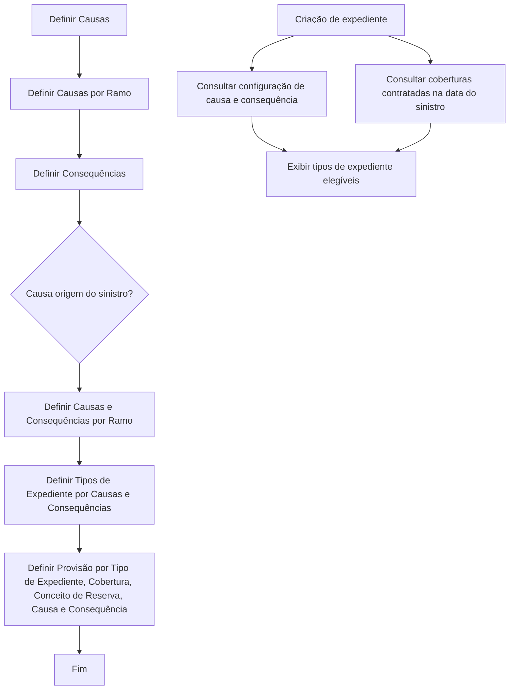

# Configuração de Causas e Consequências no Reef.core para Tipos de Expedientes de Sinistros

## 1. Metadados do Documento
- **Arquivo de Origem:** `Não identificado no conteúdo fornecido`
- **Tipo de Documento:** `Procedimento`
- **Domínio / Sistema:** `Reef.core / Operações de sinistros`
- **Público-Alvo:** `Usuários responsáveis pela configuração de catálogos, analistas funcionais e operação`
- **Data/Versão Identificada:** `Não identificada`

---

## 2. Resumo Executivo & Contexto de Negócio

O documento descreve a configuração prévia necessária no sistema Reef.core para definir os tipos de expedientes que poderão ser abertos em operações de sinistros. A configuração é realizada pelo usuário, que determina o comportamento do sistema por meio de catálogos de causas, consequências, ramos, tipos de expediente, coberturas e conceitos de reserva.

O objetivo declarado é permitir que, a partir das causas e consequências selecionadas em um sinistro, o sistema proponha os tipos de expediente possíveis para abertura. A definição também estabelece quais coberturas e conceitos de reserva poderão ser afetados.

A configuração de causas e consequências influencia os valores de provisão associados a cada combinação de tipo de expediente, cobertura e conceito de reserva. O documento cita especificamente a definição de importe inicial e importe máximo para cada cobertura e conceito de reserva.

A definição dos tipos de expediente é uma pré-condição para o processo documentado. Após a definição dos catálogos, a criação de um expediente considera tanto a configuração de tipos de expediente, coberturas e conceitos de reserva para a combinação de causa e consequência selecionada quanto as coberturas contratadas para o risco na data do sinistro.

O sistema deve exibir somente os tipos de expediente cuja combinação de causa e consequência esteja definida e cujas coberturas estejam contratadas no risco sinistrado.

---

## 3. Arquitetura, Componentes & Tecnologias Envolvidas

### Componentes e elementos identificados

| Componente / Elemento | Papel identificado no documento |
| :--- | :--- |
| Reef.core | Sistema que exige configuração prévia para definir o comportamento relacionado à abertura de expedientes de sinistro. |
| Usuário | Responsável por definir os catálogos e a configuração do sistema. |
| Catálogo de Causas | Catálogo definido no processo de configuração. |
| Causas por Ramo | Associação ou definição de causas por ramo. |
| Catálogo de Consequências | Catálogo definido no processo de configuração. |
| Causas e Consequências por Ramo | Definição conjunta de causas e consequências por ramo. |
| Tipos de Expediente por Causas e Consequências | Configuração que determina os tipos de expediente possíveis conforme causa e consequência. |
| Provisão por Tipo de Expediente, Cobertura, Conceito de Reserva, Causa e Consequência | Configuração de provisões para a combinação de elementos indicada. |
| Risco sinistrado | Risco cujas coberturas contratadas na data do sinistro restringem os tipos de expediente exibidos. |
| Mapfredocument | Elemento citado no conteúdo bruto como parte do contexto documental. |



> **Nota de Análise:** O documento apresenta a pergunta “¿Causa Origen del siniestro?” no fluxograma, mas não detalha explicitamente o comportamento das ramificações `SI` e `NO`, nem os critérios para determinar se uma causa é origem do sinistro.

> **Nota de Análise:** O documento não detalha tecnologias de implementação, interfaces, APIs, métodos HTTP, contratos JSON, banco de dados, URLs de ambiente, servidores ou rotas de log.

---

## 4. Regras de Negócio, Especificações Funcionais & Processos

### Pré-requisito do processo

Antes de configurar o catálogo de causas e consequências, os tipos de expediente devem ter sido definidos.

### Processo de definição dos catálogos

O processo apresentado no documento contém as seguintes atividades:

1. Definir causas.
2. Definir causas por ramo.
3. Definir consequências.
4. Avaliar a condição “Causa origem do sinistro”.
5. Definir causas e consequências por ramo.
6. Definir tipos de expediente por causas e consequências.
7. Definir provisão por tipo de expediente, cobertura, conceito de reserva, causa e consequência.
8. Finalizar o processo.

### Regras para proposta de tipos de expediente

Quando um expediente for criado, o sistema considera simultaneamente:

1. A definição de tipos de expediente, coberturas e conceitos de reserva configurados para a causa e as consequências selecionadas no sinistro.
2. As coberturas do risco sinistrado que estejam contratadas na data do sinistro.

### Regra de elegibilidade para exibição

O sistema deve mostrar somente os tipos de expediente que atendam às duas condições abaixo:

| Condição | Regra |
| :--- | :--- |
| Configuração de causa e consequência | O tipo de expediente deve possuir causa e consequência definidas. |
| Cobertura contratada | As coberturas associadas ao tipo de expediente devem estar contratadas no risco sinistrado. |

### Resultado esperado da configuração

Com a definição de causas e consequências, o sistema pode identificar:

- Tipos de expediente que podem ser afetados.
- Coberturas que podem ser afetadas.
- Conceitos de reserva que podem ser afetados.
- Importe inicial de cada combinação de cobertura e conceito de reserva.
- Importe máximo de cada combinação de cobertura e conceito de reserva.

---

## 5. Tabelas de Parâmetros, Ambientes e Estruturas de Dados

| Item / Parâmetro | Descrição / Função | Tipo / Valores / Formato | Ambiente / Observações |
| :--- | :--- | :--- | :--- |
| Causa | Elemento definido no catálogo de causas para operações de sinistro. | Não detalhado. | Deve ser definido no processo. |
| Causa por Ramo | Definição de causas associadas a um ramo. | Não detalhado. | Etapa 2 do processo. |
| Consequência | Elemento definido no catálogo de consequências. | Não detalhado. | Etapa 3 do processo. |
| Causa origem do sinistro | Pergunta de decisão exibida no fluxo. | `SI` / `NO` aparecem no fluxograma. | O comportamento de cada resposta não é detalhado. |
| Causas e Consequências por Ramo | Configuração conjunta de causas e consequências por ramo. | Não detalhado. | Etapa 4 do processo. |
| Tipo de Expediente | Tipo de expediente que poderá ser proposto para abertura. | Não detalhado. | Deve existir antes da definição documentada. |
| Tipo de Expediente por Causas e Consequências | Relação entre tipos de expediente e a combinação de causa e consequência. | Não detalhado. | Determina tipos de expediente possíveis. |
| Cobertura | Cobertura relacionada ao expediente e ao risco sinistrado. | Não detalhado. | Deve estar contratada na data do sinistro para permitir a exibição do tipo de expediente. |
| Conceito de Reserva | Conceito de reserva afetado pela configuração. | Não detalhado. | Participa da definição de provisão. |
| Provisão | Definição de provisão por tipo de expediente, cobertura, conceito de reserva, causa e consequência. | Inclui importe inicial e importe máximo, sem formato informado. | Etapa 6 do fluxo enumerado. |
| Importe inicial | Valor inicial associado a cada cobertura e conceito de reserva. | Não detalhado. | Citado como resultado da definição. |
| Importe máximo | Valor máximo associado a cada cobertura e conceito de reserva. | Não detalhado. | Citado como resultado da definição. |
| Data do sinistro | Data usada para validar as coberturas contratadas do risco sinistrado. | Não detalhado. | Critério obrigatório na criação do expediente. |
| URLs de ambiente | Não informadas. | Não aplicável. | Não detalhadas no documento. |
| Servidores | Não informados. | Não aplicável. | Não detalhados no documento. |
| Rotas de logs | Não informadas. | Não aplicável. | Não detalhadas no documento. |

---

## 6. Bateria de Perguntas & Respostas para RAG (FAQ Sintético)

### P1: Qual é o objetivo da configuração de causas e consequências no Reef.core?
**R:** A configuração de causas e consequências no Reef.core permite definir quais tipos de expediente podem ser abertos em operações de sinistros. A partir das causas e consequências selecionadas, a configuração também permite identificar coberturas, conceitos de reserva, importe inicial e importe máximo aplicáveis.

### P2: Quem define o comportamento do Reef.core descrito no documento?
**R:** O documento informa que o usuário define previamente como o sistema Reef.core deve se comportar. Essa definição ocorre por meio da configuração dos catálogos necessários para causas, consequências, ramos, tipos de expediente, coberturas, conceitos de reserva e provisões.

### P3: Qual é o pré-requisito antes de definir causas e consequências?
**R:** Antes da definição de causas e consequências, os tipos de expediente devem ter sido definidos. O documento apresenta essa condição de forma explícita como uma etapa prévia à configuração descrita.

### P4: Quais etapas compõem o processo de definição de catálogos de causas e consequências?
**R:** O processo inclui definir causas, definir causas por ramo, definir consequências, avaliar a questão “Causa origem do sinistro?”, definir causas e consequências por ramo, definir tipos de expediente por causas e consequências e definir provisão por tipo de expediente, cobertura, conceito de reserva, causa e consequência.

### P5: Quais informações são consideradas quando um expediente é criado?
**R:** Na criação de um expediente, são consideradas duas informações: a definição de tipos de expediente, coberturas e conceitos de reserva para a causa e as consequências selecionadas no sinistro; e as coberturas do risco sinistrado que estavam contratadas na data do sinistro.

### P6: Quando um tipo de expediente será exibido para abertura?
**R:** Um tipo de expediente será exibido somente quando possuir uma definição para a combinação de causa e consequência selecionada e quando as respectivas coberturas estiverem contratadas no risco sinistrado.

### P7: Qual é o papel das coberturas contratadas na data do sinistro?
**R:** As coberturas contratadas na data do sinistro funcionam como critério de elegibilidade para a apresentação dos tipos de expediente. Mesmo que exista uma configuração de causa e consequência, o tipo de expediente não deve ser mostrado se as coberturas correspondentes não estiverem contratadas no risco sinistrado.

### P8: O documento detalha os valores de importe inicial e importe máximo?
**R:** O documento informa que a definição permite obter o importe inicial e o importe máximo de cada cobertura e conceito de reserva. Contudo, o documento não especifica fórmulas de cálculo, moeda, precisão decimal, regras de arredondamento ou limites concretos desses importes.

### P9: O que significa a definição de provisão apresentada no fluxo?
**R:** A definição de provisão é indicada como uma configuração por tipo de expediente, cobertura, conceito de reserva, causa e consequência. O documento não detalha os campos, regras de cálculo ou persistência dessa provisão além da referência ao importe inicial e ao importe máximo.

### P10: O documento explica o que acontece para as respostas “SI” e “NO” da pergunta sobre causa de origem do sinistro?
**R:** Não. O fluxograma apresenta a decisão “¿Causa Origen del siniestro?” e os rótulos “SI” e “NO”, mas não fornece detalhamento textual sobre as ramificações, os critérios de decisão ou as ações específicas associadas a cada resposta.

---

## 7. Glossário de Termos, Siglas & Conceitos-Chave

- **Reef.core:** Sistema citado como dependente de uma configuração prévia para seu funcionamento no contexto de sinistros.
- **Expediente:** Entidade que pode ser aberta no contexto de operações de sinistros; o documento trata da definição dos tipos de expediente possíveis.
- **Tipo de Expediente:** Classificação de expediente cuja disponibilidade depende da configuração de causas, consequências e coberturas contratadas.
- **Causa:** Elemento do catálogo utilizado na definição de tipos de expediente e provisões.
- **Consequência:** Elemento do catálogo utilizado em conjunto com a causa para definir tipos de expediente e provisões.
- **Ramo:** Elemento usado na definição de causas por ramo e de causas e consequências por ramo.
- **Cobertura:** Cobertura relacionada ao risco sinistrado; deve estar contratada na data do sinistro para que determinados tipos de expediente sejam exibidos.
- **Risco sinistrado:** Risco associado ao sinistro, cujas coberturas contratadas são verificadas.
- **Conceito de Reserva:** Elemento considerado na configuração de provisões e na definição de valores inicial e máximo.
- **Provisão:** Configuração associada a tipo de expediente, cobertura, conceito de reserva, causa e consequência.
- **Importe inicial:** Valor inicial indicado para cada cobertura e conceito de reserva.
- **Importe máximo:** Valor máximo indicado para cada cobertura e conceito de reserva.
- **Mapfredocument:** Termo citado no conteúdo bruto como parte do ambiente documental, sem detalhamento adicional.

---

## 8. Notas Críticas, Riscos & Limitações

- O documento não informa o nome do arquivo de origem, data, versão ou autoria formal; o conteúdo bruto cita `Owner user:agonzalez_mapfre.com`.
- O fluxograma contém a decisão “¿Causa Origen del siniestro?”, porém não esclarece o tratamento das respostas `SI` e `NO`.
- Não há detalhamento de telas, campos obrigatórios, validações de entrada, mensagens de erro, perfis de acesso ou permissões para a configuração dos catálogos.
- O documento não define fórmulas, moeda, arredondamento ou regras de cálculo para os importes inicial e máximo de provisão.
- Não há contratos de integração, APIs, métodos HTTP, formatos de mensagem, bancos de dados, servidores, URLs de ambientes ou rotas de logs.
- A regra de seleção depende das coberturas contratadas na data do sinistro; dados incorretos ou indisponíveis sobre contratação de cobertura podem impedir a apresentação adequada dos tipos de expediente.
- A correta definição prévia dos tipos de expediente é uma dependência explícita para a configuração de causas e consequências.

---

## 9. Conteúdo Bruto Estruturado (Referência Fiel)

```text
--- [PÁGINA 1 DE 2] ---

DEFINICIÓN Causas-Consecuencias
¿En que consiste?
El Reef.core necesita para su funcionamiento una conguración previa del sistema. El Usuario será el que dena como quiere que se
comporte. En este caso se va a documentar como denir todos los catálogos necesarios para la denición de tipos de expedientes que se
podrán aperturar, según las causas y consecuencias elegidas en las operaciones de siniestros.
Objetivo
La nalidad de este documento es conocer qué se necesita denir para la propuesta de tipos de expedientes posibles a aperturar.
Con esta denición, vamos a poder obtener según las causas y las consecuencias denidas, a qué tipos de expediente vamos a poder
afectar, a qué coberturas, qué conceptos de reserva y el importe inicial y máximo de cada cobertura concepto de reserva
Previa a esta denición, se tiene que haber denido los tipos de expedientes
Proceso para Denir los catálogos causas consecuencias
SI
NO
DEFINIR
Causas
(1)
DEFINIR
Causas
por Ramo(2)
DEFINIR
Consecuencias
(3)
¿Causa Origen
del siniestro?
DEFINIR Causas
Consecuencias
por Ramo (4)
DEFINIR
Tipos Expediente
por Causas
Consecuencias (5)
DEFINIR
Provisión por
Tip. Exp. Cobertura
Cto. Reserva
Causa-Cons(6)
FIN
1. DEFINIR Causas
2. DEFINIR Causas por Ramo
3. DEFINIR Consecuencias
4. DEFINIR Causas Consecuencias por Ramo
5. DEFINIR Tipos de Expediente por Causas Consecuencia
6. DEFINIR Provisión por Tipo Expediente, Cobertura, Cto. Reserva, Causa, Cons.
Documentation / DOCUMENTACIÓN Reef
DOCUMENTACIÓN Reef
Mapfredocument
DOCUMENTACIÓN Reef
Owner
user:agonzalez_mapfre.com
Lifecycle
Approved Source
 / 
 VL
Buscar Inicio Soluciones Arquitecturas APIs Componentes Cloud Documentación Zeus Reef Ayuda
ES


--- [PÁGINA 2 DE 2] ---

Una vez que se han denido los catálogos, cuando se vaya a crear un expediente, se tendrá en cuenta dos cosas:
Denición de Tipos de Expedientes, coberturas y conceptos de reserva para la causa y consecuencias que se han seleccionado en el
Siniestro.
Coberturas del riesgo siniestrado contratados a la fecha del siniestro.
Se mostrarán únicamente los tipos de expediente, que tenga denido la causa consecuencias, cuyas coberturas estén contratadas en el
riesgo siniestrado.
Checking links...
Consejo:
Ejemplo:
```
