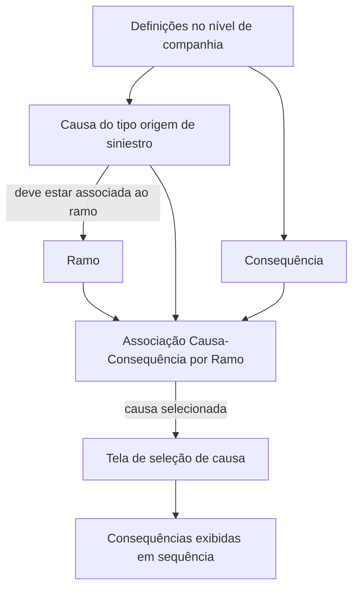
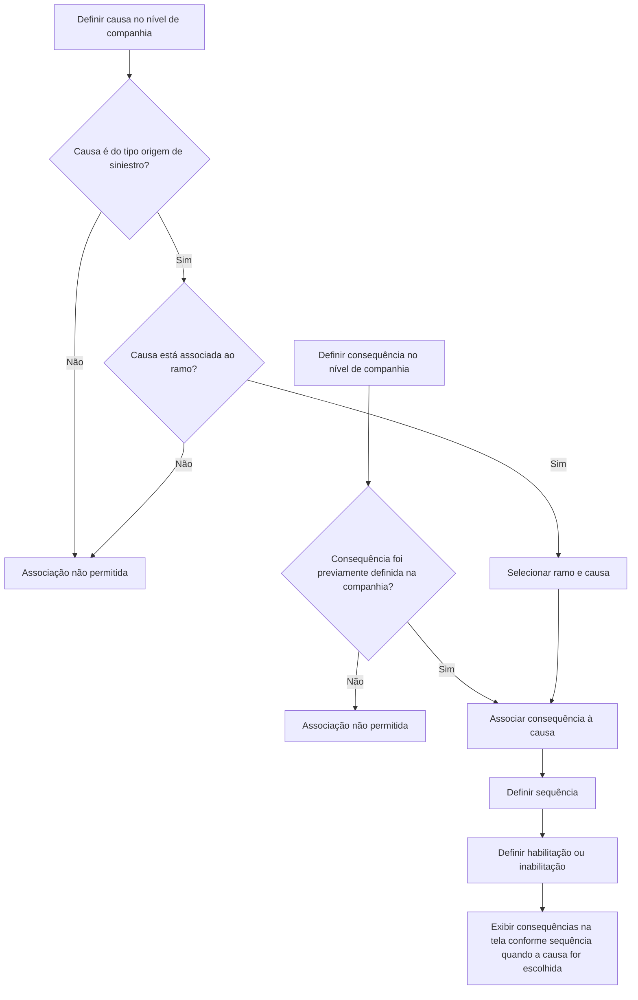

# Definição de Causas e Consequências por Ramo — Documentação Reef

## 1. Metadados do Documento
- **Arquivo de Origem:** Não identificado
- **Tipo de Documento:** Especificação Técnica / Manual Funcional
- **Domínio / Sistema:** Reef / Mapfre
- **Público-Alvo:** Negócio, Analistas Funcionais, Desenvolvedores e Operação
- **Data/Versão Identificada:** Não identificada
- **Lifecycle Identificado:** Approved

---

## 2. Resumo Executivo & Contexto de Negócio

O documento define a funcionalidade de manutenção de **Causas e Consequências por Ramo** no domínio Reef. A finalidade declarada é configurar, para cada ramo, quais consequências podem ocorrer dentro de um sinistro para cada causa do tipo **“origem de siniestros”**.

A configuração é realizada por associação entre ramo, causa e consequência. O ramo identifica o contexto no qual a associação é definida; a causa representa a causa à qual serão vinculadas possíveis consequências; e a consequência representa o resultado associado à causa.

A documentação estabelece restrições de elegibilidade para os dados associados. Somente causas do tipo origem de siniestro, previamente definidas no nível de companhia e associadas ao ramo, podem ser vinculadas. Da mesma forma, somente consequências previamente definidas no nível de companhia podem ser selecionadas.

A funcionalidade também inclui propriedades de ordenação e habilitação. A sequência determina a ordem de apresentação das consequências na tela quando uma causa associada for escolhida. O atributo inabilitado determina se uma associação entre causa e consequência está habilitada ou inabilitada.

---

## 3. Arquitetura, Componentes & Tecnologias Envolvidas

Os elementos explicitamente identificados são:

| Componente / Termo | Papel identificado no documento |
| :--- | :--- |
| Reef | Sistema ou domínio da documentação funcional. |
| Mapfre | Contexto corporativo identificado na extração. |
| Ramo | Chave do ramo para o qual são definidas causas e consequências. |
| Causa | Chave da causa à qual serão associadas consequências possíveis. |
| Consequência | Chave da consequência associada à causa. |
| Companhia | Nível no qual causas e consequências precisam ser previamente definidas. |
| Sinistro | Contexto no qual causas e consequências são utilizadas. |
| Tela | Interface na qual as consequências aparecem segundo a sequência configurada. |



**Nota de Análise:** o documento não detalha arquitetura de software, APIs, contratos JSON, métodos HTTP, persistência de dados, tecnologias de implementação ou ambientes técnicos.

---

## 4. Regras de Negócio, Especificações Funcionais & Processos

### Objetivo funcional

A manutenção de Causas e Consequências por Ramo deve definir, para cada ramo e para cada causa do tipo **origem de siniestros**, quais consequências podem ocorrer dentro de um sinistro.

### Regras para o atributo Ramo

1. O atributo **Ramo** é a chave do ramo para o qual as causas e consequências estão sendo definidas.
2. A associação entre causa e consequência é contextualizada pelo ramo.

### Regras para o atributo Causa

1. O atributo **Causa** é a chave da causa à qual possíveis consequências serão associadas.
2. Apenas causas do tipo **origem de siniestro** podem ser associadas.
3. A causa deve ter sido previamente definida no nível de companhia.
4. A causa deve estar previamente associada ao ramo.

### Regras para o atributo Consequência

1. O atributo **Consequência** é a chave da consequência associada à causa.
2. Apenas consequências previamente definidas no nível de companhia podem ser associadas à causa.

### Regras para o atributo Sequência

1. O atributo **Sequência** indica a ordem de exibição das consequências na tela.
2. A ordem é aplicada quando o usuário escolhe uma causa à qual as consequências estejam associadas.

### Regras para o atributo Inabilitado

1. O atributo **Inabilitado** informa se a associação causa-consequência está inabilitada ou habilitada.
2. O texto extraído não detalha os valores técnicos aceitos, comportamento de validação ou efeito operacional da inabilitação na tela.

### Fluxo funcional identificado



---

## 5. Tabelas de Parâmetros, Ambientes e Estruturas de Dados

| Item / Parâmetro | Descrição / Função | Tipo / Valores / Formato | Ambiente / Observações |
| :--- | :--- | :--- | :--- |
| Ramo | Chave do ramo para o qual estão sendo definidas causas e consequências. | Chave; formato não detalhado. | A causa deve estar associada ao ramo. |
| Causa | Chave da causa à qual serão associadas possíveis consequências. | Chave; tipo elegível: origem de siniestro. | Deve ser previamente definida no nível de companhia e associada ao ramo. |
| Consequência | Chave da consequência associada à causa. | Chave; formato não detalhado. | Deve ser previamente definida no nível de companhia. |
| Sequência | Define a ordem em que as consequências aparecem na tela. | Ordem; formato e faixa de valores não detalhados. | Aplicável quando a causa associada é escolhida. |
| Inabilitado | Indica se a relação causa-consequência está habilitada ou inabilitada. | Estado de habilitação; valores técnicos não detalhados. | O comportamento operacional adicional não é descrito. |
| Tipo de causa permitido | Restringe quais causas podem participar da associação. | Origem de siniestro. | Causas de outros tipos não são permitidas segundo o texto. |
| Pré-requisito da causa | Exige definição anterior da causa. | Regra de elegibilidade. | Definição realizada no nível de companhia. |
| Pré-requisito da consequência | Exige definição anterior da consequência. | Regra de elegibilidade. | Definição realizada no nível de companhia. |

---

## 6. Bateria de Perguntas & Respostas para RAG (FAQ Sintético)

### P1: Qual é a finalidade da manutenção de Causas e Consequências por Ramo?
**R:** A finalidade é definir, para cada ramo e para cada causa do tipo origem de siniestros, qual consequência ou quais consequências podem ocorrer dentro de um sinistro.

### P2: O que representa o atributo Ramo na configuração de Causas e Consequências por Ramo?
**R:** Ramo representa a chave do ramo para o qual as causas e consequências estão sendo definidas. A associação entre causa e consequência é realizada no contexto desse ramo.

### P3: Quais causas podem ser associadas a consequências?
**R:** Somente causas do tipo origem de siniestro podem ser associadas a consequências. Além disso, a causa deve ter sido previamente definida no nível de companhia e previamente associada ao ramo.

### P4: Uma causa definida na companhia pode ser associada diretamente a qualquer ramo?
**R:** Não necessariamente. Além de ter sido previamente definida no nível de companhia, a causa deve estar associada ao ramo antes de poder receber uma associação de consequência nesse ramo.

### P5: Quais consequências podem ser associadas a uma causa?
**R:** Somente consequências previamente definidas no nível de companhia podem ser associadas a uma causa.

### P6: Qual é a função do atributo Sequência?
**R:** Sequência indica a ordem em que as consequências aparecerão na tela quando for escolhida a causa à qual essas consequências estão associadas.

### P7: O que o atributo Inabilitado controla?
**R:** Inabilitado indica se a associação entre causa e consequência está inabilitada ou habilitada. O documento não detalha os valores técnicos usados nem o efeito adicional desse estado na interface ou no processamento.

### P8: A documentação define métodos HTTP ou contratos de API para Causas e Consequências por Ramo?
**R:** Não. O conteúdo extraído descreve propriedades funcionais e regras de associação, mas não detalha métodos HTTP, endpoints, contratos JSON, APIs ou tecnologias de implementação.

### P9: Qual é o pré-requisito para associar uma consequência a uma causa?
**R:** A consequência precisa estar previamente definida no nível de companhia. A causa também precisa ser do tipo origem de siniestro, previamente definida no nível de companhia e associada ao ramo.

### P10: Quando as consequências configuradas são apresentadas ao usuário?
**R:** As consequências aparecem na tela quando o usuário escolhe a causa à qual elas estão associadas. A ordem de apresentação é definida pelo atributo Sequência.

---

## 7. Glossário de Termos, Siglas & Conceitos-Chave

- **Reef:** Sistema ou domínio identificado na documentação extraída.
- **Mapfre:** Referência corporativa presente na extração.
- **Ramo:** Chave do ramo para o qual são definidas associações entre causas e consequências.
- **Causa:** Chave da causa à qual possíveis consequências serão associadas.
- **Origem de siniestro:** Tipo de causa permitido para associação de consequências por ramo.
- **Consequência:** Chave da consequência associada a uma causa.
- **Sinistro:** Contexto no qual a combinação de ramo, causa e consequência é utilizada.
- **Sequência:** Ordem de apresentação das consequências na tela.
- **Inabilitado:** Propriedade que identifica se uma associação causa-consequência está habilitada ou inabilitada.
- **Companhia:** Nível organizacional no qual causas e consequências devem ser previamente definidas.

---

## 8. Notas Críticas, Riscos & Limitações

- O conteúdo extraído não identifica o nome do arquivo de origem, versão, data de publicação ou responsável técnico além da referência `user:agonzalez_mapfre.com`.
- O documento não descreve modelo de dados físico, identificadores técnicos, obrigatoriedade de campos, formatos, limites ou validações detalhadas.
- Não foram identificados endpoints, métodos HTTP, APIs, eventos, integrações, logs, URLs, ambientes ou procedimentos de implantação.
- O atributo **Inabilitado** é mencionado, mas seu comportamento operacional detalhado não é especificado.
- O documento menciona um exemplo, porém o conteúdo do exemplo não está presente na extração fornecida.
- **Nota de Análise:** a documentação lista a funcionalidade de Causas e Consequências por Ramo, mas não detalha métodos de manutenção, permissões, regras de exclusão, comportamento de erro ou contratos de integração.

---

## 9. Conteúdo Bruto Estruturado (Referência Fiel)

```text
--- [PÁGINA 1 DE 2] ---

DEFINICIÓN Causa Consecuencias por Ramo
Objetivo
La nalidad es denir para cada ramo, para cada causa de tipo "origen de siniestros" qué consecuencia o consecuencias se van a poder dar
dentro de un siniestro.
Imagen del Mantenimiento Causas Consecuencias por Ramo:
Causas Consecuencias Por Ramo
En este apartado se detallarán todos los atributos, propiedades, que habrá que denir por ramo, para cada causa.
Ramo
Esta propiedad será la clave del ramo para la que estamos deniendo las causas consecuencias.
Documentation / DOCUMENTACIÓN Reef
DOCUMENTACIÓN Reef
Mapfredocument
DOCUMENTACIÓN Reef
Owner
user:agonzalez_mapfre.com
Lifecycle
Approved Source
 / 
 VL
Buscar Inicio Soluciones Arquitecturas APIs Componentes Cloud Documentación Zeus Reef Ayuda
ES


--- [PÁGINA 2 DE 2] ---

Causa
Esta propiedad será la clave de la causa a la que estamos asociando las posibles consecuencias.
Sólo se podrán asociar las causas tipo origen de siniestro, que previamente se hayan denido a nivel de compañía y asociado al ramo.
Consecuencia
Esta propiedad será la clave de la consecuencia que vamos a asociar a la causa.
Sólo se podrán asociar las consecuencias que previamente se hayan denido a nivel de compañía.
Secuencia
Esta propiedad indicará el orden en el que las consecuencias aparecerán en la pantalla, en el caso de que es elija la causa a la que están
asociadas.
Inhabilitado
Esta propiedad indica si la causa consecuencia está inhabilitada o habilitada.
Ejemplo:
```
