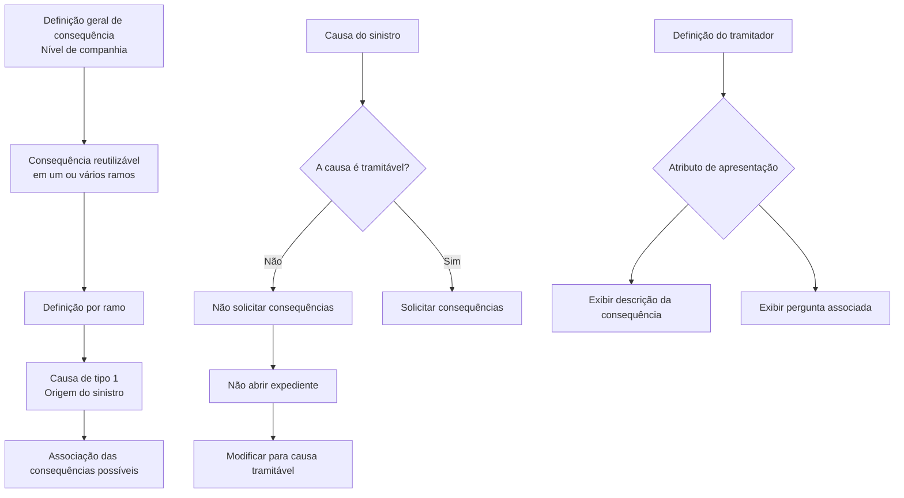

# Definição de Consequências — Documentação Reef

## 1. Metadados do Documento
- **Arquivo de Origem:** Não identificado no conteúdo fornecido
- **Tipo de Documento:** Especificação Técnica
- **Domínio / Sistema:** Reef / Mapfre
- **Público-Alvo:** Desenvolvedores, Arquitetos, Operação e Negócio
- **Data/Versão Identificada:** Não identificada

---

## 2. Resumo Executivo & Contexto de Negócio

O documento define o conceito de **consequências de um sinistro** no contexto da documentação Reef. Consequências representam os danos ou efeitos que podem ser derivados de um sinistro, incluindo danos ao veículo segurado, danos pessoais ao segurado, morte do segurado, danos pessoais a terceiros e danos materiais a terceiros.

A definição de consequências possui escopo corporativo, isto é, uma mesma consequência pode ser reutilizada por um ou mais ramos. O documento separa propriedades gerais, aplicáveis a todos os ramos, de propriedades específicas que podem ser definidas no contexto de cada ramo.

Após a definição geral, cada ramo deve associar, para cada causa de tipo 1 — identificada como **Origem do sinistro** — as consequências possíveis. Portanto, a configuração por ramo não cria necessariamente novas consequências: ela determina quais consequências gerais são permitidas para cada causa daquele ramo.

A tramitação de sinistros depende da condição da causa. Quando uma causa é classificada como não tramitável, o sistema não solicita consequências e não permite a abertura de expedientes até que a causa seja modificada para uma causa tramitável.

O documento também estabelece que a apresentação para o tramitador pode ser configurada: o sistema pode exibir a descrição da consequência ou a pergunta associada à consequência, conforme um atributo existente na definição do tramitador.

---

## 3. Arquitetura, Componentes & Tecnologias Envolvidas

Os elementos funcionais identificados são:

- **Reef:** Sistema ou domínio de documentação no qual a definição de consequências é mantida.
- **Mapfre:** Referência corporativa identificada na documentação.
- **Consequência:** Entidade que representa um dano ou efeito derivado de um sinistro.
- **Ramo:** Contexto de negócio ao qual consequências podem ser associadas.
- **Causa de tipo 1 / Origem do sinistro:** Causa à qual são associadas as consequências possíveis por ramo.
- **Tramitador:** Configuração que determina se deve ser exibida a descrição da consequência ou a pergunta associada.
- **Expediente:** Registro que não pode ser aberto enquanto a causa for não tramitável.
- **Pergunta associada à consequência:** Texto alternativo que pode ser apresentado no lugar da descrição da consequência.



> **Nota de Análise:** O documento não detalha componentes técnicos, APIs, métodos HTTP, contratos JSON, banco de dados, tecnologias de implementação, URLs, ambientes ou mecanismos de persistência.

---

## 4. Regras de Negócio, Especificações Funcionais & Processos

### Definição de consequências

1. Consequências são todos os danos que podem decorrer de um sinistro.
2. Entre os exemplos de consequências citados estão:
   - Danos ao veículo segurado.
   - Danos pessoais ao segurado.
   - Morte do segurado.
   - Danos pessoais a terceiros.
   - Danos materiais a terceiros.
3. Devem ser definidas propriedades gerais de consequências, utilizadas por todos os ramos.
4. Devem ser definidas propriedades específicas de consequências por ramo.
5. Ao associar consequências a um ramo, cada causa de tipo 1, denominada **Origem do sinistro**, deve ser associada às possíveis consequências que podem decorrer daquela causa.

### Código da consequência

1. O código da consequência é a chave utilizada para identificar as diferentes consequências.
2. Uma mesma chave pode ser utilizada em um ou vários ramos.

### Nome da consequência

1. O nome da consequência contém a descrição da chave definida para a consequência.
2. O nome da consequência pode conter números e/ou letras.

### Pergunta associada à consequência

1. A pergunta associada contém a pergunta vinculada à chave definida para a consequência.
2. O sistema pode mostrar a descrição da chave da consequência ou a pergunta associada à chave.
3. A pergunta associada pode conter números e/ou letras.

### Habilitação da consequência

1. A propriedade **Inhabilitada** indica se a consequência definida está habilitada para ser associada a um ramo.
2. Quando uma consequência está inabilitada, ela não pode mais ser utilizada na definição de consequências por ramo.

### Apresentação para o tramitador

1. A definição do tramitador possui um atributo que determina como a consequência será mostrada.
2. O atributo pode determinar a exibição da descrição da consequência.
3. O atributo pode determinar a exibição da pergunta associada à consequência.

### Regra para causas não tramitáveis

1. Quando a causa é não tramitável, as consequências não são solicitadas.
2. Enquanto a causa permanecer não tramitável, não é possível abrir expedientes.
3. A abertura de expedientes passa a ser possível somente após a causa ser modificada para uma causa tramitável.

### Reutilização por ramo

1. A definição de consequências é realizada no nível de companhia.
2. Uma consequência pode ser reutilizada em vários ramos.
3. Após a definição corporativa, deve-se definir por ramo quais consequências cada causa do ramo pode ter.

---

## 5. Tabelas de Parâmetros, Ambientes e Estruturas de Dados

| Item / Parâmetro | Descrição / Função | Tipo / Valores / Formato | Ambiente / Observações |
| :--- | :--- | :--- | :--- |
| Consequência | Dano ou efeito que pode ser derivado de um sinistro. | Exemplos: dano ao veículo segurado, dano pessoal ao segurado, morte do segurado, dano pessoal a terceiros, dano material a terceiros. | Definição em nível de companhia. |
| Código da Consequência | Chave de identificação das diferentes consequências. | Chave; formato não detalhado. | Uma chave pode ser utilizada para um ou vários ramos. |
| Nome da Consequência | Descrição da chave definida para a consequência. | Pode conter números e/ou letras. | Propriedade geral de consequência. |
| Pergunta associada à Consequência | Pergunta vinculada à chave da consequência. | Pode conter números e/ou letras. | Pode ser exibida em vez da descrição da consequência. |
| Inhabilitada | Indica se uma consequência está disponível para associação a um ramo. | Estado de habilitação; valores exatos não detalhados. | Consequências inabilitadas não podem ser usadas na definição por ramo. |
| Ramo | Contexto no qual causas e consequências são configuradas. | Não detalhado. | Deve definir quais consequências cada causa pode ter. |
| Causa de tipo 1 | Origem do sinistro à qual consequências possíveis são associadas. | Tipo 1. | Associação realizada no contexto do ramo. |
| Causa tramitável | Causa que permite a solicitação de consequências e a abertura de expedientes. | Condição funcional. | O documento não detalha os critérios de classificação. |
| Causa não tramitável | Causa que impede a solicitação de consequências e a abertura de expedientes. | Condição funcional. | Deve ser modificada para causa tramitável para permitir abertura de expediente. |
| Atributo da definição do tramitador | Define a informação apresentada sobre a consequência ao tramitador. | Exibir descrição ou pergunta associada. | O nome técnico do atributo não é informado. |
| Expediente | Registro cuja abertura depende de a causa ser tramitável. | Não detalhado. | Não pode ser aberto para causa não tramitável. |

> **Nota de Análise:** O conteúdo fornecido não apresenta servidores, URLs, credenciais, rotas de log, versões de software, tabelas físicas, formatos de payload ou ambientes técnicos.

---

## 6. Bateria de Perguntas & Respostas para RAG (FAQ Sintético)

### P1: O que é uma consequência no processo de sinistro?
**R:** Uma consequência é um dano ou efeito que pode decorrer de um sinistro. O documento cita como exemplos danos ao veículo segurado, danos pessoais ao segurado, morte do segurado, danos pessoais a terceiros e danos materiais a terceiros.

### P2: Em que nível são definidas as consequências no sistema Reef?
**R:** As consequências são definidas em nível de companhia. Essa definição corporativa permite que uma mesma consequência seja reutilizada em um ou vários ramos.

### P3: Uma mesma consequência pode ser utilizada em mais de um ramo?
**R:** Sim. A definição é realizada em nível de companhia para permitir a reutilização das consequências em vários ramos. Posteriormente, cada ramo define quais consequências podem estar associadas a cada causa do ramo.

### P4: Qual é a função do código da consequência?
**R:** O código da consequência é a chave utilizada para identificar as diferentes consequências. Uma mesma chave pode ser utilizada para um ou vários ramos.

### P5: Quais valores podem ser registrados no nome da consequência?
**R:** O nome da consequência contém a descrição da chave definida para a consequência e pode conter números e/ou letras.

### P6: Qual é a finalidade da pergunta associada à consequência?
**R:** A pergunta associada contém a pergunta vinculada à chave da consequência. O sistema pode apresentar essa pergunta ao invés de exibir a descrição da chave da consequência.

### P7: Como o sistema decide se mostra a descrição ou a pergunta associada à consequência?
**R:** A definição do tramitador possui um atributo que determina se, para aquele tramitador, será mostrada a descrição da consequência ou a pergunta associada à chave da consequência.

### P8: O que significa uma consequência estar inabilitada?
**R:** Uma consequência inabilitada não está disponível para associação a um ramo. Ela não pode mais ser utilizada na definição de consequências por ramo.

### P9: As consequências são solicitadas quando a causa é não tramitável?
**R:** Não. Quando a causa é não tramitável, as consequências não são solicitadas.

### P10: É possível abrir um expediente para uma causa não tramitável?
**R:** Não. Não é possível abrir expedientes enquanto a causa não tramitável não for modificada para uma causa tramitável.

### P11: Como as consequências são relacionadas à origem do sinistro?
**R:** No contexto de cada ramo, cada causa de tipo 1 — denominada Origem do sinistro — deve ser associada às possíveis consequências que podem decorrer daquela causa.

### P12: O documento define critérios técnicos para classificar uma causa como tramitável?
**R:** Não. O documento informa os efeitos funcionais de uma causa não tramitável, mas não detalha os critérios, parâmetros ou regras que classificam uma causa como tramitável ou não tramitável.

---

## 7. Glossário de Termos, Siglas & Conceitos-Chave

- **Causa de tipo 1:** Causa identificada como Origem do sinistro e utilizada para associar consequências possíveis no contexto de um ramo.
- **Consequência:** Dano ou efeito decorrente de um sinistro.
- **Expediente:** Registro que não pode ser aberto quando a causa é não tramitável.
- **Inhabilitada:** Propriedade que indica que uma consequência não pode ser associada ou utilizada na definição de consequências por ramo.
- **Mapfre:** Referência corporativa presente na documentação.
- **Origem do sinistro:** Denominação atribuída à causa de tipo 1.
- **Ramo:** Contexto de negócio no qual as causas e consequências possíveis são definidas.
- **Reef:** Sistema ou domínio documental mencionado no conteúdo.
- **Tramitador:** Entidade cuja definição possui atributo para determinar a exibição da descrição ou da pergunta associada à consequência.

---

## 8. Notas Críticas, Riscos & Limitações

- O documento não descreve critérios para determinar quando uma causa é tramitável ou não tramitável.
- O documento não especifica o nome, formato ou valores possíveis do atributo de apresentação existente na definição do tramitador.
- Não há detalhamento de APIs, métodos HTTP, contratos de integração, estruturas JSON, banco de dados, autenticação ou fluxos técnicos de persistência.
- Não há especificação de ambientes, URLs, servidores, portas, arquivos de configuração ou rotas de logs.
- Não são apresentados exemplos preenchidos de consequências, códigos, ramos ou associações entre causas e consequências.
- A condição **Inhabilitada** é funcionalmente descrita, mas seus valores de armazenamento e seu processo operacional de alteração não são detalhados.
- O documento contém referências a imagens de manutenção de consequências e de definições de pergunta por consequência, mas as imagens não estão disponíveis no conteúdo textual fornecido.

---

## 9. Conteúdo Bruto Estruturado (Referência Fiel)

```text
--- [PÁGINA 1 DE 3] ---

DEFINICIÓN de Consecuencias
Objetivo
La finalidad es definir todas las consecuencias que se puedan derivar de un siniestro, es decir todos los daños que se puedan producir a raíz
de un siniestro, tales como daños al vehículo asegurado, daños personales asegurado, muerte del asegurado, daños personales a terceros,
daños materiales a terceros… etc.
Habrá que definir tanto las propiedades generales de las consecuencias (utilizados por todos los ramos), como las propiedades específicos
para el ramo. Cuando se le asocie al ramo, se va asociar a cada causa de tipo 1(Origen del siniestro) todas las posibles consecuencias que se
podrán derivar
Propiedades Generales
En este apartado se detallarán todas las propiedades de las consecuencias comunes a todos los ramos, es decir los atributos que no
cambian por ramo.
Imagen del Mantenimiento Consecuencias a nivel General:
Documentation / DOCUMENTACIÓN Reef
DOCUMENTACIÓN Reef
Mapfredocument
DOCUMENTACIÓN Reef
Owner
user:agonzalez_mapfre.com
Lifecycle
Approved Source
 /
 VL
Buscar Inicio Soluciones Arquitecturas APIs Componentes Cloud Documentación Zeus Reef Ayuda
ES


--- [PÁGINA 2 DE 3] ---

Código de la Consecuencia
Esta propiedad será la clave por la que se va a identificar las distintas consecuencias.
Una clave podrá ser utilizada para uno o varios ramos.
Nombre de la Consecuencia
Esta propiedad contendrá la descripción de la clave definida para la consecuencia. Puede contener números y/o letras.
Pregunta asociada a la Consecuencia
Imagen del Mantenimiento Definiciones Pregunta por Consecuencia:
Esta propiedad contendrá la pregunta asociada a la clave definida para la consecuencia.
El sistema permite que se muestre la descripción de la clave de la consecuencia o la pregunta asociada a la clave.
Puede contener números y/o letras.
Inhabilitada
Esta propiedad indica si la consecuencia que está definida está habilitada para poder ser asociada a un ramo, o por el contrario, ya no está
habilitada para poder ser utilizada en la definición de consecuencias por Ramo.
Vínculos
Para que se muestre la descripción de la consecuencia o la pregunta, hay un atributo en la definición del tramitador que indica si para ese
tramitador, se muestra la descripción de la consecuencia o la pregunta.
Preguntas frecuentes
¿Cuándo la causa es no tramitable se van a pedir las consecuencias?
No, cuando la causa no es tramitable no se van a pedir las consecuencias por lo que no se podrán abrir expedientes hasta que la causa
no sea modificada por una causa tramitable.
Ejemplos
Ejemplos


--- [PÁGINA 3 DE 3] ---

¿Se pueden utilizar las mismas consecuencias para varios ramos?
Si, esta definición es a nivel de compañía para que puedan ser reutilizadas para varios ramos. Posteriormente a esta definición, se se
tendrán que definir por Ramo, cada causa del ramo que consecuencias puede tener.
```
