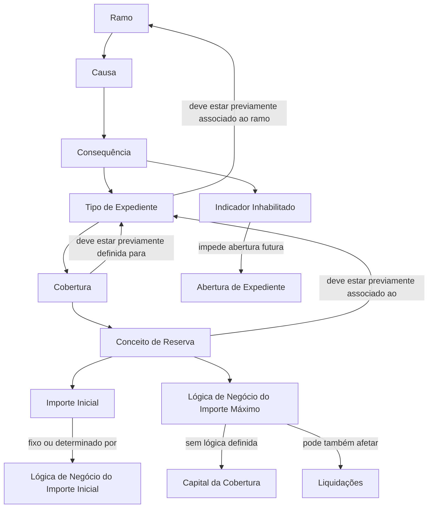

# Definição de Provisão por Causa, Consequência, Tipo de Expediente, Cobertura e Conceito de Reserva — Documentação Reef

## 1. Metadados do Documento
- **Arquivo de Origem:** `Não informado — conteúdo bruto fornecido na solicitação`
- **Tipo de Documento:** Especificação Funcional
- **Domínio / Sistema:** Reef / Mapfre — manutenção de provisões e reservas de sinistros
- **Público-Alvo:** Negócio, analistas funcionais, desenvolvedores e operação
- **Data/Versão Identificada:** Não identificada

---

## 2. Resumo Executivo & Contexto de Negócio

O documento descreve a configuração de provisões e conceitos de reserva no sistema Reef, associando combinações de ramo, causa, consequência, tipo de expediente, cobertura e conceito de reserva. A finalidade declarada é definir, para cada ramo e causa, quais consequências, tipos de expediente, coberturas, conceitos de reserva, validações e valores iniciais podem ser utilizados.

A definição controla a abertura de expedientes de sinistro e o comportamento das reservas. Para cada combinação permitida, podem ser configurados um importe inicial, uma lógica de negócio para calcular esse importe inicial, uma lógica de negócio para determinar o importe máximo de reserva e uma indicação de aplicabilidade dessa lógica também às liquidações.

O processo possui dependências de cadastro prévio. Causas devem estar previamente definidas no nível correspondente; consequências e tipos de expediente devem existir no nível de companhia; tipos de expediente devem estar associados ao ramo; coberturas devem estar definidas para o tipo de expediente; e conceitos de reserva devem estar previamente associados ao tipo de expediente.

A documentação também define regras para combinações concorrentes de consequências e para múltiplos conceitos de reserva em uma mesma combinação de expediente e cobertura. Consequências que afetam a mesma combinação podem coexistir, mas são mutuamente excludentes na abertura de um sinistro. Quando houver conceitos de reserva distintos para o mesmo expediente e cobertura, não são abertos dois expedientes: abre-se um único expediente com a mesma cobertura e múltiplos conceitos de reserva.

---

## 3. Arquitetura, Componentes & Tecnologias Envolvidas

Os componentes e conceitos identificados são:

- **Reef:** sistema ou domínio documental no qual a manutenção de provisões é descrita.
- **Mapfre:** contexto corporativo identificado na documentação.
- **Ramo:** chave do ramo para o qual causas e consequências são definidas.
- **Causa:** chave da causa associada a possíveis consequências.
- **Consequência:** chave da consequência associada a uma causa.
- **Tipo de Expediente:** entidade associada a causa e consequência.
- **Cobertura:** entidade associada à causa, consequência e tipo de expediente.
- **Conceito de Reserva:** conceito que pode ser valorado e liquidado para uma combinação de causa, consequência, tipo de expediente e cobertura.
- **Importe Inicial:** valor inicial de abertura para tipo de expediente, cobertura e conceito de reserva.
- **Lógica de Negócio de Importe Inicial:** regra usada quando o importe inicial não é fixo.
- **Lógica de Negócio de Importe Máximo:** regra usada para determinar o limite máximo de reserva.
- **Liquidações:** processo que pode receber a aplicação da lógica de importe máximo.
- **Marca Inhabilitado:** indicador que impede o uso futuro de uma combinação na abertura de expedientes.



**Nota de Análise:** o documento apresenta o domínio funcional e suas dependências de cadastro, mas não detalha arquitetura técnica, APIs, métodos HTTP, contratos JSON, banco de dados, versões de componentes, ambientes ou mecanismos de integração.

---

## 4. Regras de Negócio, Especificações Funcionais & Processos

### 4.1 Finalidade da definição de provisão

A definição de provisão associa, por ramo e por causa:

1. Consequências.
2. Tipos de expediente.
3. Coberturas definidas no ramo.
4. Conceitos de reserva.
5. Validações.
6. Valores iniciais.

Como exemplos de valores configuráveis, o documento menciona:

- Importe inicial por causa, consequência, tipo de expediente e cobertura.
- Importe máximo por causa, consequência, tipo de expediente e cobertura.

### 4.2 Dependências e validações de cadastro

1. O **ramo** é a chave do ramo para o qual causas e consequências estão sendo definidas.
2. A **causa** é associada às possíveis consequências.
3. Somente podem ser associadas causas previamente definidas no nível de causa, consequências, tipo de expediente, cobertura e conceito de reserva.
4. A **consequência** é associada à causa.
5. Somente podem ser associadas consequências previamente definidas no nível de companhia.
6. O **tipo de expediente** é associado à causa e à consequência.
7. Somente podem ser associados tipos de expediente previamente definidos no nível de companhia e posteriormente associados ao ramo em definição.
8. A **cobertura** é associada à causa, consequência e tipo de expediente.
9. Somente podem ser associadas coberturas previamente definidas para o tipo de expediente.
10. O **conceito de reserva** pode ser valorado e liquidado para a combinação de causa, consequência, tipo de expediente e cobertura.
11. O conceito de reserva deve estar previamente associado ao tipo de expediente para poder ser incluído na definição.

### 4.3 Regras de importe inicial

1. O **importe inicial** é o valor pelo qual inicialmente será aberto o tipo de expediente, a cobertura e o conceito de reserva.
2. Um importe manualmente informado pode substituir o importe inicial configurado.
3. Quando o importe inicial não é fixo e depende de outros fatores, deve ser utilizada uma **lógica de negócio que determine o importe inicial** por tipo de expediente, cobertura e conceito de reserva.

### 4.4 Regras de importe máximo

1. A **lógica que determina o importe máximo** define o importe máximo de reserva por tipo de expediente, cobertura e conceito de reserva.
2. Quando não houver lógica de negócio definida para o importe máximo, o sistema deve interpretar o importe máximo como o **capital da cobertura**.
3. O atributo **Importe aplica en las Liquidaciones** indica se a lógica de negócio do importe máximo, além de afetar reservas, também deve ser aplicada às liquidações.

### 4.5 Regra de inabilitação

A marca **Inhabilitado** indica se uma combinação de causa, consequência, tipo de expediente e cobertura está habilitada ou inabilitada. Uma combinação inabilitada não pode mais ser utilizada na abertura de expedientes.

### 4.6 Consequências que afetam a mesma combinação

Duas consequências podem existir dentro da mesma causa e afetar o mesmo tipo de expediente, cobertura e conceito de reserva. Contudo, essas consequências são excludentes: ao selecionar uma consequência durante a abertura de um sinistro, a outra não poderá ser selecionada.

### 4.7 Múltiplos conceitos de reserva na mesma cobertura

Quando duas consequências afetam o mesmo expediente e a mesma cobertura, mas utilizam conceitos de reserva distintos:

- Não são abertos dois expedientes.
- É aberto um único expediente.
- O expediente possui a mesma cobertura.
- O expediente contém os diferentes conceitos de reserva associados.

---

## 5. Tabelas de Parâmetros, Ambientes e Estruturas de Dados

| Item / Parâmetro | Descrição / Função | Tipo / Valores / Formato | Ambiente / Observações |
| :--- | :--- | :--- | :--- |
| Ramo | Chave do ramo para o qual causas e consequências são definidas. | Chave de ramo; formato não detalhado. | Não detalhado. |
| Causa | Chave da causa associada a possíveis consequências. | Chave de causa; formato não detalhado. | Requer definição prévia. |
| Consequência | Chave da consequência associada a uma causa. | Chave de consequência; formato não detalhado. | Deve estar previamente definida no nível de companhia. |
| Tipo de Expediente | Chave do tipo de expediente associado à causa e consequência. | Chave de tipo de expediente; formato não detalhado. | Deve existir no nível de companhia e estar associado ao ramo. |
| Cobertura | Cobertura associada à causa, consequência e tipo de expediente. | Chave ou definição de cobertura; formato não detalhado. | Deve estar previamente definida para o tipo de expediente. |
| Conceito de Reserva | Conceito que pode ser valorado e liquidado para a combinação configurada. | Conceito de reserva; formato não detalhado. | Deve estar previamente associado ao tipo de expediente. |
| Importe Inicial | Valor inicial de abertura para tipo de expediente, cobertura e conceito de reserva. | Importe; formato monetário não detalhado. | Pode ser substituído por importe manual. |
| Lógica que determina o Importe Inicial | Lógica de negócio usada quando o importe inicial não é fixo. | Lógica de negócio; implementação não detalhada. | Depende de outros fatores não especificados. |
| Lógica que determina o Importe Máximo | Lógica de negócio para determinar o limite máximo de reserva. | Lógica de negócio; implementação não detalhada. | Sem lógica definida, o máximo é o capital da cobertura. |
| Importe aplica em Liquidações | Indica se a lógica de importe máximo também se aplica às liquidações. | Indicador; valores não detalhados. | Afeta reservas e, quando indicado, liquidações. |
| Inhabilitado | Indica se a combinação configurada pode continuar sendo usada. | Marca/indicador; valores não detalhados. | Combinação inabilitada não pode ser usada na abertura de expedientes. |

### Exemplo de combinação apresentada

| Causa | Consequência | Tipo de Expediente | Cobertura | Conceito de Reserva |
| :--- | :--- | :--- | :--- | :--- |
| 3001 Despiste | 3001 Daños Vehículo Asegurado | DPM | 3001 Daños Propios | 1 Indemnización |
| 3002 Daños Vehículo Asegurado Honorarios | 3002 Daños Vehículo Asegurado Honorarios | DPM | 3001 Daños Propios | 2 Honorarios |

### Estrutura do expediente aberto no exemplo

| Tipo de Expediente | Cobertura | Conceito de Reserva |
| :--- | :--- | :--- |
| DPM | 3001 Daños Propios | 1 Indemnización |
| DPM | 3001 Daños Propios | 2 Honorarios |

**Nota de Análise:** a apresentação do exemplo no conteúdo bruto possui alinhamento tabular ambíguo entre causas e consequências. A tabela acima preserva os valores apresentados, sem inferir códigos ou relacionamentos adicionais além dos explicitamente exibidos.

---

## 6. Bateria de Perguntas & Respostas para RAG (FAQ Sintético)

### P1: Qual é a finalidade da definição de provisão no Reef?
**R:** A definição de provisão serve para associar, por ramo e por causa, as consequências, tipos de expediente, coberturas, conceitos de reserva, validações e valores iniciais aplicáveis. O documento cita como exemplos a definição de importe inicial e importe máximo.

### P2: Quais entidades compõem uma combinação de provisão?
**R:** A combinação descrita envolve ramo, causa, consequência, tipo de expediente, cobertura e conceito de reserva. Para essa combinação, o documento também prevê importe inicial, lógica de negócio para importe inicial, lógica de negócio para importe máximo, aplicação em liquidações e marca de inabilitação.

### P3: Quais são os pré-requisitos para associar uma consequência a uma causa?
**R:** A consequência deve estar previamente definida no nível de companhia. O documento estabelece que somente consequências previamente definidas nesse nível podem ser associadas a uma causa.

### P4: Qual condição deve ser atendida para associar um tipo de expediente ao ramo?
**R:** O tipo de expediente deve ter sido previamente definido no nível de companhia e posteriormente associado ao ramo que está sendo definido. Somente tipos de expediente que atendam a ambas as condições podem ser associados à combinação de causa e consequência.

### P5: Uma cobertura pode ser livremente associada a qualquer tipo de expediente?
**R:** Não. Somente podem ser associadas as coberturas previamente definidas para o tipo de expediente. A cobertura é associada à causa, consequência e tipo de expediente dentro da configuração de provisão.

### P6: O que acontece quando não existe lógica de negócio para determinar o importe máximo de reserva?
**R:** Quando não há lógica de negócio definida para o importe máximo, o sistema interpreta que o importe máximo corresponde ao capital da cobertura.

### P7: O importe inicial configurado sempre é obrigatório na abertura de um expediente?
**R:** Não. O importe inicial contém o valor pelo qual inicialmente será aberto o tipo de expediente, a cobertura e o conceito de reserva, exceto quando outro importe for introduzido manualmente.

### P8: Quando deve ser usada uma lógica de negócio para determinar o importe inicial?
**R:** A lógica de negócio deve ser usada quando o importe inicial não for fixo e depender de outros fatores. Essa lógica determina o importe inicial por tipo de expediente, cobertura e conceito de reserva.

### P9: A lógica do importe máximo pode afetar liquidações?
**R:** Sim. A propriedade “Importe aplica en las Liquidaciones” indica ao sistema se a lógica de negócio do importe máximo, além de afetar as reservas, deve também ser aplicada às liquidações.

### P10: É possível ter duas consequências na mesma causa que afetem o mesmo tipo de expediente, cobertura e conceito de reserva?
**R:** Sim. O documento informa que essa situação pode existir, mas as consequências são excludentes. Ao selecionar uma consequência na abertura de um sinistro, a outra não poderá ser selecionada.

### P11: Se duas consequências tiverem o mesmo expediente e a mesma cobertura, mas conceitos de reserva diferentes, serão abertos dois expedientes?
**R:** Não. Será aberto somente um expediente, com a mesma cobertura e com conceitos de reserva distintos. O exemplo apresenta o tipo de expediente DPM e a cobertura “3001 Daños Propios” com os conceitos “1 Indemnización” e “2 Honorarios”.

### P12: O que significa marcar uma combinação como inabilitada?
**R:** A marca “Inhabilitado” indica que a combinação de causa, consequência, tipo de expediente e cobertura não pode mais ser utilizada na abertura de expedientes.

---

## 7. Glossário de Termos, Siglas & Conceitos-Chave

- **Reef:** nome do sistema ou domínio documental identificado na documentação.
- **Mapfre:** contexto corporativo identificado no conteúdo documental.
- **Ramo:** chave do ramo para o qual causas e consequências são definidas.
- **Causa:** chave da causa associada a possíveis consequências.
- **Consequência:** chave da consequência associada à causa.
- **Tipo de Expediente:** tipo de expediente associado à causa e à consequência.
- **Expediente:** entidade aberta no contexto de sinistro, cobertura e conceitos de reserva.
- **Cobertura:** cobertura associada a uma combinação de causa, consequência e tipo de expediente.
- **Conceito de Reserva:** conceito que pode ser valorado e liquidado para uma combinação configurada.
- **Provisão:** definição que associa elementos do ramo, causa, consequência, expediente, cobertura e reserva.
- **Importe Inicial:** valor inicial de abertura para a combinação de tipo de expediente, cobertura e conceito de reserva.
- **Importe Máximo:** limite máximo de reserva, determinado por lógica de negócio ou pelo capital da cobertura quando não houver lógica.
- **Liquidações:** processo ao qual a lógica de importe máximo pode ser aplicada.
- **Capital da Cobertura:** valor interpretado como importe máximo quando não existir lógica de negócio definida.
- **Inhabilitado:** marca que impede o uso de uma combinação na abertura de expedientes.
- **DPM:** sigla exibida como tipo de expediente no exemplo; o documento não expande seu significado.
- **Cto. Rva:** abreviação exibida na tabela de exemplo para “Concepto de Reserva”.

---

## 8. Notas Críticas, Riscos & Limitações

- O documento não identifica data, versão, autor técnico, ambiente, URL operacional, API, banco de dados ou contrato de integração.
- Não há detalhamento sobre a implementação das lógicas de negócio de importe inicial e importe máximo, incluindo fórmulas, variáveis de entrada, prioridades, exceções ou mecanismos de execução.
- Os valores permitidos para a marca **Inhabilitado** e para **Importe aplica en las Liquidaciones** não são explicitados.
- O documento não detalha como o sistema impede tecnicamente a seleção simultânea de consequências excludentes.
- Não são descritos mecanismos de auditoria, trilha de alteração, perfis de acesso ou processo de aprovação para manutenção das combinações.
- A expressão “Sólo se podrán asociar las causas, que previamente se hayan definido a nivel de causa, consecuencias, tipo de expediente, cobertura y concepto de reserva” é mantida conforme o texto de origem; o nível exato de cadastro da causa não é tecnicamente detalhado.
- A tabela de exemplo possui formatação ambígua no conteúdo extraído. Não é seguro inferir campos adicionais ou corrigir relações entre códigos sem acesso ao artefato visual original.

---

## 9. Conteúdo Bruto Estruturado (Referência Fiel)

```text
--- [PÁGINA 1 DE 3] ---

DEFINICIÓN Provisión por Causa, Consecuencias, Tipos Expediente,
Cobertura y concepto de reserva
Objetivo
La nalidad es asociar al ramo por cada causa a qué consecuencias tipo de expediente, coberturas denidas en el ramo, qué conceptos de
reserva y validaciones y valores iniciales de los mismos, como por ejemplo: deniremos el importe inicial y el importe máximo.
Importe Inicial por Causa Consecuencia Tipo de Expediente Cobertura
Importe Máximo por Causa Consecuencia Tipo de Expediente Cobertura
DEFINICIÓN Provisión por Causa, Consecuencia, Tipo Expediente, Cobertura, concepto de
reserva
En este apartado se detallarán todos los atributos, propiedades, que habrá que denir por ramo para cada causa, consecuencia, tipo de
expediente, cobertura y concepto de reserva
Imagen del Mantenimiento Provisión Causa, Consecuencia, Tipo Expediente, Cobertura, Concepto de Reserva
Documentation / DOCUMENTACIÓN Reef
DOCUMENTACIÓN Reef
Mapfredocument
DOCUMENTACIÓN Reef
Owner
user:agonzalez_mapfre.com
Lifecycle
Approved Source
 /
 VL
Buscar Inicio Soluciones Arquitecturas APIs Componentes Cloud Documentación Zeus Reef Ayuda
ES


--- [PÁGINA 2 DE 3] ---

Ramo
Esta propiedad será la clave del ramo para la que estamos deniendo las causas consecuencias.
Causa
Esta propiedad será la clave de la causa a la que estamos asociando las posibles consecuencias.
Sólo se podrán asociar las causas, que previamente se hayan denido a nivel de causa, consecuencias,tipo de expediente, cobertura y
concepto de reserva
Consecuencia
Esta propiedad será la clave de la consecuencia que vamos a asociar a la causa.
Sólo se podrán asociar las consecuencias que previamente se hayan denido a nivel de compañía.
Tipo de Expediente
Esta propiedad será la clave del tipo de Expediente que vamos a asociar a la causa y a la consecuencia.
Sólo se podrán asociar los tipos de expediente que previamente se hayan denido a nivel de compañía y se hayan asociado posteriormente al
ramo que estamos deniendo.
Cobertura
Esta propiedad será la clave de la cobertura que vamos a asociar a la causa, a la consecuencia y al Tipo de Expediente Sólo se podrán
asociar las coberturas que previamente hayamos denido para el tipo de expediente.
Concepto de Reserva
Esta propiedad contendrá el concepto de reserva que se puede valorar y liquidar para la Causa, Consecuencia, Tipo de Expediente y
Cobertura. El concepto de reserva tiene que estar previamente asociado al Tipo de Expediente, para poder incluirlo en esta denición.
Importe inicial
Esta propiedad contendrá el importe por el que inicialmente se va a abrir el Tipo de Expediente, Cobertura y Concepto de Reserva a no ser que
se introduzca manualmente otro importe.
Ejemplo:


--- [PÁGINA 3 DE 3] ---

Lógica que determina el Importe inicial
Esta propiedad contendrá una lógica de Negocio que determinará el importe inicial por Tipo de Expediente, Cobertura y Concepto de Reserva,
cuando este importe no sea jo, sino que dependa de otros factores.
Lógica que determina el Importe Máximo
Esta propiedad contendrá una lógica de Negocio que determinará el importe máximo de reserva por Tipo de Expediente, Cobertura y
Concepto de Reserva. Si no tenemos lógica de Negocio denida, se interpretará que el importe máximo es el capital de la cobertura.
Importe aplica en las Liquidaciones
Esta propiedad indicará al sistema si la lógica de Negocio del importe máximo además de afectar a las reservas, aplica también a las
liquidaciones.
Inhabilitado
Esta Marca indicará si esta combinación de Causa-Consecuencia-Tipo de Expediente, Cobertura está habilitado o inhabilitado y ya no se
puede utilizar en la apertura de Expedientes.
Preguntas frecuentes
¿Puede existir dentro de una misma causa dos consecuencias que afecten al mismo Tipo de Expediente, Cobertura, Concepto de
Reserva?
Si puede existir, pero estas consecuencias serán excluyentes, es decir si se selecciona una, no se podrá seleccionar la otra, cuando se
abra un siniestro.
¿Qué pasa si dos consecuencias afectan al mismo expediente, cobertura y distinto concepto de reserva, se abren dos expedientes?
No, se abre un sólo expediente con la misma cobertura y distinto concepto de reserva.
Causa Consecuencia Tipo Exp. Cobertura Cto. Rva
3001 Despiste 3001 Daños Vehículo Asegurado DPM 3001 Daños Propios 1 Indemnización
3002 Daños Vehículo Asegurado Honorarios DPM 3001 Daños Propios 2 Honorarios
El Expediente que se abra tendrá lo siguiente:
Tipo de Expediente Cobertura Concepto de Reserva
DPM 3001 Daños Propios 1 Indemnización
3001 Daños Propios 2 Honorarios
Ejemplo:
Ejemplo:
Ejemplo:
```
