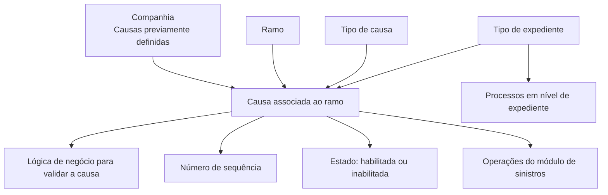

# Definição de Causas por Ramo no Módulo de Sinistros — Documentação Reef

## 1. Metadados do Documento
- **Arquivo de Origem:** Não identificado no conteúdo fornecido
- **Tipo de Documento:** Especificação Técnica / Documentação Funcional
- **Domínio / Sistema:** Reef — módulo de sinistros
- **Público-Alvo:** Administradores funcionais, tramitadores e equipes responsáveis pela parametrização de ramos e sinistros
- **Data/Versão Identificada:** Não identificada
- **Owner identificado:** `user:agonzalez_mapfre.com`
- **Lifecycle identificado:** `Approved Source / VL`

---

## 2. Resumo Executivo & Contexto de Negócio

O documento descreve a definição e a manutenção de **causas por ramo** no módulo de sinistros da documentação Reef. O objetivo é estabelecer, para cada ramo que será tratado no processo de sinistros, quais causas podem ser utilizadas nos processos do módulo, incluindo causas que representam a origem do sinistro.

As causas são previamente cadastradas no nível da companhia. A configuração por ramo não cria uma causa corporativa nova: ela associa causas corporativas existentes a um ou mais ramos e define o comportamento dessas causas dentro de cada ramo.

A parametrização inclui a identificação do ramo, o tipo de expediente quando aplicável, o tipo de causa, a chave da causa, uma lógica adicional de validação, a sequência de exibição e o estado de habilitação. Esses atributos controlam disponibilidade, ordenação e validação durante as operações de sinistros.

O processo também estabelece restrições funcionais importantes: causas do tipo **Origem do Sinistro** podem ser associadas posteriormente a causas consequência e permitem somente uma seleção; os demais tipos de causa são voltados às operações de sinistros e admitem múltiplas seleções.

---

## 3. Arquitetura, Componentes & Tecnologias Envolvidas

### Componentes e conceitos identificados

| Componente / Conceito | Papel descrito |
| :--- | :--- |
| Reef | Plataforma/documentação em que a definição de causas por ramo está registrada. |
| Módulo de sinistros | Módulo no qual as causas são utilizadas em processos e operações de sinistros. |
| Companhia | Nível no qual as causas devem existir previamente antes de serem associadas aos ramos. |
| Ramo | Entidade à qual causas previamente definidas na companhia são associadas. |
| Tipo de expediente | Entidade requerida quando a causa for destinada a um processo no nível de expediente. |
| Tipo de causa | Classificação que deve ser indicada antes de codificar ou definir causas. |
| Causa | Chave que identifica uma causa previamente definida no nível da companhia. |
| Lógica de negócio para validação | Regras adicionais que podem validar dados informados ou informações próprias da instalação. |
| Tramitadores | Usuários beneficiados pela ordenação das causas mais frequentes nas primeiras posições. |



> **Nota de Análise:** O documento não detalha arquitetura de software, APIs, métodos HTTP, contratos JSON, banco de dados, tecnologias de implementação, ambientes técnicos ou integrações externas.

---

## 4. Regras de Negócio, Especificações Funcionais & Processos

### 4.1 Objetivo da configuração

1. Para cada ramo que será tratado no módulo de sinistros, devem ser definidas todas as causas aplicáveis aos processos do módulo.
2. A definição inclui as causas de origem do sinistro.
3. Cada ramo terá as causas que poderão ser utilizadas e os atributos necessários para controlar o uso dessas causas.

### 4.2 Pré-requisito de definição corporativa

1. As causas devem estar previamente definidas no nível da companhia.
2. Uma causa definida no nível da companhia pode ser associada para utilização em um ramo ou em vários ramos.
3. A associação por ramo define as propriedades necessárias para determinar o comportamento da causa dentro daquele ramo.

### 4.3 Regra para o ramo

1. A propriedade **Ramo** indica a chave do ramo ao qual serão associadas as causas já definidas no nível da companhia.

### 4.4 Regra para tipo de expediente

1. A propriedade **Tipo de Expediente** somente é solicitada quando o tipo de causa for destinado a um processo no nível de expediente.
2. Quando a causa for destinada a um processo de sinistros, o sistema atribui o tipo de expediente genérico.
3. O tipo de expediente genérico indica que a causa é aplicável a todos os tipos de expediente.
4. Quando a causa estiver no nível de expediente, deve ser informada a chave do tipo de expediente previamente associado ao ramo em definição.

### 4.5 Regra para tipos de causa

1. Antes de codificar as causas, é necessário indicar qual tipo de causa será definido.
2. O documento menciona, como exemplos de tipos ou operações, abertura de expedientes e modificação de sinistros.
3. O documento diferencia especificamente o tipo de causa **Origem do Sinistro** dos demais tipos de causa.

### 4.6 Regra para identificação da causa

1. A propriedade **Causa** corresponde à chave pela qual as diferentes causas são identificadas.
2. A causa deve estar previamente definida no nível da companhia.
3. Uma mesma chave de causa pode ser utilizada em um ou vários ramos.

### 4.7 Regra para lógica adicional de validação

1. A propriedade **Lógica para validar a causa** pode conter lógica de negócio.
2. Essa lógica pode executar validações adicionais conforme:
   - informações introduzidas pelo usuário; ou
   - informações próprias da instalação.

### 4.8 Regra para ordenação de apresentação

1. A propriedade **Número de Sequência** define a ordem de apresentação das causas nas operações.
2. Causas mais comuns ou mais utilizadas devem receber números de sequência menores.
3. A ordenação com números menores para causas frequentes busca fazer com que elas apareçam primeiro.
4. O objetivo da ordenação é facilitar o trabalho dos tramitadores.

### 4.9 Regra para inabilitação

1. A propriedade **Inabilitada** indica se uma causa definida pode ou não ser utilizada.
2. Causas inabilitadas não serão exibidas para seleção.
3. Uma causa inabilitada não poderá ser usada nas operações em que as causas são selecionadas.

### 4.10 Regras de seleção e associação com causas consequência

1. Somente causas do tipo **Origem do Sinistro** serão posteriormente associadas às causas consequência.
2. Os demais tipos de causa são usados exclusivamente para operações de sinistros.
3. Em todos os tipos de causa, incluindo abertura de expedientes e modificação de sinistros, podem ser selecionadas várias causas.
4. A exceção é o tipo de causa **Origem do Sinistro**, para o qual somente uma causa pode ser selecionada.

---

## 5. Tabelas de Parâmetros, Ambientes e Estruturas de Dados

| Item / Parâmetro | Descrição / Função | Tipo / Valores / Formato | Ambiente / Observações |
| :--- | :--- | :--- | :--- |
| Ramo | Chave do ramo ao qual as causas previamente definidas são associadas. | Chave de ramo; formato não detalhado. | Cada configuração de causa por ramo referencia um ramo. |
| Tipo de Expediente | Identifica o tipo de expediente aplicável à causa no nível de expediente. | Chave de tipo de expediente; formato não detalhado. | Obrigatório somente para causa de processo em nível de expediente. Deve ter sido previamente associado ao ramo. |
| Tipo de expediente genérico | Tipo de expediente atribuído pelo sistema para causas de processos de sinistros. | Valor genérico; valor literal não detalhado. | Indica aplicabilidade a todos os tipos de expediente. |
| Tipo de Causa | Classificação que deve ser indicada antes da codificação/definição da causa. | Tipos citados: Origem do Sinistro; outros tipos não enumerados integralmente. | Os tipos distintos de Origem do Sinistro são voltados às operações de sinistros. |
| Causa | Chave que identifica uma causa. | Chave; formato não detalhado. | Deve existir previamente no nível da companhia. Pode ser utilizada em um ou vários ramos. |
| Lógica para validar a causa | Lógica de negócio para executar validações adicionais. | Lógica de negócio; linguagem, formato e mecanismo não detalhados. | Pode usar dados inseridos ou informações próprias da instalação. |
| Número de Sequência | Determina a ordem em que as causas são apresentadas nas operações. | Número; faixa e formato não detalhados. | Valores menores são recomendados para causas mais comuns ou mais usadas. |
| Inabilitada | Indica se a causa está disponível para uso. | Estado habilitada/inabilitada. | Causas inabilitadas não são mostradas para seleção. |
| Origem do Sinistro | Tipo de causa que pode ser associado a causas consequência. | Tipo de causa. | Permite a seleção de apenas uma causa. |
| Abertura de expedientes | Operação mencionada como exemplo de operação de sinistros. | Operação; detalhamento adicional não fornecido. | Permite seleção de várias causas, conforme a regra geral. |
| Modificação de Sinistros | Operação mencionada como exemplo de operação de sinistros. | Operação; detalhamento adicional não fornecido. | Permite seleção de várias causas, conforme a regra geral. |

---

## 6. Bateria de Perguntas & Respostas para RAG (FAQ Sintético)

### P1: Qual é o objetivo da definição de causas por ramo no módulo de sinistros?
**R:** O objetivo é definir, para cada ramo que será tratado no módulo de sinistros, todas as causas aplicáveis aos processos desse módulo, incluindo as causas de origem do sinistro. A configuração também estabelece os atributos necessários para controlar a utilização de cada causa no ramo.

### P2: Onde as causas precisam ser cadastradas antes de serem associadas a um ramo?
**R:** As causas precisam estar previamente definidas no nível da companhia. A configuração por ramo associa essas causas corporativas existentes aos ramos em que poderão ser utilizadas.

### P3: Uma mesma causa pode ser utilizada em mais de um ramo?
**R:** Sim. Uma mesma chave de causa, desde que previamente definida no nível da companhia, pode ser utilizada em um ou vários ramos.

### P4: Quando o tipo de expediente deve ser informado na configuração da causa?
**R:** O tipo de expediente somente deve ser informado quando o tipo de causa for destinado a um processo no nível de expediente. Nesse caso, deve ser utilizada a chave do tipo de expediente previamente associado ao ramo configurado.

### P5: O que acontece quando uma causa é usada em um processo de sinistros que não é específico de expediente?
**R:** Para uma causa de processo de sinistros, o sistema atribui um tipo de expediente genérico. Esse tipo genérico indica que a causa se aplica a todos os tipos de expediente.

### P6: Para que serve a lógica para validar a causa?
**R:** A lógica para validar a causa permite incluir lógica de negócio que execute validações adicionais, com base em informações introduzidas ou em informações próprias da instalação.

### P7: Como o número de sequência influencia a utilização das causas?
**R:** O número de sequência define a ordem de apresentação das causas nas operações. O documento recomenda atribuir números menores às causas mais comuns ou mais utilizadas, para que apareçam primeiro e facilitem o trabalho dos tramitadores.

### P8: O que ocorre quando uma causa está marcada como inabilitada?
**R:** Uma causa inabilitada deixa de estar disponível para uso e não é exibida para seleção nas operações.

### P9: Quais causas podem ser associadas posteriormente às causas consequência?
**R:** Somente as causas do tipo **Origem do Sinistro** podem ser posteriormente associadas às causas consequência. Os demais tipos de causa são destinados apenas às operações de sinistros.

### P10: É possível selecionar várias causas em uma operação de sinistros?
**R:** Sim. Em todos os tipos de causa podem ser selecionadas várias causas, inclusive em exemplos como abertura de expedientes e modificação de sinistros. A única exceção é o tipo **Origem do Sinistro**, no qual apenas uma causa pode ser escolhida.

### P11: O documento informa quais são todos os tipos de causa possíveis?
**R:** Não. O documento determina que o tipo de causa deve ser indicado antes de codificar as causas e destaca o tipo Origem do Sinistro, mas não apresenta uma enumeração completa de todos os tipos existentes.

### P12: O documento especifica o formato técnico das chaves de ramo, causa e tipo de expediente?
**R:** Não. O documento informa que ramo, causa e tipo de expediente são identificados por chaves, mas não detalha formato, tamanho, domínio de valores, API, banco de dados ou contrato técnico dessas chaves.

---

## 7. Glossário de Termos, Siglas & Conceitos-Chave

- **Reef:** Plataforma/documentação identificada no conteúdo como fonte da configuração de causas por ramo.
- **Ramo:** Entidade identificada por uma chave e usada para associar causas corporativas aplicáveis aos processos de sinistros.
- **Causa:** Elemento identificado por uma chave, previamente definido no nível da companhia e associado a um ou mais ramos.
- **Causa por Ramo:** Configuração que associa uma causa corporativa a um ramo e determina propriedades de comportamento da causa nesse ramo.
- **Companhia:** Nível no qual as causas devem ser definidas previamente.
- **Tipo de Causa:** Classificação da causa que deve ser indicada antes da sua codificação ou definição.
- **Origem do Sinistro:** Tipo de causa que pode ser associado a causas consequência e para o qual apenas uma seleção é permitida.
- **Causa Consequência:** Conceito mencionado como associado posteriormente apenas a causas do tipo Origem do Sinistro.
- **Tipo de Expediente:** Chave exigida quando a causa é aplicável a um processo no nível de expediente.
- **Tipo de Expediente Genérico:** Tipo atribuído pelo sistema para causas de processos de sinistros, indicando aplicação a todos os tipos de expediente.
- **Lógica de Negócio:** Lógica utilizada para executar validações extras baseadas em informações informadas ou próprias da instalação.
- **Número de Sequência:** Número que ordena a apresentação das causas nas operações.
- **Inabilitada:** Estado que impede uma causa de ser utilizada e de ser mostrada para seleção.
- **Tramitadores:** Usuários cujo trabalho é facilitado pela apresentação prioritária de causas frequentes.

---

## 8. Notas Críticas, Riscos & Limitações

- O documento não informa o nome do arquivo de origem, data, versão documental, autores adicionais ou histórico de alterações.
- Não há detalhamento de APIs, contratos de integração, métodos HTTP, estruturas JSON, banco de dados, tecnologias de implementação ou rotas de logs.
- O documento não enumera de forma completa os tipos de causa disponíveis; apenas destaca **Origem do Sinistro** e cita exemplos de operações como abertura de expedientes e modificação de sinistros.
- O formato, o domínio de valores e as regras técnicas de validação das chaves de ramo, causa e tipo de expediente não são especificados.
- A lógica de negócio de validação é mencionada, mas o documento não descreve linguagem, mecanismo de execução, critérios concretos, regras implementadas ou mensagens de erro.
- O texto recomenda que causas comuns recebam sequência menor, mas não estabelece obrigatoriedade, intervalo numérico, critérios de desempate ou comportamento para sequências repetidas.
- **Nota de Análise:** O documento afirma que causas inabilitadas não são mostradas para seleção, mas não detalha o comportamento para registros históricos, causas previamente selecionadas ou reabilitação de causas.
- **Nota de Análise:** O documento menciona uma imagem do “Mantenimiento de Causas por Ramo”, mas o conteúdo textual fornecido não contém a imagem nem elementos visuais suficientes para reconstruir a interface.

---

## 9. Conteúdo Bruto Estruturado (Referência Fiel)

```text
--- [PÁGINA 1 DE 2] ---

DEFINICIÓN Causas por Ramo
Objetivo
La nalidad es denir para cada ramo que vamos a siniestrar, todas las causas de todos los procesos del módulo de siniestros, incluidas las
causas origen del siniestro.
A cada ramo se le denirán las causas que se van a poder utilizar y los atributos necesarios.
Propiedades Causas Por Ramo
Propiedades Causas por Ramo
Las causas deben estar previamente denidas a nivel de compañía, y estas podrán ser asociadas para ser utilizadas en un ramo o varios. En
este apartado se detallará todos las propiedades necesarias para denir el comportamiento de la causa dentro de un Ramo.
Imagen del Mantenimiento de Causas por Ramo:
Documentation / DOCUMENTACIÓN Reef
DOCUMENTACIÓN Reef
Mapfredocument
DOCUMENTACIÓN Reef
Owner
user:agonzalez_mapfre.com
Lifecycle
Approved Source
 / 
 VL
Buscar Inicio Soluciones Arquitecturas APIs Componentes Cloud Documentación Zeus Reef Ayuda
ES


--- [PÁGINA 2 DE 2] ---

Ramo
Esta propiedad indica la clave del Ramo al que se va a asociar las causas denidas previamente a nivel de compañía.
Tipo de Expediente
Esta propiedad sólo se pedirá en el caso de que el tipo de causa sea para un proceso a nivel de expediente. Cuando sea de un proceso de
siniestros, el sistema asignará el tipo de expediente genérico, que indica que es para todos los tipos de expedientes. Si la causa es a nivel de
expediente, habrá que introducir la clave del tipo de expediente que previamente se haya asociado al ramo que estamos deniendo.
Tipos de Causas
Antes de codicar las causas hay que indicar que tipo de causa vamos a denir.
Causa
Esta propiedad será la clave por la que se identican las distintas causas. Las causas tienen que estar denidas previamente a nivel de la
compañía.
Una clave podrá ser utilizada para uno o varios ramos.
Lógica para validar la causa
Esta propiedad contendrá una lógica de Negocio, que podrá realizar validaciones extras en función de información introducida o información
propia de la instalación.
Número de Secuencia
Esta propiedad indicará el orden de presentación de las causas en las operaciones. Se debería intentar, poner el número de secuencia más
bajo a las causas más comunes, más usadas, para que aparezcan las primeras y facilitar el trabajo a los tramitadores.
Inhabilitada
Esta propiedad indica si la causa que está denida, está habilitada para poder ser utilizada o, por el contrario, ya no está habilitada para poder
ser usada. Las causas inhabilitadas, no se mostrarán para poder ser seleccionadas.
Preguntas frecuentes
¿Qué tipos de causas son las que luego se van asociar a las causas consecuencias?
Solamente las causas de tipo Origen deL siniestro. El resto de causas son sólo para las operaciones de siniestros.
¿Se van a poder seleccionar varias causas?
En todos los tipos de causas (Apertura de expedientes, Modicación de Siniestros...),se van a poder seleccionar varias causas, excepto
en el tipo de causa Origen del Siniestro, que sólo se podrá elegir una única causa.
Ejemplo:
```
