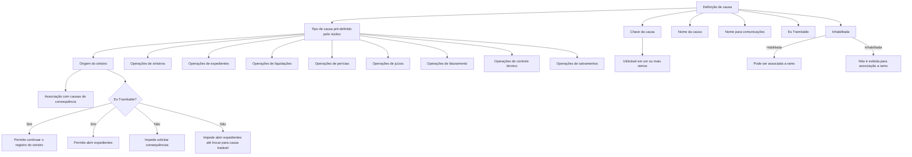

# Definição de Causas por Tipo para Processos de Sinistros — Documentação Reef

## 1. Metadados do Documento
- **Arquivo de Origem:** Não identificado no conteúdo fornecido
- **Tipo de Documento:** Especificação Técnica / Funcional
- **Domínio / Sistema:** Reef — módulo de sinistros
- **Público-Alvo:** Analistas funcionais, desenvolvedores, operação e equipes de negócio de sinistros
- **Data/Versão Identificada:** Não identificada

---

## 2. Resumo Executivo & Contexto de Negócio

O documento define o cadastro e a classificação de causas utilizadas nos processos do módulo de sinistros. O objetivo declarado é estabelecer todas as causas aplicáveis aos processos de sinistros, incluindo as causas de origem do sinistro, alterações, reaberturas, perícias, expedientes e demais operações relacionadas.

As causas possuem propriedades gerais comuns a todos os ramos. O documento diferencia a causa como chave identificadora, os textos descritivos para uso operacional e para comunicações, e indicadores de tratabilidade e habilitação para associação a ramos.

A classificação por tipo de causa é pré-definida pelo núcleo do sistema. Essa classificação determina em quais operações a causa poderá ser utilizada, incluindo operações de sinistros, expedientes, liquidações, perícias, juízos, faturamento, controle técnico e salvamentos.

A propriedade **Es Tramitable** possui comportamento específico para causas de origem de sinistro: uma causa de origem tratável permite que o sinistro continue sendo registrado e possibilita a abertura de expedientes. Uma causa de origem não tratável impede a solicitação de consequências e a abertura de expedientes até que seja selecionada uma causa tratável.

---

## 3. Arquitetura, Componentes & Tecnologias Envolvidas

O conteúdo fornecido cita os seguintes elementos:

- **Reef:** contexto de documentação e sistema associado ao módulo de sinistros.
- **Módulo de sinistros:** módulo que utiliza as causas em operações de sinistros, expedientes, liquidações, perícias, juízos, faturamento, controle técnico e salvamentos.
- **Núcleo:** componente ou referência funcional que fornece os valores pré-definidos para o tipo de causa.
- **Ramos:** escopo ao qual uma causa pode ser associada; uma mesma chave de causa pode ser utilizada em um ou mais ramos.
- **Causas de consequência:** causas que podem ser associadas exclusivamente às causas do tipo **Origen del siniestro**, conforme a seção de perguntas frequentes.



> **Nota de Análise:** O documento não detalha arquitetura técnica de software, métodos HTTP, contratos de integração, banco de dados, interfaces de usuário ou tecnologias de implementação do sistema Reef.

---

## 4. Regras de Negócio, Especificações Funcionais & Processos

### 4.1 Objetivo do cadastro de causas

O cadastro de causas deve contemplar:

- Causas de origem do sinistro.
- Causas para modificação de sinistro.
- Causas para reabertura ou reabilitação de sinistro.
- Causas para realização de perícia.
- Causas para abertura de expedientes.
- Causas para modificação de expedientes.
- Outras causas aplicáveis aos processos do módulo de sinistros.

### 4.2 Tipos de causa

Os tipos de causa são valores pré-definidos pelo núcleo. Antes de codificar ou definir uma causa, deve-se indicar o tipo de causa aplicável.

#### Origem do sinistro

As causas de origem do sinistro são utilizadas para definir as causas que originam sinistros. Posteriormente, essas causas são associadas às consequências.

Somente causas classificadas como **tipo 1 — Origen del siniestro** podem ser associadas às causas de consequência.

#### Operações de sinistros

Devem existir causas para suportar as seguintes operações de sinistros:

1. Modificação de sinistros.
2. Reabilitação de sinistros.
3. Terminação de sinistros.

#### Operações de expedientes

Devem existir causas para suportar as seguintes operações de expedientes:

1. Abertura de expedientes.
2. Modificação de expedientes.
3. Mudança de valoração.
4. Reabilitação de expedientes.
5. Terminação de expedientes.

#### Operações de liquidações

Devem existir causas para a seguinte operação de liquidações:

1. Retificação de liquidações.

#### Operações de perícias

Devem existir causas para as seguintes operações de perícias:

1. Causas de perícia.
2. Resultado da perícia.

#### Operações de juízos

Deve existir causa para a seguinte operação de juízos:

1. Reabertura do juízo.

#### Operações de faturamento

Deve existir causa para a seguinte operação de faturamento:

1. Gastos não amparados.

#### Operações de controle técnico

Devem existir causas para as seguintes operações de controle técnico:

1. Rejeição de sinistro.
2. Rejeição de expediente.

#### Operações de salvamentos

Devem existir causas para as seguintes operações de salvamentos:

1. Liberação de inventário.
2. Anulação do inventário.

### 4.3 Chave da causa

A propriedade **Causa** é a chave usada para identificar as diferentes causas:

- Causas de origem do sinistro.
- Causas definidas para os diferentes processos do módulo de sinistros.

Uma mesma chave pode ser utilizada em um ou mais ramos.

### 4.4 Nome da causa

A propriedade **Nombre de la Causa** é a descrição da chave definida para a causa. O nome pode conter números e/ou letras.

### 4.5 Nome da causa para comunicações

A propriedade **Nombre de la Causa para comunicaciones** representa a descrição da chave caso seja necessário enviar uma comunicação. Esse campo pode conter números e/ou letras.

### 4.6 Regra da propriedade “Es Tramitable”

#### Para causas do tipo “Origen de Siniestros”

Quando a propriedade **Es Tramitable** for afirmativa:

- O sistema permite que o sinistro continue sendo registrado.
- O sistema permite a abertura de expedientes.

Quando a propriedade **Es Tramitable** for negativa:

- O sistema não permite solicitar as consequências.
- O sistema não permite abrir expedientes.
- A restrição permanece até que a causa seja alterada para uma causa tratável.

#### Para os demais tipos de causa

Para outros tipos de causa, como modificação de sinistro, reabilitação de sinistro e tipos equivalentes:

- Quando a causa for tratável, o usuário poderá selecioná-la quando o processo exigir.
- Quando a causa não for tratável, ela será usada em casos extraordinários, como processos automáticos.

### 4.7 Regra da propriedade “Inhabilitada”

A propriedade **Inhabilitada** indica se uma causa definida está habilitada para associação a um ramo:

- Uma causa habilitada pode ser associada a um ramo.
- Uma causa inabilitada não pode ser utilizada na definição de causas por ramo.
- Causas inabilitadas não são exibidas para associação.

### 4.8 Seleção de múltiplas causas

- É permitido selecionar várias causas em todos os tipos de causa, incluindo abertura de expedientes e modificação de sinistros.
- A exceção é o tipo **1 — Origen del Siniestro**, no qual somente uma causa pode ser escolhida.

---

## 5. Tabelas de Parâmetros, Ambientes e Estruturas de Dados

| Item / Parâmetro | Descrição / Função | Tipo / Valores / Formato | Ambiente / Observações |
| :--- | :--- | :--- | :--- |
| Tipo de Causa | Indica o tipo de causa definido no cadastro. | Valores pré-definidos pelo núcleo. | Deve ser informado antes da codificação da causa. |
| Causa | Chave de identificação das causas de origem e das causas dos processos de sinistros. | Chave; formato não detalhado. | Uma chave pode ser usada em um ou mais ramos. |
| Nombre de la Causa | Descrição da chave definida para a causa. | Pode conter números e/ou letras. | Aplicável às causas cadastradas. |
| Nombre de la Causa para comunicaciones | Descrição da chave para situações em que se deseja enviar uma comunicação. | Pode conter números e/ou letras. | Aplicável a comunicações. |
| Es Tramitable | Indica se uma causa pode ser utilizada na tramitação de sinistros. | Afirmativo ou negativo; valores exatos não detalhados. | Possui regras específicas para origem do sinistro e para os demais tipos. |
| Inhabilitada | Indica se a causa está habilitada para associação a um ramo. | Habilitada ou inabilitada; valores exatos não detalhados. | Causas inabilitadas não são exibidas para associação. |
| Origem do sinistro | Tipo de causa para definir causas que originam sinistros. | Tipo 1 — Origen del siniestro. | Pode ser associada a causas de consequência; permite apenas uma causa selecionada. |
| Modificação de sinistros | Operação de sinistro que exige definição de causa. | Tipo de causa operacional. | Pode permitir múltiplas causas. |
| Reabilitação de sinistros | Operação de sinistro que exige definição de causa. | Tipo de causa operacional. | Pode permitir múltiplas causas. |
| Terminação de sinistros | Operação de sinistro que exige definição de causa. | Tipo de causa operacional. | Pode permitir múltiplas causas. |
| Abertura de expedientes | Operação de expediente que exige definição de causa. | Tipo de causa operacional. | Pode permitir múltiplas causas. |
| Modificação de expedientes | Operação de expediente que exige definição de causa. | Tipo de causa operacional. | Pode permitir múltiplas causas. |
| Mudança de valoração | Operação de expediente que exige definição de causa. | Tipo de causa operacional. | Pode permitir múltiplas causas. |
| Reabilitação de expedientes | Operação de expediente que exige definição de causa. | Tipo de causa operacional. | Pode permitir múltiplas causas. |
| Terminação de expedientes | Operação de expediente que exige definição de causa. | Tipo de causa operacional. | Pode permitir múltiplas causas. |
| Retificação de liquidações | Operação de liquidação que exige definição de causa. | Tipo de causa operacional. | Pode permitir múltiplas causas. |
| Causas de perícia | Operação de perícia que exige definição de causa. | Tipo de causa operacional. | Pode permitir múltiplas causas. |
| Resultado da perícia | Operação de perícia que exige definição de causa. | Tipo de causa operacional. | Pode permitir múltiplas causas. |
| Reabertura do juízo | Operação de juízo que exige definição de causa. | Tipo de causa operacional. | Pode permitir múltiplas causas. |
| Gastos não amparados | Operação de faturamento que exige definição de causa. | Tipo de causa operacional. | Pode permitir múltiplas causas. |
| Rejeição de sinistro | Operação de controle técnico que exige definição de causa. | Tipo de causa operacional. | Pode permitir múltiplas causas. |
| Rejeição de expediente | Operação de controle técnico que exige definição de causa. | Tipo de causa operacional. | Pode permitir múltiplas causas. |
| Liberação de inventário | Operação de salvamento que exige definição de causa. | Tipo de causa operacional. | Pode permitir múltiplas causas. |
| Anulação do inventário | Operação de salvamento que exige definição de causa. | Tipo de causa operacional. | Pode permitir múltiplas causas. |

---

## 6. Bateria de Perguntas & Respostas para RAG (FAQ Sintético)

### P1: Qual é o objetivo da definição de causas por tipo no módulo de sinistros?
**R:** O objetivo é definir todas as causas usadas nos processos de sinistros, incluindo causas de origem do sinistro, modificação de sinistro, reabertura ou reabilitação de sinistro, perícia, abertura de expedientes, modificação de expedientes e demais operações relacionadas.

### P2: Quais causas podem ser associadas às causas de consequência?
**R:** Somente as causas do tipo 1, denominado **Origen del siniestro**, podem ser associadas às causas de consequência. Os demais tipos de causa são destinados exclusivamente às operações de sinistros e processos relacionados.

### P3: O que acontece se uma causa de origem do sinistro não for tratável?
**R:** Quando uma causa do tipo origem do sinistro possui a propriedade **Es Tramitable** negativa, o sistema não permite solicitar consequências nem abrir expedientes. O bloqueio permanece até que a causa seja alterada para uma causa tratável.

### P4: O que permite uma causa de origem do sinistro marcada como tratável?
**R:** Uma causa de origem do sinistro marcada como tratável informa ao sistema que o sinistro pode continuar sendo registrado e que podem ser abertos expedientes.

### P5: Como funciona a propriedade “Es Tramitable” nos tipos de causa que não são origem do sinistro?
**R:** Nos demais tipos, como modificação de sinistro e reabilitação de sinistro, uma causa tratável pode ser selecionada pelo usuário quando o processo exigir. Uma causa não tratável é destinada a situações extraordinárias, como processos automáticos.

### P6: Uma mesma chave de causa pode ser utilizada em mais de um ramo?
**R:** Sim. A propriedade **Causa** é a chave identificadora das causas, e uma mesma chave pode ser utilizada para um ou vários ramos.

### P7: Qual é a finalidade da propriedade “Inhabilitada”?
**R:** A propriedade **Inhabilitada** informa se uma causa está habilitada para ser associada a um ramo. Causas inabilitadas não podem ser utilizadas na definição de causas por ramo e não são exibidas para associação.

### P8: É possível selecionar várias causas em operações do módulo de sinistros?
**R:** Sim. Em todos os tipos de causas, como abertura de expedientes e modificação de sinistros, podem ser selecionadas várias causas. A exceção é o tipo 1, **Origen del Siniestro**, para o qual somente uma única causa pode ser escolhida.

### P9: Quais operações de expediente exigem tipos de causa?
**R:** As operações de expediente que exigem definição de causa são abertura de expedientes, modificação de expedientes, mudança de valoração, reabilitação de expedientes e terminação de expedientes.

### P10: Quais operações de salvamento exigem tipos de causa?
**R:** As operações de salvamentos que exigem definição de tipos de causa são liberação de inventário e anulação do inventário.

### P11: Qual é a diferença entre “Nombre de la Causa” e “Nombre de la Causa para comunicaciones”?
**R:** O **Nombre de la Causa** é a descrição da chave definida para a causa. O **Nombre de la Causa para comunicaciones** é a descrição da chave usada quando se deseja enviar uma comunicação. Ambos os campos podem conter números e/ou letras.

### P12: Os valores de tipo de causa podem ser livremente criados pelos usuários?
**R:** Não. O documento afirma que os valores da propriedade tipo de causa já estão pré-definidos pelo núcleo.

---

## 7. Glossário de Termos, Siglas & Conceitos-Chave

- **Causa:** Chave usada para identificar causas de origem de sinistro e causas usadas nos processos do módulo de sinistros.
- **Causa de consequência:** Causa associada a uma causa do tipo 1 — origem do sinistro.
- **Es Tramitable:** Propriedade que indica se a causa pode ser utilizada na tramitação de sinistros.
- **Expediente:** Entidade ou processo do módulo de sinistros para o qual existem operações de abertura, modificação, mudança de valoração, reabilitação e terminação.
- **Inhabilitada:** Propriedade que informa que uma causa não está habilitada para associação a um ramo.
- **Núcleo:** Origem dos valores pré-definidos para a propriedade tipo de causa.
- **Peritación / Perícia:** Processo para o qual o documento define causas de perícia e resultado da perícia.
- **Ramo:** Escopo de associação das causas; o documento informa que uma chave pode ser utilizada em um ou vários ramos, sem detalhar o conceito adicionalmente.
- **Reef:** Nome presente na documentação fornecida e associado ao contexto do módulo de sinistros.
- **Siniestro:** Domínio funcional central do documento; sinistro possui causas de origem e operações de modificação, reabilitação e terminação.

---

## 8. Notas Críticas, Riscos & Limitações

- O documento afirma que os tipos de causa são pré-definidos pelo núcleo, mas não apresenta a codificação, identificadores, enumerações ou valores técnicos completos de cada tipo.
- Não foram informados os formatos técnicos da chave de causa, limites de tamanho dos nomes, obrigatoriedade dos campos ou regras de unicidade.
- O conteúdo não detalha mecanismos de autorização, perfis de usuário ou matriz de permissões para criar, editar, inabilitar ou associar causas.
- Não há descrição de APIs, contratos JSON, bancos de dados, rotas de logs, URLs de ambientes, processos de integração ou fluxos de implantação.
- A propriedade **Inhabilitada** informa que a causa não será exibida para associação a ramos, mas o documento não especifica o comportamento de causas já associadas antes da inabilitação.
- A expressão “processos automáticos” é citada como uso para causas não tratáveis em tipos diferentes de origem do sinistro, porém os processos automáticos não são identificados ou detalhados.

---

## 9. Conteúdo Bruto Estruturado (Referência Fiel)

```text
--- [PÁGINA 1 DE 3] ---

DEFINICIÓN Causas por Tipo
Objetivo
La nalidad es denir todas las causas de todos los procesos de siniestros, incluidas lascausas origen del siniestro.
Se denirán las causas por las que se modica un siniestro, causas por las que se reabre un siniestro, causas por las que se realiza una
peritación, causas de apertura de expedientes, causas por las que se modica un expediente, etc.
Propiedades Causas Generales
Propiedades Generales Causas
En este apartado se detallarán todos las propiedades de las causas, comunes a todos los ramos, es decir los atributos que no cambian por
ramo.
Imagen del Mantenimiento Causas a nivel General:
Documentation / DOCUMENTACIÓN Reef
DOCUMENTACIÓN Reef
Mapfredocument
DOCUMENTACIÓN Reef
Owner
user:agonzalez_mapfre.com
Lifecycle
Approved Source
 / 
 VL
Buscar Inicio Soluciones Arquitecturas APIs Componentes Cloud Documentación Zeus Reef Ayuda
ES


--- [PÁGINA 2 DE 3] ---

Tipo de Causa
Esta propiedad nos indicará el tipo de causa que se está deniendo.
Hay que denir tanto las causas origen del siniestro, como las causas de los diferentes procesos del módulo de siniestros. Los tipos de
causa vienen dado por el núcleo
Los valores de esta propiedad ya están prejados y son estos:
TIPOS DE CAUSAS
Antes de codicar las causas hay que indicar que tipo de causa vamos a denir.
A continuación se enumeran los distintos tipos de causas que existen:
Origen del siniestro
En este tipo de causa, se van a denir las causas que son origen de siniestros. Estas serán luego asociadas a las consecuencias.
Causa del Siniestro (Origen)
Operaciones Siniestros
Hay que denir estos tipos de causa, para poder realizar las siguientes operaciones de siniestros:
Modicación de Siniestros
Rehabilitación de Siniestros
Terminación de Siniestros
Operaciones Expedientes
Hay que denir estos tipos de causa, para realizar las operaciones de expedientes:
Apertura de Expedientes
Modicación de Expedientes
Cambio de Valoración
Rehabilitación de Expedientes
Terminación de Expedientes
Operaciones Liquidaciones
Hay que denir estos tipos de causa, para realizar las operaciones de expedientes:
Recticación de Liquidaciones
Operaciones Peritaciones
Hay que denir estos tipos de causa, para realizar las operaciones de peritaciones:
Causas de Peritación
Resultado de la Peritación
Operaciones Juicios
Hay que denir estos tipos de causa, para realizar las operaciones de juicios:
Reapertura del Juicio
Operaciones Facturación
Hay que denir este tipo de causa, para realizar las operaciones de facturación:
Gastos No Amparados
Operaciones Control Técnico
Hay que denir estos tipos de causa, para realizar las operaciones de control técnico:
Rechazo Siniestro
Rechazo Expediente
Operaciones Salvamentos


--- [PÁGINA 3 DE 3] ---

Hay que denir estos tipos de causa, para realizar las operaciones de salvamentos:
Liberación Inventario
Anulación del Inventario
Causa
Esta propiedad será la clave por la que se va a identicar las distintas causas. Tanto las causas origen del siniestro, como las causas
denidas para los distintos procesos del módulo de siniestros.
Una clave podrá ser utilizada para uno o varios ramos.
Nombre de la Causa
Esta propiedad será la descripción de la clave denida para la causa. Puede contener números y/o letras.
Nombre de la Causa para comunicaciones
Esta propiedad será la descripción de la clave en el caso de que se quiera enviar una comunicación. Puede contener números y/o letras.
Es Tramitable
En esta propiedad indicará si la causa que se está deniendo, se va a utilizar en la tramitación de siniestros.
Cuando la causa es del tipo:
Tipo de Causa- Origen de Siniestros
Si esta propiedad es armativo, le indicará al sistema que el siniestro puede continuar registrándose y se podrán abrir expedientes.
Si esta propiedad es negativo, le indicará al sistema que no se pueden pedir las consecuencias, ni abrir expedientes, hasta que no se
cambie a una causa tramitable.
Resto Tipos de Causas (Tipo Modicación del siniestro, Tipo Rehabilitación de siniestros, etc.)
Si la propiedad indica que es Tramitable, el usuario podrá seleccionar dicha causa cuando el proceso lo requiera.
Si la propiedad indica que No es tramitable se utilizará para casos extraordinarios, como procesos automáticos.
Inhabilitada
Esta propiedad indica si la causa que está denida, está habilitada para poder ser asociada a un ramo, o por el contrario, ya no está habilitada
para poder ser utilizada en la denición de causas por Ramo. Las causas inhabilitadas, no se mostrarán para poder ser asociadas.
Preguntas frecuentes
¿Qué tipos de causas son las que luego se van asociar a las causas consecuencias?
Solamente las causas de tipo 1 Origen deL siniestro. El resto de causas son sólo para las operaciones de siniestros.
¿Se van a poder seleccionar varias causas?
En todos los tipos de causas (Apertura de expedientes, Modicación de Siniestros...),se van a poder seleccionar varias causas, excepto
en el tipo de causa 1- Origen del Siniestro, que sólo se podrá elegir una única causa.
Ejemplos
Ejemplo:
Ejemplos
```
