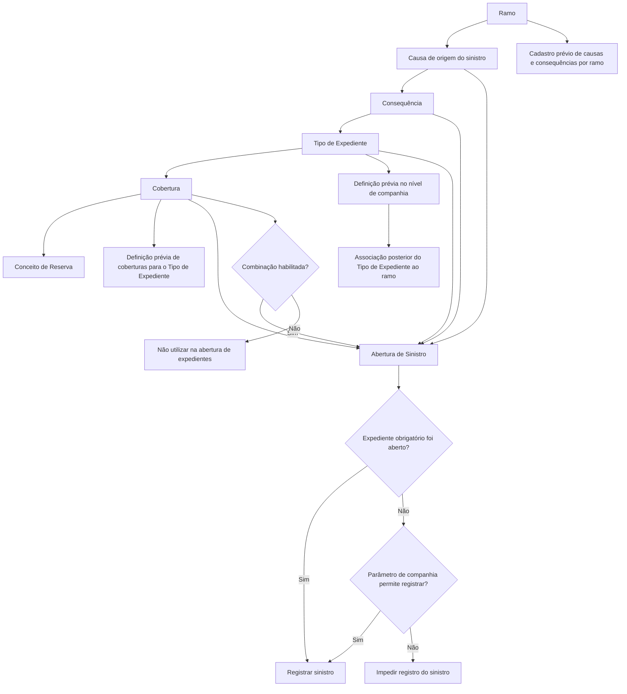

# Definição de Tipos de Expediente por Causa e Consequência — Documentação Reef

## 1. Metadados do Documento
- **Arquivo de Origem:** Não identificado no conteúdo fornecido
- **Tipo de Documento:** Especificação Técnica / Manual Funcional
- **Domínio / Sistema:** Reef — abertura de sinistros e manutenção de tipos de expediente, coberturas, causas e consequências
- **Público-Alvo:** Analistas funcionais, desenvolvedores, equipes de operação e negócio
- **Data/Versão Identificada:** Não identificada

---

## 2. Resumo Executivo & Contexto de Negócio

O documento define a manutenção de associações entre ramo, causa, consequência, tipo de expediente e cobertura no contexto de abertura de sinistros no sistema Reef. A finalidade declarada é determinar, para cada combinação de causa e consequência, quais tipos de expediente e coberturas podem ser afetados ou disponibilizados durante a abertura de um sinistro.

A configuração depende de cadastros prévios. Para inserir informações no catálogo, as causas e consequências precisam ter sido registradas por ramo. Da mesma forma, consequências precisam estar previamente definidas no ramo; tipos de expediente precisam ter sido definidos no nível de companhia e posteriormente associados ao ramo; e coberturas precisam ter sido definidas para o tipo de expediente correspondente.

A combinação configurada contém propriedades que controlam obrigatoriedade, efeito sobre apólice ou risco e disponibilidade operacional. A propriedade **Obrigatório** pode impedir o registro do sinistro caso um expediente requerido não seja aberto, salvo se um parâmetro no nível de companhia permitir o registro. A propriedade **Anula Póliza** indica se a abertura do expediente implica anulação da apólice com um único risco ou anulação do risco. A marca **Inhabilitado** retira a combinação da utilização futura na abertura de expedientes.

O documento também registra regras para situações em que consequências distintas afetam a mesma combinação de tipo de expediente, cobertura e conceito de reserva. Consequências associadas à mesma causa podem coexistir, mas tornam-se mutuamente excludentes na abertura do sinistro. Quando duas consequências afetam o mesmo expediente e cobertura, mas possuem conceitos de reserva diferentes, o sistema abre um único expediente com a mesma cobertura e os distintos conceitos de reserva.

---

## 3. Arquitetura, Componentes & Tecnologias Envolvidas

Os componentes e entidades explicitamente citados são:

- **Reef:** sistema ou domínio documental mencionado como “DOCUMENTACIÓN Reef”.
- **Catálogo de Tipos de Expediente por Causa e Consequência:** manutenção que configura relações utilizadas na abertura de sinistros.
- **Ramo:** chave do ramo para o qual causas e consequências são definidas.
- **Causa:** chave da causa associada aos tipos de expediente permitidos; precisa ser uma causa de origem do sinistro.
- **Consequência:** chave da consequência associada a uma causa e previamente definida no ramo.
- **Tipo de Expediente:** chave do tipo de expediente associado à causa e consequência.
- **Cobertura:** chave da cobertura associada à causa, consequência e tipo de expediente.
- **Conceito de Reserva:** elemento mencionado nas regras de coexistência e no exemplo de abertura de expediente.
- **Abertura de Sinistros:** processo no qual as combinações habilitadas e obrigatórias são aplicadas.
- **Parâmetro de Companhia:** parâmetro citado como possível exceção para permitir o registro de um sinistro sem a abertura de um expediente obrigatório.



> **Nota de Análise:** O documento não detalha tecnologias de implementação, APIs, contratos HTTP, bancos de dados, URLs, ambientes ou integrações técnicas. Também não especifica a identificação do parâmetro de companhia que pode permitir o registro do sinistro sem expediente obrigatório.

---

## 4. Regras de Negócio, Especificações Funcionais & Processos

### 4.1 Finalidade do catálogo

O catálogo define, para cada causa e consequência, os tipos de expediente e coberturas que podem ser afetados durante a abertura de expedientes ou sinistros.

Para introduzir informações no catálogo, deve existir registro prévio de causas e consequências por ramo.

### 4.2 Regras de associação por entidade

1. **Ramo**
   - A propriedade Ramo é a chave do ramo para o qual causas e consequências estão sendo definidas.

2. **Causa**
   - A propriedade Causa é a chave da causa à qual serão associados os tipos de expediente passíveis de abertura quando essa causa for selecionada na abertura de sinistros.
   - A causa deve ser do tipo **causa de origem do sinistro**.

3. **Consequência**
   - A propriedade Consequência é a chave da consequência associada à causa.
   - Somente podem ser associadas consequências previamente definidas no nível de ramo.

4. **Tipo de Expediente**
   - A propriedade Tipo de Expediente é a chave do tipo de expediente associado à causa e à consequência.
   - Somente podem ser associados tipos de expediente previamente definidos no nível de companhia e posteriormente associados ao ramo em definição.

5. **Cobertura**
   - A propriedade Cobertura é a chave da cobertura associada à causa, consequência e tipo de expediente.
   - Somente podem ser associadas coberturas previamente definidas para o tipo de expediente.

6. **Obrigatório**
   - Indica se é obrigatório abrir um expediente daquele tipo para o sinistro.
   - Caso a abertura seja obrigatória e não ocorra, o sistema não permitirá registrar o sinistro.
   - A restrição possui uma exceção: o sinistro poderá ser registrado se um parâmetro definido no nível de companhia permitir esse comportamento.

7. **Anula Póliza**
   - Indica se a abertura daquele tipo de expediente implica:
     - a anulação da apólice, quando a apólice possuir somente um risco; ou
     - a anulação do risco.

8. **Inhabilitado**
   - Indica que a combinação de Causa, Consequência, Tipo de Expediente e Cobertura está inabilitada.
   - Uma combinação inabilitada deixa de poder ser utilizada na abertura de expedientes.

### 4.3 Regras para consequências e conceitos de reserva

- É permitido que, dentro de uma mesma causa, existam duas consequências que afetem o mesmo Tipo de Expediente, Cobertura e Conceito de Reserva.
- Quando isso ocorrer, as consequências são excludentes:
  - ao selecionar uma consequência na abertura de um sinistro;
  - não será possível selecionar a outra consequência.

- Quando duas consequências afetam:
  - o mesmo expediente;
  - a mesma cobertura; e
  - conceitos de reserva distintos;

  o sistema não abre dois expedientes. O sistema abre um único expediente, com a mesma cobertura e conceitos de reserva distintos.

### 4.4 Exemplo apresentado

O exemplo associa consequências relacionadas a danos ao veículo segurado a um mesmo tipo de expediente e cobertura, mas com conceitos de reserva diferentes:

| Consequência / Descrição apresentada | Tipo de Expediente | Cobertura | Conceito de Reserva |
| :--- | :--- | :--- | :--- |
| 3001 — Despiste / Daños Vehículo Asegurado | DPM | 3001 — Daños Propios | 1 — Indemnización |
| 3002 — Daños Vehículo Asegurado / Honorarios | DPM | 3001 — Daños Propios | 2 — Honorarios |

O expediente resultante terá:

| Tipo de Expediente | Cobertura | Conceito de Reserva |
| :--- | :--- | :--- |
| DPM | 3001 — Daños Propios | 1 — Indemnización |
| DPM | 3001 — Daños Propios | 2 — Honorarios |

---

## 5. Tabelas de Parâmetros, Ambientes e Estruturas de Dados

| Item / Parâmetro | Descrição / Função | Tipo / Valores / Formato | Ambiente / Observações |
| :--- | :--- | :--- | :--- |
| Ramo | Chave do ramo para o qual causas e consequências são definidas. | Chave; formato não detalhado. | Requerido para a configuração. |
| Causa | Chave da causa associada aos tipos de expediente que podem ser abertos na abertura de sinistros. | Deve ser causa de origem do sinistro. | Associada ao ramo. |
| Consequência | Chave da consequência associada à causa. | Chave; formato não detalhado. | Deve estar previamente definida no ramo. |
| Tipo de Expediente | Chave do tipo de expediente associado a causa e consequência. | Chave; formato não detalhado. | Deve estar definido no nível de companhia e associado posteriormente ao ramo. |
| Cobertura | Chave da cobertura associada à causa, consequência e tipo de expediente. | Chave; formato não detalhado. | Deve estar previamente definida para o tipo de expediente. |
| Obrigatório | Define se a abertura de expediente de determinado tipo é obrigatória para o sinistro. | Indicador lógico; valores não detalhados. | Pode bloquear o registro do sinistro, salvo exceção por parâmetro de companhia. |
| Anula Póliza | Define se a abertura do expediente implica anulação da apólice ou do risco. | Indicador lógico; valores não detalhados. | A anulação da apólice é aplicável quando a apólice possui apenas um risco. |
| Inhabilitado | Define se a combinação de causa, consequência, tipo de expediente e cobertura pode ser utilizada. | Marca ou indicador; valores não detalhados. | Combinação inabilitada não pode ser usada na abertura de expedientes. |
| Conceito de Reserva | Conceito associado à reserva em uma combinação de expediente e cobertura. | Exemplos: `1 Indemnización`; `2 Honorarios`. | Conceitos distintos podem coexistir no mesmo expediente e cobertura. |
| Parâmetro de companhia | Parâmetro que pode permitir registrar sinistro sem abertura de expediente obrigatório. | Não detalhado. | Nome, valor e localização do parâmetro não são informados. |
| Tipo de Expediente `DPM` | Tipo de expediente exibido no exemplo. | Código `DPM`. | Associado à cobertura `3001 Daños Propios`. |
| Cobertura `3001 Daños Propios` | Cobertura exibida no exemplo. | Código `3001`; descrição `Daños Propios`. | Associada ao tipo de expediente `DPM`. |

> **Nota de Análise:** O documento não apresenta servidores, URLs, variáveis de log, portas, versões de software, ambientes de desenvolvimento/homologação/produção ou estruturas de payload.

---

## 6. Bateria de Perguntas & Respostas para RAG (FAQ Sintético)

### P1: Qual é a finalidade da manutenção de Tipos de Expediente por Causa e Consequência?
**R:** A manutenção define, para cada causa e consequência, quais tipos de expediente e coberturas podem ser afetados ou utilizados durante a abertura de expedientes e sinistros. O catálogo organiza as associações entre ramo, causa, consequência, tipo de expediente e cobertura.

### P2: Quais pré-requisitos são necessários para registrar informações no catálogo?
**R:** Para introduzir informações no catálogo, as causas e consequências devem estar previamente registradas por ramo. Além disso, a consequência deve estar definida no ramo, o tipo de expediente deve estar definido no nível de companhia e associado ao ramo, e a cobertura deve estar previamente definida para o tipo de expediente.

### P3: Que tipo de causa pode ser associada a tipos de expediente na abertura de sinistros?
**R:** A causa associada aos tipos de expediente deve ser uma causa de origem do sinistro. Essa causa é selecionada no processo de abertura de sinistros para determinar os tipos de expediente que podem ser abertos.

### P4: O que acontece se um expediente marcado como obrigatório não for aberto?
**R:** Se um expediente obrigatório não for aberto, o sistema não permitirá registrar o sinistro. A exceção ocorre somente se um parâmetro definido no nível de companhia permitir o registro do sinistro mesmo sem a abertura do expediente obrigatório.

### P5: O que significa a propriedade Anula Póliza?
**R:** A propriedade Anula Póliza indica se a abertura de um tipo de expediente implica a anulação da apólice quando ela possui somente um risco, ou a anulação do risco. O documento não detalha os valores possíveis do indicador nem o processamento posterior da anulação.

### P6: Qual é o efeito da marca Inhabilitado em uma combinação configurada?
**R:** A marca Inhabilitado indica que a combinação de Causa, Consequência, Tipo de Expediente e Cobertura está inabilitada. Essa combinação deixa de poder ser utilizada durante a abertura de expedientes.

### P7: Duas consequências da mesma causa podem afetar o mesmo tipo de expediente, cobertura e conceito de reserva?
**R:** Sim. O documento estabelece que duas consequências dentro de uma mesma causa podem afetar o mesmo Tipo de Expediente, Cobertura e Conceito de Reserva. Entretanto, essas consequências são excludentes: ao selecionar uma na abertura do sinistro, a outra não poderá ser selecionada.

### P8: Se duas consequências afetam o mesmo expediente e a mesma cobertura, mas possuem conceitos de reserva diferentes, o sistema abre dois expedientes?
**R:** Não. Quando duas consequências afetam o mesmo expediente e a mesma cobertura, mas possuem diferentes conceitos de reserva, o sistema abre um único expediente com a mesma cobertura e os conceitos de reserva distintos.

### P9: Quais são os tipos de expediente permitidos para associação no catálogo?
**R:** Somente podem ser associados tipos de expediente que tenham sido previamente definidos no nível de companhia e posteriormente associados ao ramo que está sendo configurado.

### P10: Quais coberturas podem ser associadas a uma causa, consequência e tipo de expediente?
**R:** Somente podem ser associadas coberturas que já tenham sido previamente definidas para o tipo de expediente correspondente.

### P11: O que demonstra o exemplo com o tipo de expediente DPM?
**R:** O exemplo demonstra que o tipo de expediente `DPM`, com a cobertura `3001 Daños Propios`, pode reunir os conceitos de reserva `1 Indemnización` e `2 Honorarios` em um único expediente, quando as consequências relacionadas afetam a mesma combinação de expediente e cobertura.

### P12: O documento define APIs, métodos HTTP ou contratos JSON para o catálogo?
**R:** Não. O documento descreve regras funcionais e propriedades de configuração, mas não detalha APIs, métodos HTTP, contratos JSON, endpoints, tecnologias de implementação ou estruturas de persistência.

---

## 7. Glossário de Termos, Siglas & Conceitos-Chave

- **Reef:** Nome do sistema ou domínio documental mencionado como “DOCUMENTACIÓN Reef”.
- **Ramo:** Chave do ramo no qual causas e consequências são definidas.
- **Causa:** Chave da causa associada aos tipos de expediente permitidos; deve ser uma causa de origem do sinistro.
- **Consequência:** Chave associada a uma causa e previamente definida no ramo.
- **Tipo de Expediente:** Tipo de registro ou expediente associado à causa e consequência na abertura de sinistros.
- **Cobertura:** Cobertura associada à combinação de causa, consequência e tipo de expediente.
- **Siniestro:** Termo apresentado no documento em espanhol para sinistro.
- **Expediente:** Termo apresentado no documento em espanhol para o registro ou processo de expediente vinculado ao sinistro.
- **Conceito de Reserva / Cto. Rva:** Conceito associado à reserva; no exemplo, `1 Indemnización` e `2 Honorarios`.
- **DPM:** Código de Tipo de Expediente apresentado no exemplo. O documento não informa sua expansão.
- **Daños Propios:** Descrição da cobertura de código `3001` apresentada no exemplo.
- **Indemnización:** Conceito de reserva `1` apresentado no exemplo.
- **Honorarios:** Conceito de reserva `2` apresentado no exemplo.
- **Anula Póliza:** Indicador que informa se a abertura de expediente produz anulação da apólice ou do risco.
- **Inhabilitado:** Marca que torna uma combinação indisponível para a abertura de expedientes.

---

## 8. Notas Críticas, Riscos & Limitações

- O documento não identifica o arquivo de origem, data, versão, autor técnico, ambiente ou versão do sistema Reef.
- O documento menciona um parâmetro de companhia que pode permitir o registro de sinistro sem expediente obrigatório, mas não detalha nome, configuração, valores possíveis, responsáveis ou efeitos adicionais desse parâmetro.
- O documento não descreve validações de formato, unicidade, obrigatoriedade de campos de manutenção ou mensagens de erro.
- O documento não detalha contratos de integração, APIs, métodos HTTP, eventos, banco de dados, logs, auditoria ou controles de acesso.
- A regra de consequências excludentes é apresentada funcionalmente, mas não especifica como a exclusão é representada, validada ou mantida no catálogo.
- A propriedade Anula Póliza informa possíveis efeitos sobre apólice e risco, mas o documento não detalha o processo operacional, transacional ou as consequências posteriores da anulação.
- O exemplo possui formatação extraída de forma ambígua em sua tabela de origem. A interpretação estruturada preserva os códigos e descrições explicitamente apresentados, sem inferir atributos não documentados.

---

## 9. Conteúdo Bruto Estruturado (Referência Fiel)

```text
--- [PÁGINA 1 DE 3] ---

DEFINICIÓN Tipos de Expedientes por Causa Consecuencia
Objetivo
La nalidad es denir para cada causa, consecuencias, qué tipos de expedientes, coberturas se van a poder afectar en la apertura de
expedientes.
Para poder introducir información en este catálogo, se tiene que haber registrado las causas/consecuencias por ramo
DEFINICIÓN Tipos de Expediente por Causa, Consecuencia
En este apartado se detallarán todos los atributos, propiedades, que habrá que denir para asociar los tipos de expedientes y coberturas a las
causas, consecuencias.
Imagen del Mantenimiento Tipo Expediente, Cobertura por Causa Consecuencia
Ramo
Documentation / DOCUMENTACIÓN Reef
DOCUMENTACIÓN Reef
Mapfredocument
DOCUMENTACIÓN Reef
Owner
user:agonzalez_mapfre.com
Lifecycle
Approved Source
 / 
 VL
Buscar Inicio Soluciones Arquitecturas APIs Componentes Cloud Documentación Zeus Reef Ayuda
ES


--- [PÁGINA 2 DE 3] ---

Esta propiedad será la clave del ramo para la que estamos deniendo las causas consecuencias.
Causa
Esta propiedad será la clave de la causa a la que vamos a asociar los tipos de expedientes que se van a poder aperturar si se selecciona la
misma en la apertura de siniestros. Esta causa tiene que ser de tipo causa origen del siniestro.
Consecuencia
Esta propiedad será la clave de la consecuencia que vamos a asociar a la causa.
Sólo se podrán asociar las consecuencias que previamente se hayan denido a nivel de ramo..
Tipo de Expediente por Causa Consecuencia
Tipo de Expediente
Esta propiedad será la clave del tipo de Expediente que vamos a asociar a la causa y a la consecuencia.
Sólo se podrán asociar los tipos de expediente que previamente se hayan denido a nivel de compañía y se hayan asociado posteriormente al
ramo que estamos deniendo.
Cobertura
Esta propiedad será la clave de la cobertura que vamos a asociar a la causa, a la consecuencia y al Tipo de Expediente Sólo se podrán
asociar las coberturas que previamente hayamos denido para el tipo de expediente.
Obligatorio
Esta propiedad indica, si es obligatorio que al siniestro se le abra un expediente de este Tipo. Si es obligatorio abrirlo y no se abre, el sistema
no te dejará registrar el siniestro, al menos que el parámetro a nivel de compañía lo permita.
Anula Póliza
Esta propiedad indicará si la apertura de este tipo de Expediente, supone la anulación de la póliza, si esta sólo tiene un riesgo, o la anulación
del riesgo.
Inhabilitado
Esta Marca indicará si esta combinación de Causa-Consecuencia-Tipo de Expediente, Cobertura está habilitado o inhabilitado y ya no se
puede utilizar en la apertura de Expedientes.
Preguntas frecuentes
¿Puede existir dentro de una misma causa dos consecuencias que afecten al mismo Tipo de Expediente, Cobertura, Concepto de
Reserva?
Si puede existir, pero estas consecuencias serán excluyentes, es decir si se selecciona una, no se podrá seleccionar la otra, cuando se
abra un siniestro.
¿Qué pasa si dos consecuencias afectan al mismo expediente, cobertura y distinto concepto de reserva, se abren dos expedientes?
No, se abre un sólo expediente con la misma cobertura y distinto concepto de reserva.
Causa Consecuencia Tipo Exp. Cobertura Cto. Rva
3001 Despiste 3001 Daños Vehículo Asegurado DPM 3001 Daños Propios 1 Indemnización
3002 Daños Vehículo Asegurado Honorarios DPM 3001 Daños Propios 2 Honorarios
El Expediente que se abra tendrá lo siguiente:
Ejemplo:


--- [PÁGINA 3 DE 3] ---

Tipo de Expediente Cobertura Concepto de Reserva
DPM 3001 Daños Propios 1 Indemnización
3001 Daños Propios 2 Honorarios
```
