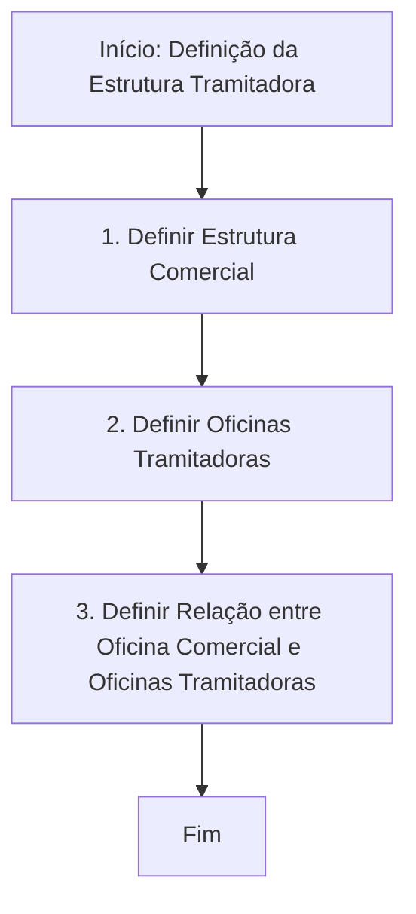

# Definição da Estrutura Tramitadora de Sinistros

## 1. Metadados do Documento
- **Arquivo de Origem:** Não identificado no conteúdo fornecido
- **Tipo de Documento:** Procedimento
- **Domínio / Sistema:** Reef / Mapfre — gestão de sinistros
- **Público-Alvo:** Operação, Negócio e equipes responsáveis pela configuração de estruturas tramitadoras
- **Data/Versão Identificada:** Não identificada

---

## 2. Resumo Executivo & Contexto de Negócio

O documento descreve um procedimento para definir a **estrutura tramitadora de sinistros**. O objetivo declarado é explicar os passos necessários para estabelecer a organização responsável pela tramitação de sinistros.

O processo é composto por três etapas sequenciais: definição da estrutura comercial, definição das oficinas tramitadoras e definição da relação entre a oficina comercial e as oficinas tramitadoras. O fluxo é concluído após a configuração dessa relação.

O conteúdo está associado à documentação do sistema **Reef**, disponível no contexto de documentação corporativa Mapfre. A página indica estado de ciclo de vida como **Approved** e identifica um proprietário com o valor `user:agonzalez_mapfre.com`.

O material é resumido e não especifica critérios para criação de estruturas, atributos das oficinas, regras de associação, responsabilidades operacionais, validações, telas, APIs ou contratos de integração.

---

## 3. Arquitetura, Componentes & Tecnologias Envolvidas

Os componentes explicitamente citados no procedimento são:

- **Estrutura Comercial:** elemento definido na primeira etapa do processo.
- **Oficinas Tramitadoras:** unidades definidas na segunda etapa do processo.
- **Relação Oficina Comercial / Oficinas Tramitadoras:** associação definida na terceira etapa.
- **Reef:** contexto de documentação onde o procedimento está publicado.
- **Mapfredocument:** referência exibida no conteúdo bruto.
- **Documentación Reef:** área documental apresentada na interface de origem.



**Nota de Análise:** o documento não descreve arquitetura de software, integrações, microsserviços, banco de dados, métodos HTTP, URLs de ambiente ou tecnologias de implementação.

---

## 4. Regras de Negócio, Especificações Funcionais & Processos

### Processo de definição da estrutura tramitadora

1. **Definir Estrutura Comercial**
   - O processo começa com a definição da estrutura comercial.
   - O documento não detalha quais campos, níveis hierárquicos, critérios ou regras devem compor a estrutura comercial.

2. **Definir Oficinas Tramitadoras**
   - Após definir a estrutura comercial, devem ser definidas as oficinas tramitadoras.
   - O documento não informa atributos, responsáveis, escopo geográfico, capacidade operacional ou critérios de seleção das oficinas tramitadoras.

3. **Definir Relação entre Oficina Comercial e Oficinas Tramitadoras**
   - A terceira etapa consiste em definir a relação entre a oficina comercial e as oficinas tramitadoras.
   - A conclusão dessa relação encerra o fluxo apresentado.
   - O documento não especifica cardinalidade, condições de elegibilidade, regras de prioridade, vigência ou tratamento de conflitos da relação.

### Sequência obrigatória identificada

A ordem exibida no documento é:

1. Definir estrutura comercial.
2. Definir oficinas tramitadoras.
3. Definir a relação entre oficina comercial e oficinas tramitadoras.
4. Finalizar o processo.

---

## 5. Tabelas de Parâmetros, Ambientes e Estruturas de Dados

| Item / Parâmetro | Descrição / Função | Tipo / Valores / Formato | Ambiente / Observações |
| :--- | :--- | :--- | :--- |
| Estrutura Comercial | Primeiro elemento a ser definido no processo de estrutura tramitadora. | Não detalhado | Etapa 1 do fluxo. |
| Oficinas Tramitadoras | Unidades que devem ser definidas após a estrutura comercial. | Não detalhado | Etapa 2 do fluxo. |
| Relação Oficina Comercial / Oficinas Tramitadoras | Associação entre a oficina comercial e as oficinas tramitadoras. | Não detalhado | Etapa 3 e final do fluxo. |
| Sistema documental | Contexto de publicação da documentação. | Reef / Documentación Reef | Interface menciona “Documentation / DOCUMENTACIÓN Reef”. |
| Fonte documental | Referência apresentada no conteúdo original. | Mapfredocument | Sem detalhamento adicional. |
| Proprietário | Identificação de proprietário apresentada na página. | `user:agonzalez_mapfre.com` | Valor literal extraído do documento. |
| Ciclo de vida | Estado documental exibido na página. | Approved | O conteúdo também exibe “Source / VL” sem explicação. |
| Idioma da interface | Idioma indicado no menu da página. | ES | O texto procedimental está em espanhol. |

---

## 6. Bateria de Perguntas & Respostas para RAG (FAQ Sintético)

### P1: Qual é o objetivo do documento sobre estrutura tramitadora de sinistros?
**R:** O objetivo do documento é explicar os passos a seguir para definir a estrutura tramitadora de sinistros.

### P2: Quais são as etapas do processo de definição da estrutura tramitadora?
**R:** O processo possui três etapas: definir a estrutura comercial, definir as oficinas tramitadoras e definir a relação entre a oficina comercial e as oficinas tramitadoras.

### P3: Qual é a primeira etapa para configurar uma estrutura tramitadora?
**R:** A primeira etapa é definir a estrutura comercial.

### P4: O que deve ser definido após a estrutura comercial?
**R:** Após a definição da estrutura comercial, devem ser definidas as oficinas tramitadoras.

### P5: Qual atividade encerra o processo de definição da estrutura tramitadora?
**R:** O processo termina após a definição da relação entre a oficina comercial e as oficinas tramitadoras.

### P6: O documento define quais dados devem ser cadastrados para uma oficina tramitadora?
**R:** Não. O documento indica que as oficinas tramitadoras devem ser definidas, mas não detalha campos, atributos, regras de cadastro ou critérios operacionais.

### P7: O documento informa como deve funcionar a relação entre uma oficina comercial e uma oficina tramitadora?
**R:** Não. O documento estabelece que a relação deve ser definida, mas não especifica cardinalidade, critérios de associação, prioridade, vigência ou regras de exceção.

### P8: Em qual contexto documental o procedimento está publicado?
**R:** O procedimento aparece no contexto de documentação Reef, com referências a “Documentation / DOCUMENTACIÓN Reef” e “Mapfredocument”.

### P9: Qual é o estado de ciclo de vida identificado para o documento?
**R:** O conteúdo bruto apresenta o ciclo de vida como `Approved`.

### P10: O documento apresenta APIs, integrações ou arquitetura técnica para a estrutura tramitadora?
**R:** Não. O material fornecido apresenta apenas um fluxo funcional resumido para definição da estrutura tramitadora e não descreve APIs, integrações, microsserviços ou arquitetura técnica.

---

## 7. Glossário de Termos, Siglas & Conceitos-Chave

- **Estrutura Tramitadora:** estrutura cuja definição é o objetivo central do procedimento, relacionada à tramitação de sinistros.
- **Sinistros:** domínio de negócio mencionado no objetivo do documento.
- **Estrutura Comercial:** primeiro elemento a ser definido no fluxo apresentado.
- **Oficinas Tramitadoras:** unidades definidas na segunda etapa do processo.
- **Oficina Comercial:** entidade relacionada às oficinas tramitadoras na terceira etapa.
- **Reef:** sistema ou contexto documental citado na navegação e na identificação da documentação.
- **Mapfredocument:** referência documental exibida no conteúdo original.
- **Lifecycle:** campo de ciclo de vida documental exibido como `Approved`.
- **Approved:** estado de ciclo de vida identificado no conteúdo.
- **VL:** termo exibido após `Source /`; o documento não define seu significado.
- **ES:** indicador de idioma exibido na interface; o contexto sugere espanhol.

---

## 8. Notas Críticas, Riscos & Limitações

- O documento é altamente resumido e apresenta apenas a sequência de alto nível do processo.
- Não há detalhamento sobre critérios de criação ou manutenção da estrutura comercial.
- Não há especificação dos atributos, responsabilidades ou regras de operação das oficinas tramitadoras.
- A relação entre oficina comercial e oficinas tramitadoras não possui regras de cardinalidade, prioridade, vigência ou exceções documentadas.
- Não foram identificados requisitos técnicos, integrações, URLs, ambientes, permissões, logs, APIs ou estruturas de dados.
- O termo `VL` aparece no conteúdo, mas não possui definição contextual.
- **Nota de Análise:** o documento menciona Reef e Mapfredocument, porém não detalha como a configuração da estrutura tramitadora é implementada ou administrada nesses sistemas.

---

## 9. Conteúdo Bruto Estruturado (Referência Fiel)

```text
--- [PÁGINA 1 DE 1] ---

DEFINICIÓN Estructura Tramitadora
Objetivo
Explicar los pasos a seguir para denir la estructura tramitadora de siniestros
Proceso para la denición Estructura tramitadora
DEFINIR
Estructura
Comercial(1)
DEFINIR
Oficinas
Tramitadoras (2)
DEFINIR
Relación
Oficina Comercial
Oficinas Tramitadora(3)
FIN
1. DEFINIR Estructura Comercial
2. DEFINIR Ocinas Tramitadoras
3. DEFINIR Relación Ocinas
Checking links...
Documentation / DOCUMENTACIÓN Reef
DOCUMENTACIÓN Reef
Mapfredocument
DOCUMENTACIÓN Reef
Owner
user:agonzalez_mapfre.com
Lifecycle
Approved Source
 / 
 VL
Buscar Inicio Soluciones Arquitecturas APIs Componentes Cloud Documentación Zeus Reef Ayuda
ES
```
