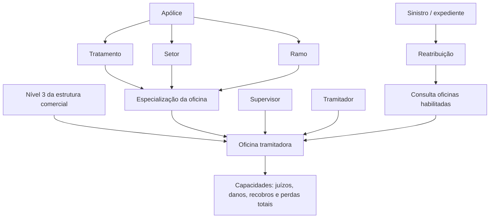

# Definição de Oficinas Tramitadoras no Reef

## 1. Metadados do Documento
- **Arquivo de Origem:** Não identificado
- **Tipo de Documento:** Especificação Funcional
- **Domínio / Sistema:** Reef / Mapfre
- **Público-Alvo:** Desenvolvedores, Arquitetos, Operação e Negócio
- **Data/Versão Identificada:** Não identificada

---

## 2. Resumo Executivo & Contexto de Negócio

O documento define o conceito de **oficinas tramitadoras**, correspondentes a unidades de nível 3 da estrutura comercial que estão habilitadas a tramitar sinistros ou expedientes. Uma oficina somente é considerada tramitadora quando estiver definida nessa configuração.

A habilitação de uma oficina tramitadora depende de sua especialização. A especialização é configurada por tratamento, setor e ramo, determinando quais sinistros podem ser tratados conforme os atributos da apólice associada.

Cada supervisor e cada tramitador deve estar associado a uma oficina tramitadora. A configuração também determina capacidades operacionais específicas, como tratamento de juízos, danos pessoais, danos materiais, salvamentos, recobros econômicos e perdas totais.

O documento apresenta a utilização dessa definição no processo de reatribuição de expedientes. Por exemplo, quando um expediente entra em juízo, o sistema consulta oficinas tramitadoras habilitadas para tramitar juízos antes de encaminhar o expediente.

---

## 3. Arquitetura, Componentes & Tecnologias Envolvidas

Os elementos funcionais identificados são:

- **Reef:** domínio de documentação citado no conteúdo.
- **Estrutura comercial:** estrutura organizacional na qual a oficina tramitadora deve existir como um nível 3.
- **Oficina tramitadora / Nivel3 Tramitadora:** unidade habilitada para tramitar sinistros ou expedientes.
- **Supervisor:** usuário associado a uma oficina tramitadora.
- **Tramitador:** usuário associado a uma oficina tramitadora.
- **Apólice:** fonte dos atributos de tratamento, setor e ramo usados para determinar a capacidade de tramitação.
- **Sinistro / expediente:** item sujeito à tramitação, atribuição ou reatribuição.
- **Reatribuição:** processo que consulta oficinas aptas para encaminhar um expediente, como no caso de entrada em juízo.



**Nota de Análise:** o documento não detalha tecnologias de implementação, interfaces, métodos HTTP, contratos JSON, banco de dados, integrações ou regras de prioridade entre oficinas elegíveis.

---

## 4. Regras de Negócio, Especificações Funcionais & Processos

### 4.1 Definição de oficina tramitadora

1. As oficinas tramitadoras são oficinas de **nível 3 da estrutura comercial**.
2. As oficinas definidas nessa configuração são consideradas tramitadoras.
3. Toda oficina tramitadora deve possuir uma especialização definida.
4. Cada supervisor deve estar associado a uma oficina tramitadora.
5. Cada tramitador deve estar associado a uma oficina tramitadora.

### 4.2 Especialização por tratamento

A propriedade **Tratamento** contém a chave do tratamento com o qual uma oficina tramitadora pode trabalhar. A configuração informa ao sistema que a oficina pode tramitar sinistros cuja apólice possua o tratamento definido.

Os tratamentos normalmente definidos são:

- Autos
- Diversos (Generales)
- Vida
- Transportes

Caso uma oficina possa trabalhar com mais de um tratamento, deve ser definida uma linha para cada tratamento permitido.

### 4.3 Especialização por setor

A propriedade **Sector** contém o setor com o qual uma oficina tramitadora pode trabalhar. A configuração informa ao sistema que a oficina pode tramitar sinistros cuja apólice possua o setor definido.

O setor genérico **9999** pode ser utilizado. O valor `9999` significa que a oficina tramitadora pode trabalhar com sinistros cuja apólice pertença a qualquer setor.

Caso a oficina não trabalhe com todos os setores, deve ser definida uma linha para cada setor permitido.

### 4.4 Especialização por ramo

A propriedade **Ramo** contém o ramo com o qual uma oficina tramitadora pode trabalhar. A configuração informa ao sistema que a oficina pode tramitar sinistros cuja apólice possua o ramo registrado.

O ramo genérico **999** pode ser utilizado. O valor `999` significa que a oficina tramitadora pode trabalhar com sinistros cuja apólice pertença a qualquer ramo.

Caso a oficina não trabalhe com todos os ramos, deve ser definida uma linha para cada ramo permitido.

### 4.5 Capacidades funcionais da oficina tramitadora

A configuração da oficina tramitadora inclui indicadores para determinar se a unidade pode tramitar:

1. Sinistros ou expedientes que estejam em juízo.
2. Expedientes cuja tipologia seja Danos Pessoais.
3. Expedientes cuja tipologia seja Danos Materiais.
4. Salvamentos, definidos como Recuperações Materiais, correspondentes a recobros do tipo `S`.
5. Recobros Econômicos, correspondentes a recobros do tipo `R`.
6. Expedientes classificados como Perdas Totais.

### 4.6 Uso no processo de reatribuição

Para reatribuir um expediente que entrou em juízo:

1. O sistema consulta as oficinas tramitadoras.
2. O sistema identifica as oficinas habilitadas para tramitar juízos.
3. O expediente pode ser enviado para uma oficina tramitadora habilitada.

**Nota de Análise:** o documento não especifica critérios de seleção, prioridade, balanceamento, disponibilidade, regras de desempate ou tratamento de ausência de oficinas habilitadas.

---

## 5. Tabelas de Parâmetros, Ambientes e Estruturas de Dados

| Item / Parâmetro | Descrição / Função | Tipo / Valores / Formato | Ambiente / Observações |
| :--- | :--- | :--- | :--- |
| Tratamento | Define o tratamento de sinistros que a oficina tramitadora pode tratar conforme a apólice. | Autos; Diversos (Generales); Vida; Transportes. | Definir uma linha para cada tratamento habilitado. |
| Sector | Define o setor de sinistros que a oficina tramitadora pode tratar conforme a apólice. | Setor definido na apólice; valor genérico `9999`. | `9999` habilita o tratamento de sinistros de qualquer setor. |
| Ramo | Define o ramo de sinistros que a oficina tramitadora pode tratar conforme a apólice. | Ramo definido na apólice; valor genérico `999`. | `999` habilita o tratamento de sinistros de qualquer ramo. |
| Nivel3 Tramitadora | Identifica a oficina tramitadora à qual todas as demais propriedades se aplicam. | Oficina existente como nível 3 da estrutura comercial. | A oficina deve existir previamente como nível 3. |
| Tramita Juicios | Indica se a oficina pode tratar sinistros ou expedientes em juízo. | Indicador não detalhado. | Usado na consulta de oficinas para reatribuição de expedientes em juízo. |
| Tramita Daños Personales | Indica se a oficina pode tratar expedientes de Danos Pessoais. | Indicador não detalhado. | Aplicável conforme tipologia do expediente. |
| Tramita Daños Materiales | Indica se a oficina pode tratar expedientes de Danos Materiais. | Indicador não detalhado. | Aplicável conforme tipologia do expediente. |
| Tramita Recobros de Salvamentos | Indica se a oficina pode tratar Salvamentos ou Recuperações Materiais. | Indicador não detalhado; recobro tipo `S`. | Relacionado a recobros de salvamentos. |
| Tramita Recobros de Recobros Económicos | Indica se a oficina pode tratar Recobros Econômicos. | Indicador não detalhado; recobro tipo `R`. | Relacionado a recobros econômicos. |
| Tramita Pérdidas Totales | Indica se a oficina pode tratar expedientes de Perdas Totais. | Indicador não detalhado. | Aplicável a expedientes classificados como perdas totais. |
| Supervisor | Usuário associado a uma oficina tramitadora. | Associação obrigatória descrita no documento. | Não há detalhamento de estrutura, cardinalidade ou validação. |
| Tramitador | Usuário associado a uma oficina tramitadora. | Associação obrigatória descrita no documento. | Não há detalhamento de estrutura, cardinalidade ou validação. |

---

## 6. Bateria de Perguntas & Respostas para RAG (FAQ Sintético)

### P1: O que é uma oficina tramitadora no contexto do Reef?
**R:** Uma oficina tramitadora é uma oficina de nível 3 da estrutura comercial definida para poder tramitar sinistros. As oficinas configuradas nessa definição passam a ser consideradas tramitadoras.

### P2: Qual é o requisito organizacional para cadastrar uma oficina tramitadora?
**R:** A oficina tramitadora deve existir como um nível 3 da estrutura comercial. A propriedade `Nivel3 Tramitadora` identifica a oficina à qual todas as demais propriedades configuradas serão aplicadas.

### P3: Como o tratamento da apólice afeta a capacidade de uma oficina tramitadora?
**R:** A propriedade `Tratamento` contém a chave do tratamento com o qual a oficina pode trabalhar. A configuração indica que a oficina pode tratar sinistros cuja apólice possua esse tratamento. Os tratamentos citados são Autos, Diversos (Generales), Vida e Transportes.

### P4: Como configurar uma oficina tramitadora para mais de um tratamento?
**R:** Deve ser definida uma linha para cada tratamento em que a oficina tramitadora possa trabalhar.

### P5: O que significa o setor genérico 9999?
**R:** O setor genérico `9999` significa que a oficina tramitadora pode trabalhar com sinistros cuja apólice pertença a qualquer setor.

### P6: O que significa o ramo genérico 999?
**R:** O ramo genérico `999` significa que a oficina tramitadora pode trabalhar com sinistros cuja apólice pertença a qualquer ramo.

### P7: Como configurar uma oficina que atende apenas alguns setores ou ramos?
**R:** Quando a oficina não trabalha com todos os setores, deve ser definida uma linha para cada setor permitido. Quando a oficina não trabalha com todos os ramos, deve ser definida uma linha para cada ramo permitido.

### P8: Supervisores e tramitadores precisam estar associados a uma oficina tramitadora?
**R:** Sim. O documento estabelece que cada supervisor e cada tramitador estará associado a uma oficina tramitadora.

### P9: Para que serve a propriedade Tramita Juicios?
**R:** A propriedade `Tramita Juicios` indica se a oficina tramitadora pode tratar sinistros ou expedientes que estejam em juízo.

### P10: Como as oficinas tramitadoras são usadas na reatribuição de um expediente em juízo?
**R:** Para reatribuir um expediente que entrou em juízo, o sistema consulta as oficinas tramitadoras que podem tramitar juízos, permitindo o envio do expediente para uma oficina habilitada.

### P11: Quais tipos de recobros podem ser tratados por uma oficina tramitadora?
**R:** A oficina pode ser configurada para tratar Salvamentos ou Recuperações Materiais, correspondentes a recobros do tipo `S`, e Recobros Econômicos, correspondentes a recobros do tipo `R`.

### P12: Quais capacidades relacionadas a tipologia de expediente podem ser configuradas?
**R:** O documento cita a capacidade de tramitar expedientes de Danos Pessoais, Danos Materiais e Perdas Totais, além da capacidade de tramitar expedientes em juízo.

---

## 7. Glossário de Termos, Siglas & Conceitos-Chave

- **Reef:** domínio ou sistema citado na documentação apresentada.
- **Oficina tramitadora:** oficina de nível 3 da estrutura comercial habilitada para tramitar sinistros ou expedientes.
- **Nivel3 Tramitadora:** propriedade que identifica a oficina tramitadora; a oficina deve existir como nível 3 da estrutura comercial.
- **Tramitador:** usuário associado a uma oficina tramitadora.
- **Supervisor:** usuário associado a uma oficina tramitadora.
- **Tratamento:** classificação da apólice usada para determinar os sinistros que uma oficina pode tratar.
- **Sector:** classificação de setor da apólice usada para determinar os sinistros que uma oficina pode tratar.
- **Ramo:** classificação de ramo da apólice usada para determinar os sinistros que uma oficina pode tratar.
- **Juicios:** juízos; condição de expediente ou sinistro que pode ser tratada por oficinas habilitadas.
- **Daños Personales:** Danos Pessoais.
- **Daños Materiales:** Danos Materiais.
- **Salvamentos:** Recuperações Materiais.
- **Recobros:** recuperações; o documento cita os tipos `S` e `R`.
- **Recobros tipo `S`:** recobros de Salvamentos ou Recuperações Materiais.
- **Recobros tipo `R`:** Recobros Econômicos.
- **Pérdidas Totales:** Perdas Totais.
- **Setor genérico `9999`:** valor que habilita uma oficina para trabalhar com sinistros de qualquer setor.
- **Ramo genérico `999`:** valor que habilita uma oficina para trabalhar com sinistros de qualquer ramo.

---

## 8. Notas Críticas, Riscos & Limitações

- O conteúdo não identifica o nome do arquivo de origem, data, versão ou autoria documental completa.
- O documento não especifica o tipo técnico dos indicadores de capacidade, como valores aceitos, padrão, obrigatoriedade ou comportamento para valor ausente.
- Não são detalhadas as regras de combinação entre tratamento, setor e ramo.
- Não são definidos critérios de seleção quando mais de uma oficina tramitadora estiver habilitada para o mesmo expediente.
- Não são documentados os critérios de prioridade, balanceamento, carga, disponibilidade ou fallback para reatribuição.
- O documento não descreve APIs, interfaces, contratos de integração, modelo de dados, persistência ou controles de acesso.
- O trecho termina em `Ejemplo:` sem apresentar conteúdo de exemplo adicional.

---

## 9. Conteúdo Bruto Estruturado (Referência Fiel)

```text
--- [PÁGINA 1 DE 2] ---

DEFINICIÓN Ocinas Tramitadoras
Objetivo
La nalidad es denir aquellas ocinas (nivel3 de la estructura comercial), que van a poder tramitar siniestros.
Las ocinas que estén denidas aquí, serán consideradas tramitadoras.
Para cada ocina tramitadora habrá que denir su especialización.
Cada supervisor y tramitador estará asociado a una ocina tramitadora.
Propiedades
Tratamiento
Esta propiedad contendrá la clave del tratamiento con el que puede trabajar la ocina tramitadora, es decir se está indicando al sistema que
podrá trabajar con siniestros, cuya póliza tenga el tratamiento que estamos deniendo.
Normalmente los tratamientos que se denen son:
Autos
Diversos (Generales)
Vida
Transportes
Se deberá denir tantas líneas como tratamientos en los que pueda trabajar la ocina tramitadora.
Sector
Esta propiedad contendrá el sector con el que puede trabajar la ocina tramitadora, es decir se está indicando al sistema que podrá trabajar
con siniestros, cuya póliza tenga el sector que estamos deniendo.
Se podrá utilizar el sector Genérico 9999, que signicará que esa tramitadora podrá trabajar con siniestros cuya póliza sea de cualquier
sector.
En el caso de que no trabaje en todos los sectores, se deberá denir tantas líneas como sectores en los que pueda trabajar la ocina
tramitadora.
Ramo
Esta propiedad contendrá el ramo con el que puede trabajar la ocina tramitadora, es decir se está indicando al sistema que podrá trabajar
con siniestros, cuya póliza tenga el ramo que estamos registrando.
Se podrá utilizar el ramo Genérico 999, que signicará que esa tramitadora podrá trabajar con siniestros cuya póliza sea de cualquier ramo.
Documentation / DOCUMENTACIÓN Reef
DOCUMENTACIÓN Reef
Mapfredocument
DOCUMENTACIÓN Reef
Owner
user:agonzalez_mapfre.com
Lifecycle
Approved Source
 /
VL
Buscar Inicio Soluciones Arquitecturas APIs Componentes Cloud Documentación Zeus Reef Ayuda
ES

--- [PÁGINA 2 DE 2] ---

En el caso de que no trabaje con todos los ramos, se deberá denir tantas líneas como ramos en los que pueda trabajar la ocina
tramitadora.
Nivel3 Tramitadora
Esta propiedad contendrá la ocina tramitadora. Estas deberán estar existir como Nivel3 de la estructura comercial. Todas las propiedades
que se van a denir serán para esta ocina tramitadora.
Tramita Juicios
Esta propiedad indica si la ocina tramitadora va tratar siniestros/expedientes que estén en juicios.
Tramita Daños Personales
Esta propiedad indica si la ocina puede tramitar expedientes cuya tipología sea Daños Personales.
Tramita Daños Materiales
Esta propiedad indica si la ocina puede tramitar expedientes cuya tipología sea Daños Materiales.
Tramita Recobros de Salvamentos
Esta propiedad indica si la ocina puede tramitar Salvamentos (Recuperaciones Materiales). Los recobros tipo 'S'
Tramita Recobros de Recobros Económicos
Esta propiedad indica si la ocina puede tramitar Recobros Económicos, los recobros tipo 'R'.
Tramita Pérdidas Totales
Esta propiedad indica si la ocina puede tramitar expedientes que sean Pérdidas Totales.
Preguntas frecuentes
Para qué se utiliza esta denición
Por ejemplo para la re-asignación de un expediente que ha entrado en juicio, se consulta las ocinas tramitadoras que puedan tramitar
juicios, para poder enviar el expediente.
Para asignar a los tramitadores a las ocinas tramitadoras
.
Ejemplo:
```
