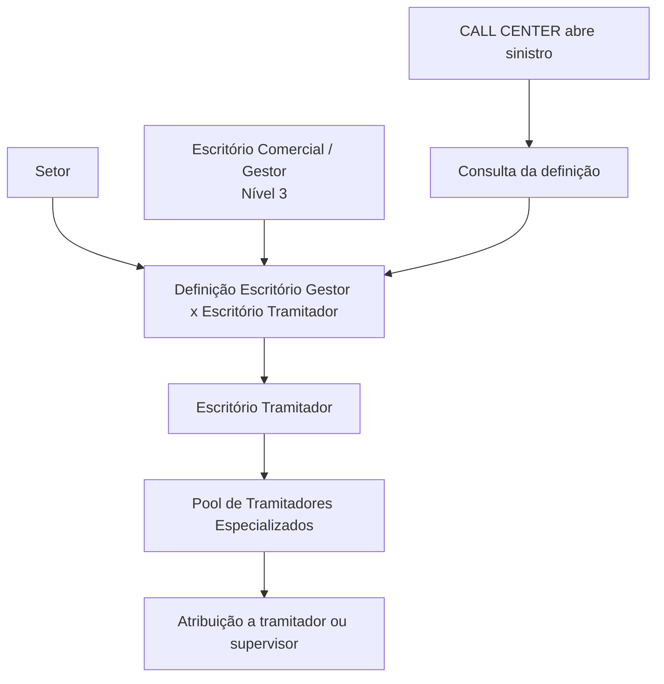

# Definição da Relação entre Escritórios Gestores e Tramitadores

## 1. Metadados do Documento
- **Arquivo de Origem:** Não identificado
- **Tipo de Documento:** Especificação Técnica / Procedimento de Configuração
- **Domínio / Sistema:** Reef / Mapfre — definição de escritórios comerciais, gestores e tramitadores
- **Público-Alvo:** Analistas funcionais, Operação, Gestores de Sinistros e Desenvolvedores
- **Data/Versão Identificada:** Não identificada

---

## 2. Resumo Executivo & Contexto de Negócio

O documento define a relação entre escritórios comerciais gestores e escritórios tramitadores para cada setor. O objetivo da configuração é determinar qual escritório tramitador deverá gerir os expedientes associados às apólices emitidas por cada escritório comercial de nível 3 da estrutura comercial.

A definição permite que um escritório tramitador mantenha um *pool* de tramitadores especializados. A atribuição de um expediente a um tramitador do *pool* considera parâmetros definidos, especialização e carga de trabalho, embora o documento não detalhe os critérios, algoritmos ou prioridades utilizados nessa distribuição.

A configuração é utilizada como apoio na atribuição de sinistros ou expedientes a tramitadores e supervisores. Quando um sinistro é aberto por um CALL CENTER, a definição pode ser consultada para identificar o escritório tramitador correspondente ao escritório comercial da apólice ou ao escritório gestor no qual ocorreu o sinistro.

A obrigatoriedade de cadastrar dados nessa definição depende dos critérios de atribuição adotados pela companhia. O documento não informa quais critérios tornam a configuração obrigatória, nem apresenta valores concretos de exemplo para escritórios comerciais ou tramitadores.

---

## 3. Arquitetura, Componentes & Tecnologias Envolvidas

Os componentes funcionais identificados são:

- **Escritório comercial / gestor:** Escritório comercial de nível 3 da estrutura comercial que pode emitir apólices.
- **Setor:** Chave de segmentação usada para definir a relação entre escritório gestor e escritório tramitador.
- **Setor genérico `9999`:** Valor que indica que a definição se aplica a todos os setores.
- **Escritório tramitador:** Escritório responsável por gerir os expedientes das apólices vinculadas a um escritório comercial.
- **Pool de tramitadores especializados:** Conjunto de tramitadores disponível dentro do escritório tramitador para receber expedientes.
- **CALL CENTER:** Origem mencionada para abertura de sinistros e consulta da definição de encaminhamento.
- **Reef / DOCUMENTACIÓN Reef:** Repositório ou contexto documental identificado no conteúdo.
- **Mapfre:** Contexto corporativo identificado pela referência a `Mapfredocument` e ao proprietário `agonzalez_mapfre.com`.



> **Nota de Análise:** O documento não descreve tecnologias de implementação, APIs, métodos HTTP, contratos JSON, bancos de dados, URLs de ambiente, mecanismos de autenticação ou regras técnicas para seleção do tramitador no *pool*.

---

## 4. Regras de Negócio, Especificações Funcionais & Processos

1. A relação deve ser definida por **setor** e por **escritório comercial** que possa emitir apólices.
2. O escritório comercial configurado deve existir como **nível 3 da estrutura comercial**.
3. Para cada escritório comercial gestor, a definição associa um escritório tramitador responsável por gerir os expedientes das apólices correspondentes.
4. O escritório tramitador informado deve existir na **definição de tramitadoras**.
5. O setor pode receber o valor genérico **`9999`**.
6. O setor genérico **`9999`** significa que a definição criada é válida para todos os setores.
7. Cada escritório tramitador possui um *pool* de tramitadores especializados.
8. Um expediente pode ser atribuído a um integrante do *pool* conforme parâmetros estabelecidos, especialização e carga de trabalho.
9. A definição pode apoiar a atribuição de um sinistro ou expediente a tramitadores ou supervisores.
10. Quando um sinistro é aberto por um CALL CENTER, a definição pode ser consultada para identificar:
    - o escritório tramitador associado ao escritório comercial da apólice; ou
    - o escritório tramitador associado ao escritório gestor em que ocorreu o sinistro.
11. A obrigatoriedade de preencher a definição depende dos critérios de atribuição utilizados pela companhia.

> **Nota de Análise:** O documento não informa a precedência entre uma configuração específica de setor e a configuração genérica `9999`. Também não especifica como especialização, carga de trabalho e demais parâmetros são avaliados para selecionar um tramitador.

---

## 5. Tabelas de Parâmetros, Ambientes e Estruturas de Dados

| Item / Parâmetro | Descrição / Função | Tipo / Valores / Formato | Ambiente / Observações |
| :--- | :--- | :--- | :--- |
| Setor | Chave do setor para o qual será atribuída uma tramitadora a cada escritório gestor. | Chave de setor; valor genérico permitido: `9999`. | `9999` representa uma definição aplicável a todos os setores. |
| Comercial | Escritório comercial ou gestor ao qual será atribuído um escritório tramitador. | Escritório comercial existente como nível 3 da estrutura comercial. | Deve ser um escritório que possa emitir apólices. |
| Tramitadora | Escritório responsável por gerir os expedientes das apólices vinculadas ao escritório comercial. | Escritório existente na definição de tramitadoras. | A validade depende da existência prévia na definição de tramitadoras. |
| Pool de tramitadores | Conjunto de tramitadores especializados pertencentes a um escritório tramitador. | Não detalhado. | Utilizado para atribuir expedientes conforme parâmetros, especialização e carga de trabalho. |
| CALL CENTER | Canal mencionado para abertura de sinistros. | Não detalhado. | Pode consultar a definição para identificar a tramitadora aplicável. |
| Critérios de atribuição | Critérios usados pela companhia para determinar a necessidade da configuração. | Não detalhado. | Determinam se é obrigatório inserir dados na definição. |
| Owner | Proprietário identificado no repositório documental. | `user:agonzalez_mapfre.com` | Informação apresentada no conteúdo bruto. |
| Lifecycle | Estado do documento no repositório. | `Approved Source` | Informação apresentada no conteúdo bruto. |

---

## 6. Bateria de Perguntas & Respostas para RAG (FAQ Sintético)

### P1: Qual é o objetivo da definição entre escritórios gestores e tramitadores?
**R:** A definição estabelece, por setor e para cada escritório comercial que pode emitir apólices, qual escritório tramitador será responsável por gerir os expedientes dessas apólices.

### P2: O que representa o campo Setor na definição?
**R:** O campo Setor contém a chave do setor para o qual será atribuída uma tramitadora a cada escritório gestor. O valor genérico `9999` pode ser utilizado quando a definição deve valer para todos os setores.

### P3: O que significa utilizar o setor genérico 9999?
**R:** O setor genérico `9999` indica que a configuração entre escritório comercial gestor e escritório tramitador é aplicável a todos os setores.

### P4: Quais pré-requisitos existem para cadastrar um escritório comercial no campo Comercial?
**R:** O escritório comercial ou gestor informado deve existir como nível 3 da estrutura comercial. O documento também o caracteriza como um escritório comercial que pode emitir apólices.

### P5: Qual é a responsabilidade do escritório tramitador?
**R:** O escritório tramitador é responsável por gerir os expedientes das apólices pertencentes ao escritório comercial configurado na definição.

### P6: O escritório tramitador precisa existir previamente em alguma estrutura?
**R:** Sim. O escritório tramitador informado na definição deve existir previamente na definição de tramitadoras.

### P7: Como um expediente é distribuído dentro de um escritório tramitador?
**R:** Dentro de cada escritório tramitador existe um *pool* de tramitadores especializados. O expediente pode ser atribuído a um desses tramitadores segundo parâmetros estabelecidos, especialização e carga de trabalho.

### P8: Como a definição é usada quando um sinistro é aberto por um CALL CENTER?
**R:** Quando o sinistro é aberto por um CALL CENTER, a definição pode ser consultada para identificar o escritório tramitador correspondente ao escritório comercial da apólice ou ao escritório gestor no qual ocorreu o sinistro.

### P9: A configuração entre escritório comercial e tramitadora é obrigatória?
**R:** A obrigatoriedade depende dos critérios de atribuição utilizados pela companhia. O documento não especifica quais critérios exigem o preenchimento da definição.

### P10: O documento detalha o algoritmo de balanceamento por carga de trabalho?
**R:** Não. O documento menciona carga de trabalho como um dos elementos considerados na atribuição do expediente, mas não detalha algoritmo, métricas, pesos, prioridades ou regras de desempate.

### P11: O documento descreve APIs ou contratos de integração para consultar a tramitadora?
**R:** Não. O documento descreve a finalidade funcional da consulta, inclusive no contexto de CALL CENTER, mas não apresenta APIs, URLs, métodos HTTP, payloads ou contratos de integração.

---

## 7. Glossário de Termos, Siglas & Conceitos-Chave

- **CALL CENTER:** Canal mencionado como origem de abertura de sinistros e expedientes.
- **Comercial:** Escritório comercial ou gestor ao qual é associado um escritório tramitador.
- **Escritório gestor:** Escritório comercial que pode emitir apólices e para o qual é configurada uma tramitadora.
- **Escritório tramitador / Tramitadora:** Escritório responsável por gerir expedientes relacionados às apólices de um escritório comercial.
- **Expediente:** Caso ou processo a ser gerido pelo escritório tramitador e atribuído a um tramitador ou supervisor.
- **Nível 3:** Nível exigido na estrutura comercial para que um escritório comercial possa ser usado na definição.
- **Pool de tramitadores:** Conjunto de tramitadores especializados disponível em um escritório tramitador.
- **Reef:** Nome identificado no contexto de documentação apresentado no conteúdo bruto.
- **Setor:** Chave de segmentação usada para definir a relação entre escritório gestor e escritório tramitador.
- **Setor genérico `9999`:** Valor que torna a definição aplicável a todos os setores.
- **Sinistro:** Evento ou caso que pode ser aberto por CALL CENTER e encaminhado para gestão.

---

## 8. Notas Críticas, Riscos & Limitações

- A extração contém caracteres corrompidos ou substituídos em palavras como “oficinas” e “finalidad”, o que indica possível problema de codificação no texto bruto.
- O documento não fornece um exemplo completo de configuração com valores de setor, escritório comercial e escritório tramitador.
- Não há detalhamento dos critérios de atribuição que determinam se o cadastro é obrigatório.
- Não há definição de precedência entre configurações específicas de setor e configurações genéricas com o valor `9999`.
- O mecanismo de distribuição de expedientes no *pool* não é especificado além das referências a parâmetros, especialização e carga de trabalho.
- Não são descritos contratos técnicos, APIs, persistência de dados, telas, controles de acesso, logs, ambientes ou integrações detalhadas.
- O documento menciona supervisores na utilização da definição, mas não descreve regras específicas de atribuição para supervisores.

---

## 9. Conteúdo Bruto Estruturado (Referência Fiel)

```text
--- [PÁGINA 1 DE 1] ---

DEFINICIÓN Relación entre Ocinas Gestoras y Tramitadoras
Objetivo
La nalidad es denir por sector para cada ocina comercial (nivel3 de la estructura comercial) que pueda emitir pólizas, cual va a ser la
ocina tramitadora que se encargue de gestionar sus expedientes. Dentro de cada ocina tramitadora, existirá un pull de tramitadores
especializados para poder asignar el expediente a uno de ellos, según los parámetros establecidos, especialización, carga de trabajo, etc.
Propiedades
Sector
Esta propiedad contendrá el la clave del sector para el que vamos a asignar a cada ocina gestora, su tramitadora.
Se podrá utilizar el sector Genérico 9999, que signicará que la denición que se está realizando es para todos los sectores.
Comercial
Esta propiedad contendrá la ocina comercial, gestora, a la que le estamos asignando una ocina tramitadora. Estas deberán existir como
Nivel3 de la estructura comercial.
Tramitadora
Esta propiedad contendrá la ocina tramitadora encargada de gestionar los expedientes de las pólizas que pertenezcan a la ocina
comercial. Estas deberán existir en la denición de tramitadoras.
Preguntas frecuentes
¿Para se utiliza esta denición ? Esta denición se suele utilizar como apoyo para la asignación de un siniestro o expediente a los
tramitadores o supervisores. Cuando el siniestro se abre desde un CALL CENTER, se suele acceder a esta denición para ver que
tramitadora le corresponde a la comercial de la póliza, o que tramitadora le corresponde a la gestora donde se ha producido el siniestro.
¿Es obligatorio introducir datos en esta denición?
Eso va a depender de los criterios de asignación que se utilice en la compañía.
Ejemplo:
Documentation / DOCUMENTACIÓN Reef
DOCUMENTACIÓN Reef
Mapfredocument
DOCUMENTACIÓN Reef
Owner
user:agonzalez_mapfre.com
Lifecycle
Approved Source
 / 
 VL
Buscar Inicio Soluciones Arquitecturas APIs Componentes Cloud Documentación Zeus Reef Ayuda
ES
```
