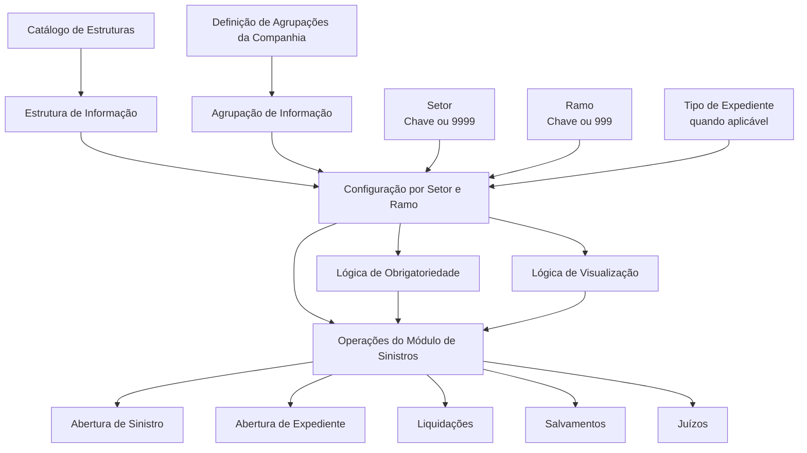
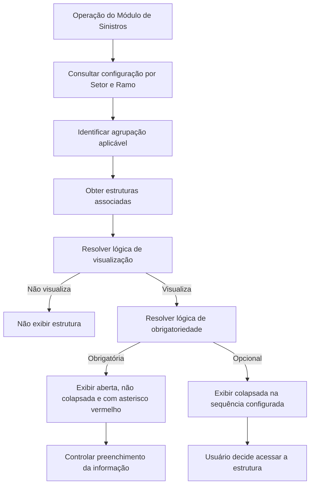

# Estruturas de Informação dos Módulos de Sinistros — Documentação Reef

## 1. Metadados do Documento
- **Arquivo de Origem:** Não identificado no conteúdo fornecido
- **Tipo de Documento:** Especificação Técnica
- **Domínio / Sistema:** Reef / Módulo de Sinistros / Mapfredocument
- **Público-Alvo:** Desenvolvedores, Arquitetos, Operação e Analistas Funcionais
- **Data/Versão Identificada:** Não identificada

---

## 2. Resumo Executivo & Contexto de Negócio

O documento define a configuração de **estruturas de informação** solicitadas pelas operações do Módulo de Sinistros, considerando a combinação de **Setor** e **Ramo**. Essas estruturas representam informações complementares que devem ser disponibilizadas em pontos específicos dos processos de sinistros, expedientes, liquidações, salvamentos e juízos.

A configuração permite aplicar uma estrutura a todos os setores e ramos por meio dos valores genéricos `9999 - Todos os setores` e `999 - Todos os ramos`. Também permite configurar uma estrutura para todos os ramos de um setor específico, utilizando a chave do setor e o ramo genérico.

Cada estrutura deve existir previamente no catálogo de estruturas e ser associada a uma agrupação de informação. As agrupações são pontos de salto funcionais predefinidos pela companhia, relacionados a momentos operacionais como antes ou depois das consequências de um sinistro, após a abertura de um expediente ou durante uma liquidação.

O documento também define mecanismos de apresentação, obrigatoriedade e visibilidade. Estruturas obrigatórias são abertas e exibidas prioritariamente; estruturas opcionais são apresentadas colapsadas. A obrigatoriedade e a visualização podem depender de lógicas de negócio resolvidas pela operação correspondente.

---

## 3. Arquitetura, Componentes & Tecnologias Envolvidas

Os componentes e conceitos identificados são:

- **Reef:** Ambiente de documentação no qual o conteúdo está publicado.
- **Mapfredocument:** Referência de documentação exibida no conteúdo bruto.
- **Módulo de Sinistros:** Módulo ao qual se aplicam as estruturas de informação e agrupações descritas.
- **Catálogo de Estruturas:** Catálogo no qual as estruturas de informação devem ser definidas previamente.
- **Definição de Agrupações:** Origem das agrupações de informação que podem ser associadas às estruturas.
- **Operações de negócio:** Abertura de sinistros, abertura de expedientes, liquidações, salvamentos e juízos.
- **Lógica de Negócio:** Regra resolvida pela operação para decidir obrigatoriedade e visibilidade de uma estrutura.



**Nota de Análise:** O documento não detalha interfaces, métodos HTTP, contratos JSON, banco de dados, serviços técnicos, URLs, ambientes de execução ou tecnologias de implementação do Módulo de Sinistros.

---

## 4. Regras de Negócio, Especificações Funcionais & Processos

### 4.1 Definição por Setor e Ramo

1. A finalidade da configuração é definir todas as informações solicitadas nas diferentes operações do Módulo de Sinistros por Setor e Ramo.
2. Quando uma estrutura de informação for solicitada para todos os setores e todos os ramos, devem ser usados:
   - Setor genérico `9999 - Todos os setores`.
   - Ramo genérico `999 - Todos os ramos`.
3. Quando uma estrutura de informação for solicitada para todos os ramos de um setor específico:
   - Deve ser utilizada a chave do setor aplicável.
   - Deve ser utilizado o ramo genérico `999 - Todos os ramos`.
4. As estruturas de informação devem ser definidas no catálogo de estruturas antes de serem associadas às agrupações em que serão requeridas.

### 4.2 Tipo de Expediente

1. O atributo **Tipo de Expediente** é solicitado somente quando a informação estiver relacionada a um processo no nível de expediente.
2. Quando a informação estiver relacionada a um processo de sinistros, o sistema atribui o tipo de expediente genérico, indicando aplicabilidade a todos os tipos de expediente.
3. Quando o processo for de expedientes, deve ser informada a chave do tipo de expediente.

### 4.3 Agrupações de Informação

1. A agrupação deve existir na definição de agrupações da companhia.
2. Os valores das agrupações estão predefinidos.
3. Cada módulo possui agrupações pré-atribuídas que não podem ser modificadas.
4. Para o Módulo de Sinistros, devem estar definidas no catálogo as agrupações abaixo:

| Área funcional | Agrupação | Momento funcional descrito |
| :--- | :--- | :--- |
| Sinistros | Dados Fijos Siniestros antes de las consecuencias | Definição de informação adicional antes de solicitar consequências |
| Sinistros | Datos Fijos del Siniestro después de las consecuencias | Definição de informação adicional após as consequências |
| Expedientes | Complementarias Expediente | Definição de informação adicional após abrir um expediente |
| Liquidações | Liquidaciones | Definição de informação adicional nas operações de liquidações |
| Salvamentos | Salvamentos | Definição de informação adicional em salvamentos |
| Juízos | Juicios | Definição de informação adicional nos juízos |

### 4.4 Estrutura de Informação — Operação

1. A propriedade **Estrutura de Informação - Operação** contém o código da estrutura de informação definida para a combinação de Setor e Ramo.
2. A estrutura deve:
   - Existir no catálogo de estruturas.
   - Estar associada à agrupação definida para o Setor e o Ramo.

### 4.5 Número de Sequência

1. O **Número de Sequência** define a ordem de apresentação das estruturas de informação.
2. A ordem é aplicada conforme a agrupação e a operação realizada, incluindo:
   - Abertura de sinistro.
   - Abertura de expediente.
   - Liquidação.
   - Modificação.
3. As estruturas de informação mais comuns e mais utilizadas devem ser definidas primeiro.

### 4.6 Obrigatoriedade

1. A propriedade **Es obligatoria** define se a informação configurada deve ser solicitada obrigatoriamente.
2. A operação consulta este catálogo e apresenta inicialmente todas as estruturas definidas como obrigatórias.
3. As estruturas opcionais, ou não obrigatórias, são exibidas colapsadas para que o usuário decida se deseja acessá-las.
4. Quando uma estrutura é obrigatória, a operação deve controlar se a informação foi preenchida.
5. Quando existem várias estruturas obrigatórias:
   - As estruturas obrigatórias são exibidas não colapsadas.
   - As estruturas obrigatórias são identificadas com asterisco vermelho.
   - A operação controla que seja introduzida informação.
6. Quando existem uma ou mais estruturas opcionais:
   - As estruturas são exibidas colapsadas.
   - As estruturas são mostradas segundo a ordem definida.
   - O usuário escolhe em qual estrutura deseja introduzir informação.

### 4.7 Lógica de Obrigatoriedade

1. A propriedade **Lógica que determina se Es obligatoria** contém uma lógica de negócio.
2. Essa lógica determina se a estrutura será obrigatória quando a resposta não puder ser sempre fixa como “sim” ou “não”.
3. A condição de obrigatoriedade pode depender de outros fatores.
4. A operação correspondente resolve a lógica de negócio para determinar a obrigatoriedade.
5. As operações explicitamente citadas incluem:
   - Abertura de sinistros.
   - Abertura de expedientes.
   - Liquidações.
   - Juízos.

### 4.8 Lógica de Visualização

1. A propriedade **Lógica que determina se se visualiza** contém uma lógica de negócio.
2. Essa lógica determina se a estrutura de informação será visualizada ou não.



---

## 5. Tabelas de Parâmetros, Ambientes e Estruturas de Dados

| Item / Parâmetro | Descrição / Função | Tipo / Valores / Formato | Ambiente / Observações |
| :--- | :--- | :--- | :--- |
| Setor | Chave do setor para o qual a estrutura de informação é definida | Chave de setor; `9999 - Todos os setores` | Usar `9999` quando a informação se aplicar a todos os setores |
| Ramo | Chave do ramo ao qual são definidas estruturas de informação | Chave de ramo; `999 - Todos os ramos` | Usar `999` quando a informação se aplicar a todos os ramos |
| Tipo de Expediente | Identifica o tipo de expediente aplicável à informação | Chave de tipo de expediente ou tipo genérico | Solicitado somente para processos no nível de expediente |
| Agrupação de Informação | Define o ponto funcional em que a informação será requerida | Valor predefinido da definição de agrupações | A agrupação deve existir na companhia e não pode ser modificada por módulo |
| Estrutura de Informação - Operação | Código da estrutura de informação configurada para Setor e Ramo | Código de estrutura | Deve existir no catálogo de estruturas e estar associada à agrupação |
| Número de Sequência | Define a ordem de apresentação das estruturas de informação | Número de sequência | Estruturas mais comuns e mais utilizadas devem ser definidas primeiro |
| Es obligatoria | Define se a informação deve ser solicitada obrigatoriamente | Obrigatória ou não obrigatória | Estruturas obrigatórias são apresentadas abertas; opcionais são colapsadas |
| Lógica que determina se Es obligatoria | Determina dinamicamente se a estrutura é obrigatória | Lógica de negócio | A operação resolve a lógica de acordo com fatores aplicáveis |
| Lógica que determina se se visualiza | Determina dinamicamente se a estrutura deve ser exibida | Lógica de negócio | Define visualização ou não visualização da estrutura |
| Dados Fijos Siniestros antes de las consecuencias | Agrupação de Sinistros antes de solicitar consequências | Agrupação predefinida | Módulo de Sinistros |
| Datos Fijos del Siniestro después de las consecuencias | Agrupação de Sinistros após as consequências | Agrupação predefinida | Módulo de Sinistros |
| Complementarias Expediente | Agrupação de informação complementar após abrir expediente | Agrupação predefinida | Módulo de Expedientes |
| Liquidaciones | Agrupação de informação adicional em liquidações | Agrupação predefinida | Módulo de Liquidações |
| Salvamentos | Agrupação de informação adicional em salvamentos | Agrupação predefinida | Módulo de Salvamentos |
| Juicios | Agrupação de informação adicional em juízos | Agrupação predefinida | Módulo de Juízos |

---

## 6. Bateria de Perguntas & Respostas para RAG (FAQ Sintético)

### P1: Como configurar uma estrutura de informação aplicável a todos os setores e todos os ramos?
**R:** Deve-se configurar a estrutura utilizando o Setor genérico `9999 - Todos os setores` e o Ramo genérico `999 - Todos os ramos`. A estrutura também deve estar previamente definida no catálogo de estruturas e associada à agrupação de informação aplicável.

### P2: Como configurar uma estrutura para todos os ramos de um único setor?
**R:** Deve-se informar a chave específica do Setor e usar o Ramo genérico `999 - Todos os ramos`. Dessa forma, a estrutura será aplicável a todos os ramos pertencentes ao setor configurado.

### P3: Quando o Tipo de Expediente precisa ser informado?
**R:** O Tipo de Expediente é solicitado somente quando a informação estiver relacionada a um processo no nível de expediente. Para processos de sinistros, o sistema atribui o tipo de expediente genérico, aplicável a todos os tipos de expediente.

### P4: Onde uma estrutura de informação deve ser cadastrada antes de ser associada a uma operação?
**R:** A estrutura de informação deve estar definida no catálogo de estruturas. Depois, a estrutura deve ser associada à agrupação configurada para o Setor e o Ramo correspondentes.

### P5: O que representa a propriedade Estrutura de Informação - Operação?
**R:** A propriedade Estrutura de Informação - Operação contém o código da estrutura de informação definida para uma combinação de Setor e Ramo. A estrutura deve existir no catálogo de estruturas e estar associada à agrupação configurada.

### P6: Para que serve o Número de Sequência?
**R:** O Número de Sequência define a ordem de apresentação das estruturas de informação durante operações como abertura de sinistro, abertura de expediente, liquidação ou modificação, dependendo da agrupação. O documento recomenda definir primeiro as estruturas mais comuns e mais utilizadas.

### P7: Como o sistema apresenta estruturas obrigatórias?
**R:** A operação apresenta inicialmente as estruturas obrigatórias abertas, não colapsadas e, quando há várias, identificadas com um asterisco vermelho. A operação também controla que a informação obrigatória seja preenchida.

### P8: Como o sistema apresenta estruturas opcionais?
**R:** Estruturas não obrigatórias ou opcionais são apresentadas colapsadas, na ordem definida pelo Número de Sequência. O usuário escolhe em qual estrutura opcional deseja introduzir informação.

### P9: Uma estrutura pode ter obrigatoriedade dinâmica?
**R:** Sim. A propriedade Lógica que determina se Es obligatoria pode conter uma lógica de negócio para definir se a estrutura será obrigatória quando a decisão depender de outros fatores, em vez de ser sempre “sim” ou “não”.

### P10: Quem resolve a lógica que determina se uma estrutura é obrigatória?
**R:** A operação correspondente resolve a lógica de negócio. O documento cita operações como abertura de sinistros, abertura de expedientes, liquidações e juízos.

### P11: Como é decidido se uma estrutura de informação deve ser exibida?
**R:** A propriedade Lógica que determina se se visualiza contém uma lógica de negócio que determina se a estrutura de informação será visualizada ou não visualizada.

### P12: Quais agrupações são citadas para o Módulo de Sinistros e operações relacionadas?
**R:** O documento cita: Dados Fijos Siniestros antes de las consecuencias, Datos Fijos del Siniestro después de las consecuencias, Complementarias Expediente, Liquidaciones, Salvamentos e Juicios.

---

## 7. Glossário de Termos, Siglas & Conceitos-Chave

- **Reef:** Ambiente de documentação identificado no conteúdo fornecido.
- **Mapfredocument:** Referência de documentação exibida no conteúdo bruto.
- **Módulo de Sinistros:** Módulo que utiliza estruturas de informação configuradas por Setor, Ramo e Agrupação.
- **Setor:** Propriedade que contém a chave do setor ao qual uma estrutura de informação se aplica.
- **Ramo:** Propriedade que contém a chave do ramo ao qual uma estrutura de informação se aplica.
- **9999 - Todos os setores:** Valor genérico para aplicar uma estrutura de informação a todos os setores.
- **999 - Todos os ramos:** Valor genérico para aplicar uma estrutura de informação a todos os ramos.
- **Tipo de Expediente:** Propriedade aplicável quando a informação pertence a um processo no nível de expediente.
- **Agrupação de Informação:** Ponto funcional predefinido no qual uma estrutura de informação é requerida.
- **Catálogo de Estruturas:** Catálogo que deve conter as estruturas de informação antes da associação com agrupações.
- **Estrutura de Informação - Operação:** Código da estrutura de informação associado a uma configuração de Setor, Ramo e Agrupação.
- **Número de Sequência:** Ordem de apresentação das estruturas de informação em uma operação.
- **Es obligatoria:** Propriedade que indica se a estrutura deve ser preenchida obrigatoriamente.
- **Lógica de Negócio:** Regra resolvida pela operação para determinar obrigatoriedade ou visualização.
- **Expediente:** Processo para o qual pode ser necessário informar uma chave de Tipo de Expediente.
- **Liquidações:** Operações associadas à agrupação `Liquidaciones`.
- **Salvamentos:** Operações associadas à agrupação `Salvamentos`.
- **Juízos:** Operações associadas à agrupação `Juicios`.

---

## 8. Notas Críticas, Riscos & Limitações

- O documento estabelece que as agrupações de cada módulo são pré-atribuídas e não podem ser modificadas.
- A associação de uma estrutura depende de sua definição prévia no catálogo de estruturas e de sua associação à agrupação aplicável.
- A obrigatoriedade e a visibilidade podem depender de lógica de negócio; o documento não descreve a sintaxe, o mecanismo de configuração ou os fatores específicos dessas lógicas.
- O documento não detalha os códigos concretos das estruturas de informação, setores, ramos ou tipos de expediente.
- O documento não fornece exemplos preenchidos para os trechos marcados como “Ejemplo”.
- Não há detalhamento de APIs, contratos de integração, persistência de dados, permissões, URLs, servidores ou ambientes técnicos.

---

## 9. Conteúdo Bruto Estruturado (Referência Fiel)

```text
--- [PÁGINA 1 DE 3] ---

DEFINICIÓN Estructuras de Información de los Módulos Siniestros
Objetivo
La nalidad es denir toda la información que se va a solicitar en las diferentes operaciones del Módulo de Siniestros por Sector y Ramo.
Si una estructura de información, por ejemplo, el Relato del siniestro, se va a solicitar en todos los sectores y en todos los ramos, se pondrá el
sector genérico (9999-Todos los sectores) y el ramo genérico (999-Todos los Ramos). Si se va a solicitar para todos los ramos de un sector,
se pondrá el valor del sector y el valor del ramo será el genérico, para todos los ramos.
Estas estructuras de información tendrán que estar denidas en el catálogo de estructuras y luego asociarlas a las diferentes agrupaciones
(puntos de salto) donde se va a requerir esa información.
Propiedades Sector Ramo
Sector
Esta propiedad contendrá la clave del sector para el cual se va a denir la estructura de información. Si la información se va para todos los
sectores, se utilizará el genérico 9999- Todos los sectores.
Documentation / DOCUMENTACIÓN Reef
DOCUMENTACIÓN Reef
Mapfredocument
DOCUMENTACIÓN Reef
Owner
user:agonzalez_mapfre.com
Lifecycle
Approved Source
 / 
 VL
Buscar Inicio Soluciones Arquitecturas APIs Componentes Cloud Documentación Zeus Reef Ayuda
ES


--- [PÁGINA 2 DE 3] ---

Ramo
Esta propiedad indica la clave del Ramo al cual se le va a denir las estructuras de información. Si la información se va para todos los ramos,
se utilizará el genérico 999- Todos los ramos.
Tipo de Expediente
Esta propiedad sólo se pedirá en el caso de que la información sea para un proceso a nivel de expediente.
Cuando sea de un proceso de siniestros, el sistema asignará el tipo de expediente genérico, que indica que es para todos los tipos de
expedientes, si el proceso es de expedientes, habrá que introducir la clave del tipo de expediente.
Agrupación de Información
La Agrupación tiene que existir en la denición de agrupaciones de la compañía Los valores de esta propiedad ya están prejados y los que
afectan al módulo de siniestros que tienen que estar denidas en este catálogo son:
AGRUPACIONES
Cada módulo tiene unas agrupaciones pre-asignadas que no se pueden modicar
Agrupaciones Siniestros
Agrupación para denir información adicional antes de pedir consecuencias:
Datos Fijos Siniestros antes de las consecuencias
Agrupación para denir información adicional antes de pedir consecuencias:
Datos Fijos del Siniestro después de las consecuencias
Agrupaciones Expedientes
Agrupación para denir información adicional después de abrir un expediente:
Complementarias Expediente
Agrupaciones Liquidaciones
Agrupación para denir información adicional en las operaciones de Liquidaciones:
Liquidaciones
Agrupaciones Salvamentos
Agrupación para denir información adicional en salvamentos:
Salvamentos
Agrupaciones Juicios
Agrupación para denir información adicional en los juicios:
Juicios
Estructura de Información - Operación
Esta propiedad contendrá el código de la estructura de información que se está deniendo para el sector ramo.
Estas estructuras deberán estar denidas en el catálogo de estructuras y asociada a las agrupación que se está deniendo para el sector y el
ramo.
Número de Secuencia
Esta propiedad indicará el orden de presentación de la estructuras de información cuando se abra un siniestro, o cuando se abra un
expediente o cuando se realice una liquidación, cuando se modique, todo depende de la agrupación. Se deberá denir en primer lugar las
estructuras de información más comunes, más usadas.
Consejo:


--- [PÁGINA 3 DE 3] ---

Es obligatoria
Esta propiedad indica si la información que se ha denido se va a pedir obligatoriamente. Las operaciones irán a este catálogo y primero
mostrará abiertas todas las estructuras de información que se haya denido como obligatorias, y luego mostrarán todas las estructuras
opcionales (No obligatorias) se mostrarán colapsadas, para que el usuario decida en cual entrar. Si son obligatorias se controlará que tengan
información.
Lógica que determina si Es obligatoria
Esta propiedad contendrá una lógica de Negocio, que determinará si la estructura de información es obligatoria o no, cuando no siempre sea
si o no, si no que dependa de otros factores. La operación (apertura de siniestros, apertura de expediente, liquidaciones, juicios...) se
encargará de resolver esta lógica de negocio para determinar si es o no obligatoria
Lógica que determina si se visualiza
Esta propiedad o atributo, contendrá una lógica de Negocio que determinará si la estructura de información se visualiza o no se visualiza.
Preguntas frecuentes
¿Se pueden asociar a cada agrupación varias estructuras de información?
Si se pueden elegir varias estructuras de información y habrá que indicar si son obligatorias u opcionales y en que orden se van a
mostrar.
Cuando hay varias estructuras obligatorias, la operación mostrará las estructuras obligatorias no colapsadas y con un asterisco rojo. La
operación (apertura de siniestros, liquidaciones, juicios...) controlará que se introduzca información.
Cuando hay una o varias estructuras no obligatorias u opcionales, se mostrarán colapsadas y en el orden establecido para que el usuario
elija en que estructura quiere introducir información.
Ejemplo:
Ejemplo:
Ejemplo:
```
