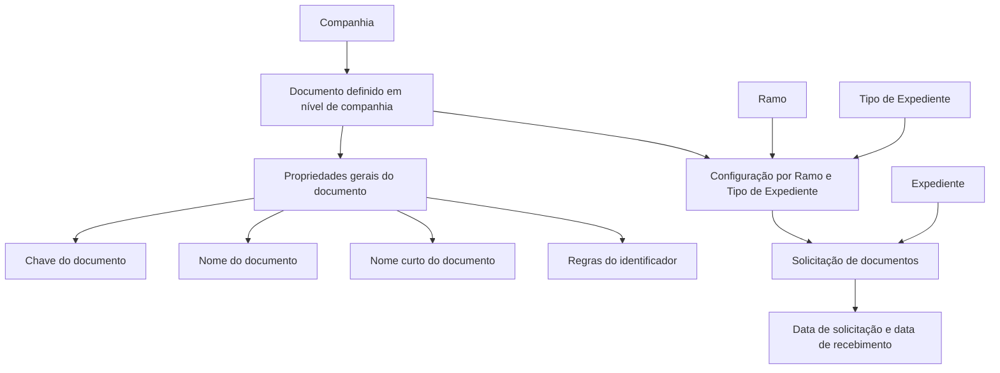

# Definição de Documentos — Documentação Reef

## 1. Metadados do Documento
- **Arquivo de Origem:** `Não identificado no conteúdo fornecido`
- **Tipo de Documento:** `Especificação Técnica / Funcional`
- **Domínio / Sistema:** `DOCUMENTACIÓN Reef / Mapfredocument`
- **Público-Alvo:** `Desenvolvedores, Analistas Funcionais, Operação e Negócio`
- **Data/Versão Identificada:** `Não identificada`

---

## 2. Resumo Executivo & Contexto de Negócio

O documento define o modelo de configuração dos documentos necessários para a tramitação de diferentes tipos de expedientes no contexto de DOCUMENTACIÓN Reef. O objetivo declarado é centralizar a definição dos documentos que podem ser requeridos durante a gestão de expedientes.

A especificação separa propriedades gerais de documentos, comuns a todos os ramos e tipos de expediente, das propriedades específicas aplicáveis a cada combinação de ramo e tipo de expediente. Essa separação permite que um documento seja definido uma única vez em nível de companhia e reutilizado em um ou mais ramos.

Cada documento possui uma chave identificadora, um nome longo para comunicações de solicitação e um nome curto destinado aos programas que solicitam documentos. O modelo também contempla regras de negócio para determinar quando o identificador de um documento é obrigatório e para validar identificadores conforme fórmulas ou formatos preestabelecidos.

No contexto operacional, o sistema deve registrar tanto a data de solicitação quanto a data de recebimento do documento pela companhia. Ao solicitar documentos para um expediente, devem ser buscados todos os documentos definidos para o ramo e o tipo de dano informado para o expediente.

---

## 3. Arquitetura, Componentes & Tecnologias Envolvidas

### Componentes e conceitos identificados

| Componente / Conceito | Descrição baseada no documento |
| :--- | :--- |
| DOCUMENTACIÓN Reef | Área ou sistema no qual a documentação é definida. |
| Mapfredocument | Nome exibido no cabeçalho do conteúdo fornecido. O documento não detalha sua função técnica. |
| Documento | Entidade configurada em nível de companhia, identificada por uma chave e associável a um ou mais ramos. |
| Ramo | Chave de classificação à qual documentos previamente definidos podem ser associados. |
| Tipo de Expediente | Chave de classificação à qual documentos previamente definidos podem ser associados. |
| Tipo de Daño | Critério citado na regra de busca de documentos para um expediente. O documento não esclarece formalmente a relação entre Tipo de Daño e Tipo de Expediente. |
| Expediente | Registro para o qual documentos podem ser solicitados. |
| Companhia | Nível no qual os documentos são inicialmente definidos antes de sua associação a ramos e tipos de expediente. |
| Comunicação de solicitação | Uso previsto para o nome longo do documento ao solicitar documentação necessária. |
| Programas solicitantes | Consumidores do nome curto do documento. Não são identificados no conteúdo fornecido. |



> **Nota de Análise:** O conteúdo descreve uma estrutura funcional de configuração e associação de documentos, mas não detalha tecnologias de implementação, APIs, métodos HTTP, contratos JSON, bancos de dados, URLs, ambientes, servidores ou integrações técnicas.

---

## 4. Regras de Negócio, Especificações Funcionais & Processos

### 4.1 Definição geral de documentos

1. Devem ser definidos todos os documentos que possam ser necessários para a tramitação dos diferentes tipos de expediente.
2. Existem propriedades comuns para todos os ramos e tipos de expediente.
3. Existem propriedades próprias para cada ramo e/ou tipo de expediente.
4. Os documentos são definidos inicialmente em nível de companhia.
5. Um documento definido em nível de companhia pode ser associado posteriormente aos ramos que deverão solicitá-lo.
6. Uma chave de documento pode ser utilizada para um ou mais ramos.

### 4.2 Identificação e nomenclatura do documento

1. A propriedade **Documento** é a chave pela qual os documentos necessários para tramitar um expediente serão identificados.
2. A propriedade **Nombre del Documento** contém a descrição da chave definida para o documento.
3. O nome do documento é longo para poder ser utilizado em comunicações que solicitam os documentos necessários.
4. A propriedade **Nombre Corto del Documento** contém a descrição curta definida para o documento.
5. A descrição curta deve ser utilizada pelos programas que solicitam documentos.

**Exemplo literal fornecido:**

| Campo | Valor |
| :--- | :--- |
| Documento | `1` |
| Nome do Documento | `Documento Nacional de Identidad` |
| Nome curto | `D.N.I.` |

### 4.3 Obrigatoriedade e validação do identificador do documento

1. A propriedade **Identificador del Documento es Obligatorio** indica se a identificação do documento deve ser informada quando o documento for recebido.
2. A propriedade **Lógica que determina si el Identificador es obligatorio** contém uma lógica de negócio para decidir se o registro do identificador do documento é obrigatório ou não.
3. A obrigatoriedade pode depender de outros parâmetros.
4. O documento apresenta como exemplo a condição de a pessoa relacionada ao expediente ser nacional do país ou estrangeira.
5. A propriedade **Lógica que valida el Identificador del Documento** contém uma lógica de negócio para validar o identificador quando existir fórmula ou formato preestabelecido.

> **Nota de Análise:** O documento não fornece a fórmula, o formato, os parâmetros completos nem a implementação das regras de obrigatoriedade e validação do identificador.

### 4.4 Habilitação e inabilitação de documentos

1. A propriedade **Inhabilitado** no nível geral indica se o documento definido está habilitado para ser associado aos diferentes ramos e/ou tipos de expediente.
2. A propriedade **Inhabilitado** no nível de ramo e tipo de expediente indica se o documento está habilitado ou desabilitado para ser solicitado em um expediente cuja combinação de ramo e tipo de expediente corresponda à configuração definida.

### 4.5 Configuração de documentos por ramo e tipo de expediente

1. Após a definição em nível de companhia, os documentos são associados aos ramos que os solicitarão.
2. A propriedade **Ramo** contém a chave do ramo ao qual os documentos previamente definidos em nível de companhia serão associados.
3. A propriedade **Tipo de Expediente** contém a chave do tipo de expediente ao qual os documentos previamente definidos em nível de companhia serão associados.
4. A configuração específica por ramo e tipo de expediente inclui uma lógica para determinar se o identificador é obrigatório.
5. A configuração específica por ramo e tipo de expediente inclui uma lógica para validar o identificador quando existir fórmula ou formato preestabelecido.
6. A configuração específica por ramo e tipo de expediente define se um documento pode ser solicitado para o expediente correspondente.

### 4.6 Solicitação e recebimento de documentos

1. É possível solicitar mais de um documento por expediente.
2. Quando documentos forem solicitados para um expediente, devem ser buscados todos os documentos definidos para o ramo e o tipo de dano do expediente.
3. Deve ser guardada a data em que cada documento foi solicitado.
4. Deve ser guardada a data em que cada documento foi recebido pela companhia.

> **Nota de Análise:** As seções de configuração utilizam o termo **Tipo de Expediente**, enquanto a regra de busca final utiliza **Tipo de Daño**. O documento não esclarece se ambos representam o mesmo atributo, se existe um mapeamento entre eles ou se há uma inconsistência terminológica.

---

## 5. Tabelas de Parâmetros, Ambientes e Estruturas de Dados

| Item / Parâmetro | Descrição / Função | Tipo / Valores / Formato | Ambiente / Observações |
| :--- | :--- | :--- | :--- |
| Documento | Chave usada para identificar os documentos necessários para tramitar um expediente. | Chave; formato não especificado. | Uma chave pode ser usada para um ou mais ramos. |
| Nombre del Documento | Descrição longa da chave do documento. | Texto; formato não especificado. | Utilizado para o envio de comunicação solicitando documentos necessários. |
| Nombre Corto del Documento | Descrição curta da chave do documento. | Texto; formato não especificado. | Utilizado pelos programas que solicitam documentos. |
| Identificador del Documento es Obligatorio | Indica se a identificação do documento deve ser inserida quando o documento for recebido. | Obrigatório ou não obrigatório; valores formais não especificados. | Aplicável à identificação no recebimento do documento. |
| Lógica que determina si el Identificador es obligatorio | Regra de negócio que decide se o registro do identificador é obrigatório. | Lógica de negócio; expressão não especificada. | Pode depender de outros parâmetros, como a condição de a pessoa ser do país ou estrangeira. |
| Lógica que valida el Identificador del Documento | Regra de negócio para validar um identificador de documento. | Lógica de negócio; fórmula ou formato preestabelecido quando existir. | O documento não especifica fórmulas ou formatos. |
| Inhabilitado — nível geral | Define se o documento está habilitado para associação a ramos e/ou tipos de expediente. | Estado habilitado ou inabilitado; codificação não especificada. | Propriedade do documento definido em nível de companhia. |
| Ramo | Chave do ramo que será associado a documentos previamente definidos em nível de companhia. | Chave; formato não especificado. | Propriedade da configuração de documentos por ramo e tipo de expediente. |
| Tipo de Expediente | Chave do tipo de expediente que será associado a documentos previamente definidos em nível de companhia. | Chave; formato não especificado. | Propriedade da configuração de documentos por ramo e tipo de expediente. |
| Lógica de obrigatoriedade por ramo/tipo | Regra de negócio para determinar se o identificador deve ser registrado conforme outros parâmetros. | Lógica de negócio; expressão não especificada. | Aplicada no contexto da configuração por ramo e tipo de expediente. |
| Lógica de validação por ramo/tipo | Regra de negócio para validar o identificador quando houver fórmula ou formato preestabelecido. | Lógica de negócio; fórmula/formato não especificados. | Aplicada no contexto da configuração por ramo e tipo de expediente. |
| Inhabilitado — nível de ramo/tipo | Define se um documento pode ser solicitado em um expediente da combinação configurada. | Estado habilitado ou desabilitado; codificação não especificada. | Aplicável ao ramo e tipo de expediente definidos. |
| Data de solicitação | Data em que um documento foi solicitado. | Data; formato não especificado. | Deve ser armazenada. |
| Data de recebimento | Data em que um documento foi recebido pela companhia. | Data; formato não especificado. | Deve ser armazenada. |
| Tipo de Daño | Critério citado para buscar documentos ao solicitar documentação para um expediente. | Não especificado. | Relação com Tipo de Expediente não detalhada. |

---

## 6. Bateria de Perguntas & Respostas para RAG (FAQ Sintético)

### P1: Qual é o objetivo da definição de documentos em DOCUMENTACIÓN Reef?
**R:** O objetivo é definir todos os documentos que possam ser necessários para a tramitação dos diferentes tipos de expediente. A definição contempla propriedades comuns a todos os ramos e tipos de expediente, além de propriedades específicas para cada ramo e/ou tipo de expediente.

### P2: Em qual nível os documentos são definidos inicialmente?
**R:** Os documentos são definidos inicialmente em nível de companhia. Posteriormente, os documentos definidos em nível de companhia são associados aos ramos que deverão solicitá-los.

### P3: Uma mesma chave de documento pode ser usada em mais de um ramo?
**R:** Sim. O documento informa expressamente que uma chave de documento pode ser utilizada para um ou vários ramos.

### P4: Para que serve o nome longo de um documento?
**R:** O nome longo contém a descrição da chave definida para o documento. Ele deve ser longo para poder ser utilizado no envio de uma comunicação que solicita os documentos necessários.

### P5: Para que serve o nome curto de um documento?
**R:** O nome curto contém a descrição curta definida para o documento. Essa descrição curta é utilizada pelos programas que solicitam documentos.

### P6: Quando o identificador de um documento pode ser obrigatório?
**R:** A obrigatoriedade é definida por uma lógica de negócio que pode depender de outros parâmetros. O documento cita como exemplo a condição de a pessoa relacionada ao expediente ser nacional do país ou estrangeira. A expressão concreta da regra não é detalhada.

### P7: Como o sistema deve validar o identificador de um documento?
**R:** A validação deve ser realizada por uma lógica de negócio quando o identificador possuir uma fórmula ou um formato preestabelecido. O documento não especifica quais fórmulas, formatos ou critérios de validação devem ser aplicados.

### P8: O que significa a propriedade Inhabilitado no nível geral do documento?
**R:** No nível geral, a propriedade Inhabilitado indica se o documento definido está habilitado para ser associado aos diferentes ramos e/ou tipos de expediente.

### P9: O que significa a propriedade Inhabilitado na configuração por ramo e tipo de expediente?
**R:** Na configuração por ramo e tipo de expediente, a propriedade Inhabilitado indica se o documento está habilitado ou desabilitado para ser solicitado em um expediente cujo ramo e tipo de expediente sejam aqueles definidos na configuração.

### P10: É possível solicitar mais de um documento para um mesmo expediente?
**R:** Sim. O documento confirma que é possível solicitar mais de um documento por expediente.

### P11: Quais documentos devem ser buscados quando ocorre uma solicitação para um expediente?
**R:** Devem ser buscados todos os documentos definidos para o ramo e o tipo de dano que o expediente possuir. O documento não explica a relação entre o termo Tipo de Daño e o termo Tipo de Expediente usado nas seções anteriores.

### P12: Quais datas devem ser registradas durante o processo de solicitação documental?
**R:** Devem ser registradas a data em que o documento foi solicitado e a data em que o documento foi recebido pela companhia.

---

## 7. Glossário de Termos, Siglas & Conceitos-Chave

- **DOCUMENTACIÓN Reef:** Contexto ou sistema identificado no documento para definição e gestão de documentação.
- **Mapfredocument:** Nome apresentado no cabeçalho do conteúdo. O papel funcional ou técnico não é detalhado.
- **Documento:** Entidade configurável que representa um documento necessário para a tramitação de um expediente.
- **Expediente:** Registro para o qual documentos podem ser solicitados durante sua tramitação.
- **Ramo:** Chave de classificação usada para associar documentos definidos em nível de companhia.
- **Tipo de Expediente:** Chave de classificação usada para associar documentos definidos em nível de companhia.
- **Tipo de Daño:** Critério mencionado para buscar documentos no momento de solicitação para um expediente; sua relação com Tipo de Expediente não é detalhada.
- **Identificador del Documento:** Identificação associada ao documento recebido, cuja obrigatoriedade e validação podem ser governadas por regras de negócio.
- **Inhabilitado:** Propriedade que representa a condição de habilitado ou desabilitado de um documento em nível geral ou em uma configuração por ramo e tipo de expediente.
- **D.N.I.:** Abreviação apresentada como nome curto para “Documento Nacional de Identidad”. O documento não expande a sigla.

---

## 8. Notas Críticas, Riscos & Limitações

- O conteúdo não identifica nome de arquivo, data, versão, autor técnico, histórico de alterações ou aprovação além das informações de cabeçalho apresentadas.
- Não há detalhamento de arquitetura técnica, APIs, endpoints, métodos HTTP, contratos de integração, persistência, tecnologias, servidores, URLs ou ambientes.
- As lógicas de obrigatoriedade e validação do identificador são citadas, mas não possuem fórmulas, regras condicionais completas, exemplos de entrada ou critérios de erro.
- O documento utiliza **Tipo de Expediente** nas propriedades de configuração e **Tipo de Daño** na regra de busca de documentos. A relação entre os termos não é esclarecida.
- Os valores possíveis, tipos de dados, formatos de chaves, codificações de estados e formatos de data não são especificados.
- Não são detalhados os programas que utilizam o nome curto do documento.
- Não há definição de comportamento para documentos desabilitados já associados a expedientes, documentos recebidos sem identificador, falhas de validação ou alterações de configurações já em uso.

---

## 9. Conteúdo Bruto Estruturado (Referência Fiel)

```text
--- [PÁGINA 1 DE 3] ---

DEFINICIÓN de Documentos
Objetivo
La finalidad es definir todos los documentos (documentación) que puedan ser necesarios para la tramitación de los diferentes tipos de
expedientes.
Tendremos propiedades que serán comunes para todos los ramos y tipos de Expedientes y otras propiedades que serán propias de cada
Ramo y/o Tipo de Expediente.
Propiedades Generales
Propiedades por Ramo
Propiedades Generales
En este apartado se detallarán todos los atributos, propiedades comunes, es decir los atributos que no cambian por ramo.
Documento
Esta propiedad será la clave por la que se va a identificar los documentos necesarios para tramitar un expediente.
Una clave podrá ser utilizada para uno o varios ramos.
Nombre del Documento
Esta propiedad contendrá la descripción de la clave definida para el documento.
Este Nombre es largo para que pueda ser utilizado, para el envío de una comunicación solicitando los documentos necesarios.
Ejemplo:
Documento: 1
Nombre del Documento: Documento Nacional de Identidad
Nombre Corto del Documento
Esta propiedad contendrá la descripción de la clave corta, definida para el documento.
Esta descripción corta será utilizada, para los programas que solicitan los documentos.
Ejemplo:
Documento: 1
Nombre del Documento: Documento Nacional de Identidad
Nombre corto: D.N.I.
Documentation / DOCUMENTACIÓN Reef
DOCUMENTACIÓN Reef
Mapfredocument
DOCUMENTACIÓN Reef
Owner
user:agonzalez_mapfre.com
Lifecycle
Approved Source
 /
 VL
Buscar Inicio Soluciones Arquitecturas APIs Componentes Cloud Documentación Zeus Reef Ayuda
ES


--- [PÁGINA 2 DE 3] ---

Identificador del Documento es Obligatorio
Esta propiedad contendrá si la identificación del documento cuando se reciba es obligatorio introducirlo o No.
Lógica que determina si el Identificador es obligatorio
Esta propiedad contendrá una lógica de Negocio, para los casos en el que la obligatoriedad de registrar el identificador del documento sea
obligatorio o no, dependiendo de otros parámetros, por ejemplo dependiendo de si la persona relacionada con el expediente es del país o
extranjero ...
Lógica que valida el Identificador del Documento
Esta propiedad contendrá una lógica de Negocio, para validar el identificador del documento, si este tiene una fórmula o un formato
preestablecido.
Inhabilitado
Esta propiedad indica si el Documento que está definido, está habilitado para poder asociarlo a los diferentes Ramos y/o Tipos de
Expediente.
Propiedades de los Documentos por Ramo y Tipo de Expediente
Como se ha indicado anteriormente, los documentos están definidos a nivel de compañía, y posteriormente se asociarán a los ramos que los
vayan a solicitar. En este apartado se detallará todos los atributos necesarios para definir el comportamiento del documento dentro de un
Ramo.
Ramo
Esta propiedad indica la clave del Ramo al que se va a asociar los documentos definidos previamente a nivel de compañía.
Tipo de Expediente
Esta propiedad indica la clave del Tipo de Expediente al que se va a asociar los documentos definidos previamente a nivel de compañía.
Lógica que determina si el Identificador es obligatorio
Esta propiedad contendrá una lógica de Negocio, para los casos en el que la obligatoriedad de registrar el identificador del documento sea
obligatorio o no, dependiendo de otros parámetros,
Lógica que valida Identificador del Documento
Esta propiedad contendrá una lógica de Negocio, para validar el identificador del documento, si hay una fórmula o formato preestablecido
Inhabilitado
Esta propiedad indica si el Documento que está definido, está habilitado o deshabilitado para solicitarlo en un expediente, cuyo ramo y tipo de
expediente sea el que se está definiendo.
Preguntas frecuentes
¿Cuándo se soliciten los documentos, se guardará la fecha de cuando se solicitó dicho documento?
Si, quedará guardada tanto la fecha de cuando se solicita, como la fecha de cuando se recibió en la compañía.
Ejemplo:
Ejemplo:
Ejemplo:
Ejemplo:


--- [PÁGINA 3 DE 3] ---

¿Se van a poder solicitar más de un documento por Expediente?
Si, cuando se soliciten los documentos para un expediente, se buscarán todos los documentos que estén definidos para el Ramo y el
Tipo de Daño que tenga el expediente.
```
