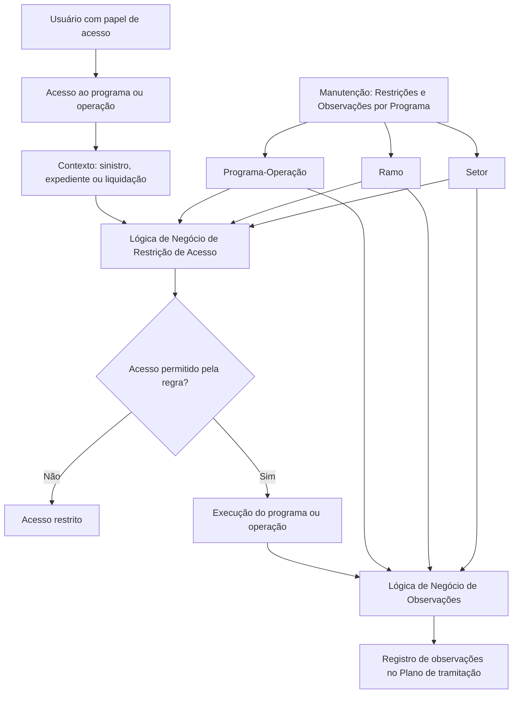

# Restrições e Observações do Plano por Programa — Definição Funcional

## 1. Metadados do Documento
- **Arquivo de Origem:** Não identificado no conteúdo fornecido
- **Tipo de Documento:** Especificação Técnica / Manual Funcional
- **Domínio / Sistema:** Reef / Mapfre — Plano de tramitação de sinistros
- **Público-Alvo:** Desenvolvedores, analistas funcionais, operação e administradores de regras de negócio
- **Data/Versão Identificada:** Não identificada

---

## 2. Resumo Executivo & Contexto de Negócio

O documento descreve a funcionalidade de **Restrições e Observações do Plano por Programa**, destinada a controlar o acesso a programas e operações por meio de lógica de negócio. A restrição é aplicada quando a permissão concedida pelo papel do usuário não é suficiente para garantir que o usuário possa tratar determinados dados de sinistro.

A lógica de restrição de acesso é configurada em associação com um **Setor**, um **Ramo** e um **Programa-Operação**. As regras podem variar conforme o setor e o ramo relacionados ao sinistro. O documento também permite utilizar valores genéricos de setor ou ramo para que as lógicas sejam executadas independentemente dessas classificações.

Além das restrições de acesso, a funcionalidade permite definir uma lógica de negócio para registrar observações no **Plano de tramitação** sempre que um programa ou uma operação configurada for executada. Essas observações devem indicar o que foi realizado pelo programa ou operação.

Um exemplo de regra citado determina que somente o tramitador responsável pelo expediente pode liquidá-lo. O documento não detalha a sintaxe, o mecanismo de implementação, os métodos de execução ou os contratos técnicos das lógicas de negócio.

---

## 3. Arquitetura, Componentes & Tecnologias Envolvidas

Os componentes funcionais identificados no documento são:

- **Mantenimiento Restricciones y Observaciones del plan por programa:** manutenção/configuração de regras de restrição e observações.
- **Setor:** chave usada para associar lógicas de negócio a um contexto setorial.
- **Ramo:** chave usada para associar lógicas de negócio a um contexto de ramo.
- **Programa-Operação:** programa ou operação para a qual são definidas regras de acesso ou observações.
- **Lógica de Negócio de Restrição de Acesso ao Programa:** regras executadas durante o acesso ao programa ou operação.
- **Lógica de Negócio de Observações no Plano de tramitação:** regras que registram observações no plano durante a execução de um programa ou operação.
- **Sinistro, expediente e liquidação:** entidades ou contextos operacionais citados como pontos de aplicação das regras.
- **Reef / Mapfre:** referências de domínio e documentação presentes no conteúdo original.



> **Nota de Análise:** O documento apresenta a relação funcional entre setor, ramo, programa-operação e lógicas de negócio, mas não descreve componentes de software, APIs, protocolos, banco de dados, tecnologias de implementação ou ambientes técnicos.

---

## 4. Regras de Negócio, Especificações Funcionais & Processos

### 4.1 Finalidade da restrição de acesso

A restrição de acesso deve ser utilizada quando o papel do usuário já concede acesso a determinado programa, porém existe necessidade de limitar esse acesso em razão dos dados que serão tratados pelo programa.

A lógica de negócio de restrição é complementar ao controle por papel. O documento estabelece que a autorização baseada somente no papel pode ser insuficiente para determinados cenários operacionais.

### 4.2 Critérios de segmentação das regras

As regras de negócio podem ser configuradas de acordo com:

1. **Setor**
2. **Ramo**
3. **Programa ou operação**

A restrição pode ser diferente por setor e por ramo. O setor genérico pode ser usado quando a lógica deve ser disparada independentemente do setor do sinistro. O ramo genérico pode ser usado quando a lógica deve ser disparada independentemente do ramo do sinistro.

### 4.3 Programa e operação associados

A propriedade **Programa-Operação** identifica o programa ou a operação para os quais serão definidas:

- regras de acesso; ou
- lógica para criação de observações no Plano de tramitação.

O documento cita, como exemplos de programas ou operações:

- Plano de tramitação;
- Valoração do expediente;
- Alteração de valoração;
- Liquidação.

### 4.4 Execução da lógica de restrição

A lógica de negócio de restrição de acesso é executada ao acessar o programa após o ingresso em um contexto operacional, citado no documento como:

- sinistro;
- sinistro e expediente;
- liquidação;
- outros contextos indicados pelo uso de “etc.” no texto original.

A finalidade dessa lógica é restringir o acesso ao programa ou operação de acordo com as regras configuradas.

**Exemplo explícito do documento:** somente o tramitador responsável pelo expediente poderá liquidar o expediente.

### 4.5 Registro de observações

A lógica de negócio de observações define quais observações devem ser registradas no Plano de tramitação cada vez que o programa ou a operação configurada for executada.

As observações devem conter indicações sobre o que foi realizado pelo programa. O documento não define estrutura textual, campos obrigatórios, persistência, destinatários, regras de retenção ou formato das observações.

---

## 5. Tabelas de Parâmetros, Ambientes e Estruturas de Dados

| Item / Parâmetro | Descrição / Função | Tipo / Valores / Formato | Ambiente / Observações |
| :--- | :--- | :--- | :--- |
| Setor | Chave do setor ao qual será associada uma lógica de negócio para acesso ao programa ou para gravações no plano. | Chave de setor; setor genérico também é aceito. | O setor genérico faz com que as lógicas sejam lançadas independentemente do setor do sinistro. |
| Ramo | Chave do ramo ao qual será associada uma lógica de negócio para acesso ao programa ou para gravações no plano. | Chave de ramo; ramo genérico também é aceito. | O ramo genérico faz com que as lógicas sejam lançadas independentemente do ramo do sinistro. |
| Programa-Operação | Programa ou operação para o qual serão definidas regras de acesso ou lógica de criação de observações. | Programa ou operação. | Exemplos: Plano de tramitação, Valoração do expediente, Alteração de valoração e Liquidação. |
| Lógica de Negócio de Restrição de Acesso ao Programa | Define regras executadas quando ocorre o acesso ao programa ou à operação. | Lógica de negócio; implementação não detalhada. | Aplicável após informar contexto como sinistro, sinistro e expediente ou liquidação. |
| Lógica de Negócio de Observações no Plano de tramitação | Define observações a registrar no Plano de tramitação durante a execução do programa ou operação. | Lógica de negócio; conteúdo das observações não detalhado. | Deve ser executada cada vez que o programa ou a operação definida for executada. |
| Papel do usuário | Mecanismo de acesso já existente, considerado insuficiente em determinados cenários. | Papel de usuário; valores não informados. | A restrição adicional é aplicada devido aos dados a tratar. |
| Tramitador responsável | Usuário responsável pelo expediente. | Responsável pelo expediente; formato não informado. | Exemplo de regra: somente esse usuário pode liquidar o expediente. |
| Sinistro | Contexto de negócio mencionado para execução das regras. | Entidade de negócio; estrutura não informada. | Setor e ramo do sinistro influenciam a aplicabilidade das lógicas. |
| Expediente | Contexto de negócio mencionado para execução das regras e exemplo de liquidação. | Entidade de negócio; estrutura não informada. | Pode ser usado juntamente com o sinistro. |
| Liquidação | Operação e contexto mencionado no documento. | Operação de negócio; detalhes não informados. | Pode ter acesso restrito por lógica de negócio. |

---

## 6. Bateria de Perguntas & Respostas para RAG (FAQ Sintético)

### P1: Qual é a finalidade da funcionalidade de Restrições e Observações do Plano por Programa?
**R:** A funcionalidade permite restringir o acesso de usuários a programas ou operações por meio de lógica de negócio e, adicionalmente, registrar observações no Plano de tramitação quando um programa ou operação é executado.

### P2: Quando uma restrição de acesso deve ser usada além do papel do usuário?
**R:** A restrição deve ser usada quando o usuário já possui acesso ao programa por seu papel, mas o acesso precisa ser limitado em razão dos dados que serão tratados pelo programa.

### P3: Quais propriedades são usadas para associar regras de negócio de acesso ou observações?
**R:** As propriedades são Setor, Ramo e Programa-Operação. Setor e ramo determinam o contexto de aplicação da lógica, enquanto Programa-Operação identifica o programa ou operação alvo.

### P4: O que acontece quando é utilizado um setor genérico?
**R:** Quando é utilizado um setor genérico, as lógicas de negócio associadas são executadas independentemente do setor do sinistro.

### P5: O que acontece quando é utilizado um ramo genérico?
**R:** Quando é utilizado um ramo genérico, as lógicas de negócio associadas são executadas independentemente do ramo do sinistro.

### P6: Que tipos de programas ou operações podem ser configurados?
**R:** O documento cita Plano de tramitação, Valoração do expediente, Alteração de valoração e Liquidação como exemplos de programas ou operações que podem receber regras de acesso ou lógica de observações.

### P7: Em que momento a lógica de restrição de acesso é executada?
**R:** A lógica de restrição é executada quando ocorre o acesso ao programa, depois de ingressar em um contexto como sinistro, sinistro e expediente ou liquidação.

### P8: Qual exemplo de regra de restrição de acesso é apresentado?
**R:** O documento apresenta como exemplo a regra segundo a qual somente o tramitador responsável pelo expediente pode liquidar esse expediente.

### P9: Qual é a função da lógica de negócio de observações no Plano de tramitação?
**R:** Essa lógica define as observações que devem ser registradas no Plano de tramitação toda vez que o programa ou a operação configurada for executada.

### P10: O documento detalha os métodos HTTP, contratos JSON ou a implementação técnica das lógicas de negócio?
**R:** Não. O documento descreve a finalidade funcional das lógicas de negócio, mas não informa métodos HTTP, APIs, contratos JSON, linguagem de programação, persistência ou mecanismos técnicos de execução.

---

## 7. Glossário de Termos, Siglas & Conceitos-Chave

- **Plano de tramitação:** Plano no qual podem ser registradas observações resultantes da execução de programas ou operações.
- **Programa-Operação:** Propriedade que identifica o programa ou operação para a qual se deseja configurar regras de acesso ou observações.
- **Setor:** Chave de classificação usada para associar lógicas de negócio ao contexto setorial.
- **Setor genérico:** Configuração que permite executar lógicas independentemente do setor do sinistro.
- **Ramo:** Chave de classificação usada para associar lógicas de negócio ao contexto de ramo.
- **Ramo genérico:** Configuração que permite executar lógicas independentemente do ramo do sinistro.
- **Lógica de Negócio de Restrição de Acesso ao Programa:** Lógica que define regras para restringir o acesso a programas ou operações.
- **Lógica de Negócio de Observações no Plano de tramitação:** Lógica que define observações a registrar no plano ao executar um programa ou operação.
- **Sinistro:** Contexto de negócio citado para aplicação das regras.
- **Expediente:** Contexto de negócio associado ao sinistro e à operação de liquidação.
- **Liquidação:** Operação citada como exemplo de programa-operação que pode possuir restrições de acesso.
- **Tramitador responsável:** Responsável pelo expediente; citado como o único autorizado a liquidar o expediente no exemplo apresentado.
- **Reef:** Referência presente no cabeçalho de documentação original; o papel técnico não é detalhado.
- **Mapfre:** Referência corporativa presente no conteúdo original; o documento não detalha sua relação técnica com a funcionalidade.
- **VL:** Sigla exibida no cabeçalho do conteúdo bruto, sem definição adicional no documento.

---

## 8. Notas Críticas, Riscos & Limitações

- O documento não informa o nome do arquivo de origem, a data, a versão ou a autoria formal da especificação.
- Não há detalhamento da sintaxe, modelagem, motor de regras, linguagem, ponto de configuração ou mecanismo de execução das lógicas de negócio.
- Não são definidos critérios de prioridade, conflito ou precedência quando mais de uma regra puder ser aplicável a um mesmo setor, ramo e programa-operação.
- Não são apresentados comportamentos para falhas, exceções, auditoria, rastreabilidade ou mensagens exibidas quando o acesso é restringido.
- O texto menciona “gravações no plano”, mas não especifica os campos, a estrutura, o formato ou o ciclo de vida das observações gravadas.
- Não há informação sobre ambientes, URLs, servidores, credenciais, rotas de log, integrações, APIs ou contratos de dados.
- **Nota de Análise:** O documento lista programas e operações, porém não detalha métodos de acesso, contratos de entrada e saída, nem regras completas para cada programa citado.

---

## 9. Conteúdo Bruto Estruturado (Referência Fiel)

```text
--- [PÁGINA 1 DE 2] ---

DEFINICIÓN Restricciones y Observaciones del plan por programa

Objetivo

La finalidad de este documento, es explicar como poder acotar el acceso a los programas mediante una lógica de Negocio y como definir mediante lógica de negocio las observaciones que se quieren incluir en el plan cada vez que se ejecute el Programa.

El restringir el acceso se utiliza cuando no es suficiente con el rol, el usuario por su rol, tiene acceso al programa, pero se quiere restringir dicho acceso por los datos que se van a tratar.

Esta restricción puede ser diferente por sector y por ramo.

También se va a poder determinar mediante una lógica de Negocio, si al ejecutar el programa desde el Plan de tramitación se quiere dejar en las observaciones, unas indicaciones de lo que ha realizado dicho programa.

Imagen del Mantenimiento Restricciones y Observaciones del plan por programa:

Propiedades

Sector

Ejemplo:

Documentation / DOCUMENTACIÓN Reef
DOCUMENTACIÓN Reef
Mapfredocument
DOCUMENTACIÓN Reef
Owner
user:agonzalez_mapfre.com
Lifecycle
Approved Source
/
VL
Buscar Inicio Soluciones Arquitecturas APIs Componentes Cloud Documentación Zeus Reef Ayuda
ES


--- [PÁGINA 2 DE 2] ---

Esta propiedad indica la clave del Sector al que se le va asociar una lógica de Negocio para acceder al programa que estamos dando de alta o una Lógica de Negocio para sus grabaciones en el plan. Puede utilizarse el sector genérico que indicará que las lógicas serán lanzadas independientemente del sector del siniestro.

Ramo

Esta propiedad indica la clave del Ramo al que se le va asociar una lógica de Negocio para acceder al programa que estamos dando de alta o una Lógica de Negocio para sus grabaciones en el plan. Puede utilizarse el ramo genérico que indicará que las lógicas serán lanzadas independientemente del ramo del siniestro.

Programa-Operación

Esta propiedad contendrá el programa o la operación (Plan de tramitación, Valoración del expediente, Cambio de valoración, Liquidación... etc) a la que queremos definir unas reglas de acceso a dichos programas o una lógica que cree unas observaciones en el plan de tramitación, cada vez que se ejecute dicho programa.

Lógica de Negocio de Restricción de Acceso al Programa

En esta lógica de negocio se definirán las reglas que serán ejecutadas cuando se acceda al programa una vez se ingrese el siniestro, el siniestro y expediente, la liquidación.. etc.

Servirá para restringir el acceso, por ejemplo sólo podrá liquidar el expediente, el tramitador responsable del expediente.

Lógica de Negocio observaciones en el Plan de tramitación

En esta lógica de negocio se definirán las observaciones ue se quieren registrar en el Plan de tramitación cada vez que se ejecute el programa, la operación que estamos definiendo.

Preguntas frecuentes

Ejemplo:
```
