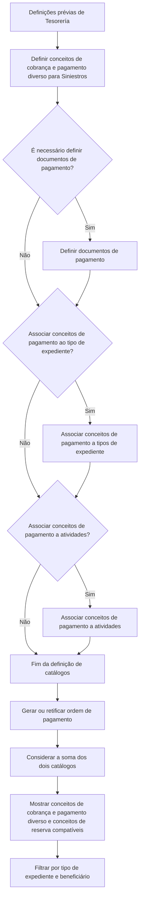

# Definição de Liquidações no Reef.core: Catálogos, Conceitos e Documentos de Pagamento

## 1. Metadados do Documento
- **Arquivo de Origem:** Não identificado no conteúdo fornecido
- **Tipo de Documento:** Procedimento
- **Domínio / Sistema:** Reef.core; Tesorería; módulo de Siniestros; liquidações de expedientes
- **Público-Alvo:** Não identificado expressamente; conteúdo direcionado à configuração funcional de liquidações
- **Data/Versão Identificada:** Não identificada
- **Proprietário identificado:** `agonzalez_mapfre.com`
- **Lifecycle identificado:** Approved

---

## 2. Resumo Executivo & Contexto de Negócio

O documento descreve as configurações prévias necessárias para gerar liquidações de expedientes, também referidas como ordens de pagamento, no sistema Reef.core. A configuração é realizada pelo usuário, que define como o sistema deve se comportar no processo de liquidação.

Uma liquidação permite informar ao sistema quem receberá o pagamento, como o pagamento será realizado, o que será pago e qual será o valor pago. Para viabilizar essa operação, o documento distingue catálogos obrigatórios de configurações opcionais.

O fluxo principal começa pelas definições prévias de Tesorería. Nesse contexto, devem ser definidos conceitos de cobrança e de pagamento diverso para Siniestros. A definição de documentos de pagamento é condicional: o processo pergunta se é necessário defini-los e, quando a resposta é positiva, direciona para a definição desses documentos.

Após a definição dos catálogos, a geração ou retificação de uma ordem de pagamento considera a soma de dois catálogos. O sistema apresenta apenas os conceitos de cobrança e pagamento diverso, bem como os conceitos de reserva, que correspondam ao tipo de expediente liquidado e ao beneficiário da liquidação.

O documento também enumera outras definições relacionadas a liquidações — estruturas de informação, convênios de pagamento por atividade, aplicação de prêmios pendentes, valores iniciais de atributos, validações e comportamento —, porém não apresenta detalhamento adicional desses tópicos no conteúdo fornecido.

---

## 3. Arquitetura, Componentes & Tecnologias Envolvidas

### Componentes, domínios e elementos identificados

| Componente / Elemento | Papel descrito no documento | Relações identificadas |
| :--- | :--- | :--- |
| Reef.core | Sistema que requer configuração prévia para funcionar no contexto de liquidações. | Utiliza configurações definidas pelo usuário para gerar liquidações de expedientes. |
| Liquidações | Processo de definição e geração de ordens de pagamento de expedientes. | Depende de catálogos, tipo de expediente e beneficiário. |
| Ordens de pagamento | Resultado operacional da geração ou retificação de uma liquidação. | Consideram conceitos de catálogos aplicáveis. |
| Tesorería | Área ou conjunto de definições prévias para o processo de liquidações. | Inclui definições de conceitos e, condicionalmente, documentos de pagamento. |
| Módulo de Siniestros | Módulo para o qual são definidos conceitos de cobrança e pagamento diverso. | Relaciona conceitos de pagamento a tipos de expediente e atividades. |
| Conceitos de Cobro y Pago Vario | Catálogo obrigatório citado para Siniestros. | Pode ser associado a tipos de expediente e a atividades. |
| Documentos de Pago | Configuração condicional. | Deve ser definida quando houver necessidade indicada no fluxo. |
| Tipo de Expediente | Critério de associação e filtragem de conceitos. | Relacionado a conceitos de pagamento e à liquidação. |
| Actividades | Elemento ao qual conceitos de pagamento podem ser associados. | Participa de uma decisão de configuração opcional. |
| Beneficiario | Critério de filtragem durante a geração ou retificação da ordem de pagamento. | Define quais conceitos correspondentes podem ser apresentados. |
| Conceptos de Reserva | Conceitos apresentados quando correspondem ao tipo de expediente e beneficiário. | Considerados junto aos conceitos de cobrança e pagamento diverso. |

### Fluxo de configuração e seleção de conceitos



> **Nota de Análise:** O documento não especifica a arquitetura técnica do Reef.core, APIs, bancos de dados, protocolos de integração, métodos HTTP, contratos JSON, servidores, URLs, versões de tecnologia ou mecanismos de persistência.

---

## 4. Regras de Negócio, Especificações Funcionais & Processos

### 4.1. Configuração prévia do sistema

1. O Reef.core necessita de uma configuração prévia para seu funcionamento.
2. O usuário define como deseja que o sistema se comporte.
3. O objetivo do procedimento é definir os catálogos necessários para gerar liquidações de expedientes, isto é, ordens de pagamento.

### 4.2. Informações determinadas por uma liquidação

Ao gerar uma liquidação, o sistema recebe ou determina os seguintes aspectos:

| Aspecto da liquidação | Descrição apresentada |
| :--- | :--- |
| Destinatário do pagamento | A quem será pago. |
| Forma de pagamento | Como será pago. |
| Objeto do pagamento | O que será pago. |
| Valor do pagamento | Quanto será pago. |

### 4.3. Catálogos necessários

O documento indica que existem catálogos obrigatórios e outros opcionais para o funcionamento das liquidações.

| Catálogo / Definição | Obrigatoriedade indicada | Regra ou finalidade |
| :--- | :--- | :--- |
| Conceitos de cobrança e pagamento diverso para Siniestros | Obrigatório no fluxo apresentado | Deve ser definido no contexto das definições prévias de Tesorería. |
| Documentos de pagamento | Condicional | Deve ser definido somente quando houver necessidade de documentos de pagamento. |
| Associação de conceitos de pagamento a tipos de expediente | Condicional | O fluxo pergunta se os conceitos devem ser associados a tipos de expediente. |
| Associação de conceitos de pagamento a atividades | Condicional | O fluxo pergunta se os conceitos devem ser associados a atividades. |

### 4.4. Processo de definição dos catálogos de liquidações

1. Iniciar pelas definições prévias de Tesorería.
2. Definir conceitos de cobrança e pagamento diverso para o módulo de Siniestros.
3. Avaliar se é necessário definir documentos de pagamento.
4. Caso documentos de pagamento sejam necessários, definir os documentos de pagamento.
5. Avaliar a necessidade de associar conceitos de pagamento a tipos de expediente.
6. Caso a associação seja requerida, associar conceitos de pagamento aos tipos de expediente.
7. Avaliar a necessidade de associar conceitos de pagamento a atividades.
8. Caso a associação seja requerida, associar conceitos de pagamento às atividades.
9. Concluir a definição dos catálogos.

### 4.5. Regra de apresentação durante geração ou retificação

Após a definição dos catálogos, a geração de uma ordem de pagamento ou a retificação de uma ordem de pagamento deve considerar a soma de dois catálogos.

A apresentação deve mostrar exclusivamente:

1. Conceitos de cobrança e pagamento diverso.
2. Conceitos de reserva.
3. Conceitos que correspondam ao tipo de expediente a ser liquidado.
4. Conceitos que correspondam ao beneficiário da liquidação.

> **Nota de Análise:** O documento afirma que são considerados “a soma de estos dos catálogos”, mas o trecho fornecido não identifica formalmente quais são os dois catálogos que compõem essa soma.

### 4.6. Outras definições de liquidações mencionadas

| Definição mencionada | Detalhamento disponível |
| :--- | :--- |
| Estruturas de informação das liquidações | Não detalhado no conteúdo fornecido. |
| Convênios de pagamento por atividade | Não detalhado no conteúdo fornecido. |
| Aplicação de prêmios pendentes nas liquidações | Não detalhado no conteúdo fornecido. |
| Valores iniciais de atributos das liquidações | Não detalhado no conteúdo fornecido. |
| Validações das liquidações e comportamento | Não detalhado no conteúdo fornecido. |

---

## 5. Tabelas de Parâmetros, Ambientes e Estruturas de Dados

| Item / Parâmetro | Descrição / Função | Tipo / Valores / Formato | Ambiente / Observações |
| :--- | :--- | :--- | :--- |
| Usuário configurador | Define como o Reef.core deve se comportar. | Usuário do sistema | Não há identificação de perfil, papel ou permissão. |
| Conceitos de cobrança | Conceitos considerados nas liquidações. | Catálogo funcional | Relacionados ao módulo de Siniestros. |
| Pagamento diverso | Conceitos de pagamento diverso considerados nas liquidações. | Catálogo funcional | Relacionados ao módulo de Siniestros. |
| Documentos de pagamento | Documentos a definir quando necessários. | Configuração condicional | A condição de necessidade não é detalhada. |
| Tipo de expediente | Critério para associação e apresentação de conceitos. | Classificação de expediente | Deve corresponder ao expediente que será liquidado. |
| Atividade | Critério opcional de associação para conceitos de pagamento. | Atividade | Não são informadas atividades específicas. |
| Beneficiário | Critério de apresentação de conceitos na liquidação. | Entidade beneficiária | Deve corresponder à liquidação. |
| Conceitos de reserva | Conceitos apresentados quando atendem aos critérios da liquidação. | Catálogo funcional | Devem corresponder ao tipo de expediente e ao beneficiário. |
| Geração de ordem de pagamento | Processo que utiliza as definições de catálogo. | Operação funcional | Considera a soma de dois catálogos não identificados formalmente. |
| Retificação de ordem de pagamento | Processo que utiliza as mesmas regras de consideração de catálogos. | Operação funcional | Aplicável após definição dos catálogos. |
| Owner | Proprietário indicado no documento. | `agonzalez_mapfre.com` | Valor exibido literalmente no conteúdo. |
| Lifecycle | Estado do ciclo de vida do documento. | `Approved` | Valor identificado no conteúdo. |
| Source | Origem indicada no rodapé do conteúdo. | `VL` | Sem detalhamento adicional. |

> **Nota de Análise:** O conteúdo fornecido não apresenta ambientes, URLs, nomes de servidores, portas, caminhos de logs, variáveis de configuração, estruturas de campos ou contratos de dados.

---

## 6. Bateria de Perguntas & Respostas para RAG (FAQ Sintético)

### P1: Qual é o objetivo do documento de definição de liquidações no Reef.core?
**R:** O objetivo é identificar o que precisa ser definido para realizar liquidações de expedientes, isto é, gerar ordens de pagamento. O procedimento descreve a configuração de catálogos necessários para que o Reef.core possa operar esse processo.

### P2: Quais informações uma liquidação define no Reef.core?
**R:** Uma liquidação informa a quem será pago, como será pago, o que será pago e quanto será pago. O documento não detalha os campos técnicos, formatos ou interfaces utilizados para informar esses dados.

### P3: Qual catálogo deve ser definido para o módulo de Siniestros?
**R:** O fluxo determina a definição de conceitos de cobrança e pagamento diverso para Siniestros. Essa definição aparece como parte das definições prévias de Tesorería necessárias para o processo de liquidações.

### P4: Os documentos de pagamento são sempre obrigatórios?
**R:** Não. O fluxo apresenta uma decisão: “¿Hay que definir Documentos de Pago?”. Se a resposta for positiva, devem ser definidos documentos de pagamento; se for negativa, o fluxo prossegue sem essa definição.

### P5: É possível associar conceitos de pagamento a tipos de expediente?
**R:** Sim. O documento apresenta uma decisão sobre associar conceitos de pagamento ao tipo de expediente. Quando essa associação é necessária, os conceitos de pagamento devem ser associados aos tipos de expediente.

### P6: É possível associar conceitos de pagamento a atividades?
**R:** Sim. O fluxo prevê a associação de conceitos de pagamento a atividades como uma definição condicional. O documento não especifica quais atividades existem nem os critérios usados para decidir essa associação.

### P7: O que ocorre após a definição dos catálogos de liquidações?
**R:** Após a definição dos catálogos, a geração ou a retificação de uma ordem de pagamento considera a soma de dois catálogos. O documento não identifica formalmente, no trecho fornecido, quais são esses dois catálogos.

### P8: Quais conceitos são exibidos ao gerar ou retificar uma ordem de pagamento?
**R:** São exibidos unicamente os conceitos de cobrança e pagamento diverso e os conceitos de reserva que correspondam ao tipo de expediente a ser liquidado e ao beneficiário da liquidação.

### P9: Quais critérios filtram os conceitos apresentados em uma liquidação?
**R:** Os conceitos devem corresponder simultaneamente ao tipo de expediente que será liquidado e ao beneficiário da liquidação. O documento não detalha como essa correspondência é configurada ou validada tecnicamente.

### P10: O documento detalha as validações de liquidações?
**R:** Não. O documento menciona “Validaciones de las liquidaciones y Comportamiento” como uma das outras definições de liquidações, mas não fornece regras, mensagens, critérios ou comportamentos específicos.

### P11: O documento descreve convênios de pagamento por atividade?
**R:** Não. “Convenios de Pago por Actividad” é apenas listado como outra definição de liquidações. Não há informações adicionais sobre configuração, regras ou integração desses convênios.

### P12: O documento apresenta APIs, URLs, logs ou detalhes de infraestrutura do Reef.core?
**R:** Não. O conteúdo disponibilizado é funcional e processual. Não há especificação de APIs, endpoints, métodos HTTP, URLs de ambientes, servidores, portas, bancos de dados ou caminhos de logs.

---

## 7. Glossário de Termos, Siglas & Conceitos-Chave

- **Reef.core:** Sistema mencionado como dependente de configuração prévia para o funcionamento das liquidações.
- **Liquidação / Liquidación:** Operação utilizada para definir destinatário, forma, objeto e valor de um pagamento.
- **Expediente:** Entidade ou caso associado à liquidação e à ordem de pagamento.
- **Ordem de pagamento / Orden de pago:** Operação gerada ou retificada após a definição dos catálogos aplicáveis.
- **Tesorería:** Contexto de definições prévias relacionadas ao processo de liquidações.
- **Siniestros:** Módulo para o qual são definidos conceitos de cobrança e pagamento diverso.
- **Conceitos de cobrança / Conceptos de Cobro:** Conceitos considerados na geração ou retificação de ordens de pagamento.
- **Pagamento diverso / Pago Vario:** Conceitos de pagamento diverso definidos para Siniestros e considerados na liquidação.
- **Documentos de pagamento / Documentos de Pago:** Definição condicional no fluxo de configuração de liquidações.
- **Conceitos de reserva / Conceptos de Reserva:** Conceitos exibidos quando correspondem ao tipo de expediente e ao beneficiário da liquidação.
- **Tipo de expediente / Tipo Expediente:** Critério utilizado para associar e filtrar conceitos de pagamento.
- **Atividade / Actividad:** Elemento ao qual conceitos de pagamento podem ser associados.
- **Beneficiário / Beneficiario:** Critério de correspondência para exibição de conceitos em uma liquidação.
- **Owner:** Campo de proprietário do documento, identificado como `agonzalez_mapfre.com`.
- **Lifecycle:** Campo de ciclo de vida documental, identificado como `Approved`.

---

## 8. Notas Críticas, Riscos & Limitações

- O documento não identifica o nome do arquivo de origem, data, versão, autoria formal ou versão do Reef.core.
- O texto não define os critérios de decisão para determinar quando documentos de pagamento devem ser configurados.
- O texto não especifica os dois catálogos cuja soma é utilizada na geração ou retificação de ordens de pagamento.
- Não há definição de campos, tipos de dados, regras de cálculo, formatos monetários, moeda, prioridades ou critérios de resolução de conflitos entre conceitos.
- Não são apresentados mecanismos de validação para tipo de expediente, atividade ou beneficiário.
- O documento cita estruturas de informação, convênios por atividade, aplicação de prêmios pendentes, valores iniciais de atributos e validações, mas não fornece detalhamento funcional ou técnico dessas definições.
- Não há evidência de arquitetura de software, integrações, APIs, infraestrutura, ambientes, URLs, autenticação, logs, auditoria ou tratamento de erros.
- A extração recebida contém caracteres aparentemente corrompidos em palavras como `denir`, `nalidad`, `recticación` e `Beneciario`. A interpretação semântica foi limitada ao contexto explícito, sem reconstrução de conteúdo técnico ausente.

---

## 9. Conteúdo Bruto Estruturado (Referência Fiel)

```text
--- [PÁGINA 1 DE 2] ---

DEFINICIÓN Liquidaciones
¿En que consiste?
El Reef.core necesita para su funcionamiento una conguración previa del sistema. El Usuario será el que dena como quiere que se
comporte. En este caso se va a documentar como denir todos los catálogos necesarios para poder generar liquidaciones de expedientes
(órdenes de pago).
Objetivo
La nalidad de este documento es conocer qué se necesita denir para poder realizar Liquidaciones de expedientes.
Al generar una liquidación, le vamos a indicar al sistema a quien vamos a pagar, cómo le vamos a pagar, qué le vamos a pagar y cuánto le
vamos a pagar.
Para realizar esta operación hay catálogos obligatorios para su funcionamiento y otros opcionales.
Proceso para Denir los catálogos de las Liquidaciones
Deniciones de Tesorería Previas
SI
NODEFINIR
Conceptos de Cobro
Pago para
Siniestros
(1)
¿Hay que
definir
Documentos
de Pago? DEFINIR
Documentos de
Pago(2)
FIN
1. DEFINIR Conceptos de Cobro y Pago Vario para Siniestros
2. DEFINIR Documentos de Pago
Deniciones de Conceptos de Cobro y Pago para el módulo de Siniestros
Documentation / DOCUMENTACIÓN Reef
DOCUMENTACIÓN Reef
Mapfredocument
DOCUMENTACIÓN Reef
Owner
user:agonzalez_mapfre.com
Lifecycle
Approved Source
 / 
 VL
Buscar Inicio Soluciones Arquitecturas APIs Componentes Cloud Documentación Zeus Reef Ayuda
ES


--- [PÁGINA 2 DE 2] ---

SI
NOAsociar
Cptos. Pago
Tipo
Expediente
(1)
¿Asociar Conceptos
a actividades?
ASOCIAR
Cptos. Pago
Actividades (2)
FIN
1. ASOCIAR Conceptos de Pago a Tipo Expedientes
2. ASOCIAR Conceptos de Pago a Actividades
Una vez que se han denido los catálogos a la hora de realizar la generación de una orden de pago o la recticación se tendrán en cuenta la
suma de estos dos catálogos, mostrando únicamente los conceptos de cobro y pago vario y conceptos de reserva que se correspondan con
el tipo de expediente que se va a liquidar y el Beneciario de dicha liquidación.
Otras Deniciones de las liquidaciones
Estructuras de Información de las Liquidaciones
Convenios de Pago por Actividad
Aplicación de Primas Pendientes en las liquidaciones
Valores Iniciales de atributos de las Liquidaciones
Validaciones de las liquidaciones y Comportamiento
Checking links...
Ejemplo:
```
