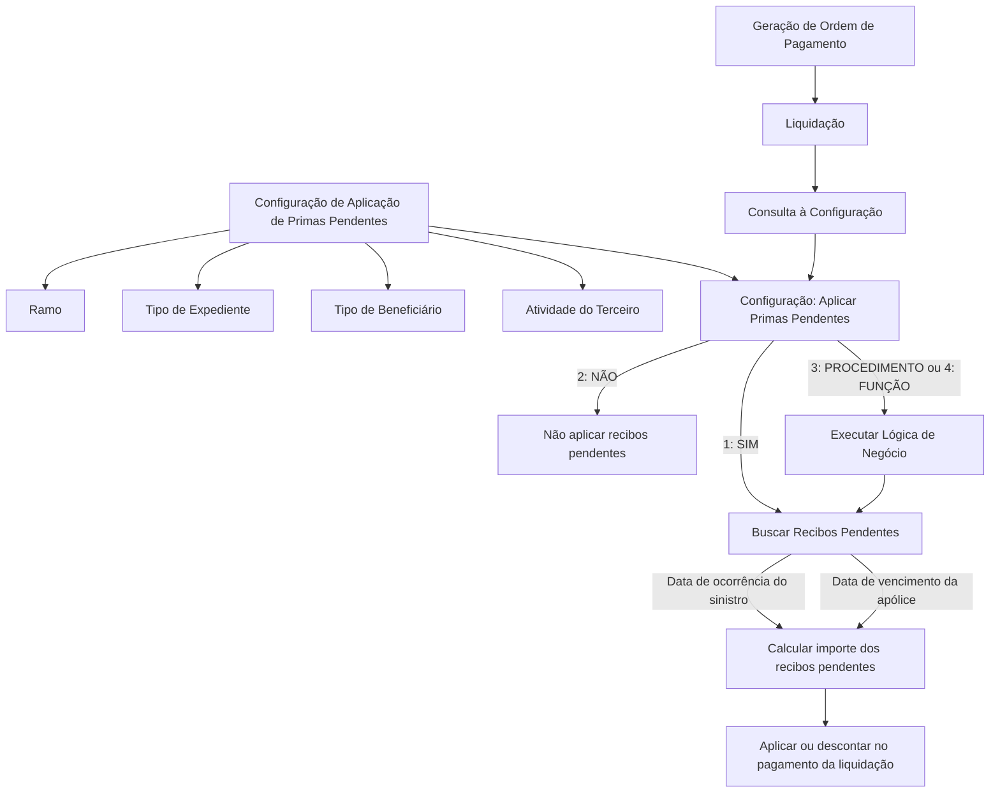

# Definição de Aplicação de Primas Pendentes em Liquidações

## 1. Metadados do Documento
- **Arquivo de Origem:** Não identificado no conteúdo fornecido
- **Tipo de Documento:** Especificação Funcional
- **Domínio / Sistema:** Reef / Mapfre — Aplicação de Primas Pendentes
- **Público-Alvo:** Não identificado; conteúdo orientado à configuração funcional de liquidações
- **Data/Versão Identificada:** Não identificada

---

## 2. Resumo Executivo & Contexto de Negócio

O documento descreve a funcionalidade de **Aplicação de Primas Pendentes** para definições associadas a produtos e liquidações. A finalidade é determinar, para cada combinação de ramo, tipo de expediente, tipo de beneficiário e atividade do terceiro, se recibos pendentes devem ser considerados na geração de uma ordem de pagamento.

Quando houver recibos pendentes, a configuração estabelece se o valor desses recibos deve ser descontado do pagamento da liquidação e de que forma a aplicação deve ocorrer. A decisão pode ser direta — aplicar ou não aplicar — ou depender de lógica de negócio implementada como procedimento ou função.

A busca e o cálculo do importe dos recibos pendentes podem considerar duas referências temporais: a data de ocorrência do sinistro ou a data de vencimento da apólice. Também existe a opção de não aplicar esse critério de busca.

A configuração suporta valores genéricos para ramo e tipo de expediente, possibilitando regras aplicáveis a todos os ramos ou a todos os tipos de expediente. O documento também prevê data de validade e uma propriedade de habilitação do registro para controlar sua utilização nas liquidações.

---

## 3. Arquitetura, Componentes & Tecnologias Envolvidas

O conteúdo não apresenta uma arquitetura técnica de software, contratos de integração, APIs, tecnologias, servidores ou componentes de infraestrutura. O material descreve uma configuração funcional mantida no contexto de **Aplicação de Primas Pendentes**, consultada durante a geração de ordens de pagamento de liquidações.

Componentes e entidades funcionais identificados:

- **Aplicação de Primas Pendentes:** manutenção/configuração que define como tratar recibos pendentes.
- **Produto:** contexto para a definição da regra.
- **Ramo:** chave do ramo ao qual a regra é aplicada; aceita ramo genérico.
- **Tipo de Expediente:** chave do tipo de expediente ou tipo de dano; deve estar previamente associado ao ramo e aceita valor genérico.
- **Tipo de Beneficiário:** tipo de beneficiário da liquidação; os valores são predefinidos pelo sistema.
- **Atividade do Terceiro:** atividade da pessoa física ou jurídica beneficiária da liquidação.
- **Liquidação:** contexto no qual poderá ocorrer desconto de primas pendentes.
- **Ordem de Pagamento:** evento de negócio no qual a existência de recibos pendentes é revisada.
- **Recibos Pendentes:** recibos que podem ser aplicados ou descontados da liquidação.
- **Lógica de Negócio:** função ou procedimento usado quando a decisão de aplicação estiver configurada como procedimento ou função.
- **Sinistro:** referência para a data de ocorrência usada em uma modalidade de busca.
- **Apólice:** referência para a data de vencimento usada em uma modalidade de busca.



> **Nota de Análise:** O documento não detalha métodos HTTP, contratos JSON, estrutura de persistência, implementação da lógica de negócio, mecanismo de busca dos recibos ou a fórmula de cálculo do desconto.

---

## 4. Regras de Negócio, Especificações Funcionais & Processos

### 4.1 Finalidade da configuração

A funcionalidade define, por produto e para cada combinação de tipo de expediente, tipo de beneficiário e código de atividade, se a geração de uma ordem de pagamento deve verificar a existência de recibos pendentes.

Caso existam recibos pendentes, a configuração determina:

1. Se os recibos pendentes são aplicados.
2. Se os recibos pendentes são descontados do pagamento da liquidação.
3. Como os recibos pendentes são buscados.
4. Como o importe dos recibos pendentes é calculado.
5. Se a decisão depende de lógica de negócio configurada como procedimento ou função.

### 4.2 Critérios de segmentação da regra

A regra de Aplicação de Primas Pendentes é definida pelos seguintes critérios:

1. **Ramo:** identifica a chave do ramo para o qual será definida a forma de aplicar ou descontar primas pendentes. O ramo genérico pode ser usado para todos os ramos.
2. **Tipo de Expediente:** identifica a chave do tipo de expediente para o qual será definida a forma de aplicar ou descontar primas pendentes. O tipo de expediente deve estar associado previamente ao ramo. O tipo genérico pode ser usado para todos os tipos de expediente.
3. **Tipo de Beneficiário:** identifica o possível tipo de beneficiário da liquidação que terá primas pendentes descontadas. O tipo de beneficiário representa a atuação da pessoa física ou jurídica na apólice. Os valores são predefinidos pelo sistema.
4. **Atividade do Terceiro:** identifica a atividade da pessoa física ou jurídica beneficiária da liquidação. A atividade representa como essa pessoa intervém na companhia.

### 4.3 Decisão sobre aplicação de recibos pendentes

A propriedade **¿Se aplica las primas pendientes?** determina se um ou mais recibos pendentes são aplicados. Os valores permitidos são:

- **1 — SI:** aplica os recibos pendentes.
- **2 — NO:** não aplica os recibos pendentes.
- **3 — PROCEDIMIENTO:** a decisão é determinada por lógica de negócio configurada como procedimento.
- **4 — FUNCIÓN:** a decisão é determinada por lógica de negócio configurada como função.

Quando o valor configurado for **3 — PROCEDIMIENTO** ou **4 — FUNCIÓN**, a propriedade de lógica de negócio deve conter a função ou o procedimento que determinará se os recibos pendentes são aplicados nas liquidações.

### 4.4 Busca e cálculo de recibos pendentes

A propriedade **¿Cómo se busca la prima de los recibos pendientes?** define como os recibos pendentes são buscados e como o importe dos recibos pendentes será calculado.

Valores permitidos:

1. Aplicar recibos pendentes na **data de ocorrência do sinistro**.
2. Aplicar recibos pendentes na **data de vencimento da apólice**.
3. **NO Aplica:** não aplica esse critério de busca.

### 4.5 Vigência e habilitação

- **Fecha de Validez:** representa a data de validade do registro.
- **Inhabilitado:** indica se o registro está habilitado para uso nas liquidações.

---

## 5. Tabelas de Parâmetros, Ambientes e Estruturas de Dados

| Item / Parâmetro | Descrição / Função | Tipo / Valores / Formato | Ambiente / Observações |
| :--- | :--- | :--- | :--- |
| Ramo | Chave do ramo para o qual é definida a forma de aplicar ou descontar primas pendentes. | Chave de ramo; admite ramo genérico. | O ramo genérico é aplicável a todos os ramos. |
| Tipo de Expediente | Chave do tipo de expediente para o qual é definida a forma de aplicar ou descontar primas pendentes. | Chave de tipo de expediente; admite tipo genérico. | O tipo de expediente deve estar previamente associado ao ramo. O tipo genérico é aplicável a todos os tipos de expediente. |
| Tipo de Beneficiário | Tipo de beneficiário da liquidação ao qual serão descontadas primas pendentes. | Valores predefinidos pelo sistema. | Representa a atuação da pessoa física ou jurídica na apólice. |
| Atividade do Terceiro | Atividade da pessoa física ou jurídica beneficiária da liquidação. | Não detalhado. | Representa como a pessoa intervém na companhia. |
| ¿Se aplica las primas pendientes? | Define se recibos pendentes são aplicados. | `1: SI`; `2: NO`; `3: PROCEDIMIENTO`; `4: FUNCIÓN`. | Os valores 3 e 4 exigem lógica de negócio. |
| Lógica de Negócio que determina se aplica os recibos pendentes nas liquidações | Contém a lógica de negócio usada para decidir a aplicação de recibos pendentes. | Função ou procedimento. | Aplicável somente quando o campo anterior for 3 ou 4. |
| ¿Cómo se busca la prima de los recibos pendientes? | Define como buscar recibos pendentes e calcular o importe correspondente. | `1`: data de ocorrência do sinistro; `2`: data de vencimento da apólice; `3: NO Aplica`. | Não são detalhados algoritmo, fonte de dados ou fórmula de cálculo. |
| Fecha de Validez | Data de validade do registro. | Data; formato não informado. | Controla a validade do registro. |
| Inhabilitado | Indica se o registro está habilitado para utilização nas liquidações. | Indicador; valores não detalhados. | Controla a disponibilidade do registro para uso. |

---

## 6. Bateria de Perguntas & Respostas para RAG (FAQ Sintético)

### P1: Qual é a finalidade da funcionalidade de Aplicação de Primas Pendentes?
**R:** A funcionalidade define, por produto e por combinação de tipo de expediente, tipo de beneficiário e código de atividade, se a geração de uma ordem de pagamento deve revisar a existência de recibos pendentes. Caso existam, a configuração determina se os recibos serão aplicados ou descontados do pagamento da liquidação e como essa aplicação ocorrerá.

### P2: Quais critérios identificam uma regra de aplicação de primas pendentes?
**R:** O documento identifica quatro critérios: ramo, tipo de expediente, tipo de beneficiário e atividade do terceiro. O ramo e o tipo de expediente podem ser genéricos. O tipo de expediente deve estar previamente associado ao ramo.

### P3: O que significa configurar o ramo como genérico?
**R:** O ramo genérico permite que a definição de aplicação ou desconto de primas pendentes seja usada para todos os ramos.

### P4: O que significa configurar o tipo de expediente como genérico?
**R:** O tipo de expediente genérico permite que a definição seja usada para todos os tipos de expediente. O documento também estabelece que os tipos de expediente devem estar associados previamente ao ramo.

### P5: Quais valores são permitidos no campo “¿Se aplica las primas pendientes?”?
**R:** Os valores permitidos são: `1: SI`, para aplicar recibos pendentes; `2: NO`, para não aplicar recibos pendentes; `3: PROCEDIMIENTO`, para determinar a aplicação por procedimento; e `4: FUNCIÓN`, para determinar a aplicação por função.

### P6: Quando a lógica de negócio deve ser informada?
**R:** A lógica de negócio deve ser informada somente quando o campo “¿Se aplica las primas pendientes?” estiver configurado com o valor `3: PROCEDIMIENTO` ou `4: FUNCIÓN`. Nesse caso, a lógica será uma função ou procedimento que determina se os recibos pendentes devem ser aplicados nas liquidações.

### P7: Como a configuração pode buscar os recibos pendentes?
**R:** A busca pode considerar recibos pendentes na data de ocorrência do sinistro, recibos pendentes na data de vencimento da apólice ou a opção `3: NO Aplica`, que indica que esse critério de busca não se aplica.

### P8: O que o campo Tipo de Beneficiário representa?
**R:** O Tipo de Beneficiário representa o possível tipo de beneficiário da liquidação ao qual serão descontadas primas pendentes. O documento informa que esse tipo corresponde à forma como uma pessoa física ou jurídica atua na apólice e que seus valores são predefinidos pelo sistema.

### P9: O que representa a Atividade do Terceiro?
**R:** A Atividade do Terceiro contém a atividade da pessoa física ou jurídica que será beneficiária da liquidação e à qual poderão ser descontadas primas pendentes. Essa atividade representa como a pessoa intervém na companhia.

### P10: Para que serve a Fecha de Validez?
**R:** A Fecha de Validez informa a data de validade do registro de configuração de Aplicação de Primas Pendentes.

### P11: Qual é a finalidade do campo Inhabilitado?
**R:** O campo Inhabilitado indica se o registro está ou não habilitado para ser utilizado nas liquidações.

### P12: O documento informa como é calculado o importe dos recibos pendentes?
**R:** O documento informa que a modalidade de busca será usada para calcular o importe dos recibos pendentes, mas não detalha a fórmula de cálculo, as fontes de dados, a ordem de aplicação dos valores ou o comportamento em casos de múltiplos recibos.

---

## 7. Glossário de Termos, Siglas & Conceitos-Chave

- **Aplicação de Primas Pendentes:** configuração que determina se recibos pendentes são considerados ou descontados em liquidações.
- **Apólice:** contexto em que a pessoa física ou jurídica atua como beneficiária, conforme mencionado no documento.
- **Atividade do Terceiro:** atividade da pessoa física ou jurídica beneficiária da liquidação; representa como a pessoa intervém na companhia.
- **Beneficiário:** pessoa física ou jurídica associada à liquidação e à possível aplicação de primas pendentes.
- **Expediente:** tipo de expediente associado ao ramo; o documento também o relaciona ao tipo de dano.
- **Fecha de Validez:** data de validade do registro.
- **Função:** modalidade de lógica de negócio permitida para determinar a aplicação de recibos pendentes.
- **Inhabilitado:** indicador que determina se o registro pode ser utilizado em liquidações.
- **Liquidação:** contexto no qual recibos pendentes podem ser aplicados ou descontados.
- **Ordem de Pagamento:** evento de negócio no qual é revisada a existência de recibos pendentes.
- **Primas Pendentes:** valores associados a recibos pendentes que podem ser considerados ou descontados no pagamento de uma liquidação.
- **Procedimento:** modalidade de lógica de negócio permitida para determinar a aplicação de recibos pendentes.
- **Ramo:** chave usada para segmentar a definição de aplicação ou desconto de primas pendentes.
- **Recibo Pendente:** recibo cuja aplicação pode ser avaliada na geração de uma ordem de pagamento.
- **Reef:** nome identificado no cabeçalho de documentação fornecido.
- **Sinistro:** evento cuja data de ocorrência pode ser usada como referência para busca de recibos pendentes.

---

## 8. Notas Críticas, Riscos & Limitações

- O conteúdo não identifica o arquivo de origem, data, versão ou autor técnico do documento; apenas apresenta referência a documentação Reef, Mapfredocument e proprietário `user:agonzalez_mapfre.com`.
- O documento não detalha a interface ou imagem mencionada como “Imagen del Mantenimiento de Aplicación de Primas Pendientes”.
- Não são apresentados modelos de dados, nomes de tabelas, campos técnicos, APIs, URLs, ambientes, servidores, permissões ou responsabilidades operacionais.
- Não são especificados os valores possíveis para o indicador **Inhabilitado**.
- Não são especificados o formato da **Fecha de Validez**, o tratamento de períodos de vigência, conflitos entre registros ou critérios de precedência entre valores genéricos e específicos.
- O documento lista função e procedimento como opções de lógica de negócio, mas não detalha assinaturas, localização, implementação ou comportamento dessas lógicas.
- O documento não descreve a fórmula usada para calcular o importe dos recibos pendentes, nem como agir diante de múltiplos recibos pendentes.
- Não há detalhamento sobre exceções, erros, auditoria, rastreabilidade ou comportamento quando não houver configuração aplicável.

---

## 9. Conteúdo Bruto Estruturado (Referência Fiel)

```text
--- [PÁGINA 1 DE 2] ---

Denición Aplicación Primas Pendientes
Objetivo
La nalidad es denir por producto y para cada tipo de Expediente (tipo de daño), tipo de beneciario al que se le va a liquidar y código de
actividad, si cuando vayamos a generar una orden de pago, se revisa si tiene recibos pendientes, y si existen recibos si se descuenta del pago
de la liquidación y cómo.
Imagen del Mantenimiento de Aplicación de Primas Pendientes.:
Propiedades
Ramo
Esta propiedad indica la clave del Ramo al que se le va a denir la manera de aplicar, descontar las primas pendientes. Esta propiedad admite
el ramo genérico, para todos los ramos.
Tipo de Expediente
Esta propiedad será la clave del Tipo de Expediente al que se le va a denir la manera de aplicar, descontar las primas pendientes. Los tipos
de Expedientes tienen que estar asociados al Ramo previamente. Esta propiedad admite el tipo de expediente genérico, para todos los tipos
de expedientes.
Tipo de Beneciario
Esta propiedad contiene el posible tipo beneciario de la liquidación al que se le va a descontar las primas pendientes. El tipo de Beneciario
es como actúa la persona física o jurídica en la póliza. Los valores que puede contener este atributo están prejados por el sistema.
Activad del Tercero
Ejemplo:
Documentation / DOCUMENTACIÓN Reef
DOCUMENTACIÓN Reef
Mapfredocument
DOCUMENTACIÓN Reef
Owner
user:agonzalez_mapfre.com
Lifecycle
Approved Source
 /
 VL
Buscar Inicio Soluciones Arquitecturas APIs Componentes Cloud Documentación Zeus Reef Ayuda
ES


--- [PÁGINA 2 DE 2] ---

Esta propiedad contiene la actividad de la persona física o jurídica que será el beneciario de la liquidación, al que se le va a descontar las
primas pendientes. Esta actividad es como interviene esa persona en la compañía,.....
¿Se aplica las primas pendientes?
Si se aplica el o los recibos pendientes o no se aplica. Este campo puede tener los siguientes valores.
1: SI
2: NO
3: PROCEDIMIENTO
4: FUNCIÓN
Lógica de Negocio que determina si aplica los recibos pendientes en las liquidaciones
Esta propiedad contendrá Lógica de Negocio, será Función o Procedimiento dependiendo del campo anterior, sólo si es 3 o 4.
¿Cómo se busca la prima de los recibos pendientes?
Esta propiedad contiene como se van a buscar los recibos pendientes y se calculará el importe de los recibos pendientes:
1: Se aplicará a los recibos Pendientes a la Fecha de ocurrencia del siniestro
2: Se aplicará a los recibos Pendientes a la fecha de vencimiento de la póliza
3: NO Aplica
Fecha de Validez
Fecha de validez del registro.
Inhabilitado
Esta propiedad indica si el registro está o no habilitado para ser utilizado en las liquidaciones.
```
