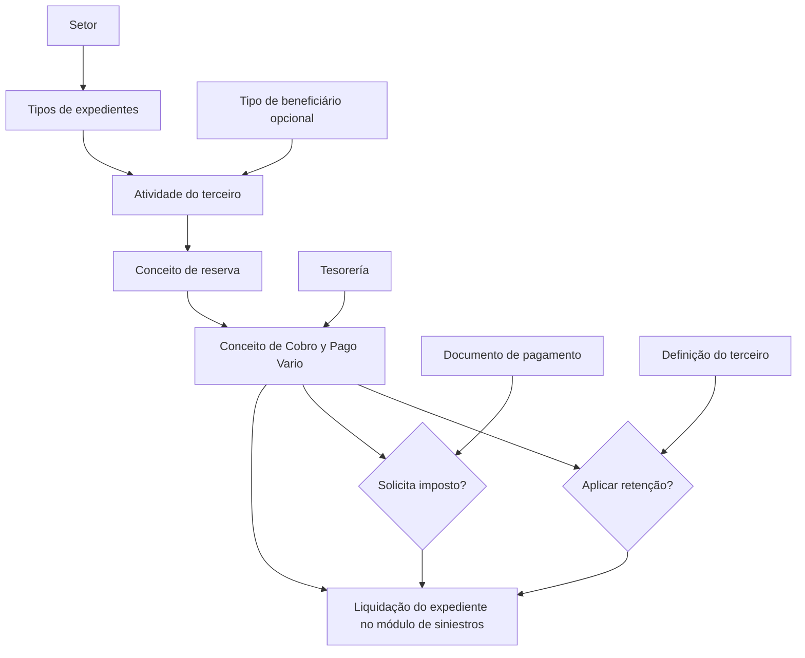

# Definição de Conceitos de Cobro e Pago Vario por Atividade de Terceiro

## 1. Metadados do Documento
- **Arquivo de Origem:** Não identificado no conteúdo fornecido
- **Tipo de Documento:** Manual Operacional / Especificação Funcional
- **Domínio / Sistema:** Reef — módulo de siniestros, tesorería e liquidações de expedientes
- **Público-Alvo:** Negócio, analistas funcionais, operação e desenvolvedores
- **Data/Versão Identificada:** Não identificada
- **Proprietário identificado:** `user:agonzalez_mapfre.com`
- **Lifecycle identificado:** Approved Source / VL

---

## 2. Resumo Executivo & Contexto de Negócio

O documento descreve a manutenção de definições de **Conceitos de Cobro e Pago Vario por Atividade de Terceiro**. Essa manutenção determina quais conceitos financeiros podem ser usados para pagar ou cobrar valores de pessoas físicas, pessoas jurídicas, beneficiários e fornecedores envolvidos em um expediente.

O objetivo é viabilizar a geração de ordens de pagamento, também chamadas de liquidações de expedientes. Para isso, o módulo de siniestros deve conhecer quais atividades de terceiros podem receber ou originar cobranças, quais conceitos de reserva se aplicam e quais conceitos de cobro e pago vario podem ser utilizados em cada cenário.

A configuração estabelece a relação entre setor, tipo de beneficiário, atividade do terceiro, conceito de reserva e conceito de cobro e pago vario. Os conceitos de cobro e pago vario representam o detalhe pelo qual um beneficiário será pago na liquidação e são definidos em tesorería.

Os impostos e/ou retenções associados aos conceitos financeiros não são aplicados de forma isolada. A solicitação de impostos e retenções depende do conceito de cobro e pago vario, do documento de pagamento utilizado e da configuração do terceiro beneficiário. O documento explicita regras de precedência para documentos de pagamento e para a configuração do terceiro.

---

## 3. Arquitetura, Componentes & Tecnologias Envolvidas

### Componentes e domínios identificados

| Componente / Domínio | Papel identificado no documento |
| :--- | :--- |
| **Reef** | Sistema ou domínio documental no qual está publicada a documentação. |
| **Módulo de siniestros** | Módulo que utiliza as definições para pagar ou cobrar valores em liquidações. |
| **Tesorería** | Domínio responsável pela definição dos conceitos de cobro e pago vario utilizados em siniestros. |
| **Expedientes** | Entidades para as quais são geradas ordens de pagamento ou liquidações. |
| **Liquidaciones** | Processo de pagamento ou cobrança de beneficiários de um expediente. |
| **Terceros** | Pessoas físicas ou jurídicas que participam na apólice ou atuam para a companhia. |
| **Tabla de documentos de Pago** | Estrutura que define, entre outras regras, se um documento de pagamento solicita imposto. |
| **Conceitos de reserva** | Conceitos aos quais são associados os conceitos de cobro e pago vario. |
| **Conceitos de Cobro y Pago Vario** | Detalhamento do pagamento ou cobrança destinado ao beneficiário de uma liquidação. |

### Fluxo funcional de configuração e liquidação



### Relações arquiteturais e funcionais

- O **setor** identifica o grupo de tipos de expedientes aos quais serão associadas atividades e conceitos.
- A **atividade do terceiro** identifica a forma pela qual uma pessoa física ou jurídica intervém na companhia, como assegurado, oficina ou perito.
- Um **conceito de reserva** é associado a conceitos de cobro e pago vario.
- Os conceitos de cobro e pago vario disponíveis para siniestros são definidos em **tesorería**.
- A liquidação usa a configuração para determinar pagamentos ou cobranças aplicáveis ao beneficiário.
- A aplicação de impostos depende também do documento de pagamento.
- A aplicação de retenções depende da definição do terceiro, mesmo que o conceito de pagamento possua retenções configuradas.

---

## 4. Regras de Negócio, Especificações Funcionais & Processos

### Objetivo da definição

Para gerar ordens de pagamento, ou liquidações de expedientes, é necessário definir os conceitos de cobro e pago vario que podem ser utilizados para pagar afetados ou fornecedores que tenham intervindo no expediente.

A finalidade da configuração é definir:

1. Quais atividades podem receber pagamentos ou cobranças a partir do módulo de siniestros.
2. Quais conceitos de reserva podem ser utilizados.
3. Quais conceitos de cobro e pago vario podem ser utilizados para pagar ou cobrar o beneficiário de uma liquidação.

### Regras para setor

- A propriedade **Sector** indica a chave do setor ao qual pertencem os tipos de expedientes.
- Os tipos de expedientes associados ao setor receberão associações com atividades.
- Os tipos de expedientes associados ao setor receberão associações com conceitos de reserva.
- Os tipos de expedientes associados ao setor receberão associações com conceitos de cobro e pago vario utilizáveis em liquidações.

### Regras para tipo de beneficiário

- A propriedade **Tipo de Beneficiario** é opcional.
- A propriedade Tipo de Beneficiario só deve receber informação quando a atividade configurada corresponder a uma pessoa física ou jurídica que intervenha na apólice.
- Os valores permitidos para Tipo de Beneficiario são pré-definidos pelo sistema.
- O documento não apresenta a lista de valores pré-definidos pelo sistema.

### Regras para atividade do terceiro

- A propriedade **Actividad del tercero** contém a atividade dos possíveis beneficiários da liquidação.
- A atividade representa a forma de intervenção da pessoa física ou jurídica na companhia.
- Exemplos fornecidos pelo documento:
  - Asegurado.
  - Taller.
  - Perito.

### Regras para conceito de reserva

- A propriedade **Concepto de reserva** contém a chave do conceito de reserva ao qual serão associados os conceitos de cobro e pago vario.
- Normalmente, assegurados e beneficiários serão pagos por conceitos de indenização.
- Normalmente, fornecedores serão pagos por conceitos de honorários e gastos.
- O conceito aplicável ao fornecedor está relacionado à atividade desenvolvida pelo fornecedor para a companhia.

### Regras para conceito de cobro e pago vario

- A propriedade **Concepto de Cobro y Pago Vario** representa o detalhe pelo qual o beneficiário da liquidação será pago.
- Os conceitos utilizáveis em siniestros são definidos em tesorería.
- Aos conceitos de cobro e pago vario também são associados impostos e/ou retenções.
- A solicitação de impostos e/ou retenções depende:
  1. Do conceito de cobro e pago vario.
  2. Do documento que está sendo pago.
  3. Do destinatário do pagamento.

### Regra de associação de um conceito a múltiplas atividades

- O mesmo conceito de pagamento pode ser associado a várias atividades.
- Não há, no conteúdo fornecido, uma restrição que limite um conceito de pagamento a uma única atividade.

### Regra de precedência para impostos

- Quando um conceito possui imposto configurado, mas o documento de pagamento está definido para não solicitar imposto, prevalece a definição do documento de pagamento.
- Exemplo fornecido:
  - Um conceito possui imposto configurado.
  - O documento utilizado é `RE` — Reembolso.
  - A tabela de documentos de pagamento define que o documento `RE` não solicita imposto.
  - Resultado: o imposto não é solicitado.

### Regra de precedência para retenções

- Um conceito de pagamento pode possuir retenções configuradas.
- A retenção será aplicada conforme a definição existente no terceiro.
- A definição do terceiro prevalece sobre a configuração de retenções do conceito de cobro e pago vario.
- Portanto, se o terceiro estiver definido para não sofrer retenção, a configuração de retenções do conceito não deve prevalecer.

### Regra de habilitação

- A propriedade **Inhabilitado** indica se o registro está habilitado ou não para utilização nas liquidações.
- O documento não detalha valores permitidos, comportamento de interface ou tratamento operacional de registros inabilitados.

---

## 5. Tabelas de Parâmetros, Ambientes e Estruturas de Dados

| Item / Parâmetro | Descrição / Função | Tipo / Valores / Formato | Ambiente / Observações |
| :--- | :--- | :--- | :--- |
| **Sector** | Indica a chave do setor ao qual pertencem os tipos de expedientes. | Chave de setor; formato não especificado. | Usado para associar atividades, conceitos de reserva e conceitos de cobro e pago vario aos expedientes. |
| **Tipo de Beneficiario** | Identifica o tipo de beneficiário quando a atividade pertence a uma pessoa física ou jurídica interveniente na apólice. | Opcional; valores pré-definidos pelo sistema. | A lista dos valores não é apresentada no documento. |
| **Actividad del tercero** | Identifica a atividade dos possíveis beneficiários da liquidação. | Exemplos: asegurado, taller, perito. | Expressa como a pessoa física ou jurídica intervém na companhia. |
| **Concepto de reserva** | Contém a chave do conceito de reserva associado aos conceitos de cobro e pago vario. | Chave; formato não especificado. | Assegurados e beneficiários normalmente usam indenização; fornecedores normalmente usam honorários e gastos. |
| **Concepto de Cobro y Pago Vario** | Detalha o motivo pelo qual o beneficiário será pago ou cobrado. | Conceito definido em tesorería; formato não especificado. | Pode possuir impostos e/ou retenções associados. |
| **Inhabilitado** | Determina se o registro pode ser usado nas liquidações. | Estado de habilitação; valores não especificados. | Sem detalhamento adicional sobre o comportamento da funcionalidade. |
| **Impuestos** | Tributos associados aos conceitos de cobro e pago vario. | Não especificado. | A necessidade de solicitação depende do conceito e do documento de pagamento. O documento de pagamento prevalece em caso de conflito. |
| **Retenciones** | Retenções associadas aos conceitos de cobro e pago vario. | Não especificado. | A definição do terceiro prevalece sobre a configuração de retenção do conceito. |
| **Documento de pago `RE`** | Documento de pagamento exemplificado como reembolso. | `RE` — Reembolso. | No exemplo, não solicita imposto quando assim definido na tabela de documentos de pagamento. |
| **Tabla de documentos de Pago** | Define regras do documento de pagamento, incluindo a solicitação de impostos. | Estrutura não detalhada. | A definição do documento prevalece sobre a definição de imposto do conceito. |

---

## 6. Bateria de Perguntas & Respostas para RAG (FAQ Sintético)

### P1: Qual é o objetivo da definição de conceitos de cobro e pago vario por atividade de terceiro?
**R:** O objetivo é definir os conceitos de cobro e pago vario que podem ser usados para gerar ordens de pagamento, ou liquidações de expedientes, destinadas a afetados ou fornecedores que tenham intervindo no expediente.

### P2: Qual módulo utiliza as definições de atividades, reservas e conceitos de pagamento?
**R:** O módulo de siniestros utiliza essas definições para determinar quais atividades podem receber pagamentos ou cobranças, quais conceitos de reserva se aplicam e quais conceitos de cobro e pago vario podem ser usados nas liquidações.

### P3: Qual é a função da propriedade Sector?
**R:** A propriedade Sector indica a chave do setor ao qual pertencem os tipos de expedientes. Para esses tipos de expedientes, são associadas atividades, conceitos de reserva e conceitos de cobro e pago vario utilizáveis nas liquidações.

### P4: Quando a propriedade Tipo de Beneficiario deve ser preenchida?
**R:** Tipo de Beneficiario é uma propriedade opcional. Ela só deve ser preenchida quando a atividade configurada corresponder a uma pessoa física ou jurídica que intervenha na apólice. Seus valores são pré-definidos pelo sistema, mas o documento não apresenta essa lista.

### P5: O que representa a Actividad del tercero?
**R:** Actividad del tercero representa a atividade dos possíveis beneficiários da liquidação, isto é, a forma pela qual uma pessoa física ou jurídica intervém na companhia. O documento cita assegurado, oficina e perito como exemplos.

### P6: Como os conceitos de reserva se relacionam com segurados, beneficiários e fornecedores?
**R:** O conceito de reserva é a chave à qual são associados os conceitos de cobro e pago vario. Normalmente, assegurados e beneficiários são pagos por conceitos de indenização, enquanto fornecedores são pagos por conceitos de honorários e gastos relacionados à atividade que desenvolveram para a companhia.

### P7: Onde são definidos os conceitos de cobro e pago vario utilizados em siniestros?
**R:** Os conceitos de cobro e pago vario que podem ser utilizados em siniestros são definidos em tesorería.

### P8: Um mesmo conceito de pagamento pode ser associado a várias atividades de terceiros?
**R:** Sim. O documento declara explicitamente que o mesmo conceito de pagamento pode ser associado a várias atividades.

### P9: Quando um conceito possui imposto configurado, mas o documento de pagamento não solicita imposto, qual regra prevalece?
**R:** Prevalece a definição do documento de pagamento. O documento exemplifica o uso de um documento `RE` — Reembolso: mesmo que o conceito tenha imposto configurado, o imposto não será solicitado se a tabela de documentos de pagamento definir que `RE` não solicita imposto.

### P10: As retenções configuradas em um conceito de pagamento sempre são aplicadas?
**R:** Não. Embora o conceito de pagamento possua retenções configuradas, a aplicação depende da definição do terceiro. A definição do terceiro prevalece sobre a definição de retenções do conceito de cobro e pago vario.

### P11: O que controla a propriedade Inhabilitado?
**R:** A propriedade Inhabilitado indica se o registro está ou não habilitado para ser utilizado nas liquidações. O documento não detalha os valores possíveis nem o comportamento operacional de registros inabilitados.

### P12: De quais fatores depende a solicitação de impostos e/ou retenções?
**R:** A solicitação de impostos e/ou retenções depende do conceito de cobro e pago vario, do documento que está sendo pago e do destinatário do pagamento. Para impostos, a definição do documento de pagamento prevalece em caso de conflito; para retenções, prevalece a definição do terceiro.

---

## 7. Glossário de Termos, Siglas & Conceitos-Chave

- **Actividad del tercero:** Atividade do possível beneficiário da liquidação; representa a forma de intervenção da pessoa física ou jurídica na companhia.
- **Asegurado:** Exemplo de atividade de terceiro citado pelo documento.
- **Beneficiario:** Destinatário de pagamento ou cobrança em uma liquidação.
- **Cobro:** Cobrança vinculada a um conceito financeiro utilizável no módulo de siniestros.
- **Concepto de Cobro y Pago Vario:** Detalhe pelo qual o beneficiário de uma liquidação será pago ou cobrado.
- **Concepto de reserva:** Chave de conceito de reserva à qual são associados conceitos de cobro e pago vario.
- **Expediente:** Entidade para a qual podem ser geradas ordens de pagamento ou liquidações.
- **Inhabilitado:** Propriedade que indica se um registro está habilitado para utilização em liquidações.
- **Liquidación:** Processo ou resultado de pagamento/cobrança relacionado a um expediente.
- **Pago:** Pagamento realizado ao beneficiário de uma liquidação.
- **Perito:** Exemplo de atividade de terceiro citado pelo documento.
- **RE:** Código exemplificado para documento de pagamento de reembolso.
- **Reembolso:** Tipo de documento de pagamento associado ao código `RE` no exemplo apresentado.
- **Retenciones:** Retenções associáveis a conceitos de cobro e pago vario, cuja aplicação depende da definição do terceiro.
- **Sector:** Chave que identifica o setor ao qual pertencem determinados tipos de expedientes.
- **Siniestros:** Módulo que permite pagar ou cobrar beneficiários em liquidações.
- **Taller:** Exemplo de atividade de terceiro citado pelo documento.
- **Tesorería:** Domínio no qual são definidos os conceitos de cobro e pago vario usados em siniestros.
- **Tipo de Beneficiario:** Propriedade opcional, com valores pré-definidos pelo sistema, usada em atividades de pessoas físicas ou jurídicas intervenientes na apólice.

---

## 8. Notas Críticas, Riscos & Limitações

- **Nota de Análise:** O documento menciona o módulo de siniestros e tesorería, mas não detalha arquitetura técnica, integrações, APIs, contratos JSON, métodos HTTP, base de dados, servidores, URLs ou ambientes.
- **Nota de Análise:** Os valores pré-definidos para **Tipo de Beneficiario** não são apresentados.
- **Nota de Análise:** O documento não fornece os formatos técnicos das chaves de setor, conceitos de reserva ou conceitos de cobro e pago vario.
- **Risco operacional:** A regra de impostos exige que a configuração do documento de pagamento seja considerada, pois ela prevalece sobre a existência de imposto no conceito financeiro.
- **Risco operacional:** A regra de retenções exige consulta à configuração do terceiro, pois ela prevalece sobre as retenções definidas no conceito de cobro e pago vario.
- **Limitação documental:** A propriedade **Inhabilitado** é descrita apenas como indicador de uso em liquidações; não há detalhamento de valores, permissões, auditoria ou comportamento de bloqueio.
- **Limitação documental:** O trecho fornecido termina após o cabeçalho `Ejemplo:` referente à questão sobre retenções; o exemplo correspondente não está presente no conteúdo bruto.

---

## 9. Conteúdo Bruto Estruturado (Referência Fiel)

```text
--- [PÁGINA 1 DE 2] ---

Denición Conceptos de Pago por Actividad de Tercero
Objetivo
Para poder generar órdenes de pago (liquidaciones de expedientes) , se tiene que denir qué Conceptos de Cobro y Pago Vario va a poder
utilizarse para pagar a afectados o proveedores que hayan intervenido en el expediente.
La nalidad es denir a qué actividades se pueden pagar o cobrar desde el módulo de siniestros y qué conceptos de reserva y Conceptos de
Cobro y Pago se pueden utilizar para pagar o cobrar al beneciario de la liquidación.
Imagen del Mantenimiento Deniciones de Concepto de Cobro y Pago Vario por Actividad:
Propiedades
Sector
Ejemplo:
Documentation / DOCUMENTACIÓN Reef
DOCUMENTACIÓN Reef
Mapfredocument
DOCUMENTACIÓN Reef
Owner
user:agonzalez_mapfre.com
Lifecycle
Approved Source
 /
VL
Buscar Inicio Soluciones Arquitecturas APIs Componentes Cloud Documentación Zeus Reef Ayuda
ES


--- [PÁGINA 2 DE 2] ---

Esta propiedad indica la clave del Sector al que pertenecen los tipos de expedientes, a los que se les va a asociar las actividades y los
conceptos de Reserva y Cobro y Pago Vario que se van a poder utilizar en las liquidaciones.
Tipo de Beneciario
Esta propiedad es opcional, sólo se introducirá información en el caso de que la actividad a la que se le están deniendo conceptos, sea una
persona física o jurídica que intervenga en la póliza. Los valores que puede contener esta propiedad están prejados por el sistema.
Actividad del tercero
Esta propiedad contendrá la actividad de los posibles beneciarios de la liquidación, es la forma en la que interviene la persona física o
jurídica en la compañía, como asegurado, como taller, como perito, etc.
Concepto de reserva
Esta propiedad contendrá la clave del concepto de reserva al que se va a asociar los distintos conceptos de cobro y pago vario. Normalmente
a los asegurados y beneciarios se les va a pagar por conceptos de indemnización, a los proveedores se les va a pagar por conceptos de
honorarios y gastos, es decir por la actividad que ha desarrollado para la compañía.
Concepto de Cobro y Pago Vario
Los conceptos de cobro y pago vario son el detalle por el que se le va a pagar al beneciario de la liquidación. Los conceptos que se pueden
utilizar en siniestros, se denen en tesorería. A estos conceptos de cobro y pago vario, también se le asocian los impuestos y/o retenciones.
Los impuestos y/o retenciones se van a pedir en función del concepto de cobro y pago vario, en función del documento que se esté pagando
y en función de a quién se le esté pagando.
Inhabilitado
Esta propiedad indica si el registro está o no habilitado para ser utilizado en las liquidaciones.
Preguntas frecuentes
¿Se le puede asociar un concepto pago a varias actividades?
R/ Si, se puede asociar el mismo concepto a varias actividades.
¿Si un concepto tiene denido impuestos y el documento de pago está denido que no pide impuestos, que es lo que prima?
R/ En este caso prima el documento de pago.
Ejemplo:
Si se usa un concepto que tiene denido impuesto y el documento que se utiliza, por ejemplo, es un 'RE'-Reembolso y está denido en la
tabla de documentos de Pago que no se pide el Impuesto, no se pide.
¿Si un concepto tiene denido retenciones se van a aplicar aunque el tercero tiene denido que no se le retenga?
R/ Aunque el concepto de pago tenga denido retenciones, esta se va a aplicar dependiendo de lo que tenga denido el tercero. Prima la
denición del tercero, por encima del concepto de cobro y pago vario.
Ejemplo:
```
