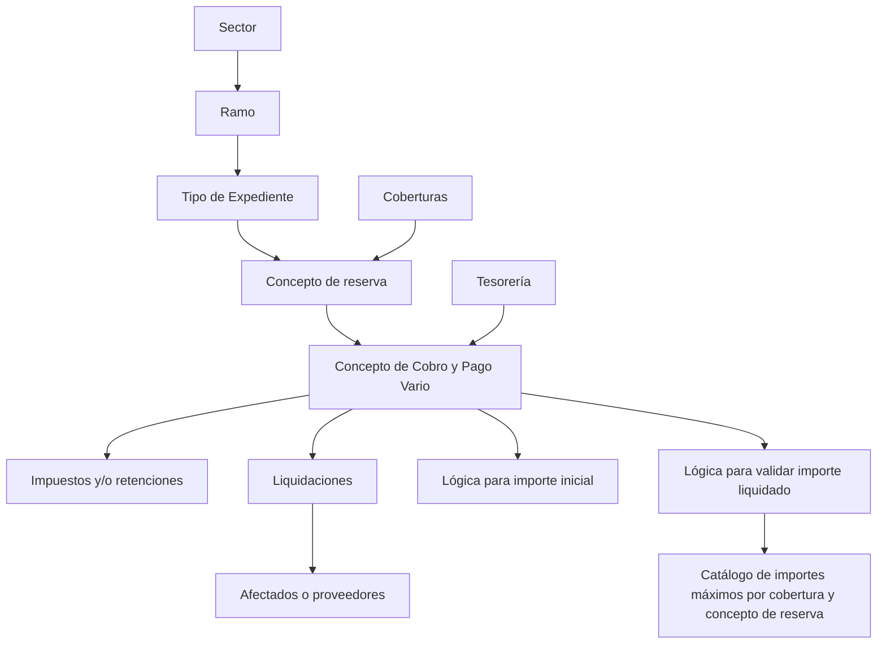
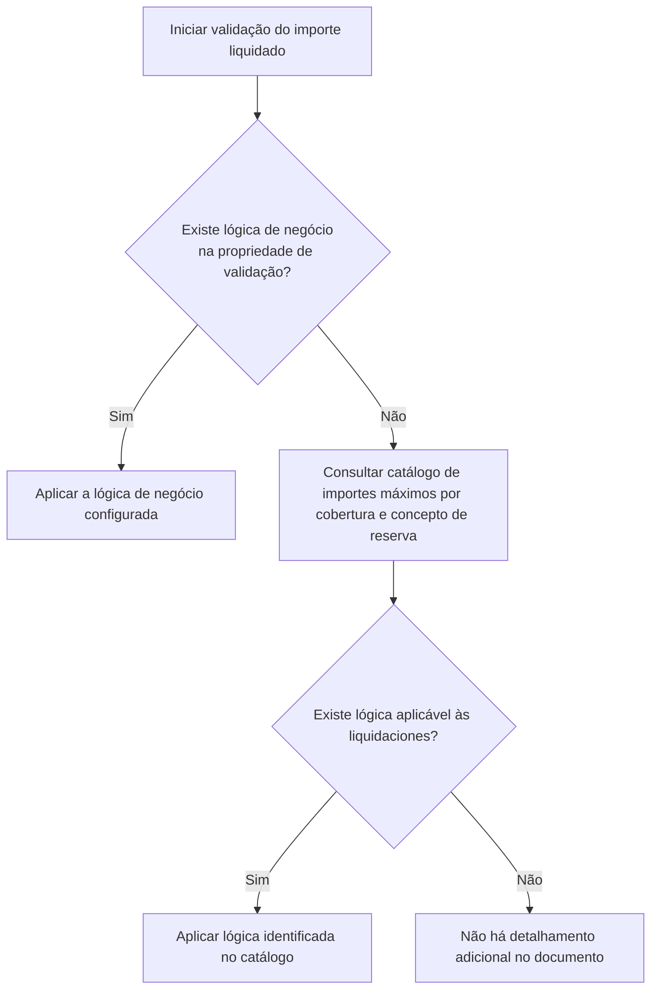

# Definição de Conceitos de Cobro e Pago Vario por Tipo de Expediente

## 1. Metadados do Documento
- **Arquivo de Origem:** Não informado; conteúdo extraído de documentação Reef.
- **Tipo de Documento:** Especificação Funcional / Manual de Configuração.
- **Domínio / Sistema:** Reef / Siniestros / Tesorería.
- **Público-Alvo:** Analistas funcionais, desenvolvedores, equipas de tesouraria e operação de sinistros.
- **Data/Versão Identificada:** Não identificada.
- **Owner identificado:** `user:agonzalez_mapfre.com`
- **Lifecycle identificado:** `Approved`

---

## 2. Resumo Executivo & Contexto de Negócio

O documento descreve a definição dos **Conceitos de Cobro e Pago Vario** aplicáveis a cada **Tipo de Expediente** no contexto de sinistros. Esta configuração é realizada após a associação prévia dos Tipos de Expediente a um Ramo e após a definição das Coberturas e dos conceitos de reserva.

A finalidade da manutenção é determinar quais conceitos podem ser usados para gerar liquidações relacionadas a um determinado tipo de dano. Os conceitos configurados permitem efetuar pagamentos a afetados ou fornecedores envolvidos no expediente, bem como realizar cobranças quando aplicável.

A configuração é estabelecida por combinação de Sector, Ramo, Tipo de Expediente e Concepto de reserva. Para cada Concepto de reserva associado previamente ao Tipo de Expediente, podem ser associados um ou mais Conceitos de Cobro e Pago Vario.

Os Conceitos de Cobro e Pago Vario representam o detalhe pelo qual o beneficiário recebe uma liquidação. Os conceitos utilizáveis em sinistros são definidos em Tesorería e também possuem associação com impostos e/ou retenções. A solicitação de impostos e retenções depende do conceito selecionado, do documento que está sendo pago e do destinatário do pagamento.

O documento também prevê regras técnicas opcionais: uma lógica para obter o valor inicial de um conceito e uma lógica para validar o valor liquidado contra limites máximos. Quando não houver regra de validação diretamente configurada, deve-se consultar o catálogo de importes máximos por cobertura e concepto de reserva.

---

## 3. Arquitetura, Componentes & Tecnologias Envolvidas

### Componentes e entidades identificados

| Componente / Entidade | Papel identificado no documento |
| :--- | :--- |
| Reef | Plataforma ou domínio documental onde a manutenção é descrita. |
| Siniestros | Contexto de negócio no qual os Conceitos de Cobro e Pago Vario podem ser utilizados. |
| Tesorería | Área onde são definidos os conceitos utilizáveis em sinistros. |
| Sector | Chave do setor ao qual pertencem os Tipos de Expediente. |
| Ramo | Chave do ramo ao qual pertencem os Tipos de Expediente. |
| Tipo de Expediente | Chave do tipo de expediente ao qual são associados conceitos de cobro e pago vario. |
| Concepto de reserva | Chave de reserva à qual se associam conceitos de cobro e pago vario. |
| Concepto de Cobro y Pago Vario | Detalhe utilizado para pagar o beneficiário de uma liquidação ou realizar uma cobrança. |
| Coberturas | Elementos definidos antes da configuração dos conceitos de cobro e pago vario. |
| Catálogo de importes máximos por cobertura y concepto de reserva | Fonte alternativa de lógica de negócio para validar limites de valores liquidados. |
| Impuestos y/o retenciones | Dados associados aos conceitos de cobro e pago vario e solicitados conforme regras de pagamento. |
| Liquidaciones | Operação que utiliza os conceitos configurados para pagar afetados ou fornecedores. |

### Fluxo de associação e utilização



### Dependências funcionais obrigatórias

1. Os Tipos de Expediente devem estar associados previamente ao Ramo.
2. O Concepto de reserva deve estar associado previamente ao Tipo de Expediente.
3. Os conceitos utilizáveis em sinistros são definidos em Tesorería.
4. A validação do valor liquidado pode depender de lógica configurada diretamente ou do catálogo de importes máximos por cobertura e concepto de reserva.

> **Nota de Análise:** O documento não detalha tecnologias de implementação, interfaces, APIs, contratos HTTP, modelos de dados físicos, servidores, ambientes ou rotas de integração.

---

## 4. Regras de Negócio, Especificações Funcionais & Processos

### 4.1 Objetivo da configuração

Após associar os Tipos de Expediente ao Ramo e definir Coberturas e conceitos de reserva, é necessário definir os Conceitos de Cobro e Pago Vario quando se pretende gerar liquidações para aquele Tipo de Daño.

Devem ser definidos:

- Todos os conceitos de pagamento necessários para pagar afetados.
- Todos os conceitos de pagamento necessários para pagar fornecedores que tenham participado no expediente.
- Os conceitos de cobrança necessários para permitir cobranças.
- Os conceitos aplicáveis a cada combinação de Tipo de Expediente e Concepto de reserva.

### 4.2 Hierarquia de associação

A manutenção utiliza uma hierarquia de associação:

1. Identificar o **Sector**.
2. Identificar o **Ramo** pertencente ao Sector.
3. Selecionar o **Tipo de Expediente**, previamente associado ao Ramo.
4. Selecionar o **Concepto de reserva**, previamente associado ao Tipo de Expediente.
5. Associar um ou vários **Conceptos de Cobro y Pago Vario** ao Concepto de reserva.
6. Configurar, quando aplicável:
   - lógica de negócio para valor inicial;
   - lógica de negócio para validação de valor liquidado;
   - estado de habilitação do registro.

### 4.3 Conceito de Cobro y Pago Vario

O Concepto de Cobro y Pago Vario corresponde ao detalhe pelo qual será efetuado o pagamento ao beneficiário da liquidação. Esses conceitos podem ser utilizados em sinistros quando tiverem sido definidos em Tesorería.

Os conceitos possuem associação com impostos e/ou retenções. A necessidade de solicitar impostos e/ou retenções é determinada por três fatores:

1. O Concepto de Cobro y Pago Vario.
2. O documento que está sendo pago.
3. A pessoa ou entidade a quem o pagamento está sendo realizado.

### 4.4 Regra para valor inicial

A propriedade de lógica de negócio para valor inicial contém a regra que obtém o valor do importe inicial do Concepto de Cobro y Pago Vario, desde que esse conceito possua importe inicial.

> **Nota de Análise:** O documento indica a existência desta lógica de negócio, mas não descreve a regra, fórmula, critérios de seleção, entradas ou saídas técnicas.

### 4.5 Regra para validação de valor liquidado

A propriedade de lógica de negócio para validação do importe liquidado controla que o valor liquidado não ultrapasse um limite, isto é, controla o valor máximo que pode ser liquidado.

A regra de decisão é:



### 4.6 Estado de habilitação

A propriedade **Inhabilitado** informa se o registro está habilitado ou não para ser utilizado nas liquidações.

### 4.7 Cardinalidade dos conceitos

Um Concepto de Cobro y Pago Vario pode ser associado a vários Tipos de Expediente.

- Cardinalidade explicitamente indicada: **1 a n Tipos de Expediente**.

---

## 5. Tabelas de Parâmetros, Ambientes e Estruturas de Dados

| Item / Parâmetro | Descrição / Função | Tipo / Valores / Formato | Ambiente / Observações |
| :--- | :--- | :--- | :--- |
| Sector | Indica a chave do setor ao qual pertencem os Tipos de Expediente que receberão associação de conceitos. | Chave de Sector. | O formato da chave não é detalhado. |
| Ramo | Indica a chave do ramo ao qual pertencem os Tipos de Expediente. | Chave de Ramo. | O Tipo de Expediente deve estar previamente associado ao Ramo. |
| Tipo de Expediente | Identifica o tipo de expediente ao qual serão associados um ou vários conceitos de cobro e pago vario. | Chave de Tipo de Expediente. | Associado previamente ao Ramo. |
| Concepto de reserva | Identifica o conceito de reserva que receberá associação dos conceitos de cobro e pago vario. | Chave de Concepto de reserva. | Deve estar previamente associado ao Tipo de Expediente. |
| Concepto de Cobro y Pago Vario | Detalhe pelo qual o beneficiário de uma liquidação recebe pagamento; também pode suportar cobrança. | Um ou mais conceitos por Concepto de reserva. | Definido em Tesorería para utilização em sinistros. |
| Impuestos y/o retenciones | Impostos e/ou retenções associados aos conceitos de cobro e pago vario. | Não detalhado. | Solicitados conforme conceito, documento pago e destinatário do pagamento. |
| Lógica de negocio para traer valor del importe inicial | Obtém o valor do importe inicial do Concepto de Cobro y Pago Vario. | Lógica de negócio; detalhe técnico não informado. | Aplicável quando o conceito possui importe inicial. |
| Lógica de negocio para validar importe liquidado | Valida que o valor liquidado não ultrapasse um limite. | Lógica de negócio; detalhe técnico não informado. | Controla o importe máximo liquidável. |
| Catálogo de importes máximos por cobertura y concepto de reserva | Fonte alternativa para identificar uma lógica aplicável às liquidações. | Catálogo; estrutura não detalhada. | Consultado quando não existe lógica na propriedade de validação. |
| Inhabilitado | Indica se o registro pode ser utilizado nas liquidações. | Estado habilitado ou não habilitado; valores literais não informados. | Afeta a utilização do registro em liquidações. |
| Owner | Proprietário exibido na documentação. | `user:agonzalez_mapfre.com` | Metadado da página documental. |
| Lifecycle | Estado do ciclo de vida exibido na documentação. | `Approved` | Metadado da página documental. |

> **Nota de Análise:** O documento não apresenta URLs de ambientes, servidores, portas, caminhos de logs, variáveis de configuração, esquemas JSON ou estruturas de tabelas físicas.

---

## 6. Bateria de Perguntas & Respostas para RAG (FAQ Sintético)

### P1: Qual é a finalidade da definição de Conceitos de Cobro e Pago Vario por Tipo de Expediente?
**R:** A finalidade é definir, para cada Tipo de Expediente e Concepto de reserva, quais Conceitos de Cobro e Pago Vario podem ser utilizados nas liquidações. Essa definição permite pagar afetados ou fornecedores envolvidos no expediente e utilizar conceitos de cobrança quando necessário.

### P2: Em que momento os Conceitos de Cobro e Pago Vario devem ser configurados?
**R:** Os Conceitos de Cobro e Pago Vario devem ser configurados depois que os Tipos de Expediente tiverem sido associados ao Ramo e depois que Coberturas e conceitos de reserva tiverem sido definidos.

### P3: Quais pré-requisitos existem para associar um Concepto de Cobro y Pago Vario?
**R:** O Tipo de Expediente precisa estar previamente associado ao Ramo. Além disso, o Concepto de reserva precisa estar previamente associado ao Tipo de Expediente. Somente então os Conceitos de Cobro y Pago Vario podem ser associados ao Concepto de reserva.

### P4: O que representa um Concepto de Cobro y Pago Vario em uma liquidação?
**R:** Um Concepto de Cobro y Pago Vario representa o detalhe pelo qual será efetuado o pagamento ao beneficiário da liquidação. Ele pode atender pagamentos a afetados ou fornecedores que tenham intervindo no expediente, além de suportar conceitos de cobrança.

### P5: Onde os conceitos utilizáveis em sinistros são definidos?
**R:** Os conceitos que podem ser utilizados em sinistros são definidos em Tesorería, conforme o documento.

### P6: De que depende a solicitação de impostos e/ou retenções?
**R:** A solicitação de impostos e/ou retenções depende do Concepto de Cobro y Pago Vario, do documento que está sendo pago e da pessoa ou entidade a quem o pagamento está sendo realizado.

### P7: Qual é a função da lógica de negócio para trazer o valor do importe inicial?
**R:** Essa lógica de negócio é usada para obter o valor do importe inicial do Concepto de Cobro y Pago Vario, desde que o conceito possua importe inicial. O documento não detalha a implementação ou os critérios dessa lógica.

### P8: Como é validado o limite do importe liquidado?
**R:** A lógica de negócio configurada na propriedade de validação deve verificar que o importe liquidado não ultrapasse um limite, controlando o valor máximo possível de liquidar.

### P9: O que acontece se não houver lógica de negócio configurada para validar o importe liquidado?
**R:** Se não houver lógica na propriedade de validação, deve-se consultar o catálogo de importes máximos por cobertura e concepto de reserva para verificar se existe alguma lógica de negócio aplicável às liquidações.

### P10: O que indica a propriedade Inhabilitado?
**R:** A propriedade Inhabilitado informa se o registro está ou não habilitado para utilização nas liquidações.

### P11: Um Concepto de Cobro y Pago Vario pode ser associado a mais de um Tipo de Expediente?
**R:** Sim. O documento informa que os Conceitos de Cobro y Pago Vario podem ser atribuídos de 1 a n Tipos de Expediente.

### P12: O documento define os métodos de integração ou contratos técnicos dos conceitos de cobro e pago?
**R:** Não. O documento descreve propriedades e regras funcionais, mas não detalha métodos HTTP, APIs, contratos JSON, tecnologias de implementação ou modelos físicos de dados.

---

## 7. Glossário de Termos, Siglas & Conceitos-Chave

- **Cobertura:** Entidade mencionada como previamente definida antes da configuração de conceitos de cobro e pago vario. O documento não fornece definição adicional.
- **Concepto de Cobro y Pago Vario:** Conceito que detalha o motivo ou item pelo qual ocorre um pagamento ao beneficiário de uma liquidação, ou uma cobrança.
- **Concepto de reserva:** Conceito de reserva associado previamente ao Tipo de Expediente e utilizado como nível de associação para conceitos de cobro e pago vario.
- **Expediente:** Registro ou caso associado a sinistros, classificado por um Tipo de Expediente.
- **Importe inicial:** Valor inicial de um Concepto de Cobro y Pago Vario quando esse valor existir.
- **Importe liquidado:** Valor que está sendo liquidado e que pode ser submetido a uma validação de limite máximo.
- **Impuestos y/o retenciones:** Impostos e/ou retenções associados aos conceitos de cobro e pago vario.
- **Inhabilitado:** Propriedade que indica que um registro está ou não disponível para ser utilizado em liquidações.
- **Liquidación:** Operação utilizada para pagar afetados ou fornecedores, ou para aplicar conceitos de cobrança no contexto descrito.
- **Ramo:** Chave de classificação à qual os Tipos de Expediente pertencem.
- **Sector:** Chave de classificação à qual pertencem os Tipos de Expediente.
- **Siniestros:** Contexto de sinistros no qual os conceitos definidos em Tesorería podem ser utilizados.
- **Tesorería:** Área responsável pela definição dos conceitos que podem ser utilizados em sinistros.
- **Tipo de Daño:** Referência ao tipo de dano para o qual se pretende gerar liquidações; o documento o relaciona ao Tipo de Expediente.
- **Tipo de Expediente:** Chave que identifica o tipo de expediente ao qual são associados conceitos de cobro e pago vario.

---

## 8. Notas Críticas, Riscos & Limitações

- A associação entre Tipo de Expediente e Ramo é um pré-requisito explícito. A ausência dessa associação impede o fluxo de configuração descrito.
- A associação entre Concepto de reserva e Tipo de Expediente também é um pré-requisito explícito.
- A validação de valores liquidados depende da existência de lógica de negócio configurada ou de lógica disponível no catálogo de importes máximos por cobertura e concepto de reserva.
- O documento não apresenta a fórmula, condições, implementação ou dados de entrada da lógica de valor inicial.
- O documento não apresenta a fórmula, condições, implementação ou dados de entrada da lógica de validação de importe liquidado.
- O documento não especifica os valores aceitos pela propriedade Inhabilitado.
- O documento não informa modelos de permissão, trilhas de auditoria, APIs, contratos de integração, ambientes, URLs, servidores, logs ou mecanismos de tratamento de erro.
- O documento contém referências a imagens e exemplos, porém o conteúdo visual ou técnico desses exemplos não foi disponibilizado no texto bruto.

---

## 9. Conteúdo Bruto Estruturado (Referência Fiel)

```text
--- [PÁGINA 1 DE 3] ---

Denición Conceptos de Pago por Tipo de Expediente
Objetivo
Una vez que se han asociado los Tipos de Expediente al Ramo y se han denido las Coberturas y los conceptos de reserva, si se quiere
generar liquidaciones a ese Tipo de Daño, se tiene que denir qué Conceptos de Cobro y Pago Vario se van a utilizar. Se tienen que denir
todos aquellos conceptos de pago necesarios, para pagar a afectados o proveedores que hayan intervenido en el expediente y los conceptos
de cobro para poder cobrar.
La nalidad es denir para cada Tipo de Expediente (tipo de daño) y conceptos de reserva, los Conceptos de Cobro y Pago que se pueden
utilizar para pagar.
Imagen del Mantenimiento Deniciones de Concepto de Cobro y Pago Vario por Tipo de Expediente:
Ejemplo:
Documentation / DOCUMENTACIÓN Reef
DOCUMENTACIÓN Reef
Mapfredocument
DOCUMENTACIÓN Reef
Owner
user:agonzalez_mapfre.com
Lifecycle
Approved Source
 /
 VL
Buscar Inicio Soluciones Arquitecturas APIs Componentes Cloud Documentación Zeus Reef Ayuda
ES


--- [PÁGINA 2 DE 3] ---

Propiedades
Sector
Esta propiedad indica la clave del Sector al que pertenecen los tipos de expedientes, a los que se les va a asociar los Conceptos de Cobro y
Pago Vario.
Ramo
Esta propiedad indica la clave del Ramo al que pertenecen los tipos de expedientes, a los que se les va a asociar los Conceptos de Cobro y
Pago Vario.
Tipo de Expediente
Esta propiedad será la clave del Tipo de Expediente al que se le va a asociar uno o varios conceptos de cobro y pago vario.
Los tipos de Expedientes tienen que estar asociados al Ramo previamente.
Concepto de reserva
Esta propiedad será la clave de Concepto de reserva a la que se le van a asociar los distintos conceptos de cobro y pago vario. Este concepto
de reserva tiene que estar asociado previamente al tipo de expediente.
Concepto de Cobro y Pago Vario
Los conceptos de cobro y pago vario son el detalle por el que se le va a pagar al beneciario de la liquidación. Los conceptos que se pueden
utilizar en siniestros, se denen en tesorería. A estos conceptos de cobro y pago vario, también se le asocian los impuestos y/o retenciones.
Los impuestos y/o retenciones se van a pedir en función del concepto de cobro y pago vario, en función del documento que se esté pagando
y en función de a quién se le esté pagando.
Lógica de negocio para traer valor del importe inicial (visión técnica)
Ejemplo:


--- [PÁGINA 3 DE 3] ---

En esta propiedad se ubicará la lógica de negocio para traer el valor del importe inicial del concepto de cobro y pago vario, si este tuviera
importe inicial.
Lógica de negocio para validar importe liquidado (visión técnica)
En esta propiedad se ubica la Lógica de Negocio que validará que el importe liquidado no sobrepase un límite, es decir controla el importe
máximo que se puede a liquidar.
Si no hay una lógica de Negocio en esta propiedad, se tendrá que ir al catálogo de importes máximos por cobertura y concepto de reserva
para ver si existe alguna lógica de negocio que aplique a las liquidaciones (visión técnica)
Inhabilitado
Esta propiedad indica si el registro está o no habilitado para ser utilizado en las liquidaciones.
Preguntas frecuentes
¿Un concepto de cobro y pago vario puede estar denido en varios tipos de expediente.?
R/ Si los conceptos de cobro y pago vario pueden asignarse de 1 a n tipos de expedientes.
Ejemplo:
```
