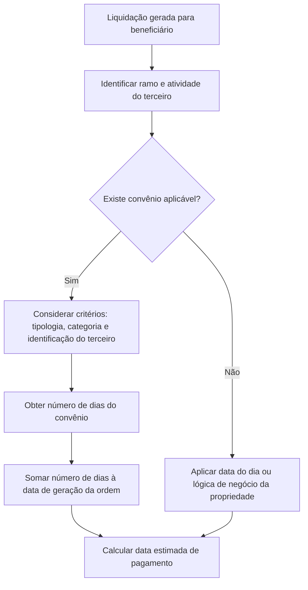

# Definição de Convênios de Pagamento por Ramo, Atividade e/ou Terceiro

## 1. Metadados do Documento
- **Arquivo de Origem:** Não identificado
- **Tipo de Documento:** Especificação Funcional
- **Domínio / Sistema:** Reef / Mapfre — Convênios de Pagamento
- **Público-Alvo:** Analistas funcionais, desenvolvedores, operação e negócio
- **Data/Versão Identificada:** Não identificada

---

## 2. Resumo Executivo & Contexto de Negócio

O documento descreve o catálogo de **Definições de Convênios de Pagamento por Atividade**, utilizado para registrar convênios de pagamento acordados pela companhia com atividades exercidas por terceiros, pessoas físicas ou jurídicas que mantêm relação com a companhia.

Os convênios podem ser definidos de forma abrangente para uma atividade inteira, como todos os talleres da atividade 17, ou de forma mais específica por tipologia, categoria ou terceiro individual. A personalização para terceiro ocorre quando o terceiro não utiliza o convênio configurado para a respectiva atividade.

A finalidade funcional do catálogo é determinar a **data estimada de pagamento** quando uma liquidação é gerada para um beneficiário. O cálculo considera o número de dias definido no convênio e a data de geração da ordem.

A definição do catálogo é opcional. Quando não houver convênio para determinadas atividades ou fornecedores, a data estimada de pagamento seguirá a data do dia ou a lógica de negócio aplicável à propriedade de data estimada de pagamento.

---

## 3. Arquitetura, Componentes & Tecnologias Envolvidas

O conteúdo identifica o sistema/documentação **Reef**, referências a **Mapfre** e o catálogo funcional de convênios de pagamento. O documento não apresenta tecnologias, APIs, métodos HTTP, bancos de dados, integrações técnicas, ambientes ou contratos JSON.

Os componentes funcionais identificados são:

- Catálogo de definições de convênios de pagamento.
- Ramo associado aos tipos de expedientes.
- Atividade do terceiro.
- Identificação do terceiro por tipo e código de documento.
- Código interno do terceiro, quando aplicável à atividade.
- Tipologia e categoria da atividade do beneficiário.
- Número de dias para cálculo da data estimada de pagamento.
- Data de validade da definição do convênio.
- Geração de ordem e liquidação para beneficiário.



> **Nota de Análise:** O documento descreve a finalidade de cálculo da data estimada de pagamento, mas não detalha a ordem de precedência entre convênios por atividade, tipologia, categoria e terceiro personalizado.

---

## 4. Regras de Negócio, Especificações Funcionais & Processos

### 4.1 Finalidade do catálogo

O catálogo permite definir convênios de pagamento acordados entre a companhia e diferentes atividades relacionadas a terceiros físicos ou jurídicos.

Um convênio de pagamento pode ser configurado para:

1. Uma atividade completa.
2. Todos os terceiros de uma atividade.
3. Todos os terceiros de uma tipologia específica da atividade.
4. Todos os terceiros de uma categoria específica da atividade.
5. Um terceiro específico, por meio de dados de identificação e, quando aplicável, código interno.

### 4.2 Cálculo da data estimada de pagamento

Quando uma liquidação é gerada para um beneficiário que possui atividade, atividade-tipo e código de documento associados a uma definição de convênio, a data estimada de pagamento é calculada a partir do número de dias configurado no catálogo.

A regra explicitamente apresentada é:

```text
Data estimada de pagamento =
Data de geração da ordem + Número de dias definido no convênio
```

### 4.3 Aplicação opcional do catálogo

A definição de convênios de pagamento não é obrigatória.

Se a companhia não possuir convênios com determinadas atividades ou fornecedores, a data estimada de pagamento será apresentada:

- Com a data do dia; ou
- Conforme a lógica de negócio definida para essa propriedade.

> **Nota de Análise:** O documento não especifica quais condições determinam o uso da data do dia em comparação com outras lógicas de negócio.

### 4.4 Regras e restrições por propriedade

- O **Ramo** indica a chave do ramo ao qual pertencem os tipos de expedientes que receberão a associação do convênio de pagamento por atividade.
- A **Atividade do terceiro** representa a relação entre uma pessoa física ou jurídica e a companhia.
- O **Tipo de Documento do terceiro** é preenchido para um terceiro que não utiliza o convênio da atividade e possui convênio personalizado.
- O **Código de Documento do terceiro** contém a codificação correspondente ao tipo de documento; a validação pode variar conforme o tipo de documento.
- O **Código interno do terceiro** somente pode ser usado por atividades definidas como atividades que possuem código interno.
- A **Tipologia do terceiro** pode ser genérica para todas as tipologias de uma atividade.
- A **Categoria do terceiro** pode ser genérica para todas as categorias de uma atividade.
- Cada tipologia pode possuir de **1 a n categorias**.
- A **Data de Validade** determina quando a definição do convênio é válida.

---

## 5. Tabelas de Parâmetros, Ambientes e Estruturas de Dados

| Item / Parâmetro | Descrição / Função | Tipo / Valores / Formato | Ambiente / Observações |
| :--- | :--- | :--- | :--- |
| Ramo | Indica a chave do ramo ao qual pertencem os tipos de expedientes associados ao convênio de pagamento por atividade. | Chave de ramo; formato não detalhado. | O documento não informa valores permitidos. |
| Atividade do terceiro | Define a atividade para a qual serão configurados convênios de pagamento. A atividade representa a relação de um terceiro físico ou jurídico com a companhia. | Atividade; formato não detalhado. | Exemplo citado: talleres, atividade 17. |
| Tipo de Documento do terceiro | Identifica o tipo de documento de uma pessoa física ou jurídica. | Tipo de documento; valores não detalhados. | Possui conteúdo quando existe terceiro sem convênio da atividade e com convênio personalizado. |
| Código de Documento do terceiro | Contém a codificação correspondente ao tipo de documento. | Número ou codificação; formato dependente do tipo de documento. | A validação varia segundo o tipo de documento. |
| Código interno do terceiro | Contém a chave interna atribuída manual ou automaticamente a uma pessoa física ou jurídica. | Chave interna; formato não detalhado. | Permitido apenas para atividades definidas com código interno. |
| Tipologia do terceiro | Contém a tipologia da atividade do beneficiário. | Tipologia; valores não detalhados. | Pode ser genérica para todas as tipologias da atividade. |
| Categoria do terceiro | Contém a categoria da atividade do beneficiário. | Categoria; valores não detalhados. | Cada tipologia pode ter de 1 a n categorias; pode ser genérica para todas as categorias da atividade. |
| Número de dias | Quantidade de dias adicionada à data de geração da ordem para calcular a data estimada de pagamento. | Número de dias. | Utilizado no cálculo da data estimada de pagamento. |
| Data de Validade | Data em que a definição do convênio é válida. | Data; formato não detalhado. | Não há detalhamento sobre vigência inicial, final ou tratamento de sobreposição. |
| Convênio de pagamento por atividade | Definição de pagamento aplicável a uma atividade ou a subconjuntos da atividade. | Configuração funcional. | Não é obrigatório. |
| Convênio personalizado | Convênio associado a um terceiro que não utiliza o convênio de sua atividade. | Configuração funcional. | Associado aos dados de identificação do terceiro. |

---

## 6. Bateria de Perguntas & Respostas para RAG (FAQ Sintético)

### P1: Qual é o objetivo do catálogo de Definições de Convênios de Pagamento por Atividade?
**R:** O catálogo permite definir convênios de pagamento acordados pela companhia com atividades relacionadas a terceiros, sejam pessoas físicas ou jurídicas. Esses convênios podem ser aplicados a uma atividade inteira, a uma tipologia, a uma categoria ou a um terceiro específico.

### P2: O catálogo de convênios de pagamento é obrigatório?
**R:** Não. O documento informa que o catálogo é opcional e deve ser utilizado somente quando a companhia possuir convênios com determinadas atividades ou fornecedores.

### P3: Como a data estimada de pagamento é calculada quando existe um convênio aplicável?
**R:** A data estimada de pagamento é calculada somando o número de dias definido no convênio à data em que a ordem é gerada.

### P4: O que ocorre se não existir convênio de pagamento para uma atividade ou fornecedor?
**R:** Quando não existir convênio, a data estimada de pagamento será apresentada com a data do dia ou conforme a lógica de negócio aplicável à propriedade. O documento não detalha essa lógica adicional.

### P5: O que representa a propriedade Ramo?
**R:** Ramo indica a chave do ramo ao qual pertencem os tipos de expedientes que serão associados ao convênio de pagamento por atividade.

### P6: Quando o Tipo de Documento do terceiro deve ser preenchido?
**R:** O Tipo de Documento do terceiro deve ter conteúdo quando existir um terceiro que não possua o convênio de sua atividade e possua um convênio personalizado.

### P7: Qual é a finalidade do Código de Documento do terceiro?
**R:** O Código de Documento do terceiro contém a codificação associada ao tipo de documento identificador da pessoa física ou jurídica. A validação do código varia conforme o tipo de documento.

### P8: Em quais situações o Código interno do terceiro pode ser utilizado?
**R:** O Código interno do terceiro somente pode ser utilizado por atividades previamente definidas como atividades que possuem código interno. A chave interna pode ser atribuída manual ou automaticamente a uma pessoa física ou jurídica.

### P9: Como a tipologia e a categoria do terceiro influenciam a definição do convênio?
**R:** A tipologia representa a tipologia da atividade do beneficiário e pode ser genérica para todas as tipologias da atividade. A categoria representa a categoria da atividade do beneficiário; cada tipologia pode ter de uma a n categorias, e a definição também pode ser genérica para todas as categorias.

### P10: O documento define a prioridade entre um convênio por atividade e um convênio personalizado para terceiro?
**R:** Não. O documento informa que o Tipo de Documento do terceiro é utilizado quando o terceiro não possui o convênio de sua atividade e possui um convênio personalizado, mas não detalha formalmente a ordem de precedência entre todas as possíveis configurações.

### P11: O que determina a Data de Validade de um convênio?
**R:** A Data de Validade indica a data em que a definição do convênio é válida. O documento não especifica regras para início e fim de vigência, expiração ou coexistência de definições.

### P12: O documento informa APIs, URLs, ambientes ou tecnologias para manutenção dos convênios?
**R:** Não. O documento contém uma referência à documentação Reef e Mapfre, mas não apresenta APIs, URLs, ambientes, métodos HTTP, tecnologias de implementação ou contratos técnicos.

---

## 7. Glossário de Termos, Siglas & Conceitos-Chave

- **Atividade do terceiro:** Relação que uma pessoa física ou jurídica possui com a companhia.
- **Beneficiário:** Entidade para a qual uma liquidação é gerada e para a qual se calcula uma data estimada de pagamento.
- **Categoria do terceiro:** Categoria da atividade do beneficiário; uma tipologia pode possuir de 1 a n categorias.
- **Código de Documento do terceiro:** Codificação associada ao tipo de documento de uma pessoa física ou jurídica.
- **Código interno do terceiro:** Chave interna atribuída manual ou automaticamente a uma pessoa física ou jurídica.
- **Convênio de pagamento:** Definição que estabelece condições, incluindo número de dias, para cálculo da data estimada de pagamento.
- **Convênio personalizado:** Convênio aplicável a um terceiro que não possui o convênio de sua atividade.
- **Data estimada de pagamento:** Data calculada a partir da data de geração da ordem e do número de dias definido no convênio.
- **Data de Validade:** Data em que uma definição de convênio é válida.
- **Liquidação:** Evento de negócio gerado para um beneficiário e usado no contexto de cálculo de pagamento.
- **Ramo:** Chave do ramo ao qual pertencem os tipos de expedientes associados a um convênio de pagamento por atividade.
- **Reef:** Referência identificada na documentação de origem.
- **Tipologia do terceiro:** Tipologia da atividade do beneficiário.

---

## 8. Notas Críticas, Riscos & Limitações

- O documento não informa o nome do arquivo de origem, data, versão ou autor técnico.
- O documento não especifica a ordem de prioridade entre convênios por atividade, tipologia, categoria, terceiro identificado por documento e código interno.
- Não há definição dos formatos, domínios válidos ou regras de obrigatoriedade dos campos.
- Não foram fornecidos exemplos legíveis das imagens de manutenção e dos exemplos mencionados no conteúdo.
- O documento não detalha integrações, APIs, banco de dados, tecnologias, ambientes, logs, monitoramento ou tratamento de erros.
- A lógica de negócio aplicada quando não existe convênio é descrita de forma genérica e não possui detalhamento adicional.
- Não há informação sobre coexistência de múltiplas definições válidas, vigências sobrepostas ou regras de expiração.

---

## 9. Conteúdo Bruto Estruturado (Referência Fiel)

```text
--- [PÁGINA 1 DE 2] ---

Denición Convenios de pago por Ramo Actividad y/o Tercero
Objetivo
Denir los convenios de pago a los que la compañía haya acordado con las diferentes actividades (personas físicas y jurídicas que tienen
relación con la compañía). Estos convenios pueden ser para una actividad, por ejemplo con todos los talleres (actividad 17) o un convenio de
pago para todos los talleres de una Tipología o de una categoría especíca.
La nalidad es denir cuando se genere una liquidación para un beneciario que tiene la actividad o la actividad tipo y código de documento,
como se va a calcular la fecha estimada de pago, según el número de días denido en este catálogo.
Imagen del Mantenimiento Deniciones de Convenios de Pago por actividad:
Propiedades
Ejemplo:
Documentation / DOCUMENTACIÓN Reef
DOCUMENTACIÓN Reef
Mapfredocument
DOCUMENTACIÓN Reef
Owner
user:agonzalez_mapfre.com
Lifecycle
Approved Source
 / 
 VL
Buscar Inicio Soluciones Arquitecturas APIs Componentes Cloud Documentación Zeus Reef Ayuda
ES


--- [PÁGINA 2 DE 2] ---

Ramo
Esta propiedad indica la clave del Ramo al que pertenece los tipos de expedientes, a los que se les va a asociar el convenio de pago por
actividad.
Actividad del tercero
Esta propiedad contiene la actividad a la que se la va a denir los convenios de pago. La actividad es la relación que tiene un tercero físico o
jurídico con la compañía.
Tipo de Documento del tercero
El tipo documento es el documento identicador de la persona física o jurídica. Esta propiedad sólo contiene el tipo de documento, esta
propiedad tendrá contenido, si hay un tercero que no tiene el convenio de su actividad, si no que tiene un convenio personalizado.
Código de Documento del tercero
Esta propiedad contiene la codicación del tipo de documento. Según el tipo de documento el número o codicación tendrá una validación
distinta
Código interno del tercero
Contiene la clave interna que se asigna manual o automáticamente a una persona física o jurídica. Esta propiedad sólo lo podrán tener las
actividades que se hayan denido que tienen un código interno.
Tipología del tercero
Esta propiedad contiene la tipología de la actividad del beneciario. Puede ser genérica para todas las tipologías de la actividad.
Categoría del tercero
Esta propiedad contiene la categoría de la actividad del beneciario. Cada tipología puede tener de 1 a n categorías. Puede ser genérica para
todas las categorías de la actividad.
Número de días
Esta propiedad contiene el número de días que hay que sumar a la fecha en la que se genera la orden, para calcular la fecha estimada de
pago.
Fecha de Validez
Fecha en la que es válida la denición del convenio.
Preguntas frecuentes
¿Es obligatorio denir este catálogo?
R/No, no es obligatorio, es sólo cuando se tiene en la compañía convenios con algunas actividades o con algún proveedor, si no saldrá
con la fecha estimada de pago del día o de lo que indique la lógica de negocio de esta propiedad.
Ejemplo:
Ejemplo:
Ejemplo:
```
