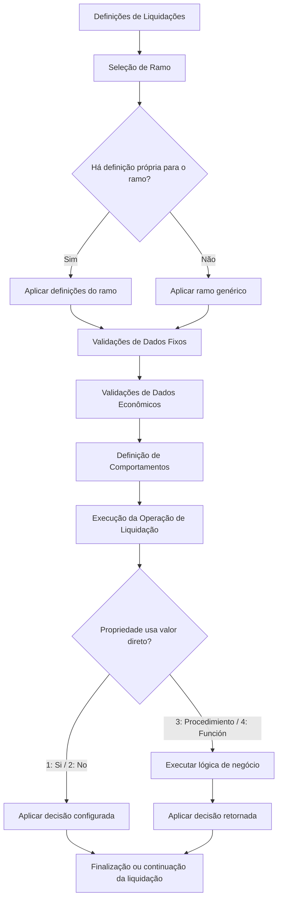
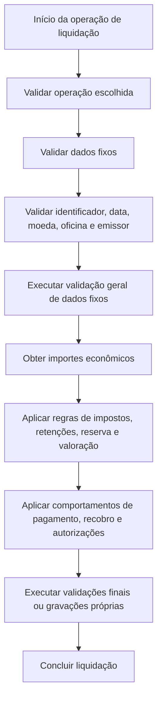

# Definição de Validações e Comportamentos de Liquidações no Reef.core

## 1. Metadados do Documento
- **Arquivo de Origem:** Não identificado no texto extraído
- **Tipo de Documento:** Especificação Técnica / Manual Funcional
- **Domínio / Sistema:** Reef / Reef.core / Liquidações de sinistros
- **Público-Alvo:** Desenvolvedores, Arquitetos, Analistas Funcionais, Operação e Tesouraria
- **Data/Versão Identificada:** Não identificada

---

## 2. Resumo Executivo & Contexto de Negócio

O documento descreve propriedades de configuração e extensibilidade para validações e comportamentos associados às operações de liquidação no contexto do Reef.core. Essas propriedades permitem que a instalação defina regras distintas por ramo, incluindo a utilização de um ramo genérico quando não houver uma definição específica para determinado ramo.

A configuração está organizada em três áreas principais: validações de dados fixos da liquidação, validações de dados econômicos da liquidação e definição de comportamentos. As validações de dados fixos cobrem informações como operação de liquidação, documento de pagamento, moeda, oficina de pagamento e documento do emissor. Já as validações econômicas regulam impostos, retenções, reservas, valores avaliados e limites para liquidação.

As propriedades podem assumir valores diretos — normalmente `1: Si` e `2: No` — ou delegar a decisão para lógica de negócio configurável, por meio de `3: Procedimiento` ou `4: Función`. Quando a opção é procedimento ou função, uma propriedade complementar contém a lógica capaz de decidir dinamicamente o comportamento aplicável.

O Reef.core já provê alguns controles e comportamentos padrão. Por exemplo, operações de liquidação validam a existência da moeda e do tipo de documento; a oficina de pagamento é validada como oficina de pagamento de nível 3; a rotina padrão de cálculo de impostos é a do Reef.core; e determinadas lógicas padrão retornam `N` ou `S` conforme o cenário descrito.

O documento não apresenta contratos técnicos, nomes de procedimentos, assinaturas de funções, interfaces HTTP, estruturas de banco de dados ou detalhes de implementação das lógicas configuráveis. As propriedades são descritas no nível funcional e devem ser implementadas ou associadas conforme as necessidades de cada instalação e ramo.

---

## 3. Arquitetura, Componentes & Tecnologias Envolvidas

### Componentes e domínios identificados

| Componente / Termo | Papel descrito no documento |
| :--- | :--- |
| **Reef** | Contexto documental e funcional no qual são mantidas definições de liquidação. |
| **Reef.core** | Núcleo que executa controles padrão e fornece comportamentos padrão para liquidações, impostos, oficinas de pagamento e reservas. |
| **Liquidações** | Operações relacionadas à geração, alteração, anulação e processamento de liquidações. |
| **Expediente** | Entidade associada a reserva, cobertura, conceito de reserva, valoração e liquidações parciais. |
| **Documento de pagamento** | Documento cujo identificador, data, moeda e dados do emissor podem receber validações adicionais. |
| **Ordem de pagamento** | Ordem de pagamento de sinistro que pode participar do processo automático de pagamentos, receber autorização para Tesouraria, ser anulada e ser registrada no livro de compras. |
| **Tesouraria** | Área relacionada à autorização de ordens de pagamento. |
| **Livro de Compras** | Registro relacionado a impostos; pode demandar anulação de registros quando uma ordem de pagamento já registrada é anulada. |
| **Recobro** | Processo que pode precisar ser aberto quando o expediente tiver possibilidade de associação a recobro e ainda não houver recobro aberto. |
| **Ordens de reparação** | Ordens pendentes podem influenciar a permissão para realizar outras liquidações. |
| **Liquidações Batch** | Liquidações processadas em diferido, com rotina própria configurável para cálculo de impostos e/ou retenções. |
| **`clo_pym_typ_prd_nam`** | Identificador listado no texto junto de “pago cobro dinamico”; o documento não fornece detalhamento adicional. |
| **pago cobro dinamico** | Texto listado no documento; não há definição funcional adicional no conteúdo extraído. |

### Fluxo funcional de configuração das liquidações



### Ciclo funcional de uma liquidação segundo as propriedades descritas



---

## 4. Regras de Negócio, Especificações Funcionais & Processos

### 4.1. Aplicação das definições por ramo

A propriedade **Ramo** contém a chave do ramo para o qual são definidas validações adicionais de atributos e/ou comportamentos das liquidações.

- Pode ser utilizado um **ramo genérico**.
- A definição do ramo genérico aplica-se aos ramos que não possuam definição própria.
- O documento não informa o formato da chave de ramo, o local técnico de manutenção ou a precedência entre múltiplas definições além da aplicação do ramo genérico quando não existe uma definição específica.

### 4.2. Validações de dados fixos da liquidação

#### Validação de operações de liquidação

A propriedade **Valida operaciones liquidación** contém lógica de negócio capaz de realizar validações quando são escolhidas operações de liquidação:

1. Gerar liquidação.
2. Modificar liquidação.
3. Gerar liquidação para expediente terminado.
4. Anular liquidação.

O documento não detalha os critérios de validação aplicados a cada uma dessas operações.

#### Validação do identificador do documento de pagamento

A propriedade permite definir lógica de negócio para validar o identificador do documento de pagamento, referido como número de documento.

#### Validação da data do documento de pagamento

A propriedade permite definir lógica de negócio para validar a data do documento de pagamento.

#### Validação da moeda do documento de pagamento

A propriedade permite lógica de negócio adicional para validar a moeda do documento de pagamento.

- As operações de liquidação já controlam que a moeda exista.
- A lógica adicional não substitui o controle de existência de moeda descrito para as operações de liquidação.

#### Validação da oficina de pagamento

A propriedade contém a lógica de negócio necessária para validar a oficina de pagamento.

- No Reef.core, é validado que a oficina seja uma oficina de pagamento de **nível 3**.

#### Validação do tipo de documento do emissor

A propriedade permite aplicar validações adicionais ao tipo de documento do emissor do documento de pagamento.

- As operações de liquidação já controlam que o tipo de documento exista.

#### Validação geral dos dados fixos da liquidação

A propriedade contém a lógica de negócio necessária para validar qualquer dado fixo da liquidação.

- A validação geral é executada no último atributo existente antes da obtenção dos importes econômicos da liquidação.

### 4.3. Validações de dados econômicos da liquidação

#### Cálculo de impostos

A propriedade **¿Se llama al cálculo de impuestos?** indica às operações de liquidação se o cálculo de impostos será realizado.

Valores documentados:

- `1: Si`
- `2: No`
- `3: Procedimiento`
- `4: Función`

Quando a propriedade contém `3` ou `4`, a propriedade **Lógica que determina si se calculan impuestos** contém a lógica de negócio que decide se os impostos devem ser calculados.

A decisão dinâmica não é necessariamente sempre “Sim” ou “Não”, pois pode depender de vários fatores. O documento não especifica quais fatores devem ser avaliados.

#### Ajuste de imposto

A propriedade **Lógica de Negocio que determina si se permite un ajuste del impuesto** informa se é permitido ajustar o imposto calculado, isto é, modificar o imposto já calculado.

O documento não detalha os critérios, valores de retorno ou momento exato de execução dessa lógica.

#### Rotina de cálculo de impostos e/ou retenções

A propriedade **Lógica que devolverá qué rutina va a calcular los impuestos y/o retenciones** devolve o programa que calculará impostos e/ou retenções.

- Por padrão, a propriedade retorna a rotina do Reef.core.
- O documento não identifica o nome técnico da rotina padrão.

#### Rotina de cálculo para liquidações Batch

A propriedade **Lógica que devolverá qué rutina va a calcular los impuestos y/o retenciones en las liquidaciones Batch** devolve a rotina usada quando operações de liquidação Batch são executadas em diferido.

- Por padrão, a rotina retornada é a do Reef.core.
- O documento não descreve o agendamento, mecanismo de processamento em diferido ou interface da rotina Batch.

#### Liquidação de conceito de reserva com valoração igual a zero

A propriedade **¿Se permite liquidar cuando la valoración de la cobertura y el concepto de reserva es 0?** define se é permitido liquidar um conceito de reserva quando sua valoração é zero.

Valores documentados:

- `1: Si`
- `2: No`
- `3: Procedimiento`
- `4: Función`

Quando a propriedade contém `3` ou `4`, a propriedade complementar contém a lógica de negócio que determina se uma cobertura ou conceito de reserva pode ser liquidado quando a valoração for zero.

Caso a liquidação não seja permitida e seja necessária, deve ser realizada previamente uma alteração de valoração.

#### Reserva do expediente igual a zero após liquidação parcial

A propriedade **¿Se permite dejar la reserva del expediente a 0?** controla se, em uma liquidação parcial de expediente, o importe valorado e o importe liquidado podem ficar iguais, deixando a reserva do expediente igual a zero.

Valores documentados:

- `1: Si`
- `2: No`
- `3: Procedimiento`
- `4: Función`

Quando a propriedade possui `3` ou `4`, a lógica complementar devolve à operação de liquidações se é permitido deixar a reserva igual a zero após uma liquidação parcial.

- O core retorna `N`.

#### Liquidação acima do importe valorado

A propriedade **¿Se permite liquidar por un importe superior al importe valorado?** controla se é permitido liquidar acima do valor estimado.

- A liquidação realiza sempre um ajuste automático da valoração quando a liquidação é superior.
- A propriedade existe porque algumas companhias desejam obrigar a realização de uma alteração de valoração antes da liquidação.

Valores documentados:

- `1: Si`
- `2: No`
- `3: Procedimiento`
- `4: Función`

Quando o valor é `3` ou `4`, a lógica complementar devolve se é permitido ou não liquidar um importe superior ao importe valorado do expediente.

- O texto da lógica complementar menciona também a permissão para deixar a reserva igual a zero em liquidação parcial e que o core devolve `N`. Essa descrição aparece no documento sob a propriedade de importe superior ao valorado e deve ser preservada como possível inconsistência de documentação.

### 4.4. Definição de comportamentos

#### Outras liquidações com ordens de reparação pendentes

A propriedade **¿Se puede realizar otras liquidaciones si se tienen órdenes de reparación pendientes?** controla se podem ser realizadas outras liquidações quando existem ordens de reparação pendentes sem liquidar.

Valores documentados:

- `1: Si`
- `2: No`
- `3: Procedimiento`
- `4: Función`

Quando o valor é `3` ou `4`, a lógica complementar determina se podem ser realizadas outras liquidações com ordens de reparação pendentes.

#### Exclusão da ordem de pagamento do processo automático

A propriedade **¿Se va a excluir la orden de pago del proceso de pagos automático?** regula a exclusão da ordem de pagamento de sinistro do processo automático de pagamentos.

- As ordens de pagamento de sinistros são geradas com indicação de pagamento automático quando chega a data estimada de pagamento.
- O comportamento pode ser alterado por essa propriedade.

Valores documentados:

- `1: Si`
- `2: No`
- `3: Procedimiento`
- `4: Función`

Quando o valor é `3` ou `4`, a lógica complementar devolve à operação de liquidações se a ordem deve ou não ser excluída do processo automático de pagamentos.

- O core devolve `N`.

#### Liquidação de honorários e gastos com indenização retida

A propriedade **Lógica que determina si se puede liquidar honorarios y gastos aunque esté retenido indemnización por control técnico** define se é permitida uma liquidação de honorários e/ou gastos quando o expediente está retido pelo conceito de indenização.

O documento não apresenta valores diretos, critérios ou comportamento padrão para essa lógica.

#### Autorização de ordem de pagamento para Tesouraria

A propriedade **¿Autorizo la orden de pago para Tesorería?** indica se as ordens de pagamento de sinistro saem autorizadas para pagamento ou se devem ser autorizadas por Tesouraria.

Valores documentados:

- `1: Si`
- `2: No`
- `3: Procedimiento`
- `4: Función`

Quando o valor é `3` ou `4`, a propriedade complementar contém lógica de negócio que determina se a ordem de pagamento de sinistro sai autorizada.

#### Pergunta sobre abertura de recobro

A propriedade **Pregunta si necesario abrir un recobro** pergunta, durante as liquidações, se é necessário abrir um recobro quando:

1. O expediente possui possibilidade de associação a um recobro.
2. O recobro ainda não está aberto.

Valores documentados:

- `1: Si`
- `2: No`
- `3: Procedimiento`
- `4: Función`

Quando o valor é `3` ou `4`, a lógica complementar decide se deve ser solicitada a comprovação ou pergunta sobre a abertura do recobro.

#### Validações finais da liquidação

A propriedade **Lógica de Negocio para realizar validaciones al final de la liquidación** permite configurar lógica para:

- Executar validações próprias.
- Gravar informações próprias da instalação.

O documento não define quais validações ou informações podem ser incluídas.

#### Exclusão de informação adicional própria

A propriedade **Lógica de negocio para borrado de información adicional propia de la instalación** pode conter lógica de negócio para apagar informações próprias da instalação quando:

- A operação não chega ao final.
- É necessário apagar tabelas transitórias próprias.

#### Simulação do cálculo de retenção

A propriedade **Se simula el cálculo de la retención** determina se o cálculo de retenção é simulado.

Valores documentados:

- `1: Si`
- `2: No`
- `3: Procedimiento`
- `4: Función`

A lógica complementar determina se a retenção é simulada ou não:

- Na tela de importes.
- Ao finalizar a liquidação.

#### Retificação de liquidações de meses anteriores

A propriedade **¿Se puede rectificar liquidaciones de meses anteriores?** controla se é permitida a retificação de liquidações de meses anteriores.

Valores documentados:

- `1: Si`
- `2: No`
- `3: Procedimiento`
- `4: Función`

Quando o valor é `3` ou `4`, a propriedade complementar devolve se será permitida a retificação de liquidações de meses anteriores.

- O core devolve `S`.
- Para países que registram ordens de pagamento no Livro de Compras, a legislação do país define o prazo limite para modificar uma ordem já informada no Livro de Compras ou no registro de impostos.

#### Restauração da reserva ao anular ordem de pagamento

A propriedade **¿Se restaura la reserva si se anula la orden de pago?** controla se a reserva é restaurada quando uma ordem de pagamento é anulada.

Valores documentados:

- `1: Si`
- `2: No`
- `3: Procedimiento`
- `4: Función`

Quando o valor é `3` ou `4`, a lógica complementar determina se, ao anular uma liquidação, a reserva é restaurada pelo valor da liquidação anulada.

Exemplo funcional fornecido:

- Se uma liquidação de `100` em moeda local for anulada, a lógica deve determinar se a valoração aumenta pelos `100` anulados.

#### Anulação de ordem no Livro de Compras

A propriedade **Lógica de Negocio que anula la orden del libro de compras** contém a lógica responsável por anular, no Livro de Compras, os registros correspondentes a uma ordem de pagamento anulada.

Essa lógica é aplicável quando a ordem de pagamento já tiver sido registrada previamente.

---

## 5. Tabelas de Parâmetros, Ambientes e Estruturas de Dados

### 5.1. Valores reutilizados nas propriedades parametrizáveis

| Item / Parâmetro | Descrição / Função | Tipo / Valores / Formato | Ambiente / Observações |
| :--- | :--- | :--- | :--- |
| Decisão direta positiva | Indica que o comportamento ou permissão é afirmativo. | `1: Si` | Aplicável às propriedades que listam valores 1 a 4. |
| Decisão direta negativa | Indica que o comportamento ou permissão é negativo. | `2: No` | Aplicável às propriedades que listam valores 1 a 4. |
| Decisão por procedimento | Delegação da decisão para uma lógica configurada como procedimento. | `3: Procedimiento` | Requer propriedade complementar com lógica de negócio. |
| Decisão por função | Delegação da decisão para uma lógica configurada como função. | `4: Función` | Requer propriedade complementar com lógica de negócio. |
| Resposta padrão do core | Resultado informado como padrão do núcleo Reef.core. | `N` ou `S` | O documento informa `N` em cenários específicos e `S` para retificação de meses anteriores. |

### 5.2. Propriedades de validação de dados fixos

| Item / Parâmetro | Descrição / Função | Tipo / Valores / Formato | Ambiente / Observações |
| :--- | :--- | :--- | :--- |
| Ramo | Contém a chave do ramo para o qual são definidas validações extras de atributos e/ou comportamentos. | Chave de ramo; formato não detalhado | Pode ser usado ramo genérico para ramos sem definição própria. |
| Valida operaciones liquidación | Executa validações para as operações de liquidação. | Lógica de negócio | Abrange gerar, modificar, gerar para expediente terminado e anular liquidação. |
| Validación del identificador del Documento de Pago | Valida o número do documento de pagamento. | Lógica de negócio | Não são descritos critérios. |
| Validación de la Fecha del Documento de Pago | Valida a data do documento de pagamento. | Lógica de negócio | Não são descritos critérios. |
| Validación de la moneda del Documento de Pago | Executa validações extras da moeda do documento de pagamento. | Lógica de negócio | A existência da moeda já é controlada pelas operações de liquidação. |
| Validación de la oficina de pago | Valida a oficina de pagamento. | Lógica de negócio | Reef.core valida oficina de pagamento de nível 3. |
| Validación del tipo de documento del emisor | Executa validações extras do tipo de documento do emissor. | Lógica de negócio | A existência do tipo de documento já é controlada pelas operações de liquidação. |
| Validación General de los Datos Fijos de la Liquidación | Valida qualquer dado fixo da liquidação. | Lógica de negócio | Executada no último atributo antes de obter os importes econômicos. |

### 5.3. Propriedades de dados econômicos

| Item / Parâmetro | Descrição / Função | Tipo / Valores / Formato | Ambiente / Observações |
| :--- | :--- | :--- | :--- |
| ¿Se llama al cálculo de impuestos? | Indica se a operação chama o cálculo de impostos. | `1`, `2`, `3`, `4` | Para `3` ou `4`, usar lógica complementar. |
| Lógica que determina si se calculan impuestos | Determina dinamicamente se os impostos são calculados. | Lógica de negócio | Aplicável se a propriedade anterior for `3` ou `4`; pode depender de vários fatores. |
| Lógica de Negocio que determina si se permite un ajuste del impuesto | Define se o imposto calculado pode ser modificado. | Lógica de negócio | Sem critérios ou padrão documentados. |
| Lógica que devolverá qué rutina va a calcular los impuestos y/o retenciones | Retorna o programa de cálculo de impostos e/ou retenções. | Lógica de negócio | Por padrão, retorna a rotina do Reef.core. |
| Lógica que devolverá qué rutina va a calcular los impuestos y/o retenciones en las liquidaciones Batch | Retorna a rotina de cálculo de impostos para liquidações Batch em diferido. | Lógica de negócio | Por padrão, retorna rotina do Reef.core. |
| ¿Se permite liquidar cuando la valoración de la cobertura y el concepto de reserva es 0? | Define se cobertura/conceito de reserva com valoração zero pode ser liquidado. | `1`, `2`, `3`, `4` | Se não permitido, requer alteração prévia da valoração para liquidar. |
| Lógica que determina si se puede liquidar cuando la valoración de la cobertura y el concepto de reserva es 0 | Decide dinamicamente a permissão de liquidação com valoração zero. | Lógica de negócio | Aplicável se a propriedade anterior for `3` ou `4`. |
| ¿Se permite dejar la reserva del expediente a 0? | Controla se uma liquidação parcial pode deixar a reserva do expediente em zero. | `1`, `2`, `3`, `4` | O core devolve `N` na lógica dinâmica descrita. |
| Lógica de Negocio que devuelve si se va a permitir o no, que la reserva del expediente quede 0 en un Expediente Pendiente | Decide se a reserva pode ficar em zero após liquidação parcial. | Lógica de negócio | Aplicável se a propriedade anterior for `3` ou `4`. |
| ¿Se permite liquidar por un importe superior al importe valorado? | Controla liquidação acima do valor estimado. | `1`, `2`, `3`, `4` | A liquidação realiza ajuste automático de valoração quando superior. |
| Lógica de Negocio que devuelve si se va a permitir o no, que se liquide un importe superior al importe valorado del expediente | Decide se um valor superior ao valorado pode ser liquidado. | Lógica de negócio | O texto extraído contém possível inconsistência ao repetir referência à reserva igual a zero e retorno `N`. |

### 5.4. Propriedades de comportamento

| Item / Parâmetro | Descrição / Função | Tipo / Valores / Formato | Ambiente / Observações |
| :--- | :--- | :--- | :--- |
| ¿Se puede realizar otras liquidaciones si se tienen órdenes de reparación pendientes? | Controla outras liquidações quando existem ordens de reparação pendentes. | `1`, `2`, `3`, `4` | Para `3` ou `4`, usar lógica complementar. |
| Lógica que determina si se puede realizar otras liquidaciones si se tienen órdenes de reparación pendientes | Determina a permissão para outras liquidações com ordens pendentes. | Lógica de negócio | Refere-se a ordens de reparação pendentes sem liquidar. |
| ¿Se va a excluir la orden de pago del proceso de pagos automático? | Controla exclusão da ordem de pagamento do processo automático. | `1`, `2`, `3`, `4` | As ordens são geradas para pagamento automático na data estimada; o core devolve `N` na lógica dinâmica. |
| Lógica de negocio que va a excluir la orden de pago de siniestros, del proceso de pagos automático | Decide se uma ordem de pagamento de sinistro é excluída do processo automático. | Lógica de negócio | Aplicável se a propriedade anterior for `3` ou `4`. |
| Lógica que determina si se puede liquidar honorarios y gastos aunque esté retenido indemnización por control técnico | Define se honorários e/ou gastos podem ser liquidados com indenização retida. | Lógica de negócio | Sem valores diretos ou comportamento padrão descritos. |
| ¿Autorizo la orden de pago para Tesorería? | Define se a ordem de pagamento sai autorizada para pagamento ou requer autorização. | `1`, `2`, `3`, `4` | Relacionada à Tesouraria. |
| Lógica que determina si la orden de pago de siniestros sale autorizada | Decide se a ordem de pagamento de sinistro sai autorizada. | Lógica de negócio | Aplicável se a propriedade anterior for `3` ou `4`. |
| Pregunta si necesario abrir un recobro | Pergunta se é necessário abrir recobro durante a liquidação. | `1`, `2`, `3`, `4` | Cenário: expediente com possibilidade de recobro, mas sem recobro aberto. |
| Lógica que indica si se pregunta si es necesario abrir un recobro | Decide se será solicitada a confirmação para abertura de recobro. | Lógica de negócio | Aplicável se a propriedade anterior for `3` ou `4`. |
| Lógica de Negocio para realizar validaciones al final de la liquidación | Executa validações próprias ou grava informações próprias no final. | Lógica de negócio | Sem contrato técnico detalhado. |
| Lógica de negocio para borrado de información adicional propia de la instalación | Apaga informações próprias ou tabelas transitórias próprias. | Lógica de negócio | Usada se a operação não chega ao fim ou para limpeza de tabelas transitórias. |
| Se simula el cálculo de la retención | Define se o cálculo de retenção é simulado. | `1`, `2`, `3`, `4` | Pode afetar tela de importes e finalização da liquidação. |
| Lógica de Negocio que determina si se simula o no el cálculo de la retención en la pantalla de importes | Decide a simulação de retenção na tela de importes. | Lógica de negócio | Relacionada à propriedade de simulação de retenção. |
| Lógica que determina si se simula o no la retención al finalizar la liquidación | Decide a simulação da retenção na finalização. | Lógica de negócio | Relacionada à propriedade de simulação de retenção. |
| ¿Se puede rectificar liquidaciones de meses anteriores? | Define se liquidações de meses anteriores podem ser retificadas. | `1`, `2`, `3`, `4` | O core devolve `S`; legislação pode impor prazo em países com Livro de Compras. |
| Lógica de Negocio que determina si se puede rectificar o no una Liquidación de meses anteriores | Decide dinamicamente a retificação de meses anteriores. | Lógica de negócio | Aplicável se a propriedade anterior for `3` ou `4`. |
| ¿Se restaura la reserva si se anula la orden de pago? | Define se a reserva é restaurada ao anular ordem de pagamento. | `1`, `2`, `3`, `4` | Pode restaurar o valor da liquidação anulada. |
| Lógica de Negocio que determina si al anularse la orden de pago se restaura la reserva | Decide se a reserva é restaurada após anulação. | Lógica de negócio | Aplicável se a propriedade anterior for `3` ou `4`. |
| Lógica de Negocio que anula la orden del libro de compras | Anula registros do Livro de Compras associados a ordem anulada. | Lógica de negócio | Aplicável quando a ordem já estava registrada no Livro de Compras. |

---

## 6. Bateria de Perguntas & Respostas para RAG (FAQ Sintético)

### P1: Como o sistema determina quais validações de liquidação aplicar para um ramo?
**R:** A propriedade **Ramo** contém a chave do ramo para o qual são definidas validações extras de atributos e/ou comportamentos das liquidações. Quando não existe uma definição própria para um ramo, pode ser utilizado o ramo genérico, cuja definição se aplica aos ramos sem configuração específica.

### P2: Quais operações podem ser validadas pela propriedade “Valida operaciones liquidación”?
**R:** A propriedade pode conter lógica de negócio para validar quatro operações: gerar liquidação, modificar liquidação, gerar liquidação para expediente terminado e anular liquidação. O documento não detalha regras específicas para cada operação.

### P3: A validação adicional da moeda substitui a verificação padrão do Reef.core?
**R:** Não. A propriedade de validação da moeda do documento de pagamento permite validações extras, mas as próprias operações de liquidação já controlam que a moeda exista.

### P4: O que o Reef.core valida na oficina de pagamento?
**R:** O documento informa que, no Reef.core, é validado que a oficina seja uma oficina de pagamento de nível 3. A propriedade de validação da oficina permite acrescentar a lógica de negócio adicional necessária para a instalação.

### P5: Como configurar o cálculo de impostos em uma liquidação?
**R:** A propriedade **¿Se llama al cálculo de impuestos?** pode receber `1: Si`, `2: No`, `3: Procedimiento` ou `4: Función`. Quando recebe `3` ou `4`, a decisão é delegada para a propriedade de lógica que determina se os impostos são calculados. Essa lógica pode depender de vários fatores, não estando limitada a uma resposta fixa de sim ou não.

### P6: Qual rotina calcula impostos e retenções por padrão?
**R:** A propriedade que devolve a rotina de cálculo de impostos e/ou retenções retorna, por padrão, a rotina do Reef.core. O documento não identifica o nome técnico dessa rotina.

### P7: É possível liquidar uma cobertura ou conceito de reserva com valoração igual a zero?
**R:** Sim, dependendo da configuração da propriedade correspondente. Ela aceita `1: Si`, `2: No`, `3: Procedimiento` e `4: Función`. Se estiver configurada como procedimento ou função, a lógica de negócio determina a permissão. Quando não é permitido liquidar e a liquidação é necessária, deve ser efetuada previamente uma alteração de valoração.

### P8: O que acontece quando uma liquidação parcial deixa a reserva do expediente em zero?
**R:** A propriedade **¿Se permite dejar la reserva del expediente a 0?** controla se uma liquidação parcial pode fazer com que o importe valorado e o importe liquidado fiquem iguais, deixando a reserva do expediente igual a zero. Quando a decisão é dinâmica, a lógica complementar define a permissão; o documento informa que o core devolve `N`.

### P9: O sistema pode liquidar um valor maior que o importe valorado?
**R:** A possibilidade é configurada pela propriedade **¿Se permite liquidar por un importe superior al importe valorado?**. A liquidação sempre realiza um ajuste automático da valoração quando o valor liquidado é superior. A configuração existe para atender companhias que desejam obrigar uma alteração de valoração antes de permitir a liquidação.

### P10: Como excluir uma ordem de pagamento do processo automático de pagamentos?
**R:** A propriedade **¿Se va a excluir la orden de pago del proceso de pagos automático?** pode ser configurada com `1: Si`, `2: No`, `3: Procedimiento` ou `4: Función`. Para `3` ou `4`, a lógica complementar determina se a ordem de pagamento de sinistro será excluída. O documento informa que o core devolve `N`.

### P11: Quando o sistema pode perguntar sobre a abertura de um recobro?
**R:** A propriedade de pergunta sobre abertura de recobro é aplicada durante liquidações quando o expediente tem possibilidade de associação a recobro, mas esse recobro ainda não está aberto. A decisão pode ser direta ou determinada por procedimento ou função.

### P12: É permitido retificar liquidações de meses anteriores?
**R:** A permissão é controlada pela propriedade **¿Se puede rectificar liquidaciones de meses anteriores?**, com valores `1`, `2`, `3` e `4`. Quando a regra for dinâmica, a lógica complementar devolve a decisão. O core devolve `S`, mas países que registram ordens de pagamento no Livro de Compras podem ter limites definidos por legislação para modificar ordens já informadas.

### P13: O que significa restaurar a reserva após anular uma ordem de pagamento?
**R:** A restauração da reserva significa que, ao anular uma liquidação, a lógica de negócio determina se a valoração deve aumentar pelo valor da liquidação anulada. O exemplo do documento indica que, ao anular uma liquidação de 100 em moeda local, deve ser decidido se a valoração aumenta pelos 100 anulados.

### P14: O que deve ocorrer com registros do Livro de Compras quando uma ordem de pagamento é anulada?
**R:** A propriedade **Lógica de Negocio que anula la orden del libro de compras** deve conter a lógica que anula os registros do Livro de Compras associados à ordem de pagamento anulada, desde que a ordem tenha sido registrada previamente.

---

## 7. Glossário de Termos, Siglas & Conceitos-Chave

- **Reef:** Contexto de documentação e sistema citado para definições de liquidações.
- **Reef.core:** Núcleo do Reef que fornece controles e comportamentos padrão para liquidações.
- **Liquidação:** Operação de geração, modificação, anulação ou tratamento de valores associados a um expediente.
- **Expediente:** Entidade relacionada a cobertura, reserva, valoração, liquidações e recobros.
- **Ramo:** Chave de classificação usada para aplicar definições específicas de validação e comportamento.
- **Ramo genérico:** Definição aplicável aos ramos que não possuem configuração própria.
- **Documento de pagamento:** Documento cujo identificador, data, moeda e dados do emissor podem ser validados.
- **Oficina de pagamento:** Unidade de pagamento; o Reef.core valida que seja de nível 3.
- **Valoração:** Valor estimado associado à cobertura ou ao conceito de reserva.
- **Reserva:** Valor reservado no expediente; pode ser impactado por liquidações parciais e anulações.
- **Liquidação parcial:** Liquidação que pode resultar em ajuste da reserva do expediente.
- **Retenção:** Valor cujo cálculo pode ser simulado na tela de importes ou ao finalizar a liquidação.
- **Liquidação Batch:** Liquidação realizada em diferido.
- **Recobro:** Processo que pode ser aberto quando o expediente possui possibilidade de associação a recobro.
- **Tesouraria:** Área relacionada à autorização de ordens de pagamento.
- **Livro de Compras:** Registro de ordens de pagamento relacionado a obrigações de impostos.
- **`S`:** Retorno positivo mencionado para a retificação de liquidações de meses anteriores.
- **`N`:** Retorno negativo mencionado para determinadas decisões padrão do core.
- **Procedimiento:** Opção `3` que delega a decisão para uma lógica de negócio configurada como procedimento.
- **Función:** Opção `4` que delega a decisão para uma lógica de negócio configurada como função.

---

## 8. Notas Críticas, Riscos & Limitações

- **Nota de Análise:** O documento descreve propriedades funcionais, mas não identifica os nomes técnicos de procedimentos, funções, rotinas, programas, tabelas, serviços ou interfaces utilizados para implementar as lógicas de negócio.
- **Nota de Análise:** Não são informados contratos HTTP, métodos, endpoints, estruturas JSON, esquemas de banco de dados, URLs de ambiente, credenciais, portas ou configurações de infraestrutura.
- **Risco regulatório:** A retificação de liquidações de meses anteriores pode ser limitada pela legislação de países que registram ordens de pagamento no Livro de Compras.
- **Dependência de implementação local:** Diversas decisões são delegadas a procedimentos ou funções configuráveis. A consistência do comportamento final depende da lógica de negócio implementada pela instalação.
- **Risco de inconsistência documental:** A descrição da lógica para permitir liquidação acima do importe valorado repete uma referência à reserva do expediente igual a zero e ao retorno `N`. O texto extraído não permite confirmar se essa repetição é intencional ou um erro de documentação.
- **Limitação de exemplos:** O conteúdo extraído contém diversas referências a “Ejemplo”, mas não apresenta exemplos funcionais completos, exceto o cenário de anulação de uma liquidação de 100 em moeda local.
- **Limitação de `clo_pym_typ_prd_nam`:** O identificador aparece associado a “pago cobro dinamico”, sem explicação adicional sobre sua finalidade, formato ou relacionamento com as demais propriedades.

---

## 9. Conteúdo Bruto Estruturado (Referência Fiel)

```text
--- [PÁGINA 1 DE 6] ---

DEFINICIÓN de Validaciones en la Liquidación
Objetivo
La finalidad de este documento es conocer que Funcionales de las liquidaciones se pueden variar o condicionar. Estas propiedades permiten
definiciones diferentes por ramo y validaciones extras por ramo.
Propiedades
Validaciones Datos Fijos Liquidación
Validaciones Datos Económicos Liquidación
Definición Comportamientos Liquidaciones
Imagen del Mantenimiento Definiciones de las Liquidaciones:
Ramo
Ejemplo:
Documentation / DOCUMENTACIÓN Reef
DOCUMENTACIÓN Reef
Mapfredocument
DOCUMENTACIÓN Reef
Owner
user:agonzalez_mapfre.com
Lifecycle
Approved Source
 /
 VL
Buscar Inicio Soluciones Arquitecturas APIs Componentes Cloud Documentación Zeus Reef Ayuda
ES


--- [PÁGINA 2 DE 6] ---

Esta propiedad contiene la Clave del ramo para el que se están definiendo las validaciones extras de los atributos y / o comportamientos de
las liquidaciones. Se puede utilizar el ramo genérico que indica que la definición aplica a todos los ramos, que no tengan definición propia.
Validaciones Datos Fijos Liquidación
Valida operaciones liquidación
Esta propiedad contiene una lógica de negocio que puede realizar validaciones cuando se elige las diferentes operaciones de liquidación:
Generar Liquidación
Modificar Liquidación
Generar Liquidación a expediente Terminado
Anular Liquidación
Validación del identificador del Documento de Pago
Esta propiedad contiene una lógica de negocio si se quiere validar el identificador del documento de pago (número de documento)
Validación de la Fecha del Documento de Pago
Esta propiedad contiene una lógica de negocio si se quiere validar la fecha del Documento de Pago.
Validación de la moneda del Documento de Pago
Esta propiedad contiene una lógica de negocio para poder realizar validaciones extras de la moneda del documento de pago. Las
operaciones de liquidaciones ya controlan que la moneda exista.
Validación de la oficina de pago
Esta propiedad, contendrá la lógica de Negocio que se necesite para validar la oficina de pago. En Reef.core, se valida que sea una oficina de
pago nivel 3.
Validación del tipo de documento del emisor
Esta propiedad contiene una lógica de negocio para poder realizar validaciones extras del tipo de documento del emisor del documento de
pago. Las operaciones de liquidaciones ya controlan que el tipo de documento ya exista.
Validación General de los Datos Fijos de la Liquidación
Esta propiedad, contendrá la lógica de Negocio que se necesite para validar cualquier dato fijo de la liquidación, ya que esta se lanza en el
último atributo que existe antes de recoger los importes económicos de la liquidación.
Validaciones Datos Económicos Liquidación
¿Se llama al cálculo de impuestos?
Esta propiedad indica a las operaciones de liquidaciones, si se va a realizar el cálculo de impuestos.
1: Si
2: No
Ejemplo:
Ejemplo:
Ejemplo:
Ejemplo:
Ejemplo:


--- [PÁGINA 3 DE 6] ---

3: Procedimiento
4: Función
Lógica que determina si se calculan impuestos
Esta propiedad contendrá la lógica de Negocio si la propiedad anterior contiene 3 ó 4. Esta determinará si se calculan impuestos, pero no es
siempre Si o No depende de varios factores.
Lógica de Negocio que determina si se permite un ajuste del impuesto
Esta propiedad contiene si se permite un ajuste impuesto, es decir si se va a permitir modificar el impuesto calculado.
Lógica que devolverá qué rutina va a calcular los impuestos y/o retenciones
Lógica que devolverá cual es el programa que se va a encargar de calcular los impuestos. Por defecto devuelve la de Reef.core
Lógica que devolverá qué rutina va a calcular los impuestos y/o retenciones en las liquidaciones Batch
Lógica que devolverá la rutina que se va a encargar de calcular los impuestos cuando se realicen las operaciones de liquidaciones Batch, en
diferido. Por defecto devuelve la de Reef.core.
¿Se permite liquidar cuando la valoración de la cobertura y el concepto de reserva es 0?
Si se permite liquidar un concepto de reserva, si su valoración es 0.
1: Si
2: No
3: Procedimiento
4: Función
Lógica que determina si se puede liquidar cuando la valoración de la cobertura y el concepto de reserva es 0
Si la propiedad anterior contiene un 3 ó 4, esta propiedadcontendrá una lógica de negocio que determinará si se puede liquidar una cobertura
concepto de reserva si la valoración es 0. Si no se deja liquidar y se quiere, tendrán que realizar previamente un cambio de valoración.
clo_pym_typ_prd_nam
pago cobro dinamico
¿Se permite dejar la reserva del expediente a 0?
¿Se va permitir cuando se realice una liquidación parcial en un expediente, que el importe valorado y el importe liquidado queden igual,
dejando la reserva del expediente a 0.?
1: Si
2: No
3: Procedimiento
4: Función
Lógica de Negocio que devuelve si se va a permitir o no, que la reserva del expediente quede 0 en un Expediente
Pendiente
Esta propiedad contendrá una lógica de Negocio si el parámetro anterior contiene un 3, ó 4. Y devolverá a la operación de liquidaciones si se
permite dejar la reserva a 0 cuando se realiza una liquidación Parcial. El core devuelve que 'N'.
¿Se permite liquidar por un importe superior al importe valorado?
¿Se va a permitir liquidar por encima de lo que está estimado? La liquidación siempre va a realizar una ajuste automático de la valoración si
esta es superior. Esto se pregunta porque hay compañías que quieren obligar a realizar un cambio de valoración antes de liquidar.
1: Si
2: No


--- [PÁGINA 4 DE 6] ---

3: Procedimiento
4: Función
Lógica de Negocio que devuelve si se va a permitir o no, que se liquide un importe superior al importe valorado del
expediente
Esta propiedad contendrá una lógica de Negocio si el parámetro anterior contiene un 3, ó 4. Y devolverá a la operación de liquidaciones si se
permite dejar la reserva a 0 cuando se realiza una liquidación Parcial. El core devuelve que 'N'.
Definición de Comportamientos
¿Se puede realizar otras liquidaciones si se tienen órdenes de reparación pendientes?
Esta propiedad contendrá un los siguientes valores:
1: Si
2: No
3: Procedimiento
4: Función
Lógica que determina si se puede realizar otras liquidaciones si se tienen órdenes de reparación pendientes
Esta propiedad contiene una lógica de Negocio si la propiedad anterior contiene un 3 ó 4, y sirve para determinar si puedo realizar otras
liquidaciones, teniendo órdenes de reparación pendientes sin liquidar.
¿Se va a excluir la orden de pago del proceso de pagos automático?
Las órdenes de pago de siniestros, se generan indicando que se paguen automáticamente cuando llegue la fecha estimada de pago. Pero se
puede querer variar este comportamiento.
1: Si
2: No
3: Procedimiento
4: Función
Lógica de negocio que va a excluir la orden de pago de siniestros, del proceso de pagos automático
Esta propiedad contendrá una lógica de Negocio si el parámetro anterior contiene un 3, ó 4. Y devolverá a la operación de liquidaciones si se
excluye o no del proceso automático de pagos. El core devuelve que 'N'.
Lógica que determina si se puede liquidar honorarios y gastos aunque esté retenido indemnización por control técnico
Esta lógica de Negocio indica si se puede realizar una liquidación de honorarios y/ o gastos cuando el expediente esté retenido por el
concepto de indemnización.
¿Autorizo la orden de pago para Tesorería?
Las órdenes de pago de siniestros siempre salen autorizadas para ser pagadas, pero puede ser que algunas se quieran autorizar por
Tesorería. Esta propiedad indica si salen o no autorizadas o si se lanza una lógica de Negocio
1: Si
2: No
3: Procedimiento
4: Función
Lógica que determina si la orden de pago de siniestros sale autorizada
Cuando la propiedad anterior contiene un 3, o un 4 en esta propiedadhabrá una lógica de negocio que determinará si la orden sale autorizada.
Ejemplo:


--- [PÁGINA 5 DE 6] ---

Pregunta si necesario abrir un recobro
Este parámetro pregunta en las liquidaciones, si es necesario abrir un recobro cuando el expediente tiene posibilidad de que se le asocie un
recobro y no está abierto este.
1: Si
2: No
3: Procedimiento
4: Función
Lógica que indica si se pregunta si es necesario abrir un recobro
Cuando la propiedad anterior contiene un 3, 4 esta propiedadcontendrá la lógica de negocio que determinará si se pide o no comprobación si
se quiere o no abrir un recobro.
Lógica de Negocio para realizar validaciones al final de la liquidación
En esta propiedadse puede colocar una lógica que realice validaciones propias o se grabe información propia de la instalación.
Lógica de negocio para borrado de información adicional propia de la instalación
En esta propiedadse colocará una lógica de negocio que podrá borrar información propia de la instalación si la operación no llega al final o
para borrar tablas transitorias propias.
Se simula el cálculo de la retención
1: Si
2: No
3: Procedimiento
4: Función
Lógica de Negocio que determina si se simula o no el cálculo de la retención en la pantalla de importes
Lógica que determina si se simula o no la retención al finalizar la liquidación.
¿Se puede rectificar liquidaciones de meses anteriores?
1: Si
2: No
3: Procedimiento
4: Función
Lógica de Negocio que determina si se puede rectificar o no una Liquidación de meses anteriores
Si la propiedad anterior contiene un 3 o un 4, esta propiedad contendrá una lógica de Negocio que devolverá si se va a permitir rectificar
liquidaciones de meses anteriores.
??? Example "Ejemplo:"_
Core devolverá una 'S'. En el caso de que haya países que registran sus órdenes de pago en el Libro de Compras, la legislación del país marca
cuando el el tiempo límite para poder modificar una orden que ha sido informada en el libro de Compras, registro de impuestos.
¿ Se restaura la reserva si se anula la orden de pago?
1: Si
2: No
3: Procedimiento
4: Función
Lógica de Negocio que determina si al anularse la orden de pago se restaura la reserva


--- [PÁGINA 6 DE 6] ---

Esta propiedad deberá contener una lógica de Negocio si la anterior propiedad contiene un 3 o un 4. La lógica de Negocio tendrá que
determinar si al anular una liquidación, se restaura la reserva por el importe de la liquidación anulada. Es decir si yo anulo una liquidación de
100 moneda local, si aumento la valoración por esos 100 anulados o no.
Lógica de Negocio que anula la orden del libro de compras
Lógica de negocio que se encarga de anular del libro de compras los registros correspondientes a una orden de pago que ha sido anulada, en
el caso de que la orden haya sido registrada previamente.
```
